[toc]

# 1 Introduction

## 1.1 Purpose of this document

The purpose of this document is to provide initial programming information for the HERMES Paige developers. Comments are welcome, as are useful example code submissions. Questions and answers from HERMES Paige developers may be used in subsequent editions of the manual.

## 1.2 How to use this manual

The HERMES Paige technology is quite extensive, so we recommend that you do not simply dive into the middle of this manual and start implementing complex features.

Our advice is to implement this software by following these gradient steps:

1. Follow the information in chapter 2, "Up and Running". During this phase, ignore all other information in the manual.
2. Follow chapter 3, "Beyond the Defaults", which discusses implementation of additional, common features above and beyond the bare minimum covered in \#1 above.
3. If you need to implement virtual memory, do that by following chapter 4, "Virtual Memory".
4. Implement all remaining simple functionality not covered in \#1 or \#2 above, such as text formatting (fonts and styles), paragraph formatting (indents and justification) and possibly tab settings and colour. See chapter 8, "Style Basics".
5. Depending on what you wish to accomplish with HERMES Paige, find section(s) that deal with your particular requirements — we have tried to break down this manual into the most likely application requirements.

You should also consult the index to locate the topic(s) of interest quickly.

Generally, we have placed the parts of HERMES Paige that most users will want and that are the most straight forward in the front. As you move to the back of the manual, the functionality will become more complex.

#### CAUTION
It is important to remember that no user will need the entire functionality. If you are contemplating a complex feature, or one in which you will need detailed knowledge of HERMES Paige or working in the chapters toward the rear of the manual, please contact HERMES Paige Tech Support via electronic mail for an evaluation and suggestions on how you can easily accomplish your goal. We can often suggest the easiest way to do something if we are consulted before you are buried in buggy code. Also knowing what you are doing and why you are doing it "that way" helps us to build better features.

## 1.3 Implementation Tips \& Hints
<!-- very out of date -->

- If you are a Word Solution Engine customer: the HERMES Paige technology is very different than DataPak's Word Solution Engine. We therefore recommend strongly to "forget" all you know about Word Solution in order to understand the implementation of HERMES Paige.
- Use the index to find small items, and Summary of Functions for quick-reference to function syntax.
- Consult the demo program. The HERMES Paige package you received includes all the source files for the "demo" which contains a wealth of information and examples. If you think something does not work correctly, before reporting a bug or otherwise reach an impasse, consult that area of the demo against the way you have implemented the code. One of the first questions we will ask when you contact our Technical Support is, "Does it work correctly in the demo?"

#### NOTE (WINDOWS USERS)
If you are using the HERMES Paige API directly, consult the source files in the Control directory (the "demo" simply uses the HERMES Paige Custom Control; the Custom Control source files show how to access the API).

#### NOTE
You may contact our Technical Support service if the above suggestions fail to help. However, we do not accept any telephone support questions whatsoever. All questions must be submitted by email; we will always attempt to handle your questions as quickly and as thoroughly as possible. You can email your support questions to <!--support@HERMES Paige.com-->.

## 1.4 Certain Conventions

Since HERMES Paige is designed to be a multi-platform, multi-application processing editing library, we have had to make certain conventions in how the functions are described.

### "FAR" Pointers

Certain platforms require pointers which are outside the current segment to be designated as `far` pointers, such as Windows. Other platforms, such as the Macintosh do not require this. For the Macintosh, `PG_FAR` has been declared as nothing and these differences can be ignored.

### `pascal` keyword

The `pascal` keyword has been left out of the function definitions in this document; the actual header file(s) will contain that keyword. All external HERMES Paige functions are declared using the Pascal calling conventions.

### Redefinition of types

To maintain compatibility across all platforms, certain new types have been declared as follows:

#### Unicode Version

| HERMES Paige Type | Typedef'd From |
| :--- | :--- |
| `pg_short_t` | unsigned short |
| `pg_char` | unsigned short |
| `pg_char_ptr` | pointer to `pg_char` |
| `pg_bits8` | unsigned char |
| `pg_bits8_ptr` | pointer to `pg_bits8` |
| `pg_boolean` | short |
| `pg_error` | short (for error codes) |
| `memory_ref` | unsigned long |
| `PGSTR` | `pg_char_ptr` |

#### Non-Unicode Version

| HERMES Paige Type | Typedef'd From |
| :--- | :--- |
| `pg_short_t` | unsigned short |
| `pg_char` | unsigned char |
| `pg_char_ptr` | pointer to `pg_char` |
| `pg_bits8` | (same as `pg_char`) |
| `pg_bits8_ptr` | (same as `pg_char_ptr`) |
| `pg_boolean` | short |
| `pg_error` | short (for error codes) |
| `memory_ref` | unsigned long |
| `PGSTR` | `pg_char_ptr` |

### NULL Reference

Frequent use of the term `M_NULL` exists throughout this manual. This is a HERMES Paige macro that simply expands to (value of) zero. It is used for indicating a "null" for a HERMES Paige memory reference.

### Machine Definitions

A single header file, `cpudefs.h` controls basic definitions for the platform in which the source files are intended.

### Modern C++ Port Targets

The active source build is now C++17. The public `pg*` API remains C-compatible, but the implementation files are compiled as C++ and the build selects a platform explicitly instead of falling back to Classic Mac headers.

Supported active targets:

- Windows: define `WIN32_COMPILE`. The existing Windows API and GDI backend remain the Windows platform layer.
- macOS: define `MACOS_COMPILE`. The modern macOS path uses shared POSIX services, Core Graphics, Core Text, and AppKit pasteboard glue.
- Haiku: define `HAIKU_COMPILE`. Haiku uses shared POSIX services plus native `BView`, `BFont`, `BRegion`, `BBitmap`, and `BClipboard` integration.

Shared POSIX targets define `POSIX_PLATFORM` and use portable fixed-width types. In Unicode builds, `pg_char` is a stable 16-bit storage type.

The Classic Mac Toolbox backend (`pgmac.c`, `pgmacput.c`, QuickDraw, `FSSpec`, `Handle`, `GrafPtr`, `RgnHandle`) is historical. It is not selected by the modern CMake build and should not be used for new macOS or Haiku work. The `WORK/` directory is also not part of the library build.

On modern C++ targets, `PG_TRY`, `PG_CATCH`, and `PG_ENDTRY` use internal C++ exceptions behind the existing macros. The public error APIs (`pgFailure`, `pgSuccess`, `pgGetError`, and related helpers) keep their existing behavior.

To build the modern library with CMake:

```sh
cmake -S . -B build
cmake --build build
ctest --test-dir build --output-on-failure
```

On Haiku, configure with `HAIKU_COMPILE` if the toolchain does not define `__HAIKU__` automatically. On macOS, link applications using the library with Core Graphics, Core Text, Foundation, and AppKit.

Modern native devices are passed through `pgInitDevice()` without transferring ownership. On macOS, pass a `CGContextRef` as `the_port` and optionally an owning view pointer as `machine_ref` if your application needs to keep that association outside Paige. On Haiku, pass a `BView*` as `the_port` and zero for `machine_ref`. The native object must remain valid until Paige is done drawing with that `graf_device`.

Modern clipboard support writes Paige-native data plus platform text. macOS uses the pasteboard type `com.hermes.paige.native` and `NSPasteboardTypeString`. Haiku uses `application/x-vnd.hermes-paige`, `text/plain;charset=utf-8`, and `text/plain`. Obsolete Classic Mac and Windows picture payloads are preserved as data when present; modern backends do not render QuickDraw PICT or WMF as native UI.

The CMake option `PAIGE_BUILD_SMOKE_DEMOS` builds a platform smoke executable by default. On macOS this creates the `paige_macos_smoke` CTest target, which renders styled Unicode text into a `CGBitmapContext` and round-trips clipboard data. On Haiku this creates `paige_haiku_smoke`, which renders through a `BView` attached to a `BBitmap` and exercises `BClipboard`.

## 1.5 Debug Mode

Windows users can ignore the "debug mode" libraries described below. This method of debugging applies only to Macintosh versions.

HERMES Paige is compiled in both "debug" and "non debug" modes. Two sets of libraries are provided for this purpose.

When you use the "debug" libraries, you must also include `pgdebug.c` in your project. This lets you break into a source-level debugger to learn why HERMES Paige is raising an exception. To use the HERMES Paige debugger, open `pgdebug.c` and place a break point at the suggested spot (source comments indicate the spot).

If you break into the debugger, the message parameter is a `pascal` string.

Source code users: Debug mode is controlled by a single `#define` in `CPUDefs.h`, `#define PG_DEBUG`.

Debug mode slows the performance down substantially. It is recommended to use HERMES Paige in debug mode during your development, but to turn it off for your final release, if for no other reason than increased performance.

# 2 Up and Running

## 2.1 HERMES Paige Custom Control

<!-- these documents are missing so this section is invalid -->

If you are using HERMES Paige for a new application, or integrating HERMES Paige for the first time, it would be wise to consider implementing the HERMES Paige Custom Control. Documentation for this subset of HERMES Paige is contained in a separate, smaller manual.

The Custom Control can potentially save you substantial amounts of development time, particularly to get "up and running" quickly. To make this decision, consider the following:

- Using the Control immediately eliminates the need to know very little — or any — of the detailed information in this Programmer's Guide.
- Most of the samples we provide use the Control (not the direct API).
- You can still call the HERMES Paige API directly, when and if you need to.

If you decide to use the HERMES Paige Custom Control, you do not need to read this manual any further! Immediately proceed to the HERMES Paige Control manual; use this (larger) Programmer's Guide only when/if you need to call the API directly.

## 2.2 Bare necessities

This section provides the bare minimum code to get up and running with HERMES Paige. This minimum functionality assumes one single default font and style, a single rectangle for display and word wrapping, no scrolling, nothing fancy.


#### CAUTION
Be sure to consult the release note and individual installation instructions included in each release. HERMES Paige installation will change with versions and even interim releases. This makes checking the latest notes on the disk critical.

## 2.3 Libraries & Headers

Regardless of whether you are a source code user or an object-code-only user, all source files in your application that call HERMES Paige functions must include, at a minimum:

```c
#include "Paige.h"
```

As for the HERMES Paige software itself, the minimum configuration is given below.

### Windows

The Windows version provides several library options; choose the appropriate libraries based upon the information provided below.

#### NOTE
Most libraries include the option between DLL(s) and static libraries.

#### Windows 3.1

Multilingual (will handle double-byte codes such as Kanji)

	(DLL Version Only)
	
	PGML16.DLL (Main HERMES Paige)
	PGMLCT16.DLL (Custom control)

Non-Multilingual (no requirements for double-byte codes)

	DLL Libraries
	^^^^^^^^^^^^^
	PAIGE.DLL (Main HERMES Paige)
	PGCNTL.DLL (Custom control)
	
	Static Libraries
	^^^^^^^^^^^^^^^^
	PG16LIB.LIB (Main HERMES Paige)
	PGCTL16.LIB (Custom control)

#### Windows NT (XP, 10, 11)

##### Unicode

	DLL Libraries
	^^^^^^^^^^^^^
	PGUNICOD.DLL (Main HERMES Paige)
	PGUNICTL.DLL (Custom control)
	
	Static Libraries
	^^^^^^^^^^^^^^^^
	PGUNILIB.LIB (Main HERMES Paige)
	PGUNCTLB.LIB (Custom control)

##### Non-Unicode

	DLL Libraries
	^^^^^^^^^^^^^
	Paige32.DLL (Dynamic Linked Library for main (HERMES Paige)
	Pgentl32.DLL (Dynamic Linked Library for custom control)
	
	Static Libraries
	^^^^^^^^^^^^^^^^
	PGLIB32.LIB (Main HERMES Paige)
	PGCTLLIB.LIB (Custom control)

##### Multilingual

All versions for Windows 95 and NT are multilingual-compatible.

##### Borland Libraries (DLL libraries only)

	Single Thread
	^^^^^^^^^^^^^
	PAIGE32B.DLL (Main HERMES Paige)
	PGCTL32B.DLL (Custom Control)
	
	Multithread
	^^^^^^^^^^^
	PG32BMT.DLL (Main HERMES Paige)
	PGC32BMT.DLL (Custom control)

### Program Linking with DLL Libraries

When using any of the DLL libraries, add the file with the same name plus the `.LIB` extension. For example, if using `PAIGE.DLL` for the runtime library, add `PAIGE.LIB` to your project.

### Macintosh (historical)

### Macintosh Object Code Users

If you are using Think C or Metrowerks CodeWarrior, add all libraries to your project from the "Debug Libraries" OR "Runtime Libraries" folder (not both). Running in debug mode is suggested for general development, while non-debug is suggested for performance testing (for speed) and/or for final release of your product. Debug mode will reduce the program's performance substantially.

The information in this Macintosh section describes the Classic Mac OS build. For current macOS, use the modern C++/POSIX build notes above instead.

If you are using Metrowerks CodeWarrior, you must be sure to remove all previous versions of header files. Compiler complaints may be the result of CodeWarrior finding the incorrect header or object file.

The source code package includes "make" files for building HERMES Paige libraries with MSVC++. If you need to create your own project file to build an HERMES Paige library, the following information may prove useful:

1. Include `.C` files from the `pgsource` directory. None of them should be excluded.
2. Include `pgdebug` from the `pgdebug` directory. (**NOTE:** This file compiles to zero bytes of code unless `#define PG_DEBUG` is present in `CPUDEFS.H` [see “Compiler Options" below].)
3. Include the following `.C` files from `pgplatfo` regardless of the target platform: `pgio.c`, `pgmemmgr.c`, `pgosutl.c`, `pgscrap.c`.
4. Depending upon your target platform, include the following files from `pgplatfo`: `pgwin.c` and `pgdll.c` (the latter if compiling as a DLL) for Windows. The old `pgmac.c` and `pgmacput.c` files are Classic Mac-only and are historical for modern macOS/Haiku builds.
5. For **Windows 3.1** you may be asked to include a `.DEF` file. With MSVC 1.5x you can ask to generate a default `.DEF`, in which case you should choose to do so and rebuild.
6. The HERMES Paige source code is not always friendly to certain C++ compilers due to `void*` type casting (or lack thereof). In most cases, you can work around this problem by compiling your project as straight C with an output for static or dynamically-linked library, then include that library in your main project. For Metrowerks CodeWarrior (Macintosh) you can work around this problem by turning OFF the option, "Invoke C++ Compiler".
7. To compile for Unicode, define `UNICODE` and `_UNICODE` in the preprocessor option(s). Do not define these constants in the header file(s) or you won't necessary achieve an accurate Unicode library.
8. If you compile for **Windows 3.1-Multilingual**, you must also include the following Windows library (for National Language Support): `OLENLS.LIB`.

### Compiler Options

All options for different target platforms and library types are controlled in `CPUDEFS.H`. Generally, only the first several lines in `CPUDEFS.H` need to be changed to compile for different platforms. The following guidelines should be followed:

#### Compiling for Windows 3.1

	#define WIN16_COMPILE (should be ON)
	#define WIN32_COMPILE (should be OFF)

#### Compiling for Windows 3.1-Multilingual (double-byte)

In addition to above:

```c
#define WIN_MULTILINGUAL // should be added to the file or preprocessor
```

#### Compiling for Windows NT (7, 8, 10, 11)

```c
#define WIN16_COMPILE // should be OFF
#define WIN32_COMPILE // should be ON
```

##### NOTE

There are other miscellaneous options that may imply a requirement to be enabled (by their names) such as `WIN95_COMPILE`. Do not turn these on, regardless of platform! Enable only `WIN32_COMPILE` for all 32-bit versions.

You do not need to define anything other than `WIN32_COMPILE` to support double-byte multilingual editing for Windows NT and Windows 95; that support is generated automatically.

For Unicode, you must define `UNICODE` and `_UNICODE` in your preprocessor options of the compiler. (If no preprocessor option, `#define UNICODE` somewhere in your sources or headers to allow all system header files to recognize the Unicode option).

#### DLL versus Static Library (all platforms)

To compile as a DLL:

```c
#define CREATE_MS_DLL // should be ON
```

If compiling as a static library or non-DLL:

```c
#define CREATE_MS_DLL // should be OFF
```

#### Debug versus Runtime

HERMES Paige has a built-in debugger which can be enabled by compiling with the following:

```c
#define PG_DEBUG // HERMES Paige debugger compiles if ON
```

When this is defined, all HERMES Paige exceptions or debugging errors jump into the code in `pgdebug.c`.

##### NOTE
Compiling with `PG_DEBUG` will dramatically reduce the performance!

#### Special Resource (Macintosh only)

A special resource has been provided on your HERMES Paige disc which the Macintosh-specific code within HERMES Paige uses to initialise default character values (such as arrow keys, backspace characters, invisible symbols, etc.). You may copy and paste this resource into your application's resource and you may modify its contents if you want different defaults.

This resource is not required to use HERMES Paige successfully. If it is missing, initialisation simply sets a hard-coded set of defaults.

See also [Changing Globals](#3.8-changing-globals).

## 2.4 Software Startup

Some place early in your application you need to initialise the HERMES Paige software; the recommended place to do so is after all other initialisations have been performed for the main menu, Mac Toolbox, etc. To initialise, you need to reserve a couple blocks of memory that HERMES Paige can use to store certain global variables (HERMES Paige does not use any `globals` and therefore requires you to provide areas it can use to store required global structures).

To initialise HERMES Paige you must call two functions in the order given:

```c
#include "Paige.h"
(void) pgMemStartup (pgm_globals_ptr mem_globals, long max_memory);
(void) pgInit (pg_globals_ptr globals, pgm_globals_ptr mem_globals);
```

Calling `pgMemStartup` initialises HERMES Paige's allocation manager. This call must be made first before `pgInit`. The `mem_globals` parameter must be a pointer to an area of memory which you provide. The usual (and easiest) method of doing this is to define a global variable that will not relocate or unload during the execution of your program, such as the following:

```c
pgm_globals 	memrsrv; // <--somewhere that will NOT unload
```

You do not need to initialise this structure to anything—`pgMemStartup` initialises this structure appropriately.

`max_memory` should contain the maximum amount of memory HERMES Paige is allowed to use before purging memory allocations. If you want HERMES Paige to have access to all available memory (which is *strongly recommended*), pass 0 for `max_memory`.

For example, suppose you only wanted to use 200 kB of memory for all HERMES Paige documents, combined. In this case, you would pass 200000 to pgInit. If you don't care, or want it to use all memory available, you would pass 0.

After `pgMemStartup`, call `pgInit`, which initialises every other part of HERMES Paige.

`globals` is a pointer to an area of memory which you provide. The usual (and easiest) method of doing this is to define a global variable that will not relocate or unload during the execution of your program, such as the following:

```c
pg_globals	paigersrv; // <-- somewhere that will NOT unload
```

The structure `pg_globals` is defined in `paige.h` (and shown in section 3.8, [Changing Globals](#3.8-changing-globals)). You do not need to initialise this structure to anything—HERMES Paige will initialise the globals structure as required. It is only necessary that you provide the space for this structure and pass a pointer to it in `pgInit`.

`mem_globals` parameter in `pgInit` must be a pointer to the same structure passed to `pgMemStartup`.

##### MFC NOTE

The best place to initialise HERMES Paige in the constructor of the `CWinApp` derived class. Also the best place to put the HERMES Paige globals and memory globals is in the `CWinApp` derived class.

##### EXAMPLE
```c
(.H)

class MyWinApp : public CWinApp
{
	...
	public:
	pgm_globals m_MemoryGlobals;
	pg_globals m_Globals;
	...
}

(.CPP)

MyWinApp::MyWinApp()
{
	pgMemStartup(&m_MemoryGlobals, 0);
	pgInit(&m_Globals, &m_MemoryGlobals);
	...
}
```

#### TECH NOTE 

> >  `pgInit` crashes

It is possible to crash in `pgInit`. This is very rare however. Here are the main possibilities:

- A wrong library is linked in, i.e. version mismatch. (This includes all "updates" from compiler vendors who have changed the format of their object code libraries).
- It is called without calling `MemStartup`.
- You are out of memory. HERMES Paige can require up to 60 kB to build itself and get ready to accept text.
- **Windows 3.1 platform only**: you are building a DLL with a memory model mismatch. The PAIGE DLL was built for large modal; try building your DLL the same.

## 2.5 HERMES Paige Shutdown

For applications that require a `shutdown` of all allocations it has created, call the following functions, in the order shown, before terminating your application:

	(void) pgShutdown (pg_globals_ptr globals);
	(void) pgMemShutdown (pgm_globals_ptr mem_globals);

`globals` and `mem_globals` parameters must be pointers to the same structures given to `pgInit` and `pgMemStartup`, respectively. After `pgShutdown`, you must not call any HERMES Paige functions (except for `pgInit`). After `pgMemShutdown`, all allocations placed in globals are de-allocated.

##### CAUTION

All `pg_ref`s and all memory references allocated anywhere by HERMES Paige become invalid after `pgShutdown`, so make sure this is the very last HERMES Paige function you call.

##### CAUTION (WINDOWS USERS)

Be sure to call both `pgShutdown` and `pgMemShutdown`, in that order, before `EXIT`, or you will have memory leaks and resources that are never released.

##### NOTES
* `pgShutdown` and `pgMemShutdown` actually dispose every memory allocation made by HERMES Paige since `pgMemStartup`; you therefore don't really need to dispose any `pg_ref`s, `shape_ref`s or other HERMES Paige allocations.
* You must not call either shutdown function if you are using the HERMES Paige Control.
* For Macintosh applications, the shutdown procedure is completely unnecessary if you will be doing an `ExitToShell` using the app version. Mac developers working with code resource libraries will still need to call `pgShutdown` and `pgMemShutdown`.
* For Microsoft Foundation Class applications, the appropriate method to shut down HERMES Paige is to override `CxxAppxExitInstance()` and call `::pgShutdown` and `::pgMemShutdown`.
* The best place to shutdown HERMES Paige is in the destructor of the `CWinApp` derived class. Example:

		(.CPP)
		MyWinApp::~MyWinApp()
		{
			...
			pgShutdown(&m_Globals);
			pgMemShutdown(m_MemoryGlobals);
		}


## 2.6 Creating an HERMES Paige Object

By "HERMES Paige object" is meant a single item that can edit, display and otherwise manipulate a block of text, large or small.

Calling `pgNew`, below, returns a reference of type `pg_ref`. This `pg_ref` can then be passed to all the other functions given in this manual.

	(pg_ref) pgNew (pg_globals_ptr globals, generic_var def_device, shape_ref vis_area, shape_ref page_area, shape_ref exclude_area, long attributes);

The above function returns a new `pg_ref`; the `pg_ref` can then be passed to other functions to insert text and edit text.

`globals` parameter must be a pointer to the same `pg_globals` structure you passed to `pgInit` at startup time.

Attributes are described in sections 2.8, [Attribute Settings](#2.8-Attribute-Settings), and 3.1, [Changing Attributes](#3.1-Changing-Attributes), but can be set here as well.

`def_device` parameter defines what graphics port this HERMES Paige object should draw to by default; what is actually passed to `def_device` can slightly vary between platforms as follows:

#### Macintosh & PowerPC

If `def_device` is `NULL` then current `GrafPort` is used as the default device; if `def_device` is non-`NULL` and not "-1" it is assumed to be a `GrafPtr` and that port is used for subsequent drawing.

#### Windows (PC)

If `def_device` is `0L` then the current window of focus is used as the default window where drawing will occur (e.g., `GetFocus` is used to determine the window); if `def_device` is non-`NULL` and not `-1` it is assumed to be type `HWND` and that window is used for subsequent drawing.

This `HWND` in the `def_device` *is not* a Device Context.

Essentially, the `dev_device` should be the window (or child window) that is receiving the message to create the HERMES Paige object, e.g. `WM_CREATE`.

##### CAUTION
If you pass `MEM_NULL` to `def_device`, HERMES Paige will obtain the window of current focus. You should only use this method if your document window is known to be the window of focus, otherwise passing `MEM_NULL` can result in a crash.

#### Microsoft Foundation Classes (MFC)

The best place to put `pgNew()` is in the `OnCreate()` member of the `CView` derived class. It is important to call the `CView::OnCreate()` **before** calling `pgNew()`. Examples follow:

	(.H)
	class MyView : public CView
	{
	...
	public:
		pg_ref m_Paige;
	...
	}
	
	(.CPP)
	int MyView::OnCreate(LPCREATESTRUCT lpCreateStruct)
	{
		pgm_globals_ptr memory_globals = ((MyWinApp*)AfxGetApp()) -> m_MemoryGlobals;
		int return_value = 0;
		CRect client_rect;
		rectangle client_paige_rect;
		if(CView::OnCreate(lpCreateStruct == -1)
			return -1;
		ASSERT(m_hWnd);
		ASSERT(isWindow(m_hWind));
		
		// Non-HERMES Paige initialisation here!
		
	GetClientRect(&client_rect);
	RectToRectangle(&client_rect, &client_paige_rect);
	
	shape_ref window = pgRectToShape(AfxGetMemoryGlobals(), &rect);
	
	PG_TRY(AfxGetApp() -> m_MemoryGlobals // See Chapter 19 of the HERMES Paige manual.
	{
		m_Paige = pgNew(AfxGetApp() -> m_Globals,(generic_var)(LPVOID)m_hWnd, window, window, MEM_NULL, 0);
	};
	
	PG_CATCH
	{
		return_value = -1;
	};
	
		PG_ENDTRY;
	
		pgDisposeShape(window);
	
		return return_value;
	}

#### All Platforms

If `def_device` is `-1` then no device is assumed (which implies you will not be drawing anything and/or will specify a drawing port later). If you need to pass `-1` for the `def_device` parameter, you can use the following predefined macro:

	#define USE_NO_DEVICE (generic_var) -1 // pgnew is with no device

If `def_device` is neither `-1` nor a null pointer it is assumed to be an HERMES Paige drawing port to be used for the default (see `graf_device`, `pgSetDefaultDevice`).

For "Up and Running", pass a null pointer for `def_device` (for Macintosh and PowerPC) or the `HWND` associated with the current message for Windows-PC.

Parameters `vis_area`, `page_area` and `exclude_area` define the literal shapes for which text will display, wrap and jump over, respectively. Each of these define how the text will appear within the HERMES Paige object as follows:

`vis_area` defines the visible area that shows text, or the "hole" in which it displays. This area may be physically smaller than the document containing the text; any physical area of the screen that is outside the boundary of `vis_area` will *clip* (mask) the text from view.

`page_area` defines the container in which text will wrap and flow. It is referred to as the `page` area since it literally defines the `page` size of your document. The width of `page_area` also defines the boundaries for which text must wrap. The `page_area` can be any size, larger or smaller than `vis_area`.

`exclude_area` is an optional shape which defines an area or areas in which text must avoid. In other words, if a line of text were to intersect any part of the `exclude_area`, it must jump over that area in some way to avoid it.

For `pgNew`, you can pass `MEM_NULL` for `exclude_area`, but you must pass a valid `shape_ref` for `vis_area` and `page_area`.

See section 2.7, [Up and Running Shapes](#2.7-Up-and-Running:-Shapes) how to create a `shape_ref`.

`attribute`s can contain different bit settings which define specific characteristics for the HERMES Paige object. For the purpose of getting "Up and Running" quickly, pass 0 for this parameter (or see section 3.1, [Changing Attributes](#3.1-Changing-Attributes)).

The initial font and text format used by the `pg_ref` returned from `pgNew` will be taken from `pg_globals`. To change what font, style or paragraph format that a new `pg_ref` assumes, set the appropriate information in `pg_globals` after calling `pgNew`.

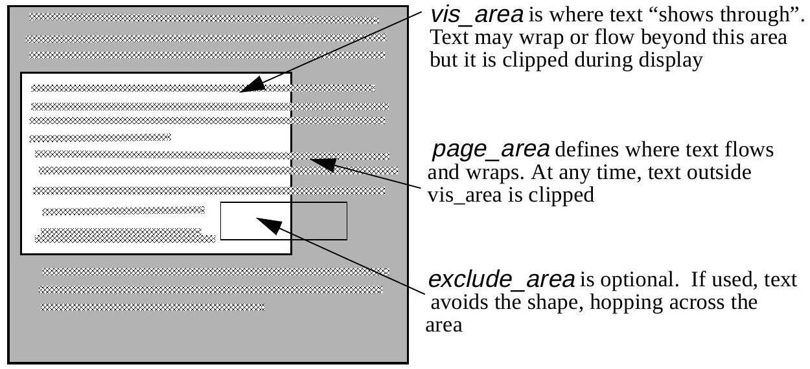

#### MEM_NULL Definition

The value `MEM_NULL` is a defined value in HERMES Paige header files that you should use to imply a "null" `shape_ref` or `memory_ref`—see "The Allocation Manager" on page 25-1.

##### Error checking `pgNew` 

HERMES Paige provides excellent error checking for `pgNew`. See "Exception Handling" on page 26-1.

## 2.7 Up and Running: Shapes

To avoid a lengthy discussion at this time regarding HERMES Paige shapes, we will assume at this time you wish to display text within a simple rectangle (as opposed to some other non-rectangular shape or multiple "container" rectangles).

#### Creating a shape using rectangle

The easiest way to create a new shape is to use the following function:

	(shape_ref) pgRectToShape (pgm_globals_ptr mem_globals, rectangle_ptr rect);

This returns a new `shape_ref` (which can be passed to one of the `area` parameters in `pgNew`). The globals parameter must be a pointer to the same structure given in `pgInit` and `pgNew`.

The `rect` parameter is a pointer to a structure consisting of a top-left and bottom-right coördinate that encloses a rectangle. The coördinate and rectangle definitions are as follows:

```c
typedef struct
{
	long	v;	// vertical position
	long	h;	// horizontal position
}
co_ordinate;

typedef struct
{
	co_ordinate	top_left;	// Top-left of rect
	co_ordinate	bot_right;	// Bottom-right of rect
}
rectangle, *rectangle_ptr;
```

Hence, if you set a rectangle to the desired dimensions and pass a pointer to that rectangle in `pgRectToShape`, a new memory reference is returned which contains a shape of that rectangle.

##### NOTE
The reason `pgNew` requires a `shape_ref` instead of rectangles is that an HERMES Paige object can have non-rectangular shapes for any of its three areas.

For further information regarding shapes, particularly non-rectangular shapes, see chapter 12, [All About Shapes](#12-all-about-shapes).

#### Disposing a Shape

The `pgNew` function makes a copy of the shape you pass to its parameters. Once you have received a new `pg_ref` you can dispose the shape. To do so, call:

```c
void pgDisposeShape (shape_ref the_shape);
```

#### Rect to Rectangle

Two utilities exist that make it easier to create HERMES Paige rectangles:

```c
#include "pgTraps.h"
(void) RectToRectangle (Rect PG_FAR *r, rectangle_ptr pg_rect);
(void) RectantleToRect (rectangle_ptr pg_rect, co_ordinate_ptr offset, Rect PG_FAR *r);
```

`RectToRectangle` converts `Rect r` to rectangle `pg_rect`. The `pg_rect` parameter must be a pointer to a rectangle variable you have declared in your code.

`RectangleToRect` converts `pg_rect` to `r`. Also, if offset is non-null, the resulting `Rect` is offset by the amounts of the `co_ordinate` (for example, if `offset.h` and `offset.v` were 10, -5 the resulting `Mac Rect` would be the values in `pg_rect` with left and right amounts offset by 10 and top and bottom amounts offset by -5.

##### NOTE (Windows)
Type `Rect` is identical to type `RECT`, and both can be used interchangeably.

##### NOTE (Macintosh)
Since a `Mac Rect` has a ±32K limit for all four sides, HERMES Paige rectangle sides larger than 32K will be intentionally truncated to about 30K.

#### About Windows, Graphic Ports and Origins

Although HERMES Paige is designed to be platform-independent, is does assume a target graphics device that all drawing is transferred to.

**When a `pg_ref` is created, the default target device is set to whatever is appropriate for the running platform.** For Macintosh, the default device is the current `GrafPort` set when `pgNew` is called.

##### NOTE (Word Solution Engine for Macintosh)

Unlike WSE, HERMES Paige "remembers" what port it should draw to and all subsequent drawing will occur in that port unless you specifically override it.

For the purpose of getting "Up and Running", just make sure you create your window first and have it set as the current port before calling `pgNew`. In subsequent sections, we will provide different ways to change the target port.

#### Origins

HERMES Paige does not care what a window's origin is set to (top-left `co_ordinate` values). HERMES Paige only cares about the `area` parameters you provide for `pgNew`; remember, HERMES Paige doesn't really know what a window is and doesn't know anything about origins. HERMES Paige simply and only follows the coördinates you have set for `vis_area`, `page_area` and `exclude_area`. If your `page_area` shape passed to `pgNew`, for instance, had a top-left of -10000,-9999, the first character of the first line will be drawn at that coördinate location regardless of where the top-left of your window might physically exist. In other words, HERMES Paige coördinates are always relative to the associated window's coördinates.

## 2.8 Attribute Settings

As mentioned earlier, `pgNew` will accept certain characteristics defined in the "attributes" parameter. The current version supports the following:

```c
#define NO_WRAP_BIT					0x00000001	// Wraps only on <CR> or <LF>
#define NO_LF_BIT						0x00000002	// Do not add font
#define NO_DEFAULT_LEADING	0x00000004	// Do not add font leading
#define NO_EDIT_BIT					0x00000008	// No editing (display only)
#define EXTERNAL_SCROLL_BIT	0x00000010	// App controls scrolling
#define COUNT_LINES_BIT			0x00000020	// Keep track of line, para count
#define NO_HIDDEN_TEXT_BIT	0x00000040	// Do not display hidden text
#define SHOW_INVIS_CHAR_BIT	0x00000080	// Show control characters
#define SMART_QUOTES_BIT		0x00000800	// Do "smart quotes"
#define NO_SMART_CUT_BIT		0x00001000	// Do not do "rt cut/paste"
#define NO_SOFT_HYPHEN_BIT	0x00002000	// Ignore soft hyphens
#define NO_DUAL_CARET_BIT		0x00004000	// Do not show dual carets
#define SCALE_VIS_BIT				0x00008000	// Scale vis_area when scaling
#define BITMAP_ERASE_BIT		0x00010000	// Erase page(s) with bitmap drawing
#define TABS_ARE_WIDTHS_BIT	0x10000000	// Fixed-width tab characters
#define LINE_EDITOR_BIT			0x40000000	// Document is line editor mode
```

`NO_WRAP_BIT` turns off word wrapping (which means a line of text will continue horizontally until a carriage-return or line-feed character is encountered).

`NO_LF_BIT` causes HERMES Paige to ignore line-feed characters. The usual purpose of this setting is for imported text that contains both CR and LF at the end of every line; setting the `NO_LF_BIT` attribute will cause LF characters to be invisible and have no effect of any kind.

`NO_DEFAULT_LEADING` prevents any extra leading reported by the system for font attributes. In Windows, *extra leading* is the external leading value reported by `GetTextMetrics`; in Macintosh, it is the leading value reported by `GetFontInfo`. By default, HERMES Paige adds the extra leading to every line unless this attribute is set.

`NO_EDIT_BIT` disables editing. In effect, if `NO_EDIT_BIT` is set, the "caret" will not blink and the user can't insert characters.

`EXTERNAL_SCROLL_BIT` tells HERMES Paige that your application will control all scrolling. (This fairly complex subject is discussed elsewhere.)

`COUNT_LINES_BIT` tells HERMES Paige to keep track of line and paragraph numbers, in which case you can use the line and paragraph numbering features in HERMES Paige (see section 24.8, [Line and Paragraph Numbering](#24.8-line-and-paragraph-numbering)). Please note that constantly counting lines and paragraphs, particularly if the document is large and contains wordwrapping with style changes, can consume considerable processing time. Hence, `COUNT_LINES_BIT` has been provided to enable/disable this feature.

`NO_HIDDEN_TEXT_BIT` suppresses the display of all text that is "hidden" (HERMES Paige will accept a hidden text attribute as a style). If this bit is not set, hidden text is displayed with a grey strike-through line; if it is set, the text is completely invisible and ignored for line width computations.

`SHOW_INVIS_CHAR_BIT` causes all invisible characters (control codes such as CR and LF) to be displayed using special character symbols. These symbols are defined in `pg_globals` (see section 3.8, [Changing Globals](#3.8-changing-globals)).

`EX_DIMENSION_BIT` tells HERMES Paige to include the exclusion area as part of the "document height".

`NO_WINDOW_VIS_BIT` – Do not respect window's clipped area.

`SMART_QUOTES_BIT` – Do "smart quotes" (curly quotation marks).

`NO_SMART_CUT_BIT` – Do not do "smart cut/paste"

`NO_SOFT_HYPHEN_BIT` – Ignore soft hyphens

`NO_DUAL_CARET_BIT` – Do not show dual carets

`SCALE_VIS_BIT` tells HERMES Paige to scale the `vis_area` along with the text when scaling has been enabled. By default, the `vis_area` is left alone when an HERMES Paige document is scaled, leaving the text "behind" the visual boundaries reduced or enlarged. In certain cases—particularly when employing multiple `pg_ref`s into the same document as "edit boxes"—you need this attribute set; for single `pg_ref` documents that fill all or most of the window, you generally do not want this attribute set.

`BITMAP_ERASE_BIT` tells HERMES Paige to erase area(s) on the page using offsetting bitmap drawing, otherwise the same portions of the screen are erased directly. The purpose of this attribute is to draw "background" graphics in the window when/if HERMES Paige needs to erase the screen.

`TABS_ARE_WIDTHS_BIT` causes all [TAB] characters to display as no more or less than "wide" blanks. For example, if this attribute is not set, a [TAB] character aligns the character(s) that follow to the next logical tab stop; if this attribute is set, a tab character is simply a fixed-width space (the default tab spacing per HERMES Paige globals).

`LINE_EDITOR_BIT` tells HERMES Paige that you intend to maintain the document as a "line editor", defined as one where words will not wrap and all lines remain the same height. If HERMES Paige knows this in advance, it can bypass the usual "pagination" functions and you can achieve substantially increased performance for line editors.

##### NOTE
If you set `LINE_EDITOR_BIT`, you must not set any attributes to wrap the text, nor should you vary the point size(s) or attempt any irregular page shapes or page breaks. You can still produce multi-styled text as long as the text height(s) are consistently the same.

Any (or all) of the above settings can exist at once.

##### NOTE
You can always change these attributes after an HERMES Paige object is created (see section 3.1, [Changing Attributes](#3.1-Changing-Attributes)).

#### Example – `pgNew`

	/* This creates a new HERMES Paige object */
	#include <Paige.h>
	#include "pgTraps.h"
	extern pg_globals paige_rsrv;
	
	// Routine: Open_Window
	// Purpose: Open our window
	/* Note: the window has already been made and will be shown and selected immediately after this function */
		
	void Open_Window(WindowPtr win_ptr)
	{
		if (win_ptr!=nil) /* See if opened OK */
		{
		pg_ref result;
		shape_ref vis, wrap;
		rectangle rect;
		
		/* this sets vis_area and wrap_area to the shape of the window itself */
			
		RectToRectangle(win_ptr->portRect, &rect);
		vis = pgRectToShape(&paige_rsrv, &rect);
		wrap = pgRectToShape(&paige_rsrv, &rect);
		result = pgNew(&paige_rsrv, NULL, vis, wrap, NULL, EX_DIMENSION_BIT);
		}		/* End of IF */
	}

### 2.9 Disposing an HERMES Paige Object

Once you are completely through with a `pg_ref` (e.g., user closes the window), dispose it with:

	(void) pgDispose (pg_ref pg);

This function disposes all data structures within `pg`; the `pg_ref` will no longer be valid.

Be certain you have not shut down the HERMES Paige library before disposing a `pg_ref`, or you will crash.

##### NOTE (Microsoft Foundation Classes)

The best place to destroy the HERMES Paige object is in the OnDestroy() member of your `CView` derived class. Example:

	(.CPP)
	
	void PGView::OnDestroy()
	{
		pgDispose(m_Paige);
		CView::OnDestroy();
	}

## 2.10 Getting the "Globals" Pointer

If you need to obtain the pointer to `pg_globals` (originally given to `pgInit` and to `pgNew`), you can get it from a `pg_ref` using the following:

	(pg_globals_ptr) pgGetGlobals (pg_ref pg);

The typical use for `pgGetGlobals` is to obtain a pointer to `pgGlobals` in places where the original global structure, given to `pg_init`, is not easily accessible.

**FUNCTION RESULT:** This function returns the `globals` pointer as saved in `pg`.

To change globals, see section 3.8, [Changing Globals](3.8-changing-globals).

## 2.11 Displaying

To draw the text in a `pg_ref` to a window, use the following function:

	(void) pgDisplay (pg_ref pg, graf_device_ptr target_device, shape_ref vis_target, shape_ref wrap_target, co_ordinate_ptr offset_extra, short draw_mode);

The `pg_ref`'s contents are drawn to the `target_device`. If, however, you pass a null pointer to `target_device` the text will be drawn to the default device set during `pgNew`. (For the purposes of getting "Up and Running", we will assume you want to draw to the default device, which will typically be a window that was created prior to `pgNew`, so pass a null pointer).

`vis_target` and `wrap_target` parameters are optional shapes which will temporarily redefine the HERMES Paige object's `vis_area` and `wrap_area`, respectively. Using these two parameters, you can temporarily control and/or change the way an HERMES Paige object will display. Text gets clipped to `vis_target`, or, if `vis_target` is a null pointer, to the original `vis_area`, and text will wrap within `wrap_target`, or, if `wrap_target` is `MEM_NULL`, within the original `wrap_area`. (For the purposes of getting "Up and Running", pass MEM_NULL for these two parameters.)

If `offset_extra` is `non-null`, all drawing is offset by the amounts in that coördinate (all text is offset horizontally by `offset_extra -> h` and vertically by `offset_extra -> v`. If `offset_extra` is a null pointer, no extra offset is added to the text.

The `draw_mode` parameter defines the way text should be transferred to the target device. The `draw_mode` selections are shown below.

See section 16.9, [Display Proc](#16.9-Display-Proc), about how to add ornaments to the text display.

##### NOTE

You do not need to specify any drawing device for `pgDisplay` if you intend to display in the window given to `pgNew`. In this case, just pass NULL to the `target_device` parameter.

If for some reason you need to redirect the display to some other window or device (such as a bitmap), you can create a `graf_device` record for that purpose and pass a pointer to that structure for the `target_device`.

Creating a `graf_device` for this purpose is the same as the `graf_device` record used for `pgPrintToPage`. See [Printing in Windows](#Printing-in-Windows) under section 16.5.

#### Draw Modes

```c
typedef enum
{
	draw_none,				// Do not draw at all
	best_way,					// Use most efficient method(s)
	direct_copy,			// Directly to screen, overwrite
	direct_or,				// Directly to screen, "OR"
	direct_xor,				// Directly to screen, "XOR"
	bits_copy,				// Copy offscreen
	bits_or,					// Copy offscreen in "OR" mode
	bits_xor,					// Copy offscreen in "XOR" mode
	bits_emulate_copy	// Copy "fake" offscreen
	bits_emulate_or		// "Fake" offscreen in "OR" mode
	bits_emulate_xor	// "Fake" offscreen in "XOR" mode
};
```

#### "Bits-emulate" Mode

The drawing modes `bits_emulate_copy`, `bits_emulate_or`, and `bits_emulate_xor` are identical to `bits_copy`, `bits_or` and `bits_xor` save that no bitmaps are used and the drawing is directly to the screen. Unlike the non-bitmap drawing modes, however, HERMES Paige's standard callback hooks are called to allow modification to its "bitmap", which in this case is the direct screen. Bitmap modification is typically used to render background images, patterns, and other forms of graphics.

##### NOTE
Unless you need to create a special or unusual effect, always pass `direct_or` or `bits_emulate_or` when responding to `WM_PAINT` (Windows) or an update
event (Macintosh), and `best_way` for all other functions requiring a `draw_mode`.

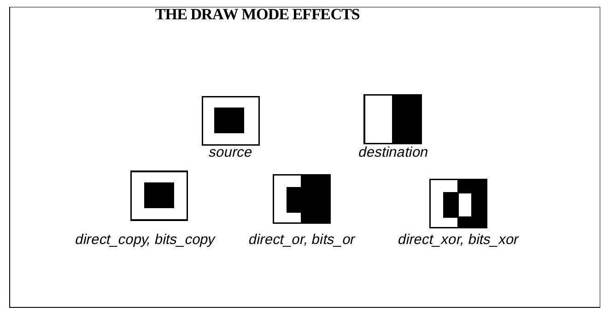

Additional draw modes require the developer to use the custom draw hook and draw his own. For information on how to do custom drawing, *vide* "`text_draw_proc`" under section 27.6, [Function Definitions](#27.6-Function-Definitions).

A value of `draw_none` will disable all drawing and visual scrolling. In other words, if the HERMES Paige document changes in some way, nothing would change on the screen until the application re-displayed the HERMES Paige text contents. The "draw nothing" feature is used only for special cases where an application wants to change without drawing anything yet.

##### Responding to `WM_PAINT` Event (Windows)

```c
{
PAINTSTRUCT ps;
BeginPaint(hWnd, &ps);
pgDisplay(pg, NULL, MEM_NULL, MEM_NULL, NULL, direct_or);
}
EndPaint(hWnd, &ps);
```

To display the HERMES Paige object in MFC, use `OnPaint()`. Do not try to use `OnDraw()` or it will not draw correctly.

#### EXAMPLE

```c++
(.CPP)

void PGView::OnPaint()
{
CWnd::OnPaint();

// If you don't use the OnEraseBkgnd() member of the MFC class, 
// you must erase the background of the window first.

pgDisplay(m_Paige, NULL, MEM_NULL, MEM_NULL, NULL, bits_emulate_or);
}
```

## 2.12 Key Insertion

HERMES Paige actually makes very little distinction between keyboard entry and any other text insertion, and in both cases the following function is used:

```c
(pg_boolean) pgInsert (pg_ref pg, pg_char_ptr data, long length, long position, short insert_mode, short modifiers, short draw_mode);
```

This function will insert length bytes pointed to by data. The insertion will occur at byte offset position if it is positive or zero; if position is `CURRENT_POSITION` (a `#define`d constant of -1), the insertion occurs at the current insertion point.

The `insert_mode` parameter defines the type of data being inserted, which can be any of the following:

```c
typedef enum
{
	key_insert_mode,		// Typing insertion
	key_buffer_mode,		// Typing-buffer insertion
	data_insert_mode,		// Raw data insertion
}
```

For keyboard entry, pass `key_insert_mode` or `key_buffer_mode`; for any other data insertion, pass `data_insert_mode`.

The difference between the two "key" insert modes and `data_insert_mode` is that a key insertion can contain special controls such as arrow keys and backspace (delete). For `data_insert_mode`, the bytes will be inserted as is.

If `key_insert_mode` is used, the new character(s) will draw immediately if `draw_mode` is nonzero.

If `key_buffer_mode` is used, character(s) will be buffered (temporarily saved) and drawn later by HERMES Paige; the purpose of this mode is to avoid "getting ahead" of keyboard entry on complex document entry. It is also useful for Macintosh double-byte script entry, in which the text is entered all at once from a floating palette window.

##### NOTE (Windows)

The `key_buffer_mode` is usually meaningless in the Windows environment; instead, you should always use `key_insert_mode` when processing keyboard characters. Using `key_buffer_mode` (where chars are stored and inserted later) requires a call to `pgIdle` which, under the Windows messaging system, would require you to set up a "timer" message that occurs every few milliseconds, which is probably not implemented in most applications.

If keys are buffered, HERMES Paige will display the new text during the first `pgIdle` function call (see section 2.15, [Blinking Carets and Mouse Selections](#2.15-Blinking-Carets-and-Mouse-Selections)).

##### NOTE
"Arrows" and other control codes are defined (and changeable) in the `pg_globals` record (see section 3.8, [Changing Globals](#3.8-Changing-Globals)); these special controls will be processed correctly for `key_insert_mode` and `key_buffer_mode` only.

The `modifiers` parameter can change the way the `pg_ref` will respond to special control characters for `key_insert_mode` (`modifiers` is ignored for the other insertion modes). In the current version, the following value is supported:

```c
#define EXTEND_MOD_BIT 0x0001	// Extend the selection
```

If `modifiers` is `EXTEND_MOD_BIT`, the selection range is extended if an arrow key is "inserted." Other selection modifier bits are explained in [Modifiers](#2.15-blinking-carets-and-mouse-selections) under section 2.15, "Blinking Carets and Mouse Selections".

The `draw_mode` for `pgInsert` performs identically to `pgDisplay` and can be any of the verbs defined for drawing. If you just want to insert but not display, pass `draw_none` for `draw_mode`. If `key_buffer_mode` is used for insertion, the `draw_mode` is saved and used later when the text is displayed.

For keyboard insertions, the recommended `draw_mode` is `best_way`.

##### CAUTION (Macintosh)
> Mac developers should not confuse these modifier bits with the modifiers given in the event record. There is no similarity. The modifiers shown here are the ones HERMES Paige supports.

##### NOTE
The insertion will assume either the text format of the current insertion point OR the format of the last style/font/format change, whichever is more recent. This is true even if you specify an insert position other than the current point. If you want to force the insertion to be a particular font or style, simply call the appropriate function to change the text format prior to your insertion.

##### FUNCTION RESULT
The function returns `TRUE` if the text and/or highlighting in `pg` changed in any way. Note that no change occurs only if `key_buffer_mode` is passed as the insert mode, in which case the characters are stored and not drawn until the next call to `pgIdle`. Another situation that will not change anything visually is passing `draw_none` as the `draw_mode`. In both cases, `pgInsert` would return `FALSE`. The purpose of this function result is for the application to know whether or not it should update scrollbar values or scroll to the insertion point, etc. (i.e., it is a waste of processing time to check or change scroll positions if nothing changed on the screen).

#### Running Unicode

If you are using the Unicode-enabled HERMES Paige library, the "data" to be inserted is expected to be one or more 16-bit characters. The data size in this case is assumed to be a character count (not a byte count). This is due to the fact that if UNICODE is defined in your preprocessor or header files (which it should be for a true Unicode-enabled application), a `pg_char_ptr` changes from a byte pointer to a 16-bit character pointer.

For example, to insert the Unicode value 0x0041 (letter "A") you would pass the value of 1 in the `length` parameter even though the character size is technically 2 bytes long.

#### TECH NOTE: Insert Positions

The specified insertion position is a zero-relative byte offset. Note that this is a byte—not a "character" offset (characters in HERMES Paige can be more than one byte), rather a byte offset from the beginning of all text in `pg`, starting at zero.

**EXCEPTION:** The pure Unicode version measures everything as 16 bit characters. Hence, the insertion point in this case is a character position.

If one or more characters are currently selected (selection range ≥ one character), those characters are deleted before the insertion occurs. Note that if the specified insertion position were `CURRENT_POSITION`, the insertion will occur to the immediate left of the previously selected text (which will have been deleted).

After the insertion, the new insertion position in `pg` is advanced to length `bytes` from the original specified position. Example: If 100 bytes were inserted at text position 500 when `pgInsert` returns the current insertion position will be 600.

##### APPLIED STYLE(S) AND INSERTION

If `pgInsert` occurs at the current insertion point, whatever the last style and/or font that was applied to that insertion point will be applied to the next insertion.

For example, suppose all text in `pg` is currently "Helvetica" font, and `pg` has a single insertion point (not a selected range of characters). Before inserting new text, a call is made to `pgSetFontInfo` with "Times Roman" font; the very next subsequent `pgInsert` would apply Times Roman—not Helvetica—to the new text.

However, if the insertion occurs somewhere other than the current insertion, the font/style that is applied will be whatever font/style applies to that position in text.

Hence, to implement the insertion of specific, multi-stylized text, the logic to perform should be as follows:

	pgSetStyleInfo(...) - and/or - pgSetFontInfo(...); 
	pgInsert(..., CURRENT_POSITION,...); 
	pgSetStyleInfo(...) - and/or - pgSetFontInfo(...); 
	pgInsert(..., CURRENT_POSITION,...); etc.

**NOTE:** For repetitive insertions, the insertion point will automatically advance the number of bytes you insert, so normally you should not need to set a new position if you are doing repetitive, sequential insertions.

**WARNING:** If you need to apply a specific font or style to a text insertion (such as in the logic above), do not set the insertion point after you set the style/font or that style/font attribute may be lost. If you must set position, do so BEFORE calling pgSetFont/nfo or pgSetStyleInfo.

##### EXAMPLE 

WRONG WAY:

```c
pgSetStyleInfo(...);
pgSetSelection(pg, 0, 0); //<-- previous style setting is lost!
pgInsert(...);
```

RIGHT WAY:

```c
pgSetSelection(pg, 0, 0);
pgSetStyleInfo(...); // <-- Style gets applied to next insertion 
pgInsert(...);
```

#### TECH NOTE: Nothing happens

> >  Nothing seems to happen when I insert text.

If you are doing inserts with `key_insert_mode`, HERMES Paige won't do anything if the `pg_ref` is deactivated. That might be the problem. If so, you need to use `data_insert_mode`, not `key_insert_mode`, and it will then work; `pgInsert` does nothing.

## 2.13 Keyboard Editing with MFC (Windows)

To get *Up and Running* with basic keyboard editing you must add the following code to your MFC view class:

```c++
(.H) 
// Declare the following private variables. 
short m_KeyModifiers;

(.CPP)

// Respond to the windows message WM_KEYDOWN... 
void PGView::OnKeyDown(UINT nChar, UINT nRepCnt, UINT nFlags)
{
pg_globals globals = ((MyWinApp*)AfxGetApp()) -> m_Globals;
pg_short_t verb;

	switch(nChar)
	{
		case VK_SHIFT:
			m_KeyModifiers != EXTEND_MOD_BIT;
			break;
		case VK_CONTROL:
			m_KeyModifiers != CONTROL_MOD_BIT;
			break;
		case VK_LEFT:
			SendMessage(WM_CHAR, globals -> left_arrow_char);
			break;
		case VK_UP:
			SendMessage(WM_CHAR, globals -> up_arrow_char);
			break;
		case VK_RIGHT:
			SendMessage(WM_CHAR, globals -> right_arrow_char);
			break;
		case VK_DOWN:
			SendMessage(WM_CHAR, globals -> down_arrow_char);
			break;
		case VK_HOME:
			verb = begin_line_caret;
			if(m_KeyModifiers & CONTROL_MOD_BIT)
				verb = home_caret;
			if(m_KeyModifiers & EXTEND_MOD_BIT)
				verb != EXTEND_CARET_FLAG;
			pgSetCaretPosition(mPaige, verb, TRUE);
			pgScrollToView(m_Paige, CURRENT_POSITION, 0, 0, TRUE, bits_emulate_or;
			break;
		case VK_END:
			verb = end_line_caret;
			if(m_KeyModifiers & CONTROL_MOD_BIT)
				verb = doc_bottom_caret;
			if(m_KeyModifiers & EXTEND_MOD_BIT)
				verb != EXTEND_CARET_FLAG;
			pgSetCaretPosition(m_Paige, verb, TRUE);
			pgScrollToView(m_Paige, CURRENT_POSITION, 0, 0, TRUE, bits_emulate_or;
			break;
		case VK_PRIOR:
			SendMessage(WM_VSCROLL, SB_PAGEUP);
			break;
		case VK_DELETE:
			if(m_KeyModifiers & EXTEND_MOD_BIT)
			{
				long start, end;
				pg_ref scrap;
				pgGetSelection(m_Paige, &start, &end);
				if(start == end)
					return;
				scrap = pgCut(m_Paige, &start, &end);
				assert(scrap);
				OpenClipboard();
				pgPutScrap(scrap, 0, pg_void_scrap);
				CloseClipboard();
				pgDispose(scrap);
				scrap = MEM_NULL;
				SetChanged();
			}
			else
			{
				SendMessage(WM_CHAR, globals->fwd_delete_char);
			}
		case VK_NEXT:
			SendMessage(WM_VSCROLL, SB_PAGEDOWN);
			break;
			pgScrollToView(m_Paige, CURRENT_POSITION, 0, 0, TRUE, bits_emulate_or);
			break;
	}
}
			break;
		case VK_INSERT:
		{
		if(m_Key_Modifiers & CONTROL_MOD_BIT
			{
				long start, end;
				pg_ref scrap;
				pgGetSelection(m_Paige, &start, &end);
				if(start == end)
					return;
				scrap = pgCopy(m_Paige, NULL);
				assert(scrap);
				OpenClipboard();
				pgPutScrap(scrap, 0, pg_void_scrap);
				CloseClipboard();
				pgDispose(scrap);
			}
		else if(m_KeyModifiers & EXTEND_MOD_BIT)
			{
				pg_ref scrap = MEM_NULL;
				OpenClipboard();
				scrap = pgGetScrap(globals, 0, HookEmbedProc);
				CloseClipboard();
				if scrap
				{
					pgPaste(m_Paige, scrap, CURRENT_POSITION, false, best_way);
					pgDispose(scrap)
				}
			}
		}
		pgScrollToView(m_Paige, CURRENT_POSITION, 0, 0, TRUE, bits_emulate_or);
		break;
	}
}

// Respond to the Windows message WM_KEYUP...
void MyView::OnKeyUp(UINT nChar, UINT nRepCnt, UINT nFlags)
{
	switch(nChar)
	{
		case VK_SHIFT:
			m_KeyModifiers &= (~EXTEND_MOD_BIT);
			break;
		case VK_CONTROL:
			m_KeyModifiers &= (~CONTROL_MOD_BIT);
			break;
	}
}

// Respond to the Windows message WM_CHAR...
void MyView::OnChar(UINT nChar, UINT nRepCnt, UINT nFlags)
{
	pg_char the_char = (pg_char)nChar;
	pgInsert(mPaige, &the_char, 1, CURRENT_POSITION, key_insert_mode, m_KeyModifiers, best_way);
	pgScrollToView(m_Paige, CURRENT_POSITION, 0, 0, TRUE, bits_emulate_or);
}
```

## 2.14 Pending Buffer Insertions

As mentioned in `pgInsert`, if `key_buffer` mode is used, the characters get stored in an internal buffer and get inserted during the next `pgIdle`.

There might be an occassion, however, that requires immediate insertion of anything pending in this buffer. To do so, call the following:

```c
(pg_boolean) pgInsertPendingKeys (pg_ref pg);
```

Calling this function will immediately "empty" any pending characters, inserting and displaying them as appropriate. If there aren't any pending characters, `pgInsertPendingKeys` does nothing. The function returns `TRUE` if one or more characters were inserted.

##### NOTE

The display mode used when HERMES Paige displays the pending buffer will be the original display mode passed to ``pgInsert``.

## 2.15 Blinking Carets and Mouse Selections

### Caret blinking (Macintosh only)

To cause the "caret" to blink in a `pg_ref`, call the following as often as possible:

```c
(pg_boolean) pgIdle (pg_ref pg);
```

##### NOTE (Macintosh): 

`pgIdle` should be called repeatedly while you are waiting for an event.

The `pg` parameter must be a valid `pg_ref` (can not be a null pointer).

**FUNCTION RESULT:** The function returns `TRUE` if character(s) were inserted and displayed that were stored previously from `pgInsert` calls with `key_buffer_mode`. This will only happen if you had called `pgInsert`, passing `key_buffer_mode` as the data transfer parameter. A result of `TRUE` or `FALSE` from `pgIdle` can help your application know whether or not it should update scrollbar values (since new text has been inserted). For Windows `key_buffer_mode` is not usually necessary (see section 2.12, [Key Insertion](#2.12-key-insertion)).

##### NOTE (Windows)
You do not need to call `pgIdle()` since the blinking caret is maintained by the OS. Needlessly calling `pgIdle`, however, is harmless.

### Clicking \& Dragging

Clicking and dragging is accomplished by using the following function:

```c
(long) pgDragSelect (pg_ref pg, co_ordinate_ptr location, short verb, short modifiers, long track_refcon, short auto_scroll);
```

To change the insertion point in a `pg_ref` (i.e., in response to a mouse click), call `pgDragSelect` with the `location` parameter set to the location of the "click." The coördinate values must be local to the window's coördinate system (relative to the top-left window origin).

For **Macintosh**, location should be the same as the "where" member of the `EventRecord`, converted to local coördinates.

For **Windows**, location is usually the coördinates given to you in `lParam` when responding to `WM_LBUTTONDOWN`, `WM_LBUTTONDBLCLK`, or `WM_MOUSEMOVE`.

The `verb` parameter defines what action should occur, which must be one of the following:

```c
enum
{
	mouse_down,		// First-time click
	mouse_moved,	// Mouse moved
	mouse_up,			// Mouse button released
}
```

**NOTE:** `pgDragSelect()` does not retain control at any time—it always returns control immediately regardless of what `verb` is passed.

For the first click, pass `mouse_down` in verb.

In a *Macintosh-specific* application, while the user is holding down the mouse button, wait for the mouse location to change and, if it does, call `pgDragSelect` with the new location but with `verb` as `mouse_moved`.

In a *Windows-specific* application, call `pgDragSelect(mouse_moved)` in response to a `WM_MOUSEMOVE` if the mouse button is still down.

When the mouse button is released, pass the final location and `mouse_up` for `verb`.

##### NOTE
It is important to call `pgDragSelect` with `mouse_up` after the user releases the mouse button *even if the mouse never moved from its original location*. This is because HERMES Paige performs certain housekeeping chores when `mouse_up` is given.

The `modifiers` parameter controls the way text is selected. For "normal" click/drag, pass zero for this parameter; for added effects (such as responding to double-clicks, shift-clicks, etc.), see [Modifiers][#2.15-Blinking-Carets-&-Mouse-Selections] under section 2.15, "Blinking Carets and Mouse Selections".

If `auto_scroll` is `TRUE`, HERMES Paige will automatically scroll the document if `pgDragSelect` (with `verb` as `mouse_moved`) has gone beyond the `vis_area`. See chapter 11, [All About Scrolling](#11-all-about-scrolling). For getting "Up and Running", you can pass `TRUE` for this parameter.

`track_refcon` is used when and if HERMES Paige makes a call to the track-control-callback function. If a style is a "control" (the control bit set for the style class bits field), HERMES Paige calls the tracking control function hook and passes the `track_refcon` to the app. In other words, this value is application-defined and HERMES Paige does nothing with it. For getting "Up and Running", you can pass 0 for this parameter.

##### FUNCTION RESULT

For "normal" mouse tracking, ignore the function result of `pgDragSelect`. The only time the function result is significant is when you have customised a style to be a "control" (information is available on "control" styles under "Customising HERMES Paige”). If you have not customised HERMES Paige in any way, `pgDragSelect` will always return zero.

### Modifiers

The following bit settings are supported for the `modifiers` parameter in this release:

```c
#define EXTEND_MOD_BIT		0x0001	// Extend the selection
#define WORD_MOD_BIT			0x0002	// Select whole words only
#define PAR_MOD_BIT				0x0004	// Select whole paragraphs only
#define LINE_MOD_BIT			0x0008	// Highlight whole lines
#define VERTICAL_MOD_BIT	0x0010	// Allow vertical selection
#define DIS_MOD_BIT				0x0020	// Enable discontinuous selection
#define STYLE_MOD_BIT			0x0040	// Select whole style range
#define WORD_CTL_MOD_BIT	0x0080	// Select "words" delimited by ctrl chars
#define NO_HALF_CHARS_BIT	0x0100	// Do not go left/right on half chars
#define CONTROL_MOD_BIT		0x0200	// Word advance for arrows
```

Various combinations of these bits can generally be set to create the desired effect such as word selections, paragraphs selections, etc., save that vertical selection does not work with the other modifiers. If misused regardless, it will produce unpredictable results.

The following is a description of how text is highlighted in response to each of these bits:

`EXTEND_MOD_BIT` will extend the selection for `verb` of `mouse_down` (otherwise the previous selection is removed). For Macintosh, this is the same as "shift-click" (but you need to determine that from your application and set this bit).

`WORD_MOD_BIT` will select whole words, otherwise only single characters are selected.

`PAR_MOD_BIT` will select whole paragraphs.

This is different than `LINE_MOD_BIT` (below) since a paragraph could contain several lines if word wrapping exists.

`LINE_MOD_BIT` will select whole lines. This differs from `PAR_MOD_BIT` since a paragraph might consist of many lines.

`VERTICAL_MOD_BIT` allows vertical selection. This bit really causes a rectangular region that selects all characters intersecting that region and will not follow any particular character. `VERTICAL_MOD_BIT` is mainly useful for tables and tabular columns.

`DIS_MOD_BIT` allows discontinuous selections. If this bit is set, the previous selection remains and a new selection range is started (HERMES Paige can have multiple selection ranges).

`STYLE_MOD_BIT` causes whole style ranges to become selected. This is similar to word/paragraph/line highlighting except style changes are considered the delimiters (which also means the whole document could be selected in one click if only one style exists).

`WORD_CTL_MOD_BIT` causes text between control characters to be selected. This is similar to word/paragraph/line highlighting except control codes are considered the delimiters.

> **NOTE:** In HERMES Paige "control codes" or "control characters" are not necessarily limited to standard ASCII symbols. Control characters in the HERMES Paige context are defined in `pg_globals` (*vide* section 3.8, [Changing Globals](#3.8-Changing-Globals)).

`NO_HALF_CHARS_BIT` controls whether or not dragging can change the selection point half way into a character. Normally, if this bit is not set, once the mouse moves half way into a character, that character is considered to be "selected" (or unselected if moving in the opposite direction). Setting this bit, however, instructs `pgDragSelect` not to select the character until it has completely crossed over its area.

`CONTROL_MOD_BIT` is used mainly with arrow keys. This causes the selection to advance to the next word (right arrow) or to the previous word (left arrow).

For additional information about highlighting and selection range(s), see chapter 10, [All About Selection](#10 All About Selection).

## 2.16 Click & Drag using Microsoft Foundation Classes (Windows)

To get Up and Running with simple mouse drag select in MFC, use the following code as a starting point:

```c
(.H)
/* Declare the following private variables. Make sure to set m_Dragging to FALSE in the construct to avoid the unintialized variable bug!! */

short m_MouseModifiers;
BOOL m_Dragging;

(.CPP)
// Respond to the Windows message WM_LBUTTONDOWN...
void MyView::OnLButtonDown(UINT nFlags, CPoint point)
{
	CView::OnLButtonDown(nFlags, point);
	co_ordinate mouse { point.y, point.x };
	SetCapture();
	m_Dragging $=$ TRUE;
	if(nFlags & MK_SHIFT)
		m_MouseModifiers != EXTEND_MOD_BIT;
	if(nFlags & MK_CONTROL)
		m_MouseModifiers != PAR_MOD_BIT;
		pgDragSelect(m_Paige, &mouse, mouse_down, m_MouseModifiers, 0, TRUE);
}

// Respond to the Windows WM_MOUSEMOVE message...
void MyView::OnMouseMove(UINT nFlags, CPoint point)
{
	CView::OnMouseMove(nFlags, point);
	co_ordinate pg_mouse = {point.y, point.x};
	if(m_Dragging)
	{
		pgDragSelect(m_Paige, &mouse, mouse_up, m_MouseModifiers, 0, FALSE);
		m_MouseModifiers = 0;
		ReleaseCapture();
		m_Dragging = FALSE;
	}
}
```

#### Responding to Windows mouse events

```c
case WM_LBUTTONDBLCLK:
pg_modifiers = pg_modifiers = WORD_MOD_BIT;

// fall through to WM_LBUTTONDOWN

case WM_LBUTTONDOWN:
if(pgRef)
{
		co_ordinate pg_mouse;
		mouse_contact = TRUE;
		SetCapture(hWnd);
		pg_mouse.h = lParam & OxFFFF;
		pg_mouse.v = ((lParam & OxFFFF0000) >> 16);
	
	if (wParam & MK_SHIFT)
	pg_modifiers != EXTEND_MOD_BIT;
	
	if (wParam & MK_CONTROL)
	pg_modifiers != DIS_MOD_BIT;
	pgDragSelect(pgRef, &pg_mouse, mouse_down, pg_modifiers, 0, TRUE);
}
return 0 ;

case WM_LBUTTONUP:
	if(pgRef)
	{
		co_ordinate pg_mouse;
		pg_mouse.h = lParam & OxFFFF;
		pg_mouse.v = ((lParam & OxFFFF0000) >> 16);
		mouse_contact = FALSE;
		pgDragSelect(pgRef, &pg_mouse, mouse_up, pg_modifiers, 0, FALSE);
		pg_modifiers = 0;
		ReleaseCapture();
	}
return 0;

case WM_MOUSEMOVE:
	if(mouse_contact)
		pgDragSelect(pgRef, &pg_mouse, mouse_moved, pg_modifiers, 0, TRUE);
	else
	{
		pg_view = pgPtInView(pgRef, &pg_mouse, NULL);
		
		if (pg_view & WITHIN_TEXT)
			SetCursor(LoadCursor(NULL, IDC_IBEAM));
		else
			SetCursor(LoadCursor(MULL, IDC_ARROW));
	}
}
return 0;
```

### TECH NOTE: Turn automatic scroll off

To prevent selecting/scrolling you would simply pass FALSE for `pgDragSelect` so it doesn't try to auto-scroll. As far as not letting the user select text outside the visual area, I would simply check to see if the coördinate that will get passed to `pgDragSelect` is outside of the view area and if it is, just force it to some other point that is within the view area.

In fact, you wouldn't even need to turn off auto-scroll if you forced the coördinate to always be within the visual area. Remember, you have complete control over `pgDragSelect` (control always comes back to you unlike, say, `TrackControl` on Macintosh) so there is no reason you can't adjust the "mouse" point for each pass.

### TECH NOTE: Problems with mouse clicks -1 (Mac only)

> I have big troubles handling mouse clicks in the HERMES Paige object within my class library. If I get a click (with `GetMouse(&hitPt)`) and do the following (testing a response to a simple click)...

Your test code sample should work. Therefore, I have to conclude there is something wrong with the mouse point you obtain with `GetMouse()`.

I would guess that you are doing a `GetMouse()` without regards to the current `GrafPort`. Since `GetMouse()` returns a `LOCAL` point (based on current port's coördinates), if you don't have the correct `GrafPort` set you will get some other coördinate system. Worst case, you are getting "global" coördinates which will be completely different than what you expect.

Or, another possibility might have to do with the window's "origin". I know that some class libraries muck with this to create scrolling effects.

What you need to do is to check what the actual values of `point.h` and `point.v` really are. I know that `pgDragSelect` works; in fact, you should see the caret immediately appear at the point you give for `mouse_down` verb.

BTW, the usual (best) way for dragging the mouse in a `pg_ref` is to get the click right out of the `EventRecord.where` field (first doing a `GlobalToLocal` on it). That is by far the most accurate -- but I do not know if that `EventRecord` is easily available in your class library.

## 2.17 Activate/Deäctivate

To deäctivate a `pg_ref` (to cause highlighting or the "caret" to disappear), call the following function:

	(void) pgSetHiliteStates (pg_ref pg, short front_back_state, short perm_state, pg_boolean show_hilite);

In a "window" environment, where different windows can overlap, it is usually desirable to disable any HERMES Paige objects that are not contained in the front most window. To do so, `pgSetHiliteState` can be called to turn off the highlighting or the "caret."

An HERMES Paige object, however, contains two highlight states, one for "front/back" activate and deactivate and one to disable a `pg_ref` in both states. For "normal" applications, you will only be changing the front/back highlight state (activate or deactivate a `pg_ref` according to its window position). The purpose of the alternate highlight state is to provide a way to disable a `pg_ref` completely regardless of its window position.

The `front_back_state` should be one of the following values:

	typedef enum
	{
		no_change_verb,	// State stays the same
		activate_verb,	// Set to activate mode
		deactivate_verb,	// Set to deactivate mode
	}


The `perm_state` parameter provides an alternate highlight state setting; this parameter can also be any of the above. For getting "Up and Running," however, pass `no_change_verb` for this parameter.

If `show_hilite` is `TRUE`, the highlighting (or caret) will redraw according to `pg`'s new state. A `FALSE` value will activate or deactivate `pg` internally (by setting special flags within the `pg_ref`) but the highlighting or caret will remain unchanged. For getting "Up and Running", always pass `TRUE` for `should_draw`.

See also section 10.4, [Additional Selection Support](#10.4-Additional-Selection-Support) and "Activate/Deactivate with shape of selection still showing"<!-- on page 10-13-->.

### Responding to `WM_SETFOCUS` and `WM_KILLFOCUS` messages

	{
	case WM_KILLFOCUS:
		pgSetHiliteStates(pgRef, deactivate_verb, no_change_verb, TRUE);
	
	case WM SETFOCUS:
		pgSetHiliteStates(pgRef, activate_verb, no_change_verb, TRUE);
	}

### Getting the Highlight State

If you want to know what state a `pg_ref` is in, call the following:

	(void) pgGetHiliteStates (pg_ref pg, short PG_FAR *front_back_state, short PG_FAR *perm_state);

The front/back highlight state will be returned in `front_back_state` and the alternate state in `perm_state`. Both parameters will be set to either `activate_verb` or `deactivate_verb`.

##### NOTES

1. If the highlight status is already set to what is specified in your parameters (e.g., if you are deactivating a `pg_ref` that is already deactivated or vice versa), this function does nothing.
2. A `pg_ref` returned from `pgNew` is set to an active state.
3. If a `pg_ref` is in a deactivate state, the caret will not blink even if you call pgIdle and highlighting will not draw.

### TECH NOTE

> Why two activate states?

One is for regular activate/deactivate for a window; the other is to *force* deactivation regardless of the window's front/behind state. Haven't you ever been in a situation where you want to deactivate selections but the window is still in front? Using two possible states, it becomes easier to do that. The two states are logically `AND`ed logic for activation: both must be true or the document is deactivated.

#### MFC NOTE 

**IMPORTANT:** You must activate and deactivate the HERMES Paige object in the MFC `OnSetFocus()` and `OnKillFocus()` before any of the functions in this chapter will work.

#### Example:

	(.CPP)
	
	// Respond to Windows message WM_SETFOCUS...
	void MyView::OnSetFocus(CWnd* pOldWnd)
	{
		CView::OnSetFocus(pOldWnd);
		pgSetHiliteStates(m_Paige, activate_verb, no_change_verb, TRUE);
	}
	
	// Respond to Windows message WM_KILLFOCUS...
	void MyView::OnKillFocus(CWnd* pNewWnd)
	{
		pgSetHiliteStates(m_Paige, deactivate_verb, no_change_verb, TRUE);
		CView::OnKillFocus(pNewWnd);
	}


​	

# 3 BEYOND THE DEFAULTS

The purpose of this section is to explain some of the more common additions and/or changes to the "bare minimum" implementation discussed in the previous section, "Up and Running."

## 3.1 Changing Attributes

There will be situations where you want to change the attributes of an HERMES Paige object after it is created (these are the bits initially passed to `pgNew` for the "attributes" parameter). There are also situations where you want to examine the current attributes (to tick a menu item, for instance). To do so, use the following:

```c
(long) pgGetAttributes (pg_ref pg);
(pg_boolean) pgSetAttributes (pg_ref pg, long attributes);
```

To obtain the current attribute bits, call `pgGetAttributes`.

**FUNCTION RESULT:** The function result will be the current setting(s) of pg.

To change the attributes, call `pgSetAttributes` with attributes set to the new bit value(s).

HERMES Paige "attributes" are defined as bit settings which can be a combination of any bit values shown below:

```C
#define NO_WRAP_BIT					0x00000001	// Wraps only on CR or LF
#define NO_LF_BIT						0x00000002	// <LF> char ignored
#define NO_DEFAULT_LEADING	0x00000004	// Do not add font leading
#define NO_EDIT_BIT					0x00000008	// No editing (display only)
#define EXTERNAL_SCROLL_BIT	0x00000010	// App controls scrolling
#define COUNT_LINES_BIT			0x00000020	// Track line/para count
#define NO_HIDDEN_TEXT_BIT	0x00000040	// Do not display hidden text
#define SHOW_INVIS_CHAR_BIT	0x00000080	// Show invisible character(s)
#define EX_DIMENSION_BIT		0x00000100	// Exclude width/height
#define NO_WINDOW_VIS_BIT		0x00000200	// Do not respect clipped area
#define SMART_QUOTES_BIT		0x00000800	// Do "smart" quotes
#define NO_SMART_CUT_BIT		0x00001000	// Do not do "smart" cut/paste
#define NO_SOFT_HYPHEN_BIT	0x00002000	// Ignore soft hyphens
#define NO_DUAL_CARET_BIT		0x00004000	// Do not show dual carets
#define SCALE_VIS_BIT				0x00008000	// Scale vis_area when scaling
#define BITMAP_ERASE_BIT		0x00010000	// Erase page(s) with bitmap drwg
#define TABS_ARE_WIDTHS_BIT	0x10000000	// Tab chars are merely wides
#define LINE_EDITOR_BIT			0x40000000	// Doc is line editor mode
```

These are described in section 2.8, [Attribute Settings](#2.8-attribute-settings).

**FUNCTION RESULT:** After calling `pgSetAttributes`, the function result will be `TRUE` if `pg` should be redrawn. The only time `TRUE` is returned is when one or more attributes have been set that will affect the way text is drawn or the way word wrap is computed.

**WARNING:** Before setting attributes, first get the current settings from the function `pgGetAttributes` and change the bits you require and pass that whole long value to `pgSetAttributes`. Otherwise, the `view only` bits will get changed erroneously.

## 3.2 Extended Attribute Flags

Additional attributes can be set for more advanced features using the following `set` and `get` functions:

```C
(pg_boolean) pgSetAttributes2 (pg_ref pg, long attributes); (long) pgGetAttributes2 (pg_ref pg);
```

To obtain the current, extended attribute bits, call `pgGetAttributes2`.

**FUNCTION RESULT:** The function result will be the current setting(s) of the extended attributes of `pg`.

To change the extended attributes, call `pgSetAttributes2` with attributes set to the new bit value(s).

HERMES Paige "extended attributes" are defined as bit settings which can be a combination of any of the following.

```c
#define KEEP_READ_STYLES		0x00000200	// Keep existing style_infos for pgReadDoc()
#define KEEP_READ_PARS			0x00000400	// Keep existing par_infos for pgReadDoc()
#define KEEP_READ_FONTS			0x00000800	// Keep existing font_infos for pgReadDoc()
#define CHECK_PAGE_OVERFLOW	0x00002000	// Constantly check page overflow
#define NO_HAUTOSCROLL			0x00080000	// Do not autoscroll horizontally
#define NO_VAUTOSCROLL			0x00100000	// Do not autoscroll vertically
```

`KEEP_READ_STYLES` tells HERMES Paige to not remove existing `style_info` records from the `pg_ref` when a file is read. Normally, all existing style records are replaced with the styles read from an HERMES Paige file. This attribute is used to retain the existing styles.

`KEEP_READ_PARS` tells HERMES Paige to not remove existing `par_info` records from the `pg_ref` when a file is read. Normally, all existing paragraph records are replaced with the paragraph records read from an HERMES Paige file. This attribute is used to retain the existing paragraph records.

`KEEP_READ_FONTS` tells HERMES Paige to not remove existing `font_info` records from the `pg_ref` when a file is read. Normally, all existing font records are replaced with the fonts read from an HERMES Paige file. This attribute is used to retain the existing fonts.

`CHECK_PAGE_OVERFLOW` tells HERMES Paige to constantly test the position of the last character in the document and, if it overflows the bottom of the `page_area`, sets an internal field to the number of characters that have overflowed. The purpose of this attribute is to allow an application to implement features that require "page overflow checking", but since this requirement requires constant pagination and extra processing, set this attribute only when absolutely necessary.

`NO_HAUTOSCROLL`, `NO_VAUTOSCROLL` tells HERMES Paige not to automatically scroll horizontally or vertically, respectively, when `pgDragSelect()` is called.

## "Auto-checking" page overflow

Setting `CHECK_PAGE_OVERFLOW` with `pgSetAttribute2()` causes HERMES Paige to continuously check the situation where character(s) flow below the boundaries of the page area. If this attribute is set, the `overflow_size` member within the `pg_ref` get set to the number of characters that overflow the page.

Or, if `overflow_size` is set to -1, a single carriage return is causing the overflow (i.e., the text overflows but the overflow is a "blank" line).

**NOTE:** The auto-checking for page overflow is meaningless if your `pg_ref` is set for repeating pages, or if your `pg_ref` is set to a variable page size. The only time overflow checking will work (or make any sense) is for fixed-size, nonrepeating page shapes.

## Checking page overflow

**NOTE:** You should not implement this code if your `pg_ref` is set for repeating pages, or if your `pg_ref` is set for a variable document height.

	/* Call the function below after doing anything that can change the size of the document. This included insertions, deletions, style and font changes (which can cause new word wrapping) and page size changes. This function returns the number of characters that are overflowing the page area of pg. */
	
	/* Note: CHECK_PAGE_OVERFLOW must be set with pgSetAttributes2(pg). */
	
	long CheckPageOverflow (pg_ref pg)
	{
		paige_rec_ptr pg_rec;
		long_overflow_amount;
		
		pg_rec = UseMemory(pg);
		overflow_amount = pg_rec->overflow_size;
		UnuseMemory(pg);
		
		return overflow_amount;
	}

### TECH NOTE: Carriage return/line feeds causing problems

Regarding LF/CR characters, HERMES Paige handles both of them as a "new line" except a CR. It also starts a new paragraph, but for LF it just does a line feed.

Note that lines that terminate both in LF and CR will cause *two* lines on the screen — at least in HERMES Paige default mode.

You can turn that off, however, if you want LF/CR to be treated as only one líne feed.' To do so, just set `NO_LF_BIT` in the HERMES Paige attribute flags during `pgNew`. When this attribute is set, HERMES Paige ignores all LFs embedded in the text (they become invisible).

Note that I haven't mentioned what the values are for LF and CR, because those are whatever values sit in HERMES Paige globals. Also as mentioned, MPW will compile `\r` etc. differently than Symantec so watch out for that. See technical note [CR/LF Conversion](#tech-note:-cr/lf-conversion) and section 3.8, [Changing Globals](#3.8-changing-globals).

## 3.3 A Different Default Font, Style, Paragraph

Any time a new `pg_ref` is created, HERMES Paige sets the initial `style_info`, `font_info` and `par_info` (style, font and paragraph format) to whatever exists in the corresponding field from `pg_globals`.

Hence, to set default style, font or paragraph format, simply change the respective information in `pg_globals` (see example below).

To change the default style information, change field(s) in `pg_globals.def_style`; to change the default font, change field(s) in `pg_globals.def_font`; to change the default paragraph format, change field(s) in `pg_globals.def_par`.

You can also set the default low-level callback "hook" functions for style or paragraph records, and even the general HERMES Paige functions by placing a pointer to the new function in the respective `pg_globals` field. See chapter 27, [Customising HERMES Paige](#27-customising-hermes-paige).

For example, if you wanted to override the draw-text callback function always for all styles, you would change the default draw-text function in the default style found in `pg_globals` before your first call to `pgNew` (but after `pgInit`:

	pg_globals.def_style.procs.draw = myTextDrawProc;

... where `myTextDrawProc` is a low-level callback to draw text (*vide* section 27.4, [Setting Style Functions](#27.4-Setting-Style-Functions)). If you did this, every new `style_info` record created by HERMES Paige will contain your callback function.

The default hooks for general callbacks not related to styles or paragraph formats are in `pg_globals.def_hooks`.

See a complete description of `style_info`, `font_info` and `par_info` records in chapter 8, [Style Basics](#8-style-basics).

### Change defaults after they are created using `pgInit`.

These changes will apply to all `pgNew`s that are called later.

	void ApplInit()	// Initialisation of the App
	{
		pgMemStartup(&mem_globals, 0);
		pgInit(&paige_rsrv, &mem_globals);
		
		/* change to make the default for all pg_refs created herein after 
		9 point instead of 12 point is a fraction with hi word being a 
		point is a fraction with hi word being the whole point value /*
		
		paige_rsrv.def_style.point = 0x00090000;
	}


### Default tab spacing

You can also change the default spacing for tabs (the distance to the next tab if no specific tab stops have been defined in the paragraph format). To do so, change `globals.def_par.def_tab_space`.

	/* The following code changes the default tab spacing (for all subsequent pg_refs) to $32. */
	
	pgMemStartup(&mem_globals, 0);
	pgInit(&paige_rsrc, &mem_globals);
	paige_rsrv.def_par.def_tab_space $=32$;

## 3.4 Graphic Devices

As mentioned earlier, a newly created HERMES Paige object will always draw to a default device; in a Macintosh environment, for instance, the default device will be the current port that is set before calling `pgNew`. In a Windows environment, the default device will be an HDC derived from `GetDC(hWnd)`, where `hWnd` is the window given to `pgNew`.

### Setting a device

It is possible that you will want to change that default device once a HERMES Paige object has been created. To do so, call the following function:

	(void) pgSetDefaultDevice (pg_ref pg, graf_device_ptr device);

The `device` parameter is a pointer to a structure which is maintained internally (and understood) by HERMES Paige. (Generally, you won't be altering its structure directly, but the record layout is provided at the end of this section for your reference.)

The contents and significance of each field in a `graf_device` depends on the platform in which HERMES Paige is running. However, a function is provided for you to initialise a `graf_device` regardless of your platform:

	(void) pglnitDevice (pg_globals_ptr globals, generic_var the_port, long machine_ref, graf_device_ptr device);

The above function sets up an HERMES Paige graphics port which you can then pass to `pgSetDefaultDevice` (you can also use `pgInitDevice` to set up an alternate port that can be passed to `pgDisplay`).

The `globals` parameter is a pointer to the same structure you passed to `pgInit`.

The actual (but machine-dependent) graphics port is passed in `the_port`; what should be put in this parameter depends on the platform you are working with, as follows:

* **Macintosh** (and PowerMac) — `the_port` should be a `GrafPtr` or `CGrafPtr`; `machine_ref` should be zero.
* **Windows** (all OS versions) — `the_port` should be an `HWND` and `machine_ref` should be `MEM_NULL`. Or, if you only have a device context (but no window), `the_port` should be `MEM_NULL` and `machine_ref` the device context. See sample below.

The `device` parameter must be a pointer to an uninitialised `graf_device` record. The function will initialise every field in the `graf_device`; you can then pass a pointer to that structure to `pgSetDefaultDevice`.

#### NOTES

1. If you specified a window during `pgNew()` and want the `pg_ref` to continue displaying in that window, the "default device" is already set, so you do not need to use these functions. The only reason you would/should ever set a default device is if you want to literally change the window or device context the `pg_ref` is associated with.

2. HERMES Paige makes a copy of your `graf_device` record when you call `pgSetDefaultDevice`, so the structure does not need to remain static. But the graphics port itself (`HWND` or `HDC` for Windows, or `GrafPtr` for Mac) must remain “open” and valid until it will no longer be used by HERMES Paige.

3. If you need to temporarily change the `GrafPtr` (Macintosh) or device context (Windows), see "Quick & easy `set-window`"<!-- on page 3-72 in this chapter-->.

**CAUTION:** Do not set the same `graf_device` as the "default device" to more than one `pg_ref`. If you need to set the same window or device context to more than one `pg_ref`, create a new `graf_device` for each one.

### Setting up a `graf_device` for Windows

#### EXAMPLE 1: Setting up a `graf_device` from a Window handle (HWND)

	graf_device device;
	
	pgInitDevice(&paige_rsrv, (generic_var)hWnd, MEM_NULL, &device);
	pgSetDefaultDevice(pg, &device);
	
	//... other code, draw, paint, whatever.
	
	pgCloseDevice(&paige_rsrv, &device);

#### EXAMPLE 2: Setting up a `graf_device` from a device context only (HDC):

	graf_device device;
	
	pgInitDevice(&paige_rsrv, MEM_NULL, (generic_var)hDC, &device);
	pgSetDefaultDevice(pg, &device);
	
	//... other code, draw, paint, whatever.

### Setting default device on the Macintosh

	/* This function accepts a pg_ref (already created) and a Window pointer. The Window is set to pg's default drawing port, so after a call to this function, all drawing will occur in a new window. */
	
	void set_new_paige_port (pg_ref pg, WindowPtr new_port)
	{
		graf_device paige_port;
		pgInitDevice(&paige_rsrv, new_port, 0, &paige_point);
		pgSetDefaultDevice(pg, &paige_port);
	}
	
	/* Done. HERMES Paige makes a copy of paige_port so it does not need to be static */

If you want to obtain the current default device for some reason, you can call the following:

	(void) pgGetDefaultDevice (pg_ref pg, graf_device_ptr device);

The device is copied to the structure pointed to by `device`.

### Disposing a device

If you have initialised a `graf_device`, followed immediately by `pgSetDefaultDevice()`, you do not need to deïnitialise or dispose the `graf_device`.

If, however, you have initialised a `graf_device` that you are keeping around for other purposes, you must eventually dispose its memory structures. To so call the following:

	(void) pgCloseDevice (pg_globals_ptr globals, graf_device_ptr device);

This function disposes all memory structure created in device when you called `pgInitDevice`. The `globals` parameter should be a pointer to the same structure given to `pgInit`.

#### NOTES:

1. `pgCloseDevice` does not close or dispose the `GrafPort` (Macintosh) or the HWND/HDC (Windows) — you need to do that yourself.

2. You should never dispose a device you have set as the default device because `pgDispose` will call `pgCloseDevice`. The only time you would use `pgCloseDevice` is either when you have set up a `graf_device` to pass as a temporary pointer to `pgDisplay` (or a similar function that accepts a temporary port) in which HERMES Paige does not keep around, OR when you have changed the default device (see note below).

3. Additionally: HERMES Paige does not dispose the previous default device if you change it with `pgSetDefaultDevice`. Thus, if you change the default you should get the current device (using `pgGetDefaultDevice`), set the new device then pass the older device to `pgCloseDevice`.

### Quick \& easy `set-window`

In certain situations you might want to temporarily change the window or device context a `pg_ref` will render its text drawing. While this can be done by initialising a `graf_device` and giving that structure to `pgSetDefaultDevice()`, a simpler and faster approach might be to use the following functions:

	generic_var pgSetDrawingDevice (pg_ref pg, const generic_var draw_device);
	void pgReleaseDrawingDevice (pg_ref pg, const generic_var previous_device);

The purpose of `pgSetDrawingDevice` is to temporarily change the drawing device for a `pg_ref`. The `draw_device` parameter must be a `WindowPtr` (Macintosh) or a device context (Windows).

The function returns the current device (the one used before `pgSetDrawingDevice`).

**NOTE:** "device" in this case refers to a machine-specific device, not a `graf_device` structure.

You should call `pgReleaseDrawingDevice` to restore the `pg_ref` to its previous state. The `previous_device` parameter should be the value returned from `pgSetDrawingDevice`.

### Temporarily changing the HDC (Windows)

	/* This function forces a pg_ref to display inside a specific HDC instead of the default. */
	
	void DrawToSomeHDC (pg_ref pg, HDC hDC)
	{
		generic_var old_dc;
		old_dc = pgSetDrawingDevice(pg, (generic_var)hDC);
		pgDisplay(pg, NULL, MEM_NULL, MEM_NULL, NULL, best_way); 
		pgReleaseDrawingDevice(pg, old_dc);
	}

### Setting a Scaled Device Context (Windows only)

On a Windows platform, in certain cases you will want to preset a device context that needs to scale all drawing. However, using the standard function to set a device into an HERMES Paige object (`pgSetDrawingDevice`) will not work in this case because HERMES Paige will want to clear your mapping mode(s) and scaling factor(s).

The solution is to inform HERMES Paige that you wish to set your own device context, but to include a scaling factor:

	generic_var pgSetScaledDrawingDevice (pg_ref pg, const generic_var draw_device, pg_scale_ptr scale);

This is identical to `pgSetDrawingDevice()` except that it contains the additional parameter `scale` which specifies the scaling factor. For more information on HERMES Paige scaling, see the appropriate section(s).

## 3.5 Colour Palettes (Windows-specific)

	void pgSetDevicePalette (pg_ref pg, const generic_var palette); generic_var pgGetDevicePalette (pg_ref pg);

These Windows-specific functions are used to select a custom palette into the device context of a `pg_ref`. To set a palette, call `pgSetDevicePalette()` and pass the `HPALETTE` in `palette`. If you want to clear a previous palette, pass `(generic_var)O`.

Setting a palette causes HERMES Paige to select that palette every time it draws to its device context.

To obtain the existing palette (if any), call `pgGetDevicePalette()`

**CAUTION:** Do not delete the palette unless you first clear it from the `pg_ref` by calling `pgSetDevicePalette(pg, (generic_var)0)`.

**CAUTION:** If you change the default device (`pgSetDefaultDevice`), you need to set the custom palette again.

**NOTE:** HERMES Paige does not delete the `HPALETTE`, even during `pgDispose()`. It is your responsibility to delete the palette.

## 3.6 Changing Shapes

You can change the `vis_area`, the `page_area` and/or the `exclude_area` of an HERMES Paige object at any time (see section 2.6, [Creating a HERMES Paige Object](#2.6-creating-a-hermes-paige-object), for a description of each of these parameters):

	(void) pgSetAreas (pg_ref pg, shape_ref vis_area, shape_ref page_area, shape_ref exclude_area);

The `vis_area`, `page_area`, and `exclude_area` are functionally identical to the same parameters passed in `pgNew`. Of course, you could have passed any of these shapes in `pgNew`, but the purpose of `pgSetAreas` is to provide a way to change the visual area and/or wrap area and/or exclusion areas some time after an HERMES Paige object has been created.

Any of the three `_area` parameters can be `MEM_NULL`, in which case that shape remains unchanged.

Subsequent drawing of `pg`'s text will reflect the changes, if any, produced by the changed shape(s).

A typical reason for changing shapes would be, for example, to implement a "set columns" feature. The initial HERMES Paige object might have been a simple rectangle ("normal" documents), but let us suppose that the user later wishes to change the document to three columns. To do so, you could set up a `page_area` shape for three columns and pass that new shape to `page_area` and null pointers for the other two areas. The HERMES Paige object, on a subsequent `pgDisplay`, would rewrap the text and flow within these "columns."

#### NOTES

1. If your area(s) are simple rectangles, it may prove more efficient to use `pgSetAreaBounds()` in this chapter.

2. If you simply want to "grow" the `vis_area` (such as responding to a user changing the window’s size), see ["Growing" The Visual Area](#"Growing"-The-Visual-Area) under section 3.6 for information on `pgGrowVisArea`.

3. HERMES Paige makes a copy of the new shape(s) you pass to `pgSetAreas`. You can therefore dispose these shapes any time afterwards.

For information on constructing various shapes, see chapter 12, [All About Shapes](#12-All-about-shapes).

If you are implementing containers, see chapter 14, [Containers Support](#14-Containers-Support).

### "Growing" The Visual Area

If you want to change the `vis_area` (area in which text displays) in response to a user enlarging the window's width and height, call the following:

	(void) pgGrowVisArea (pg_ref pg, co_ordinate_ptr top_left, co_ordinate_ptr bot_right);

The size of `vis_area` shape in `pg` is changed by adding `top_left` and `bot_right` values to `vis_area`'s top-left and bottom-right corners, respectively.

By "adding" is meant the following: `top_left.v` is added to `vis_area`'s top and `top_left.h` is added to `vis_area`'s left; `bot_right.v` is added to `vis_area`'s bottom and `bot_right.h` is added to `vis_area`'s right.

**NOTE:** This function adds to (or "subtracts" from, if coördinate parameters are negative) the visual area rather than setting or replacing the visual area to the given coördinates.

Either `top_left` or `bot_right` can be null pointers, in which case they are ignored.

**NOTE:** This function only works correctly if `vis_area` is rectangular; if you have set a non-rectangular shape, you need to reconstruct your `vis_area` shape and change it with `pgSetAreas`.

#### Responding to WM SIZE message (Windows)

```c
case WM_SIZE:
	if (pgRef)
	{
		rectangle vis_bounds;
		co_ordinate amount_to_grow;
		long old_width, new_width, old_height, new_height;
		pgAreaBounds(pgRef, NULL, &vis_bounds);
		new_width = (long) LOWORD(lParam);
		new_height = (long) HIWORD(lParam);
		old_width = vis_bounds.bot_right.h - vis_bounds.top_left.h;
		old_height = vis_bounds.bot_right.v - vis_bounds.top_left.v;
		amount_to_grow.h = new_width - old_width;
		amount_to-grow.v = new_height - old_height;
		pgGrowVisArea(pgRef, NULL, (co_ordinate_ptr) &amount_to_grow);
	}
break;
```

## 3.7 Getting information about shapes

### Getting Current Shapes

To obtain any of the three shapes in a HERMES Paige object, call the following:

```c
(void) pgGetAreas (pg_ref pg, shape_ref vis_area, shape_ref page_area, shape_ref exclude_area);
```

The `vis_area`, `page_area`, `exclude_area` must be pre-created `shape_ref`s (see below). Any of them, however, can be `MEM_NULL` (in which case that parameter is ignored).

This function will copy the contents of `pg`'s visual area, wrap area, and exclude area into `vis_area`, `page_area` and exclude_area, respectively, if that parameter is non-null.

Helpful hint: The easiest way to create a `shape_ref` is to call `pgRectToShape` passing a null pointer to the `rect` parameter, as follows:

	shape_ref new_shape;
	new_shape = pgRectToShape(&paige_rsrv, NULL);

The `paige_rsrv` parameter in the above example is a pointer to the same `pg_globals` passed to `pgInit`. By providing a null pointer as the second parameter, a new `shape_ref` is returned with an empty shape (all sides zero).

### 'Get/Set Areas' Trick

If you are using simple rectangles for the visual area or wrap (page) area in an HERMES Paige object, and/or if you simply want to know the bounding rectangular area of either shape, use the following instead of `pgGetAreas`:

	(void) pgAreaBounds (pg_ref pg, rectangle_ptr page_bounds, rectangle_ptr vis_bounds);

When `pgAreaBounds` is called, `page_bounds` gets set to a rectangle that encloses the entire `page_area` and `vis_bounds` gets set to a rectangle that encloses the entire `vis_area` of `pg`.

If you don't want one or the other, either `page_bounds` or `vis_bounds` can be a null pointer.

This function is useful when you simply want the enclosing bounds of either shape because you do not need to create a `shape_ref`.

You can also set the page area and/or vis area by calling `pgSetAreaBounds`, which accepts a pointer to a rectangle in `page_bounds` and `vis_bounds` (of which either can be a null pointer). Note that this is faster and simpler than `pgSetAreas`, except that it only works provided that the shape(s) are single rectangles.

### Direct Shape Access

You can also access the `shape_ref`s in an HERMES Paige object directly using any of the following:

	(shape_ref) pgGetPageArea (pg_ref pg);
	(shape_ref) pgGetVisArea (pg_ref pg);
	(shape_ref) pgGetExcludeArea (pg_ref pg);

These three functions will return the `shape_ref` for `page_area`, `vis_area` and `exclude_area`, respectively. Neither will ever return `MEM_NULL` (even if you provided `MEM_NULL` for `exclude_area` in `pgNew`, for instance, HERMES Paige will still maintain a `shape_ref` for the exclusion, albeit an empty shape).

The purpose of these functions is for special applications that need to look inside of HERMES Paige shapes as quickly and as easily as possible.

**CAUTION:** These functions return the actual `memory_ref`s for each shape. You must therefore never dispose of them, nor should you alter their contents (or else HERMES Paige won't know you have changed anything and word wrapping and display will fail). If you want to alter the contents of HERMES Paige shapes, see chapters 14, [Containers Support](#14-containers-support), and 15, [Exclusion Areas](#15-exclusion-areas).

### Getting Shape Rectangle Quantity

You can find out how many rectangles comprise any shape by calling the following:

	(pg_short_t) pgNumRectsInShape (shape_ref the_shape);

The function will return the number of rectangles in `the_shape`.

**NOTE:** The result will always be at least 1, even for an empty shape. Any "empty" shape is still one rectangle whose boundaries are $0,0,0,0$. If you need to detect whether or not a shape is empty, call:

	(pg_boolean)pgEmptyShape(the_shape); /* Returns TRUE if empty */


## 3.8 Changing Globals

As mentioned several times, your application provides a pointer to `pgInit` (and other places) to be used by HERMES Paige to store certain global variables. This structure is initially set to certain default values, but you can make certain changes that apply to your particular application.

For example, HERMES Paige globals contain the values for special control codes such as CR, LF, and arrow keys, but there are instances when you need to change some of these "characters" to a different value.

Another (more common) reason to change HERMES Paige globals is to force a default text or paragraph format for all subsequent `pgNew()` calls.

Since your application maintains the globals record, there are no functions provided to change its contents; rather, you alter the structure's contents directly some time after `pgInit`.

**NOTE:** The entire HERMES Paige globals structure can be viewed in `paige.h`. Only the members of this structure that you are allowed to alter are shown unless noted otherwise.

```c
/* Paige "globals" (address space provided by app): */

struct pg_globals
{
	pgm_globals_ptr	mem_globals;				// Globals for pgMemManager
	long				max_offscreen;					// Maximum memory for offscreen
	long				max_block_size;					// Maximum size of text block
	long				minimum_line_width;			// Minimum size line width
	long				def_tab_space;					// Default tab spacing for pgNew
	pg_short_t	line_wrap_char;					// <CR> character
	pg_short_t	soft_line_char;					// Soft <CR> character
	pg_short_t	tab_char;								// Tab character
	pg_short_t	soft_hyphen_char;				// Soft hyphen character
	pg_short_t	bs_char;								// Backspace character
	pg_short_t	ff_char;								// Form feed chr (for page breaks)
	pg_short_t	container_brk_char;			// Container break character
	pg_short_t	left_arrow_char;				// Left arrow
	pg_short_t	right_arrow_char;				// Right arrow
	pg_short_t	up_arrow_char;					// Up arrow
	pg_short_t	down_arrow_char;				// Down arrow
	pg_short_t	fwd_delete_char;				// Forward delete character
	pg_char			hyphen_char[4];					// Hard hyphen character
	pg_char			decimal_char[4];				// "." char (for decimal tabs)
																				/* Visible surrogate for:
																				-------------------------*/
	pg_char			cr_invis_symbol[4];			// carriage return
	pg_char			lf_invis_symbol[4];			// line feed
	pg_char			tab_invis_symbol[4];		// horizontal tab
	pg_char			end_invis_symbol[4];		// end-of-document
	pg_char			pbrk_invis_symbol[4];		// break-of-page
	pg_char			cont_invis_symbol[4];		// container break
	pg_char			space_invis_symbol[4];	// space
																			//------------------------
	pg_char			flat_single_quote[4];		// Single "typewriter" quote
	pg_char			flat_double_quote[4];		// Double "typewriter" quote
	pg_char			left_single_quote[4];		// Single left smart quote
	pg_char			right_single_quote[4];	// Single right smart quote
	pg_char			left_double_quote[4];		// Double left smart quote
	pg_char			right_double_quote[4];	// Double right smart quote
	pg_char			elipse_symbol[4];				// Char to draw for ellipse
	long				invis_font;							// Machine-specific invisible char font
	pg_char			unknown_char[4];				// Used for unsupported characters
	long				embed_callback_proc;		// Used internally by embed_refs
	font_info		def_font;								// Default font for all pgNew's
	style_info	def_style;							// Default style for all pgNew's
	par_info		def_par;								// Default para for all pgNew's
	color_value	def_bk_color;						// Default background colour
	color_value	trans_color;						// Transparent colour (default is white)
	pg_hooks		def_hooks;							// Default general hooks
	// miscellaneous fields not to be altered by app.
};
```

The following is a description for each field that you can change directly:

`max_offscreen` — defines the maximum amount of memory, in bytes, that can be used for offscreen bit map drawing. The purpose of this field is to avoid excessive, unreasonable offscreen bit maps for huge text on high-density monitors.

`max_block_size` — defines the largest size for contiguous text (HERMES Paige breaks down text into blocks of `max_block_size` as the HERMES Paige object grows).

`minimum_line_width` — pdefines the smallest width allowed, in pixels, for a line of text. The purpose of this field is for HERMES Paige to decide when a portion of a wrap area is too small to even consider placing text.

`def_tab_space` — not used in version 1.3 and beyond. (To change default tab spacing, change `globals.def_par.def_tab_space`).

`line_wrap_char` through `down_arrow_char` — defines all the special characters recognised by HERMES Paige. Any of these can be changed to something else if you don't want the default values. See **Warning** below. See also [Double Byte Defaults](#Double-byte-defaults) under section 3.8.

`text_brk_char` — defines an alternate character to delineate text blocks (HERMES Paige partitions large blocks of text into smaller blocks; by default, a block will break on a \<CR\> or \<LF\>, but if neither of those are found in the text, the `text_brk_char` will be searched for). For additional information, see chapter 36, [Anatomy of Text Blocks](#36-anatomy-of-text-blocks).

`null_char` — defines a special character that, if inserted, merely causes word-wrap to recalculate and the `null_char` itself is not inserted.

`cr_invis_symbol` through `space_invis_symbol` — define all the character values to draw when HERMES Paige is in "show invisibles" mode. Each character is represented by a null-terminated Pascal string (first byte is the length, followed by the byte(s) for the character, followed by a zero). Note that these characters can be zero, one or two bytes in length. See also [Double Byte Defaults](#double-byte-defaults) under section 3.8.

`flat_single_quote` through `right_double_quote` - define single and double quotation characters for "smart quotes" implementation. The "flat_" quote characters should be the standard ASCII characters for single and double quotes, while the "left_" and "right_" quote characters are to be substituted for "smart quotes" if that feature has been enabled.

`elipse_symbol` — contains the character to draw an ellipsis “…" symbol. However, this character definition has been provided only for future enhancement: the current version of HERMES Paige does not use this character for any built-in feature.

`invis_font` — defines the font to be used for drawing invisibles. This is machine dependent. For Macintosh, this is the QuickDraw font ID that gets set for invisible characters. For Windows, this is a font `HANDLE` (which you can alter by replacing it with you own font `HANDLE`)

`unknown_char` — Contains the symbol to be used when importing unsupported characters. For example, importing a file with HERMES Paige's import extension may include characters that to not cross over to any available character set, in which case `unknown_char` will be substituted.

**WARNINGS**

* *(Windows only)* If you replace the `invis_font` member with your own font object, do not delete the object that was there before, if any. Moreover, HERMES Paige will not delete your `invis_font` object either, so you are responsible for deleting your own object before your application quits.
* The default machine-specific functions within HERMES Paige assume ASCII control codes for the special character values in `pg_globals` (ASCII chars \< 20).

`def_font`, `def_style`, `def_par` — define the default font, text and paragraph formatting, respectively. Whenever you call `pgNew()`, these three structures are literally copied into the new `pg_ref`. Hence, to change the default(s) for text formatting, you simply change the members of these three structures prior to calling `pgNew()`.

`def_bk_color`, `trans_color` — define the default background colour to be used for drawing all text and the colour that is considered "transparent", respectively. The background colour is not necessarily the same as the window's background colour (HERMES Paige will make the necessary adjustment if window colour does not equal the `pg_ref`'s background colour). By "transparent" colour is meant which colour is considered the normal screen background colour (default is white).

The purpose of defining the transparent colour is to inform HERMES Paige when and if the background of its drawing needs to be "erased" with a different colour other than the regular background of the window. If the background colour for an HERMES Paige object is set to the same value as `trans_color` in `pg_globals`, HERMES Paige won't do any special colour filling of background since it assumes normal erasing of the window will take care of it (for instance, responding to WM_PAINT). If HERMES Paige's background colour is not the same as `trans_color`, then the `pg_ref`'s background shape will be pre-filled with a different colour other than the window's default.

`def_hooks` — define the default function pointers to be used for a `pg_ref`'s general hooks. Essentially, `pgNew` copies these pointers. (DSI and other developers can change these defaults for special extensions).

### Default Values

After you have called `pgInit`, the following defaults are set for all the fields mentioned above:

| Global Field | About the field | Windows | Macintosh |
|--------------|-----------------|---------|-----------|
| `max_offscreen` | bit map size (bytes) | 48,000 | 48,000 |
| `max_block_size` | max paragraph size in number of `<br>` characters | 4096 | 4096 |
| `minimum_line_width` | in pixels | 16 | 16 |
| `line_wrap_char` | carriage return character | 0x0D | 0x0D |
| `soft_line_char` | soft carriage return char | 0x0A | 0x0A |
| `tab_char` | tab char | 0x09 | 0x09 |
| `hyphen_char` | hard hyphen char | 0x2D | 0x2D |
| `soft_hyphen_char` | soft hyphen char | 0x1F | 0x1F |
| `decimal_char` | decimal point char | 0x2E | 0x2E |
| `bs_char` | back space (delete) char | 0x08 | 0x08 |
| `lf_char` | line feed char | 0x0C | 0x0C |
| `container_brk_char` | container break char | 0x0E | 0x0E |
| `left_arrow_char` | left arrow key | 0x1C | 0x1C |
| `right_arrow_char` | right arrow key | 0x1D | 0x1D |
| `up_arrow_char` | up arrow key | 0x1E | 0x1E |
| `down_arrow_char` | down arrow key | 0x1F | 0x1F |
| `text_brk_char` | alternative carriage return char `<br>` (form feed) | 0x1B | 0x1B |
| `fwd_delete_char` | forward delete key | 0x7F | 0x7F |
| `elipse_symbol` | displayed when HERMES Paige encounters an unknown symbol | '.' | 0x85 |
| `flat_single_quote` | straight apostrophe – ' | 0x27 | 0x27 |
| `flat_double_quote` | straight double quote – " | 0x22 | 0x22 |
| `left_single_quote` | curly left quote – ‘ | 0x91 | 0xD4 |
| `right_single_quote` | curly right quote – ’ | 0x92 | 0xD5 |
| `left_double_quote` | curly left quotes – “ | 0x93 | 0xD2 |
| `right_double_quote` | curly right quotes – ” | 0x94 | 0xD3 |
| `cr_invis_symbol` | carriage return when invisibles are displayed | ¶ (0xB6) | ¶ (0xA6) |
| `lf_invis_symbol` | line feed when invisibles are displayed | ¼ (0xB5) | ¼ (0xB9) |
| `tab_invis_symbol` | tab when invisibles are displayed | 0x95 | 0x13 |
| `end_invis_symbol` | end of document when invisibles are displayed | × (0xB5) | × (0xB0) |
| `cont_invis_symbol` | container break when invisibles are displayed | `|` (0xA5) | `|` (0xAD) |
| `space_invis_symbol` | space symbol when invisibles are displayed | . (0x2E) | . (0x2E) |
| `invis_font` | font in which invisibles are displayed | default font* | 0 (Chicago) |
| `def_font` | font (name) used for `pgNew()` | “System” | Application font |
| `def_style` | text format used for `pgNew()` | Plain, 12 point | Plain, 12 point |
| `def_par` | paragraph format used for `pgNew()` | Indents all zero, tab spacing 24 pixels | Indents all zero, tab spacing 24 pixels |
| `def_bk_color` | background colour used to fill page area for all `pg_ref`s | white | white |
| `trans_color` | colour assumed also to be window’s background | white | white |


If the default font is zero, then HERMES Paige creates a font object using the default found in `pg_globals` record that was created with `pgNew`. If you want to change this you can change the default font in the `pg_globals`.

**NOTE (Macintosh):** The `pgdf` Resource: During initialisation, the machine-specific code for Macintosh searches for a special resource to determine the character defaults (above). If it does not find this resource, the values given above are used. Hence, you can change the defaults by changing the contents of this resource:

| TABLE \#2 | MACINIOSH RESOURCE TYPE \& ID |
| :---: | :---: |
| Resource Type | Resource ID |
| "pgdf' | 128 |

The HERMES Paige package we provide should contain this resource as well as a ResEdit template to change its contents.

### Double Byte Defaults

Each character default in `pgGlobals` can be "double byte" such as Kanji, if necessary. Although this manual references these defaults as "characters," in truth these global values are ALL double-byte, that is they are unsigned integers. An ASCII CR, for instance, is considered to be 0x000D and not 0x0D, etc. To set a double byte default, such as a Kanji decimal for instance, simply place the whole 16-bit value into the appropriate global field.

### TECH NOTE: CR/LF Conversion

> I have read all the stuff so far about carriage return line feeds. What exactly do I have to do to make sure my documents are portable between the PC which uses `<CR><LF>`, and the Mac which uses only a `<CR>`?

HERMES Paige normally formats text using only CR for paragraph endings (NOT CR/LF), hence for documents created from scratch on any of the platforms, where all text has been entered by the user via the keyboard, documents between platforms are generally portable with respect to CR/LF or just CR.

The only time this can become even remotely an issue is when raw text is inserted which contains both CR and LF, which if left "as is" would cause HERMES Paige to draw two line feeds for each paragraph ending (one for CR and one for LF).

To avoid this situation, the `NO_LF_BIT` should be set as one of the "flag" bits in `pgNew` (or, if the `pg_ref` has already been created, `NO_LF_BIT` can be set by calling` pgGetAttributes`, ORing `NO_LF_BIT` to the result and setting that value with `pgSetAttributes`. By setting this bit, HERMES Paige will essentially ignore all LF characters and they will become virtually invisible.

See also technical note [Carriage return/line feeds causing problems](#TECH-NOTE:-carriage-return/line-feeds-causing-problems).

## 3.9 Cloning an HERMES Paige Object

To create a new HERMES Paige object based on an existing `pg_ref`'s `vis_area`, `page_area`, `exclude_area` and attributes, use the following:

	(pg_ref) pgDuplicate (pg_ref pg);

**FUNCTION RESULT:** This function returns a new `pg_ref`, completely independent of, but using the same shapes and attributes as, `pg`. No text is copied and the default text formatting is used.

## 3.10 Storing Arbitrary References and Structures

You can store any arbitrary long value or pointer into a `pg_ref` any time you want, and with as many different values as you want by using the following:

	(void) pgSetExtraStruct (pg_ref pg, void PG_FAR *extra_struct, long ref_id);
	(void PG_FAR *) pgGetExtraStruct (pg_ref pg, long ref_id);

By "storing" an arbitrary value within a `pg_ref` is meant that HERMES Paige will save `long`s or pointers — which only have significance to your application — which can be retrieved later at any time.

To store such items, call `pgSetExtraStruct`, passing your `long` (or pointer) in `extra_struct` and a unique identification number in `ref_id`. The purpose of this UID is to reference that item later in `pgGetExtraStruct`.

However, if the value in `ref_id` is already being used by an "extra struct" item within `pg`, the old value is overwritten with `extra_struct`. (Hence, that is how you can "change" a value that had previously been stored).

To retrieve an item stored with `pgSetExtraStruct`, call `pgGetExtraStruct` passing the wanted ID in `ref_id` (which must be the same number given to `unique_id` for that item originally given to `pgSetExtraStruct`).

See section 34.2, [HERMES Paige "Handler" Functions](#34.2-Hermes-paige-"handler"-functions).

### TECH NOTE (Removing ExtraStruct)

> Why is there no `pgRemoveExtraStruct()`?

Probably because of the way it was implemented and what it is/was intended for, it doesn't make sense to do a "remove."

An "extra `struct`", as far as HERMES Paige is concerned, is a single element of an array of `long`s. Each of these `long`s are treated as `refcon` values that an application can use for whatever.

Literally, the list of extra `struct`s are maintained internally as `long[n]` where `n` is the number of extra `struct`s added.

The array number itself, e.g. 0, 1, 2, etc., is the "ID number" of the extra `struct`. That is what makes each one unique, really. Hence you can see why we could not really "delete" one of these elements since that would cause all subsequent extra `struct` elements to be a different "ID" number.

For example, if a `pg_ref` holds elements 0, 1, 2, 3, and 4 (all with same corresponding ID numbers), deleting 2 would make 3 become 2 and 4 become 3.

We realise a more elaborate system could have been implemented that contained indirect pointers, or some other scheme that is closer to what (I think) you are suggesting, so extra `struct`s could be deleted.

But, the original purpose of this feature was simply to add extra `refCon` possibilities. It might have made more sense had we called the function something like `pgReserveAnotherLongRefCon`.

### Finding a Unique ID

If you aren't sure whether or not an ID number is unique for a `pg_ref`, or if you simply want to get an ID number that you know is unique, call the following:

	(long) pgExtraUniquelD (pg_ref pg);

The number this function returns will always be positive and is guaranteed to have not yet been used for `pgSetExtraStruct` with this `pg_ref`.

**CAUTION:** HERMES Paige has no idea what you are storing with `pgSetExtraStruct`, and therefore will not dispose any memory allocations that you might have attached to "extra `struct`" storage. Be sure to dispose any such allocations before disposing the `pg_ref` or you will end up with a memory leak.

**NOTE:** Once you have stored something with `pgExtraStruct`, that item (and unique reference) stays in the `pg_ref` and never gets "removed" unless you
explicitly do another `pgSetExtraStruct` using the same ID (in which case the previous item associated with that ID will get overwritten).

### EXAMPLE (How to use and extra struct)

	/* This function adds a WindowPtr to the HERMES Paige object using 
	   the extra struct feature and returns the ID of that struct */
	
	short add_window_to_pg (pg_ref pg, WindowPtr w_ptr)
	{
		short unique_id;
		unique_id = pgExtraUniqueID(pg);
		pgSetExtraStruct(pg, w_ptr, unique_id);
		return unique_id;
	}
	
	/* Later, the extra struct can be accessed using the ID returned above. */
	
	WindowPtr window_with_pg;
	window_with_pg = pgGetExtraStruct(pg, unique_id);

## 3.11 Cursor Utilities

If you want to know if a point (`co_ordinate`) sits on top of editable text (to change the mouse symbol to something else, for instance), call the following:

	(short) pgPtInView (pg_ref pg, co_ordinate_ptr point, co_ordinate_ptr offset_extra);

Given an arbitrary window coördinate (relative to that window's coördinate system) in point, `pgPtInView` returns information about what part of `pg`, if any, includes that point.

The `offset_extra` parameter is an optional pointer to a coördinate that holds values to temporarily offset everything in `pg` before checking intersections of the point. In other words, if `offset_extra` is non-null, this visual area in `pg` will first be offset by `offset_extra.h` and `offset_extra.v` amounts before checking the containment of point in `vis_area`; the wrap area will also be offset by this amount before checking if the wrap area contains the point, and so on.

If `offset_extra` is a null pointer, everything is checked as-is.

**FUNCTION RESULT:** The function result will be a word containing different bits set (or not) indicating what intersects the point as follows:

	#define WITHIN_VIS_AREA			0x0001	// Point within vis_area
	#define WITHIN_WRAP_AREA		0x0002	// Point within page_area
	#define WITHIN_EXCLUDE_AREA	0x0004	// Point within exclude_area
	#define WITHIN_TEXT					0x0008	// Point within actual text
	#define WITHIN_REPEAT_AREA	0x0010	// Point is in repeating gap of page
	#define WITHIN_LEFT_AREA		0x0020	// Point is left of document
	#define WITHIN_RIGHT_AREA		0x0040	// Point is right of document
	#define WITHIN_TOP_AREA			0x0080	// Point is above top of document
	#define WITHIN_BOTTOM_AREA	0x0100	// Point is below bottom of document

`WITHIN_VIS_AREA` means the point is within the bounding area of `vis_area`.

`WITHIN_WRAP_AREA` means the point is somewhere within the `page_area` shape.

`WITHIN_EXCLUDE_AREA` means the point is somewhere within the `exclude_area`.

`WITHIN_TEXT` means the point is somewhere within "real" text. This differs from `WITHIN_WRAP_AREA` since it is possible to have a large `page_area` shape with very little text (in which case, `WITHIN_TEXT` will only be set if the point is over the portion that displays text).

Each bit gets set notwithstanding the other settings. For example, `WITHIN_EXCLUDE_AREA` and `WITHIN_WRAP_AREA` can both be set, even though text cannot flow into the `exclude_area`.

Another setting that can be returned is `WITHIN_TEXT` set but `WITHIN_VIS_AREA` not set, which really means the point is over text that falls outside of `vis_area`. The function result is simply the setting for each case individually, so it is your responsibility to examine the combination of bits to determine what action you should take, if any.

**NOTE:** The best time to turn the cursor to an "i-beam" is when `pgPtInView` returns `WITHIN_VIS_AREA` and `WITHIN_TEXT` at the same time and `pg` is in an active state.

## 3.12 Getting Text Size and Height

To obtain the total size of text in an HERMES Paige object (in bytes), call the following:

	(long) pgTextSize (pg_ref pg);

**FUNCTION RESULT:** This function returns the total size of text (byte size) in `pg`.

To find out how "tall" the text is, call the following:

	(long) pgTotalTextHeight (pg_ref pg, pg_boolean paginate)

**FUNCTION RESULT:** This function returns the distance between the top of the first line of text to the bottom of the lowest line, in pixels.

**NOTE:** The lowest line is not necessarily the last line in the document: had `pg` had a non-rectangular shape, such as parallel columns, the last (ending) line could have been vertically above some of the lines in other areas of the shape. Hence, `pgTotalTextHeight` really returns the bounding height between the highest and lowest points.

If `paginate` is `TRUE`, all the text from top to bottom is recalculated (word wrap recomputed), if necessary. If `paginate` is `FALSE`, the total text height returned is computed with the latest information available within `pg`. In essence, this would be HERMES Paige's "best guess."

For example, suppose a large document changed from 12 point text to 18 point text and you wanted to know how tall the document had become. To get the exact height, to the nearest pixel, you should pass TRUE for paginate, otherwise HERMES Paige might not have computed all the text to return an exact answer. However, computing large amounts of text can consume a great deal of time, which is why the choice to "paginate" or not has been provided.

##### NOTES:

1. If you will be using the built-in scrolling support in HERMES Paige, you probably never need to get the height of an HERMES Paige object — see chapter 11, [All About Scrolling](#11-All-About-Scrolling). If you do need an exact height for other reasons, see section 24.12, [Getting the Maximum Text Bounds](#24.12-Getting-the-maximum-text-bounds).
2. The `height` returned from this function does not consider any extra structures that aren't embedded in the text stream. For example, if you have implemented headers, footers, footnotes, or any other page "ornaments" their placement will not be considered in the text height computation.

# 4 Virtual Memory

## 4.1 Initialising Virtual Memory

HERMES Paige supports a "virtual memory" system in which memory allocations made by HERMES Paige can be spooled to a disk file in order to free memory for new allocations.

However, your application must explicitly initialise HERMES Paige virtual memory before it is operational; this is because disk file reading and writing is machine-dependent, hence your application needs to provide a path for memory allocations to be saved.

To do so, call the following function somewhere early when your application starts up and after `pgInit`:

	#include "pgMemMgr.h"
	void InitVirtualMemory (pgm_globals_ptr globals, purge_proc purge_function, long ref_con);

The `globals` parameter is a pointer to a field in `pg_globals` (same structure you gave to `pgInit`). For example, if your `pg_globals` structure is called `paige_rsrv`, this parameter would be passed as follows:

	&paige_rsrv.mem_globals

#### Parameters

* `purge_function` — a pointer to a function that will be called by HERMES Paige to write (save) and purge memory allocations and/or to read (restore) purged allocations. However, HERMES Paige will use its own function for `purge_proc` if you pass a null pointer for `purge_proc`. Otherwise, if you need to write your own, see [Providing Your Own Purge Function](#providing-your-own-purge-function) under section 4.2 for the definition and explanation of this function.

* `ref_con` — contains the necessary information for the purge function to read and write to the disk and what you pass to `ref_con` depends on the platform you are operating and/or whether or not you are using the standard purge function (`purge_function null`).

#### How to set up virtual memory (Macintosh)

	// This function inits VM by setting up a temp file in System folder
	
	pg_globals paige_rsrv;	// Same globals as given to pgInit, pgNew
	void init_paige_vm(void)
	{
		SysEnvRec theWorld;
		sysEnvirons(2, &theWorld);	// Get system info for "folder"
		
		// Get whatever temp file name to use (in this example I get a STR#)
		
		GetIndString(temp_file_name, MISC_STRINGS, TEMP_FILE_STR);
		Create(temp_file_name, theWorld.sysVRefNum, TEMP_FILE_TYPE);
		FSOpen(temp_file_name, theWorld.SysVRefNum, &vm_file);
		InitVirtualMemory(&paige_rsrv.mem_globals, NULL, vm_file);
		
		// Leave temp file open until quit (see below)
	}
	
	// Before quit, "shut down" VM by closing temp file
	
	void uninit_paige_vm(void)
	{
		FSClose(paige_rsrv.purge_ref_con);	// VM file stored here
	}

## 4.2 The scratch file

Assuming you will be passing a null pointer to `purge_proc`, letting HERMES Paige use the built-in purge function, the steps to initialise virtual memory fully are as follows:

1. First, call `pgMemStartup` to initialise the HERMES Paige Memory Allocation manager, and pass the maximum memory you want HERMES Paige using to `max_memory` before allocations begin purging. If you want HERMES Paige to use whatever is available, pass 0 for `max_memory` (see `pgMemStartup` in the index for additional information).
2. Create a file that can be used as a "temp" file and open it with read/write access.
3. Call `InitVirtualMemory`, passing the file reference from §2 in the `ref_con` parameter. (For **Macintosh** platform, this should be the file `refnum` of the opened file; for **Windows** platform, this should be the `int` returned from `OpenFile` or `GetTempFile`, etc.).
4. Keep the scratch file open until you shut down the Allocation Manager with `pgMemShutdown`.

**NOTE:** It is your responsibility to close and/or delete your temp file after your application session with HERMES Paige has terminated.

If you are writing your own purge function, however, `ref_con` can be anything you require to initialise virtual memory I/O, such as a file reference or a pointer to some structure of your own definition.

After calling the above function, memory allocations will be "spooled" to your temp file as necessary to create a virtual memory environment.

The value originally passed to `pgMemStartup` — `max_memory` — dictates the maximum memory available for the HERMES Paige Allocation Manager before allocations must be purged. This is a logical partition, not necessarily physical (i.e., you might have 2 GiB available but only want HERMES Paige to use 50 MiB, in which case you would pass 52428800 to `max_memory` in `pgMemStartup`).

#### Providing Your Own Purge Function

In most cases you can use the purging utilities provided in the Allocation Manager, see section 25.15, [Purging Utilities](#25.15-purging-utilities). If necessary, however, you can bypass the built-in memory purge function; for complete details, see section 25.19, [Writing Your Own Purge Function](#25.19-writing-your-own-purge-function).

## 5 Cut, Copy, Paste

This section explains how to implement Cut, Copy, Paste and Undo, including additional methods to copy "text only."

### 5.1 Copying and Deleting

	(pg_ref) pgCut (pg_ref pg, select_pair_ptr selection, short draw_mode);
	(pg_ref) pgCopy (pg_ref pg, select_pair_ptr selection);
	(void) pgDelete (pg_ref pg, select_pair_ptr delete_range, short draw_mode);

To perform a "Cut" operation — for which text is copied and then deleted — call `pgCut`. The `selection` parameter is an optional pointer to a pair of text offsets from which to delete text. This is a pointer to the following structure:

	typedef struct
	{
		long begin;	// Beginning offset of some text portion
		long end;	// Ending offset of some text portion
	}
	select_pair, *select_pair_ptr;

The `begin` field of a `select_pair` defines the beginning text offset and the `end` field defines the ending offset. Both offsets are byte counts, not character counts. Text offsets in HERMES Paige are zero-indexed (first offset is zero). The last character "end" is included in `selection`.

**FIGURE 3 SELECTION BEGIN AND END EXPLAINED**

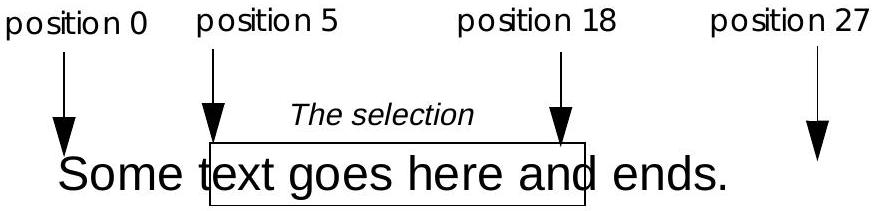

**NOTE:** All offsets are byte counts. In the case of characters, they are each one byte.

If the selection parameter in `pgCut` is a null pointer, the current selection in `pg` is used instead (which is usually want you want).

**FUNCTION RESULT:** The function result of `pgRef` is a newly created HERMES Paige object containing the copied text and associated text formatting. You can then pass this `pg_ref` to `pgPaste`, below.

`draw_mode` can be the values as described in [Draw Modes](#draw-modes) under section 2.11:

	draw_none,		// Do not draw at all 
	best_way,			// Use most efficient method(s) 
	direct_copy,	// Directly to screen, overwrite 
	direct_or,		// Directly to screen, "OR" 
	direct_xor,		// Directly to screen, "XOR" 
	bits_copy,		// Copy offscreen 
	bits_or,			// Copy offscreen in "OR" mode 
	bits_xor			// Copy offscreen in "XOR" mode

##### NOTES:

1. The `pg_ref` returned from `pickup` is a "real" HERMES Paige object, which means you need to eventually dispose of it properly using `pgDispose`.
2. Shapes from the source `pg_ref` are used to "clone" the resulting `pg_ref` from a copy or cut regardless of the selection range. For example, if the source `pg_ref` that gets copied contained a `page_area` shape with dimensions 10, 10, 580, 800, the resulting `pg_ref` will have the same `pg_area` shape. The same is true for `vis_area` and `exclude_area`.

**CAUTION:** If there is nothing to copy (no selection range exists), both `pgCut` and `pgCopy` will return `MEM_NULL`.

**CAUTION:** It is wise never to display the resulting `pg_ref` unless you first set a default graphics device to target the display. For example, doing a `pgCopy` then drawing to a "clipboard" window later could result in a crash. This can happen if the original window containing the copied `pg_ref` has been closed (rendering an invalid window attached to the copied reference). Hence, before drawing to such a "clipboard", use `pgSetDefaultDevice`. See [Setting a device](#setting-a-device) under section 3.4.

The `pgCopy` function is identical to `pgCut` except that no text is deleted, only a `pg_ref` is returned which is the copy of the specified text and formatting and no `draw_mode` is provided (because the source `pg_ref` remains unchanged).

HERMES Paige provides excellent error checking for out-of-memory situations with `pgCopy`. See chapter 26, [Exception Handling](#26-Exception-Handling).

The `pgDelete` function is the same as `pgCut` in every respect except that a "copy" is neither made nor returned. Use this function when you simply want to delete a selection range but not make a copy (such as a *Clear* command from a menu).

## 5.2 Pasting

	(void) pgPaste (pg_ref pg, pg_ref paste_ref, long position, pg_boolean text_only, short draw_mode);

The `pgPaste` function takes `paste_ref` (typically obtained from `pgCut` or `pgCopy`) and inserts all of its text into `pg`, beginning at text offset position (which is a byte offset). The `paste_ref`'s contents remain unchanged.

The `position` parameter, however, can be `CURRENT_POSITION` (value of -1) in which case the paste occurs at the current insertion point in `pg`. After the paste the insertion point advances the number of characters that were inserted from `paste_ref`.

If `text_only` is `TRUE`, only the text from `paste_ref` is inserted — no text formatting is transferred.

`draw_mode` can be the values as described in [Draw Modes](#draw-modes) under section 2.11:

	draw_none, 		// Do not draw at all
	best_way,			// Use most efficient method(s)
	direct_copy,	// Directly to screen, overwrite
	direct_or,		// Directly to screen, "OR"  
	direct_xor,		// Directly to screen, "XOR"  
	bits_copy,		// Copy offscreen
	bits_or, 			// Copy offscreen, "OR" mode
	bits_xor			// Copy offscreen, "XOR" mode

#### NOTES:

1. If there is already selected text in `pg` (the target `pg_ref`), it is deleted before the paste occurs.
2. Only text and styles are affected in the target `pg_ref` — shapes remain unchanged.

#### TECH NOTE: `pgPaste` custom styles

> I need to know when a custom style gets inserted into a particular `pg_ref`. That is, if a style is duplicated in an undo or clipboard context, I need to know when the style is inserted into the style table for the "real" `pg_ref`.

There are several ways to do this. Which method you choose depends on when you need to know, *i.e.* if you need to know the instant it occurs versus knowing somewhere in your app following a `pgPaste` or `pgUndo`.

By *instant it occurs*, I mean when processing a style with one of the hooks, for instance. If that's what you need, one good way is to use the `duplicate` function. By mere virtue of getting called at all you know that HERMES Paige is adding that style for one reason or another.

If you need to find out if that style exists at any arbitrary time, one way is to use `pgFindStyleInfo`. This function searches all style change(s) in the text to find the first occurrence of a particular style. One useful feature in `pgFindStyleInfo` is that you can set up a "mask" to only compare certain specific fields in your style. I assume your custom style will contain some kind of unique value for you to identify it, in which case this function is probably exactly what you want.

Then there is the "hack" method which looks dangerous, but isn't really. This method is to look at the whole style info list directly, which should remain compatible with all future HERMES Paige versions *and* it is even portable between Windows and other platforms! This is done as follows:

```c
paige_rec_ptr pg_rec;		// actual struct inside pg_ref
style_info_ptr styles;	// will be pointer to styles
long num_styles;				// will be number of styles avail

pg_rec = UseMemory(pg);	// do this to get paige struct
num_styles = GetMemorySize(pg_rec -> t_formats);	// number of style_info

styles = UseMemory(pg_rec -> t_formats);					// points to first style

/* At this point: styles = pointer to first style_info and num_styles contains number of styles. Hence, you can get next style as styles[1], ++styles, etc. To find your particular style, just walk through and look for it. */

// Once you're through, you MUST do:

UnuseMemory(pg_rec->t_formats);
UnuseMemory(pg); 
```

## 5.3 Copying Text Only

```c
text_ref pgCopyText (pg_ref pg, select_pair_ptr selection, short data_type);
```

**FUNCTION RESULT:** This function returns a memory allocation containing a copy of the text in `pg`, beginning at the specified offset as follows: if `selection` is non-null, it is used to determine the `selection` range (for information about `select_pair` structure, see section 4.1, [Copying and Deleting](#4.1-copying-and-deleting)). If `selection` is a null pointer, the current selection range is used.

**NOTE:** The `memory_ref` returned from `pgCopyText` will have a "record size" set to one byte. In other words, a `GetMemorySize()` will return the number of bytes copied (which might be different to the number of characters, since HERMES Paige can in principle handle multibyte characters).

The `data_type` parameter specifies which type of text to copy which can be one of the following:

```c
typedef enum
{
	all_data,								// Return all data
	all_text_chars,					// All text that is writing script
	all_roman,							// All Latin ASCII chars
	all_visible_data,				// Return all visible data
	all_visible_text_chars,	// All visible text that is writing script
	all_visible_roman				// All visible Latin ASCII chars
};
```

If `data_type` is `all_data`, every byte in the specified range is copied; if `all_text_chars`, all single-byte text is copied (which excludes only custom characters that aren't really "text"); for `all_roman`, only ASCII characters of Latin script are copied (as opposed to some other script such as Chinese or Arabic).

The function result is typed as a `text_ref`, which is a memory allocation created by the HERMES Paige Allocation Manager.

**NOTE:** "Single byte text" in the above sense does not refer to single or double byte scripts such as Roman vs. Kanji. The `all_text_chars` data type will in fact include double-byte script. The only type excluded in this case is embedded graphics, controls, or some other customised text stream that really isn't text.

See also section 24.5, [Examine Text](#24.5-examine-text).

### TECH NOTE: No zeros at the end of `pgCopyText`

> I got my text in a `text_ref` with `pgcopyText`, but there is no 0 at the end!
> 
> 1. Can I simply add a zero at the end to create a zero-delimited string?
> 2. How do I know where the end is?

Point one: yes, but you *must* be careful since the `memory_ref` is only guaranteed to have allocated the number of bytes in the selection sent to `pgCopyText`. So if you want to append a zero, you should use `AppendMemory`, then put in the value.

```c
memory_ref the_text;
the_text = pgCopyText(pg, &the_selection, all_data);

/* put a zero on the end so the parser doesn't walk off the end of the text */

AppendMemory(the_text, sizeof(pg_char), true);
UnuseMemory(the_text);
```

Point two: you can find the size of the text with `GetMemorySize()`, which will return the number of "records", which, in this case, will be the number of characters. Alternatively, you know the number of characters going into `pgCopyText` by knowing the selection range(s).

# 6 Undo and Redo

HERMES Paige provides a variety of functions to fully support several kinds of "undo" for most situations. HERMES Paige provides a convenient method of building custom undos which can be incorporated into your own application as well.

## 6.1 Concept of Undo

The concept of HERMES Paige "undo" support is as follows: Before you do anything to an HERMES Paige object that you want to be undoable, call `pgPrepareUndo` if you are about to do a `pgCut`, `pgDelete`, `pgPaste`, or any style, font or paragraph formatting change. The function result can then be given to `pgUndo` which will cause a reversal of what was performed.

For setting up an undo for `pgCut` or `pgDelete`, pass `undo_delete` for the verb parameter and a null pointer for `paste_ref`, for setting up an undo for `pgPaste`, pass `undo_paste` for the `verb` and the `pg_ref` you intend to paste from in `paste_ref`. For formatting changes (setting different fonts and styles or paragraph formats), pass `undo_format` for `verb` and null pointer for `paste_ref`.

### 6.2 Prepare Undo

To implement these features you must make the following function call prior to performing something that is undoable:

	(undo_ref) pgPrepareUndo (pg_ref pg, short verb, void PG_FAR *insert_ref);

**FUNCTION RESULT:** This function returns a special memory allocation which you can give to `pgUndo` (below) to perform an Undo.

The `verb` parameter defines what you are about to perform, which can be one of the following:

	typedef enum
	{
		undo_none,						// Null undo ("can't undo")
		undo_typing,					// Undo key entry except bksp and forward delete
		undo_backspace,				// Undo backspace key
		undo_delete,					// Undo clear/cut/delete
		undo_fwd_delete,			// Undo forward delete
		undo_paste,						// Undo paste/insert
		undo_format,					// Undo text style, para format, or font
		undo_insert,					// Undo some other form of insertion
		undo_page_change,			// Undo page area change
		undo_vis_change,			// Undo vis area change
		undo_exclude_change,	// Undo exclusion area change
		undo_doc_info,				// Undo setDocInfo change
		undo_embed_insert,		// Undo embed_ref insertion
		undo_app_insert				// Undo insert with position parameter
	};

*About to perform* means that you are about to do something you wish to be undoable later on. This includes performing a deletion, insertion, or text formatting change of any kind.

## 6.3 The `insert_ref` Parameter

For `undo_paste`, `insert_ref` must be the `pg_ref` you intend to paste (the source "scrap"); for `undo_insert`, `insert_ref` must be a pointer to the number of bytes to be inserted.

The `undo_app_insert` `verb` is identical to `undo_insert` except you must specify the insert location (`undo_insert` assumes the current text position). To do so, `insert_ref` must be a pointer to an array of two long words, the first element should be the text position to be inserted and the second element the insertion size, in bytes.

For `undo_typing`, `undo_backspace` and `undo_fwd_delete`, `insert_ref` should be the previous undo_ref you received for any `pgPrepareUndo` — or NULL if none.

**NOTE:** `insert_ref`, in this case, is an `undo_ref` — not a pointer to one — so you must coerce the `undo_ref` as `(void PG_FAR *)`.

For all other undo preparations, `insert_ref` should be NULL.

### Insert 100 bytes

If you are about to insert, say, 100 bytes, you would call `pgPrepareUndo` as follows:

```c
long length;
length = 100;
pgPrepareUndo(pg, undo_insert, (void PG_FAR *) &length);

/* The following function inserts a key into pg and returns the undo_ref that can be used to perform "Undo typing". The last_undo is the previous undo_ref, or MEM_NULL if none. */

undo_ref insert_width_undo (pg_ref pg, pg_char the_key, undo_ref last_undo)
{
	undo_reffunction_result;
	
	if (the_key >= ' ')	// if control char
	{
		if(the_key == FWD_DELETE_CHAR)
			function_result = pgPrepareUndo(pg, undo_fwd_delete, (void PG_FAR *) last_undo);
		else
			function_result = pgPrepareUndo(pg, undo_typing, (void *) undo);
	}
	else if (the_key == BACKSPACE_CHAR)
		function_result = pgPrepareUndo(pg, undo_backspace, (void *) undo);
		pgInsert(pg, (pg_char_ptr) &the_key, sizeof(pg_char), CURRENT_POSITION, key_insert_mode, 0, best_way);
		return function_result;
}
```


For `undo_paste`, `insert_ref` must be the `pg_ref` you are about to paste (same as before).

For all other undo `verb`s, `insert_ref` is not used (so can be `NULL`).

## 6.4 Additional Undo `verb`s

`undo_page_change` can be used before changing the page shape, `undo_vis_change` before changing the visual area, and `undo_exclude_change` before changing the exclusion area.

The `undo_doc_info` `verb` can be given before changing anything in `pg_ref`'s `doc_info`. For example, you could do “Undo Page Setup” with this undo `verb`.

The `undo_embed_insert` `verb` can be used before inserting an `embed_ref` (see chapter on Embedded Objects). Note, unlike `undo_insert` and `undo_app_insert`, the `insert_ref` parameter should be `NULL` for `undo_embed_insert`.

### Undoing "Containers"

When you use `undo_page_change`, HERMES Paige will set up an undo (and restore upon redo) both "container" rectangles and the associated refcons. You can therefore perform a full Undo Container Change.

## 6.5 Performing the Undo

To perform the actual Undo operation, pass an `undo_ref` to the following:

```c
(undo_ref) pgUndo (pg_ref pg, undo_ref ref, pg_boolean requires_redo, short draw_mode);
```

The `ref` parameter must be an `undo_ref` obtained from `pgPrepareUndo`.

If `requires_redo` is `TRUE`, `pgUndo` returns a new `undo_ref` which can be used for a "Redo".

For example, if the `undo_ref` passed to this function performed an "Undo Cut," and `requires_redo` is given as `TRUE`, the function will return a new `undo_ref` which, if given to `pgUndo` again, would perform a "Redo Cut." Undo/Redo results can be toggled back and forth this way virtually forever.

`draw_mode` can be the values described in [Draw Modes](#draw-modes) under section 2.11:


	draw_none, 		// Do not draw at all
	best_way,			// Use most efficient method(s)
	direct_copy,	// Directly to screen, overwrite
	direct_or,		// Directly to screen, "OR"  
	direct_xor,		// Directly to screen, "XOR"  
	bits_copy,		// Copy offscreen
	bits_or, 			// Copy offscreen, "OR" mode
	bits_xor			// Copy offscreen, "XOR" mode

Generally, if you want the HERMES Paige object to re-draw, pass `best_way` for `draw_mode`.

##### NOTES 
1. `pgUndo` returns a new `undo_ref`, which is a completely different allocation to the `undo_ref` you passed to it. It is your responsibility to dispose all `undo_ref`s.
2. When an Undo is performed, it does not matter what the selection point (or selection range) is in `pg` at the time — `pgUndo` will restore whatever selection range(s) existed at the time the `undo_ref` was created. For example, if the user performs an action for which you created an `undo_ref`, such as a Paste, and then he selects some other text or clicks at a different location, `pgUndo` still works correctly, given that the original insertion point for the Paste is recorded in the `undo_ref`.

## 6.6 Disposing `undo_ref`s

Once you are through using an `undo_ref`, dispose it by calling the following function:

	(void) pgDisposeUndo (undo_ref ref);

The `ref` parameter must be a valid `undo_ref` (received from `pgPrepareUndo` or `pgUndo`); or, `ref` can be `MEM_NULL` (in which case `pgDisposeUndo()` does nothing).

##### NOTES

1. `MEM_NULL` is allowed intentionally, so that you can blindly pass your application's last "undoable" operation that can be set initially to `MEM_NULL`.
2. There are a few cases where you should not dispose an `undo_ref` — see following.

### Disposing the Previous Prepare-Undo

If you are implementing single-level undo support (user can only undo the last operation), you would normally need to dispose the "old" `undo_ref` (the one returned from the previous `pgPrepareUndo()`) before preparing for the next undo. For `undo_typing`, `undo_fwd_delete`, and `undo_backspace`, you must not dispose the "old" `undo_ref` — these are the lone exceptions to the "dispose-old-undo" rule.

The reason for this is that you give HERMES Paige the "old" `undo_ref` as the `insert_ref` parameter; for `undo_typing`, `undo_backspace`, and `undo_fwd_delete`, the `undo_ref` given in `insert_ref` is either disposed or returned back to you as the function result.

Never dispose the "previous" `undo_ref` when preparing for any of these "character" undos (`undo_typing`, `undo_backspace` and `undo_fwd_delete`). In all other cases, it is OK to dispose the previous `undo_ref`.

## 6.7 Undo Type

	short pgUndoType (undo_ref ref);

This returns what type of `undo_ref` will perform.

**FUNCTION RESULT:** The function returns one of the undo `verb`s listed above under `pgPrepareUndo`, or a negative complement of a `verb`.

If the `undo_ref` is intended for a redo (returned from `pgUndo`, the verb will be its negative complement. For example, if `pgUndoType()` returns `undo_paste`, a call to `pgUndo()` would essentially perform a "Redo Paste".

A good use for this function is to set up a menu item for the user to indicate what can be undone.

##### NOTE

If you want to record more information about an Undo operation than the undo `verb`s listed above, use `pgSetUndoRefCon`, of which an explanation follows.

## 6.8 Undo `RefCon`

```c
(void) pgSetUndoRefCon (undo_ref ref, long refCon);
(long) pgGetUndoRefCon (undo_ref ref);
```

These two functions allow you set (or get) a long reference inside an `undo_ref`.

The `ref` parameter must be a valid `undo_ref`; for `pgSetUndoRefCon`, refCon can be anything. `pgGetUndoRefCon` returns whatever has been set in `ref`.

## 6.9 Customising Undo

HERMES Paige has a low-level hook for which you can use to implement modified undo actions, or you can completely customise an undo regardless of its complexity. For more information, see chapter 27, [Customising HERMES Paige](#27-customising-hermes-paige).

## 6.10 Multilevel Undo

Your application can theoretically provide multiple-level Undo support by simply preparing a "stack" of `undo_ref`s returned from `pgPrepareUndo`. Given that each `undo_ref` is independent of the next (i.e. there are no data structures within an `undo_ref` that depend on other `undo_ref` s or even `pg_ref`s), an application can keep as many of these around as desired to achieve "Undo of Undo" and "Undo of Undo of Undo," etc.

Supporting a multilevel Undo (being able to undo the last several operations) simply involves "stacking" the `undo_ref`s returned from `pgPrepareUndo`.

##### CAUTION

When you set up for "Undo Typing" (be it for a regular insertion, backspace or forward delete), HERMES Paige might return the same `undo_ref` that was given to `pgPrepareUndo`, and/or it might delete the previous `undo_ref` passed to the `insert_ref` parameter. In this case, make sure you check for this situation and handle it.

##### Example

```c
/* The following code places consecutive undo_refs into an array so multi-level "Undo" can be supported. While we only show stacking a maximum of 16, it can of course be bigger. */

undo_ref stacked_refs[16];
short stack_index = 0;			// Begins with "no undos".

/* We call "PrepareUndo" from several places in the program. The verb is the undo_verb to be performed. */

void PrepareUndo(pg_ref pg, short_verb)
{
	undo_ref new_undo, previous_undo;
	previous_undo = MEM_NULL;	// Assume no previous undo.
	if (verb == undo_typing || verb == undo_fwd_delete || verb == undo_backspace)
	if (stack_index > 0)		// There is a previous undo.
	if (pgUndoType(stacked_refs[stack_index - 1] == verb)) 
		otherparam = stacked_refs[stack_index - 1];
		new_undo = pgPrepareUndo(pg, verb, (void PG_FAR *))
		previous_undo;
	
	// Check to see if HERMES Paige returned the same undo_ref.
	
	if(!previous_undo || new_undo != previous_undo_
		++stack_index;
	
	stacked_refs[stack_index - 1] = new_undo;
}
```

# 7 CLIPBOARD SUPPORT

HERMES Paige provides a certain degree of automatic support for the external clipboard, regardless of platform.

## 7.1 Writing to the Clipboard

```c
void pgPutScrap(pg_ref the_scrap, pg_os_type native_format, short scrap_type);
```

This function writes the appropriate data to the external clipboard for other applications to read (including your own application). The data to be written is contained in `the_scrap`; usually, `the_scrap` would have been returned earlier from `pgCopy()` or `pgCut()`.

The `scrap_type` parameter indicates the preferred format within `pg` to write to the clipboard. If `scrap_type` is `pg_void_scrap` (value of zero), HERMES Paige will write whatever format(s) are appropriate, including its own native type.

If `scrap_type` is non-zero, it must be one of  `pg_native_scrap` (the HERMES Paige native format), `pg_text_scrap` (ASCII text), or `pg_embed_scrap` (the contents of an `embed_ref`).

For `pg_embed_scrap`, only `embed_mac_pict` (for Macintosh) and `embed_meta_file` (for Windows) are supported, and only the first `embed_ref` found within `the_scrap` is written to the clipboard.

The `native_format` parameter should contain a platform-appropriate identifier for a native HERMES Paige format. For the Macintosh platform, `pg_os_type` is an `OSType` parameter; for the Windows platform, `pg_os_type` is a `WORD` parameter (Win16) or `int` parameter (Win32). Note that the value you place in `native_format` depends upon the runtime platform, as follows:

### Windows only

You must first register a new format type by calling `RegisterClipboardFormat()`, then use that format type for every call to `pgPutScrap()` and `pgGetScrap()`. The name of this format type can be arbitrary; however, to remain consistent we recommend the name used by the custom control, "HERMES Paige".

##### NOTES
1. **IMPORTANT!** You must call `OpenClipboard()` before calling `pgPutScrap()`, then call `CloseClipboard()` after this function has returned. HERMES Paige can't open the clipboard for you because it can't assume there is a valid `HWND` available within its structure.
2. All data from the clipboard is copied, i.e. the data within the `pg_ref` is not owned by the clipboard.

### Macintosh only

For Macintosh, a `pg_os_type` is identical to `OSType`. The name of this format type can be arbitrary; however, to remain consistent we recommend the name used by the custom control, `paig`.

### All Platforms

For both Macintosh and Windows platform, the clipboard is cleared before any data is written. If it is successful, the data can be read from the clipboard by calling `pgGetScrap()`, below.

## 7.2 Reading from the Clipboard

	pg_ref pgGetScrap (pg_globals_ptr globals, pg_os_type native_format, embed_callback def_embed_callback);

This function checks the external clipboard for a recognisable format and, if found, returns a new `pg_ref` containing the data; the `pg_ref` can then be passed to `pgPaste`. This function will work for both Macintosh and Windows-based applications.

The `globals` parameter must be a pointer to the HERMES Paige globals structure (same structure used for `pgNew()`).

The `native_format` parameter should contain the same native format type identifier that was given to `pgPutScrap()`. For example, if running on a Macintosh, the `native_format` might be `paig`. On a Windows machine, `native_format` would be the value returned from `RegisterClipboardFormat()`.

The `def_embed_callback` parameter is an optional function pointer to an `embed_ref` callback function. The purpose of providing this parameter is to initialise any `embed_ref`s read from the clipboard to use your callback function. If `def_embed_callback` is NULL it will be ignored (and the default callback used by HERMES Paige will be placed into any `embed_ref`s read).

##### NOTE (Windows)
**IMPORTANT:** You must call `OpenClipboard()` before calling `pgGetScrap()`, then call `CloseClipboard()` after you are through processing the data. HERMES Paige can't open the clipboard for you because it can't assume there is a valid `HWND` available within its structure.

### Function Result

If a format is recognised on the clipboard, a new `pg_ref` is returned containing the clipboard data. If no format(s) are recognised, `MEM_NULL` is returned.

##### NOTE
It is your responsibility to dispose the `pg_ref` returned from this function.

## 7.3 Format Type Priorities

### Windows

HERMES Paige will check the clipboard for format types it can support in the following priority order:

1. HERMES Paige native format (taken from `native_format` parameter).
2. Text (`CF_TEXT`).
3. Metafile (`CF_METAFILEPICT`)
4. Bitmap (`CF_BITMAP`)

If none of the above formats are found, `pgGetScrap()` returns `MEM_NULL`.

### Macintosh

HERMES Paige will check the clipboard for format types it can support in the following priority order:

1. HERMES Paige native format (taken from `native_format` parameter).
2. Text (`TEXT`).
3. Picture (`PICT`).

If none of the above formats are found, `pgGetScrap` returns MEM_NULL.

## 7.4 Checking Clipboard Availability

	pg_boolean pgScrapAvail (pg_os_type native_format);

This function returns `TRUE` if there is a recognisable format in the clipboard. No data is read from the clipboard — only the data availability is returned.

The `native_format` should be the appropriate clipboard format type for the HERMES Paige native format (see `pgPutScrap()` above).

This function is useful for controlling menu items, e.g. disabling "Paste" if nothing is in the clipboard.

##### NOTE (Windows)

**IMPORTANT:** You should call `OpenClipboard()` before calling `pgScrapAvail()`, then call `CloseClipboard()` after this function has returned.

# 8 STYLE BASICS

HERMES Paige maintains three separate text formatting runs (series of text formatting changes): styles (bold, italic, super/subscript, etc.), fonts (Helvetica, Times, etc.) and paragraph formats (indentations, tabs, justification, etc.).

Each of these three formats can be changed separately; any portion of text can be a combination of each of these formats. Setting each of those is described in detail in chapter 30, [Advanced Styles](#30-advanced-styles). This chapter, *Style Basics*, describes the easiest, quickest, and simplest way to set the style, font and paragraph format you want.

##### NOTE

Unlike a Windows font that defines the whole composite format of text, the term *font* as used in this chapter generally refers only to a typeface, or typeface name. HERMES Paige considers a *font* to simply be a specific family such as Candara, Consolas, Corbel, etc., while distinguishing other formatting properties such as bold, italic, underline, etc. as the text *style*.

## 8.1 Simplified Fonts and Styles

The simplest way to change the text in a `pg_ref` to different fonts, style or colour is to use the high-level utility functions provided with HERMES Paige version 3.0. These utilities provide a "wrapper" around the lower-level HERMES Paige functions that change styles, fonts and text colours.

The source code to the wrapper has also been provided for your convenience, so you can alter them as necessary to fit your particular application. Or, you can examine them as reference material as the need occurs to apply more sophisticated stylization to your document.

### Installing the Wrapper

All the functions listed in this section can be installed by including the source file `pgHLevel.c` in your project and `pgHLevel.h` as its header file. These functions can be called from both Macintosh and Windows platforms and should work with all compilers that support standard C conventions.

##### NOTE

If your application requires more sophistication than provided in this high-level wrapper, and/or if you cannot use the wrapper for any reason, please see chapter 30, [Advanced Styles](#30-advanced-styles).

## 8.2 Selection Range

Most of the functions in this chapter require a selection range, `select_pairs` and `CURRENT_SELECTION`.

The selection range defines the range of text that should be changed, or if you pass a null pointer the current selection range (or insertion point) in `pg` is changed.

```c
typedef struct
{
	long begin;	// Beginning offset of some text portion
	long end		// Ending offset of some text portion
}
select_pair
typedef select_pair PG_FAR *select_pair_ptr;
```

The `begin` field of a `select_pair` defines the beginning text offset and the `end` field defines the ending offset. Both offsets are byte offsets, not character offsets. Text offsets in HERMES Paige are zero-indexed (i.e., the first offset is zero).

## 8.3 Changing / Getting Fonts

#### Windows prototype

```c
#include "pgHLevel.h"
void pgSetFontByName (pg_ref pg, LPSTR font_name, select_pair_ptr selection_range, pg_boolean redraw);
```

#### Macintosh prototype

```c
#include "pgHLevel.h"
void pgSetFontByName (pg_ref pg, Str255 font_name, select_pair_ptr selection_range, pg_boolean redraw);
```

This function changes the text in `pg` to the specified `font_name`.

If `selection_range` is a null pointer, the text in `pg` currently selected is changed (or, if nothing is selected, the font is applied to the next key insertion).

If `selection_range` is not null, it must point to a `select_pair` record defining the beginning and ending text offsets to apply the font. (See also section 8.2, [Selection Range](8.2-selection-range)).

If `redraw` is TRUE the changed text is redrawn if there was a selected range affected.

##### NOTE

Only the font is affected in the composite style of the specified text; *i.e.*, the text will retain its current point size and its other style attributes, with only the font family changing.

#### Macintosh prototype

```c
#include "pgHLevel.h"
pg_boolean pgGetFontByName (pg_ref pg, Str255 font_name);
```

#### Windows prototype

```c
#include "pgHLevel.h"
pg_boolean pgGetFontByName (pg_ref pg, LPSTR font_name);
```

This function returns the font name that is applied to the text currently highlighted in `pg` (or, if nothing is highlighted, the font that applies to the current insertion point is returned).

The font name is returned in `font_name`. If, however, the text is selected and the text range has more than one font, `pgGetFontByName` returns `FALSE` and `font_name` is not certain.

## 8.4 Setting/Getting Point Size

#### Prototype (same for both Mac and Windows)

```c
#include "pgHLevel.h"
void pgSetPointSize (pg_ref pg, short point_size, select_pair_ptr selection_range, pg_boolean redraw);
```

This function changes the text point size to the new size specified.

If `selection_range` is a null pointer, the text in `pg` currently highlighted is changed (or, if nothing is highlighted, the point size is applied to the next key insertion).

If `selection_range` is not null, it must point to a `select_pair` record defining the beginning and ending text offsets to apply the size. (See also section 8.2, [Selection Range](#8.2-selection-range)).

If `redraw` is `TRUE`, the changed text is redrawn if there was a selected range affected.

##### NOTE

Only the text size is affected in the composite style of the specified text, i.e. the text will retain its current font family and its other style attributes; only the point size changes.

#### Prototype (same for both Mac and Windows)

	#include "pgHLevel.h"
	pg_boolean pgGetPointsize (pg_ref pg, short PG_FAR *point_size);

This function returns the point size that is applied to the text currently selected in `pg` (or, if nothing is selected, the point size that applies to the current insertion point is returned).

The point size is returned in `*point_size` (which must not be a null pointer). However, if the text is highlighted and the text range has more than one size, `pgGetPointsize` returns `FALSE` and `*point_size` is not certain.

## 8.5 Setting/Getting Styles

### Setting easy styles

#### Prototype (same for Mac and Windows)

	#include "pgHLevel.h"
	void pgSetStyleBits (pg_ref pg, long style_bits, long set_which_bits, select_pair_ptr selection_range, pg_boolean_redraw);

This function changes the text style(s) to the new style(s) specified. "Styles" refers to text drawing characteristics such as bold, italic, underline, etc.

The style(s) to apply are represented in `style_bits`, which can be a composite of any of the following values:

```c
#include "pgHLevel.h"
#define X_PLAIN_TEXT	 					0x00000000
#define X_BOLD_BIT							0x00000001
#define X_ITALIC_BIT						0x00000002
#define X_UNDERLINE_BIT					0x00000004
#define X_OUTLINE_BIT 					0x00000008
#define X_SHADOW_BIT						0x00000010
#define X_CONDENSE_BIT					0x00000020
#define X_EXTEND_BIT						0x00000040
#define X_DBL_UNDERLINE_BIT			0x00000080
#define X_WORD_UNDERLINE_BIT		0x00000100
#define X_DOTTED_UNDERLINE_BIT	0x00000200
#define X_HIDDEN_TEXT_BIT				0x00000400
#define X_STRIKEOUT_BIT					0x00000800
#define X_SUPERSCRIPT_BIT				0x00001000
#define X_SUBSCRIPT_BIT					0x00002000
#define X_ROTATION_BIT					0x00004000
#define X_ALL_CAPS_BIT					0x00008000
#define X_ALL_LOWER_BIT					0x00010000
#define X_SMALL_CAPS_BIT				0x00020000
#define X_OVERLINE_BIT					0x00040000
#define X_BOXED_BIT							0x00080000
#define X_RELATIVE_POINT_BIT		0x00100000
#define X_SUPERIMPOSE_BIT				0x00200000
#define X_ALL_STYLES						0xFFFFFFFF
```

The `set_which_bits` parameter specifies which of the styles specified in `style_bits` to actually apply; the value(s) you place in `set_which_bits` should simply be the bits (as defined above) that you want to change.

The purpose of `set_which_bits` is to distinguish between a style you choose to force to "off" versus a style you choose to remain unchanged.

For example, suppose you want to change all the selected text to boldface but leave the other styles of the text unchanged. To do so, you would simply pass `X_BOLD_BIT` in both `style_bits` and `set_which_bits`.

However, suppose you want to force the selected text to *strictly* bold (forcing all other styles **off**). In this case, you would pass `X_BOLD_BIT` in `style_bits` and 0xFFFFFFFF (or `X_ALL_STYLES` ) in `set_which_bits`.

Also note for "plain" text (forcing all styles **off**), pass `X_PLAIN_TEXT` for `style_bits` and `X_ALL_STYLES` for `set_which_bits`.

If `selection_range` is a null pointer, the text in `pg` currently selected is changed (or, if nothing is selected, the style(s) are applied to the next key insertion).

If `selection_range` is not null, it must point to a `select_pair` record defining the beginning and ending text offsets to apply the style(s). (See also section 8.2, [Selection Range](#8.2-selection-range)).

If `redraw` is `TRUE` and a selected range is affected, the changed text is redrawn.

##### NOTE

Only the specified style attributes will affect the text, i.e. the selected text will retain its font family and point size, and all other style attributes that are not specified in `set_which_bits`.

##### NOTE (Macintosh)

The first six style definition bits are identical to QuickDraw's style bits. You might find it convenient to simply pass the QuickDraw style(s) to this function.

### Getting Style Example

```c
#include "pgHLevel.h"

/* The following code sets the text currently selected in pg to bold-italic but leaves all other styles in the text alone. The text gets re-draw with the changes if we had a highlight range.*/

long style_bits = X_BOLD_BIT | X_ITALIC_BIT;
pgSetStyleBits(pg, style_bits, style_bits, NULL, TRUE);

/* The following code sets the text currently selected in pg to bold-italic but does NOT leave the other styles alone (forces text to bold-italic and turns off all other styles). The text gets re-drawn with the changes if we had a highlight range. */

long style_bits = X_BOLD_BIT | X_ITALIC_BIT; pgSetStyleBits(pg, style_bits , X_ALL_STYLES, NULL, TRUE);

 // The following code changes all the selected text to "plain" 
 
 pgSetStyleBits(pg, X_PLAIN_TEXT, X_ALL_STYLES, NULL, TRUE);
```

## Prototype (both Mac and Windows)

```c
#include "pgHLevel.h"
void pgGetStyleBits (pg_ref pg, long PG_FAR *style_bits, long PG_FAR *consistent_bits);
```

This function returns the style(s) that are applied to the text currently highlighted in `pg` (or, if nothing is highlighted, the style(s) that apply to the current insertion point are returned).

The style(s) are returned in `*style_bits` (which must not be a null pointer); the value of `*style_bits` will be a composite of one or more of the style bits as defined in `pgSetStyleBits` (above).

The `*consistent_bits` parameter will also get set to the style(s) that remains consistent throughout the selected text; if a style bit in `consistent_bits` is set to a "1", that corresponding bit value in `*style_bits` is the same throughout the selected text.

For example, if `*style_bits` returns with all 0's, yet `*consistent_bits` is set to all 1's, the selection is purely "plain text" (no styles are set). However, if `*style_bits` returned all 0's but `*consistent_bits` was *not* all 1's, the text is not "plain text," rather the bits that are 0 in `*consistent_bits` reveal that style is not the same throughout the whole selection.

NOTE: The `consistent_styles` parameter must not be a null pointer.

## 8.6 Setting/Getting Text Colour

#### Windows prototypes

```c
#include "pgHLevel.h"
void pgSetTextColor (pg_ref pg, COLORREF color, select_pair_ptr selection_range, pg_boolean redraw);
void pgSetBKColor (pg_ref pg, COLORREF color, select_pair_ptr selection_range, pg_boolean redraw);
```

#### Macintosh prototypes

```c
#include "pgHLevel.h"
void pgSetTextColor (pg_ref pg, RGBColor *color, select_pair_ptr selection_range, pg_boolean redraw);
void pgSetTextBKColor (pg_ref pg, RGBColor *color, select_pair_ptr selection_range, pg_boolean redraw);
```

`pgSetTextColor` changes the foreground colour of text in `pg` to the specified colour; `pgSetTextBKColor` changes the background colour of text in `pg` to the specified colour.

If `selection_range` is a null pointer, the text in `pg` currently highlighted is changed (or, if nothing is highlighted, the colour is applied to the next key insertion).

If `selection_range` is not null, it must point to a `select_pair` record defining the beginning and ending text offsets to apply the colour. (See also section 8.2, [Selection Range](#8.2-selection-range)).

If `redraw` is `TRUE` and a selected range was affected, the changed text is redrawn.

##### NOTE

Only the text colour is affected in the specified text, i.e. the text will retain its current font family, point size and its other style attributes.

#### Windows prototypes

```c
#include "pgHLevel.h"
pg_boolean pgGetTextColor (pg_ref pg, COLORREF PG_FAR *color); 
pg_boolean pgGetTextBKColor (pg_ref pg, COLORREF PG_FAR *color);
```

#### Macintosh prototypes

```c
#include "pgHLevel.h"
pg_boolean pgGetTextColor (pg_ref pg, RGBColor *color);
pg_boolean pgGetTextBKColor (pg_ref pg, RGBColor *color);
```

`pgGetTextColor` returns the foreground colour that is applied to the text currently highlighted in `pg` (or, if nothing is highlighted, the colour that applies to the current insertion point is returned); `pgGetTextBKColor` returns the text background colour.

The colour is returned in `*color` (which must not be a null pointer). However, if the text is highlighted and the text range has more than one size, the function returns `FALSE` and `*color` is not certain.

## 8.7 Style Examples

### Setting styles (Windows)

```c
/* The following code shows an example of setting a new point size, a new font and new style(s) taken from a "LOGFONT" structure. All new text characteristics are applied to the text currently highlighted (or they are applied to the NEXT pgInsert if no text is highlighted). Carefully note that we do not "redraw" the text until the last function is called, otherwise we would keep "flashing" the refresh of the text. */ 

#include "Paige. h"
#include "pgUtils.h"
#include "pgHLevel.h"

LOGFONT log_font;	// got this from "ChooseFont" or whatever
long style_bits, set_bits; 	// used for pgSetStyleBits

// Set font (by name)
pg SetFontByName(pg_log_font.lfFaceName, NULL, FALSE);

// Set point size
pg SetPointSize(pg, pgAbsoluteValue((long)log_font.lfHeight, NULL, FALSE);

// Set style attributes:
style_bits = set_bits = 0;
if (log_font.lfWeight == FW_BOLD)
	style_bits |= X_BOLD_BIT;
if (log_font.lfItalic)
	style_bits |= X_ITALIC_BIT;
if (log_font.lfUnderline)
	style_bits |= X_UNDERLINE_BIT;
if (log_font.lfStrikeOut)
	style_bits |= X_STRIKEOUT_BIT;
	
// Before setting the styles, check if we actually have "plain text":
if (style_bits == X_PLAIN_TEXT)
	set_bits = X_ALL_STYLES;
else
	set_bits = style_bits;
	
// Note, this time we pass "TRUE" for redraw because we are done:
pgSetStyleBits(pg, style_bits, set_bits, NULL, TRUE);
```

### Handling font menu (Macintosh)

```c
#include "pgHLevel.h"
/* The following code assumes a "Font" menu (which lists all available fonts), a "Style" menu (containing Plain, Bold, etc.) and a "Point" menu (with 9, 12, 18 and 24 point values). Each example assumes its respective menu has been selected by user and "menu_item" is the item selected. */

/* For font menu: */ 
Str255 font;
GetItem(FontMenu, menu_item, font); 
pgSetFontByName(pg, font, NULL, TRUE);

/* For style menu: */
long style_bits, set_bits;

switch (menu_item) 
	{
	case PLAIN_ITEM:
		style_bits = X_PLAIN_TEXT;
		set_bits = X_ALL_STYLES;
		break;
	case BOLD_ITEM:
		style_bits = set_bits = X_BOLD_BIT;
		break;
	case ITALIC_ITEM:
		style_bits = set_bits = X_ITALIC_BIT;
		break;
	case UNDERLINE_ITEM:
		style_bits = set_bits = X_UNDERLINE_BIT; 
		break;
	case OUTLINE_ITEM:
		style_bits = set_bits = X_OUTLINE_BIT;
		break;
	case SHADOW_ITEM:
		style_bits = set_bits = X_SHADOW_BIT;
		break;
	}
	
pgSetStyleBits(pg, style_bits, set_bits, NULL, TRUE);
	
// Setting point size
	
short pointsize;
switch (menu_item) 
	{
	case PT9_ITEM:
		pointsize = 9;
		break;
	case PT12_ITEM:
		pointsize = 12;
		break;
	case PT18_ITEM:
		pointsize = 18;
		break;
	case PT24_ITEM:
		pointsize = 24;
		break;
	}
```

## 8.8 Changing pg_ref style defaults

Changing the defaults of the `pg_ref` is done just after `pgInit`. Changing the defaults is shown in section 3.3, [A Different Default Font, Style, Paragraph](#3.3-a-different-default-font,-style,-paragraph).

## 8.9 Changing Paragraph Formats

Changing the paragraph format applied to text range(s) requires a separate function call since paragraph formats are maintained separate from text styles and fonts.

To set one or more paragraphs to a different format, call the following:

```c
(void) pgSetParInfo (pg_ref pg, select_pair_ptr selection, par_info_ptr info, par_info_ptr mask, short draw_mode);
```

This function is almost identical to `pgSetStyleInfo` or `pgSetFontInfo` except a `par_info` record is used for `info` and `mask`.

The other difference is that `pgSetParInfo` will always apply to at least one paragraph: even if the selection "range" is a single insertion point, the whole paragraph that contains the insertion point is affected.

The `selection` and `draw_mode` parameters are functionally identical to the same parameters in `pgSetStyleInfo` (see "Changing Styles"<!-- on page 30-7--> and "Draw Modes"<!-- on page 2-30-->), except whole paragraphs are changed (even if you specify text offsets that do not fall on paragraph boundaries). (For more information, *vide* section 8.2, [Selection Range](#8.2-selection-range), and chapter 10, [All About Selection](#10-all-about-selection)).

For detailed information on `par_info` records—and what fields you should set up—see "`par_info`" under section 30.11, [Record Structures](#30.11-record-structures).

##### NOTE

If you want to set or change tabs, it is more efficient (and less code) to use the functions in chapter 9, [Tabs and Indents](#9-tabs-and-indents).

	(long) pgGetParInfo (pg_ref pg, select_pair_ptr selection, pg_boolean set_any_match, par_info_ptrinfo, par_info_ptr mask);

This function returns paragraph information for a specific range of text.

If `selection` is a null pointer, the information that is returned applies to the current selection range in `pg` (or the current insertion point); if selection is non-null, pointing to `select_pair` record, information is returned that applies to that selection range (for information about `select_pair` pointer under `pgGetStyleInfo`, see section 5.1, [Copying and Deleting](#5.1-copying-and-deleting)).

Both `info` and `mask` must both point to `par_info` records; neither can be a null pointer. When the function returns, both `info` and `mask` will be filled with information you can examine to determine what style(s), paragraph format(s), or font(s) exist throughout the selected text, and/or which do not.

If `set_any_mask` was `FALSE`, all the fields in `mask` that are set to nonzero indicate that the corresponding field value in `info` is the same throughout the selected text; all the fields in `mask` that are set to zero indicate that the corresponding field value in `info` is not the same throughout the selected text.

For example, suppose after calling `pgGetParInfo`, `mask.spacing` has a nonzero value. That means that whatever value has been set in `info.spacing` is the same for every paragraph in the selected text. Hence, if `info.spacing` is 12, then every character is spaced the same.

On the other hand, suppose after calling `pgGetParInfo`, `mask.spacing` is set to zero. That means that some of the characters in the selected text match the spacing in `info` and some do not. In this case, whatever value happens to be in `info.spacing` is not certain.

Essentially, any non-zero value in `mask` is saying, "Whatever is in `info` for this field is applied to every character in the text," and any zero in `mask` is saying, "Whatever is in `info` for this field does not matter because it is not the same for every character in the text."

You want to pass `FALSE` for `set_any_mask` to find out what paragraph formats apply to the entire selection (or not).

TABLE \#3: POSSIBLE RESULTS WHEN `SET_ANY_MASK` IS SET TO `FALSE`

| info | mask | results |
| :---: | :---: | :---: |
| 12 | -1 | All paragraphs have spacing of 12 |
| 12 | 0 | Some paragraphs have spacing of 12 |

Setting `set_any_match` to TRUE is used to determine if only a part of the text matches a given paragraph format. This is described in section 30.8, [Obtaining Current Text Format(s)](#30.8-obtaining-current-text-format(s)). The `par_info` structure is described in "`par_info`" under section 30.11, [Record Structures](#30.11-record-structures).

# 9 TABS AND INDENTS

## 9.1 Tab Support

One of the elements of a paragraph formats is a list of tab stops. Although you could set tabs (or change tabs) using `pgSetParInfo`, some additional functions have been provided exclusively for tabs to help save on coding:

	void pgSetTab (pg_ref pg, select_pair_ptr selection, tab_stop_ptr tab_ptr, short draw_mode);

This function sets a new tab that applies to the specified selection.

The `selection` parameter is used in the same way as other functions use a `select_pair` parameter: if it is a null pointer, the current selection in `pg` is used, otherwise the `selection` is taken from the parameter (for information about `pgSetParInfo` regarding `select_pair` records, see section 8.2, [Selection Range](#8.2-selection-range)).

The `draw_mode` is also identical to all other functions that accept a `draw_mode` parameter. `draw_mode` can be the values as described in [Draw Modes](#draw-modes) under section 2.11:

```c
draw_none, 		// Do not draw at all
best_way,			// Use most efficient method(s)
direct_copy,	// Directly to screen, overwrite
direct_or,		// Directly to screen, "OR"  
direct_xor,		// Directly to screen, "XOR"  
bits_copy,		// Copy offscreen
bits_or, 			// Copy offscreen, "OR" mode
bits_xor			// Copy offscreen, "XOR" mode
```

The `tab_ptr` parameter is a pointer to the following record (`tab` must not be a null pointer):

```c
typedef struct 
{
	long tab_type;	// Type of tab
	long position;	// Tab position
	long leader;		// Tab leader (or null)
	long ref_con;		// Can be used for anything
}
```

The `tab_type` field can be one of the following:

```c
typedef enum
{
	no_tab,			// none (used to delete)
	left_tab,		// left tab
	center_tab,	// centre tab
	right_tab,	// right tab
	decimal_tab	// tab on decimal point
}
```

The position field in a `tab_stop` defines the tab's position, in pixels. However, a tab's pixel position is relative to either the left edge of `pg`'s `page_area`, or to the left edge of the window (see section 9.3, [Tab Base](#9.3-tab-base)).

If `leader` is nonzero, the tab is drawn with that value as a "leader" character. HERMES Paige assumes that the character has simply been coerced to a numeric value, which will therefore imply whether the leader character is a single ASCII byte (`leader` < 256), or a double byte (`leader` > 256).

For example, if the leader is a single ASCII byte for a "." (hexadecimal 2E), the value placed in leader should be `0x0000002E`. If leader is a double-byte character, such as the Kanji with hexadecimal value 802E, then the leader value should be set to `0x0000802E`, etc.

	my_tab.leader = '-';

A leader is the character placed before a tab, like this

	01234  5  6789
	ABC -[TAB]DEFG

The `ref_con` field can be used for anything.

### Deleting a Tab

You can delete a tab by calling `pgSetTab` with a tab record of type `no_tab` where the position field set to the exact position of the existing tab you wish to delete.

### Changing a Tab

If you want to change a tab's position (location relative to the tab base), you must delete the tab and add a new one (see previous subsection, [Deleting a Tab](#Deleting-a-tab)).

If you want to change anything else (such as the tab type or leader), simply call `pgSetTab` with a tab record whose position is identical to the one you wish to change.

#### NOTES:

1. The maximum number of tab settings per paragraph is 32.
2. Tab settings affect whole paragraphs. They are in fact part of the paragraph formatting.

### TECH NOTE: Tabs setting different for different lines

> I am displaying information in Paige with each block of info occupying 2 lines of text. I would like to have tab stops set differently for the first and second line.

It depends on what you mean by "line."

If each line ends with a CR (carriage return), HERMES Paige considers each one a "paragraph" and thus you can simply change the paragraph formatting to be different for each line.

However, if both of your lines are one continuous string of text that just word-wraps into two lines, it is virtually impossible to apply two different sets of tab stops.

This is because tabs are, by definition, a paragraph format and a paragraph is simply text that ends with a CR, no matter how many lines it might have.

I will assume you have CR-terminated lines ("paragraphs"). To apply different tab stops to the second line, you need to simply use the tab setting function(s) as given in the manual. of course you need to know at least one of the text positions in the line you need to change (for example, you need to know that line number 2 starts at the 60th character, or the $72 \mathrm{nd}$ character, etc.); you also need to insert the text line first before you can apply the tab-stop changes (unlike text styles, paragraph styles require that you have a "paragraph" for which to apply the style change).

## 9.2 Changing / Getting Multiple Tabs

### Get Tab List

This provides a way to look at all the tabs within a section of text:

	(void) pgGetTabList (pg_ref pg, select_pair_ptr selection, tab_ref tabs, memory_ref tab_mask, long PG_FAR *screen_offset);

The `selection` parameter operates in the same way it does for `pgGetParInfo` (for information about `pgGetStyleInfo` and `pgGetParInfo`, *vide* section 30.8, [Obtaining Current Text Format](#30.8-obtaining-current-text-format)).

The `tabs` and `tab_mask` parameters for `pgGetTabList` are memory allocations which you must create before calling this function. When the function returns, `tabs` will be set to contain an array of `tab_stop` records that apply to the selection range and `tab_mask` will be set to contain an array of `long`s containing non-zeros for every tab that is consistent (the same) throughout the selection.

For example, supposing that the specified selection contained 3 tabs, when `pgGetTabList` returns, `tabs` would contain all three `tab_stop` records and `tab_mask` would contain 3 long words (each corresponding to the `tab` in `tabs`). If the corresponding long word in `tab_mask` is zero, that tab is inconsistent (not the same) and/or does not exist throughout the entire selection range.

The `tab_mask`, however, can be a `MEM_NULL` if you don't require a "consistency report." The `tabs` parameter, however, must be a valid `memory_ref`.

The `screen_offset` parameter should either be a pointer to a `long` or a null pointer. When the function returns, the variable pointed to by `screen_offset` will get set to the tab base value (the position, in pixels, against which tabs are measured—see section 9.3, [Tab Base](#9.3-tab-base)). If `screen_offset` is a null pointer, it is ignored.

##### NOTES
1. To learn how to create the allocations passed to tabs and `tab_mask`, and how to access their contents, see chapter 25, [The Allocation Manager](#25-the-allocation-manager).
2. Calling this function forces the `tabs` memory allocation to contain `sizeof(tab_stop)` record sizes. Hence, the result of `GetMemorySize(tabs)` will return the number of `tab_stop` records. Similarly, the `tab_mask` is forced to a record size of `sizeof(long)`, so `GetMemorySize(tab_mask)` will return the same number.
3. If no tabs exist at all, `pgGetTabList` will set your tabs and `tab_mask` allocation to a size of zero.

### Set Tab List

	(void) pgSetTabList (pg_ref pg, select_pair_ptr selection, tab_ref tabs, memory_ref tab_mask, short draw_mode);

The above function provides a way to apply multiple tabs all at once to a specified `selection`.

The `selection` parameter operates the same as all functions that accept a `select_pair`.

`draw_mode` can be the values as described in [Draw Modes](#draw-modes) under section 2.11:

	draw_none, 		// Do not draw at all
	best_way,			// Use most efficient method(s)
	direct_copy,	// Directly to screen, overwrite
	direct_or,		// Directly to screen, "OR"  
	direct_xor,		// Directly to screen, "XOR"  
	bits_copy,		// Copy offscreen
	bits_or, 			// Copy offscreen, "OR" mode
	bits_xor			// Copy offscreen, "XOR" mode

The `tabs` and `tab_mask` parameters must be memory allocations that you create. The `tabs` allocation must contain one or more tab stop records; the `tab_mask` allocation must have an identical number of long words, each `long` corresponding to the tab element in `tabs`. For every entry in `tab_mask` that is nonzero, that corresponding tab is applied to the selection range; for every `tab_mask` entry that is zero, that tab is ignored.

For example, if you set up the tabs allocation to contain 3 `tab_stop` records, and the `tab_mask` had three `long`s of 1, 0, 1, then the first and third tab would be applied to the selection range; the second tab would not be applied.

However, `tab_mask` can be `MEM_NULL` if you simply want to set all tabs unconditionally.

##### NOTES 
1. To learn how to create the allocations passed to `tabs` and `tab_mask`, and how to access their contents, see chapter 25, [The Allocation Manager](#25-the-allocation-manager).
2. The maximum number of `tab_stop`s applied to one paragraph is 32.
3. When setting multiple tabs, any current tab settings are maintained — they do not get "deleted". However, a `tab_stop` does get *replaced* if a new tab contains the same exact position.

## 9.3 Tab Base

Tab positions (the pixel positions specified in the position field of a tab_stop record) are considered relative to some other position and not absolute. HERMES Paige supports three "tab base" values defining the relative position for which to place tabs. If the base value is positive or zero, HERMES Paige uses that value as the tab base. If the base value is negative, the tab base implies one of the following:

	#define TAB_BOUNDS_RELATIVE -1	// relative to page_area bounds
	#define TAB_WRAP_RELATIVE -2	// relative to current line wrap edge

The difference between `TAB_BOUNDS_RELATIVE` and `TAB_WRAP_RELATIVE` depends on what kind of wrap shape (`page_area`) that exists in the HERMES Paige object. `TAB_BOUNDS_RELATIVE` means tabs are always relative to the entire bounding area (enclosing rectangle) of the `page_area`, regardless of the shape, while `TAB_WRAP_RELATIVE` measures tabs against the leftmost edge of the specific portion of the text line for which the tab is intended.

### Setting/Changing Tab Base

	(void) pgSetTabBase (pg_ref pg, long tab_base);
	(long) pgGetTabBase (pg_ref pg);

To set (or change) the tab base, call `pgSetTabBase` and provide the base value in `tab_base`, which can be a positive number or zero (in which case, tabs are relative to that pixel position), or a negative number (either `TAB_BASE_RELATIVE` or `TAB_BOUNDS_RELATIVE`).

To get the current tab base, call `pgGetTabBase` and the base currently used by `pg` will be the function result.

**NOTE:** The default tab base in a new `pg_ref` is zero (tabs are relative to pixel position 0).

The four illustrations to follow show examples of how tab positions are measured against the tab base value (the tab base value is stored in `pg_ref` and can be changed with the functions shown above).

[Figure 4](#fig4) ("TAB BASE = 0") shows a tab measurement with a tab base of zero, while [Figure 5](#fig5) ("TAB BASE = 16") shows a tab base of 16, in which case all tabs are relative to 16 pixels from the left of the window. In both cases, the window's left origin is assumed to be at coördinates (0, 0).

Figures [6](#fig6) ("TAB BASE = `TAB_BOUNDS_RELATIVE`") and [7](#fig7) ("TAB BASE = `TAB_WRAP_RELATIVE`") both measure tabs against the left side of `page_area`, except that, where a line of text exists, `TAB_WRAP_RELATIVE` is measured against the edge of `page_area`. If `page_area` is *a single rectangle*, both of the latter two tab base modes are *identical*.

##### Figures 4 – 7

The following are some illustrations of different tab base values:

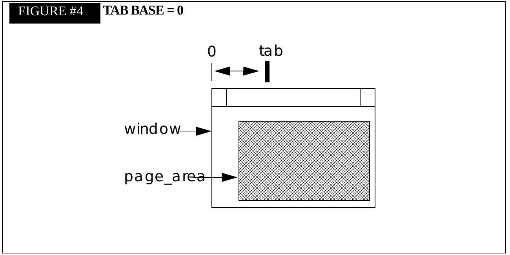
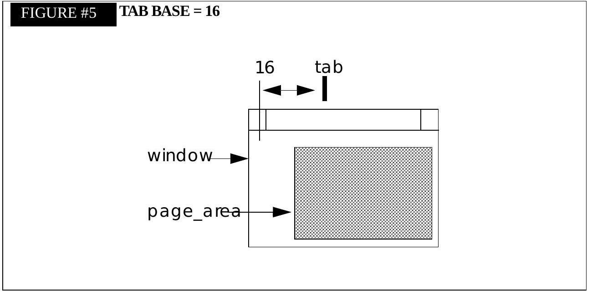
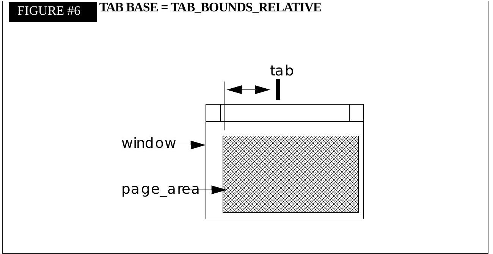
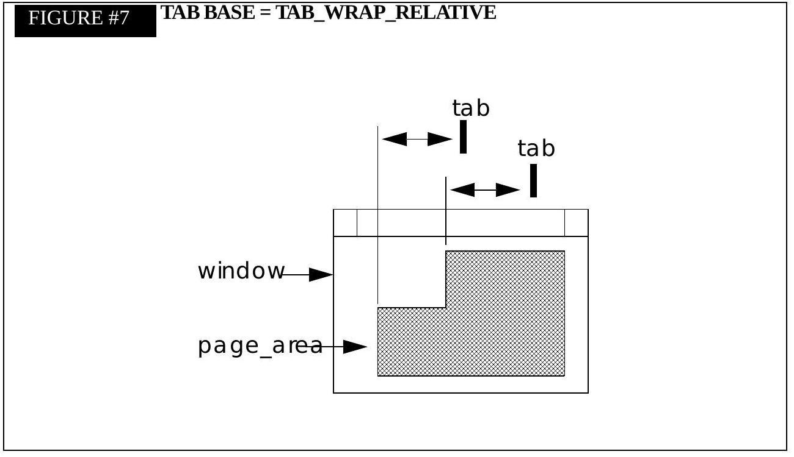

## 9.4 Indentation Support

### Set Indents

One of the elements of a paragraph format is a set of paragraph indentations (left, right, and first-line indents). Although you could set these using `pgSetParInfo`, some additional functions have been provided exclusively for indents to help save on coding:

	void pgSetIndents (pg_ref pg, select_pair_ptr selection, pg_indents_ptr indents, pg_indents_ptr mask, short draw_mode);

The function above changes the indentations for the text range specified.

The `selection` parameter operates in the same way it does for `pgGetParInfo`. For information about selection ranges, see section 8.2, [Selection Range](#8.2-selection-range), and for information about `pgSetStyleInfo` and `pgSetParInfo`, see "Changing Styles"<!-- on page 30-7--> ).

`draw_mode` can be the values as described in [Draw Modes](#draw-modes) under section 2.11:

	typedef enum
	{
		draw_none,			// Do not draw at all
		best_way,			// Use most efficient method(s)
		direct_copy,		// Directly to screen, overwrite
		direct_or,			// Directly to screen, "OR"
		direct_xor,			// Directly to screen, "XOR"
		bits_copy,			// Copy offscreen
		bits_or,			// Copy offscreen in "OR" mode
		bits_xor,			// Copy offscreen in "XOR" mode
		bits_emulate_copy	// Copy "fake" offscreen
		bits_emulate_or	// "Fake" offscreen in "OR" mode
		bits_emulate_xor	// "Fake" offscreen in "XOR" mode
	};

The indents and mask parameter must point to the following structure (neither pointer can be null):

	typedef struct
	{
		long left_indent;	// Left margin (indent)
		long right_indent;	// Right margin (indent)
		long first_indent;	// First-line indent
	}
	pg_indents, PG_FAR *pg_indents_ptr;

The `mask` parameter should contain non-zero fields for every indent you wish to change in indents.

**NOTE:** *non-zero* means that you should fill the field with -1 (so all bits are set to ones).

Indentations are pixel positions relative to a text line's maximum left and maximum right, as follows: the `left_indent` is the distance from the leftmost edge of a line (which will be the `page_area`'s left edge for that line); the right indent is the distance from the rightmost edge (which will be the `page_area`'s right edge). Note that this is a positive number, not a negative inset. The `first_line_indent` is relative to the `left_indent`. Note that *only* the `first_line_indent` should ever be negative (in which case the first line of the paragraph hangs to the left of the left indent).

When indents are changed, they apply to whole paragraphs.

### Get Indents

To obtain the current indent settings of a selection range, call the following:

	(void) pgGetIndents (pg_ref pg, select_pair_ptr selection, pg_indents_ptr indents, pg_indents_ptr_mask, long PG_FAR *left_screen_offset, long PG_FAR *right_screen_offset);

The `selection` parameter operates in the same way it does for `pgGetParInfo` (for information about `pgGetStyleInfo` and `pgGetParInfo`, *vide* section 30.8, [Obtaining Current Text Format(s)](#30.8-obtaining-current-text-format(s))).

The `indents` and `mask` parameters should point to a `pg_indents` record (described above); neither parameter can be a null pointer.

**FUNCTION RESULT:** When this function returns, indents will be set to the indentation values found in the selection range, and mask will have every field that is consistent (the same) throughout the range to nonzero.

If `left_screen_offset` and `right_screen_offset` are non-null, `pgGetIndents` will set the variables to which they point to the relative left position and right position, respectively, against which the indents are measured. The usual reason you will need to have this information is to draw a "ruler" showing indents, in which case you will need to know the relative edges to draw each indentation. This is particularly important if your `page_area` is non-rectangular (because the relative edges can change from line to line).

##### NOTE

The `left_screen_offset` and `right_screen_offset` values will include the scrolled position of the HERMES Paige object, if any (see chapter 11, [All About Scrolling](#11-all-about-scrolling)).

# 10 All About Selection

An HERMES Paige object's text can be selected either by the user or directly by your application.

## 10.1 Up and Running with Selections

Selection by the user is accomplished with `pgDragSelect`; this has already been covered in detail (see section 2.13 [Blinking Carets and Mouse Selections](#2.13-blinking-carets-and-mouse-selections) with regards to `pgDragSelect`).

Additional support functions are provided, however, to set selections directly and/or to obtain both simple selections (insertion points or a selection pair of offsets) as well as complex selections (discontinuous selections).

## 10.2 Simple Selections

A *simple* selection is either a single insertion point or a pair of text offsets which implies a single range. This includes vertical selections that contain only two points (top-left and bottom-right text positions). To set a simple selection, call the following:

	(void) pgSetSelection (pg_ref pg, long begin_sel, long end_sel, short modifiers, pg_boolean show_hilite);

The selection range in `pg` will be set to `begin_sel` to `end_sel`, which are byte offsets; the lowest offset is zero and the highest offset is `pgTextSize(pg)`. If `begin_sel` is the same as `end_sel`, a single insertion is implied.

The `modifiers` parameter is identical to the modifiers passed to `pgDragSelect` (for a list of bits you can pass for `modifiers`, see section 2.15, [Blinking Carets and Mouse Selections](#2.15-blinking-carets-and-mouse-selections)). This parameter controls how the text is selected, i.e., extended selection, vertical selection, word selection, etc.

If `should_draw` is `TRUE`, a new highlight region is computed and drawn. If `should_draw` is `FALSE`, nothing on the screen changes (but `pg` will internally change its selection).

**NOTE:** If you want to select all text, pass an arbitrary-but-huge number for `end_sel`. HERMES Paige will adjust large numbers to be equal to the current text size.

To obtain the current selection (assuming it is a simple selection), call the following:

	(void) pgGetSelection (pg_ref pg, long PG_FAR *begin_sel, long PG_FAR *end_sel);

The current selection range is returned in `*begin_sel` and `*end_sel`. Either parameter can be a null pointer if you don't want the result.

If the `selection` range is discontinuous, you will receive the first selection pair.

**NOTE:** `pgSetSelection` will not affect the style of text. It merely highlights the text and gets the internal range within HERMES Paige so that other functions can operate thereon.

## 10.3 Discontinuous Selections

A discontinuous selection can be accomplished with `pgDragSelect` and setting the appropriate bit in the `modifiers` parameter (in which case, every new `verb` of `mouse_down` will start a new selection pair). You can also accomplish this from your app with multiple `pgSetSelection` calls and the appropriate bit set in modifiers.

To set a discontinuous selection from your app all at once, however, you can use the following:

	(void) pgSetSelectionList (pg_ref pg, memory_ref select_list, long extra_offset, pg_boolean show_hilight);

The `select_list` parameter must be a memory allocation containing one or more `select_pair` records (for information about `select_pair`, see section 8.2, [Selection Range](#8.2-selection-range)).

The `offset_extra` parameter is an amount to add to each selection pair within `select_list`; if you want to apply the `select_list` as-is, pass zero for `extra_offset`.

If `should_draw` is TRUE, the new selection is drawn.

For information about memory allocations, see chapter 25, [The Allocation Manager](#25-the-allocation-manager).

To obtain the current discontinuous selection, call the following:

	(memory_ref) pgGetSelectionList (pg_ref pg, pg_boolean for_paragraph);

**FUNCTION RESULT:** This function returns a newly created memory allocation containing one or more `select_pair` records which represent the entire selection in `pg`.

If `for_paragraph` is `TRUE`, the selection pairs will be paragraph-aligned; otherwise, they will be character-aligned (if you want to know which paragraphs fall in the selection range(s), the distinction *must* be made).

**CAUTION:** If there is no selection range, e.g. only a caret, and `for_paragraph` is `FALSE`, this function will return `MEM_NULL` (equivalent to zero).

You will know how many `select_pair` records are contained in the function result by calling `GetMemorySize()` on the function result—see chapter 25, [The Allocation Manager](#25-the-allocation-manager).

**NOTE:** It is your responsibility to dispose the memory allocation returned from this function.

## 10.4 Additional Selection Support

### Extending the selection

	(void) pgExtendSelection (pg_ref pg, long amount_ext, short modifiers, pg_boolean show_hilite);

**FUNCTION RESULT:** The above function extends the current selection by `amount_ext`; the new extension follows the attributes in `modifiers` if appropriate (for example, the selection could be extended by whole words or paragraphs).

Negative values in `amount_ext` extend to the left (extend the beginning selection backwards); positive numbers extend to the right (extend the ending selection forwards).

The `modifiers` can generally be a combination of:

	#define EXTEND_MOD_BIT		0x0001	// Extend the selection
	#define WORD_MOD_BIT		0x0002 // Select whole words only
	#define PAR_MOD_BIT			0x0004 // Select whole paragraphs only
	#define LINE_MOD_BIT		0x0008	// Select whole lines only
	#define DIS_MOD_BIT			0x0020	// Enable discontiguous selection
	#define STYLE_MOD_BIT		0x0040 // Select whole style range
	#define WORD_CTL_MOD_BIT	0x0080 // Select "words" delimited by control chars
	#define NO_HALF_CHARS_BIT	0x0100 // Click does not go left/right on half-chars

These are explained in [Modifiers](#Modifiers) under section 2.15. Vertical selection cannot be extended using the modifiers. Using that modifier in combination with the others will cause unpredictable results.

If `show_hilite` is `TRUE`, the new highlight is drawn; if `FALSE`, the appearance does not change.

**NOTE:** If the current selection is discontinuous, only the last (ending) selection pair is affected by this function.

### Handling mouse \& key combinations for selection (Mac)

**NOTE:** This code does not handle shift-clicks and option-clicks in the same way as the demo. The point of this code is that you can change the key combinations for your own uses. Consult the demo for other ways of handling this.

	#include "Paige.h"
	
	#define LEFT_ARROW		0x1C
	#define RIGHT_ARROW		0x1D
	#define UP_ARROW		0x1E
	#define DOWN_ARROW		0x1F
	#define BACKSPACE_CHAR	0x08
	#define RETURN_CHAR		0x0D
	#define ENTER_CHAR		0x03
	#define TAB_CHAR		0x09
	#define LF_CHAR			0x0A
	#define HOME_KEY		0x01
	#define END_KEY			0x04
	
	static int scroll_to_cursor(pg_ref my_pg);
	static int key_doc_proc(EventRecord *event);
	static int is_an_arrow(char key);
	extern pg_globals paige_rsrv;
	extern undo_ref last_undol
	
	// This is the keydown proc
	
	static int key_doc_proc(pg_ref my_pg, EventRecord *event)
	{
		char the_key;
		short modifiers;
		pg_ref my_pg;
		
		the_key = event -> message & charCodeMask;
	}

Next we parse the event record. We have the record before going into `pgInsert` and can change the keys around or do other things before we send the key into the `pg_ref`. In this case, we intercept the `HOME_KEY` and the `END_KEY` and scroll the `pg_ref` to the top and bottom:

	if (the_key == HOME_KEY)
	{
		pgScroll(my_pg, scroll_home, scroll_home, best_way);
		UpdateScrollBarValues(my_pg);
	}
	else
	if (the_key == END_KEY)
	{
		pgScroll(my_pg, scroll_none, scroll_end, best_way);
		UpdateScrollBarValues(my_pg);
	}
	else
	{
		ObscureCursor();
	}

Then we check to see if they are characters that HERMES Paige would normally handle and if so, we insert them into the `pg_ref`. When `pgInsert` contains the `key_insert_mode` or `key_buffer_mode` in the `insert_mode` parameter, it responds as we would expect when arrow keys are entered, i.e., by moving the insertion point, by handling backspace, by deleting previous characters, etc.

We don't need to use `pgExtendSelection`.

HERMES Paige automatically handles extending the selection by holding down the shift key while using arrow keys if the `EXTEND_MOD_BIT` is set during `pgInsert`. `key_buffer_mode` will keep calling the events as long as HERMES Paige is receiving keystrokes, making keyboard text insertion very fast. HERMES Paige won't cycle through the event loop until the keystrokes are paused.

	// Here are the modifiers changing the selection
	modifiers = 0;
	if (event -> modifiers & shiftKey)
		modifiers |= EXTEND_MOD_BIT;
	if (event -> modifiers & optionKey)
		modifiers |= WORD_MOD_BIT;
		
	if (the_key == ENTER_CHAR)
	{
		event -> message = LF_CHAR;
		the_key = LF_CHAR;
	}
	
	if (the_key >= ' ' || the_key < 0 || the_key == TAB_CHAR || the_key == RETURN_CHAR || the_key == LF_CHAR || the_key == BACKSPACE_CHAR || is_an_arrow(the_key))
	{
		short verb_for_undo;
		DisposeUndo(my_pg, last_undo);
		if (the_char == paige_rsrv.bs_char)
			verb_for_undo = undo_backspace;
		else
			verb_for_undo = undo_typing;
		last_undo = pgPrepareUndo(my_pg, verb_for_undo, (void PG_FAR*) last_undo);
			
		pgInsert(my_pg, (pg_char_ptr &the_key, sizeof(pg_char), CURRENT_POSITION, key_insert_mode, 0, best_way);
		
		if (the_key == BACKSPACE_CHAR)
			pgAdjustScrollMax(my_pg, best_way);
	
		scroll_to_cursor(my_pg);
	}
	
	return FALSE;	// to be returned

### Number of selections

	(pg_short_t) pgNumSelections (pg_ref pg);

This returns the number of selection pairs in `pg`. A result of zero implies a single insertion point; a result of one implies a simple selection, and likewise for higher numbers.

### Caret \& Cursor

	(pg_boolean) pgCaretPosition (pg_ref pg, long offset, rectangle_ptr caret_rect);

**FUNCTION RESULT:** This returns a rectangle in `caret_rect` representing the "caret" corresponding to `offset`. If `offset` equals `CURRENT_POSITION` (value of 1), the current insertion point is used. If the current selection in `pg` is in fact a single insertion, the function returns `TRUE`; if it is not, `caret_rect` gets set to the top-left edge of the selection and the function returns `FALSE`.

**NOTE:** If you specify some other position besides `CURRENT_POSITION`, this implies a single insertion point; thus, the function will always return `TRUE`.

	(void) pgSetCursorState (pg_ref pg, short cursor_state); (short) pgGetCursorState (pg_ref pg);

These two functions let you set the cursor (caret) to a specified state or obtain what state the caret is in.

	typedef enum
	{
		dont_draw_cursor,	// Do nothing
		toggle_cursor,		// Toggle cursor based on timer
		show_cursor,		// Show cursor
		hide_cursor,		// Hide cursor
		deactivate_cursor,	// Cursor is no longer active
		update_cursor,		// Redraw cursor per current state
		restore_cursor,		// Turn cursor back on (chiefly Windows usage)
	}

**NOTE:** Except for very unusual applications, you should generally only use this function with `force_cursor_off` and `force_cursor_on`.

To obtain the current cursor state, call `pgGetCursorState`, which will return either TRUE (cursor is currently ON) or FALSE (cursor is currently OFF).

See also section 2.17, [Activate/Deäctivate](#2.17-Activate/Deäctivate).

**NOTE:** *The function result (`TRUE` or `FALSE`) of `pgGetCursorState` has differing usages in HERMES Paige for Windows and for Macintosh.* For **Windows**, the result implies whether or not the System caret is actively blinking within the `pg_ref`. For **Macintosh**, the result implies whether or not the caret is visible at that instant while it is toggling during `pgIdle()`. 

	void pgSetCaretPosition (pg_ref pg, pg_short_t position_verb, pg_boolean show_caret);

This function should be used to change the location of the caret (insert position); for example, `pgSetCaretPosition` is useful for handling arrow keys.

The position_verb indicates the action to be taken. The low byte of this parameter should be one of the following values:

	enum
	{
		home_caret,
		doc_bottom_caret,
		begin_line_caret,
		end_line_caret,
		next_word_caret,
		previous_word_caret
	}

The high byte of `position_verb` can modify the meaning of the values shown above; the high byte should either be equal to zero or to `EXTEND_CARET_FLAG`.

The following is a description for each value in `position_verb`:

`home_caret` — If `EXTEND_CARET_FLAG` is set, the text is selected from the beginning of the document to the current position; if `EXTEND_CARET_FLAG` is clear, the caret moves to the beginning of the document.

`doc_bottom_caret` — If `EXTEND_CARET_FLAG` is set, the text is selected from the current position to the end of the document; if `EXTEND_CARET_FLAG` is clear the caret advances to the end of the document.

`begin_line_caret` — If `EXTEND_CARET_FLAG` is set, the text is selected from the current position to the beginning of the current line; if `EXTEND_CARET_FLAG` is clear the caret moves to the beginning of the line.

`end_line_caret` — If `EXTEND_CARET_FLAG` is set, the text is selected from the current position to the end of the current line; if `EXTEND_CARET_FLAG` is clear the caret moves to the end of the line.

`next_word_caret` — If `EXTEND_CARET_FLAG` is set, the text is selected from the current position to the beginning of the next word; if `EXTEND_CARET_FLAG` is clear the caret moves to the beginning of the next word.

`previous_word_caret` — If `EXTEND_CARET_FLAG` is set, the text is selected from the current position to the beginning of the previous word; if `EXTEND_CARET_FLAG` is clear the caret moves to the beginning of the previous word.

If `show_caret` is TRUE then the caret is redrawn in its new location; otherwise, the caret does not visibly change.

## 10.5 Selection shape

It is possible to create a selection by specifying a shape. This next function returns a list of `select_pairs` when given a shape.

	(void) pgShapeToSelections (pg_ref pg, shape_ref the_shape, memory_ref selections);

**FUNCTION RESULT:** This function will place a list of selection pairs in `selections` that contain all the text that intersects `the_shape`. What gets put into `selections` is an array of `select_pair` records, similar to what is returned from `pgGetSelectionList`.

The `memory_ref` passed to selections must be a valid memory allocation (which you must create).

It is also possible to determine the selection shape.

	(void) pgSelectToShape (pg_ref pg, memory_ref select_shape, pg_boolean show_hilite);

This function sets the selection range(s) in `pg` to all characters that intersect the specified shape.

For example, if the `select_shape` was one large rectangle expanding across the entire document, then every character would be selected; if the shape were smaller than the document, then only the characters that fit within that shape—whether wholly or partially—would be selected.

If `show_hilite` is `TRUE`, the new selection region is drawn.

For information about shapes and individual characters and insertion point, see section 24.11, [Text and Selection Positions](#24.11-text-and-selection-positions). For information about highlighting see section 2.17, [Activate/Deäctivate](#2.17-Activate/Deäctivate).

### Activate/Deäctivate with shape of selection still showing

#### Macintosh

This function can be used to draw the selection area around text when it is deactivated.

	void Do_Activate(Boolean Do_An_Activate)
	{
		pg_ref my_pg;
		
		if (!(my_pg = Get_pgref_from_window(WPtr_Untitled1))) return;
		
		if(Do_An_Activate	// Handle the activate
		{
							// Update the scrollbar values
							// -----------------------------
							// Turn on the selection hilites
			pgSetHiliteStates(my_pg, activate_verb, no_change_verb, TRUE); 	
		}
		else				// Handle the deactivate
		{
							// Turn off the scroll bars here
							// -----------------------------
							// Turn off the selection hilites
			pgSetHiliteStates(my_pg, deactivate_verb, no_change_verb, TRUE);
			outline_hilite(my_pg);
			/* do this if you want to draw an outline around the selected text if the window is deactivated, as in MPW or the HERMES Paige demo */
		}					// End IF
	}
	
	/* If you want the feature of drawing the line around the selected text when the window is deactivated, you can use this snippet from the HERMES Paige demo */
	
	#include "pgTraps.h" 	// This draws xor-hilight outline
	
	static void outline_hilite(pg_ref the_pg)
	{
		shape_ref outline_shape;
		outline_shape = pgRectToShape(&paige_rsrv, NULL);
		if (pgGetHiliteRgn(the_pg, NULL, NULL, outline_shape))
		{
			pg_scale_factor scale_factor;
			RgnHandle rgn;
			rectangle vis_r;
			Rect clip;
			PushPort(WPtr_Untitled1);
			PushClip();
			
			pgAreaBounds(the_pg, NULL, &vis_r);
			RectangleToRect(&vis_r, NULL, &clip);
			ClipRect(&clip);
			
			rgn = NewRgn();
			pgGetScaling(the_pg, &scale_factor);
			ShapeToRgn(outline_shape, 0, 0, &scale_factor, rgn);
			PenNormal();
			PenMode(patXor);
			SET_HILITE_MODE(50);
			FrameRgn(rgn);
			DisposeRgn(rgn);
			PopClip();
			PopPort()
		}
		pgDisposeShape(outline_shape);
	}


# 11 All about scrolling

Scrolling an HERMES Paige object is handled differently than previous DataPak technology, with a wider feature set.

## 11.1 The ways to scroll

An HERMES Paige object can be scrolled in one of four ways: by *unit*, by *page*, by *absolute position*, or by a *pixel* value.

1. Scrolling by *unit* generally means to scroll one text line increment for vertical scrolling, and some predetermined distance for horizontal scrolling.
2. Scrolling by *page* means to scroll one visual area's worth of distance (clicking the "grey" areas of the scroll bar).
3. Scrolling by *absolute position* means the document scrolls to some specified location (such as the result of dragging a "thumb").
4. Scrolling by *pixel* means to move the position up or down by an absolute pixel amount; generally, this method is used if for some reason all of the above methods are unsuitable to your application.

For scrolling by a unit, page or absolute value, when an HERMES Paige object is scrolled vertically, an attempt is always made to align the results to a line boundary (so a partial line does not display across the top or bottom).

## 11.2 How HERMES Paige Actually Scrolls

In reality, neither the text nor the page rectangle within an HERMES Paige object ever "moves". Whatever coördinates you have set for an HERMES Paige object's `page_area` (shape in which text will flow) remains constant and do not change; the same is true for the `vis_area` and `exclude_area`.

The way an HERMES Paige object changes its "scrolled" position, however, is by offsetting the display and/or the relative position of a "mouse click" when you call `pgDragSelect` or any other function that translates a coördinate point to a text location. The scrolled position is a single vertical and horizontal value maintained within the `pg_ref`; these values are added to the top-left coördinates for text display at drawing time, and they are added to the mouse coördinate when click/dragging.

This could be important information if your application needs to implement some other method for scrolling, because all you would need to do is leave HERMES Paige alone (do not call its scrolling functions) and offset the display yourself (`pgDisplay` will accept a horizontal and vertical value to temporarily offset the display). Realise that nothing every really moves; lines are always in the same vertical and horizontal position unless your app explicitly changes them.

**NOTE:** Class library users — when implementing an HERMES Paige-based document, you are generally better off letting HERMES Paige handle it own scrolling. If at all possible, do not implement `scrollView` classes that attempt to scroll by changing the window origin.

## 11.3 The scroll

### `pgScroll`

	void pgScroll (pg_ref pg, short h_verb, short v_verb, short draw_mode);

Scrolls the HERMES Paige object by a single unit, or by a page unit. A unit and page unit is described in section 11.5, [Scroll Values](#11.5-Scroll-values). In short, `pgScroll` scrolls a specified `h_verb` and `v_verb` distance.

The values to pass in `h_verb` and `v_verb` can each be one of the following:

	typedef enum
	{
		scroll_none,	// Do not scroll
		scroll_unit,	// Scroll one unit
		scroll_page,	// Scroll one page unit
		scroll_home,	// Scroll to top of document
		scroll_end	// Scroll to end of document
	}
	scroll_verb

Because HERMES Paige will scroll the text some number of pixels, a certain amount of "white space" will result on the top or bottom for vertical scrolling, or on the left or right for horizontal scrolling. Hence, the `draw_mode` indicates the drawing mode HERMES Paige should use when it refreshes the "white space" areas; normally, the value given for `draw_mode` should be `best_way`.

On the other hand, while a value of `draw_none` will disable all drawing and visual scrolling completely, the text contents will still be "moved" by the specified amounts. In other words, were the HERMES Paige document to be scrolled one page down (using `pgScroll`) but with `draw_none` given for `draw_mode`, nothing would change on the screen until the application redisplayed the HERMES Paige text contents. In this case, the refreshed screen would appear to be scrolled one page down. The "draw nothing" feature for scrolling is therefore used only for special cases, in which an application wants to "move" the visual contents up or down without yet drawing anything.

`draw_mode` can be the values as described in [Draw Modes](#draw-modes) under section 2.11:

	draw_none,		// Do not draw at all 
	best_way,		// Use most efficient method(s) 
	direct_copy,	// Directly to screen, overwrite 
	direct_or,		// Directly to screen, "OR" 
	direct_xor,		// Directly to screen, "XOR" 
	bits_copy,		// Copy offscreen 
	bits_or,		// Copy offscreen in "OR" mode 
	bits_xor		// Copy offscreen in "XOR" mode

### Examples
#### Macintosh

	if (the_key == HOME_KEY)
	{
		pgScroll(doc -> pg, scroll_home, scroll_home, best_way);
		UpdateScrollbarValues(doc);
	}
	else
	if (the_key == END_KEY)
	{
		pgScroll(doc -> pg, scroll_none, scroll_end, best_way);
		UpdateScrollbarValues(doc);
	}

#### Responding to `WM_HSCROLL` and `WM_VSCROLL` events (Windows)

	case WM_HSCROLL:
	{
		switch(wParam)
		{
			case SB_PAGEDOWN:
				pgScroll(pg, -scroll_page, scroll_none, best_way);
				break;
			case SB_LINEDOWN:
				pgScroll(pg, -scroll_unit, scroll_none, best_way);
				break;
			case SB_PAGEUP:
				pgScroll(pg, scroll_page, scroll_none, best_way);
				break;
			case SB_LINEUP:
				pgScroll(pg, scroll_unit, scroll_none, best_way);
				break;
			case SB_THUMBPOSITION:
			{
				short cur_h, cur_v, max_h, max_v;
				pgGetScrollValues(pg, &cur_h, &cur_v, &max_h, &max_v);
				pgSetScrollValues(pg, LOWORD(lParam), cur_v, TRUE, best_way);
				break;
			}
		}
		
		UpdateScrollbars(pg, hWnd);
	}
	case WM_VSCROLL:
		if (pg)
		{
			switch (wParam)
			{
				case SB_PAGEDOWN:
					pgScroll(pg, scroll_none, scroll_page, best_way);
					break;
				case SB_LINEDOWN:
					pgScroll(pg, scroll_none, scroll_unit, best_way);
					break;
				case SB_PAGEUP:
					pgScroll(pg, scroll_none, scroll_page, best_way); 
					break; 
				case SB_LINEUP:
					pgScroll(pg, scroll_none, scroll_unit, best_way);
					break;
				case SB_TOP:
					pgScroll(pg, scroll_none, scroll_home, best_way);
					break;
				case SB_BOTTOM:
					pgScroll(pg, scroll_none, scroll_end, best_way);
					break;
				case SB_THUMBPOSITION:
					case SB_THUMBTRACK:
					{
						short cur_h, cur_v, max_h, max_v;
						pgGetScrollValues(pg. &cur_h, &cur_v, &max_h, &max_v);
						pgSetScrollValues(pg, &cur_h, LOWORD(lParam), TRUE, best_way);
						break;
					}
				}
				updateScrollbars(pg, hWnd);
			}
		return 0;

### `pgScrollToView`

	(pg_boolean) pgScrollToView (pg_ref pg, long text_offset, short h_extra, short v_extra, short align_line, short draw_mode);

Scrolls an HERMES Paige object so a specific location in its text is visible. Canonically, this function is used to automatically scroll to the "current line," although it could also be used for a number of other purposes (such as find/replace) to show specific text location.

The location in `pg`'s text is given in `text_offset`; `pg` will scroll the required distance so the character at `text_offset` is at least `h_extra` pixels from the left or right edge of the view area and `v_extra` pixels from the top or bottom edge. Whether the distance is measured from the top or bottom, or left or right depends in the value of `h_pixels` and `v_pixels`; if `h_extra` is positive, the character must scroll at least `pg` pixels from the left, otherwise the right edge is used. For `v_extra`, a positive number uses the top edge and a negative number uses the bottom edge.

The `text_offset` parameter can be `CURRENT_POSITION` (value of -1), in which case the current insertion point is used to compute the required scrolling, if any.

**FUNCTION RESULT:** The function returns "TRUE" if scrolling occurred.

The `draw_mode` indicates how the text should be updated. The value given is identical to the `display_modes` described for `pgDisplay`; it should be noted that a value of zero will cause the text not to update at all, which technically could be used to simply "offset" the HERMES Paige object contents without doing a physical scroll at all.

### Scroll to cursor position (Windows)

	// ScrollToCursor forces a scroll to the current insertion point (if any)
	
	void ScrollToCursor(pg_ref, pg, HWND hWnd)
	{
		short state1, state2;
		pg GetHiliteStates(pg, &state1, &state2;
		
		if (state1 == deactivate_verb || state2 == deactivate_verb)
			return;
		
		if (!pgNumSelections(pg))
		{
			pgPaginateNow(pg. CURRENT_POSITION, FALSE);
			
			if (pgScrollToView(pg, CURRENT_POSITION, 32, 32, TRUE, best_way))
				UpdateScrollbars(pg, hWnd);
		}
		else
			UpdateScrollbars(pg, hWnd);
	}

### Scroll to cursor position (Macintosh)

	// ScrollToCursor is called to "autoscroll" to the insertion point
	
	short ScrollToCursor(doc_rec *doc)
	{
		short old_h_value;
		if(!pgNumSelections(doc -> pg))
		{
			old_h_value = GetCtlValue(doc -> h_ctl);
			if (pgScrollToView(doc -> pg, CURRENT_POSITION, 32, TRUE, best_way))
			{
				UpdateScrollbarValues(doc);
				update_ruler(doc, old_h_value);
				return TRUE;
			}
		UpdateScrollbarValues(doc);
		return FALSE;
	}


### TECH NOTE: Can't scroll past end of text

> I've noticed that I cannot scroll vertically past the end of the text in the window. So if the HERMES Paige document is empty, it is not possible to scroll vertically at all. I need to be able to scroll vertically until the bottom part of the 640x480 workspace is visible, even if the user has not yet typed any text. How do I do that?

You need to force your `pg_ref` to be fixed height, not "variable". When you do `pgNew`, the default document mode is "variable", meaning that the bottom of the last text line is considered the document's bottom.

A "fixed" height document is one whose page shape itself (not the text) determines the document's bottom. From your description of the app, I think this is what you want.

To do so, you need to set `BOTTOM_FIXED_BIT` and `MAX SCROLL_ON_SHAPE` in the `pg_doc_info`'s attributes field. You do this right after `pgNew`, like this:

	pg_doc_info doc_info;
	pgGetDocInfo(pg, &doc_info);
	doc_info.attributes |= (BOTTOM_FIXED_BIT | MAX_SCROLL_ON_SHAPE);
	pgSetDocInfo(pg, &doc_info, FALSE, draw_none);

This will tell HERMES Paige to scroll to the bottom of your page area regardless of how much (or how little) text there is.

Of course doing this you must now make sure your page shape is exactly whatt you want, e.g. 640x480 (which you said it is).

This "bonus" on this is that you will never have to worry about scrolling; i.e. you won't need to constantly adjust the scrollbar max values once they are set up because HERMES Paige will only look at the page area's bottom. EXCEPTION: when you resize window you'll need to adjust (see answer below).

### TECH NOTE: Smaller window/bad rectangle

> If I resize my window to be "small", scroll to the far right and far bottom edges of the workspace, then resize the window to be "large", I am left with the bottom right corner of the workspace in the upper left corner of the screen. What I need to be able to do is to have HERMES Paige adjust the scrolled position so that the bottom right corner of the workspace is in the bottom right corner of the screen. How do I do that?

There is actually an HERMES Paige function for this exact situation:

	PG_PASCAL (pg_boolean) pgAdjustScrollMax (pg_ref pg, short draw_mode);

What this does is the following: 

1. Checks current scrolled position, and:—
2. If you are now scrolled too far by virtue of having resized the window, HERMES Paige will scroll the doc to "adjust." 

Hence, you don't wind up with the situation you described. The function result is TRUE if it had to adjust (had to scroll).

However, I haven't tried this yet on a "fixed height" doc (per my suggestion above), but I can't think of why it shouldn't work.

Where this function should fit in the scheme of things is:

1. After resize, resize the `pg_ref` (`pgGrowVisArea` or whatever you do), then:—
2. Call `pgAdjustScrollMax`.

If there's nothing to "fix" in the scrolling, HERMES Paige won't do anything.

### TECH NOTE: Vertical scrolling behaves strangely

> In the demo \& in my application as well since I extracted scrolling code from the demo, vertical scrolling behaves strangely. As the text approaches the bottom of the window the current position indicator moves up rather than down. When the current input position reaches the bottom of the visible portion of the window and the window automatically scrolls up to create extra visible space below the input position, the current position indicator on the scrollbar moves down. I would expect it to move up to reflect the fact that the current position is no longer at the bottom of the window.

I'm not sure how else this could ever work, at least in relation to how the demo sets up the document.

First, the reason the indicator moves "up" as you approach the bottom is that HERMES Paige is adding a whole new, blank page. So let's say you start with one page and approach the bottom and the indicator shows $90 \%$ of the document has scrolled down. Suddenly HERMES Paige appends a new page, so now the doc has 2 pages. In this case the scrolled position is no longer 90%, but rather 50%, so naturally the indicator has to move UP.

Following the 90-to-50% indicator change, if the document then auto-scrolls down by virtue of typing, then of course the indicator moves DOWN. This sequence is exactly as you described, which is "correct" in every respect due to the way the document has been created by the demo.

If this is too disconcerting you can work around it in a couple of ways. The first way is *not* to implement "repeater shapes" the way the demo is doing it, but instead just make one long document. You do this by not setting the `V_REPEAT_BIT` in `pg_doc_info`. The end result will be less noticeable with the scrōll indicator (might move a tiny bit but won't jump so far) because HERMES Paige will just add a small amount of blank space instead of a whole page.

If you still want "repeater" shapes to get the page-by-page effect as in the demo, then the only workaround is to display something to the user that shows *why* the indicator has moved so much. For example, you could display "Page 1 of 1" and "Page 1 of 2" etc. So, when HERMES Paige inserts a new blank page, it might be obvious to user why the indicator jumps if "Page 1 of 1" changes to "Page 1 of 2".

### TECH NOTE: Scrolling doesn't include picture at bottom of document

> I have implement pictures anchored to the document (where text wraps around them). However, if I have a picture below the last line of text, I can't ever scroll the document down to that location. How do I fix this?

I looked over your situation with HERMES Paige exclusion areas (pictures). HERMES Paige actually does support what you need.

In `Paige.h` you will notice the following definition near the top of the file:

	#define EX_DIMENSION_BIT	Ox00000100	/* Exclude area is included as width/height */

When you call `pgNew`, giving `EX_DIMENSION_BIT` as one of the attribute flags tells HERMES Paige to include the exclusion area as part of the "document height"—which I believe is exactly what you want.

The reason for this attribute—and the reason HERMES Paige does not automatically include an embedded objects anchored to the page—is because it cannot make that assumption, but in many cases (such as your own), setting `EX_DIMENSION_BIT` tells HERMES Paige to go ahead and assume that.

### TECH NOTE: How do I make HERMES Paige scroll to the right when using word wrap

> I am building a line editor, which expands to the right, very much like a C source code editor. But my right margin is the right side of the text. How do I get it to scroll correctly?

I think the reason you're having a problem is that HERMES Paige can only go by what is set in the document bounds (the "page area") to determine what the width of the document is.

Hence, the answer lies somewhere in forcing the `pg_ref`'s page area to expand as text expands to the right. At that time, HERMES Paige will adjust its maximum scroll values, its clipping area, etc.—assuming you set the page area using the high-level functions in `Paige.h`.

The real trick is to figure out how wide the text area is. I'll create some examples of how you determine the current width of a no-wrap document. See section 24.12, [Getting the Maximum Text Bounds](#24.12-Getting-the-maximum-text-bounds).

## 11.4 Scroll Parameters

### Set Scroll Params

	(void) pgSetScrollParams (pg_ref pg, short unit_h, short unit_v, short append_h, short append_v);

Sets the scroll parameters for `pg` as follows: `unit_h` and `unit_v` define the distance each scrolling unit shall be. This means if you ask HERMES Paige to scroll `pg` by one unit, horizontal scrolling will advance `unit_h` pixels and vertical scroll will advance `unit_v` pixels.

However, `unit_v` can be set to zero, in which case "variable" units apply. What occurs in this case (i.e., with `unit_v` equal to zero) is a scrolling distance of whatever is applicable for a single line.

For example, if the line immediately below the bottom of the visual area is 18 pixels, a scrolling down of one unit will move 18 pixels; if the next line is 12 pixels, the next down scrolling would be 12 pixels, and so on.

`append_h` and `append_v` define extra "white" space to allow for horizontal maximum and vertical maximum, respectively.

For example, suppose you create an HERMES Paige document whose total "height" is 400 pixels. Normally, the scrolling functions in HERMES Paige would not let you scroll beyond that point. The `append_v` value, however, is the amount of extra distance you will allow for scrolling vertically: if the `append_v` were 100, then a 400-pixel document would be allowed to scroll 500 pixels.

If you create a new `pgRef` and do not call `pgSetScrollParams`, the defaults are as follows: `unit_h = 32`, `unit_v = 0`, `append_h = 0`, `append_v = 32`.

### Create scroll bars (Macintosh)

	// Create a pair of scrollbars
	CreateScrollbars(WindowPtr w_ptr, doc_rec new_doc_;
	{
		Rect r_v, r_h, paginate_rect;
		InitWithZeros(&new_doc, sizeof(doc_rec)));
		
		new_doc.w_ptr = w_ptr;
		new_doc.mother = mother_window;
		new_doc.pg = create_new_paige(w_ptr);
		
		pgSetTabBase(new_doc.pg, TAB_WRAP_RELATIVE);
		pgSetScrollParams(new_doc.pg, 0, 0, 0, VERTICAL_EXTRA);
		get_paginate_rect(w_ptr, &paginate_rect);
		
		r_v = w_ptr -> portRect;
		r_v.left = r_v.right - 16;
		r_v.bottom -= 13;
		r_h = w_ptr -> portRect;
		r_h.left = paginate_rect.right;
		r_h.top = r_h.bottom - 16;
		r_h.right -= 13;
		OffsetRect(&r_v, 1, -1);
		OffsetRect(&r_h, -1, 1);
		
		new_doc.v_ctl = NewControl(w_ptr, &r_v, "", TRUE, O, 0, 0, scrollBarProc, 0);
		new_doc.h_ctl = NewControl(w_ptr, &r_h, "", TRUE, 0, 0, 0, scrollBarProc, 0);
	}

### Getting scroll parameters		

	(void) pgGetScrollParams (pg_ref pg, short PG_FAR *unit_h, short PG_FAR *unit_v, short PG_FAR *append_h, short PG_FAR *append_v);

Returns the scroll parameters for `pg`. These are described above for `pgSetScrollParams`.

## 11.5 Scroll Values

### Getting scroll indicator values

	(short) pgGetScrollValues (pg_ref pg, short PG_FAR *h, short PG_FAR *v, short PG_FAR *max_h, short PG_FAR *max_v);

This is the function you call to get the exact settings for scroll indicators.

On the Macintosh, for example, you would call `pgGetScrollValues` and set the vertical scrollbar's value to the value given in `*v` and its maximum to the value in `*max_v`. The same settings apply to the horizontal scrollbar for `*h` and `*max_h`.

Note that the values are `short`s. HERMES Paige assumes your controls can only handle ±32 K; hence, it computes the correct values even for huge documents that are way larger than a scroll indicator could handle.

**FUNCTION RESULT:** The function returns "TRUE" if the values have changed since the last time you called `pgGetScrollValues`. The purpose of this Boolean result is to not slow down your app by excessively setting scrollbars when they have not changed.

**NOTE:** The values returned from `pgGetScrollValues` are *guaranteed* to be within the ± range of an integer value. That means if the document is too large to report a scroll position within the confines of 32K, HERMES Paige will adjust the ratio between the scroll value and the suggested maximum to accommodate this limitation to most controls.

**CAUTION:** `pgGetScrollValues` can return "wrong" values if a major text change has occurred (such as a large insertion, or deletion, or massive style and font changes) but no text has been redrawn.

The reason scroll values will be inaccurate in these cases is because HERMES Paige has not yet recalculated the new positions of text lines - pwhich normally occurs dynamically as it displays text - bso it has no idea that the document's text dimensions have changed.

To avoid this situation, the following rules should be observed:

- A common scenario that creates the "wrong" scroll value is importing a large text file (without drawing yet, for speed purposes), then attempting to get the scrollbar maximum to set up the initial scrollbar parameters, all before the window is refreshed. To avoid this situation, it is generally wise to force-paginate the document following a massive insertion if you do not intend to display its text prior to getting the scroll values.
- Always call `pgGetScrollValues` *after* the screen has been updated following a major text change, and never before. Normally, this is not a problem because most of the text-altering functions accept a `draw_mode` parameter which, if ≠ 0, tells HERMES Paige to update the text display. There are special cases, however, when an application has reasons to implement large text changes yet passes `draw_none` for each of these; if that be the case, the screen should be updated at least once prior to `pgGetScrollbarValues`, OR the document should be repaginated using `pgPaginateNow`.

## Logical Steps

The following pseudo instructions provide an example for any HERMES Paige platform when determining the values that should be set for both horizontal and vertical scrollbars:

	if (I just made a major text change and did not draw) 
		pgPaginateNow(pg, CURRENT_POSITION, FALSE);
	if (pgGetScrollValues(pg, &h, &v, &max_h, &max_v)) returns "TRUE" then 
		I should change my scrollbar values as:
		Set horizontal scrollbar maximum to max_h
		Set horizontal scrollbar value to h
		Set vertical scrollbar maximum to max_v
		Set vertical scrollbar value to v
	else
		Do nothing.

### Update scrollbar values (Windows)

	void UpdateScrollbars (pg_ref pg, HWND hWnd)
	{
		short max_h, max_v;
		short h_value, v_value;
		
		if (pgGetScrollValues(pg (short far *) &h_value, short far, (short far *) &max_h, short far *) &max_v));
		{
			if max_v < 1)
				max_v = 1; // For Windows I don't want scrollbar disappearing
			SetScrollRange (hWnd, SB_VERT, 0, max_v, FALSE);
			SetScrollRange (hWnd, SB_HORZ, 0, max_h, FALSE);
			SetScrollPos (hWnd, SB_VERT, v_value, TRUE);
			SetScrollPos (hWnd, SB_HORZ, h_value, TRUE);

### Update scrollbar values (Macintosh)

	void UpdateScrollbarValues (doc_rec *doc)
	{
		short h, v, max_h, max_v;
		
		if (pgGetScrollValues(doc -> pg, &h, &v, &max_h, &max_v))
		{
			SetCtlMax(doc -> v_ctl, max_v);
			SetCtlValue(doc -> v_ctl, v);
			SetCtlMax(doc -> h_ctl, max_h);
			SetCtlValue(doc -> h_ctl, h);
		}
	}

### TECH NOTE: "Wrong" Scroll Values

> In my application I need to scroll to certain characters or styles in the document. I noticed, however, that the visual location of these special characters are often "wrong", so when I attempt to scroll to these places I do not wind up at the correct place.

Regarding the scrolling issues, you've touched upon a classic problem that I have been handling with support for years and years. "To Paginate or Not To Paginate, that is the question", *pace* Shakespeare.

When dealing with potentially large word-wrapping text, the editor must avoid repaginating the whole document *at all costs*; otherwise, performance is major dog-slow.

Most of our users that have graduated from TextEdit (Macintosh) or EDIT controls (Windows) are limited in their document size and never understand this problem, because TextEdit maintains an array of line positions at all times. That's because it doesn't handle a lot of text so it can get away with it. Our text engines, on the other hand, support massive documents, changing point sizes, irregular wrapping and who knows what else. Hence, to learn the exact document height at any given time, HERMES Paige must calculate every single word-wrapping line to come up with a good answer.

To avoid turning into a major dog, HERMES Paige (and its predecessors) elect to repaginate only at the point they *display*. There are several good reasons for this, the most important one being a typical HERMES Paige-based app applies all kinds of inserts, embedding, style changing and the like before displaying; if HERMES Paige decided to repaginate each time you set a selection or inserted a piece of text or made any changes whatsoever, it would become unbearably slow.

The reason I'm explaining all of this is so you understand WHY your document behaves the way it does with regards to scrolling. Your problem is simply: you have not yet drawn the part of the document that you will scroll to, hence it is unpaginated, hence the "wrong" answer from `pgGetScrollvalues`. That is also why `auto-scroll-to-cursor` works a wee bit better, because the `auto-scroll` forces a redisplay, which forces a paginate, which forces new information about the doc's height which can then return the "right" answer.

Put simply, `pgGetScrollValues` has insufficient information about the whole doc if a part of the doc is "dirty" and undisplayed. That's why forced paginate fixes the problem. That's also why the "wrong" answer from `pgGetScrollValues` is intermittent—your doc won't always be "dirty" every time you call the function, and also sometimes HERMES Paige's best-guess in this case is correct anyway.

So yes, `pgPaginateNow` (see section 24.3, [Paginate Now](#24.3-paginate-now)) is the best approach; I would call it every time before getting the scrollbar info. The problem with your current logic—paginating *after* `pgGetScrollValues`—is that the document hasn't been computed yet for `pgGetScrollValues`, so it might return FALSE, thinking that the document is unchanged. Remember, `pgPaginateNow` isn't that bad since it won't do anything unless the document really needs it.

But, you should pass `CURRENT_POSITION` for the `paginate_to` parameter— that will help performance a bit.

### Setting scroll values

	(void) pgSetScrollValues (pg_ref pg, short h, short v, short align_line, short draw_mode);

This function is the reverse of `pgGetScrollValues`. It provides a way to do absolute position scrolling, if necessary.

For example, you would use `pgSetScrollValues` after the "thumb" is moved to a new location. As in `pgGetScrollValues`, the values are `short`s, but HERMES Paige computes the necessary distance to scroll. (Because of possible rounding errors, however, after you have called `pgSetScrollValues` you should immediately change the scroll indicator settings with the values from a freah call to `pgGetScrollValues`.

### Handling scrolling with mouse (Macintosh)

	/* ClickScrollBars gets called in response to a mouseDown event. If mouse is not within a control, this function returns FALSE and does nothing. Otherwise, scrolling is handled and TRUE is returned. */
	
	int ClickScrollBars (doc_rec *doc, EventRecord *event)
	{
		Point start_pt;
		short part_code;
		ControlHandle the_control;
		start_pt = event -> where;
		
		GlobalToLocal(&start_pt);
		
		if (part_code = FindControl(start_pt, doc-> w_ptr, &the_control))
		{
			scrolling_doc = doc;
			if (part_code == inThumb)
			{
				long max_h, max_v;
				long scrolled_h, scrolled_v;
				long scroll_h, scroll_v;
				short v_factor, old_h_position;
				
				if (TrackControl(the_control, start_pt, NULL))
				{
					old_h_position = GetCtlValue(doc -> h_ctl);
					pgSetScrollValues(doc -> pg, GetCtlValue(doc -> h_ctl), GetCtlValue(doc -> v_ctl), TRUE, best_way);
					UpdateScrollbarValues(doc);
					update_ruler(doc, old_h_position);
				}
				else
					TrackControl(the_control, start_pt, (ProcPtr) scroll_action_proc);
			}
			return (part_code != 0);
		}


### Maximum scroll value

Adjustments may be needed after large deletions; if so, call the following function.

	(pg_boolean) pgAdjustScrollMax (pg_ref pg, short, draw_mode);

This tells HERMES Paige that `pg` might need some adjustment after a large deletion or text size change.

For example, suppose you had a document in 24-point text, scrolled to the bottom. User changes the text to 12 point, resulting in a scrolled position way too far down! If you call `pgAdjustScrollMax`, this situation is corrected (by scrolling up the required distance).

If `draw_mode` ≠ 0, actual physical scrolling takes place (otherwise the scroll position is adjusted internally and no drawing occurs). `draw_mode` can be the values as described in [Draw Modes](#draw-modes) under section 2.11:

	draw_none,		// Do not draw at all 
	best_way,		// Use most efficient method(s) 
	direct_copy,	// Directly to screen, overwrite 
	direct_or,		// Directly to screen, "OR" 
	direct_xor,		// Directly to screen, "XOR" 
	bits_copy,		// Copy offscreen 
	bits_or,		// Copy offscreen in "OR" mode 
	bits_xor		// Copy offscreen in "XOR" mode

**FUNCTION RESULT:** The function returns TRUE if the scroll position changed.

## 11.6 Getting/Setting Absolute Pixel Scroll Positions

	void pgScrollPixels (pg_ref pg, long h, long v, short draw_mode);

**FUNCTION RESULT:** This function scrolls `pg` by `h` and `v` pixels; scrolling occurs from the current position (i.e., scrolling advances plus or minus from its current position by `h` or `v` amount(s).

If `draw_mode` ≠ 0, actual physical scrolling takes place (otherwise the scroll position is adjusted internally and no drawing occurs).

HERMES Paige will not scroll out of range — the parameters are checked and HERMES Paige will only scroll to the very top or to the maximum bottom as specified by the document's height and the current scroll parameters.

**NOTE:** You should only use this function if you are not using the other scrolling methods listed above.

	(void) pgScrollPosition (pg_ref pg, co_ordinate_ptr scroll_pos);

**FUNCTION RESULT:** The above function returns the current (absolute pixel) scroll position. The vertical scroll position is placed in `scroll_pos -> v` and the horizontal position in `scroll_pos -> h`.

The positions, however, are always zero or positive: when HERMES Paige offsets the text to its "scrolled" position, it subtracts these values.

### Forcing Pixel Alignment

In some applications, it is desirable always to scroll on "even" pixel boundaries, or some multiple other than one.

For example, in a document that displays grey patterns or outlines, it can be necessary to always scroll in a multiple of two pixels, otherwise the patterns can be said to be out of "alignment."

To set such a parameter, call the following:

	(void) pgSetScrollAlign (pg_ref pg, short align_h, short align_v);

The pixel alignment is defined in `align_h` and `align_v` for horizontal and vertical scrolling, respectively.

For either parameter, the effect is as follows: 

* if the value is zero, the current alignment value remains unchanged. 
* if the value is one, scrolling is performed to the nearest single
pixel (i.e., no "alignment" is performed)
* if the value is two or more, that alignment is used.

For example, if `align_v` is two, vertical scrolling would always be in multiples of two pixels; if three, alignment would always be a multiple of three pixels, etc.

##### NOTES:

1. The current scrolled position in `pg` is not changed by this function. You must therefore make sure the scrolled position is correctly aligned or else all subsequent scrolling can be constantly "off" of the desired alignment. It is generally wise to set the alignment once, after `pgNew`, while the scrolled positions are zero.
2. The default alignment after `pgNew` is one.
3. You do not need to set scroll alignment after a file is opened (with `upgraded`); scroll alignment is saved with the document.

### Getting Alignment

	(void) pgGetScrollAlign (pg_ref pg, short PG_FAR *align_h, short PG_FAR *align_v);

This function returns the current scroll alignment. The horizontal alignment is returned in `*align_h` and vertical alignment in `*align_v`.

Both `align_h` and `align_v` can be NULL pointers, in which case they are ignored.

## 11.7 Performing Your Own Scrolling

Because certain environments and frameworks support document scrolling in many different ways, a discussion here that explains what actually occurs inside an HERMES Paige object that is said to be "scrolled" might prove helpful.

When HERMES Paige text is "scrolled," a pair of long integers inside the `pg_ref` is increased or decreased which defines the extra distance, in pixels, that HERMES Paige should draw its text relative to the top-left of the window.

This is a critical point to consider for implementing other methods of scrolling: the contents of an HERMES Paige document *never actually "move" by virtue of `pgScroll`, `pgSetScrollParams` or `pgSetScrollValues`*. Instead, only two long words within the `pg_ref` (one for vertical position and one for horizontal position) are changed. When the time comes to display text, HERMES Paige temporarily subtracts these values from the top-left coördinates of each line to determine the target display coördinates; but the coördinates of the text lines themselves (internally to the `pg_ref`) remain unchanged and are always relative to the top-left of the window's origin regardless of scrolled position.

Similarly, when `pgDragSelect` is called (to detect which character(s) contain a mouse coördinate), HERMES Paige does the same thing in reverse: it temporarily adds the scroll positions to mouse point to decide which character has been clicked, again no text really changes its position.

Considering this method, the following facts might prove useful when `pgScroll` needs to be bypassed altogether and/or if your programming framework requires a system of scrolling:

- A `pg_ref` that is "scrolled" is simply a `pg_ref` whose vertical and horizontal "scroll position" fields are nonzero; at no time does text really "scroll." HERMES Paige temporarily subtracts these scroll positions from the display coördinates of each line when it comes time to draw the text.
- The "scroll position" values can be obtained by calling `pgScrollPosition`.
- The "scroll position" can be set directly by doing a `UseMemory(pg_ref)`, changing `Paige_rec_ptr -> scroll_position`, then `UnuseMemory(pg_ref)`.
- The "scroll positions" are always positive, i.e. as the document scrolls from top to bottom or from left to right, the scroll positions increase proportionally by that many pixels.
- The simplest way to understand a `pg_ref`'s "scroll position" is to realise that HERMES Paige only cares about the scroll position when it draws text or processes a `pgDragSelect()`.
- When `pgScroll` is called, all that really happens is the screen pixels within the `vis_area` are scrolled, the scroll positions are changed to new values, then the text is redrawn so the "white space" fills up.
- If `draw_none` is given to `pgScroll`, all that occurs is the scroll positions are changed (no pixels are scrolled and no text is redrawn).
- A call to `pgGetScrollValues` merely returns the value from the scroll position members (with the values modified as necessary to achieve ≤16-bit integer result and adjusted to match what the application has defined as a "scroll unit").

## 11.8 Alternate Scrolling

Scrolling a `pg_ref` "normally", using `pgScroll()` and similar functions, the top-left coördinates of the document are changed internally. However, rather than changing the window origin itself, HERMES Paige handles this by remembering these scroll values, and offsetting the position of text at the time it draws its text.

Using this default scrolling method, HERMES Paige assumes that the window origin never changes and that the visual region is relatively constant.

This method, however, can be troublesome within frameworks that require a document to scroll in some other way, especially by changing the window origin. Additionally, certain aspects of these frameworks are difficult to disable and are therefore rendered unfriendly to the HERMES Paige environment.

Most applications that require a different method of scrolling feel they are required to bypass HERMES Paige's scrolling system completely. While this may be workable, the app suddenly looses all scrolling features in HERMES Paige. For instance, aligning to the top and bottom of lines can be lost; HERMES Paige's built-in suggestions of where to set scrollbars is lost, etc.

Furthermore, developers that need to bypass HERMES Paige's scrolling suffer a loss in performance. For example, such an application might need to have an exact "document height", and it might thus continuously need to change the HERMES Paige `shapes` region and `vis_area`.<!-- Look at this again-->

The purpose of the features and functions in this section is to provide additional support to scroll many different ways.

### External Scrolling Attribute

A flag bit has been defined that can help applications that want to do their own scrolling:

	#define EXTERNAL_SCROLL_BIT 0x00000010

If you include this bit in the flags parameter for `pgNew()`, HERMES Paige will assume that the application's framework will be handling the document's top-left positioning in relation to scrolling.

What this means is if you create the `pg_ref` with `EXTERNAL_SCROLL_BIT`, you can continue to use all the regular HERMES Paige scrolling functions without actually changing the relative position of text (i.e., you can control the position of text and the view area yourself while still letting HERMES Paige compute the document's maximum scrolling, its current scroll position and the amount you should scroll to align to lines).

For example, using the default built-in scrolling methods (without `EXTERNAL_SCROLL_BIT` set), calling `pgScroll()` will move the display up or down by some specified amount; calling `pgGetScrollValues()` will return how far the text moved. However, if `EXTERNAL_SCROLL_BIT` is set, calling `pgScroll()` will change the scroll position values stored in the pg_ref yet *the text display itself remains unaffected*. But calling `pgGetScrollValues()` will correctly reflect the scroll position values (the same as it would using the default scrolling method).

Hence, with `EXTERNAL_SCROLL_BIT` set you can still use all of the HERMES Paige scrolling functions—yet you can adjust the text display using some other method.

### Changing Window Origin

**NOTE:** The term "window origin" in this section refers to the machine-specific origin of the window where the `pg_ref` is "attached;" it does not refer to the "origin” member of the `graf_device` structure.

The only problem with changing the window's origin that contains a `pg_ref` is after you have changed the origin, HERMES Paige's internal `vis_area` is no longer valid.

Using the default HERMES Paige scrolling system, an application would have to force new `vis_area` shapes into the `pg_ref` every time the origin changed. However, this is inefficient. The following new function has been provided to optimise this situation:

	void pgWindowOriginChanged (pg_ref pg, co_ordinate_ptr original_origin, co_ordinate_ptr new_origin);

If the window in which `pg` lives has changed its top-left origin *for the purpose of moving its view area in relation to text*, you should immediately call this function.

By "view area in relation to text" is meant that the window origin has changed to achieve a scrolling effect.

You would *not* call this function if you simply wanted the whole `pg_ref` to move, both `vis_area` and `page_area`. The intended purpose of `pgWindowOriginChanged` is to inform HERMES Paige that your app has changed the (OS-specific) window origin to create a scrolled effect, hence the `vis_area` needs to be updated.

The `original_origin` should contain the normal origin of the window, i.e. what the top-left origin of the window was initially when you called `pgNew()`. The `new_origin` should contain what the origin is now.

Note that the `original_origin` must be the original window origin at the time the `pg_ref` was created, not necessarily the window origin that existed before changing it to new_origin. Typically, the original origin is (0, 0).

However, `original_orgin` can be a null pointer, in which case the position (0, 0) is assumed. Additionally, `new_origin` can also be a null pointer, in which case the current scrolled position (stored inside the `pg_ref`) will be assumed as the new origin.

HERMES Paige will take the most efficient route to update its shape(s) to accommodate the new origin. Text is not drawn, nor are the scrolled position values (internal to the `pg_ref`) changed. All that changes is the `vis_area` coördinates so any subsequent display will reflect the position of the text in relationship to the visual region.

### Oldies but Goodies

	pgSetScrollParams();
	pgGetScrollParams();
	pgGetScrollValues();
	pgScroll();

The above functions are documented elsewhere in this manual, but they are listed again to encourage their use even when customising HERMES Paige scrolling. If you create the `pg_ref` with `EXTERNAL_SCROLL_BIT`, you can begin using all the functions above without actually changing the relative position of text (i.e., you can control the position of text and the "view" area yourself while still letting HERMES Paige compute the document's maximum scrolling, its current scroll position and the amount you should scroll to align to lines).

### Additional Support

	void pgScrollUnitsToPixels (pg_ref pg, short h_verb, short v_verb, pg_boolean add_to_position, pg_boolean window_origin_changes, long PG_FAR *h_pixels, long PG_FAR *v_pixels);

This function returns the amount of pixels that HERMES Paige would scroll if you called `pgScroll()` with the same `h_verb` and `v_verb` values. In other words, if you are doing your own scrolling but want to know where HERMES Paige would scroll if you asked it to, this is the function to use.

However, this function also provides the option to change the internal scroll values in the `pg_ref`, and/or to inform HERMES Paige that you will be changing the window origin.

Note that if you created the `pg_ref` with `EXTERNAL_SCROLL_BIT`, you can change the scroll position values inside the `pg_ref` but the text itself does not "move." This will allow your application's framework to position the text by changing the window origin, etc., but you can still have HERMES Paige maintain the relative position(s) that the document is scrolled.

Upon entry, `h_verb` and `v_verb` should be one of the several scroll verbs normally given to `pgScroll()`.

If `add_to_position` is TRUE, HERMES Paige adjusts its internal scroll position (which does not affect visual text positions if `EXTERNAL_SCROLL_BIT` has been set in the `pg_ref`). If FALSE, the scroll positions are left alone.

If `window_origin_changes` is TRUE, HERMES Paige assumes that the new scroll position, by virtue of the `h_verb` and `v_verb` values, will change the window origin by that same amount. In other words, passing TRUE for this parameter is effectively the same as calling `pgWindowOriginChanged()` with coördinates that reflect the new origin after the scroll positions have been updated.

When this function returns, `*h_pixels` and `*v_pixels` will be set to the number of pixels that HERMES Paige would have scrolled had you passed the same `h_verb` and `v_verb` to `pgScroll()`.

### Physical Drawing/Scrolling Support

	pg_region pgScrollViewRect (pg_ref pg, long h_pixels, long v_pixels, shape_ref update_area);

This function will physically scroll the pixels within `pg`'s `vis_area` by `h_pixels` and `v_pixels`; negative values cause the image to move up and left respectively.

When the function returns, if `update_area` is not `MEM_NULL` it is set to the shape of the area that needs to be updated.

	void pgSetCaretPosition (pg_ref pg, pg_short_t position_verb, pg_boolean show_caret);

This function should be used to change the location of the caret (insert position); for example, `pgSetCaretPosition` is useful for handling arrow keys.

The `position_verb` indicates the action to be taken. The low byte of this parameter should be one of the following values:

	enum
	{
		home_caret,
		doc_bottom_caret,
		begin_line_caret,
		end_line_caret,
		next_word_caret,
		previous_word_caret
	};

The high byte of `position_verb` can modify the meaning of the values shown above; the high byte should be either zero or set to `EXTEND_CARET_FLAG`.

The following is a description for each value in position_verb:

`home_caret` — If `EXTEND_CARET_FLAG` is set, the text is selected from the beginning of the document to the current position; if `EXTEND_CARET_FLAG` is clear the caret moves to the beginning of the document.

`doc_bottom_caret` — If `EXTEND_CARET_FLAG` is set, the text is selected from the current position to the end of the document; if `EXTEND_CARET_FLAG` is clear the caret advances to the end of the document.

`begin_line_caret` — If `EXTEND_CARET_FLAG` is set, the text is selected from the current position to the beginning of the current line; if `EXTEND_CARET_FLAG` is clear the caret moves to the beginning of the line.

`end_line_caret` — If `EXTEND_CARET_FLAG` is set, the text is selected from the current position to the end of the current line; if `EXTEND_CARET_FLAG` is clear the caret moves to the end of the line.

`next_word_caret` — If `EXTEND_CARET_FLAG` is set, the text is selected from the current position to the beginning of the next word; if `EXTEND_CARET_FLAG` is clear the caret moves to the beginning of the next word.

`previous_word_caret` — If `EXTEND_CARET_FLAG` is set, the text is selected from the current position to the beginning of the previous word; if `EXTEND_CARET_FLAG` is clear the caret moves to the beginning of the previous word.

If `show_caret` is TRUE then the caret is redrawn in its new location, otherwise the caret does not visibly change.

**NOTE:** This function is simply a portable way to physically scroll the pixels within a `pg_ref` — no change occurs to the scroll position internal to the `pg_ref`, nor does the window origin or the `vis_shape` change in any way.

	void pgDrawScrolledArea (pg_ref pg, long pixels_h, long pixels_v, co_ordinate_ptr original_origin, co_ordinate_ptr new_origin, short draw_mode);

This function will draw the `pg_ref` inside the area that would exist (or already exists) after a pixel scroll of `pixels_h` and `pixels_v`.

For example, if you (or your framework) has already scrolled the document by, say, -60 pixels, a call to `pgDrawScrolledArea(pg, 0, -60, …)` will cause the document to update within the region that exists by virtue of such a scroll.

**NOTE:** This function fills the would-be update area of a scroll but does not actually scroll anything.

However, optional parameters exist to inform HERMES Paige about window origin changes; if you have changed the window origin since the last display, and have not told HERMES Paige about it yet, you can pass the original and new origin in `original_origin` and `new_origin` parameters, respectively. These parameters do the same exact thing as on `pgWindowOriginChanged()` — except if they are null pointers in this case, they are ignored.

	void pgLastScrollAmount (pg_ref pg, long *h_pixels, long *v_pixels);

This function returns the amount of the previous scrolling action, in pixels.

The "scrolling action" would have been any HERMES Paige function that has changed the `pg_ref`'s internal scroll position. That includes `pgScroll` and `pgScrollUnitsToPixels()` if applicable, *inter alia*.

By "previous scrolling" is meant the last function call that changed the scroll position. For example, there could have been 1,000 non-scrolling functions since the last scrolling change, but `pgLastScrollAmount()` would only return the values since the last scrolling.

## 11.9 Draw Scroll Hook \& Scroll Regions

An application could repaint the area uncovered by a scroll with the `draw_scroll` hook:

	PG_PASCAL(void) pgDrawScrollProc (paige_rec_ptr pg, shape_ref update_rgn, co_ordinate_ptr scroll_pos, pg_boolean post_call); 

This function gets called by HERMES Paige after the contents of a `pg_ref` have been scrolled; the `update_rgn` shape contains the area of the window that has been uncovered (rendered blank) by the scrolling.

However, an unintentional anomaly exists with this method: the `update_rgn` contains a shape that represents the entire bounding area of the scrolled area. This presents a problem if the scrolled area is non-rectangular.

For example, an application might have a "Find..." dialogue box in front of the document. If a word is found, causing the document to scroll, the uncovered document area is non-rectangular (the region is affected by the intersection of the Find window).

The basic problem is that HERMES Paige cannot convert a non-rectangular, platform-specific region into a `shape_ref`.

The `paige_rec` structure (provided as the `pg` parameter in the above hook) contains the member `.port`, which contains a member called `scroll_rgn`. The `scroll_rgn` will be a platform-specific region handle containing the actual scrolled region.

For example, if `draw_scroll` is called, `pg -> port.scroll_rgn` would be a `RgnHandle` for Macintosh and an `HRGN` for Windows. In both cases, if you were to fill that region with something, it would conform to the exact scrolled area, rectangular or not.

As a rule, to avoid problems with non-rectangular scrolled area(s), use `pg -> port.scroll_rgn` instead of the `update_rgn` parameter.

# 12 ALL ABOUT SHAPES

## 12.1 Up and Running With Shapes

The quickest way to get "Up and Running" with shapes is to see "Up and Running Shapes”<!-- on page 2-20-->. This shows how to get a document up within rectangles to display and/or edit.

This chapter provides more details should you wish to provide your users with more complex shapes.

## 12.2 Basic shape areas

As mentioned in several places in this document, an HERMES Paige object maintains three basic shape areas.

The exact description and behavior for each of these shapes is as follows:

`vis_area` — The "viewable" area of an HERMES Paige object. Stated simply, anything that HERMES Paige displays that is even one pixel outside the `vis_area` gets clipped (masked out). Usually, the `vis_area` in an HERMES Paige object is some portion (or all) of a window's content area and remains unmoving and stationary. (See Figure 8 *infra*).

`page_area` — The area in which text will flow. For the simplest documents, the `page_area` can be considered a rectangle, or "page" which defines the top-left position of text display as well as the maximum width. For example, if you wanted to create a document representing an 8" wide page, you simply specify a `page_area` that is 8 inches wide. Hence, text will wrap within those boundaries.

The `page_area` may or may not be the same size as the `vis_area`, and may or may not align with the `vis_area`'s top-left position. In fact, a large document on a small monitor would almost always be larger than the `vis_area` (see Figure 8<!-- on page 12-213-->).

`exclude_area` - An optional area of an HERMES Paige object which text flow must avoid. An good example of implementing an `exclude_area` would be placing a picture on a document which text must wrap over (or wrap around from left to right). The easiest way to do this would be to build an `exclude_area` that contains the picture's bounding frame, resulting in the forced avoidance of text for that area.

All three shapes can be changed dynamically at any time. Changing the `page_area` would force text to rewrap to match the new shape; changing the `exclude_area` would also force text to rewrap in order to avoid the new areas.

If you are specifically implementing "containers", see chapter 14, [Containers Support](#14-containers-support), for an easier path.

If you are implementing any kind of exclusion shapes, see chapter 15, [Exclusion Areas](#15-exclusion-areas).

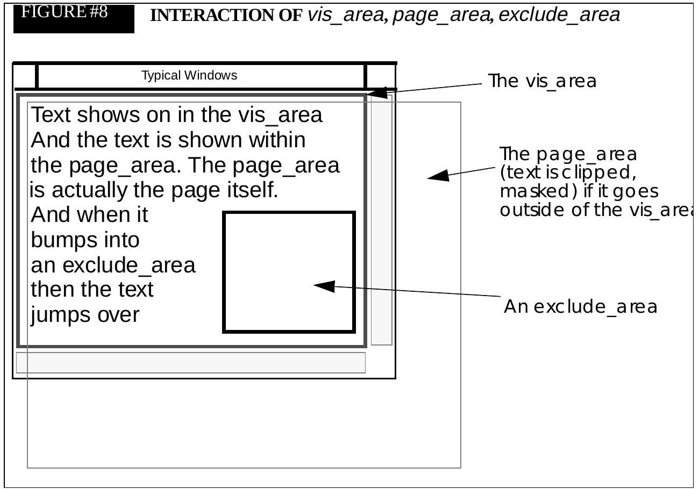

As stated, the simplest documents are rectangles; however, the `page_area` can be non-rectangular. A good example of this would be columns in which text must flow from one column to the other. In this case, the `page_area` would look similar to what is shown in Figure 9 *infra*.

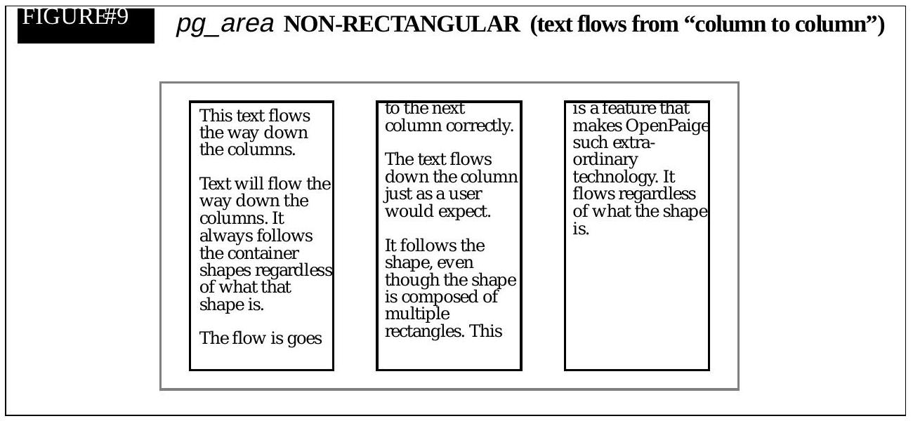

## 12.3 Coordinates \& Graphic Structures

For purposes of cross-platform technology, HERMES Paige defines its own set of structures to represent screen positions (coordinates) and shapes. Except for machine-specific source files, no reference is made to, say, Macintosh “QuickDraw” structures.

The main components ("building blocks") of shapes are the following record structures:

#### `Rectangle`

	typedef struct
	{
		co_ordinate top_left;	// Top-left of rect
		co_ordinate bot_right;	// Bottom-right of rect
	}
	rectangle, *rectangle_ptr;

#### `Co_ordinate`

	typedef struct
	{
		long v;	// vertical position
		long h;	// horizontal position
	}
	co_ordinate;

## 12.4 What's Inside a Shape

Shapes are simply a series of rectangles. A very complex shape could theoretically be represented by thousands of rectangles, the worst-case being one rectangle surrounding each pixel.

All shape structures consist of a bounding rectangle (first rectangle in the array) followed by one or more rectangles; the bounding rectangle (first one) is constantly updated to reflect the bounding area of the whole shape as the shape changes.

Hence, the shape structure is defined simply as:

	typedef rectangle shape; // Also a "shape", really
	typedef rectangle_ptr shape_ptr;

A shape is maintained by HERMES Paige, however, as a memory_ref to a block of memory that contains the shape information. In the header it is defined as:

	typedef memory_ref shape_ref; // Memory ref containing a "shape"

## 12.5 Rules for Shapes

The following rules apply to shapes with respect to the list of rectangles they contain:

1. If rectangle edges are connected exactly (i.e., if two edges have the same value), they are considered as "one" even if such a union results in a non-rectangular shape (see Figure 10<!-- on page 12-216-->).
2. If rectangle edges are not connected, they are considered separate "containers;" even if they overlap. (Overlapping would result in overlapping text if the shape definition was intended for the area where text is drawn).

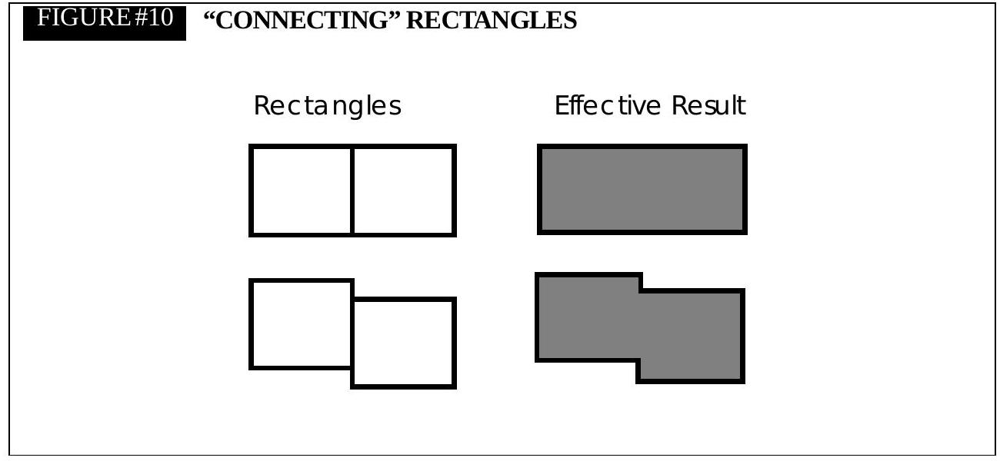
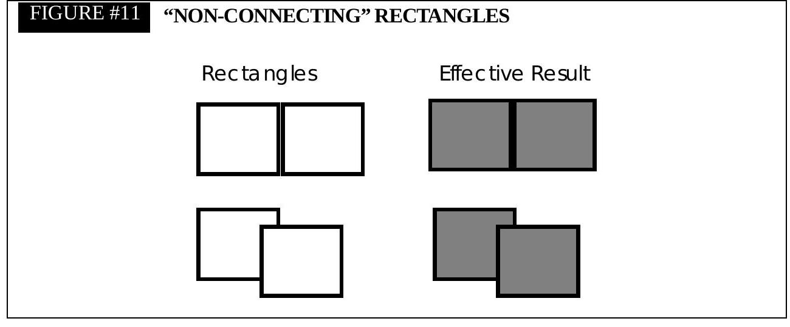

## 12.6 Building Shapes

Placing data into the `shape_ref` is the subject of discussion in this section. However, you will not normally manipulate the `shape_ref` data directly.

### Creating new shapes

The easiest way to create a new shape is to use the following function:

	(shape_ref) pgRectToShape (pgm_globals_ptr globals, rectangle_ptr rect);

This returns a new `shape_ref` (which can be passed to one of the "area" parameters in `pgNew`). The `globals` parameter must be a pointer to the same structure given to `pgMemStartup()` and `pgInit()`.

The `rect` parameter is a pointer to a rectangle; this parameter, however, can be a null pointer in which case an empty shape is returned (shape with all sides = 0).

### Setting a Shape to a Rectangle

If you have already created a `shape_ref`, you can "clear" its contents and/or set the shape to a single rectangle by calling the following:

	(void) pgSetShapeRect (shape_ref the_shape, rectangle_ptr rect);

The shape `the_shape` is changed to represent the single rectangle `rect`. If `rect` is a null pointer, `the_shape` is set to an empty shape.

### Adding to a New Shape

The best way to build a shape requiring more than one rectangle is to call the following:

	(void) pgAddRectToShape (shape_ref the_shape, rectangle_ptr rect);

The rectangle pointed to by `rect` is added to the rectangle list in `the_shape`, combining it with other rectangles if necessary. When a rectangle is added, `pgAddRectToShape` first explores all existing rectangles in `the_shape` to see if any of them can "merge" with `rect` (see section 12.5, [Rules for Shapes](#12.5-rules-for-shapes)). If none can be combined, `rect` is appended to the end of the list.

If `the_shape` is empty, `the_shape` gets set to the dimensions of rect (as if you had called `pgSetShapeRect` *supra*).

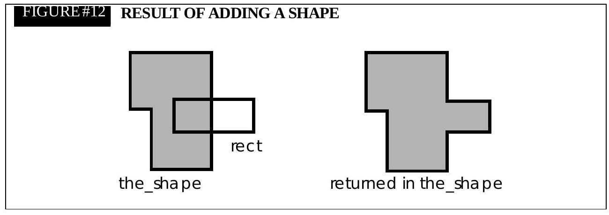

### Disposing a Shape

To dispose a shape, call:

	(void) pgDisposeShape (shape_ref the_shape);

### `Rect` to Rectangle

Two utilities exist that make it easier to create HERMES Paige rectangles:

	#include "pgTraps.h"
	(void) RectToRectangle (Rect PG_FAR *r, rectangle_ptr pg_rect);
	(void) RectangleToRect (rectangle_ptr pg_rect, co_ordinate_ptr offset, Rect PG_FAR *r);

`RectToRectangle` converts `Rect r` to rectangle `pg_rect`. The `pg_rect` parameter must be a pointer to a rectangle variable you have declared in your code.

`RectangleToRect` converts `pg_rect` to `r`; also, if offset is non-null the resulting `Rect` is offset by the amounts of the coordinate (for example, if `offset.h` and `offset.v` were (10, 5) the resulting Rect would be the values in `pg_rect` with left and right amounts offset by 10 and top and bottom amounts offset by -5.

**NOTE (Macintosh):** Since a Mac `Rect` has a ±32 K limit for all four sides, HERMES Paige rectangle sides larger than 32 K will be intentionally truncated to about 30 K.

**NOTE:** You *must* `#include "pgTraps.h"` in any code that calls either function above.

## 12.7 Manipulating shapes

### Moving shapes

	(void) pgOffsetShape (shape_ref the_shape, long h, long v);

Offsets (moves) `*the_shape` by `h` (horizontal) and `v` (vertical) distances. These may be negative. Positive numbers move to the right horizontally and down vertically as appropriate.

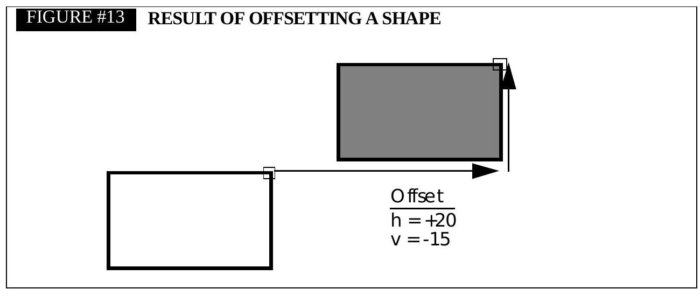

### Shrinking or expanding shape

	(void) pglnsetShape (shape_ref the_shape, long h, long v);

Insets (shrinks or expands) `*the_shape` by `h` and `v` amounts. Positive numbers inset the shape inwards and negative numbers expand it.

	(pg_short_t) pgPtInShape (shape_ref the_shape, co_ordinate_ptr point, co_ordinate_ptr offset_extra, co_ordinate_ptr inset_extra, pg_scale_ptr scaling);

`pgPtInShape` returns "TRUE" if point is within any part of `the_shape` (actually, the rectangle number is returned beginning with \#1). The point is temporarily offset with `offset_extra` if `offset_extra` is non-null before checking if it is within `the_shape` (and the offset values are checked in this case, not the original point).

If scaling is non-NULL, `the_shape` is temporarily scaled by that scale factor. For no scaling, pass NULL.

Also, each rectangle is temporarily inset by the values in `inset_extra` if it is non-NULL. Using this parameter can provide extra "slop" for point-in-shape detection. Negative values in `inset_extra` enlarge each rectangle for checking and positive numbers reduce each rectangle for checking.

**NOTE:** For convenience, `the_shape` can be also be `MEM_NULL`, which of course returns FALSE.

	(pg_short_t) pgSectRectInShape (shape_ref the_shape, rectangle_ptr rect, rectangle_ptr sect_rect)

Checks to see if a rectangle is within `the_shape`. First, `offset_extra`, if non-null, moves `rect` by the amount in `offset_extra.h` and `offset_extra.v`, then checks if it intersects any part of `the_shape`. The result is TRUE if any part of `rect` is within the shape, FALSE if it is not. If `the_shape` is empty, the result is always FALSE.

Actually, a "TRUE" result will really be the rectangle number found to intersect, beginning with 1 as the first rectangle.

**NOTE:** A result of TRUE does not necessarily mean that rect doesn't intersect with any other rectangle in `the_shape`; rather, one rectangle was found to intersect and the function returns.

If `sect_rect` is not `MEM_NULL`, it gets set to the intersection of `rect` and the first rectangle in `the_shape` found to intersect it.

### Shape Bounds

	(void) pgShapeBounds (shape_ref the_shape, rectangle_ptr bounds);

Returns the rectangle bounds of the outermost edges of the_shape. The bounds is placed in the rectangle pointed to by bounds (which cannot be null).

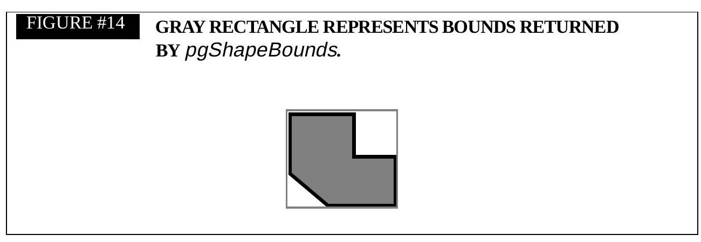

### Comparing Shapes

	(pg_boolean) pgEmptyShape (shape_ref the_shape);

**FUNCTION RESULT:** This function returns TRUE if `the_shape` is empty (all sides are the same or all zeros).

	(pg_boolean) pgEqualShapes (shape_ref shape1, shape_ref shape2);

**FUNCTION RESULT:** Returns TRUE if `shape1` matches `shape2` exactly, even if both are empty.

### Intersection of shapes

	(pg_boolean) pgSectShape (shape_ref shape1, shape_ref shape2, shape_ref result_shape);

Sets `result_shape` to the intersection of `shape1` and `shape2`. All `shape_ref` parameters must be valid `shape_ref`s, except `result_shape` can be `MEM_NULL` (which you might want to pass just to check if two shapes intersect). Additionally, `result_shape` cannot be the shape `shape_ref` as `shape1` or `shape2` or this function will fail.

If either `shape1` or `shape2` is an empty shape, the result will be an empty shape. Also, if nothing between shape 1 and shape 2 intersects, the result will be an empty shape.

**FUNCTION RESULT:** The function result will be TRUE if any part of `shape1` and `shape2` intersect (and `result_shape` gets set to the intersection if not `MEM_NULL`), otherwise FALSE is returned and `result_shape` gets set to an empty shape (if not `MEM_NULL`).

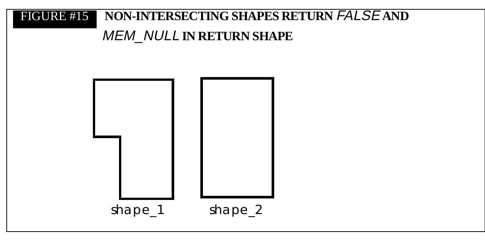

**FUNCTION RESULT:** Neither `shape1` nor `shape2` are altered by this function.

	(void) pgDiffShape (shape_ref shape1, shape_ref shape2, shape_ref result_shape);

**FUNCTION RESULT:** This function places the difference in `result_shape` between `shape1` and `shape2`.

Unlike `pgSectShape`, `result_shape` cannot be `MEM_NULL`; however, it *can* be the same `shape_ref` as `shape1` or `shape2`.

The "difference" is computed by subtracting all portions of `shape1` from `shape2`, and the geometric difference(s) produce `result_shape`. If `shape1` is an empty shape, `result_shape` will be a mere copy of shape2; if `shape2` is empty, `result_shape` will be empty.

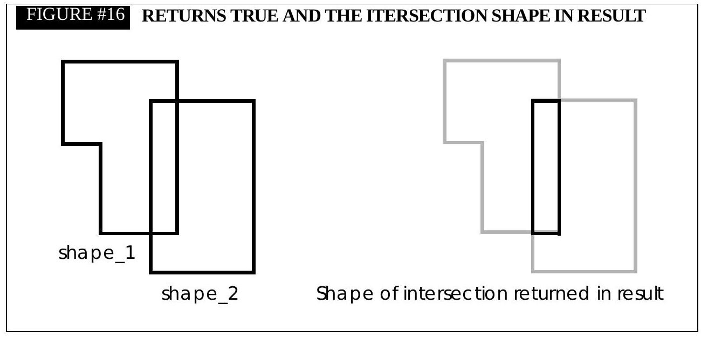
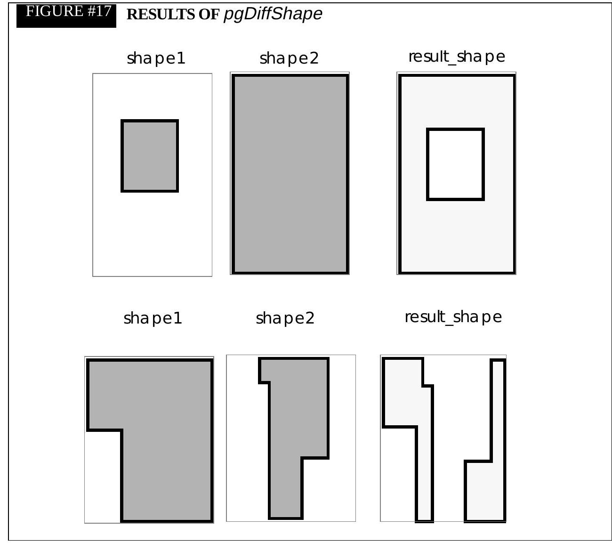

### Erase a Shape

	(void) pgEraseShape (pg_ref pg, shape_ref the_shape, pg_scale_ptr scale_factor, co_ordinate_ptr offset_extra, rectangle_ptr vis_bounds);

**FUNCTION RESULT:** This function will erase `the_shape` (by filling it with the background colour of the device in `pg`).

The `scale_factor` parameter defines scaling, if any; for no scaling, pass zero for this parameter. If you want scaling, see section 16.2, [Scaling a HERMES Paige Object](#16.2-scaling-a-hermes-paige-object).

If `offset_extra` is non-null, `the_shape` is temporarily offset by `offset_extra -> h` and `offset_extra -> v` amounts before the erasure occurs.

If `vis_bounds` is non-null, then only the parts of `the_shape` that intersect with `vis_bounds` get erased; otherwise, the whole shape is erased (see illustration *infra*).

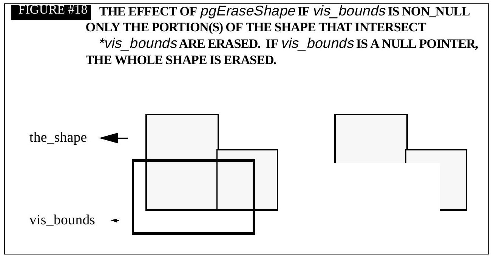

### Moving a Shape in a `pg_ref`

	(void) pgOffsetAreas (pg_ref pg, long h, long v, pg_boolean offset_page, pg_boolean offset_vis, pg_boolean offset_exclude);

This function "moves" the page area and/or visual area and/or the exclusion area of `pg`. If `offset_page` is TRUE, the page area is moved; if `offset_vis` is TRUE the visual area is moved; if `offset_exclude` is TRUE the exclusion area is moved.

Each area is moved horizontally and vertically by `h` and `v` pixels, respectively. What occurs is `h` gets added to the left and right sides of all rectangles enclosed in the shape while `v` gets added to top and bottom. Hence the shape is moved left or right, up or down with negative and positive values, respectively.

**NOTE:** The contents of `pg` are not redrawn.

## 12.8 Region Conversion Utilities

	void ShapeToRgn (shape_ref src_shape, long offset_h, long offset_v, pg_scale_factor PG_FAR *scale_factor, short inset_amount, rectangle_ptr sect_rect, RgnHandle rgn);

This function sets region `rgn` to `src_shape`. In addition, the region is offset by `offset_h` and `offset_v` amounts. If `scale_factor` is non-`NULL`, the resulting region is scaled by that scaling factor (see chapter 16, [Scaling](#16-scaling)).

Each rectangle added to the region is inset by `inset_amount` (`inset_amount` is added to the top and left and subtracted from right and bottom).

If `sect_rect` is non-`NULL`, every rectangle in the shape is first intersected with `sect_rect` and the intersection (only) is output to the region.

**NOTE:** You *must* `#include "pgTraps.h"` to use this function.

**NOTE (Windows):**  `RgnHandle` is `typedef`ed in `pgTraps.h` and is the same as `HRGN`.

**CAUTION:** Converting huge complex shapes to a region can be slow.

### Picture Handle to Shape (Macintosh only)

The following function is available only for Macintosh that takes a picture and produces a shape that encloses the picture's outside edges:

	#include "pgTraps.h"
	(void) PictOutlineToShape (PicHandle pict, shape_ref target_shape, short accuracy)

Given a picture in `pict` and a `shape_ref` in `target_shape`, this function sets `target_shape` to surround the outside bit image of the picture.

The `accuracy` parameter can be a value from 0 to 7 and indicates how "accurate" the shape should be: 0 is the most accurate (but consumes the most memory) and 7 is the least accurate (but consumes the least memory). The `accuracy` value actually indicates how many pixels to skip, or "group" together in forming the image. If `accuracy = 0`, the image is produced to the nearest pixel — which theoretically can mean that a rectangle is produced for every pixel surrounding the image (which is why so much memory can be consumed).

The picture does not need to be a bitmap image, and it can be in colour (the image is produced around the outside edges of all nonwhite areas for colour).

**NOTE:** Large, complex images can not only consume huge amounts of memory but can take several seconds to produce the image, so use this function sparingly!

**NOTE:** You *must* `#include "pgTraps.h"` to use this function.

## 12.9 Page Area Background Colours

HERMES Paige will support any background colour (which your machine can support) even if the target window's background colour is different.

The page area (area text draws and wraps) will get filled with the specified colour before text is drawn; hence this features lets you overlay text on top of non-white backgrounds (or, if desirable, will also let you overlay white text on top of dark or black backgrounds).

Note that this differs from the `bk_color` value in `style_info`. When setting the `style_info` background, HERMES Paige will simply turn on that background colour only for that text. Setting the general background colour (using the functions below) sets the background of the entire page area.

#### COLOUR TEXT AND TEXT BACKGROUND

**NOTE:** For information about setting text colour and text background colour, see section 8.6, [Setting/Getting Text Colour](#8.6-setting/getting-text-colour), and "Changing Styles"<!-- on page 30-7--> .

HERMES Paige will also recognise which colour is considered "transparent". Normally, this would be the same colour as the window's normal background colour, typically "white".

"Transparent" is simply the background colour for which HERMES Paige will not set or force. Defining which colour is transparent in this fashion lets you control the background colour(s) for either the entire window and/or a different colour for the window versus the `pg_ref`'s page area.

## 12.10 Transparent Colour

The colour that is specified as "transparent" effectively tells HERMES Paige: "Leave the background alone if the page area's background is the transparent colour."

For most situations, you can leave the transparent colour as its default — white.

Here is an example, however, where you might need to change the transparent colour. Suppose that your whole window is always blue, but you want HERMES Paige to draw on a white background. In this case, you would set the transparent colour to something other than "white" so HERMES Paige is forced to set a white background. Otherwise, HERMES Paige will not change the background at all when it draws text since it assumes the window is already in that colour.

## 12.11 Setting/Getting the Background Colour

	(void) pgSetPageColor (pg_ref pg, color_value_ptr color);
	(void) pgGetPageColor (pg_ref pg, color_value_ptr color);

To change the page area background colour, call `pgSetPageColor`. The new background colour will be copied from the `color` parameter.

To obtain the current page colour, use `pgGetPageColor` and the background colour of `pg` is copied to `*color`.

After changing the background, subsequent drawing will fill the page area with that colour before text is drawn.

**NOTE:** `pgSetPageColor` does not redraw anything.

## 12.12 Getting/Changing the Transparent Colour

The "transparent colour" is a global value, as a field in `pg_ref`. Hence, all `pg_ref`s will check for the transparent colour by looking at this field.

If you need to swap different transparent colours in and out for different situations, simply change `pg_globals -> trans_color` to the desired value.

NOTE: Usually the only time you need to change the transparent colour to something other than its default (white) is the following scenario: Non-white background colour for the whole window, but white background for a `pg_ref`'s page area. In every other situation it is safe to leave the transparent colour in `pg_globals` alone.

## 12.13 Miscellaneous Utilities

	(void) pgErasePageArea (pg_ref pg, shape_ref vis_area);

This function fills `pg`'s page area with the current page background colour of `pg`.

The fill is clipped to the page area intersected with the shape given in the `vis_area` parameter. However, if `vis_area` is a null pointer, then the `vis_area` in `pg` is used to intersect instead.

**NOTE:** You do not normally need to call this function: HERMES Paige fills the appropriate areas(s) automatically when it draws text. This function exists for special situations where you want to "erase" the page area.

## 12.14 HERMES Paige Background Colours

The purpose of this section is to provide some additional information about HERMES Paige "background" colours and their relationship to the window's background colour.

First, let's clarify the difference between three different aspects of background:

* *Page background colour* is the colour that fills the background of your page area. The "page area" is the specific area in the `pg_ref` in which text flows, or wraps. This is not necessarily the same colour as the window's background colour. For instance, if the page area were smaller than the window that contained it, the page background would fill only the page area, while the remaining window area would remain unchanged.
* *Window background colour* is the background colour of the window itself. This can be different than the window's background colour.
* *Text background colour* is the background colour of text characters, applied as a style (just as italic, bold, underline, etc. is applied to text characters). Text background colour applies only to the text character itself. This can be different from both window background and page background.

## 12.15 Who/What Controls Colours

When creating new HERMES Paige objects, the page area background colour is purely determined by the `def_bk_color` member of HERMES Paige globals. Afterwards, this colour can be changed by calling `pgSetPageColor()`.

The window background colour is controlled *entirely* by your application; no HERMES Paige functions alter that colour.

Text background is controlled by changing the `bk_color` member of `style_info`, and that colour applies only to the character(s) of that particular style.

## 12.16 What is `trans_color` in HERMES Paige globals?

The purpose of `pg_globals.trans_color` is to define the default `WINDOW` background. Since HERMES Paige is (nominally) a portable library, the `trans_color` member is provided as a platform-independent method for HERMES Paige to know what the "normal" background colour is.

HERMES Paige uses `trans_color` only as a reference. Essentially, `trans_color` defines the colour that would appear if HERMES Paige left the window alone, or the colour that would be used by the operating system if the window were "erased".

The value of `trans_color` becomes the most significant when you have set the page and/or text colour to something different to the window colour, because HERMES Paige compares the page and text colours to `trans_color` to determine whether or not to `ERASE` the background.

Its reasoning is, "... If the background colour I am to draw *is not* the "normal" background colour [`trans_color`], then I need to force-fill the background.”

Conversely, "... If the background colour I am to draw *is* the same as `trans_color`, then I don't have to set anything special”.

Herein is most of the difficulty that HERMES Paige users encounter with background colours: they set the window to a non-white background, yet they usually leave `pg_globals.trans_color` alone. This is okay, as long as `trans_color` and the page area colour are different.

But if you want the page background and window background to be the same, make sure `pg_globals.trans_color` is the same as the page background colour. The general rules are:

1. Always set `pg_globals.trans_color` to the same value as the window's background colour. Do this regardless of what the page area background colour will be.
2. The only time you need to change `pg_globals.trans_color` is when/if you have changed the window's background colour to something other than what is already in `pg_globals.trans_color`.
3. Setting page and/or text colour has nothing to do with the window's real background colour. These may or may not be the same, and HERMES Paige only knows if they match the window by comparing them to `trans_color`.
4. To make the page area *and* the window backgrounds match each other, you must set `pg_globals.trans_color`, `pgSetPageColor()` and the window background colour to the same colour value.

# 13 PAGINATION SUPPORT

Although HERMES Paige does not provide full pagination features as such, several powerful support functions and features exist to help implement page breaks, columns, margins, etc.

For custom text placement not covered in this chapter and for custom pagination features such as widows and orphans, keep with next paragraph, etc. see chapter 37, [Advanced Text Placement](#37-advanced-text-placement).

## 13.1 HERMES Paige "Document Info"

In every `pg_ref`, the following structure is maintained:

```c
typedef struct
{
	long attributes;						// Various attributes (see below)
	short page_origin;					// What corner = origin
	pg_short_t num_pages;				// Number of "real" pages
	short exclusion_inset;			// Amount to inset exclusion area when clipping
	short scroll_inset;					// Amount to inset vis area when scrolling
	short caret_width_extra;		// Width of the caret
	long repeat_slop;						// Minimum remaining before repeat
	short minimum_widow;				// Minimum window (lines) NOTE SPELLING!
	short minimum_orphan;				// Minimum orphan (lines)
	co_ordinate repeat_offset;	// Amount of "gap for repeater shapes
	rectangle print_target;			// App can use as printed page size
	rectangle margins;					// Applied page margins
	rectangle offsets;					// Additional offsets of doc, 4 sides
	long max_chars_per_line;		// Optional max characters per line, or zero
	long future[PG_FUTURE];			// Reserved for future
	long ref_con;								// App can store whatever
}
pg_doc_info, PG_FAR *doc_ptr;
```

NOTE: Some of the fields in `pg_doc_info` are currently unsupported, some of them are defined in `Paige.h` but not included above (but exist for future enhancements and extensions).

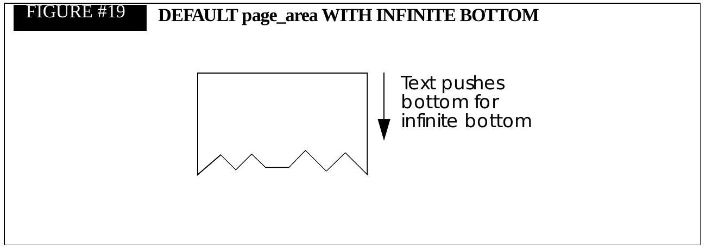

The fields that are currently supported are as follows:

`attributes` — defines special characteristics for the `page_area` shape. The `attributes` field applies only to the `page_area` shape (not `vis_area` or `exclude_area`), and it is a set of bits which can be any of the following:

```c
#define V_REPEAT_BIT					0x00000001	// Shape repeats vertically
#define H_REPEAT_BIT					0x00000002	// Shape repeats horizontally
#define BOTTOM_FIXED_BIT			0x00000004	// Shape's bottom does not grow
#define NO_CONTAINER_JMP_BIT	0x00000010	// Can't jump containers
#define MAX_SCROLL_ON_SHAPE		0x00000020	// Maximum scroll is on shape
#define NO_CLIP_PAGE_AREA			0x00000040	// Page area does NOT clip text
#define WINDOW_CURSOR_BIT			0x00000400	// Keep cursor in window view
#define COLOR_VIS_BIT					0x10000000	// Page colour covers whole vis_area
```

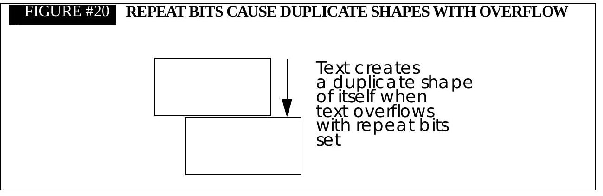

`V_REPEAT_BIT` or `H_REPEAT_BIT` — causes the `page_area` to "repeat" itself when text overflows the bottom (see section 13.3, [Repeating Shapes](#13.3-repeating-shapes)).

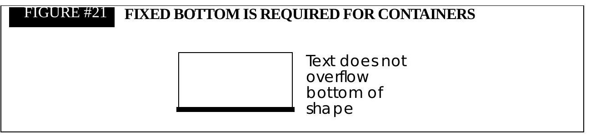

`BOTTOM_FIXED_BIT` — forces the `page_area`'s bottom to remain the same (otherwise, the bottom is considered infinite or "variable" as text grows or shrinks).

**NOTE:** This bit should be set for implementing "containers." See chapter 14, [Containers Support](#14-containers-support).

`NO_CONTAINER_JMP_BIT` — causes text to stay within one rectangle of the shape unless a container break character is encountered. (The usual purpose of setting this mode is for "form" documents and other matrix formats in which text can't leave a "cell" unless explicitly tabbed to do so).

`MAX_SCROLL_ON_SHAPE` — causes HERMES Paige to compute the maximum vertical scrolling values by the bottom-most rectangle in the page area (as opposed to the bottom-most text position).

**NOTE:** This bit should be set for implementing "containers." See chapter 14, [Containers Support](#14-containers-support).

`NO CLIP_PAGE_AREA` — causes text drawing to be clipped to the page area. Normally, text is only clipped to the vis area. If this bit is set, it is clipped to the intersection of vis area and page area.

**NOTE:** You generally want this bit set for "containers" and/or non-rectangular wrap shapes.

Each attribute is said to be "on" if the bit is set. The default, after `pgNew`, is all zeros (all clear).

**NOTE:** If either "repeat" bit is set, `BOTTOM_FIXED_BIT` attribute is implied (and assumed) even if `BOTTOM_FIXED_BIT` is clear. This is because a shape cannot "repeat" unless the bottom is unchangeable.

`WINDOW_CURSOR_BIT` — causes the caret to stay within the `vis_area` regardless of where the document scrolls.

`COLOR_VIS_BIT` — informs HERMES Paige that the page background colour is one and the same as the window's background colour. Setting this bit causes all "erased" areas to be painted with the page colour. Usually you want to set this bit to avoid "flashing" during scrolling if your window's background is non-white and it is the same as the page background colour.

`repeat_slop` — defines the minimum amount of vertical space, in pixels, remaining at the end of a document before the page shape repeats (new page “appended”). Used for repeating shapes only.

`exclusion_inset` — defines the amount to inset each exclusion rectangle for clipping. For example, if `exclusion_inset` were -1, each exclusion rectangle would be expanded 1 pixel larger before being subtracted from the clipped text display.

`caret_width_extra` — defines the width of the caret, in pixels. The default is 1.

`scroll_inset` — defines the amount to inset the `vis_area` when scrolling. For example, if `scroll_inset` were 1, a call to `pgScroll() `would visually scroll the `vis_area` minus 1 pixel on all four sides.

`minimum_widow` — defines the minimum number of lines that can exist at the end of a page, otherwise the paragraph breaks to the next page.

`minimum_orphan` — defines the minimum number of lines that can exist at the beginning of a new page, otherwise the whole paragraph breaks to the new page.

`repeat_offset` — defines the distance or "gap" to place between repeated shapes (see section 13.3, [Repeating Shapes](#13.3-repeating-shapes)).

`num_pages` — contains the current "number of pages," which is really the number of times the shape will repeat itself if the whole document was displayed.

**NOTE:** This is not necessarily the number of physical pages that should be printed!

Repeating shapes can have "blank" pages due to the slop value on a nearly-filled page causing a new repeat. For correct printing, see pgPrintToPage.

ref_con — Can contain anything you want.

**TODO:** Currently, `page_origin`, `print_target` and `margins fields` are not supported but are provided for future enhancements and extensions.

### TECH NOTE: Continuous document

> The example demos had spacing above the document that I couldn't get rid of. I'm interested in some of the "multimedia" features of HERMES Paige, but I want a "streaming" document (no margins/headers/footers spaces). How do I get rid of the spacing so that all of the document is one long stream of data?

By "spacing" I assume you mean the white space between page breaks. We simply chose to implement the demo this way, with the "repeating shape" feature in HERMES Paige. Using this implementation, the pages show exactly as they will appear when printed, i.e. with all the paper margins in each side including top/bottom.

Some developers like to implement documents that way, yet some prefer the method that you mention (as one continuous "page"). To do one continuous page, one simply does not implement the "repeating shape,"; non-repeating shapes is actually the default mode. You can examine non-repeating shapes in our "Simple Demo" for Macintosh

For information on page breaks in a continuous document see technical note [Artificial page breaks](#tech-note:-artificial-page-breaks).

### TECH NOTE: Relationship of `page_area`, `vis_area` and clipping regions clarified

> I am having difficulty setting the appropriate attributes to make my document behave in a certain way...[etc.].

It is important to understand the relationship between the `vis_area`, `page_area`, and the various attribute bits in a `pg_ref` thăt might affect the behavior of both shapes (by `attribute bits` is meant the value(s) originally given to the `flags` parameter for `pgNew` and/or new attribute settings given in `pgSetAttributes`) and/or the attributes set in `pg_doc_info`.

The most essential difference between a `pg_ref`'s page area versus `vis_area` is the `page_area` is the "container" in which text will wrap, while its vis area simply becomes the document's clipping region.

Generally, the `vis_area` remains constant and unchanging, whereas the `page_area`, particularly its bottom, can change dynamically as text is inserted or deleted, depending on the attribute flags that are set in the `pg_ref`. The following is the expected behaviour of the page_area when different attribute flags are set in the `pg_ref`:

#### Table 4: Expected behaviour of `page_area` attributes

| ATTRIBUTE BITS | `page_area` BEHAVIOUR | CLIPPING |
| :--- | :--- | :--- |
| no bits set (default) | Bottom grows/shrinks dynamically as text is inserted or deleted (see notes below). | All drawing is clipped to intersection of `vis_area` and the window's current clip region. |
| `BOTTOM_FIXED_BIT` | Bottom remains constant, never changes regardless of the text content | All drawing is clipped to intersection of `vis_area`, `page_area` and the window's current clip region. |
| `NO_WINDOW_VIS_BIT` | No effect | Same as above except window's clip region *is not* included in the clip region |
| `EX_DIMENSION_BIT` (`pgNew()` flag) | No effect visually, but the total height of the doc's contents include the exclusion area shape (otherwise the exclusion area is not considered part of the document's dimensions). | No effect visually |
| `COLOR_VIS_BIT` | No additional effect (but `vis_area` is erased with the background colour) | No effect visually |
| `V_REPEAT_BIT` | Shape automatically repeats when text fills to its bottom, achieving multiple page effect. | Each repeating shape intersects with clip region |
| `NO_CLIP_REGION` | No effect | No clipping is set at all (the application must set the clipping area) |

##### NOTES

On default behaviour (when no attributes have been set):

1. In the default mode, the `page_area`'s bottom is said to grow dynamically to enclose the total height of text. In this case, the bottom of the `page_area` originally given to `pgNew` is essentially ignored; the page area's *top*, however, is not ignored, as that defines the precise top position of the first line of text.
2. When the page area's bottom is said to "grow" dynamically in the default mode, the shape itself does not actually change, rather HERMES Paige temporarily pretends its bottom matches the text bottom when it paginates or displays. Although the `page_area` appears to "grow," any time you might examine the page area shape, its bottom would not be changed from the original dimensions (to get document's bottom, use `pgTotalTextHeight` instead).
3. `NO_WINDOW_VIS_BIT` works only in the Macintosh version and has no effect in the Windows version.

## 13.2 Getting/Setting Document Info

	(void) pgGetDocInfo (pg_ref pg, pg_doc_ptr doc_info);
	(void) pgSetDocInfo (pg_ref pg, pg_doc_ptr doc_info, pg_boolean inval_text, short draw_mode);

To obtain the current document info settings for `pg`, call `pgGetDocInfo`, and a copy of the document info record will be placed in `*doc_info`.

To change the document info, call `pgSetDocInfo` and pass a pointer to the new information. HERMES Paige will copy its contents in `pg`.

If `inval_text` is TRUE, HERMES Paige marks all the text in `pg` as "not paginated," forcing new word-wrap calculations the next time it paginates the document (which will normally be the next time the contents of `pg` are drawn).

`draw_mode` can be the values as described in [Draw Modes](#draw-modes) under section 2.11:

	typedef enum
	{
		draw_none,			// Do not draw at all
		best_way,			// Use most efficient method(s)
		direct_copy,		// Directly to screen, overwrite
		direct_or,			// Directly to screen, "OR"
		direct_xor,			// Directly to screen, "XOR"
		bits_copy,			// Copy offscreen
		bits_or,			// Copy offscreen in "OR" mode
		bits_xor,			// Copy offscreen in "XOR" mode
		bits_emulate_copy	// Copy "fake" offscreen
		bits_emulate_or	// "Fake" offscreen in "OR" mode
		bits_emulate_xor	// "Fake" offscreen in "XOR" mode
	};

## 13.3 Repeating Shapes

If `V_REPEAT_BIT` or `H_REPEAT_BIT` is set in the attributes field of `pg_doc_info`, the `page_area` shape will "repeat" itself each time text overflows the bottom. For `V_REPEAT_BIT`, the shape repeats itself vertically; for `H_REPEAT_BIT`, the shape repeats itself horizontally (see Figure 15<!-- on page 12-13-->).

However, the shape itself does not physically grow. Instead, HERMES Paige displays the shape repeatedly down the screen, one *page* at a time. Hence, if you changed `page_area` to some other shape while one of the `repeat` bits were on, then all repeating shapes will change to the new shape.

The simplest application of the `repeat` bits is to provide a page rectangle (in original `page_area`), then as the document grows multiple "pages" are added.

Note that the term `page` is used here to describe a logical section of a document: the original shape does not really need to be a `page` rectangle, rather it could be a set of columns or any non-rectangular shape. In any event, the entire shape `repeats` itself each time text fills it up.

For such a feature, if you require a "gap" (page break area), you can do so by setting `repeat_offset` in `pg_doc_info` to a non-zero value. This is the amount, in pixels, to add between repeated shapes. Note that `repeat_offset` is a `co_ordinate`. This means you can specify both a vertical and horizontal displacement for repeated shapes (a horizontal displacement + vertical displacement would cause a "staircase" effect).

If the shape is to repeat vertically, each occurrence of the shape falls below the last one; for horizontal repeating, each occurrence falls to the right of the last one. The "gap" (`repeat_offset`), however, is added to the appropriate corresponding sides:

`repeat_offset.v` always displaces the repeating shape vertically and `repeat_offset.h` always displaces horizontally, regardless of whether `V_REPEAT_BIT` or `H_REPEAT_BIT` is set.

The purpose of the `repeat_slop` field is to append a repeated shape before text actually fills the entire shape.

For example, many applications prefer a new "page" to become available when text is almost filled to the bottom of the last page. The value you place in `repeat_slop` is used for this purpose, and is used by HERMES Paige as follows: once the bottom of text + `repeat_slop` ≥ the shape's bottom, the shape is repeated.

##### NOTES
1. Only the text bottom is measured against the shape, not the right or left sides. Even if you set `H_REPEAT_BIT`, a shape only repeats when text BOTTOM + `repeat_slop` hits or surpasses the shape's bottom.
2. Only one of `H_REPEAT_BIT` or `V_REPEAT_BIT` should ever be set at a time (the shape will not repeat both ways).

For more details on how HERMES Paige paginates, see chapter 37, [Advanced Text Placement](#37-advanced-text-placement).

### TECH NOTE: Artificial page breaks

> I am doing my word processor similar to MS Word. I put in a page break and draw my line dividing the pages. But when I go to print, HERMES Paige draws a single page, the text does not break to the next page.

The only real problem is if a `pg_ref` has no repeating shapes (or containers), a page break char has no place to "jump." Well, then during printing—just before `pgPrintToPage`—all one needs to do is set repeating shapes, then print. When printing is done, restore non-repeating shapes. That will cause HERMES Paige to work "correctly."

But when you want to go to page view mode, you should then switch to repeating shapes, just as the above note does for printing. That will help solve your problem.

Note that in a long document, anything exceeding 10 pages, finding a page will require pagination which the user wili probably notice. This is why word includes a "Paginate Now" menu item in the menu! You will probably want to paginate once and then I believe `pgFindPage` should work more quickly. If you don't allow HERMES Paige to paginate, it can't know which character is the top of the page! HERMES Paige (and all other word processors that display WYSIWYG pages) will have to repaginate to find the positions of the first character on the page. HERMES Paige currently performs many tricks and second guessing on when and how to calculate those positions.

Please note that HERMES Paige cannot make the same assumptions as Word on *when* to perform those calculations. We must sometimes rely on the developer to know when to perform the pagination.

## 13.4 Repeating shapes examples

In Figure 13<!-- on page 12-10-->, the initial `page_area` shape contains text which is within the bounds of the shape. Once text overflows the bottom, the shape is repeated and placed at `repeat_offset.v` pixels down and `repeat_offset.h` pixels across.

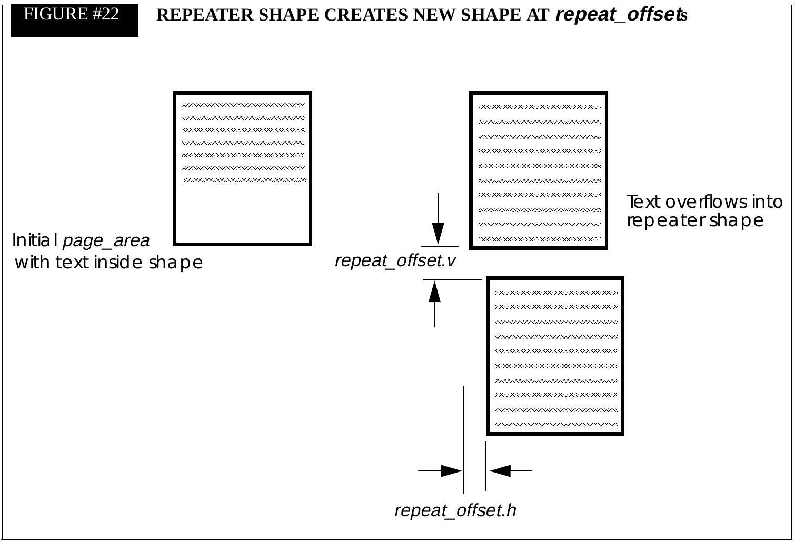

The next illustration shows what happens when `repeat_stop` is nonzero. In this example, `repeat_stop`'s value is added to the bottom of the text and, if the result overflows the shape's bottom, the shape is repeated. This provides an 'extra page' to get added before the text completely fills the page shape.

##### Figure 23. The shape when text gets below the `repeat_stop` value.
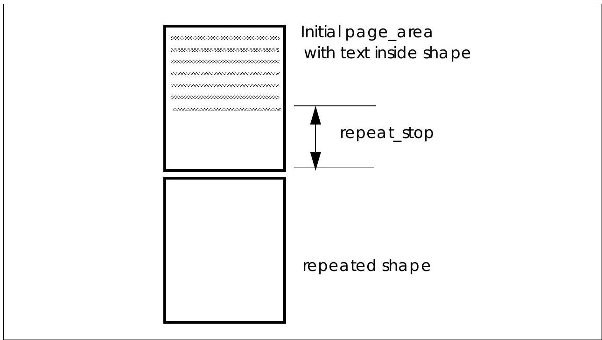

A repeating shape can actually be any shape and does not need to be a "page" rectangle. Figure 17<!-- on page 12-15--> shows an example of "columns" repeating for each "page."

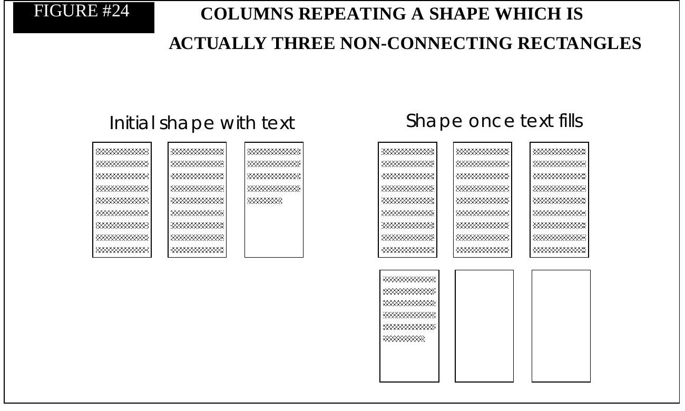

## 13.5 Shape Repeat Deletions

Repeated shapes will "delete" themselves if text shrinks above the repeated shape.

For example, if text filled up "page 1" causing a "page 2" to be created, deleting all the text will effectively delete "page 2."

## 13.6 Widows and Orphans

HERMES Paige supports "widow and orphan" control, to a certain extent. When lines are computed to flow within repeating shapes (multiple "pages"), whenever `pg_doc_info.minimum_widow` is non-zero, HERMES Paige will force a whole paragraph to the next page if its number of lines on the bottom of the page are equal to or less than minimum_widow.

Similarly, if `pg_doc_info.minimum_orphan` is non-zero, the whole paragraph is forced to the next page if its number of lines already breaking to the next page are less than or equal to minimum_orphan.

## 13.7 Header \& Footer Support

While HERMES Paige does not directly support "headers and footers," a number of functions are provided to implement them more easily.

### Page modify hook

This "hook" allows an application to temporarily modify the top, left, right and bottom margins of a "page" before pagination occurs. This is useful for header/footer/footnote support since temporary "exclusion" areas can be tailored for any specific page—and without actually modifying the exclusion shape itself.

	PG_PASCAL (void) page_modify_proc) (paige_rec_ptr pg, long page_num, rectangle_ptr margins);

The above is the prototype for `page_modify`. This is a general HERMES Paige hook (not a style hook). When this gets called, `page_num` will indicate a *zero-indexed* page number and margins will point to a "rectangle" that represents four margins.

HERMES Paige calls this hook for every page that it "paginates." Note that the margins rectangle is not actually `rectangle`, rather it represents four margin values to add to the top or left, and/or subtract from bottom or right. Normally, these values will be zero (no extra margins); but if you wanted to remove, say, 16 pixels of space from the bottom of the page, you would set `margins -> bot_right.v` to 16.

Each time this function is called, all four "margins" are cleared to zero (the default). Hence if your function does nothing, the page remains the original size.

This hook is also very useful for alternating "gutters," i.e. extra space on the right side for odd pages and the same extra space on the left side for even pages, etc.

**CAUTION:** The top and bottom of the page can be modified randomly, i.e. each page can be different. Modifying left and/or right sides, however, must result in the same width for all pages. For example, you should not modify the left or right sides of page 1 but leave page 2's left or right side alone; it is OK to alternate sides as they are modified as long as the distance between left and right edges remain the same.

For additional information, see also chapter 27, [Customising HERMES Paige](#27-customising-hermes-paige).

	void pgTextboxDisplay (pg_ref pg, paige_rec_ptr target_pg, rectangle_ptr target_box, rectangle_ptr wrap_rect, short draw_mode);

The above function is useful for drawing a `pg_ref` to any arbitrary location; the text will move (and optionally wrap) to a specified target location regardless of where its "normal" coordinates exist.

**PURPOSE:** Since most applications that implement headers and footers use `pg_ref`s for a "header" or "footer", this new function exists for header/footer utilities.

If `target_pg` is not null, the drawing occurs to the graphics device attached to that HERMES Paige record; otherwise the drawing occurs to the device attached to `pg`. Note there are two usual ways to obtain a `paige_rec_ptr`: the first is from a low-level hook, in which case the `paige_rec_ptr` is usually one of its parameters. The second way is to do `UseMemory(pg_ref)` and then `UnuseMemory(pg_ref)` when you are done using the `paige_rec_ptr`.

The `target_box` parameter is a pointer to a rectangle which defines bounding "box" in which to draw the text. This rectangle defines the top-left position of the drawing as well as the clipping region. Text *will not* rewrap into this shape; rather, it repositions its text to align with the box's top-left coordinate, and `target_box` also becomes the clipping region.

The `wrap_rect` parameter is a pointer to an optional, temporary "page `rect`" for the text to wrap. If this is a null pointer, the `page_area` is used within `pg` (the source `pg_ref`).

The `draw_mode` is identical to all other functions that accept a drawing mode.

HERMES Paige supports several other page finding and setting commands. These are closely aligned with printing. These are shown in sections 16.6, [Computing Pages](#16.6-computing-pages) , and 16.7, [Skipping Pages](#16.7-skipping-pages). Custom page display techniques are described in section 16.9, [Display Proc](#16.9-Display-proc).

# 14 CONTAINERS SUPPORT

HERMES Paige has some built-in support for this purpose by providing several functions to insert, delete and change a list of rectangles that constitute `page_area`, as well as the ability to attach an application-defined reference to each "container" of the shape.

The term *container* is used to describe a rectangular portion of the `page_area`. For an application to support page-layout text containers, the typical method is to build the `page_area` (the shape in a `pg_ref` in which text will flow) with the desired series of rectangles.

## 14.1 Setting Up for "Containers"

By default, a `pg_ref` will not necessarily handle containers the way you might expect without first setting the appropriate values in `pg_doc_info`.

Before using any of the functions below, you should set *at least* the `BOTTOM_FIXED_BIT` and `MAX_SCROLL_ON_SHAPE` bits using `pgSetDocInfo`.

These bits are not set by default, so you should set them soon after `pgNew` and before inserting or displaying a `pg_ref` with "containers". For more information about `pgSetDocInfo` see section 13.2, [Getting/Setting Document Info](#13.2-getting/setting-document-info).

### Setting up for containers

	void setup_for_containers (pg_ref pg)
	{
		pg_doc_info info;
		pgGetDocInfo(pg, &info);
		info.attributes = BOTTOM_FIXED_BIT | MAX_SCROLL_ON_SHAPE;
		pgSetDocInfo(pg, &info, FALSE);
	}

The purpose of `BOTTOM_FIXED_BIT` is to keep the last rectangle from "growing" along with text.

`MAX_SCROLL_ON_SHAPE` is optional, but will usually be what you want. Normally, HERMES Paige will assume the maximum vertical scrolling position is the same as the bottom-most text position. In a "containers" application, however, that is often undesirable since a document can contain many "empty" containers. By setting `MAX_SCROLL_ON_SHAPE`, HERMES Paige will find the bottom-most page area rectangle for computing maximum vertical scrolling.

## 14.2 Setting and Maintaining "Containers"

### Number of containers

	(pg_short_t) pgNumContainers (pg_ref pg); 

Returns the number of "containers" currently in `pg`. This function actually returns the number of rectangles in the page area. Initially, after `pgNew`, the answer will be however many rectangles were contained in the initial page_area shape, which will be at least one rectangle.

### Inserting containers

	(void) pgInsertContainer (pg_ref pg, rectangle_ptr container, pg_short_t position, long ref_con, short draw_mode);

This makes a copy of the rectangle pointed to by `container` and inserts it into `pg`'s `page_area`. Consequently, text will flow within the new shape now including the container rectangle, hence a new "container" is inserted.

Assuming that the current page area shape is a series of rectangles, from 1 to *n*, the new rectangle is inserted after the rectangle number in the `position` parameter. However, if `position` is zero, the new container is inserted at the beginning (becomes first rectangle in the shape). If `position` is `pgNumContainers(pg)`, it is inserted as the very last rectangle.

You can also "attach" any long-word value (such as a pointer or some other reference) to the new "container" by passing that value in `ref_con`. Consequently, you can access this value at any time using `pgGetContainerRefCon` (see [Container refCon](#Container-refcon) under section 14.2).

`draw_mode` can be the values as described in [Draw Modes](#draw-modes) under section 2.11:

	typedef enum
	{
		draw_none,			// Do not draw at all
		best_way,			// Use most efficient method(s)
		direct_copy,		// Directly to screen, overwrite
		direct_or,			// Directly to screen, "OR"
		direct_xor,			// Directly to screen, "XOR"
		bits_copy,			// Copy offscreen
		bits_or,			// Copy offscreen in "OR" mode
		bits_xor,			// Copy offscreen in "XOR" mode
		bits_emulate_copy	// Copy "fake" offscreen
		bits_emulate_or	// "Fake" offscreen in "OR" mode
		bits_emulate_xor	// "Fake" offscreen in "XOR" mode
	};

**NOTE:** The position parameter is not checked for validity! Make sure it is within the boundaries between 0 and `pgNumContainers(pg)` or a crash can result. (Also note that the other container functions given here require that the range be between 1 and `pgNumContainers`; only in `pgInsertContainer` can position be zero).

### Getting particular container

	void pgGetContainer (pg_ref pg, pg_short_t position, pg_boolean include_scroll, pg_boolean include_scale, rectangle_ptr container);

Returns the "container" rectangle defined by the position parameter. This can be any of the rectangles contained in `pg`'s page area, from 1 to `pgNumContainers(pg)`. The rectangle is copied to the structure pointed to by the container parameter.

If `include_scroll` is TRUE, the container returned will be in its "scrolled" position (as it would appear on the screen). If `include_scale` is TRUE, the container returned will be scaled to the appropriate dimensions (based on the scaling factor in `pg`).

range-checking on position is not performed. Make sure it is a valid rectangle number.

### Container `refCon`

	(long) pgGetContainerRefCon (pg_ref pg, pg_short_t position);
	(void) pgSetContainerRefCon (pg_ref pg, pg_short_t position, long ref_con);

The application-defined reference that is "attached" to container `position` is returned from `pgGetContainerRefCon`; you can also set this value using `pgSetContainerRefCon`.

Range-checking on `position` is not performed. Make sure it is a valid rectangle number.

**NOTE:** HERMES Paige does not know what you have set in `ref_con`, hence if you have set some kind of memory structure it is your responsibility to dispose of it before `pgDispose`.

### 14.3 Changing Containers

	(void) pgRemoveContainer (pg_ref pg, pg_short_t position, short draw_mode);

Deletes the rectangle of the `page_area` given in position. This value must be between 1 (first rectangle) and `pgNumContainers(pg)`. Range-checking on `position` is not performed.

**CAUTION:** Never delete the last (and only) "container." HERMES Paige does not check for this situation, and by deleting the only container you will essentially have no area for the text to flow!

**CAUTION:** If you have set a `ref_con` value attached to the container to be deleted, it is gone forever after calling this function. It is your responsibility to do whatever is appropriate prior to deleting the container, such as disposing any memory structures involved with the `refCon` value, etc.

	(void) pgReplaceContainer (pg_ref pg, rectangle_ptr container, pg_short_t position, short draw_mode);

Replaces container defined in `position` with the rectangle given in `container`. Note that only the rectangle in the page area is replaced; the `refCon` value will remain intact—unless you change it with `pgSetContainerRefCon`.

This is the function to use to change a container's dimensions, be it dragging, resizing, etc.

	(void) pgSwapContainers (pg_ref pg, pg_short_t container1, pg_short_t container2, short draw_mode);

The two containers defined by `container1` and `container2` "trade places." This function is therefore useful for "bring to front" and "send to back" features.

The associated `refCon` values for `container1` and `container2` are also reversed; i.e., both rectangles and attached `refCons` are swapped.

**CAUTION:** Range-checking is not performed. Ensure that `container1` and `container2` are valid rectangle numbers, between 1 and `pgNumContainers(pg)`.

##### Note

`draw_mode` can be the values as described in [Draw Modes](#draw-modes) under section 2.11:

	typedef enum
	{
		draw_none,			// Do not draw at all
		best_way,			// Use most efficient method(s)
		direct_copy,		// Directly to screen, overwrite
		direct_or,			// Directly to screen, "OR"
		direct_xor,			// Directly to screen, "XOR"
		bits_copy,			// Copy offscreen
		bits_or,			// Copy offscreen in "OR" mode
		bits_xor,			// Copy offscreen in "XOR" mode
		bits_emulate_copy	// Copy "fake" offscreen
		bits_emulate_or	// "Fake" offscreen in "OR" mode
		bits_emulate_xor	// "Fake" offscreen in "XOR" mode
	};


## 14.4 "Clicking" and Character Support

### Point within container

	(pg_short_t) pgPtInContainer (pg_ref pg, co_ordinate_ptr point, co_ordinate_ptr inset_extra);

Returns the container rectangle containing `point`, if any.

If `inset_extra` is non-NULL, every rectangle in the page area is first inset by `inset_extra -> h` and `inset_extra -> v` values before it is checked for containing point. Negative inset values expand the rectangle outwards, and positive numbers shrink the rectangle.

The usual purpose of `inset_extra` is to detect a certain amount of "slop" when looking for a mouse-click within a container. For example, if you want a container-click detection within four pixels of each container's edges, pass `inset_extra` as a pointer to a `co_ordinate` of (-4, -4).

**FUNCTION RESULT:** If no container contains point, zero is returned. Otherwise, the container number is returned (which will always be between 1 and `pgNumContainers(pg)`).

**NOTE:** Both scrolled position and scaling are taken into consideration by this function. In other words, container rectangles will be checked as they appear on the screen.

### Character within container

	(pg_short_t) pgCharToContainer (pg_ref pg, long offset);

Returns the container number, from 1 to `pgNumContainers(pg)`, containing the specified text offset. The `offset` parameter is relative to the start of all text and is a byte offset; it must be between 0 and `pgTextSize(pg)`.

However, `offset` can also be `CURRENT_POSITION` (`#define`d as -1) which will return the container number for the current insertion point (or the starting selection point if there is a highlight range).

	(long) pgContainerToChar(pg_ref pg, pg_short_t position);

Returns the text offset of the first character that exists in container number `position`. This function is useful to locate the first character within a container.

However, it is possible that the container has no text at all (text is not large enough to fill all containers), in which case the function result will be -1.

The `position` parameter must be between 1 and `pgNumContainers(pg)`.

**CAUTION:** Range-checking is not performed!

### TECH NOTE: Containers v. Repeating Shapes

> How expensive is containers support in general, compared to repeating shapes?

Repeating shapes are light-years faster, because they don't really "repeat," at least not physically. All a repeating shape does is repeat its display. If you have, say, a single-`rect` shape, if it is repeating that shape remains a single `rect` even if the doc repeats a million times.

Containers, on the other hand, consist of a physical array of rectangles. So that's one big difference—if a single `rect` repeats 100 times, the "containers" method will have 100 rectangles; a repeating shape of course has just one.

"Repeating" is fastest because HERMES Paige only has to consider one rectangle—and relative positions thereof. On the other hand, when computing word-wrapping within containers, HERMES Paige must continuously walk through *all* `rect`s to see which ones intersect the text line, etc. So the processing is much more extensive in this case.

The general rule is: If your shape, regardless of its complexity, must literally "repeat" in its exact form, then use *repeating shapes*. If your shape does not necessarily repeat as-is—or if the reoccurrence of the shape can be slightly different than the previous occurrence, then you are forced to use containers.

# 15 EXCLUSION AREAS

An HERMES Paige "exclusion" area is typically used for page layout features in which text will wrap around one or more rectangles, including complex shapes (which are also a series of small rectangles).

## 15.1 Setting \& Maintaining Exclusions

As in HERMES Paige's "container" support in the previous chapter, several functions are provided to insert, delete and change the series of rectangles in the exclude shape of an HERMES Paige object.

### Number of exclusions

	(pg_short_t) pgNumExclusions (pg_ref pg);

Returns the number of exclusion rectangles currently in `pg`. This function actually returns the number of rectangles in the exclude area. Initially, after `pgNew`, the answer will be however many rectangles were in your `exclude_area` shape, if any.

Unlike `pgNumContainers`, it is possible (and often likely) to have zero exclusion rectangles, so this function can legitimately report zero.

### Inserting exclusion

	(void) pgInsertExclusion (pg_ref pg, rectangle_ptr exclusion, pg_short_t position, long ref_con, short draw_mode);

This makes a copy of the rectangle pointed to by exclusion and inserts it into `pg`'s `exclude_area`. Consequently, text will flow around (will avoid) the new shape now including the exclusion rectangle.

If `position` is zero, the new exclusion is inserted at the beginning (becomes first rectangle in the shape). If `position` is `pgNumExclusions(pg)`, it is inserted as the very last rectangle.

It is possible that the current exclusion area in pg is empty or does not exist; for example, you might have passed a null pointer for `exclude_area` in `pgNew`. This function will recognise that situation and will work correctly, building an initial `exclude_area` if necessary. However, in this situation, the only valid position for insertion is zero.

You can also "attach" any long-word value (such as a pointer or some other reference) to the new `exclusion` rectangle by passing that value in `ref_con`. Consequently, you can access this value at any time using `pgGetExclusionRefCon` (see "Exclusion `refCon`" on page 15-267).

**CAUTION:** The position `parameter` is not checked for validity! Make sure it is within the boundaries between 0 and `pgNumExclusions(pg)` or a crash can result.

	(void) pgInsertExclusionShape (pg_ref pg, pg_short_t position, shape_ref exclude_shape, short draw_mode);

Inserts an entire shape into the exclusion area of `pg`. The list of rectangles within `exclude_shape` is inserted after rectangle number `position`; if `position` is zero, the shape is inserted at the beginning. If `position` is `pgNumExclusions(pg)`, the shape is inserted at the end.

If no exclusion area exists in `pg` prior to this function, the result is essentially the same as `pgSetAreas` to change or set a new exclusion area.

The contents of `exclude_shape` are copied, therefore you can dispose `exclude_shape` any time after calling this function.

**NOTE:** Associated `ref_con` values for all new rectangles will be initialised to zero.

##### Note

`draw_mode` can be the values as described in [Draw Modes](#draw-modes) under section 2.11:

	typedef enum
	{
		draw_none,			// Do not draw at all
		best_way,			// Use most efficient method(s)
		direct_copy,		// Directly to screen, overwrite
		direct_or,			// Directly to screen, "OR"
		direct_xor,			// Directly to screen, "XOR"
		bits_copy,			// Copy offscreen
		bits_or,			// Copy offscreen in "OR" mode
		bits_xor,			// Copy offscreen in "XOR" mode
		bits_emulate_copy	// Copy "fake" offscreen
		bits_emulate_or	// "Fake" offscreen in "OR" mode
		bits_emulate_xor	// "Fake" offscreen in "XOR" mode
	};

### 15.2 Get exclusion information

	(void) pgGetExclusion (pg_ref pg, pg_short_t position, pg_boolean include_scroll, pg_boolean include_scale, rectangle_ptr exclusion);

Returns the exclusion rectangle defined by the `position` parameter. This can be any of the rectangles contained in `pg`'s exclusion area, from 1 to `pgNumExclusions(pg)`. The rectangle is copied to the structure pointed to by the exclusion parameter.

If `include_scroll` is TRUE, the rectangle returned will be in its "scrolled" position (as it would appear on the screen). If `include_scale` is TRUE, the rectangle returned will be scaled to the appropriate dimensions (based on the scaling factor in `pg` ).

##### Warnings
1. Range-checking on position is not performed. Make sure it is a valid rectangle number.
2. Unlike containers, it is possible to have zero exclusion rectangles. You must not call this function if `pgNumExclusions = 0`.

## 15.3 Exclusion refCon

	(long) pgGetExclusionRefCon (pg_ref pg, pg_short_t position);
	(void) pgSetExclusionRefCon (pg_ref pg, pg_short_t position, long ref_con);

The application-defined reference that is "attached" to exclusion rectangle position is returned from `pgGetExclusionRefCon`; you can also set this value using `pgSetExclusionRefCon`.

##### Warnings

1. Range-checking on position is not performed. Make sure it is a valid rectangle number.
2. HERMES Paige does not know what you have set in `ref_con`; hence if you have set some kind of memory structure it is your responsibility to dispose of it before `pgDispose`.

## 15.4 Changing Exclusion Rectangles

### Removing exclusions

	(void) pgRemoveExclusion (pg_ref pg, pg_short_t position, short draw_mode);

Deletes the rectangle of the exclusion area given in `position`. This value must be between 1 (first rectangle) and `pgNumExclusions(pg)`. Range-checking on `position` is not performed.

**NOTE:** Unlike containers, it is acceptable to delete the last and only exclusion rectangle.

**CAUTION:** If you have set a `ref_con` value attached to the exclusion rectangle to be deleted, it is gone forever after calling this function. It is your responsibility to do whatever is appropriate prior to deleting the exclusion, such as disposing any memory structures involved with the `refCon` value, etc.

	(void) pgReplaceExclusion (pg_ref pg, rectangle_ptr exclusion, pg_short_t position, short draw_mode);

Replaces exclusion rectangle defined in `position` with the rectangle given in exclusion.

**NOTE:** Only the rectangle in the exclusion area is replaced; unless you change it with `pgSetExclusionRefCon`, the `refCon` value will remain intact.

This is the function used to change an exclusion rectangle's dimensions, be it dragging, resizing, etc.

### Swapping exclusions

	(void) pgSwapExclusions (pg_ref pg, pg_short_t exclusion1, pg_short_t exclusion2, short draw_mode);

The two exclusion rectangles defined by `exclusion1` and `exclusion2` "trade places". This function is therefor useful for "bring to front" and "send to back" features.

The associated `refCon` values for `exclusion1` and `exclusion2` are also reversed, i.e. both rectangles and attached `refCon`s are swapped.

CAUTION: Range-checking is not performed. Make sure `exclusion1` and `exclusion2` are valid rectangle numbers, between 1 and `pgNumExclusions(pg)`.

##### Note

`draw_mode` can be the values as described in [Draw Modes](#draw-modes) under section 2.11:

	typedef enum
	{
		draw_none,			// Do not draw at all
		best_way,			// Use most efficient method(s)
		direct_copy,		// Directly to screen, overwrite
		direct_or,			// Directly to screen, "OR"
		direct_xor,			// Directly to screen, "XOR"
		bits_copy,			// Copy offscreen
		bits_or,			// Copy offscreen in "OR" mode
		bits_xor,			// Copy offscreen in "XOR" mode
		bits_emulate_copy	// Copy "fake" offscreen
		bits_emulate_or	// "Fake" offscreen in "OR" mode
		bits_emulate_xor	// "Fake" offscreen in "XOR" mode
	};

## 15.5 "Clicking" Exclusion Rectangles

	(pg_short_t) pgPtInExclusion (pg_ref pg, co_ordinate_ptr point, co_ordinate_ptr inset_extra);

Returns the exclusion rectangle containing `point`, if any. It is safe to call this function even if there are no exclusion rectangles (in which case `pgPtInExclusion` will always return zero).

If `inset_extra` is non-NULL, every rectangle in the exclusion area is first inset by `inset_extra -> h` and `inset_extra -> v` values before it is checked for containing `point`.

Negative inset values expand the rectangle outwards, and positive numbers shrink the rectangle.

The usual purpose of `inset_extra` is to detect a certain amount of "slop" when looking for a mouse-click within an exclusion area. For example, if you want a click detection within four pixels of each exclusion's edges, pass `inset_extra` as a pointer to a `co_ordinate` of -4, -4.

**FUNCTION RESULT:** If no exclusion contains point, or if no exclusion area exists, zero is returned. Otherwise, the exclusion rectangle number is returned (which will always be between 1 and `pgNumExclusions(pg)`).

**NOTE:** Both scrolled position and scaling are taken into consideration by this function. In other words, rectangles will be checked as they appear on the screen.

## 15.6 Drawing Exclusion Contents

If your exclusion rectangle(s) contain some type of graphic image you need to draw, the recommended method for doing this is to use the `page_proc` hook. HERMES Paige calls this "hook" function after drawing each page of text; this is explained in chapter 27, [Customising HERMES Paige](#27-customising-hermes-paige).

## 15.7 Attaching Exclusions to Paragraphs

Any exclusion rectangle can be "attached" to the top of a paragraph. First, create the exclusion rectangle, then call the following function:

	void pgAttachParExclusion (pg_ref pg, long position, pg_short_t index, short draw_mode)

The exclusion rectangle is represented by `index`; this is a value from 1 to `pgNumExclusions(pg)`.

The paragraph is represented by the `position` parameter; this is a text position into the document, and the paragraph to which the exclusion rectangle attaches is the paragraph which contains the position.

**NOTE:** The text position does not need to be the exact position of a paragraph beginning, rather it can be anywhere within the paragraph (before the carriage return).

The exclusion rectangle, however, "attaches" to the top line of the paragraph regardless of the text position given.

After this function is called, the exclusion rectangle will constantly and dynamically align to the top line of the paragraph even as the text is changed or deleted. If the paragraph is deleted, the exclusion rectangle will still exist but will remain stationary and attached to no paragraph.

Otherwise, the exclusion rectangle is no different than any other exclusion rectangle—text will wrap around the rectangle appropriately, even if that text is part of the paragraph to which the exclusion is attached.

##### Notes and Warnings

1. Only the vertical position of the exclusion rectangle is aligned to the paragraph; its horizontal position will remain unchanged.
2. Do not attach more than one exclusion rectangle to the same paragraph or unexpected erroneous results will occur.

`draw_mode` can be the values as described in [Draw Modes](#draw-modes) under section 2.11. The document will redraw in its entirety if any `draw_mode` but `draw_none` is selected; otherwise, the document will not redraw at all.

	typedef enum
	{
		draw_none,				// Do not draw at all
		best_way,					// Use most efficient method(s)
		direct_copy,			// Directly to screen, overwrite
		direct_or,				// Directly to screen, "OR"
		direct_xor,				// Directly to screen, "XOR"
		bits_copy,				// Copy offscreen
		bits_or,					// Copy offscreen in "OR" mode
		bits_xor,					// Copy offscreen in "XOR" mode
		bits_emulate_copy	// Copy "fake" offscreen
		bits_emulate_or		// "Fake" offscreen in "OR" mode
		bits_emulate_xor	// "Fake" offscreen in "XOR" mode
	};

### Determining the Attached Paragraph

To determine if an exclusion rectangle is currently attached to a paragraph, call the following function:

	long pgGetAttachedPar(pg_ref pg, pg_short_t exclusion);

The exclusion rectangle in question is represented by `exclusion`; this can be any value from 1 through `pgNumExclusions(pg)`.

This function returns the text position of the paragraph to which the exclusion is attached, if any.

If the exclusion is attached to no paragraph, the function returns -1.


# 16 SCALING, PRINTING \& DISPLAYING

## 16.1 Scaling

An HERMES Paige object can be scaled, which is to say enlarged or reduced by a specified amount.

Scaling, however, must be equal for both vertical and horizontal dimensions.

The scaling factor is maintained by HERMES Paige using the following record:

	typedef struct
	{
		co_ordinate origin;	// Relative origin
		pg_fixed scale;		// Scaling (hiword/loword fraction)
	}
	pg_scale_factor, PG_FAR *pg_scale_ptr;

The `origin` field *supra* contains the origin point to compute scaling. Generally, this should be the top-left point of your overall `page_area` (text flow area). The purpose of the `origin` value is for HERMES Paige to know what scaling is relative to, or stated more simply, what is the top-left point of the entire area that is being scaled.

The `scale` field is a `long` whose high-order and low-order words define a numerator and denominator. Stated as a formula, the `scale` value is computed as:

	high word of (scale) / low word of (scale)

Hence, if scale is 0x00020001, scaling is 2-to-1 (`2 / 1`); if scale is 0x00010002, then scaling is 1-to-2 (`1 / 2`), etc.

If the scale value is zero, that is interpreted as no scaling (same as `1 / 1`).

## 16.2 Scaling a HERMES Paige Object

	(void) pgSetScaling (pg_ref pg, pg_scale_ptr scale_factor, short draw_mode);

This sets the scaling for `pg`. The scale_factor parameter must be a pointer to a `pg_scale_factor` *supra*; it cannot be a null pointer. From that moment on, `pg` will display and edit in the specified scaled amount.

To obtain the current scaling factor, call:

	(void) pgGetScaling (pg_ref pg, pg_scale_ptr scale_factor);

The scaling factor of `pg` is returned in the `pg_scale_factor` pointed to by `scale_factor` (which cannot be null).

##### Notes

1. HERMES Paige makes a copy of your `scale_factor`, so it does not need to remain static.

2. On *Macintosh* only, scaling text may be inaccurate for environments that do not support Color QuickDraw.

3. `draw_mode` can be the values as described in [Draw Modes](#draw-modes) under section 2.11. If `draw_mode` is not `draw_none`, the text is redrawn in the new scale. 

   ```
   typedef enum
   {
   	draw_none,				// Do not draw at all
   	best_way,					// Use most efficient method(s)
   	direct_copy,			// Directly to screen, overwrite
   	direct_or,				// Directly to screen, "OR"
   	direct_xor,				// Directly to screen, "XOR"
   	bits_copy,				// Copy offscreen
   	bits_or,					// Copy offscreen in "OR" mode
   	bits_xor,					// Copy offscreen in "XOR" mode
   	bits_emulate_copy	// Copy "fake" offscreen
   	bits_emulate_or		// "Fake" offscreen in "OR" mode
   	bits_emulate_xor	// "Fake" offscreen in "XOR" mode
   };
   ```

## 16.3 Scaling and Vis Areas

A scaled `pg_ref` normally does not scale its `vis_area`. If the attribute flag `scale_vis_bit` has been set in the `pg_ref`, the `vis_area` is scaled, otherwise the `vis_area` remains unscaled.

**Fig. 25 needs redrawn!**

`SCALE_VIS_BIT` is usually set when one or more `pg_ref`s are components of a larger document, not the whole document itself. For example, an object-oriented drawing program using HERMES Paige to show text objects would probably want to set `SCALE_VIS_BIT` to achieve the rendering as shown in the bottom part of the above example.

A general word-processor window, however, would probably not want `SCALE_VIS_BIT`; instead, it may be more desirable to leave the `vis_area` alone, as shown in the top part of the above example.

## 16.4 Additional Scaling Utilities

	(void) pgScaleLong(long scale_factor, long origin, long PG_FAR *value);
	(void) pgScalePt(pg_scale_ptr scale_factor, co_ordinate_ptr amount_offset, co_ordinate_ptr pt);
	(void) pgScaleRect(pg_scale_ptr scale_factor, co_ordinate_ptr amount_offset, rectangle_ptr rect);

The three functions above will scale a `long`, a `co_ordinate` and a `rectangle`, respectively.

For `pgScaleLong`, the `scale_factor` is only the "scale" part of a complete `pg_scale_factor` and the `origin` is the appropriate origin position. The value to scale must be pointed to by value and the value will be scaled when the function returns.

For `pgScalePt`, the `pt` parameter gets scaled by the scaling factor in `scale_factor`; for `pgScaleRect`, the `rect` parameter is scaled by `scale_factor`. For both `pgScalePt` and `pgScaleRect`, `amount_offset` should be a pointer to the amount the document is "scrolled", or a null pointer if this does not matter.

Usually, `amount_offset` should be a negative compliment of `pgScrollPosition(&offset)`, as:

	co_ordinate offset;
	pg_scale_factor scaling;
	
	pgGetScaling(pg, &scaling);
	pgScrollPosition(pg, &offset);
	pgNegatePt(&offset);
	pgScaleRect(&scaling, &amount, &rect);
	
	(void) pgScaleRectToRect(pg_scale_ptr, scale_factor, rectangle_ptr src_rect, rectangle_ptr target_rect, co_ordinate_ptr offset_extra);

This function is similar to `pgScaleRect` except the scaled result of `src_rect` is placed in `target_rect`. In addition, `src_rect` is temporarily offset before being scaled by `offset_extra` amounts (unless `offset_extra` is a null pointer).

### TECH NOTE: Scaling a point inside a shape

> I was looking through the manual and can't seem to find any function that scales a whole shape. Am I missing something?

You are right, HERMES Paige does not have a "scale shape" function, probably because it does not need one internally. That is because nothing inside an HERMES Paige document is ever really "scaled"; it's all an illusion. Only the drawing itself is scaled; all shapes and text positions remain the same at all times.

HERMES Paige locates a mouse point in a scaled document by "reverse scaling" the mouse point. By that I mean it scales the `co_ordinate` in question the opposite amount that the document is (apparently) scaled.

It's fairly easy to reverse-scale something. All you do is negate the current scale factor, for example:

	scale_factor.scale = -scale_factor.scale;
	pgScalePt(&scale_factor, &point);

This brings up an interesting point. Although I can see that your function to find a point in a scaled shape will work, perhaps a much faster method is to reverse-scale the point instead of scaling the whole shape, then just find the point without the non-scaled shape.

## 16.5 Printing Support

**IMPORTANT:** Do not confuse "pages" in the context of printing with "paging" for repeating shapes. These are two different concepts entirely. Printed pages are simply sections of text; "pages" of repeating shapes are simply repeating display of the same shape, and in fact, might not contain text at all. A printed page and repeating shape page are not necessarily the same dimensions. See section 13.3, [Repeating Shapes](#13.3-repeating-shapes).

"Printing" for HERMES Paige is simply an alternate method of displaying its text offset and pinned neatly to a specified "page" rectangle. In itself it knows nothing about printing or printer devices.

The following function is intended to handle most printing requirements:

	(long) pgPrintToPage (pg_ref pg, graf_device_ptr target, long starting_position, rectangle_ptr page_rect, short draw_mode); 

The target parameter is an optional pointer to a graphics device other than `pg`'s default device (see section 3.4, [Graphic Devices](#3.4-graphic-devices)).

The `starting_position` parameter is the text offset, in bytes of the first text that should be printed (this is a zero-indexed number).

The function will draw as much text that can completely fit inside `page_rect`, starting with `starting_position` in `pg`, and drawing the first line relative to `page_rect`'s top-left. No text will be drawn that does not completely fit vertically inside `page_rect`, hence no "half lines" will exist at `page_rect`'s bottom. Horizontal fitting is not checked—see note below.

The effective result of this function is that a "page" of text is drawn to some specified device.

The `draw_mode` parameter should generally be set to `best_way`, `direct_or` or `bits_emulate_or`.

Highlighting and the "caret" is suppressed when the text is drawn by this function and the current `vis_area` is ignored (it is temporarily replaced with the dimensions of `page_rect`).

**FUNCTION RESULT:** The function returns the next text position following the last line printed. If no more text is available (all text fit from starting_offset to end of document), zero is returned.

To print consecutive pages, you would print the first page with `starting_offset = 0`, then call `pgPrintToPage` again with `starting_offset = function result`, and continue doing so until the function result is zero.

During the time `pgPrintToPage` is being executed, `pg`'s attribute flags will have `PRINT_MODE_BIT` set.

##### NOTES:

1. Text is not automatically rewrapped to `page_rect` even if `page_rect` is a different width than `pg`'s `page_area`. Whether or not the lines will spill off to the right is also not checked. It is therefore your responsibility to make sure `page_rect` is wide enough and, if necessary, force `pg` to rewrap by changing the `page_area` first.
2. If you want to print in a "scaled" state, simply set `pg` to the desired scaling then print the pages.

### Printing in Windows

HERMES Paige printing for Windows is similar to Macintosh in the sense that drawing is temporarily redirected to some device other than the application document window.

When calling `pgPrintToPage`, you need to set up a `graf_device` (a multipurpose output device for platform-independent drawing) and pass a pointer to that record in the target parameter.

To create the `graf_device`, use:

	(void) pglnitDevice(pg_globals_ptr globals, generic_var the_port, long machine_ref, graf_device_ptr device);

The `globals` parameter must be a pointer to HERMES Paige globals (same structure given to `pgInit()` and `pgNew()`). Pass `MEM_NULL` to `the_port`. For Windows, this would normally be type `HWND` but in this case there isn't any window associated with the device.

Pass the Device Context handle in `machine_ref`. This should be the `HDC` that you will be "printing" to.

After calling `pgInitDevice()` you then pass the `graf_device` structure to `pgPrintToPage()` as the target parameter.

Once you are completely through using the `graf_device`, you must call the following:

	(void) pgCloseDevice (pg_globals_ptr globals, graf_device_ptr device);

The `globals` parameter must point to the same HERMES Paige globals as before; the device parameters must be a pointer to the `graf_device` previously initialised with `pgInitDevice`.

##### Notes
1. `pgCloseDevice` only disposes memory structures created by HERMES Paige. The Device Context is not affected.
2. When creating a `graf_device` in this fashion, the Device Context given to `pgInitDevice` must remain valid until you are completely through drawing to the device (and consequently call `pgCloseDevice`).

### Printer Resolution

If you create a `graf_device` for printing per the instructions above, you do not need to do anything special with regard to the resolution of the target print device. The `pgInitDevice()` function will resolve all resolution issues and `pgPrintToPage()` should render the image correctly.

### Sample to print on the Macintosh

Here is an example of printing a `pg_ref` to a standard Macintosh print driver. Note that you must first create a `graf_device` for HERMES Paige to accept the print driver as the current "port". This example shows how to do that as well:

	void print_pg_doc(pg_ref pg, THPrint print_rec)
	{
		Rect page_rect;
		rectangle pg_page;
		graf_device pg_port;
		long print_offset;
		int cancel;
		short page_num;
		TPPrPort print_port;
		TPrStatus p_status;
		page_rect = (**print_rec) prInfo.rPage;
		RectToRectangle(&page_rect, &pg, page);
		// print page rectangle
		
		print_port = PrOpenDoc(print_rec, NULL, NULL);
		pgInitDevice(&paige_rsrv, print_port, 0, &pg_port);
		// Makes graf_device
		cancel = FALSE;
		
		print_offset = 0;
		page_num = 1;
		
		while (page_num && (!cancel))
		{
			prOpenPage(print_port, NULL);	// Prints a "page"
			print_offset = pgPrintToPage(pg, &pg_port, print_offset, &pg_page, best_way);
			PrClosePage(print_port);
	
			if (print_offset)	// If more to print, next offset non-zero
				++page_num;
			else
				page_num = 0;		// This way we break the loop
				cancel = (PrError() == iPrAbort);
			}
			
		PrCloseDoc(print_port);
		if (!cancel)
			PrPicFile(print_rec, NULL, NULL, NULL, &p_status);			
			pgCloseDevice(&paige_rsrv, &pg_port);		// Disposes graf_device
		};

### TECH NOTE What do I need to do about higher resolution coördinate systems?

> I noticed that the coordinate system is in pixels. How do we handle coordinates in for high resolution printing? Are we limited to a 1/8" granularity?

In Windows, HERMES Paige handles printing resolution by checking the capabilities of the device context you provide. Assuming you have set up a `graf` device (per examples shown in the Programmer's Guide), the device resolution is determined and stored within the `grafdevice` structure. Then when you call `pgPrintToPage()`, HERMES Paige will scale the image to match the printer's resolution.

Usually, you don't need to do anything special for printing the maximum resolution since HERMES Paige handles the difference(s) automatically between the screen and printer.

### TECH NOTE Scaled Printing 
> [Using Windows version], I am trying to print an HERMES Paige document scaled to something other than 100%. I do this by setting HERMES Paige scaling but it has no effect, the document always prints 100%.

The reason scaling doesn't get reflected when you print is that HERMES Paige overrides the scaling you have set to the screen intentionally.

This is because it has to scale everything to match the printer's resolution, hence it temporarily changes the scaling factor.

The work-around is to trick HERMES Paige into thinking the printer's resolution is something else. The scaling will reflect the printer's resolution + whatever you want. This is possible to do as long as you change the resolution in the `graf_device` *after* you initialise it (see below).

For example, suppose you are printing to a 300 DPI device. Let's say you want to reduce the printed image by 50%. All you do is set the resolution to the grafdevice to 300/2=150 DPI. In this case, HERMES Paige will scale only half the size it should for 300 DPI, which would render your output 50% reduced.

The printer resolution is in the `graf_device.resolution` field, and this value is a long word whose high/low words are the horizontal and vertical resolutions (dots per inch).

#### Example

	void print (HDC out_dc)
	{
		graf_device print_port;
		rectangle page_rect;
		long offset, print_x, print_y;
		
		pgInitDevice(&pg_globals, MEM_NULL, out_dc, &print_port);
		
		// Get print resolution
		
		print_y = GetDeviceCaps(out_dc, LOGPIXELSY);
		print_x = GetDeviceCaps(out_dc, LOGPIXELSX);
		
		// I want 50% reduction, so put the resolution at 1/2 the norm:
		
		print_y /= 2;
		print_x /= 2;
		print_dev -> resolution = print_x;
		print_dev -> resolution <<- 16;
		print_dev -> resolution |= print_y;
	};

## 16.6 Computing Pages

	(short) pgNumPages (pg_ref pg, rectangle_ptr page_rect);

**FUNCTION RESULT:** This function returns the number of "pages" that would print with `page_rect`.

In other words, if `page_rect` were passed to `pgPrintToPage` and the whole document were printed, `pgNumPages` will return how many passes would be made (which implies how many pages would print).

##### NOTES
1. This function only works if you have the exact same settings in `pg` that will exist when `pgPrintToPage` is called, i.e., scaling factor, page_area size, etc.
2. Using this function for large documents will consume a lot of time. This is because HERMES Paige has to determine the exact number of pages by paginating every line of text according to the page rectangle you have specified.

## 16.7 Skipping pages

	(long) pgFindPage (pg_ref pg, short page_num, rectangle_ptr page_rect;

**FUNCTION RESULT:** This function will return a text offset that you could pass to `pgPrintToPage` to print page number `page_num`, assuming a page rectangle `page_rect`.

In other words, the following question is answered by this function: if you called pgPrintToPage `page_num` times using `page_rect`, what text offset would be returned?

In essence, you could use this function to "skip" pages by computing the offset in advance without printing.

When printing in the Windows environment, the printer font(s) do not always match the screen font(s) in terms of character placement and width. Per Microsoft's technical notes, if the application prefers that print quality take precedence over screen quality, yet WYSIWYG character placement is equally important, the recommended method is to render the screen image to match the (eventual) printed page. HERMES Paige provides the following function to accomplish this:

	pg_boolean pgSetPrintDevice (pg_ref pg, generic_var device);

Calling this function causes all subsequent wordwrapping and character placement in `pg` to match the printed result. The `device` parameter should be the printer `HDC` you will be using to print the document. Please note that in this case, `device` is an `HDC` and not a `graf_device`.

The appropriate time to call `pgSetPrintDevice()` is immediately after `pgNew()`, and any time after the user has changed the print device or printing attributes.

**FUNCTION RESULT:** If the new print device is not the same as the previous device within the `pg`, `TRUE` is returned.

NOTE: It is your responsibility to delete the printer `DC`. HERMES Paige will not delete the `DC` even if you set it to something else or destroy the `pg_ref`.

CAUTION: If you use this feature, the printer `DC` must remain valid until the `pg_ref` is destroyed, or until another device is set. Or, you can clear the existing `DC` from the `pg_ref` by passing `MEM_NULL` for the "device".

##### NOTES:

1. This function changes the way the text appears on the screen, not the printer. Its one and only purpose is to force the screen rendering to match the printing as close as possible.
2. You should not use this function if the quality of the screen rendering is more important than the printed quality.

	generic_var pgGetPrintDevice (pg_ref pg);

This function returns the existing printer `DC` stored in `pg`, previously set by `pgSetPrintDevice()`. If no `DC` exists, `MEM_NULL` is returned.

## 16.9 `DisplayProc`

	(void) pgDrawPageProc (paige_rec_ptr pg, shape_ptr page_shape, pg_short_tr_qty, pg_short_t page_num, co_ordinate_ptr vis_offset, short draw_mode_used, short call_order);

The purpose of `pgDrawPageProc` is to give the app a chance to draw "page stuff" such as grey outlines around page margins, and/or in the demo's case, it draws outlines around containers. Other ornaments can be drawn such as floating pictures—the demo uses this function to draw `pict`s that are anchored to document (as opposed to `pict`s embedded into text).

`pgDrawPageProc` is actually the default procedure for the `draw_page_proc`; see "`draw_page_proc`" under section 27.6, [Function Definitions](#27.6-Function-Definitions).

This function only gets called from `pgDisplay` and/or from internal display following a `ScrollRect`. It is not called when typing/display of keyboard inserts. The function is called after all text is drawn and just before returning to the app.

If called from `pgDisplay`, the clip region is set to the `vis_area` of `pg`. If called from `pgScroll`, the clip is set to the scrolled "white" space.

This function can appear more complex than it is when you have irregular `page_area` shapes and/or repeating shapes. But all that is happening is that `pgDrawPageProc` gets called once for each "page" regardless of how many `rect`s are inside your `page_area` shape.

Assume the simplest case: a `pg_ref` with a single rectangle for page_area and nonrepeating (i.e. one long rectangular document). In this case, `pgDrawPageProc` is called *once* after drawing text in `pgDisplay` (see `param` description below).

Assume the next most simple case, which is a single `rect` page area but `V_REPEAT_BIT` set. In this case, `pgDrawPageProc` gets called for *n* number of times, where *n* is the number of "repeats" that appear in the `vis_area`.

But here's what might be confusing: `pgDrawPageProc` *always* gets called only once if non-repeating shape, and *n* times if repeating, regardless of how many "containers" you have (how many `rect`s comprise the `page_area` shape). If you have multiple `rect`s such as columns or containers, it is up to *your* `pgDrawPageProc` to do the needful in order to, say, draw an outline around each `rect`. The fact that `pgDrawPageProc` might get called more than once depends purely on `V_REPEAT_BIT` being set or not.

If you imagine `page_area` as being one thing, i.e. a "page," then `pgDrawPageProc` makes the most sense.

Stated simply, if you had one huge monitor that showed 3 "pages" (3 occurrences of shape repeat), `pgDrawPageProc` gets called 3 times. It doesn't matter how complex the shape or how many columns/containers, etc.

The meaning of each parameter in `pgDrawPageProc()` is as follows:

`page_shape` - is a pointer to the *first* rectangle in the `page_area` shape. This will literally be a *used* pointer to the `page_area`'s first `rect` (a shape is a series of rectangles). The `rect`(s) are *unaltered* (they are unchanged as you set them in the `pg_ref`, i.e. the are neither "scrolled" nor scaled).

`r_qty` — contains number of `rect`s that `page_shape` points to.

> **NOTE:** This *is not* how many "repeating occurrences" exist for repeating shape mode, rather how many physical `rect`s `page_shape` points to. This will always be at least 1. For simple docs, it will be 1 (`rect`); for a three-column doc it will *probably* be 3, and so on. For example, if your page shape had three `rect`s representing columns, the "column `rect`s" could be accessed as `page_shape[0]`, `page_shape[1]`, and `page_shape[2]`. Simply stated, `page_shape` for `r_qty` `rect`s represents the unscaled/unscrolled/original `page_area` of `pg`.

`page_num` — contains the logical "page" number for which the function is intended, the first page being "1". This is a *logical* number, not a physical `rect` element (`r_qty` might only be "1" but `page_num` could be 900). Note that this parameter makes more sense if you have repeating shapes, otherwise it is always "1". As mentioned above, if the doc has repeating shapes, HERMES Paige makes repetitive calls to `pgDrawPageProc` for as many shape-repeats as will fit in the `vis_area`. Also note that page_num can be literally interpreted as "page number" as it represents the *n*th repeat of the shape. That also means that if the doc is scrolled to, say, page 100, the first call to `pgDrawProc` will probably be 100—*not* "1". Lastly, note that `page_shape` points to the *same* `rect`s for every repetitive call to `pgDrawPageProc`.

`vis_offset` — the amount you would need to "offset" each rect in `page_shape` to achieve the correct visual screen position for page number page num. As stated above, `page_shape` points to unscrolled `rect`(s). Suppose you wanted to use `pgDrawPageProc` to draw page margins. Because the doc might be scrolled and/or because the "page" might be the *n*th repeating of the shape, you can't just do `FrameRect`s—you need to offset each `rect` by `vis_offset` amount. This amount also includes the `repeat` element, i.e. it is supplied to you with extra amounts based on `page_num`. Hence, all rects in `page_shape` offset by `vis_offset` are *physical* screen locations for `page_num`.

`draw_mode_used` — the `draw_mode` that was used by HERMES Paige just before it called `pgDrawPageProc`. The intended purpose of this is to let an app know if it did a bitmap draw of text. There are *future* cases where an extension will need to know that for optimisation. 

**EXAMPLE:** Background `pict`s that get drawn directly into the offscreen bitmap along with text—have already been drawn before `pgDrawPageProc` gets called. Hence, it would be useful for the app to know this so that it would not draw `pict`s unless `draw_mode_used` was non-bitmap.

`call_order` — tells you how many times `pgDrawPageProc` has been called so far in this display loop. For example, if you call `pgDisplay` for a doc that has repeating shape, `pgDrawPageProc` might get called 2 or 3 times (one for each "page"). The `call_order` parameter gives you info regarding this. If zero, it is the first call of several; if positive and non-zero, it is the *n*th call but there will be at least one more; if negative, it is being called for the last time. One thing I use this for is drawing floating `pict`s—I don't want to draw pictures until `pgDrawPageProc` is being called for the LAST time.

# 17 HERMES Paige IMPORT EXTENSION (for "RTF" and other types)

The HERMES Paige import extension provides high-level functionality for importing ASCII files, other HERMES Paige files and Rich Text Format (RTF) files. Although it is designed as a C++ framework, files can be imported from straight C if necessary.

## 17.1 Installation

**NOTE:** The installation procedure mentions the directory, `pgtxr`.

If you are installing the importer for the Macintosh platform and/or for Win16 or Win32 and are not using MFC, simply add the following files from the `pgtxr` directory to your project:

##### Minimum configuration (import ASCII text only)
* `pgimport.cpp`
* `pgdeftbl.c`

##### Native HERMES Paige File Import (in addition to above)
* `pgnative.cpp`

##### RTF File Import (in addition to Minimum Configuration)
* `pgrtfdef.c`
* `pgrtfimp.cpp`

### Header Files

##### If you will be importing files using C++:
* `#include "pgtxrcpp.h"`

##### If you will be importing only from straight C:
* `#include "pgtxr.h"`

## 17.2 Importing Files (from C++)

**CUSTOM CONTROL USERS:** There are (intentionally) no control messages that support the HERMES Paige Import extension. Use the method shown below; also, see section 17.9, [Importing to the HERMES Paige Custom Control](17.9-importing-to-the-hermes-paige-custom-control).

Loading a file with this extension can be accomplished in a few easy steps:

1. Start with an existing `pg_ref` or HERMES Paige control as the target document to receive the import. This may be an empty document or a document which already has text (in which case the file contents will be inserted at the current insertion point).
2. To import from a disk file, open the file you wish to import. To import from memory, allocate the memory and fill its contents with the appropriate file data. If you are starting with a Macintosh Handle or Windows `HGLOBAL` you can convert it to a `memory_ref` by calling `HandleToMemory()`.
3. Create a new object (with `new` keyword) of the appropriate type for the file. (If you aren't sure about what type of file you just opened, see section 17.3, [Determining File Type](#17.3-determining-file-type). Currently, we support raw text files, RTF files, and files in HERMES Paige's native format. The following is an example of creating an appropriate import object:

		#include "pgTxrCPP.h"
		PaigelmportObject filter;
		
		// To import a plain ASCII text file:
		filter = new PaigelmportFilter();
		
		// To import an RTF file:
		filter = (PaigelmportObject) new PaigeRTFImportFilter();
		
		// To import an HERMES Paige file:
		filter =(PaigelmportObject) new PaigeNativeImportFilter();

4. Call the initialisation member function `pgInitImportFile()`. This function is defined as follows:

		pg_error pglnitlmportFile (pg_globals_ptr globals, pg_file_unit fileref, memory_ref memory_unit, file_io_proc read_proc, long first_position, long last_position);
	
	This function prepares for importing a file, setting up whatever is necessary for the file's native format. A file can be imported from a physical file, or from memory. This is differentiated by the value(s) you pass in the function parameters, as follows:
	* `globals` - A pointer to your HERMES Paige globals. Custom control users can get a pointer to the HERMES Paige globals as follows: 
		1. Getting the `pg_ref` from the control by sending a `PG_GETPGREF` message, and
		2.  Calling the HERMES Paige API, `pgGetGlobals()`.
	* `fileref` - If importing from a file on disc, this parameter must be a reference to the opened file (the `refNum` for *Macintosh* or a file handle for *Windows*). If importing from memory, `fileref` should be zero. **MFC** users on *Windows* should note that the `fileref` parameter must be a "real" `HFILE` (or `NULL` if importing from memory), not some other MFC-generated class member that you may assume is a file handle.
	* `memory_unit` — If importing from a file on disc, this parameter must be `MEM_NULL`. If importing from memory, this must be a `memory_ref` (see chapter 25, [The Allocation Manager](#25-the-allocation-manager)). Importing from memory requires that `memory_unit` contains the same information in the same format as it would if it were a disk file.
	* `read_proc` — This is an optional I/O function to be used instead of the default low-level reading function. Refer to the HERMES Paige Programmer's Guide for information about custom I/O functions. For reading a standard file from disk or memory, pass NULL for this parameter.
	* `first_position`, `last_position` — These two values indicate the beginning and ending file positions to import, respectively. The `first_position` can be zero or some other byte offset into the file to begin reading. If `last_position` is unknown (or if you want to read the entirety of the file), pass `UNKNOWN_POSITION` for `last_position`. Otherwise, the file will be imported from byte offset `first_position` to, but not including the byte at `last_position`. **FUNCTION RESULT:** If this function is successful, zero is returned; otherwise, an error code is returned.

5. To read the file and insert its contents into an HERMES Paige document, call the member function, `pgImportFile()`:

   	pg_error pgImportFile (pg_ref pg, long pg_position, long import_flags, pg_boolean keep_selection, short draw_mode)

   * `pg` — The target document. Custom control users: obtain the `pg_ref` by sending a `PG_GETPGREF` message.
   * `pg_position` — The text position (in the HERMES Paige document) to receive the insertion. If this value is `CURRENT_POSITION`, the file will be imported to the current insertion.
   * `import_flags` — A set of bits defining which item(s) to import, which can be any or all of the data types shown below. (Note, setting these bits causes that data item to import only if supported by the importer).

     	#define IMPORT_EVERYTHING_FLAG				0x00FFFFFF	// Import everything
     	#define IMPORT_TEXT_FLAG							0x00000001	// Import raw text
     	#define IMPORT_TEXT_FORMATS_FLAG			0x00000002	// Import text formats
     	#define IMPORT_PAR_FORMATS_FLAG			 	0x00000004	// Import paragraph formats
     	#define IMPORT_PAGE_INFO_FLAG					0x00000008	// Import page information
     	#define IMPORT_CONTAINERS_FLAG				0x00000010	// Import container boxes
     	#define IMPORT_HEADERS_FLAG						0x00000020	// Import headers
     	#define IMPORT_FOOTERS_FLAG						0x00000040	// Import footers
     	#define IMPORT_FOOTNOTES_FLAG					0x00000080	// Import footnotes
     	#define IMPORT_EMBEDDED_OBJECTS_FLAG	0x00000100	// Import embedded graphics
     	#define IMPORT_PAGE_GRAPHICS_FLAG			0x00000200	// Import page pictures
     	#define IMPORT_STYLESHEETS_FLAG				0x00000400	// Import style sheets
     In addition to the above, setting the following bit causes page dimensions (paper size, margins) to be applied:
     ```C
     #define APPLY_PAGE_DIMENSIONS	0x02000000	// Apply page size(s)
     #define IMPORT_CACHE_FLAG			0x04000000	// Page-read the file
     ```
     If `APPLY_PAGE_DIMENSIONS` is set, the `pg_ref`'s page shape is changed per the import information (if such information is supported). For example, when importing an RTF file, setting `APPLY_PAGE_DIMENSIONS` will apply the page size(s) found in the RTF information. If this bit is not set, the page area remains unchanged. If `IMPORT_CACHE_FLAG` is set, the file is opened in "paging" mode, i.e. its text is not read all at once; rather, its text sections are read as needed. This is particularly useful for opening very large files. 
     **NOTE:** `IMPORT_CACHE_FLAG` is only supported for HERMES Paige and ASCII text files. (See 2.0b release notes, "Huge File Paging”)

   * `keep_selection` — If TRUE, the selection point in the text does not advance, otherwise the selection point in the document advances by the number of bytes that were imported.
   * `draw_mode` — If non-zero, the document is redrawn showing the new data contents; otherwise, nothing is redrawn.
   **FUNCTION RESULT:** If this function is successful, zero is returned, otherwise an error code is returned.

6. Delete the object, or if you want to import another file, repeat steps 4 through 5.

#### Import File Example

	 #include "pgTxrCPP.h"
	 
	 /* This function imports a file into a pg_ref, first creating an object for the appropriate file type. If all is well, the document is re-drawn and NO_ERROR is returned. */
	 
	 pg_error ImportFile (pg_ref pg, pg_filetype filetype, long feature_flags, long file_begin, pg_file_unit f_ref)
	 {
	 	PaigeImportObject filter;
	 	pg_globals_ptr globals;
	 	long flags;
	 	pg_error result = NO_ERROR;
	 	
	 	if (!(flags = feature_flags))
	 		flags = IMPORT_EVERYTHING_FLAG;
	 		globals = pgGetGlobals(pg);
	
	 	switch (filetype)
	 	{
	 		case pg_text_type:
	 			filter = new PaigeImportFilter();
	 			break;
	 		case pg_rtf_type:
	 			filter = (PaigeImportObject) new
	 			PaigeRTFImportFilter();
	 			break;
	 		case pg_paige_type:
	 			filter = (PaigeImportObject) new
	 			PaigeNativeImportFilter();
	 			break;
	 		default:
	 			return (pg_ERROR) BAD_TYPE_ERR;
	 	}
	 	
	 	if((result = filter -> pgInitImportFile

## 17.3 Determining File Type

There might be cases where the file type is unknown and/or you want to verify that a file is truly the type that you expect. There is a function you can call to determine the type:

	pg_filetype pgDetermineFileType (pg_file_unit fileref, file_io_proc io_proc, long starting_position)

**NOTE:** Calling this function examines the appropriate contents of a file looking for a signature recognised by one of the support file import classes. The actual file contents are examined to determine the type.

`fileref` — An opened file reference (the `refNum` for Macintosh or file handle for Windows).

`io_proc` — The low-level function to perform I/O. This is described in the HERMES Paige Programmer's Guide. Except for implementing very special features, you generally should pass `NULL` for this parameter.

`starting_position` — Indicates the file position you will (eventually) begin importing.

This function will always return one of the following types:

	#include "pgTxr.h"
	
	enum
	{
		pg_unknown_type,	// Unknown file type
		pg_text_type,			// Standard ASCII text
		pg_rtf_type,			// Rich text format
		pg_paige_type,		// Standard HERMES Paige file type
	}

**NOTE:** An unrecognised file will usually return as `pg_text_type` because a `text` file is considered to be practically anything. For this reason, `pgDetermineFileType()` will first check for `pg_rtf_type` and `pg_paige_type` before deciding it is simply a text file.

## 17.4 Determining the Feature Set

You can determine what data type(s) are supported by the importer if you examine `object -> feature_bits` immediately after creating the import object. This member will be initialised to some combination in list shown on the following page:

	IMPORT_TEXT_FEATURE							Can import raw text
	IMPORT_TEXT_FORMATS_FEATURE			Can import styled text
	IMPORT_PAR_FORMATS_FEATURE			Can import paragraph formats
	IMPORT_PAGE_INFO_FEATURE				Can import page dimensions
	IMPORT_CONTAINERS_FEATURE				Can import containers
	IMPORT_HEADERS_FEATURE					Can import headers
	IMPORT_FOOTERS_FEATURE					Can import footers
	IMPORT_FOOTNOTES_FEATURE				Can import footnotes
	IMPORT_EMBEDDED_OBJECTS_FEATURE	Can import supported embed_refs
	IMPORT_PAGE_GRAPHICS_FEATURE		Can import page-layour graphics
	IMPORT_CACHE_FLAG								Can disc-page the file

#### Example

	PaigeImportObject filter;
	
	filter = (PaigeImportObject) new PaigeRTFImportFilter();
	
	if (!(filter -> feature_bits & IMPORT_EMBEDDED_OBJECTS_FEATURE))
		AlertUser("Any pictures in document will be lost. Open anyway?")

## 17.5 Cross-Mapping Font Tables

The HERMES Paige importer extension provides a default mapping table for font names when you import a file generated from another platform. For any font name that is imported, if a match is found in the table then the suggested substitute name is used; if no match is found, the default font name (defined in HERMES Paige globals) is used instead. It is assumed that the font name will not exist in the target platform.

You can override the defaults in one of two ways:

1. Substitute your own pointer to a font mapping table (see below). You can substitute your own table after the `PaigeImportFilter` object is created. For example:
		PaigeImportObject filter;
		
		filter = (PaigelmportObject) new PaigeRTFImportFilter();
		filter -> font_cross_table = (pg_char_ptr)MyOwnFontTable;
	
2. Override the font mapping member function. The function that maps font substitution can be overridden if you subclass the desired import structure. The font mapping function is declared as:

		virtual void pgMapFont (font_info_ptr font, long importing_os, long current_os);
	Upon entry, `font` is the `font_info` pointer in question. The `importing_os` and `current_os` define the platform of the importing file and the current (runtime) platform, respectively. These platform definitions will be one of the following:

		#define MACINTOSH_OS	1
		#define WINDOWS_OS		2
		#define UNIX_OS				3
	To substitute a font, simply change `font -> name` before returning from the function.

**CAUTION:** The font name, by default, is a pascal string (first byte is its length). If you replace it with a cstring you must set `font -> environs` to `NAME_IS_CSTR`.

If you want no font mapping at all, set the object's member `font_cross_table` to `NULL` after creating it.

### Font Table Format

The font mapping table is a table of null-terminated text strings. Each entry (delimited by a null character) is ordered in ascending alphabetical order, the last entry is terminated with `\ff` (see default tables below). Each entry contains a font name (with possible asterisk `*` wildcard) followed by a substitute name in square brackets `[]`.

#### EXAMPLE 1:

	"WingDings[Zapf Dingbats]\0"

If the imported font name is "WingDings" then substitute "Zapf Dingbats".

#### EXAMPLE 2:

	"Times*[Times]\0"

If imported font's first five characters are "Times" then substitute "Times". (Hence, both “Times New Roman” and “Times Roman” would be subtitled with “Times”).

## 17.6 Default Font Tables

### Importing to Macintosh (and file is from Windows)

	static pg_char cross_font_table[] =
	{
		"Arial*[Helvetica]\0"
		"Book*[Bookman]\0"
		"Century Gothic[Avant Garde]\0"
		"Century Sch*[New Century Schoolbook]\0"
		"Courie*[Courier]\0"
		"Fixedsys[Chicago]\0"
		"Helvetic*[Helvetica]\0"
		"Monotype Cors*[Zapf Chancery]\0"
		"MS S*[Geneva]\0"
		"Roman[New York]\0"
		"Script[Zapf Chancery]\0"
		"Small Fonts[Monaco]\0"
		"Terminal[Monaco]\0"
		"Times*[Times]\0"
		"Wingdings[Zapf Dingbats]\0"
		"\ff"
	};

### Importing to Windows (and file is from Macintosh)

	static pg_char cross_font_table[] =
	{
		"Avant Garde[Arial]\0"
		"Bookman[Times New Roman]\0"
		"Chicago[FixedSys]\0"
		"Courier[Courier New]\0"
		"Geneva[MS Sans Serif]\0"
		"Helvetica[Arial]\0"
		"Monaco[Courier New]\0"
		"Helvetic*[Arial]\0"
		"New York[MS Serif]\0"
		"Palatino[Arial]\0"
		"Symbol[WingDings]\0"
		"Times[Times New Roman]\0"
		"Zapf Chancery[Script]\0"
		"Zapf Dingbats[WingDings]\0"
		"\ff"
	};

## 17.7 Character Mapping

The importing mechanism will also map ASCII characters > 0x7F. If you wish to override the defaults you should subclass the `import` class and override the following function:

	virtual void pgMapChars (pg_char_ptr chars, long num_chars, long file_os, long current_os);

This function gets called after each block of text is imported. Upon entry, `chars` points to the block of text and `num_chars` defines the number of bytes. The `file_os` and `current_os` define the platform of the importing file and the current (runtime) platform. The possible values for these will be one of the following:

	#define MACINTOSH_OS	1
	#define WINDOWS_OS		2
	#define UNIX_OS				3

You can also override the character mapping by substituting your own character mapping table. The character mapping table is a series of unsigned characters, each entry representing consecutive characters from 0x80 to 0xFF.

For example, if the first three bytes being imported were 0x80, 0x81, and 0x82, the following character mapping table would cause 0xAA, 0xBB, and 0xCC to be inserted into the HERMES Paige document:

	unsigned char mapping_table[]=
	{
		0xAA, 0xBB, 0xCC, ...
	}

An entry in the mapping table of null (zero value character) denotes that the character is not available in the current platform. If so, the `unknown_char` member in `paige_globals` is used.

To substitute your own mapping table, first create the import object then change `object -> character_table`.

#### EXAMPLE:

	PaigeImportObject filter;
	filter = (PaigeImportObject) new PaigeRTFImportFilter();
	filter -> character_table = (pg_char_ptr) MyOwnCharTable;

## 17.8 Importing from C

**CUSTOM CONTROL USERS:** There are (intentionally) no control messages that support the HERMES Paige Import extension. Use the method shown below; also, see section 17.9, [Importing to the HERMES Paige Custom Control](#17.9-importing-to-the-hermes-paige-custom-control). If you need to import a file from a non-C++ environment—or if you want to import a file from a single line of code—you can do so by calling the following function:

	pg_error pgImportFileFromC (pg_ref pg, pg_filetype filetype, long feature_flags, long file_begin, pg_file_unit f_ref)

This function imports a file of type `filetype` into `pg`. The `filetype` parameter must be one of the following:

	pg_text_type, 	// Standard ASCII text
	pg_rtf_type,		// Rich text format
	pg_paige_type		// Standard HERMES Paige file type

The `feature_flags` parameter indicates which data type(s) you want to import, which can be any of the following bit settings:

	#define IMPORT_EVERYTHING_FLAG				0x00FFFFFF	// Import everything
	#define IMPORT_TEXT_FLAG							0x00000001	// Import raw text
	#define IMPORT_TEXT_FORMATS_FLAG			0x00000002	// Import text formats
	#define IMPORT_PAR_FORMATS_FLAG			 	0x00000004	// Import paragraph formats
	#define IMPORT_PAGE_INFO_FLAG					0x00000008	// Import page information
	#define IMPORT_CONTAINERS_FLAG				0x00000010	// Import container boxes
	#define IMPORT_HEADERS_FLAG						0x00000020	// Import headers
	#define IMPORT_FOOTERS_FLAG						0x00000040	// Import footers
	#define IMPORT_FOOTNOTES_FLAG					0x00000080	// Import footnotes
	#define IMPORT_EMBEDDED_OBJECTS_FLAG	0x00000100	// Import embedded graphics
	#define IMPORT_PAGE_GRAPHICS_FLAG			0x00000200	// Import page pictures
	#define IMPORT_STYLESHEETS_FLAG				0x00000400	// Import style sheets

In addition to the above, setting the following bit causes page dimensions (paper size, margins) to get applied:

	#define APPLY_PAGE_DIMENSIONS	0x02000000	// Apply page size(s)
	#define IMPORT_CACHE_FLAG			0x04000000	// Page-read the file

The `file_begin` parameter indicates the first file position to begin reading.

The `f_ref` parameter must be a reference to an opened file (`refNum` for Mac, `file handle` for Windows).

If this function is successful, the contents of the file are inserted into the current position of `pg` and the document is redrawn and `NO_ERROR (0)` is returned. Otherwise the appropriate error code will be returned.

## 17.9 Importing to the HERMES Paige Custom Control

There is no message-based support in the custom control to import a file using the methods shown in this document; the lack of message-based importing is an intentional omission to allow optional compiling of the import classes independent of the control. To import a file into the custom control, you may simply obtain the `pg_ref` using the `PG_GETPGREF` message.

However, importing a file into a control can cause an out-of-sync situation with scroll bar positions, pagination, etc., so you should always send the following message immediately after importing a file:

	SendMessage(hwnd, PG_REALIZEIMPORT, wParam, 0);

The `PG_REALIZEIMPORT` message informs the control that you have imported a file and that it should make any adjustments necessary to reflect those changes.

If `wParam` is `TRUE`, the control repaints itself.

## 17.10 The `PaigeImportFilter`: Overrideables

	class PaigeImportFilter
	{
		public:
		pg_char_ptr font_cross_table;	// Table of cross-fonts
		pg_char_ptr character_table;	// Table of cross-chars
		
		// Overrideable member functions (higher level):
		
		virtual pg_error pgVerifySignature(void);
		virtual pg_error pgPrepareSignature(void);
		virtual pg_boolean pgReadNextBlock(void);
		virtual pg_error pgImportDone();
		virtual void PG_FAR * pgProcessEmbedData (memory_ref ref, long embed_type);
		virtual void pgMapFont (font_info_ptr font, long importing_os, long current_os);
		virtual void pgMapChars (pg_char_ptr chars, long num_chars, long file_os, long current_os);
	};

**NOTE:** All of the class definitions are not shown. Only the members of potential interest and usefulness are given. For a complete description of this class, see `pgtxrcpp.h`.

### Member-by-Member Description

`font_cross_table` — A pointer to the font mapping table. See section 17.5, [Cross-Mapping Font Tables](#17.5-cross-mapping-font-tables).

`character_table` — A pointer to the character mapping table (for characters > 0x7F). See section 17.7, [Character Mapping](#17.7-character-mapping).

`pg_error pgVerifySignature()` — Called to verify if the file about to be imported contains valid contents for the supported type. For example, `pgVerifySignature()` for the RTF class checks for the existence of the keyword `\rtf` at the start of the file to verify if it is truly an RTF file or some other format. If the file is valid, `NO_ERROR` should be returned, otherwise return `BAD_TYPE_ERR`.

`pgPrepareImport()` — Called to make any preparations for importing the file. No actual file transfer is performed, but this function should be used to initialise private members to perform the first "read". There are no parameters to this function. The values taken from the application's call to `pgInitImportFile()` will have been placed into the appropriate member values before `pgPrepareImport()` is called.

`pg_boolean pgReadNextBlock()` — Called to import (read) the next block of text. A *block of text* means a sequence of one or more characters that are rendered in the same consistent format.

For example, if the incoming text contained "**Bold**\_Plain\_*Italic*", the import class must consider `Bold_`, `Plain_` and `Italic_` as three separate blocks. The first time `pgReadNextBlock()` gets called, the text `Bold_` would be returned; the next time `Plain_` is returned, and so forth.

Most of the text and format information must be placed in the "translator" member of the class; this member is a record defined as follows:

```C
struct pg_translator
{
	memory_ref data;								// Data transferred (read) or to-transfer (write)
	memory_ref stylesheet_table;		// Contains list of possible style sheets
	long bytes_transferred;					// Number of bytes in buffer
	long total_text_read;						// Total transferred to-moment
	style_info format;							// Style(s) and charcter format of text
	par_info par_format;						// Paragraph format(s) of the text
	font_info font;									// Font applied to this text
	pg_doc_info doc_info;						// General document information
	unsigned long flags;						// Attributes of last transfer
	pg_boolean format_changed;			// Set to TRUE - format has changed
	pg_boolean par_format_changed;	// Set to TRUE - para has changed
	pg_boolean font_changed;				// Set to TRUE - font has changed
	pg_boolean doc_info_changed;		// Set to TRUE if document info has changed
};
```

Imported text bytes are inserted into the `translator.data` `memory_ref` (using the appropriate HERMES Paige Allocation Manager calls). The byte size returned is assumed to be `GetMemorySize(translator.data)`. Note, to implement special features, it is acceptable to return zero bytes for each call. Your function will be called repeatedly until you return FALSE.

For the best examples of `pgReadNextBlock()` consult the source code files for each import class.

**FUNCTION RESULT:** If there are no more bytes to transfer, return FALSE. Note that you can return FALSE even if the current function called transferred one or
more bytes, yet end-of-file comes after that position. A result of FALSE indicates that `pgReadNextBlock()` should not be called again.

`pgImportDone()` — Called when importing has completed. This function essentially balances `pgPrepareImport()`. Anything you allocated previously in `pgPepareImport()` should be disposed.

	void PG_FAR * pgProcessEmbedData (memory_ref ref, long embed_type);

Called when the `import` class has read data that is intended for an `embed_ref`. (For version 1.02b of the import extension, this function only gets called by the RTF importer.)

Upon entry, `ref` contains the data read from the file and `embed_type` is the type of `embed_ref` that will be inserted. Note that the data in `ref` *is not* an `embed_ref`; rather, it is raw, binary data read from the file. The purpose of `pgProcessEmbedData()` is to convert that binary data into whatever form necessary to be successfully inserted as an `embed_ref`.

**FUNCTION RESULT:** This function must return the appropriate data type for a subsequent creation and insertion of an `embed_ref`. Note, however, that the class that calls this function assumes that the `memory_ref` `ref` is either no longer valid, or the same `memory_ref` is returned as the function result (with its contents altered, for instance).

In other words, the assumption is made that the `ref` parameter has been converted into something else appropriate for the embed type, and that new data element is returned as the function result.

For example, if the `embed_type` were `embed_meta_file`, the appropriate function result might be to create a new `HMETAFILE`, set the bitstream data from `ref` into the new metafile `HANDLE`, dispose the `embed_ref` and return the new `HMETAFILE`.

### Default Function

The default function (when using the RTF import class) processes `embed_mac_pict` and `embed_meta_file`; if the type is `embed_mac_pict`, the `memory_ref` is converted to a `Handle` and returned as the function result. If the type is `embed_meta_file`, the contents of the `memory_ref` are converted to a new `HMETAFILE` and the `memory_ref` is disposed.

See source code for the default function in `pgImport.cpp`.

	pgMapFont(), pgMapChars()

These are called to cross-map fonts and characters between platforms. See sections 17.5, [Cross-Mapping Font Tables](#17.5-cross-mapping-font-tables) and 17.7, [Character Mapping](#17.7-character-mapping), for a detailed description.

## 17.11 RTF Import Overridables

There are some lower-level member functions in `PaigeRTFImportFilter` class that you can override to process unsupported key words:

	class PaigeRTFImportFilter: public PaigeImportFilter
	{
		public;
		virtual void ProcessInfoCommand (short command, short parameter);
		virtual void UnsupportedCommand (pg_char_ptr command, short parameter);
	}
	ProcessInfoCommand(short command, short parameter);

`ProcessInfoCommand()` gets called by the RTF class when a "document information" key word is recognised but not processed. Upon entry, the `command` parameter will be equivalent to one of the values shown in the table below.

The value in `parameter` will be the numerical appendage to the keyword, if any. For example, the key word `dy23` would result in a `command` value of 5 (for `dy`) and a `parameter` value of 23.

	1		author
	2		buptim
	3 	creatim
	4		doccomm
	5		dy
	6		edmins
	7		hr
	8		id
	9		keywords
	10	min
	11	mo
	12	nextfile
	13	noofchars
	14	nofpages
	15	nofwords
	16	operator
	17	printtim
	18	revtim
	19	sec
	20	subject
	21	title
	22	verno
	23	version
	24	yr


	UnsupportedCommand (pg_char_ptr command, short parameter

`UnsupportedCommand()` gets called by the `RTF` class when a key word is encountered that is not understood. The purpose of this overridable member function is to get access and process `RTF` tokens that are not normally supported.

Upon entry, `command` is a null-terminated string that contains the literal command (minus the `\` prefix); the value in `parameter` will be the numerical appendage to the keyword, if any. For example, the key word `bonus99` would result in a command string of `bonus\0` and a parameter value of `99`).

## 17.12 Processing Tables

Since HERMES Paige does not support the concept of "tables" directly, importing a table from an RTF file results in a tab-delimited text stream which represents each cell of the table. If your application requires more extensive implementation of tables, there are specific functions in the RTF importing class which you may override to implement them differently.

### Table Processing Member Functions

	void BeginTableImport();

This function is called when a table is recognised in the `RTF` input stream, but no data has been processed. The purpose of `BeginTableImport()` is to prepare whatever structure(s) are necessary to process the table.

**NOTE:** The RTF class contains a private variable, `doing_table`, which must be set to `TRUE` at this time. Otherwise, the remaining table functions will never be called.

### Default Implementation

Only `table_cell`, `cell_setright` and `table_row_end` are processed; all other key words are ignored. For `table_cell`, a tab character is imported; for `cell_setright`, a paragraph tab position is set; for `table_row_end`, a carriage return is imported.

The class member `doing_table` is set to `TRUE`.

	pg_boolean ProcessTableCommand (short command, short parameter);

This function is called for all table-type `RTF` key words. Upon entry, `command` contains the table keyword (below) while `parameter` contains the appended parameter to the keyword, if any.

For example, the RTF key word `cellx900` indicates a cell's right position, in this case 900 (measured in `TWIPS`). The command value given to this function would be `cell_setright`, and `parameter` would be 900.

**FUNCTION RESULT:** A result of `TRUE` implies that the current text and formatting should be inserted into the main document, otherwise the current text and formatting is buffered and the next text and/or key words are read.

### Table Key Words

The following values are defined in `PGRTFDEF.H`:


	enum {
		table_cell = 1,						// Data that follows is next cell
		cell_setright,						// Set cell's right side
		cell_border_bottom,				// Cell's bottom has border
		cell_border_left,					// Cell's left has border
		cell_border_right,				// Cell's right has border
		cell_border_top,					// Cell's top has border
		cell_first_merge,					// First table in range of cells to be merged
		cell_merge,								// Contents of cell are merged with preceding cell
		cell_shading,							// Cell is shaded
		enter_table,		
		table_row_end,						// End current row of cells
		table_border_bottom,			// Table's bottom has border
		table_border_horizontal,	// Table's content has horizontalborder
		table_border_left,				// Table's left has border
		table_border_right,				// Table's right has border
		table_border_vertical,		// Table's content has vertical border
		table_border_top,					// Table's top has border
		table_spacing,						// Half the space between cells in TWIPS
		table_header,							// Data that follows is table header
		table_keep_together,
		table_position_left,			// Position table to left
		table_center,							// Centre-align table
		table_left,								// Left-align table
		table_right,							// Right-aligh table
		table_height							// Indicates total height of table
	};
	
	pg_boolean InsertTableText ();

This function is called if text (cell contents) is processed while in table mode. This function will never get called unless `doing_table` is `TRUE` and one or more characters other than key words are read.

This function will also never overlap text formats, i.e. 	`InsertTableText()` gets called every time the character or paragraph style changes.

Upon entry, all information regarding the text and its format can be found in the `translator` member of the class:

	translator.data								// A memory_ref contains the text
	translator.bytes_transferred	// Number of characters in translator.data
	translator.format							// Current text format (style_info)
	translator.par_format					// Current paragraph format (par_info)
	translator.font								// Current font (font_info) 

**FUNCTION RESULT:** A result of `TRUE` implies that the current text and formatting should be inserted into the main document; otherwise, the current text is discarded (and never inserted into the main document).

**NOTE:** A result of `FALSE` would be necessary if you are processing the text into a target that is not the main document (such as a graphic picture).

### Default Implementation

The `doing_table` member is cleared to `FALSE`, then `TRUE` is returned.

	pg_boolean EndTableImport();

This function is called when the end of the table is reached. The purpose of `EndTableImport()` is to terminate the table.

**FUNCTION RESULT:** If `TRUE` is returned, any pending text and formatting will be inserted into the main document, otherwise existing text and formatting will be discarded.

**NOTE:** This function must clear `doing_table` to `FALSE`.

## 18 HERMES Paige EXPORT EXTENSION (FOR "RTF" AND OTHER TYPES)

The HERMES Paige export extension provides high-level functionality for saving files to non-HERMES Paige formats. Version 1.03b supports HERMES Paige format, ASCII text format, and Rich Text Format (RTF). Although the export extension is a C++ framework, it can be called from straight C programs if necessary.

## 18.1 Installation

**NOTE:** The installation procedure mentions the directory, `pgtxr`.

## 18.2 Macintosh and Windows Users

Simply add the following files from the `pgtxr` directory to your project:

### Minimum configuration (export ASCII text only):

	pgexport.cpp
	pgdeftbl.c

#### Native HERMES Paige File Export (in addition to above)

	pgnative.cpp

#### RTF File Export (in addition to Minimum Configuration)

	pgrtfdef.c
	pgrtfexp.cpp

If you will be exporting files using C++:

	#include "pgtxrcpp.h"

If you will be exporting only from straight C:

	#include "pgtxr.h"

## 18.3 Exporting Files (from C++)

**NOTE:** *Exporting*, in many cases, is synonymous to *saving*. We use the term "export" only to distinguish it from earlier methods of saving HERMES Paige files (such as `pgSaveDoc`); from an implementation viewpoint, however, your application can respond to `Save` and `Save As` by "exporting" a file.

Exporting a file with this extension can be accomplished in a few easy steps:

1. To export to a disk file, create and open the file you wish to export. To export to memory, allocate an empty `memory_ref` (using `MemoryAlloc`).

  **NOTE:** You can discover the recommended file type (Macintosh) or file extension (Windows) by examining the `file_kind` member of the export class — see section 18.5, [File Type and Extension](#18.5-file-type-and-extension)).

2. Create a new object (with `new` keyword) of the appropriate type for the file. Currently we support raw text files, RTF and HERMES Paige files. The following is an example of creating an appropriate export object:

   	#include "pgTxrCPP.h"
   	PaigeExportObject filter;
   	
   	// To export a plain ASCII text file:
   	filter = new PaigeExportFilter();
   	
   	// To export an RTF file:
   	filter = (PaigeExportObject) new PaigeRTFExportFilter();
   	
   	// To export a HERMES Paige file:
   	filter = (PaigeExportObject) new PaigeNativeExportFilter();

3. Call the initialisation member function, `pgInitExportFile()`. This function prepares for exporting a file, setting up whatever is necessary to write file's native format. A file can be exported to a physical file, or to memory, differentiated by the value(s) you pass in the function parameters. The `pgInitExportFile()` function is defined as follows:
   	pg_error pgInitExportFile (pg_globals_ptr globals, pg_file_unit fileref, memory_ref memory_unit, file_io_proc write_proc, long first_position);
   
   **FUNCTION RESULT:** If this function is successful, zero is returned, otherwise an error code is returned.
   
4. Call the member function, `pgExportFile()`. This exports the data from a `pg_ref` to the file (or `memory_ref`) specified in `pgInitExportFile()`. The `pgInitExportFile()` function is defined as follows:

   	pg_error pgExportFile (pg_ref pg, select_pair_ptr range, long export_flags, pg_boolean selection_only);
   **FUNCTION RESULT:** If this function is successful, zero is returned; otherwise, an error code is returned.
   
5. Delete the object; alternatively, repeat steps 3 through 4 if you want to export another file.


### `pgInitExportFile()` - Parameters

* `globals` - A pointer to your HERMES Paige globals. Custom control users: You can get a pointer to the HERMES Paige globals as follows: 
	1. Get the `pg_ref` from the control by
	sending a PG_GETPGREF message, and 
	2. Call the HERMES Paige API, `pgGetGlobals()`.
* `fileref` - If exporting to a disk file, this parameter must be a reference to the opened file (the `refNum` for Macintosh, or a file handle for Windows). If exporting to memory, `fileref` should be zero. If using the *Microsoft Foundation Classes* on *Windows*, the `fileref` parameter must be a "real" `HFILE` (or NULL if exporting to memory), not some other MFC-generated class member that you may assume is a file handle.
* `memory_unit` — If exporting to a disk file, this parameter must be `MEM_NULL`. If exporting to memory, this must be a `memory_ref` of zero byte size (see chapter 25, [The Allocation Manager](#25-the-allocation-manager)).
* `write proc` — This is an optional I/O function to be used instead of the default lowlevel writing function. Refer to the HERMES Paige Programmer's Guide for information about custom I/O functions. For writing to standard file from disc or memory, pass `NULL` for this parameter.
* `first_position` — This value indicates the beginning file position to write. The `first_position` can be zero or some other byte offset into the file to begin writing.

### `pgExportFile()` - Parameters

* `pg` - The source document. Custom control users: obtain the `pg_ref` by sending a `PG_GETPGREF` message.

* `range` - The selection range (in the HERMES Paige document) to export. This parameter is ignored, however, if `selection_only` is `FALSE` (in which case the whole document is exported). If `range` is `NULL` and `selection_only` is `TRUE`, only the current selection range is exported. If `range` is `NULL` and `selection_only` is `FALSE`, the entire document is exported.

* `export_flags` — A set of bits defining which item(s) to export, which can be any or all of the data types shown below.

  **NOTE:** Setting these bits causes that data item to export only if supported by the exporter.


```C
#define EXPORT_TEXT_FLAG							0x00000001L	// Export raw text
#define EXPORT_TEXT_FORMATS_FLAG			0x00000002L	// Export text formats
#define EXPORT_PAR_FORMATS_FLAG				0x00000004L	// Export paragraph formats
#define EXPORT_PAGE_INFO_FLAG					0x00000008L	// Export page info
#define EXPORT_CONTAINERS_FLAG				0x00000010L	// Export container boxes
#define EXPORT_HEADERS_FLAG						0x00000020L	// Export headers
#define EXPORT_FOOTERS_FLAG						0x00000040L	// Export footers
#define EXPORT_FOOTNOTES_FLAG					0x00000080L	// Export footnotes
#define EXPORT_EMBEDDED_OBJECTS_FLAG	0x00000100L	// Export recognised embed_refs
#define EXPORT_PAGE_GRAPHICS_FLAG			0x00000200L	// Export page-anchored pictures
#define EXPORT_STYLESHEETS_FLAG				0x00000400L	// Export defined stylesheets
#define EXPORT_HYPERTEXT_FLAG					0x00000800L	// Export hypertext links (or index, toc).
#define INCLUDE_LF_WITH_CR						0x02000000L	// Add LF with CR if not already
#define EXPORT_CACHE_FLAG							0x04000000L	// Export cached file
#define EXPORT_UNICODE_FLAG						0x08000000L	// Write text as UNICODE
#define EXPORT_EVERYTHING_FLAG				0x00FFFFFFL	// Export everything you can
```

* `selection_only` — If `TRUE`, the only current selection (or the selection specified in the range parameter) is exported. If `range` is `NULL` and selection_only is `TRUE`, only the current selection range is exported. If range is `NULL` and `selection_only` is `FALSE`, the whole document is exported.

  **FUNCTION RESULT:** If this function is successful, zero is returned, otherwise an error code is returned.

### Export File Example

```c
#include "pgTxrCPP.h"

/* This function exports a file from a pg_ref, first creating an object for the appropriate file type. If all is well, NO_ERROR is returned. */

pg_error ExportFile (pg_ref pg, pg_filetype filetype, long feature_flags, select_pair_ptr output_range, pg_boolean use_selection, pg_file_unit f_ref)

{
	PaigeExportObject filter;
	pg_globals_ptr globals;
	long flags, file_begin;
	pg_error result = NO_ERROR;
	
	if (!(flags = feature_flags))
		flags = EXPORT_EVERYTHING_FLAG;
		globals = pgGetGlobals (pg);
		
	switch (filetype)
	{
		case pg_text_type:
			filter = new PaigeExportFilter();
			break;
		case pg_rtf_type:
			filter = (PaigeExportObject) new PaigeRTFExportFilter();
			break;
		case pg_paige_type:
			filter = (PaigeExportObject) new PaigeNativeExportFilter();
			break;
		default:
			return (pg_error)BAD_TYPE_ERR;
	}
	
	if (!output_range)
		file_begin = 0;
	else
		file_begin = output_range -> begin;
		
	if ((result = filter -> pgInitExportFile(globals, f_ref, MEM_NULL, NULL, file_begin)) == NO_ERROR)
		result = filter -> pgExportFile(pg, output_range, flags, use_selection);
		delete filter
		return result;
}
```

### 18.4 Determining the Feature Set

You can determine what data type(s) are supported by the exporter if you examine `object -> feature_bits` immediately after creating the export object. This member will be initialised to some combination of the following:

```c
#define EXPORT_TEXT_FEATURE							0x00000001L	/* Can Export raw text */
#define EXPORT_TEXT_FORMATS_FEATURE			0x00000002L	/* Can Export text formats */
#define EXPORT_PAR_FORMATS_FEATURE			0x00000004L	/* Can Export paragraph formats */
#define EXPORT_PAGE_INFO_FEATURE				0x00000008L	/* Can Export page dimensions */
#define EXPORT_CONTAINERS_FEATURE				0x00000010L	/* Can Export containers */
#define EXPORT_HEADERS_FEATURE					0x00000020L	/* Can Export headers */
#define EXPORT_FOOTERS_FEATURE					0x00000040L	/* Can Export footers */
#define EXPORT_FOOTNOTES_FEATURE				0x00000080L	/* Can Export footnotes */
#define EXPORT_EMBEDDED_OBJECTS_FEATURE	0x00000100L	/* Can Export standard, supported embed_refs */
#define EXPORT_PAGE_GRAPHICS_FEATURE		0x00000200L	/* Can Export graphics anchored to page */
#define EXPORT_HYPERTEXT_FEATURE				0x00000400L	/* Can Export hypertext (or index, toc, etc. */
#define EXPORT_CACHE_FEATURE						0x00100000L	/* Can Export cache method */
#define EXPORT_UNICODE_FEATURE					0x00200000L	/* Can export UNICODE */
```


#### EXAMPLE:

	PaigeExportObject filter;
	filter = (PaigeExportObject) new PaigeRTFExportFilter();
	
	if (!(filter->feature_bits & EXPORT_EMBEDDED_OBJECTS_FEATURE))
		AlertUser("Any pictures in document will be lost. Save anyway?");

### Resulting File Size

If exporting is successful, the physical end-of-file is set to the first position beyond the last byte written (if writing to a disk file). If exporting to memory, the `memory_ref` is set to the exact size that was saved.

## 18.5 File Type and Extension

For Windows development, it may be convenient to determine what type of file extension to create (e.g., ".txt”, “.rtf”, etc.); for Macintosh it may also be convenient to determine the default type ("TEXT", "RTF_", etc.). This might become increasingly important in the future if many export classes are developed.

Every export class will place the recommended file type or extension into the following member by its constructor function:

	pg_by tefile_kind[KIND_STR_SIZE];	// Recommended filetype

If running in a Windows environment, `file_kind` will be initialised to the recommended 3-character extension ("TXT", "RTF", etc.). If running in a Macintosh environment, `file_kind` will get set to the recommended 4-character file type.

## 18.6 Exporting from C

If you need to export a file from a non-C++ environment—or if you want to import a file from a single line of code—you can do so by calling the following function:

	pg_error pgExportFileFromC (pg_ref pg, pg_filetype filetype, long feature_flags, long file_begin, select_pair_ptr output_range, pg_boolean use_selection, pg_file_unit f_ref);

This function exports a file of type filetype into `pg`. The filetype parameter must be one of the following:

	pg_text_type,	// Standard ASCII text 
	pg_rtf_type,	// RTF format
	pg_paige_type	// Standard HERMES Paige file type

The `feature_flags` parameter indicates which data type(s) you want to export, which can be any of the following bit settings:

	#define EXPORT_TEXT_FLAG				0x00000001	// Export raw text
	#define EXPORT_TEXT_FORMATS_FLAG		0x00000002	// Export text formats
	#define EXPORT_PAR_FORMATS_FLAG			0x00000004	// Export paragraph formats
	#define EXPORT_PAGE_INFO_FLAG			0x00000008	// Export page info
	#define EXPORT_CONTAINERS_FLAG			0x00000010	// Export container boxes
	#define EXPORT_HEADERS_FLAG				0x00000020	// Export headers
	#define EXPORT_FOOTERS_FLAG				0x00000040	// Export footers
	#define EXPORT_FOOTNOTES_FLAG			0x00000080	// Export footnotes
	#define EXPORT_EMBEDDED_OBJECTS_FLAG	0x00000100	// Export recognized embed_refs
	#define EXPORT_PAGE_GRAPHICS_FLAG		0x00000200	// Export page-anchored pictures
	#define EXPORT_STYLESHEETS_FLAG			0x00000400L	// Export defined stylesheets
	#define EXPORT_HYPERTEXT_FLAG			0x00000800	// Export hypertext links (or index, toc).
	#define INCLUDE_LF_WITH_CR				0x02000000	// Add LF with CR if not already
	#define EXPORT_CACHE_FLAG				0x04000000	// Export cached file
	#define EXPORT_UNICODE_FLAG				0x08000000	// Write text as UNICODE
	#define EXPORT_EVERYTHING_FLAG			0x00FFFFFF	// Export everything you can


The `file_begin` parameter indicates the first file position to begin writing.

The `output_range` and `use_selection` parameters indicate the range of text to export: if `use_selection` is FALSE, `output_range` is ignored and the entire document is exported. If `use_selection` is TRUE, the selection specified in `output_range` is specified (or if NULL the current selection in `pg` is used).

The `f_ref` parameter must be a reference to an opened file ( `refNum` for Mac, file handle for Windows).

If this function is successful, the contents of the `pg_ref` are written to the file, the end-of-file mark is set and `NO_ERROR` (0) is returned.

## 18.7 The HERMES Paige Export Filter: Overridables

	class PaigeExportFilter
	{
		pg_char file_kind[KIND_STR_SIZE]; // Recommended filetype
		
		virtual pg_char_ptr pgPrepareEmbedData (embed_ref ref, long PG_FAR *byte_count, long PG_FAR *local_storage);
		
		virtual void pgReleaseEmbedData (embed_ref ref, long local_storage);
		virtual pg_error pgPrepareExport (void);
		virtual pg_boolean pgWriteNextBlock (void);
		virtual pg_error pgExportDone ();

**NOTE:** All of the class definitions are not shown. Only the members of potential interest and usefulness are given. For a complete description of this class, see `pgtxrcpp.h`.

### Member-by-Member Description

`file_kind` — Contains the recommended file type (Mac) or file extension (Windows). This is initialised by the class constructor.

`pgPrepareExport()` — Called to make any preparations for exporting the file. No actual file transfer is performed, but this function should be used to initialise private members to perform the first "write". There are no parameters to this function. The values taken from the application's call to `pgInitExportFile()` will have been placed into the appropriate member values before `pgPrepareExport()` is called.

`pg_boolean pgWriteNextBlock()` — Called to export (write) the next block of text. A "block of text" means a block of one or more characters that are rendered in the same consistent format.

For example, if the outgoing text contained "**Bold**\_Plain\_*Italic*", the export class must consider `Bold_`, `Plain_` and `Italic_` as three separate blocks. The first time `pgWriteNextBlock()` gets called, the text `Bold_` would be provided; the next time `Plain_` is provided, and so forth.

The text and format information is placed in the `translator` member of the class; this member is a record as defined in the following example:

	struct pg_translator 
	{
		memory_ref		data;				// Data transferred (read) or to-transfer (write)
		memory_ref		stylesheet_table;	// Contains list of possible stylesheets
		long			bytes_transferred;	// Number of bytes in buffer
		long			total_text_read;	// Total transferred to-moment
		long			cache_begin;		// Beginning file offset (if cache enabled)
		style_info		format;				// Style(s) and character format of text
		par_info		par_format;			// Paragraph format(s) of the text
		font_info		font;				// Font applied to this text
		pg_doc_info		doc_info;			// General document information
		pg_hyperlink	hyperlink;			// Hypertext link
		pg_hyperlink	hyperlink_target;	// Target hypertext link
		unsigned long	flags;				// Attributes of last transfer
		pg_boolean		format_changed;		// Set to TRUE if format is different than last txr
		pg_boolean		par_format_changed;	// Set to TRUE if par format different than last txr
		pg_boolean		font_changed;		// Set to TRUE if font different than last txr
		pg_boolean		doc_info_changed;	// Set to TRUE if document info changed since last txr
		pg_boolean		hyperlink_changed;	// Set to TRUE if a hypertext link gets added
		pg_boolean		hyperlink_target_changed;  // Set to true if hyperlink target changes
		long			par_format_verb;	// Verb that indicates how to apply par_format
		long			par_format_mark;	// Used with par_mark and verb
	};

Text byte(s) are available in `translator.data`; the byte size can be determined with `GetMemorySize(translator.data)`.

For each consecutive call to `pgWriteNextBlock()`, if `format_changed`, `par_format_changed`, or `font_changed` are TRUE then the text format, paragraph format or font is different than the last `pgWriteNextBlock()` call, respectively.

For the best examples of `pgReadWriteBlock()` consult the source code files for each import class.

**FUNCTION RESULT:** If TRUE is returned, `pgWriteNextBlock()` will get called again if there is any more text to export; if FALSE is returned, exporting is aborted.

`pgExportDone()` — Called after exporting has completed. This function essentially balances `pgPrepareExport(). Anything you allocated previously in `pgPepareExport()` should be disposed.

`pg_error pgPrepareEmbedData()` — Called to prepare `embed_ref` data to be exported. The purpose of this function is to make any data conversions necessary to provide a serialised, binary stream of data to be exported.

Upon entry, the `ref` parameter is the `embed_ref` that is about to be exported. This function needs to return a pointer to byte stream to transfer and the byte count of the byte stream should be stored in `*byte_count`.

The `local_storage` parameter is a pointer to a long word; whatever is placed in `*local_storage` will be returned in `pgReleaseEmbedData()`, below. The purpose of this parameter is to provide a way for `pgPrepareEmbedData()` to "remember" certain variables required to un-initialise the `embed_ref` data (for example, `*local_storage` might be used to save a `HANDLE` that gets locked, hence it can be unlocked when `pgReleaseEmbedData()` is called).

### Default Function

The default `pgPrepareEmbedData()` function processes a Mac picture by locking the `PicHandle` and returning a de-referenced pointer to the `PicHandle` contents; if the runtime platform is Windows, a metafile is processed by returning the metafile bits.

`pgReleaseEmbedData()` is called to balance a previous call to `pgPrepareEmbedData()`. The purpose of this function is to deïnitialise anything that was done in `pgPrepareEmbedData()`, and it gets called after the `embed_ref` data has been exported.

Upon entry, the `ref` parameter is the `embed_ref`, the `local_storage` parameter will contain whatever value was set in `*local_storage` during `pgPrepareEmbedData()`.

## 18.8 RTF Export Overrideables

The RTF export class is derived from `PaigeExportFilter` and has some RTF-specific functions that can be overridden as well as data members that may prove usefrul:

	class PaigeRTFExportFilter : public PaigeExportFilter 
	{
		public:
			virtual pg_error OutputHeaders ();
			virtual pg_error OutputFooters ();
			virtual pg_error OutputEmbed ();
			virtual pg_error OutputCustomParams();
	
			pg_char def_stylename[FONT_SIZE + BOM_HEADER]; // Default "normal" stylesheet name
	}

This member function is called to export document headers; the default function does nothing (since HERMES Paige does not directly support headers). To implement this feature (in terms of export), see section 18.10, [Custom RTF Output](#18.10-custom-rtf-output).

	pg_error OutputFooters ();

This member function is called to export document footers; the default function does nothing (since HERMES Paige does not directly support footers). To implement this feature (in terms of export), see section 18.10, [Custom RTF Output](#18.10-custom-rtf-output).

	pg_error OutputEmbed();

This member function gets called to export an `embed_ref`. Upon entry, the `embed_ref` to be exported is available as:

	this -> translator.format.embed_object;

The default function handles the "supported" `embed_ref` types — `embed_mac_pict` and `embed_meta_file`. To implement exporting of other types, you need to override this function and handle the data transfer in some way that is appropriate.

	OutputCustomParams();

This function gets called after all text and paragraph formatting attributes have been exported, but before any text has been exported for each call to `pgWriteNextBlock()`. The purpose of this function is to output additional formatting information.

For example, HERMES Paige 3.0 does not support paragraph borders, but if they were implemented by your application you might want to output border information when appropriate.

The default function does nothing; to write your own RTF data, see section 18.10, [Custom RTF Output](#18.10-custom-rtf-output).

## 18.9 Lower-level Export Member Functions

Typically, to create new or custom export classes, you would override `PaigeExportFilter` (or a subclass thereof). When you do so, the following lower-level member functions are available to assist you in exporting data to the target file:

	void pgWriteByte (pg_char the_byte);

This sends a single byte to the output file.

	pgWriteNBytes (pg_char_ptr bytes, long num_bytes);

This sends to the output file; the bytes are taken from the bytes pointer.

	void pgWriteDecimal (short decimal_value);

Sends an ASCII representation of `decimal_value` to the target file. For example, a binary value of -2 would be sent out as (ASCII) "-2". All leading zeros are suppressed (i.e., a value of 1 is sent as "1", not "000001").

	void pgWriteHexByte (pg_char the_byte);

Sends a hex representation of `the_byte` to the target file. For example, a binary value of 0x0A would be sent out as (ASCII) "0A".

	void pgWriteString (pg_char_ptr the_str, pg_char prefix, pg_char suffix);

Sends the contents of `the_str` (a null-terminated string) to the output file. If prefix is non-zero, that byte is sent first before the contents of the string are sent; if suffix is non-zero, that byte is sent after the contents of `the_str` is sent.

## 18.10 Custom RTF Output

If you have derived a new class from `PaigeRTFExportFilter`, the following member functions are available to assist you with exporting custom RTF data:

	void WriteCommand (pg_char_ptr rtf_table, short table_entry, short PG_FAR *parameter, pg_boolean delimeter);

`WriteCommand` will write an RTF token word, followed by an optional parameter value and character delimiter to the output file.

The table parameter should be a null-terminated string containing one or more token word entries, each entry separated by a single space character. The `table_entry` parameter must indicate which of these elements to write.

### NOTES:

1. The first element is 1, not zero.
2. The "token" entries in this string have no significance to this function; rather, the *n*th element (`table_entry`) of the space-delineated table is merely written to the output file.

	The token word must not contain any special command character — only ASCII characters less than 0x7B should be contained in this string, and the token word must terminate with a space character (the space character is not sent to the output). This function will automatically prefix the token word output with the RTF command character ("\\").

	If `parameter` is non-`NULL`, then the value in `*parameter` is appended to the output as an ASCII numeral. For example, if the token were `bonus` and `*parameter` contained a value of 3, the resulting output would be: `\bonus3`

	If `delimeter` is `TRUE`, a single space character is output following the token word; otherwise no extra characters are output.

#### EXAMPLE 1
	pgWriteCommand((pg_char_ptr) "border \0", 1, NULL, FALSE);

##### OUTPUT

	"\lborder "

#### EXAMPLE 2
		short param;
		param = 24;
		pgWriteCommand((pg_char_ptr) "border \0", 1, &param, TRUE);

##### OUTPUT:

	"\border24 "

#### EXAMPLE 3

	pg_char custom_table[] = {"comment footer footerl footerf footerr footnote "};
	pgWriteCommand(custom_table, 6, NULL, TRUE);

##### OUTPUT:

	"\footnote "
```
OutputCR (pg_boolean unconditional);
```

`OutputCR` outputs a hard carriage return. If `unconditional` is `FALSE`, the carriage return is not output unless no carriage returns have been output during the last 128 or more characters; if `unconditional` is `TRUE`, the carriage return is output notwithstanding the previously output characters.

	short PointConversion (short value, pg_boolean convert_resolution, pg_boolean x10);

`PointConversion` converts value to points and/or decipoints (a decipoint is a tenth of a point). If `convert_resolution` is `TRUE`, the value given to this function is converted to points (1/72 of an inch or equivalently 1/12 of a pica) based on the current screen resolution setting. If `x10` is `TRUE`, the resulting output is multiplied times 10 before being returned as the function result.

Hence, if `value` is a screen size value (for example, the pixel width of a graphic), passing `TRUE` for both `convert_resolution` and `x10` would result in a true decipoint conversion.

# 19 PARAGRAPH BORDERS AND SHADING

## 19.1 Borders

A "paragraph border" is a frame drawn around one or more paragraphs and is part of the paragraph format (`par_info`) definition.

Paragraph borders are defined as four potential sides to a frame. Any one side may be drawn or not. Hence, a paragraph border can be defined to show only part of the frame (such as the bottom side), or two sides, or all four sides, etc.

### Setting a Border

Borders are set by changing the "table" structure within the `par_info` structure, as shown below. Applying the `par_info` to the desired portion of the text will render the affected paragraphs with that border definition:

	struct par_info
	{
		// various members in par_info
	
		pg_table table;	// Table and border info
	
		// more members in par_info
	};


The table member contains information for both tables and paragraph borders:

	struct pg_table
	{
		// various members of pg_table
		
		long border_info;	// Borders for paragraph
		
		// more members of pg_table
	};


NOTE: The `pg_table` record, generally used for defining table formats, also contains the definition for the paragraph borders, if any. If `table.table_columns` is zero, `border_info` is applied to the whole paragraph; if `table.table_columns` is non-zero, `border_info` applies to frame of the table.

If `par_info.table.border_info` is zero, the paragraph has no borders. Otherwise, borders are defined by one or more of the following bit combinations:

	#define PG_BORDER_LEFT		0x000000FF	/* Left border */
	#define PG_BORDER_RIGHT		0x0000FF00	/* Right border */
	#define PG_BORDER_TOP		0x00FF0000	/* Top border */
	#define PG_BORDER_BOTTOM	0xFF000000	/* Bottom border */

Each of the above definitions define 8-bit fields within a long word for each side of a border; which bits you should set in each 8-bit field depends upon the desired border effect.

In other words, the lowest-ordered byte defines the properties of the left border line; the second lowest byte defines the properties of the right border line; the next higher bytes define the properties of the top and bottom lines.

For each of these four 8-bit fields, the following properties can be set:

**Lower three bits:** define the width of the border line, in pixels. This may be any value between 0 and 0x07, inclusively. If the value is zero, no line is drawn; otherwise, a line is drawn 1 to 7 pixels wide.

**Upper five bits:** define additional characteristics for the line, as follows:

	#define PG_BORDER_GRAY		0x00000008	// Grey border
	#define PG_BORDER_DOTTED	0x00000010	// Dotted line
	#define PG_BORDER_SHADOW	0x00000020	// Shadow effect
	#define PG_BORDER_DOUBLE	0x00000040	// Double lines
	#define PG_BORDER_HAIRLINE	0x00000080	// Hairline

The following border definitions are also provided that represent commonly applied borders:

	#define PG_BORDER_ALLGRAY	0x08080808 // All sides grey
	#define PG_BORDER_ALLDOTTED	0x10101010 // All sides dotted
	#define PG_BORDER_ALLDOUBLE	0x40404040 // All sides double
	#define PG_BORDER_ALLSIDES	0x01010101 // All sides 1 pixel
	#define PG_BORDER_SHADOWBOX	0x21012101 // Shadowbox all sides

Some of these definitions need to be combined. For example, to obtain a four-sided double border you would set `par_info.table.border_info` to:

	PG_BORDER_ALLDOUBLE | PG_BORDER_ALLSIDES

To set a four-sided gray border you would use:

	PG_BORDER_ALLGRAY | PG_BORDER_ALLSIDES

### 19.2 Paragraph Shading

Paragraph shading is an optional colour that will fill the background of a paragraph. Usually this shading applies to table formats, yet paragraph shading can be drawn for non-table paragraphs as well.

Shading set by changing the `table` structure within the `par_info` structure, as shown below. Applying the `par_info` to the desired portion of the text will render the affected paragraphs with that shading (colour) definition:

	struct par_info
	{
		... various members in par_info ...
		
		pg_table table; // Table and border info
		
		... more members in par_info ...
	};


The `table` member contains information for both tables and paragraph borders:

	struct pg_table
	{
		// various members of pg_table
		
		long border_shading;	// Background shading
		
		// more members of pg_table
	};

NOTE: The `pg_table` record, generally used for defining table formats, also contains the definition for paragraph shading, if any. If `table.table_columns` is zero, `border_shading` is applied to the whole paragraph; otherwise, `border_shading` applies to default background shading of the table.

If `border_shading` is zero, no shading is applied; otherwise, `border_shading` represents a "red-green-blue" component using bitwise fields `0x00BBGGRR`. The `BB` bits represent the blue component of the colour, the `GG` bits represent the green component, and `RR` represents the red component.

**NOTE:** These bits are identical to the bits in a *Windows* `COLORREF`.

# 20 HERMES Paige HYPERTEXT LINKS


## 20.1 General Concept

A "hypertext link" is similar to a character style and can be applied to groups of characters anywhere in the document. However, its attributes are independent to the text and paragraph formats.

HERMES Paige maintains two hypertext link runs - a source run and target run.

The hypertext link source run generally contains all the visual links (e.g. displayed in a different colour, underlined, and expected to provide some type of response when the user clicks).

The target run generally contains "markers" for the source run links to locate. In actuality, the source and target runs are independent of each other and each run knows nothing about the other. It is therefore the responsibility of the application to provide logical "linking" between them.

Most of the functions and definitions are in `pghtext.h`; you should therefore add the following to your code:

	#include "pghtext.h"

## 20.3 Contents of a Hypertext Link

Every hypertext link is stored as a record structure containing the following information:

### Text range

The beginning and ending position of the link. This text range is maintained by HERMES Paige as the document is changed.

### URL string

Link-specific information represented by a `cstring`. The HERMES Paige API refers to this mostly as the "URL" parameter, but in reality this is simply a string. Both source and target hypertext links each contain their own URL string; it is the application's responsibility to understand and/or parse its contents.

### Display styles

Style(s) that define how the hypertext link should be drawn in various states. These styles are represented by HERMES Paige stylesheet ID(s). For each link created there are default stylesheets created; the application can override these defaults, hence displaying the links in any text style that HERMES Paige supports.

### Note

This document makes reference to a "URL" member of the hypertext link record. The "URL" in this sense is merely a data string and is not to be confused with a genuine network locator address (although it can be used as such by an application).

## 20.4 Setting New Links

### Setting Source Links

`long pgSetHyperlinkSource (pg_ref pg, select_pair_ptr selection, pg_char_ptr URL, pg_char_ptr keyword_display, ht_callback callback, long type, long id_num, short state1_style, short state2_style, short state3_style, short draw_mode);`

#### Purpose

Sets a new source hypertext link. A link is "set" by applying the attributes (defined by the other parameters in this function) to one or more characters in the document.

#### Parameters

* `pg` — The `pg_ref` to receive the link.
* `selection` — An optional range of text to apply the link. If selection is NULL, then current selection (highlighting) is used.
* `URL` — An optional string that will get stored with the link. If NULL, no string is stored; otherwise, the `URL` parameter is considered a `cstring` of any length. The `URL` string can be accessed and/or changed later by your application if necessary.
* `keyword_display` An optional string to insert that displays as the key word for the link. If this is NULL, the characters contained in the selection parameter become the "key word"; otherwise, the `keyword_display` parameter is inserted into the beginning of the specified selection and the character range of the link becomes the beginning of that insertion + the length of
`keyword_display`.
* `callback` — Pointer to a callback function (which you provide) that is called when the hypertext link is clicked. If `callback` is NULL the default callback function is used.
* `type` — An optional type variable. This value can be used by the application to distinguish between different types of links.
* `id_num` — An optional unique ID value. This can be used for searching and connecting links. The typical use for `id_num` is to set this value to a number that exists in the same field for a target link. You can then call `pgFindHyperlinkTargetByID()`.
* `state1_style` through `state3_style` — Optional stylesheet IDs that define the display attributes for three different hypertext links states. If the parameter is zero, the default style is used (see below). The three "states" are actually arbitrary as the application generally should control the "state" of a link; at the lowest level, a "state" is simply the choice of display style to use any given moment.
* `draw_mode` — The drawing mode to use. If `draw_none`, nothing redraws.

#### Function result

The function returns the `id_num` value (which will be whatever was passed in `id_num`).

#### Comments

All hypertext links must include at least one character in their selection in order to be valid. In other words, you must not apply a hypertext link to an empty selection (where `selection begin == selection end`). The single exception, however, is when the `keyword_display` parameter is a valid non-empty `cstring`. In this case, the "selection" range becomes the current selection's beginning + the length of `keyword_display`.

#### Default display states

* `State 1` (the initial state when the link is set) — Blue with underline.
* `State 2` — Red with underline.
* `State 3` — Dark gray (no underline).

### Setting Target Links

	long pgSetHyperlinkTarget (pg_ref pg, select_pair_ptr selection, pg_char_ptr URL, ht_callback callback, long type, long id_num, short display_style, short draw_mode);

#### Purpose

Sets a new target hypertext link. A link is "set" by applying the attributes (defined by the other parameters in this function) to one or more characters in the document. A target link differs from a source link mainly in the implementation from the application; essentially, both types of links contain the same kind of information.

#### Parameters

* `pg` — The `pg_ref` to receive the link.
* `selection` — An optional range of text to apply the link. If selection is NULL, then current selection (highlighting) is used.
* `URL` — An optional string that will get stored with the link. If NULL, no string is stored; otherwise, the `URL` parameters are considered a `cstring` of any length. The `URL` string can be accessed and/or changed later by your application if necessary.
* `callback` — Pointer to a callback function (which you provide) that is called when the hypertext link is clicked. If `callback` is NULL the default callback function is used. (**NOTE:** for target links you will usually want a NULL callback since clicking on a target link probably requires no special action).
* `type` — An optional `type` variable. This value can be used by the application to distinguish between different types of links. For example, an index entry (to generate an index listing) would be different than a link to somewhere else in a document. For convenience there are some predefined types:

							/* Hyperlink types */
		#define HYPERLINK_NORMAL				0x00000001	// Hyperlink normal
		#define HYPERLINK_INDEX					0x00000002	// Hyperlink is an index
		#define HYPERLINK_TOC					0x00000004	// Hyperlink is TOC.
		#define HYPERLINK_SUBJECT				0x00000008	// Hyperlink is target subject
		#define HYPERLINK_SUMMARY				0x00000010	// Summary link (and all those > 0x10)
						// BOG: eudora hyperlink support
		#define HYPERLINK_EUDORA_ATTACHMENT 0x00000020  // hyperlink is an eudora attachment
		#define HYPERLINK_EUDORA_PLUGIN     0x00000040  // hyperlink is an eudora plugin
		#define HYPERLINK_EUDORA_AUTOURL    0x00000080	// hyperlink is an auto-generated url
=
**NOTE:** The RTF importer will set `HYPERLINK_INDEX` and `HYPERLINK_TOC` for index and table-of-contents entries where appropriate.
* `id_num` An optional unique ID value. This can be used for searching and connecting links. The typical use for `id_num` is to initialise this value to a unique `id_num` that can be searched for. If you have created a source link to connect to this target, that same `id_num` can be placed in the target. Using the function `pgFindHyperlinkTargetByID()` allows you to find a link by the value in `id_num`. If the `id_num` parameter is zero, `pgSetHyperlinkTarget` initialises the target link `id_num` to a unique value (which does not exist in any other target link). 
* `display_style` — Optional stylesheet ID that defines the display attributes of the link. If the parameter is zero the default style is used (see below).
* `draw_mode` — The drawing mode to use. If draw_none, nothing redraws.

#### Function result

The function returns the `id_num` value (which will be the unique number chosen for the target link if the `id_num` parameter was zero, or the value in `id_num` if it was nonzero).

**NOTE:** unlike setting a source link, setting a target link automatically assigns a unique `ID` value if `id_num` is zero. You can find this link in the document using `pgFindHyperlinkTargetByID()`.

#### Comments

All hypertext links must include at least one character in its selection in order to be valid. In other words, you must NOT apply a hypertext link to an empty selection (where `selection begin == selection end`).

### Default display

Target links display with a yellow background colour. You can turn this display off by setting the following attribute with `pgSetAttributes2()`:

	#define HIDE_HT_TARGETS

This value must be set with `pgSetAttributes2()` (note the "2").

#### Example

To turn off the default display so target links display in their own native style(s), you would do the following:

	long flags;
	flags = pgGetAttributes2(pgRef);
	flags |= HIDE_HT_TARGETS;
	pgSetAttributes2(pgRef);

### 20.5 The Callback Function

	PG_PASCAL (void) ht_callback (paige_rec_ptr pg, pg_hyperlink_ptr hypertext, short command, short modifiers, long position, pg_char_ptr URL);

This is the function that gets called for various events (usually when a link is clicked). You need to provide a pointer to your own function that handles these events.

#### Parameters

* `pg` — The `paige_rec` that owns the link.
* `hypertext` — The internal hypertext link record (see structure below).
* `command` — The value defining the event (see table below). 
* `modifiers` — The state of the mouse (where applicable). These will be set to the appropriate bits. For example if modifiers contained `EXTEND_MOD_BIT`, the application has performed a shift-click. This can be important to determine the nature of a mouse click within a link; typically you may not want to "jump" to a link if the user is performing a `shift-click` or `control-click`, etc.
* `position` — The text position of the link (relative to the beginning of the document).
* `URL` — The `URL` string contained in the link. This will contain the character string given to the `URL` parameter when the link was created (or the string that was set using other function calls). Note that the `URL` parameter will never be NULL; if you created the link with a NULL pointer for `URL`, the parameter at this time will be an empty `cstring`.

#### Comments

Do not try to use the URL data from the 	`hyperlink` parameter; use the `URL` parameter instead.

The `hyperlink` parameter points to a copy of the original record; it is therefore safe to alter (and even delete) the original (via the proper function calls) even from within this hook.

When responding to a hypertext link event you should call the default source callback function if you want the link display to change states. This function is called `pgStandardSourceCallback()`; when you do so, the link that has been clicked will change its display to `state 2` and all other links in the document will change to `state 1`.

#### Example

	PG_PASCAL (void) HyperlinkCallback (paige_rec_ptr pg, pg_hyperlink_ptr hypertext, short command, short modifiers, long position, pg_char_ptr URL)
	{
		// Call the standard callback first to get default behaviour:
		pgStandardSourceCallback(pg, hypertext, command, modifiers, position, URL);
		switch(command)
		{
			case hyperlink_mousedown_verb:
				// etc
				break;
		}
	}		

#### Callback command values

* `hyperlink_mousedown_verb` — Called when link is first clicked
* `hyperlink_doubleclick_verb` – Called if link is double-clicked
* `hyperlink_mouseup_verb` — Called when mouse is up
* `hyperlink_delete_verb` — Called when link gets deleted

## 20.6 Hyperlink Record Struct

	struct pg_hyperlink
	{
		select_pair applied_range;				// Offset(s) of source
		pg_char URL[FONT_SIZE + BOM_HEADER];	// String data
		memory_ref alt_URL;						// URL (if > FONT_SIZE -1)
		ht_callback callback;					// Callback function
		short active_style;						// Style to show
		short state1_style;						// Primary state style
		short state2_style;						// Secondary state style
		short state3_style;						// Style to show when invalid
		long unique_id;							// Unique ID used for searching
		long type;								// Type of link
		long refcon;								// App can keep whatever
	};

The `applied_range` member contains the current text positions for the beginning and ending of the link. The URL member contains the URL string if it is < `FONT_SIZE` - 1. Otherwise, the string is inside `alt_URL`. The `unique_id`, `type`, and `refcon` members are optional values that can be used by the application for locating specific links.

## 20.7 Finding/Locating Links
### Finding by URL Strings

	long pgFindHyperlinkSource (pg_ref pg, long starting_position, long PG_FAR *end_position, pg_char_ptr URL, pg_boolean partial_find_ok, pg_boolean case_insensitive, pg_boolean scroll_to);
	
	long pgFindHyperlinkTarget (pg_ref pg, long starting_position, long PG_FAR *end_position, pg_char_ptr URL, pg_boolean partial_find_ok, pg_boolean case_insensitive, pg_boolean scroll_to);


These functions can be used to perform a "search" that locates a specific link based on its URL string value. The `pgFindHyperlinkTarget` function searches for a target link while `pgFindHyperlinkSource` searches for a source link.

#### Parameters

* `starting_position` — The text position to begin the search; this is a zero-indexed value.
* `end_position` — Optional pointer to a long word. If this is non-null, the long word gets initialised to the text position following the link if found (the `*end_position` value remains unchanged if a match is not found).
* `URL` — The string to search for (`cstring`).
* `partial_find_ok` — If TRUE, a match is considered valid if URL matches only the first part of the link's URL. For example, if searching for `Book`, a match will be made on `Book1` and `Book2`, etc. 
* `case_insensitive` — If TRUE, the comparison is not case-sensitive. 
* `scroll_to` — If TRUE, the document is scrolled to the found location.

#### Function result

If the link is found, the function returns the text position where the link begins (and if `*end_offset` is non-null it gets set to the link's ending position). If no match is found, the function returns `-1`.

### Finding by "ID" Number

	long pgFindHyperlinkSourceByID (pg_ref pg, long starting_position, long PG_FAR *end_position, long id_num, pg_boolean scroll_to);
	
	long pgFindHyperlinkTargetByID (pg_ref pg, long starting_position, long PG_FAR *end_position, long id_num, pg_boolean scroll_to);

These functions can be used to perform a "search" that locates a specific link based on its value in `id_num`. The link's `id_num` is usually set when you set the original source or target link. The `pgFindHyperlinkTargetByID` function searches for a target link while `pgFindHyperlinkSourceByID` searches for a source link.

#### Parameters

* `starting_position` — The zero-indexed text position to begin the search.
* `end_position` Optional pointer to a long word. If this is non-null, the long word gets initialised to the text position following the link if found (the `*end_position` value remains unchanged if a match is not found).
* `id_num` The value being searched for. The `id_num` member in the link is compared to the `id_num` parameter passed to this function. The link's `id_num` is usually set when you set the original source or target link.
* `scroll_to` If TRUE, the document is scrolled to the found location. If the link is found, the function returns the text position where the link begins (and if `*end_offset` is non-null it gets set to the link's ending position). If no match is found, the function returns -1.

## 20.8 Changing Existing Links

	void pgChangeHyperlinkSource (pg_ref pg, long position, select_pair_ptr selection, pg_char_ptr URL, ht_callback callback, short display_style, short draw_mode);
	void pgChangeHyperlinkTarget (pg_ref pg, long position, select_pair_ptr selection, pg_char_ptr URL, ht_callback callback, short display_style, short draw_mode);

These two functions are used to change the attributes of an existing hypertext link; `pgChangeHyperlinkSource()` changes a source link and `pgChangeHyperlinkTarget()` changes a target link.

All parameters are completely identical to `pgSetHyperlinkTarget()` and `pgSetHyperlinkSource()` except for the additional `position` parameter — this specifies where the link is located, i.e. its character position in the text. (There are several ways to find the character position, not the least of which is simply getting the selection range from the `pg_ref`, assuming it is within a link). See also the various utility functions that return a text position of a link.

For each parameter that is non-zero, that value is changed to the value specified; otherwise, the current corresponding value remains unchanged.

For example, a non-null URL parameter changes the URL string, while a null pointer leaves the existing string unchanged.

## 20.9 Detecting Mouse Points

	long pgPtInHyperlinkSource(pg_ref pg, co_ordinate_ptr point);
	long pgPtInHyperlinkTarget(pg_ref pg, co_ordinate_ptr point);

These two functions are used to detect which link, if any, contain a point. Use `pgPtInHyperlinkSource` for detecting a point in a source link and `pgPtInHyperlinkTarget` for detecting one in a target link.

The point parameter is a point in screen coordinates (*not* scrolled and *not* scaled).

#### FUNCTION RESULT

If a link contains the point, its beginning text position is returned. If no link contains a point, point -1 is returned.

## 20.10 Changing Display State

	void pgSetHyperlinkSourceState (pg_ref pg, long position, short state, pg_boolean redraw);
	void pgSetHyperlinkTargetState (pg_ref pg, long position, short state, pg_boolean redraw);

These functions can be used to change the display state of a link; `pgSetHyperlinkTargetState` changes the display state of target links and `pgSetHyperlinkSourceState` changes the display state of source links.

#### Parameters

* `position` — The text position of the link. Or, if `position` is -1 the `state` is applied to all the links of this type (i.e. all target links or all source links). For example, to force all source links to state 0 you could call `pgSetHyperlinkSourceState(pg, -1, 0, TRUE)`.
* `state` — One of three states ( 0,1 or 2 ). The `state` simply defines which of the three possible styles to display the link.
* `redraw` — If TRUE the link(s) redraw their new `state`.

## 20.11 File I/O

There is no special function you need to call to read or write HERMES Paige hypertext links. However, after reading or importing a file with possible links you must reinitialise your callback function pointers, if any:
	
	void pgSetHyperlinkCallback (pg_ref pg, ht_callback source_callback, ht_callback target_callback);

This function walks through all existing links, sets the callback function in the source links to `source_callback` and the callback function in target links to `target_callback`. Either function can be null, in which case the default callback is used.

## 20.12 Removing Links

	void pgDeleteHyperlinkSource (pg_ref pg, long position, pg_boolean redraw);
	void pgDeleteHyperlinkTarget (pg_ref pg, long position, pg_boolean redraw);

These functions remove a source link or target link, respectively.

#### Parameters

* `position` — indicates which link to remove; this must be a text position that exists somewhere within the link.
* redraw — if TRUE, the document is redrawn showing the change.

#### Note

Only the applied link and its displayed styles, etc. are removed; the text itself as it exists in the document is not changed. For example, if the word `Book` existed in the document and had a target hypertext link applied to it, removing the link simply means there is no longer any associated link to this word yet the word `Book` remains in the text, drawn in its normal (non-link) style.

## 20.13 Miscellaneous

#### `pgGetSourceURL()`

	pg_boolean pgGetSourceURL (pg_ref pg, long position, pg_char_ptr URL, short max_size);
	pg_boolean pgGetTargetURL (pg_ref pg, long position, pg_char_ptr URL, short max_size);

These functions return the contents of the URL string from a specific source or target link, respectively.

#### Parameters

* `position` – The text position of the link.
* URL — Pointer to a character buffer (to receive the string).
* `max_size` — The maximum number of characters that can be received in the buffer, including the null terminator of the `cstring`.

#### Function result

If there is no link found at the specified text position, FALSE is returned (and no characters are copied into URL). Otherwise the string is set at URL (and truncated, if necessary, if the `string` size > `max_size`).

#### `pgGetSourceID`

	long pgGetSourceID (pg_ref pg, long position);
	long pgGetTargetID (pg_ref pg, long position);

These functions return the unique "ID" value in a specific source or target link, respectively.
position The text position of the link.

#### Parameters
* `position` — The zero-indexed text position of the link.

#### Function result

The unique ID value, if any, belonging to the specified link is returned.

NOTE: a value of zero is returned if the link's id_num member is zero or if there is not a link associated to the specified position.

#### `pgGetHyperlinkSourceInfo`

	pg_boolean pgGetHyperlinkSourceInfo (pg_ref pg, long position, pg_boolean closest_one, pg_hyperlink_ptr hyperlink);
	pg_boolean pgGetHyperlinkTargetInfo (pg_ref pg, long position, pg_boolean closest_one, pg_hyperlink_ptr hyperlink);

These two functions return the actual hyperlink record for a specific source or target link, respectively.

#### Parameters

* `position` — The zero-indexed text position of the link.
* `closest_one` — If FALSE, the link must be found at the specified position; otherwise, the link is found nearest to, or to the right of the specified position.
* `hyperlink` — Pointer to a `pg_hypertext` record. If the link is found, the record is copied to this structure.

#### Function result

FALSE is returned if no link is found at the specified position (or no link is found between the position and end of document when closest_one is TRUE).

#### `pgInitDefaultSource`

	void pgInitDefaultSource (pg_ref pg, pg_hyperlink_ptr link);
	void pgInitDefaultTarget (pg_ref pg, pg_hyperlink_ptr link);

These functions initialise a hypertext record to the defaults. Usually you won't need to call this function. It is mainly used for building hypertext links while importing files.

#### `pgNewHyperlinkStyle`

	short pgNewHyperlinkStyle (pg_ref pg, pg_short_t red, pg_short_t green, pg_short_t blue, long stylebits, pg_boolean background);

This function creates a stylesheet that can be subsequently passed to a function that sets a new hypertext link.

#### Parameters

* `red`, `green`, `blue` — define the R-G-B components of a colour ("black" is the result of red, green and blue all zeros). This colour is applied to the text if the background parameter is FALSE; otherwise, the colour is applied to the text background.
* `stylebits` — Defines optional style(s) to apply to the text. This is a set of bits which can be a combination of the following:

		#include "pgHLevel.h"
		#define X_PLAIN_TEXT	 		0x00000000
		#define X_BOLD_BIT				0x00000001
		#define X_ITALIC_BIT			0x00000002
		#define X_UNDERLINE_BIT			0x00000004
		#define X_OUTLINE_BIT 			0x00000008
		#define X_SHADOW_BIT			0x00000010
		#define X_CONDENSE_BIT			0x00000020
		#define X_EXTEND_BIT			0x00000040
		#define X_DBL_UNDERLINE_BIT		0x00000080
		#define X_WORD_UNDERLINE_BIT	0x00000100
		#define X_DOTTED_UNDERLINE_BIT	0x00000200
		#define X_HIDDEN_TEXT_BIT		0x00000400
		#define X_STRIKEOUT_BIT			0x00000800
		#define X_SUPERSCRIPT_BIT		0x00001000
		#define X_SUBSCRIPT_BIT			0x00002000
		#define X_ROTATION_BIT			0x00004000
		#define X_ALL_CAPS_BIT			0x00008000
		#define X_ALL_LOWER_BIT			0x00010000
		#define X_SMALL_CAPS_BIT		0x00020000
		#define X_OVERLINE_BIT			0x00040000
		#define X_BOXED_BIT				0x00080000
		#define X_RELATIVE_POINT_BIT	0x00100000
		#define X_SUPERIMPOSE_BIT		0x00200000
		#define X_ALL_STYLES			0xFFFFFFFF
* `background` — If TRUE, the colour is applied to the text background; otherwise, the colour is applied to the text.

#### Function result

A new `stylesheet` ID is returned. If the exact `stylesheet` already exists its ID is returned instead (hence, you will not create duplicate styles). This stylesheet ID can be given to the function(s) that set new hypertext links.

#### `pgScrollToLink`

	void pgScrollToLink (pg_ref pg, long text_position);

#### Function result

This function causes the document to scroll to the specified, zero-indexed text position.

#### Note

The text position does not necessarily contain a link; rather, this is a convenience function that forces the document to scroll to the location specified.

# 21 TABLES AND BORDERS

## 21.1 General

A table is tab-delimited text formatted as rows and columns of "cells." The formatting information itself is paragraph-based, while the text itself is internally maintains each cell as tab or CR-delimited text and each row is delimited by a CR.

At a very low level, table attributes are applied with `pgSetParInfo()`. Higher level functions, described in this document, provide methods to insert new tables and format existing ones.

Table attributes are part of `par_info.table` represented by the following record:

	struct pg_table
	{
		long table_columns;			// Number of columns (tables)
		long table_column_width;	// Default column width
		long table_cell_height;		// MINIMUM cell height
		long border_info;			// Borders
		long border_spacing;		// Extra spacing (for borders)
		long border_shading;		// Border background shading
		long cell_borders;			// Default borders around cells
		long grid_borders;			// Non-printable cell borders
		long unique_id;				// Unique table ID
		long cell_h_extra;			// Extra inset inside cells
	};

#### Parameters

* `table_columns` — Number of columns in the table. If this is zero, the paragraph is not a table.
* `table_column_width` — The default width for each cell. If this is zero, cell widths are determined dynamically according to the width of the paragraph. For example, if the width of the paragraph after subtracting paragraph indents is 6 inches, a 6-column table will render 1" cells. Note that individual column widths can be altered after a table is inserted.
* `table_cell_height` — The default height for a row. This is the minimum height for all rows. If zero, the height is determined by the height(s) of the text within the row.
* `border_info` — Paragraph border information. If `table_columns` is zero, `border_info` defines the surrounding paragraph border lines (see section 19.1, [Paragraph Borders](#19.1-paragraph-borders)).
* `border_spacing` — The amount of extra spacing between border line(s) and the text, in pixels. This value is applied to paragraph borders.
* `border_shading` — The background colour for the paragraph or table. If this is zero, the normal window colour is used. Otherwise, this is a 24-bit representation of an RGB value (see "RGB Values" *infra*).
* `cell_borders` — The default border line(s) around each cell. This differs from `border_info` because it applies only to cells within a table.
* `grid_borders` — The amount of extra spacing between border line(s) and the text, in pixels. This value is applied to paragraph borders. The default border line(s) to display around cells if no other borders are present. These cell borders are not drawn when the document is printed; they apply only to table cells.
* `unique_id` — **Used internally.** The `table_id` is used to maintain unique paragraph records; *do not* alter this value.
* `cell_h_extra` — Extra space, in pixels, between cells.

## 21.3 RGB Values

Border and cell shading is represented by the following bitwise settings in a long word:

	0x00BBGGRR

The `BB` bits represent the blue component of the colour, the `GG` bits represent the green component, and `RR` represents the red component.

**NOTE:** These bits are identical to the bits in a Windows `COLORREF`.

## 21.4 Table Functions

**NOTE:** These functions are defined in `pgTable.h`.

### Inserting New

	void pgInsertTable (pg_ref pg, long position, pg_table_ptr table, long row_qty, short draw_mode);

Inserts a new table beginning at the text position specified. The position parameter can be `CURRENT_POSITION`.

#### Parameters

* `table` is a pointer to a `pg_table` record defining all the table attributes.
* `row_qty` indicates the desired number of rows. If this is zero at least one row is inserted.
* `draw_mode` causes the text to redraw if nonzero.
	NOTE: Since tables are a paragraph format, this function may insert carriage return(s) before and after the specified position so as more clearly to delimit the format run.

### Changing Columns and Cells

	void pgSetColumnWidth (pg_ref pg, long position, short column_num, short width, short draw_mode);

Changes the width of a specific column in a table.

#### Parameters

* `position` indicates the text position of the table, which can also be `CURRENT_POSITION`. This value can be the position of any character within the table (i.e. it does not need to be the very beginning of the table or a cell). If the specified `position` is not part of a table, this function does nothing.
* `column_num` The column defined by `column_num` gets set to the value in width; this is a zero-indexed number.

-

	void pgSetColumnBorders (pg_ref pg, long position, short column_num, long border_info, short draw_mode);

Changes the cell border line(s) of a specific column in a table.

#### Parameters

* `position` indicates the text position of the table, which can also be `CURRENT_POSITION`. This value can be the position of any character within the table (i.e. it does not need to be the very beginning of the table or a cell). If the specified `position` is not part of a table, this function does nothing.
* `column_num` The column defined by `column_num` changes its cell borders to `border_info`; this is a zero-indexed number.

-

	void pgSetColumnShading (pg_ref pg, long position, short column_num, long shading, short draw_mode);

Changes the cell shading (background colour) of a specific column in a table.

#### Parameters

* `position` indicates the text position of the table, which can also be `CURRENT_POSITION`. This value can be the position of any character within the table (i.e. it does not need to be the very beginning of the table or a cell). If the specified `position` is not part of a table, this function does nothing.
* `column_num` The column defined by `column_num` changes its background colour to `shading`; this is a zero-indexed number.

-

	void pgSetColumnAlignment (pg_ref pg, long position, short column_num, short alignment, short draw_mode);

Changes the cell text alignment ("justification") of a specific column in a table.

#### Parameters

* `position` indicates the text position of the table, which can also be CURRENT_POSITION. This value can be the position of any character within the table (i.e. it does not need to be the very beginning of the table or a cell). If the specified `position` is not part of a table, this function does nothing.
* `column_num` — The column defined by `column_num` changes its alignment to the value specified; columns are zero-indexed. Alignment values are the same as paragraph justification values (`justify_left`, `justify_center`, `justify_right`, `justify_full`).

-

	pg_boolean pgIsTable (pg_ref pg, long position);

Returns TRUE if the specified position is within any part of a table.

#### Parameters

* `position` can be `CURRENT_POSITION`.

-

	pg_boolean pgPtInTable (pg_ref pg, co_ordinate_ptr point, pg_boolean non_focus_only, select_pair_ptr offsets);

Returns TRUE if the specified `point` is anywhere within a table.

#### Parameters

* `non_focus_only` — value is ignored; pass FALSE for compatibility.
* `offsets` — if non-NULL and the `point` is within a table, `offsets -> begin` and `offsets -> end` get set to the beginning and ending text position for the whole table. (If the `point` was not within any table, `offsets` is unchanged).

-

	memory_ref pgTableColumnWidths (pg_ref pg, long position);

Returns a `memory_ref` containing the width(s) for each column. The memory size of the reference will be equal to the number of columns in the table.

#### Parameters

* `position` indicates the text position of the table, which can also be `CURRENT_POSITION`. This value can be the position of any character within the table (i.e. it does not need to be the very beginning of the table or a cell). If the specified position is not part of a table, this function returns `MEM_NULL`.

-

	void pgCellOffsets (pg_ref pg, long position, select_pair_ptr offsets);

Returns the text positions of the text contents of a specific cell.

#### Parameters

* `position` indicates the text position of the table, which can also be `CURRENT_POSITION`. This value can be the position of any character within the table. If the specified position is not part of a table, this function does nothing; otherwise, `offsets -> begin` and `offsets -> end` will return with the beginning and ending of the contents of the cell containing the original position.
	**NOTE:** If the cell contents are empty, `offsets -> begin` and `offsets -> end` will be equivalent.

-

	void pgTableOffsets (pg_ref pg, long position, select_pair_ptr offsets);

Returns the text positions for the beginning and ending of the whole table.

#### Parameters

* `position` indicates the text position of the table, which can also be `CURRENT_POSITION`. This value can be the position of any character within the table. If the specified position is not part of a table, this function does nothing; otherwise, `offsets -> begin` and `offsets -> end` will return with the beginning and ending of the whole table.

### Inserting / Deleting Rows and Columns

	void pgInsertColumn (pg_ref pg, long position, short column_num, tab_stop_ptr info, short draw_mode);

Inserts a new, empty column into the table that contains the text position specified.

#### Parameters

* `position` can be `CURRENT_POSITION`; if it is not contained in a table, this function does nothing.
* `column_num` — The new column is inserted before `column_num` (zero-indexed). To append a column to the far right side of the table, `column_num` should be equal to the current number of columns (see `pgNumColumns` <!-- on page bugger all -->).
* `tab_stop.position` — Column width, in pixels. (Zero = automatic widths). 
* `tab_stop.type` — Justification. Set to `left_tab`, `center_tab`, etc. Default cell borders.
* `tab_stop.leader` — Default cell borders.
* `tab_stop.ref_con` — Default background shading (zero for none).

=

	void pgInsertRow (pg_ref pg, long position, long row_num, short draw_mode);

Inserts a new, empty row into the table that contains the text position specified.

#### Parameters

* `position` can be `CURRENT_POSITION`; if it is not contained in a table, this function does nothing.
* `row_num` — The new row is inserted before `row_num` (zero-indexed). To append a row to the bottom end of the table, `row_num` should be equal to the current number of rows (see `pgNumColumns` <!-- on page bugger all -->).

-

	void pgDeleteColumn (pg_ref pg, long position, short column_num, short draw_mode);

Removes a column (including its text contents).

#### Parameters

* `position` — specifies a text position anywhere within a table and can be `CURRENT_POSITION`. If the `position` is not contained in a table, or if there is only one column, this function does nothing.
* `column_num` — specifies the column to delete and must be between zero and `pgNumColumns()` - 1.

-

	void pgDeleteRow (pg_ref pg, long position, long row_num, short draw_mode);

Removes a row (including its text contents).

#### PARAMETERS


* `position` — specifies a text position anywhere within a table and can be `CURRENT_POSITION`. If the `position` is not contained in a table, or if there is only one row, this function does nothing.
* `row_num` — specifies the row to delete and must be between zero and `pgNumRows()` - 1.

### Miscellaneous

	short pgNumColumns (pg_ref pg, long position);

Returns the number of columns in the table containing `position`. If `position` is not contained in a table, this function returns zero.

	long pgNumRows (pg_ref pg, long position);

Returns the number of rows in the table containing `position`. If `position` is not contained in a table, this function returns zero.

**NOTE:** the total number of rows is returned for the whole table regardless of the position parameter. For instance, a 10-row column would cause `pgNumRows()` to return 10 whether the position is in the first row, middle row or last row, etc.

### Changing "Row" Information

There are no row-specific functions for tables since a table "row" is really a paragraph. Hence, to change attributes to a row you should use `pgSetParInfo()` and make the desired changes.

For example, setting the justification value for a table row (paragraph) will cause each of the cells in that row to assume the justification. Setting paragraph borders or shading for the row will affect all the cells in that row, etc.

**CAUTION:** Do *not* alter the tab settings or tab quantity in a paragraph format applied to tables; the tab array is used to record column attributes. Also, do *not* alter the number of columns in the table record.

## Getting Other Table Info

Table information is simply a member of `par_info`. To get information about a table that is not covered in one of the functions above, use `pgGetParInfo()`.

# 22 FILE STANDARDS, INPUT, AND OUTPUT

**NOTE:** If you will only be saving files as HERMES Paige native format or RTF and will be including no customised file formatting, see chapters 17, [HERMES Paige Import Extension](#17-hermes-paige-import-extension), and 18, [HERMES Paige Export Extension](#18-hermes-paige-export-extension). Importing and exporting may be a simpler approach.

The HERMES Paige technology includes a file handling system to help implement the following:

- *Platform-independent file transfers* — a proposed standard and function set that enables HERMES Paige software to read files saved by other C.P.O.S. as well as save or re-save files to be understood in reverse.
- *Upgrade/update independent file transfers* — the proposed standard guarantees upward and even backwards compatibility for future enhancements to HERMES Paige with regards to file transfer. For example, every internal record structure, including style records, can theoretically be altered and enhanced, yet older files will still be loaded correctly and older software will even be able to read the newer files (eliminating, of course, any new feature set that was inherently saved).
- *Application-independent file transfers* — diverse applications, even on the same platforms, are able to read file saved by other applications even if unknown elements have been saved. Using HERMES Paige's file transfer methods, application-specific data embedded in the file is simply "skipped" without any adverse consequences.
- *Subset of functions for app-specific saves* — HERMES Paige makes it fairly easy to save and read your own data structures along with the HERMES Paige object data, all the while maintaining compatibility with each concept listed above.
- *Preserves HERMES Paige structures that have `long`s* — If you roll your own I/O, HERMES Paige structures containing long words would get flipped around (backwards). For example, if you just slam an HERMES Paige `struct` to a file as a byte stream it won't work on the other end. Fortunately HERMES Paige's built-in I/O handler takes care of this problem. I strongly recommend you utilize the file "key" system provided. If special/custom I/O is required anywhere, take a look at the latest release notes regarding files—there are now ways to "roll your own" while still using HERMES Paige's system.

## 22.1 Up and Running

Since the information in this chapter can be somewhat complex in its entirety, the following example is provided for you to be "up and running" with file I/O by simply using the defaults.

	/* DoSave saves the current pg_ref to a file. If file_stuff is not NULL a new file is to be saved (first-time saves and Save As) */
	void DoSave (HWND hWnd, OPENFILENAME far *file_stuff)
	{
		int file_ref, far *f_ptr;
		long position;
		memory_ref file_map;
		
		if ((file_ref = _lcreat(file_stuff -> lpstrFile, 0)) != -1
		{
			file_map = MemoryAlloc(&mem_globals, sizeof(int), 1, 0);
			f_ptr = UseMemory(file_map);
			*f_ptr = file_ref;
			UnUseMemory(file_map);
			position = 0;
			pgSaveDoc(test_pg, &position, NULL, 0, NULL, file_map, 0);
			
			DisposeMemory(file_map);
			_lclose(file_ref);
		}
	}

### Up and Running I/O Example (Mac)

	/* In this file saving example, the ref_num parameter is a file reference created and opened using File OS functions. If there is a problem, an error result is returned. */
	
	static OSErr save_file (pg_ref pg, short ref_num)
	{
		OSErr error;
		file_ref filemap;
		long file_position;
		short *filemap_ptr;
	
		filemap = MemoryAlloc(&mem_globals, sizeof(short), 1, 0);
		filemap_ptr = UseMemory(filemap);
		*filemap_ptr = ref_num;
		UnuseMemory(filemap);
		error;
	}
	
	file_position = 0;
	error = pgSaveDoc(pg, \&file_position, NULL, 0, NULL, filemap, 0);
	DisposeMemory(filemap);
	return

##### NOTE
The "save" code is quite small. If you aren't saving anything special, writing a document is fairly straightforward.

### Reading a document (Mac)

	/* In this file reading example, the ref_num parameter is a file reference opened using File OS functions. The app assumes it is an HERMES Paige file (saved with the example above). If there is a problem, NULL is returned, otherwise a new pg_ref is returned. */
	pg_ref read_file (short ref_num)
	{
		pg_ref pg;
		OSErr error;
		file_ref filemap;
		long file_position;
		short *filemap_ptr;
	
		pg = pgNewShell(&paige_rsrv);	// Creates empty HERMES Paige object
		filemap = MemoryAlloc(&paige_rsrv.mem_globals, sizeof(short), 1, 0);
		filemap_ptr = UseMemory(filemap);
		*filemap_ptr= ref_num;
		UnuseMemory(filemap);
		file_position = 0;
		
		// NOTE: You can also use HERMES Paige's PG_TRY, PG_CATCH here for exception handling
		error = pgReadDoc(pg, \&file_position, NULL, 0, NULL, filemap); 
		if (error != noErr)
		{
			show_error(error);
			pgDispose(pg);
			pg = NULL;
		}
		DisposeMemory(filemap);
		return pg;
	}

### Reading an HERMES Paige file on Windows

	/* DoFileOpen opens an HERMES Paige file which has already been specified by user. */
	
	void DoFileOpen (HWND hWnd, OPENFILENAME far *file_stuff)
	{
		int file_ref, far *f_ptr;
		long position;
		RECT view_area;
		memory_ref file_map;
	
		if ((file_ref = _lopen(file_stuff -> lpstrFile, OF_READ)) != -1)
		{
			file_map = MemoryAlloc(&mem_globals, sizeof(int), 1, 0);
			f_ptr = UseMemory(file_map);
			*f_ptr = file_ref;
			UnuseMemory(file_map);
			position = 0;
			pgReadDoc(test_pg, &position, NULL, 0, NULL, file_map);
			DisposeMemory(file_map);
			_lclose(file_ref);
			GetClientRect(hWnd, &view_area);
			InvalidateRect(hWnd, &view_area, FALSE);
		}
	}

### 22.2 Saving a Document

If you want to "save" a pg_ref in the native, default format, call the following:

	(pg_error) pgSaveDoc (pg_ref pg, long PG_FAR *file_position, pg_file_key_ptr keys, pg_short_t num_keys, file_io_proc write_proc, file_ref filemap, long doc_element_info);

This function writes all the information within `pg` to a specified file; the first byte is written to `*file_position`. When the function returns, `*file_position` will be updated to the next file location (hence, `*file_position` minus the position before the function is called = total byte size written to the file).

If the ending file position of all HERMES Paige data will not necessarily be the physical end-of-file, you must terminate the file properly. <!--(Please see "The pgWriteKeyData and ReadHandler method" <!--Section on page 398.-->

The keys parameter is an optional pointer to a list of file keys known as file handlers. If this is a null pointer, all components of `pg` are written.

If the keys parameter is non-null, then `num_keys` must indicate how many items are in the list pointed to by keys, and `pgSaveDoc` only writes the components in the list of keys.

The `write_proc` is a pointer to a function that should do the physical I/O. However, this parameter can be a null pointer, in which case the standard file transfer function is used.

If `write_proc` is non-null, it must point to valid `file_io_proc` function — see section 34.5, [The `file_io_proc`](#34.5-the-`file_io_proc`) if you want to write your own io function.

The filemap parameter is a `memory_ref` allocation that contains machine-specific information referencing the physical file that is to be written to.

**NOTE:** The `filemap` must be a file reference to an opened file with write permission. The way to accomplish this is shown in the following function example (the `f_ref` parameter is a file reference obtained from `FSOpen`, or `PBOpen`, etc. for *Macintosh* or `_lopen`, etc. for Windows).

The `doc_element_info` parameter is used for identifying multiple `pg_ref` "documents" written to the same file. For a single document (or first in a series of `pg_ref` writes), `doc_element_info` should be zero.

**CAUTION:** If you intend to write any data following the HERMES Paige data, or if the physical end-of-file will not exactly match the ending file position after `pgSaveDoc()`, it is essential that you terminate the HERMES Paige file by calling `pgTerminateFile()`. Not doing so will result in unexplained crashes when the file is reöpened.

**CAUTION:** HERMES Paige does not set the physical end-of-file. In other words, if you created a file 1 megabyte in size and HERMES Paige wrote only 10 K of data, your physical file size will still be 1 megabyte. If appropriate you must truncate your file once all the data is saved.

### How to create a HERMES Paige filemap

	file_ref make_paige_filemap (short_f_ref)
	{
		file_ref ref_for_file;				// will be function result
		short *f_ptr;						// needs to init the "filemap"
		
		// creates an allocation, 2 bytes
		ref_for_file = MemoryAlloc(&paige_rsrv.mem_globals, sizeof (short), 1, 0);
		f_ptr = UseMemory(ref_for_file);	// gets pointer to allocation *f_ptr_ref
		
		// fill in file ref
		UnuseMemory(ref_for_file);			// unlock the application
		return ref_for_file;
	}
	
	/* Once you have finished saving the file, you dispose the filemap as follows: */
	DisposeMemory(filemap);

**NOTE:** For a complete understanding of memory allocations, as shown in the above examples, see chapter 25, [The Allocation Manager](#25-the-allocation-manager).

If `pgSaveDoc` is successful, zero is returned (implying no I/O errors). If unsuccessful, the appropriate error code will be returned (see chapter 39, [Error Codes](#39-error-codes)).

### Saving text only

The best/fastest way to save text only is to walk through each block of text and write the text to a file. (HERMES Paige maintains text as separate records, each record containing a piece of the whole document). The following is a brief example of how you can do this:

```c
paige_rec_ptr pg_rec;
pg_char_ptr text;
text_block_ptr block;
long num_blocks, text_size;

pg_rec = UseMemory(pg); 	// First get pointer to "real" HERMES Paige record
num_blocks = GetMemorySize(pg_rec -> t_blocks); // = number of blocks
block = UseMemory(pg_rec -> t_blocks);			// = first block

while (num_blocks)
{
	text_size = GetMemorySize(block -> text);
	text = UseMemory(block -> text);
	/* At this point, text_size is number of text bytes and text is pointer to text; hence, you can save *text to a file for text_size bytes. */
	UnuseMemory(block -> text);
	++block;
	--num_blocks;
}
UnuseMemory(pg_rec -> t_blocks);
UnuseMemory(pg);
```

### Terminating the File

If the ending file position of all HERMES Paige data will not be the physical end-of-file, you must terminate the file properly using `pgTerminateFile` as shown below.

For example, if you were to call `pgSaveDoc`, then set the physical end-of-file to the ending file position, your file save is complete (you do not need to terminate the file in any other way). If, however, you were to call pgSaveDoc but you then wanted to write additional data of your own beyond that point, you would first have to call the following function:

	(pg_error) pgTerminateFile (pg_ref pg, long PG_FAR *file_position, file_io_proc write_proc, file_ref filemap);

This function writes a file key that specifies the logical end-of-file for the HERMES Paige document. Later, when the file is read with `pgReadDoc`, HERMES Paige will recognise this key as the logical end-of-file and discontinue reading any data beyond that position.

Upon entry, `pg`, `file_position`, and `write_proc` should all be the same parameters that were given to `pgSaveDoc`.

##### NOTES:

- You *do not* need to call this function if the end of the HERMES Paige document and physical end-of-file is identical (but it does not hurt to do so).
- The term "logical end of file" implies the end of the very last piece of data that can be read (later) by `pgReadDoc`. That includes all data written by `pgSaveDoc` and/or `pgWriteKeyData`.
- When and if `pgReadDoc` encounters the logical end-of-file, the file offset returned by `pgReadDoc` will be positioned at the first byte after the end-of-file (which would have been the first byte written by your application if you wrote nonHERMES Paige data after this position).

## 22.3 Reading a Document

To read a document previously saved with `pgSaveDoc`, call the following:

	(pg_error) pgReadDoc (pg_ref pg, long PG_FAR *file_position, pg_file_key_ptr keys, pg_short_t num_keys, file_io_proc read_proc, file_ref filemap);

In this function, `pg` must be a valid HERMES Paige object reference for which all data that is read can be placed; `pg`, however, can be completely empty. If it does contain data (text, styles, etc.), those items get replaced with data that is read from the file; items that are not processed from the file (i.e., data components not recognized or components that don't even exist in the file) will leave that component in `pg` unchanged.

**NOTE:** It may be helpful to know that a function exists to create a completely "empty" `pg_ref` for purposes of `pgReadDoc` — see section 34.15, [A Quick and Easy Empty HERMES Paige Object](#34.15-A-Quick-and-Easy-Empty-HERMES-Paige-Object).

When `pgReadDoc` is called, what occurs is as follows: a data component is read beginning at the specified file offset; the data component always includes a "header" that includes the data key as well as the data size. The file handler (`pg_handler`) is searched for that contains the data key and, if found, the file handler function is called to process the data. If a `pg_handler` is not found, a special "exception handler" is called which will be described later in this section, and then the data is skipped.

Each data component is handled in this way, one element at a time, until the end-of-file is reached.

**NOTE:** The "end-of-file" is not necessarily the physical end-of-file; rather, it is determined by the file position given to `pgTerminateFile()`.

The `file_position` parameter must point to the first file offset to read, in bytes. The offset is zero-indexed, relative to the beginning of the file, and must be the same position given to `pgSaveDoc()` when the file was written.

If `keys` is a null pointer, `pgReadDoc` will try to process every data element it reads. If keys is non-null, it must be a pointer to a list of `num_key` keys; if such a list is given, `pgReadDoc` will only consider processing the `keys` that are in the list.

The `read_proc` is a pointer to a function that should do the physical I/O. However, this parameter can be a null pointer, in which case the standard file transfer function is used.

If `read_proc` is non-null, it must point to valid `file_io_proc` function — see section 34.5, [The `file_io_proc`](#34.5-the-`file_io_proc`) if you want to write your own I/O function.

The `filemap` parameter is a `memory_ref` allocation that contains a file reference, native to the runtime platform.

**NOTE:** The `filemap` must be a file reference to an opened file with at least read permission. The way to accomplish this is shown in the example above for `pgSaveDoc`.

If `pgReadDoc` is successful, zero is returned (implying no I/O errors). If unsuccessful, the appropriate error code will be returned (see chapter 39, [Error Codes](#39-error-codes)).

## 22.4 Verifying an HERMES Paige-formatted File

You can verify if a file is a true HERMES Paige file or not by calling the following:

	(pg_error) pgVerifyFile (file_ref filemap, file_io_proc io_proc, long position);

Use this function to "test" any file to find out if it is truly an HERMES Paige file. Upon entry, `filemap` and `io_proc` must be the same parameters you would pass to `pgReadDoc()`.

The position parameter specifies the file position, in bytes.

**FUNCTION RESULT:** If the function returns zero, the file is a valid HERMES Paige file. Otherwise the appropriate error code is returned (usually `BAD_TYPE_ERR`).

## 22.5 Do you need the remaining info?

The rest of this chapter explains the details of extending the HERMES Paige saving mechanisms to your own applications. If you are saving only the contents of a `pg_ref`, you do not need to read anything else in this chapter. If you are saving "custom" information, read on.

## 22.6 Saving Your Own Data Format

**NOTE:** There is nothing preventing you from writing and reading whatever you want before and after HERMES Paige transfers the contents of a `pg_ref`. Calling `pgSaveDoc()` simply serialises a stream of objects beginning at the file position you have specified, and there is nothing to prevent you from writing other data after that location. If you consider the composite stream of HERMES Paige data as one single "record" in a file, the concept of integrating your own data may be simplified.

On more than one occasion, an HERMES Paige user has asked how some particular data format can be forced using the HERMES Paige file mechanism, or how text can be saved as one continuous block of text, etc.

The answer is possibly non-intuitive, yet fairly simple once it is grasped:

1. If you have no reason to make HERMES Paige automatically read your custom data, just write the data before or after the HERMES Paige data and read it back the same way (see note *supra*).
2. If you want HERMES Paige to save the data for you and notify you when it reads it back, use `pgWriteKeyData` to save the structure, and then use a custom handler to read the structure (see example *infra*).

If you want HERMES Paige to write your data and notify you when it is read, the easiest way to go is to write the data with `pgWriteKeyData` and retrieve it with a read handler. If this method seems appropriate to your situation, the following sample code illustrates how this can be done:

	void SaveMyData (some_arbitrary_struct *myData, long myDataSize, pg_file_key myFileKey)
	{
	
	/* First, save pg_refusing all the defaults. The "myFileRef" is a memory_ref containing the file reference specific to the machine. For Macintosh, the memory_ref contains the file refNum. For Windows, the memory_ref contains the integer result from OpenFile (or _lopen, etc.). */
	
	long position;
	position = 0; 	// We save file starting at first byte (but don't have to) 
	pgSaveDoc(pg, \&position, NULL, 0, NULL, myFileRef, 0);
	pgWriteKeyData(pg, myFileKey, (void *)myData, myDataSize, myRefCon, NULL, &position, myFileRef);
	}

##### Notes:
1. `myRefCon` represents any value you want to save as a reference. You will get this value handed back to you in the read handler (below). 
2. `MyFileKey` can be any number >= `CUSTOM_HANDLER_KEY`. This value is used to identify the data item when the file is read later. 
3. You can call a similar function as above multiple times. When the file is read, your read handler will get called for each occurrence of the data as it is read.

### The Read Handler

To read the data structure(s) back, you first install a read handler:

	pgSetHandler(&paige_globals, myFileKey, myReadHandler, NULL, NULL, NULL, NULL);

The value for `myFileKey` should be the same as the value used in the above example for writing the data.

Your read handler should look like this:

	PG_PASCAL (pg_boolean) myReadHandler (paige_rec_ptr pg, pg_file_key the_key, memory_ref key_data, long PG_FAR *element_info, void PG_FAR *aux_data, long PG_FAR *unpacked_size)
	{
		/* ... */
	}

HERMES Paige calls this function each time it reads data from the file that was saved as `the_key` (previously written as `myFileKey` in the example contained in the section preceding). You can ignore almost all of the parameters; the only two you probably care about are `key_data` (which holds the data that has been read from the file) and `element_info` (which points to "myRefCon" saved earlier).

Retrieving the data in the read handler: the data, as originally written to the file, will be contained in `key_data`. To get a pointer to the data, simply do:

	ptr = UseMemory(key_data);

NOTE: be sure to do `UnuseMemory` after accessing the data in `ptr`. To learn how large the data is, do:—

	data_size = GetMemorySize(key_data);

### The Hybrid

Sometimes you need to save file data in some specific format, bypassing the HERMES Paige file I/O system altogether, yet you want HERMES Paige to save most of the `pg_ref` data items.

To do so, perform the following logic:

#### To save

1. Call `pgSaveDoc` in the normal way (if you need to save regular `pg_ref` items).
2. Call `pgTerminateFile` (which tells HERMES Paige there will be no more HERMES Paige-based data).
3. At this point the file position will be known (i.e. the next byte offset to write some additional data). Write this data in any way you choose.

#### To retrieve the data

1. Call `pgReadDoc` (if you used `pgSaveDpc` to save).
2. The file offset will return to you positioned on the first byte you originally wrote. Read the data in whatever method is appropriate.

**NOTE:** You can perform the "reverse," if necessary, by calling `pgSaveDoc` *after* you write your own data. This will still work so long as you provide the correct file position to `pgSaveDoc` to begin saving that same file position for `pgReadDoc` to begin reading.

HERMES Paige file mechanism provides some *optional* utilities to "compress" a series of numbers so your data transfer is smaller. You can certainly use your own instead of these.

These functions make data portable between platforms. This is because they resolve the saving and retrieving certain numbers between Macintosh and Windows which save those numbers backwards from each other. These function make those numbers portable.

By "series of numbers" is meant an array of longs or shorts, or consecutive fields in a record structure, etc.

For example, suppose you need to save a large record structure that consists mostly of zeros. Using the "pack" and "unpack" methods described below you can conserve a great deal of space.

	#include "pgFiles.h"
	(void) pgSetupPacker (pack_walk_ptr walker, memory_ref ref, long first_offset);

`pgSetupPacker` sets up a special record to begin packing or unpacking numbers. For "packing" numbers, you begin with a zero-size `pg_ref` and the packing functions append data to it; for unpacking, you begin with a `memory_ref` that already has packed data (or contains packed data read from a file) and retrieve the data with the unpacking functions (see below).

The `walker` parameter must be a pointer to a `pack_walk` record (defined in `pgFiles.h`). If you are packing/unpacking from a read or write handler, the `ref` parameter should be the `key_data` `memory_ref` given to you when a read or write handler is called. Or, if you are using the pack/unpack functions outside of a read or write handler, `ref` must be a valid `memory_ref` with a record size of one byte and a memory size of zero for packing, or a valid `memory_ref` containing previously packed data for unpacking.

The `first_offset` parameter should be zero.

Once the `pack_walk` record is set up, you can use the functions given below.

**NOTE:** If packing numbers, once you are through, call `pgFinishPack`.

### Packing

	#include "pgFiles.h"
	(void) pgPackNum (pack_walk_ptr out_data, short code, long value);

Adds a long or short numeric value to the packed data. The `out_data` parameter must point to an initialised `pack_walk` record previously set up with `pgSetupPacker`.

The `code` parameter should be `short_data` if packing an integer or `long_data` for packing a `long`. The value parameter is the numeric value to pack.

	#include "pgFiles.h"
	(void) pgPackNumbers (pack_walk_ptr out_data, void PG_FAR *ptr, short qty, short data_code);

Identical to `pgPackNum` except an array of numbers are packed. The `ptr` parameter must point to the first number in the array, the `qty` parameter indicates the number of elements in the array, and `data_code` must be `short_data` if the elements are integers or `long_data` if the elements are `long`s. All elements must be the same type (all must be either `short`s or `long`s, not a mixture).

	#include "pgFiles.h"
	(memory_ref) pgFinishPack (pack_walk_ptr walker);

Completes the packing within `walker` (by optimising the compression and terminating the internal packed data structure).

If you have packed anything at all, you *must* call this function.

**CAUTION:** *Do not* call `pgFinishPack` if you have not actually packed any data (i.e., the original `memory_ref` is still zero size).

The function returns the same `memory_ref` you originally gave `pgSetupPacker`.

### Unpacking

	#include "pgFiles.h"
	(long) pgUnpackNum (pack_walk_ptr in_data);

Returns a number that was previously packed. The `in_data` parameter must be a pointer to an initialised `pack_walk` record (using `pgSetupPacker`).

**NOTE:** Numbers must be unpacked in the same order as they were packed. However, `pgUnpackNum` will simply return zero(s) if you ask for more numbers than were packed.

	#include "pgFiles.h"
	(void) pgUnpackNumbers (pack_walk_ptr out_data, void PG_FAR *ptr, short qty, short data_code);

Identical to `pgUnpackNum` except an array of numbers are unpacked. The `ptr` parameter must point to the first number in the array to receive the numbers, the `qty` parameter indicates the number of elements in the array, and `data_code` must be `short_data` if the elements are integers or `long_data` if the elements are `long`s. All elements must be the same type (all must be either `short`s or `long`s, not a mixture) and they must be the same type(s) that were originally packed. If more numbers are asked for than were packed, this function fills the extra array elements with zeros.

**NOTE:** You *do not* call `pgFinishPack` for unpacking—that function is only used to terminate data after using the "pack" functions.

### Additional Pack/Unpack Utilities

	#include "pgFiles.h"
	(void) pgPackBytes (pack_walk_ptr out_data, pg_char_ptr the_bytes, long length);

Appends `the_bytes` data of size `length` to the packed data in `out_data`.

**NOTE:** The data is not actually "compressed" but is simply included in the data stream and can be retrieved with `pgPackBytes` or `pgUnpackPtrBytes` below.

It is OK to mix `pgPackBytes` with `pgPackNum` or `pgPackNumbers` as long as you retrieve the data in the same order that you packed it.

	#include "pgFiles.h"
	(void) pgUnpackPtrBytes (pack_walk_ptr in_data, pg_char_ptr out_ptr);

Unpacks data previously packed with `pgPackBytes`. The bytes are written to `*out_ptr` in the same order they were originally packed. It is your responsibility to make sure `out_ptr` can contain the number of bytes about to be unpacked. (If you aren't sure about the size of the unpacked data, or if the data might be arbitrarily huge, it might be better to use `pgUnpackBytes` below).

	#include "pgFiles.h"
	(void) pgUnpackBytes (pack_walk_ptr in_data, memory_ref out_data);

Identical to `pgUnpackPtrBytes` except the unpack data is placed in `out_data` `memory_ref`. The `memory_ref` will be sized to hold the total number of unpacked
bytes. The advantage of using this method versus `pgUnpackPtrBytes` is that you do not need to know how large the data is.

	#include "pgFiles.h"
	(long) pgGetUnpackedSize (pack_walk_ptr walker);

Returns the size, in bytes, of the next data in `walker`. This function works for all types of data that have been packed, both numbers and bytes.

#### Rectangle

	#include "pgFiles.h"
	(void) pgPackRect (pack_walk_ptr walker, rectangle_ptr r);
	(void) pgUnpackRect (pack_walk_ptr walker, rectangle_ptr r);

Packs/unpacks a rectangle `r`.

#### Coördinate

	#include "pgFiles.h"
	(void) pgPackCoOrdinate (pack_walk_ptr walker, co_ordinate_ptr point);
	(void) pgUnpackCoOrdinate (pack_walk_ptr walker, co_ordinate_ptr point);

Packs/unpacks a `co_ordinate`.

#### Colour

	#include "pgFiles.h"
	(void) pgPackColor (pack_walk_ptr walker, color_value PG_FAR *color);
	(void) pgUnpackColor (pack_walk_ptr walker, color_value PG_FAR *color);

Packs/unpacks a `color_value` colour into the packed data.

#### Shape

	#include "pgFiles.h"
	(long) pgPackShape (pack_walk_ptr walker, shape_ref the_shape); 
	(void) pgUnpackShape (pack_walk_ptr walker, shape_ref the_shape);

Packs/unpacks a shape `the_shape`.

#### Select pair

	#include "pgFiles.h"
	(void) pgPackSelectPair (pack_walk_ptr walker, select_pair_ptr pair);
	(void) pgUnpackSelectPair (pack_walk_ptr walker, select_pair_ptr pair);

Packs/unpacks a `select_pair` pair.

# 23 HUGE FILE PAGING

"File paging" is a method in which large files are not read into memory all at once; rather, only the portion(s) that are needed to display are read dynamically as the user scrolls or "pages" through the document.

## 23.1 Paging HERMES Paige Files

Any file that has been saved with `pgSaveDoc()` (or with the custom control message `PG_SAVEDOC`) can be opened in "paging" mode by calling a different function instead of `pgReadDoc()`:

	pg_error pgCacheReadDoc (pg_ref pg, long PG_FAR *file_position, const pg_file_key_ptr keys, pg_short_t num_keys, file_io_proc read_proc, file_ref filemap);

This function is 100% identical to `pgReadDoc()` except that the document is set to disc-paging mode. This means that the text portion of the document is not loaded into memory all at once; rather, only the portions that are needed are loaded dynamically.

The parameter values should be completely identical to what you would pass to `pgReadDoc()`. However, the physical disc file must remain open for disc paging to be successful, and closed only after the `pg_ref` is finally disposed.

Not only should the file remain open, but the filemap parameter must also remain valid. For example, if `filemap` is a `memory_ref` (which it will be for the standard "open" function), that `memory_ref` and its content must remain intact until the `pg_ref` has been disposed.

If `pgCacheReadDoc()` returns without error, all portions of the document except for its text will have been loaded into memory; the text portions will be loaded as needed during the course of the user's session with this document.

Similarly, for tight memory situations, HERMES Paige will unload text portions as required (if they have not been altered) to make room for other allocations. This unloading process occurs transparently even if you have not enabled virtual memory.

**NOTE:** Calling `pgDispose()` does not close the file; your application must close the file after the `pg_ref` has been destroyed. If you need to obtain the original file reference, see "`pgGetCacheFileRef()`"<!-- on page 23-409 this document-->. If you are using your own `file_io_proc`, that `file_io_proc` must be available at all times until the document is disposed.

## 23.2 HERMES Paige Import Extension

If you are opening file(s) with the HERMES Paige import extension, instead of calling `pgReadDoc()`, file paging is enabled by setting the `IMPORT_CACHE_FLAG` bit in the `import_flags` parameter as explained in section 17.2, [Importing Files (from C++)](#17.2-Importing-Files-(from-C++)).

### Text file paging

You can set a raw ASCII text file for file paging by using the HERMES Paige import extension for ASCII text files. To enable file paging, set the `IMPORT_CACHE_FLAG` bit in the `import_flags` parameter.

Paging text files causes only the text that is required for displaying to be loaded into memory.

**NOTE:** You must keep the text file open until the document is disposed.

## 23.3 Custom Control

Use the message `PG_CACHEREADDOC` instead of `PG_READDOC` to enable disk paging.

**NOTE:** `wParam` and `lParam` are identical with both messages. The file must remain open, however, until the control window is closed.

## 23.4 Getting the File Reference

	file_ref pgGetCacheFileRef (pg_ref pg);

This function returns the file, if any, that was given to `pgCacheReadDoc()`. Or, if you enabled file paging with the HERMES Paige import extension, the value returned from this function will be the original file reference given to the import class.

The usual reason for calling this function is to obtain the file reference before disposing the `pg_ref` so the file can be closed.

### 23.5 File Paging Save

	pg_error pgCacheSaveDoc (pg_ref pg, long PG_FAR *file_position, const pg_file_key_ptr keys, pg_short_t num_keys, file_io_proc write_proc, file_ref filemap, long doc_element_info);

This function is identical to `pgCacheReadDoc()` except it should be called to save a file that is currently enabled for file paging (i.e., the document was previously opened with `pgCacheReadDoc()` or imported with the `IMPORT_CACHE_FLAG` bit).

Calling `pgCacheSaveDoc()` creates an identical file to `pgSaveDoc()` and accepts the same parameters to its function; the difference, however, is how it handles certain situations that might otherwise fail (for example, saving to the same file that is currently open for file paging).

It is safe to use `pgCacheSaveDoc()` even if the document is not enabled for file paging.

If this function is successful, the filemap parameter becomes the new file paging reference (the same as if you had reopened the file with `pgCacheReadDoc()`). It is therefore important that you close the previous file (if it was different) and that you do not close the new file just saved.

**NOTE:** Opening a file with `pgCacheReadDoc()` then re-saving to that same file with `pgCacheSaveDoc()` will only work correctly if the filemap parameter is exactly the same `file_ref` for both opening and saving.

## 23.6 Writing Additional Data

If you need to write additional data to an HERMES Paige file it is safe to do so after `pgCacheSaveDoc()` returns; or, if you are certain that the file being written is a different file than the original file given to `pgCacheReadDoc()`, it is safe to write data before and/or after `pgCacheSaveDoc()`.

You may also call extra functions such as `pgSaveAllEmbedRefs()` and `pgTerminateFile()` in the same way they are used with `pgSaveDoc()`.

## 23.7 HERMES Paige Export Extension

If you are saving file(s) with the HERMES Paige export extension, you can cause the same effect as `pgCacheSaveDoc()` by setting the `EXPORT_CACHE_FLAG` bit in the `export_flags` parameter—see chapter 18, [HERMES Paige Export Extension](#18-hermes-paige-export-extension).

# 24 MISCELLANEOUS UTILITIES

## 24.1 Require `recalc`

	(void) pgInvalSelect (pg_ref pg, long select_from, long select_to);

The text from `select_from` to `select_to` in `pg` is *invalidated*, i.e., marked to require recalculation, new word wrap, etc.

Both parameters are zero-indexed byte offsets. No actual calculation is performed until `pgPaginateNow` is called (see section 24.3, [Paginate Now](#24.3-paginate-now)) or the text (or highlighting) is drawn.

## 24.2 Highlight Region

	pg_boolean pgGetHiliteRgn (pg_ref pg, select_pair_ptr range, memory_ref select_list, shape_ref rgn);

This function sets `rgn` to the "highlight" shape for the specified range of text.

The `rgn` parameter must be a valid `shape_ref` (which you create); when the function returns, that shape will contain the appropriate highlight region.

The text offsets that are used to compute the region are determined as follows: if `range` is not a `NULL` pointer, that selection pair is used; if `range` is `NULL` but `select_list` is not `MEM_NULL`, then `select_list` is used as a list of selection pairs (see below). If both are `NULL`, the current selection range in `pg` is used.

The `select_list` parameter, if not `MEM_NULL`, must be a valid `memory_ref` containing a list of `select_pair` records. Usually, a selection list of this type is used for discontinuous selections (for information about `pgGetSelectionList` and `pgSetSelectionList`, *vide* section 10.3, [Discontinuous Selections](#10.3-discontinuous-selections)).

**FUNCTION RESULT:** `TRUE` is returned if the resulting highlight region is not empty.

## 24.3 Paginate Now

	(void) pgPaginateNow (pg_ref pg, long paginate_to, short use_best_guess);

The HERMES Paige object is forcefully "paginated" (lines computed) from the start of the document up to the text offset `paginate_to`.

If `use_best_guess` is `TRUE`, HERMES Paige does not calculate every single line, rather it makes a guess as to the document's height.

If the document is already calculated, this function does nothing.

##### NOTES:

1. On a large document, full pagination from top to bottom can take several seconds; be that as it may, it is the only *guaranteed* method to produce 100% accuracy on text height or line positions.
2. HERMES Paige automatically calls this function for you in most cases that require it.

## 24.4 Style Info

	(pg_boolean) pgFindStyleInfo (pg_ref pg, long PG_FAR *begin_position, long PG_FAR *end_position, style_info_ptr match_style, style_info_ptr mask, style_info_ptr AND_mask);

**FUNCTION RESULT:** This function returns `TRUE` if a specific style—or portions thereof—can be found in `pg`.

Upon entry, `begin_position` must point to a text offset (i.e., a zero-indexed byte offset); when this function returns and a style is found, `*begin_position` will get set to the offset where the found style begins and `*end_position` to the offset where that style ends in the text.

Styles are searched for by comparing the fields in `match_style` to all the `style_info` records in `pg` as follows: Only the fields corresponding to the non-zero fields in `mask` are compared; before the comparison, the corresponding value in `AND_mask` is `AND`ed temporarily with the value in the `style_info` record in question. If all fields match in this way, the function returns `TRUE` and sets `begin_position` and `end_position` accordingly.

If `match_style` is a null pointer, the function will always return `TRUE` (it will simply advance to the next style). If `mask` is null, then all fields are compared (such that the whole style must match to be `TRUE`). If `AND_mask` is null, no `AND`ing is performed (and the whole field is compared).

## 24.5 Examine Text

	pg_char_ptr pgExamineText (pg_ref pg, long offset, text_ref *text, long PG_FAR *length);

This function provides a way for you to examine text directly in an HERMES Paige object.

The `offset` parameter should be set to the absolute, zero-indexed byte offset you wish to return. The text parameter is a pointer to a `text_ref` variable which will get set to a `memory_ref` by HERMES Paige before the function returns. The length parameter must point to a `long`, which also gets set by HERMES Paige.

FUNCTION RESULT: A pointer is returned that points to the first character of offset; `*text` is set to the `memory_ref` for that text, which you must "unuse" after you are through looking at the text (see below); `*length` will get set to the text length of the pointer, which will be the number of characters to the end of the text block from which the text was taken (it won't necessarily be the remaining length of all text in `pg`).

	// This shows getting the text at offset 123:
	text_ref ref_for_text;
	long_t length;
	pg_char_ptr the_text;
	the_text = pgExamineText(pg, 123, &ref_for_text, &t_length);
	
	// ... do whatever with the text, then:
	UnuseMemory(ref_for_text);	
	// .. otherwise it stays locked! */

### TECH NOTE: Examining some text

> I'd like to know how to fetch the text from an HERMES Paige document. I've read the manual and still don't get it. I've created an HERMES Paige document in a dialog so I can allow the user to enter more than 255 characters. Inserting text is no problem. How do I get it back out. A hint would be fine, a snippet of code would be marvelous.

Although some of the solutions below will work, the method above described is more for high-speed direct text access used for find/replace features, or spell checking, etc.

In your case, however, I think walking through the text blocks using pgExamineText might be unnecessarily complex. Just use the following function:

	text ref pgCopyText (pg_ref pg, select_pair_ptr selection, short data_type;
	/* See section "Copying Text Only" <!-- on page 5-109--> */

Given a specific selection of text in `selection`, this returns a `memory_ref` that has the text you want. Very simple. The `data_type` parameter should be one of the following:

	enum
	{
		all_data,				// Return all data
		all_text_chars,			// All text that is writing script
		all_roman,				// All Roman ASCII chars
		all_visible_data,		// Return all visible data
		all_visible_text_chars,	// All visible text that is writing script
		all_visible_roman		// All visible Roman ASCII chars
	};

The one you want is probably `all_data` or `all_text_chars`.

If `selection` is NULL, the text returned will be the currently selected (highlighted) text; otherwise, it returns the text within the specified selection (which is probably what you want). This parameter should therefore point to a `select_pair` record which is defined as:

	typedef struct select_pair
	{
	long begin;	// beginning of selection
	long end;		// end of selection
	};

To copy all text, `begin` should be zero and `end` should be `pgTextSize(pg)`.

The function returns a `text_ref` which is a `memory_ref`. To get the text inside, do this:

	Ptr text;
	text = UseMemory(ref); /* .. where "ref" is function result */

Then when you're finished looking at the text, do:

	UnuseMemory(ref);

Finally, to dispose the `text_ref` call `DisposeMemory(ref)`.

This should be the way to go.

### TECH NOTE: Examining text across the text blocks

> I am using `pgExamineText` to access the text in the HERMES Paige object I am searching. This creates some problems because of the HERMES Paige text blocks.

It depends on what you are searching for. Under normal conditions, HERMES Paige always splits a block on a CR (carriage return) character (including the CR as its last character, which means it can't ever break in the middle of a line or word. And by "normal" conditions I mean a document composed of reasonably sized paragraphs where CRs exist at, say, every few hundred characters. If you have some mongo paragraph that goes for pages, the block gets split somewhere else with no other choice. Even then, however, it tries to break it at a word boundary and not in the middle.

Hence you might improve your searching by checking for CR at the end of the block—it would only be when you're searching on something that must cross a CR boundary would it be necessary to cross the block.

In any event, it also depends on how you are actually doing the search/compare. If you're using some black-box code that requires a continuous text pointer, then I see why you have a problem. But if you rolled your own, why can't you just increment to the next buffer with a new `pgExamineText`?

> A second related issue has to do with non-case sensitive searches. To handle this I convert the find string & all the text in the HERMES Paige target to upper case (`CtoUpper` <!-- ??? --> function) and search in the regular way.

Again, I am wondering if you're doing your own compare-character function versus calling someone's "compare" black box. I've written character compare searches many times, and to do case insensitive compares I simply convert the character from each pointer to upper case (in a separate variable) before comparing. Of course you can do all that at once by copying all of it to a buffer. I'm not sure which way is fastest.

> … it appears that I need to allocate memory, move the text into it and work with the copy. It looks like `MemoryDuplicate` may be the way to go.

Maybe, but what would be a lot faster is to allocate a worst-case `memory_ref`, then use `MemoryCopy`. The reason this would be a lot faster is you wouldn't need to keep creating a `memory_ref`, rather you would just slam the text straight into your allocation for each block. And, the way HERMES Paige Allocation Manager works is that almost no `SetHandleSize` would ever occur.

If you want to concatenate two text blocks together in your `memory_ref`, you should first do `MemoryCopy` for the first one, then for the second you do:

	ptr = AppendMemory(memory_ref, size_of_2nd_block, FALSE);
	BlockMove(text_ptr_of_send_block, ptr, size_of_2nd_block);
	UnuseMemory(memory_ref);

For additional speed, if you elect to do the `MemoryCopy` method, you might consider bypassing `pgExamineText` and going directly to the block. You can do this using the same functions HERMES Paige uses (the `offset` parameter is the desired text offset):

	paige_rec_ptr pg rec;
	text_block_ptr block;
	pg_rec = UseMemory(pg);	// pg = your pg_ref
	block = pgFindTextBlock(pg_rec, offset, NULL, FALSE);
	text_ptr = UseMemory(block -> text);

… then, when through with block:

	UnuseMemory(block -> text);
	UnuseMemory(pg_rec -> t_blocks);
	UnuseMemory(pg);

You can also get total number of blocks as:

	num_blocks = GetMemorySize(pg_rec -> t_blocks);

**NOTE:** you need to include `pgText.h` which contains the lowlevel function prototype for `pgFindTextBlock`.

### TECH NOTE: Things to know about text blocks

> Text blocks are an important part of HERMES Paige. We have found that only by using text blocks can you get acceptable performance. In fact, these text blocks are around 2 K in size by default. If text was not put into blocks you would get performance like TextEdit when text exceeds small blocks. As you know, it comes to a crawl when the text is larger than about 5 K.

There are some important things you may want to know about text blocks however.

First of all, you should not look at the text using `HandleToMemory`, etc. HERMES Paige provides functions for getting a locked pointer to a chunk of text.

Second, you should not change the text by inserting directly into a block. You can exchange a character while in `pgExamineText`. But if you try and do any direct insertions, the block will be messed up, and all the subsequent styles will be wrong.

Third, HERMES Paige does its very best to break text blocks at a carriage return. If there is a carriage return within the block, HERMES Paige breaks there. If not, it simply breaks it at a convenient place. Therefore, you cannot be assured what the
last character is. You must use the length given you by `pgExamineText`. There is no character that you can check to know where the end of the text block is. HERMES Paige cannot assume you will want to use any particular character. No matter what character we might pick, someone will be using it in their data.

To access all the text, you simply walk through the blocks using `pgExamineText`.

## 24.6 Information About a Particular Character

	(long) pgCharType (pg_ref pg, long offset, long mask_bits); 
	(pg_short_t) pgCharByte (pg_ref pg, long offset, pg_char_ptr char_bytes);

The two functions above will return information about a character.

**FUNCTION RESULT:** The function result of `pgCharType` will be a set of bits describing specific attributes of the character in `pg` at byte location `offset`.

The `mask_bits` parameter defines which characteristics you wish to know; this parameter should contain the bit(s) set, according to the values listed *infra*, that you wish to be "tested".

For example, if all you want to know about a character is whether or not it is "blank", you would call `pgCharType` and pass `BLANK_BIT` in `mask_bits`; if you wanted to know if the character was blank or if the character is a control character, you would pass `BLANK_BIT | CTL_BIT`, etc. Selecting specific character info bits greatly enhances the performance of this function.

The result (and mask) can contain one or more of the following bits:

	#define BLANK_BIT				0x00000001	// Character is blank
	#define WORD_BREAK_BIT			0x00000002	// Word breaking char
	#define WORD_SEL_BIT			0x00000004	// Word select char
	#define SOFT_HYPHEN_BIT			0x00000008	// Soft hyphen char
	#define INCLUDE_BREAK_BIT		0x00000010	// Word break but include with word
	#define INCLUDE_SEL_BIT			0x00000020	// Select break but include with word
	#define CTL_BIT					0x00000040	// Char is a control code
	#define INVIS_ACTION_BIT		0x00000080	// Char is not a display char, but arrow, bksp, etc
	#define PAR_SEL_BIT				0x00000100	// Char breaks a paragraph
	#define LINE_SEL_BIT			0x00000200	// Char breaks a line (soft CR)
	#define TAB_BIT					0x00000400	// Char performs a TAB
	#define FIRST_HALF_BIT			0x00000800	// First half of a multi-byte char
	#define LAST_HALF_BIT			0x00001000	// Last half of a multi-byte char
	#define MIDDLE_CHAR_BIT			0x00002000	// Middle of a multi-byte char run
	#define CONTAINER_BRK_BIT		0x00004000	// Break-container bit
	#define PAGE_BRK_BIT			0x00008000	// Break-repeating-shape bit
	#define NON_BREAKAFTER_BIT		0x00010000	// Char must stay with char(s) after it
	#define NON_BREAKBEFORE_BIT		0x00020000	// Char must stay with char(s) before it
	#define NUMBER_BIT				0x00040000	// Char is numeric
	#define DECIMAL_CHAR_BIT		0x00080000	// Char is decimal mark (for decimal tab)
	#define UPPER_CASE_BIT			0x00100000	// Char is MAJUSCULE
	#define LOWER_CASE_BIT			0x00200000	// Char is minuscule
	#define SYMBOL_BIT				0x00400000	// Char is a symbol
	#define EUROPEAN_BIT			0x00800000	// Char is ASCII-European
	#define NON_ROMAN_BIT			0x01000000	// Char is not Roman script
	#define NON_TEXT_BIT			0x02000000	// Char is not really text
	#define FLAT_QUOTE_BIT			0x04000000	// Char is a typewriter quote
	#define SINGLE_QUOTE_BIT		0x08000000	// Quote char is single ' quote
	#define LEFT_QUOTE_BIT			0x10000000	// Char is a left quote
	#define RIGHT_QUOTE_BIT			0x20000000	// Char is a right quote
	#define PUNCT_NORMAL_BIT		0x40000000	// Char is normal punctuation
	#define OTHER_PUNCT_BIT 		0x80000000	// Char is other punctuation in multi-byte
	
	/* Convenient char_info macro for any quote char in globals: */
	#define QUOTE_BITS (FLAT_QUOTE_BIT | SINGLE_QUOTE_BIT | LEFT_QUOTE_BIT |RIGHT_QUOTE_BIT)
	
	/* CharInfo/pgCharType convenient mask_bits */
	#define NON_MULTIBYTE_BITS ( (FIRST_HALF_BIT | LAST_HALF_BIT))
	#define WORDBREAK_PROC_BITS (WORD_BREAK_BIT | WORD_SEL_BIT |NON_BREAKAFTER_BIT | NON_BREAKBEFORE_BIT)

**NOTE:** When `pgCharType` is called, HERMES Paige calls the `char_info` function for the style assigned to the character at the specified offset.

If you need additional information about a character—or to obtain the character itself—use `pgCharByte`. This function will return the length of the character at byte location offset (remember that a character can be more than one byte). In addition to returning the length, the character itself will be copied to the buffer pointed to by `char_bytes`; make sure that this buffer contains enough space to hold a potential multi-byte character.

When calling `pgCharByte`, if the specified offset calls for a byte in the middle of a character, the appropriate adjustment will be made by HERMES Paige so the whole character is returned in `char_bytes`; the function result (length of character) will also reflect that adjustment. Hence, it will always return the whole character size even if offset indicates the last byte of a multi-byte character.

You can also use `pgCharByte` just to determine the length of a character: by passing a NULL pointer to `char_bytes`, `pgCharByte` simply returns the character size.

### TECH NOTE: Control characters don't draw

> HERMES Paige makes the assumption that all control characters (less than ASCII space) should be "invisible." Rightly or wrongly, this is the default behavior we chose to avoid drawing unwanted, garbage characters. Hence, if you insert a "command" char (ASCII 17) it will be drawn as a blank.

The correct workaround is to override HERMES Paige's default character handling in this one special case. This is not as difficult or complex as it may first seem and I will illustrate the exact code you need to implement:

Right after `pgInit`, you need to place a function pointer in HERMES Paige globals default style "hook" for getting character info. This function pointer will point to some small code that you will write (which I will show you). Let's suppose your HERMES Paige globals is called `paigeGlobals` and this (new) function you will write is called `CommandCharInfo`. Right after `pgInit`, you do this:

	paigeGlobals.def_style.procs.char_info = CommandCharInfo;

This sets `CommandCharInfo` as the "default" function for all future styles, and HERMES Paige calls that function to find out about a character of text. The `CommandCharInfo` function definition must look like the function example below. This function's main duty in life is to tell HERMES Paige that the command character *is not* blank, otherwise it just falls through and calls the standard `charInfo` function:

	// This function can be used to override "get character info"
	
	#include "defprocs.h"	// You MUST INCLUDE this for function to compile
	
	PG_PASCAL (long) CommandCharInfo (paige_rec_ptr pg, style_walk_ptr style_walker, pg_char_ptr data, long global_offset, long local_offset, long mask_bits)
	{
		if (data[local_offset] == 17)	// If "command char"
			return (mask_bits & (WORD_BREAK_BIT | WORD_SEL_BIT));
			
		// otherwise, just call the standard HERMES Paige charInfo function:
		
		return pgCharInfoProc(pg, style_walker, data, global_offset, local_offset, mask_bits);
	}

For more information on `char_info_proc`, *vide* `char_info_proc` under section 27.6, [Function Definitions](#27.6-Function-Definitions).

Many applications that want to display the Command Character may want to display other special characters, so I thought you might prefer including something like the attached code in your examples as an alternative to the above.

	#include <Fonts.h>
	PG_PASCAL (long) CommandCharInfo(paige_rec_ptr pg, style_walk_ptr style_walker, pg_char_ptr data, long global_offset, long local_offset, long bits)
	{
		switch(data[local_offset])
		{
			case commandMark:
			case checkMark:
			case diamondMark:
			case appleMark:
				return (bits & (WORD_BREAK_BIT | WORD_SEL_BIT));
		}
		return pgCharInfoProc(pg, style_walker, data, global_offset, local_offset, bits);
	}


## 24.7 Finding The Boundaries (word, line or paragraph)

	(void) pgFindWord (pg_ref pg, long offset, long PG_FAR *first_byte, long PG_FAR *last_byte, pg_boolean left_side, pg_boolean smart_select);
	(void) pgFindCtlWord (pg_ref pg, long offset, long PG_FAR *first_byte, long PG_FAR *last_byte, short left_side);
	(void) pgFindPar (pg_ref pg, long offset, long PG_FAR *first_byte, long PG_FAR *last_byte);
	(void) pgFindLine (pg_ref pg, long offset, long PG_FAR *first_byte, long PG_FAR *last_byte);

**NOTE:** The term "find" in these functions does not imply a context search; rather, it refers to locating the bounding text positions at the beginning and ending of a section of text.

These function can be used to locate words, paragraphs, or lines.

For all functions, the `offset` parameter should indicate where to begin the search. This is a zero-indexed byte offset.

For `pgFindWord`, `*first_byte` and `*last_byte` will get set to the nearest word boundary beginning from `offset`.

**NOTE:** `*first_byte` can be less than `offset`, but `*last_byte` will always be equal to or greater than `offset`. If `left_side` is `TRUE`, the word to the immediate left is located if `offset` is not currently in the middle of a word.

For example, suppose the specified `offset` sat right after the word `the` and before a `.` (full stop). If `left_side` is `FALSE`, the "word" that is found would be `.` but if `left_side` is `TRUE`, the word found would be `the`.

The `smart_select` parameter tells `pgFindWord` whether or not to include trailing blank characters for the word that has been found. If `smart_select` is `TRUE`, then trailing blanks ("spaces") that follow the word are included. Example: If the text contained `This is a test for find word`, if `smart_select` is `TRUE` then finding the word `test` will return the offsets for `test__` (where `_` represent spaces).

The `pgFindCtlWord` function works exactly the same as `pgFindWord` except "words," in this case, are sections of text separated by control codes such as tab and CR. ("Control codes" is used here to explain this function, but in actuality a character is considered only a "control" char by virtue of what is returned from the `char_info_proc`—*vide* chapter 27, [Customising HERMES Paige](#27-customising-hermes-paige).

The `pgFindPar` and `pgFindLine` return the nearest paragraph boundaries or the nearest line boundaries to offset, respectively.

## 24.8 Line and Paragraph Numbering

**NOTE:** The attribute bit `COUNT_LINES_BIT` *must* be set in the `pg_ref` for any of the following functions to work. This attribute can be set either by including it with other bits in the `flags` parameter for `pgNew`, or can be set with `pgSetAttributes`.

**CAUTION:** Constantly counting lines and paragraphs, particularly within a large document with word wrapping enabled and complex style changes can consume considerable processing time. Hence, the `COUNT_LINES_BIT` has been provided to enable line counting only for applications that truly need this feature.

### Line Numbering

	(long) pgNumLines (pg_ref pg);

Returns the total number of lines in `pg`. This function will return zero if `COUNT_LINES_BIT` has not been set in `pg` (see previous note).

**NOTE:** A "line" in an HERMES Paige object is simply a horizontal line of text which may or may not end with a CR or LF character. If word wrapping has been enabled, a line can terminate either because it word-wrapped or because it ended with CR.

**CAUTION:** This function may consume a lot of time if the document is relatively large and has not been paginated to the end of the document. This is because HERMES Paige cannot possibly know how many word-wrapping lines exist unless it computes every line in the document from beginning to end; even if word-wrapping is disabled, HERMES Paige must still count all the line breaks (CR characters) if text has recently been inserted. 

**NOTE:** HERMES Paige will always take the fastest approach wherever possible; *i.e.*, if the document has already been fully paginated, this function will return a relatively instant response.

	(long) pgOffsetToLineNum (pg_ref pg, long offset, pg_boolean line_end_has_precedence);

Returns the line number that contains `offset` text position. The line number is *one-indexed* (i.e., the first line in `pg` is `1`). The `offset` parameter can be any position from 0 to `pgTextSize(pg)`, or `CURRENT_POSITION` for the current insertion point.

This function will always return at least one line even if the document has no text (since an empty document still has one line, albeit blank).

If `line_end_has_precedence` is `TRUE`, then the line number to the immediate left of `offset` is returned in situations where that offset is on the boundary between two lines.

**NOTE:** The only time this happens is when the specified offset is precisely at the end of a word-wrapping line and there is another line below that.

For example, consider the insertion point within the following two lines:

	This is a line of text in HERMES Paige and the insertion
	|
	point is sitting on the end of the line above.

**NOTE:** In the example above, the "|" point text offset could be interpreted to be the end of the first line *or* the beginning of the next line. Since HERMES Paige can't possibly know which one is desired, the `line_end_has_precedence` parameter has been provided. From the above example, if `line_end_has_precedence` is `TRUE`, the first line would be returned; otherwise, the second line would be returned.

	(void) pgLineNumToOffset (pg_ref pg, long line_num, long *begin_offset, long *end_offset);

Returns the text offset(s) of `line_num` line. The `line_num` parameter is one-indexed (i.e., the first line of text is `1` and not `0`).

The beginning text position of the line is returned in `*begin_offset` and the ending position is returned in `*end_offset`; both values will be zero-indexed (first position of text is zero). Either `begin_offset` or `end_offset` can be a null pointer, in which case it is ignored.

### Paragraph numbering

	(long) pgNumPars (pg_ref pg);

Returns the total number of paragraphs in `pg`. This function will return zero if `COUNT_LINES_BIT` has not been set in `pg` (see note at the top of this section).

**NOTE:** A "paragraph" in an HERMES Paige object is simply a block of text that terminates with a CR character (or CR/LF), or the last (or only) block of text in the document. This has nothing to do with word wrapping; in fact, if word wrapping has been disabled, lines and paragraphs are considered to be one and the same (since a line would only break on a CR character).

	(long) pgOffsetToParNum (pg_ref pg, long offset);

Returns the paragraph number that contains `offset` text position. The paragraph number is one-indexed (i.e., the first paragraph in pg is `1`). The `offset` parameter can be any position from `0` to `pgTextSize(pg)`, or `CURRENT_POSITION` for the current insertion point.

This function will always return at least one paragraph even if the document has no text (since an empty document still has one "paragraph" albeit empty).

	(void) pgParNumToOffset (pg_ref pg, long par_num, long *begin_offset, long *end_offset);

Returns the text offset(s) of `par_num` paragraph. The `par_num` parameter is one-indexed (i.e., the first paragraph of text is `1` and not `0`).

The beginning text position of the paragraph is returned in `*begin_offset` and the ending position is returned in `*end_offset`; both values are zero-indexed (first position of text is zero). Either `begin_offset` or `end_offset` can be a null pointer, in which case it is ignored.

**NOTE:** The ending offset of a "paragraph" will be the position after its CR character (or the end of text if last or only paragraph in the document).

### Line and paragraph bounds

	(void) pgLineNumToBounds (pg_ref pg, long line_num, pg_boolean want_scrolled, pg_boolean want_scaled, line_end_has_precedence, rectangle_ptr bounds);

Returns the bounding rectangular area that encloses `line_num` line. The line number is one-indexed (first line in `pg` is `1` and not `0`).

The bounding rectangle is returned in `*bounds` (which must not be a null pointer).

If `want_scrolled` is `TRUE`, the bounding rectangle will be offset to reflect the current scrolled position of `pg`, if any; if `want_scaled` is `TRUE`, the bounding rectangle will be scaled to `pg`'s current scaling factor, if any.

**NOTE:** The width of the rectangle that is returned will be the width of the text in the line, which is not necessarily the width of the visible area nor is it necessarily the same as the document's page width; the line width can also be zero if the line is completely empty.

	(void) pgParNumToBounds (pg_ref pg, long par_num, pg_boolean want_scrolled, pg_boolean want_scaled, rectangle_ptr bounds);

Returns the bounding rectangular area that encloses `par_num` paragraph. The paragraph number is one-indexed (first paragraph in `pg` is `1` and not `0`).

The bounding rectangle is returned in `*bounds` (which must not be a null pointer).

If `want_scrolled` is `TRUE`, the bounding rectangle will be offset to reflect the current scrolled position of `pg`, if any; if `want_scaled` is `TRUE`, the bounding rectangle will be scaled to `pg`'s current scaling factor, if any.

**NOTE:** The width of the rectangle that is returned will be the width of all composite lines within the paragraph, which is not necessarily the width of the visible area nor is it necessarily the same as the document's page width; the paragraph width can also be zero if the paragraph is completely empty.

### TECH NOTE: Getting pixel height between lines

> What's the best way to calculate the pixel height of the text between given startline and endline? (replacing `TEGetHeight (endLine, startLine, macTE)`).

The easiest approach depends on how you are currently determining the text location of these two "lines." In your question you mention copying the lines to another `pg_ref`. But how did you figure out where the boundaries are of these two lines?

I will assume that you already know the text offset position for the start of each line. In this case, you can simply use `pgCharacterRect` for each text position and subtract the first rectangle's top from the second rectangle's bottom, which would be the line height difference between them.

Another method which is not as fast (but is certainly faster than your chosen method of copying the text into a temporary `pg_ref`) is to make a temporary highlight region for the text range, then get the enclosing bounds `rect` for the highlight. To get a highlight region, use `pgGetHiliteRgn` (you also have to know the text positions for each line). The way this function works is that you first create a shape (using `pgRectToShape(&pgm_globals, NULL)`) and passing that shape to `pgGetHiliteRgn`. Then to get the "bounds" area of the shape, you use `pgShapeBounds(shape, &rectangle)`.

## 24.9 Character Type

	(long) pgFindCharType (pg_ref pg, long char_info, long PG_FAR *offset, pg_char_ptr the_byte);

This function locates the first character in `pg` that matches `char_info`, beginning at byte offset `*offset`.

The `char_info` parameter should be set to one or more of the character info bits as explained for `char_info_proc`. See section 24.6, [Information About a Particular Character](#24.6-information-about-a-particular-character).

For example, to search for a `return` character, you would pass `PAR_SEL_BIT` for `char_info` (which will locate a character that can break a paragraph).

If `the_byte` pointer is non-null, the character located, if any, gets placed into the buffer to which it points.

**CAUTION:** Given that characters in HERMES Paige can be more than one byte, you *must* be sure that the character found will fit into the buffer. If you aren't sure, then pass a null pointer for `the_byte` until you get the information about the character, then make another call to get the data.

**FUNCTION RESULT:** The complete character type is returned (all the appropriate `char_info_proc` bits will be set). The `offset` parameter will be updated to the byte offset for the character found. If the character in question was *not* found, this function will return `*offset` equal to the text size in `pg`.

## 24.10 Change Counter

	(long) pgGetChangeCtr (pg_ref pg);
	(long) pgSetChangeCtr (pg_ref pg, long ctr);

HERMES Paige maintains a "changes made" counter which you can use to detect changes made to the object; for every change made (insertions, deletions, style changes, etc.), the change counter is incremented. Additionally, a `pgUndo` will decrement the counter.

This counter begins at zero when a new `pg_ref` is created; to get the counter, call `pgGetChangeCtr`. To set it, call `pgSetChangeCtr` with `ctr` as the new value.

### TECH NOTE: When does change counter change?

> I'm using this counter to tell myself whether I need to resave the document. Why is the count different from what I expect?

This counter is changed by HERMES Paige any time **it** thinks it needs to be changed. It changes for *everything*. We use our own change counter in the demo to keep track of when we need to resave the document.

I suggest that you may want to keep your own change counter.

## 24.11 Text and Selection Positions

```C
(void) pgTextRect (pg_ref pg, select_pair_ptr range, pg_boolean want_scroll, pg_boolean want_scaled, rectangle_ptr rect);
(void) pgCharacterRect (pg_ref pg, long position, short want_scrolled, short want_scaled, rectangle_ptr rect);
```

These functions can be used to compute outline(s) around one or more characters.

For `pgTextRect`, a rectangle is returned in `rect` that exactly encloses the text range in range. If `want_scroll` is `TRUE`, the rectangle is "scrolled" to the location where it would appear on the screen, otherwise it remains relative to `pg`'s top-left of `page_area`. If `want_scaled` is `TRUE`, the rectangle is scaled to the scale factor set in `pg`.

To get the rectangle surrounding a single character, call `pgCharacterRect` which does exactly the same thing as `pgTextRect`, except in that you give it a single-byte offset.

	(long) pgPtToChar (pg_ref pg, co_ordinate_ptr point, co_ordinate_ptr offset_extra);

**FUNCTION RESULT:** This function returns the (byte) offset of the first character that contains point. If `offset_extra` is non-null, the point is first offset by that much before the character is located.

## 24.12 Getting the Maximum Text Bounds

HERMES Paige computes the smallest rectangle that will fit around all text when you call:

	(void) pgMaxTextBounds (pg_ref pg, rectangle_ptr bounds, pg_boolean paginate);

Returns the smallest bounding rectangle pointed to in `bounds` that encloses all the text in `pg`. The `bounds` parameter must point to a rectangle and can't be a null pointer.

The dimensions of `bounds` essentially gets set to the top of the first line for the rectangle's top, the line furthest to the left and right for the rectangle's left and right sides, and the furthest line to the bottom for the rectangle's bottom.

If `paginate` is `TRUE` then HERMES Paige will repaginate the document if necessary to render the most accurate possible dimensions.

**NOTE:** When paginate is `TRUE` the pagination can be slower, but if you pass `FALSE` you won't always get an accurate measurement.

**CAUTION:** Paginating a large document can consume a lot of time. However, the only way HERMES Paige can possibly return exact dimensions is if every line has been calculated from top to bottom.

### How to call `pgMaxTextBounds`

	rectangle bounds; long doc_width;
	pgMaxTextBounds(pg, &bounds, TRUE);
	doc_width = bounds.bot_right.h - bounds.top_left.h;

The `doc_width` in the above example would be the width of the *widest* text line (from the left margin to the right side of the last character).

### TECH NOTE: Expanding the `page_area` as text is typed

> I want to set an ever-expanding `page_area` that grows as the user types, but only if I need to. How and when should I do that with `pgMaxTextBounds`?

As for changing the page area of the `pg_ref`, yes, you should use `pgSetAreas` and/or `pgSetAreaBounds`—but only when it really changes and/or only when you physically want to expand it.

To answer your question as to *when* you figure out the doc width, I would not do it every key insertion (you are right, that would be *very* slow, particularly when text gets fairly large). The best way to detect the document's height has grown is to examine a field inside the `pg_ref` called `overflow_size`. This field gets set by HERMES Paige if and when one or more characters have flowed below the bottom of your page area.

For this feature to work, however, you need to set `CHECK_PAGE_OVERFLOW` with `pgSetAttributes2()`. By setting this attribute, HERMES Paige will check the "character overflow" situation after every operation that can cause text to change.

So after anything that might cause an overflow (which would notify the need to change the page rectangle), check `overflow_size` as follows:

	long CheckOverflow(pg_ref pg)
	{
		paige_rec_ptr pg_rec;
		long overflow_amt;
		
		pg_rec = UseMemory(pg);
		overflow_amt = pg_rec -> overflow_size;
		UnuseMemory(pg);
		
		return (overflow_amt);
	}

In the above example, the function result is the number of character(s) that overflow the bottom of the page rectangle. If `overflow_size` is `-1`, the text overflows the bottom only by a single CR character (i.e. blank line).

## 24.13 Unique value

This function obtains a unique ID value unique within a `pg_ref`.

	(long) pgUniqueID(pg_ref pg);

This simply returns a number guaranteed to be unique ("unique" compared to the previous response from `pgUniqueID`).

This function simply increments an internal counter within `pg` and returns that number, hence each response from `pgUniqueID` is "unique" from the last response. The very first time this function gets called after `pgNew`, the result will be `1`.

The intended purpose of this function is to place something in a `style_info` or `par_info` record to make it "unique" so it will be distinguished from all other style runs in `pg`. Other than that, this function is rarely used by an application.

For example, if an application applied a customised style to a group of characters, as far as HERMES Paige is concerned that style might look exactly like the style(s) surrounding those characters; since HERMES Paige will automatically delete redundant style runs, customised styles generally need to place something in one of the `style_info` fields to make it "unique."

## 24.13 Filling a Structure

	#include "MemMgr.h"
	(void) pgFillBlock (void PG_FAR *block, long block_size, pg_char value);

`pgFillBlock` fills a memory block of `block_size` byte size with byte value in `pg_char` parameter.

## 24.15 Splitting a long byte

	#include "pgUtils.h"
	(short) pgLoWord(long value);
	(short) pgHiWord(long value);

It is often necessary to split a `long` into two `short`s. This is a cross-platform way of doing just that. The low word returns the least significant `short`, the high word returns the most significant.

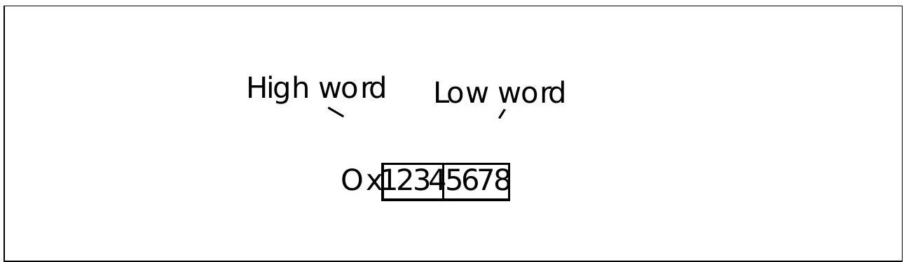

## 24.16 Maths

	#include "pgUtils.h"
	(long) pgAbsoluteValue(long value);
	(pg_fixed) pgRoundFixed(pg_fixed fix);
	(pg_fixed) pgMultiplyFixed(pg_fixed fix1, pg_fixed fix2);
	(pg_fixed) pgDivideFixed(pg_fixed fix1, pg_fixed fix2);
	(pg_fixed) pgFixedRatio(short n, short d);

`pgAbsoluteValue` — returns an absolute value.

`pgRoundFixed` — rounds the fixed number to the nearest whole (but is still a `pg_fixed`). For example, `0x00018000` will return as `0x00020000`.

`pgMultiplyFixed` - multiplies two fixed decimal numbers (a fixed decimal is a `long` whose high-order word is the integer and low-order word the fraction. Hence, `0x00018000` = `1.5`.

`pgDivideFixed` — divides fixed number `fix1` into `fix2` (a fixed decimal is a long whose high-order word is the integer and low-order word the fraction. Hence, `0x00018000` = `1.5`).

`pgFixedRatio` - returns a fixed number which is the ratio of `n : d` (a fixed decimal is a `long` whose high-order word is the integer and low-order word the fraction). Hence, 0x00018000 = 1.5.

# 25 THE ALLOCATION MANAGER

This section deals exclusively with the Allocation Manager within HERMES Paige (the portion of software that creates, manages and disposes memory allocations).

## 25.1 Up and Running

The Allocation Manager used by HERMES Paige is full of features that have been requested by developers and used by HERMES Paige itself. All these features are available to you as a developer.

Like most of HERMES Paige, there are just some basics to know about the Allocation Manager to initially use it effectively.

These are:

1. To allocate a block of memory, you call a function that returns an "ID" code (not a pointer or an address).
2. Then to access that memory, you pass the "ID" code to a function which returns an address to that memory.
3. Once you are through accessing that memory, you report its "non-use" by calling another function.
4. "Reporting" to the allocation manager when you are accessing a memory block and when you are through makes virtual memory possible (blocks can be purged that are not in use).
5. Memory allocations do not have to be byte-oriented, rather they can be groups of logical records. For example, a memory allocation can be defined as a group of 100-byte records. 

### Simple example to allocate some memory and use it:

		/* Allocation: */
		memory_ref allocation; 
		allocation = MemoryAlloc(&mem_globals, sizeof(char), 100, 0);
		
		/* Note: "mem_globals" is the pgm_globals field in the HERMES Paige globals, same struct given to pglnit and pgNew. The "allocation" result is not an address, but an "ID" code. To get the address, call: */
	
		char *memory_address;
		memory_address = UseMemory(allocation);
	
		/* In the above, not only is the memory addressed returned but the memory is now locked and unpurgable. Thus it is important to "report" when you are through accessing it: */
	
		UnuseMemory(allocation);
		
		/* Tell Allocation Manager we are done. */
		
		// Once you are completely through, dispose the allocation:
		
		DisposeMemory(allocation);

## 25.2 Theory

Since HERMES Paige is intended to operate on multiple platforms, it became necessary to remove the majority of its code as far away from a specific operating system as possible.

An integral part of any computer OS is its memory management system. However, no two memory management designs are alike, and for this reason HERMES Paige's Allocation Manager works as follows:

1. HERMES Paige only creates memory allocations through high-level functions, far removed from the operating system. Among these functions are `MemoryAllocate`, `MemoryDuplicate` and `MemoryCopy`.
2. Regardless of platform, functions to allocate memory remain constant (the same function names and parameters are the same regardless of the OS).
3. To allow for virtual memory and debugging features, HERMES Paige must inform the Allocations Manager, as a rule, when it is about to access a block of memory and when it is through accessing that block. The purpose of this is threefold:

	1. If no part of HERMES Paige is accessing a memory block, the Allocation Manager can "unlock" the block and allow it to relocate for maximum memory efficiency,
	2. Blocks of memory can be temporarily purged if they are not being accessed.
	3. Debugging features can be implemented: since the main software must "ask" for access to a block of memory, the Allocation Manager can check the validity of the block at that time (when running in "debug mode").

4. Since memory is never allocated directly, the Allocation Manager can provide additional features to a block of memory. Among the features that exist in HERMES Paige's Allocation Manager are logical record sizes (a block of memory can be an array of records, as opposed to bytes), nested "lock memory" capability (more than one function can "lock" a block from relocating or purging, in which case the block can not be free for relocation or purging until each "lock" has been "unlocked").

## 25.3 Memory Block References

As far as HERMES Paige (and your application) is concerned, when memory is allocated. the Allocation Manager does not return a memory address; rather, it returns an ID number called a `memory_ref`. You can consider a `memory_ref` as simply a long word whose value, when given later to the Allocation Manager, will identify a block of memory.

## 25.4 Access Counter

Frequent reference is made in this chapter to a memory reference's access counter.

Every block of memory created through the Allocation Manager has an associated access counter. This counter increments every time your program requests the block to become locked (non-relocatable and non-purgeable), and decrements for every request to unlock the block (making it re-locatable and purgeable). The purpose of this is to allow nested "lock/unlock" logic as opposed to a simple locked or unlocked state: using the access counter method, Allocation Manager will make a block relocatable or purgeable only when its access counter is zero. This provides protection against memory blocks moving "out from under" nested situations.

## 25.5 Logical v. Physical Sizes

Every allocation made through the Allocation Manager is considered to have two sizes: a logical size and a physical size. (For how this is implemented, see [The `extend_size` parameter](#the-`extend_size`-parameter) under section 28.8).

The physical size of a block is the actual amount of reserved memory that has been allocated, in bytes; the logical size, however, may or may not be the same amount and in fact is often smaller.

The physical size of an allocation might be, for example, $10 \mathrm{~K}$ but its logical size might be as small as zero. The purpose of the two-size distinction is speed and performance. Depending on the OS, physically resizing a block of memory can consume large amounts of time, particularly in tight situations where thousands of blocks require relocation or purging just to append additional memory to one block. For this reason, the Allocation Manager may elect to allocate a block larger (physical size) than what you have asked for but "tell" you it is a smaller size (logical size); then if you asked for that block to be extended to a large size, the extra space might already exist, in which case the

Allocation Manager merely changes its logical size without any need to expand the block physically.

Generally, it is a block's logical—*not* physical—size that your program should always work with.

## 25.6 Purged Blocks

**All references in this chapter to *purging* and *purged blocks* imply virtual memory, in which a block's contents are saved to a scratch file so that the allocation can be temporarily disposed.** Such allocations are not lost, rather they recover on demand by reloading from the scratch file. At no time does the Allocation Manager permanently dispose an allocation unless you explicitly tell it to do so.

## 25.7 Starting Up

The Allocation Manager must have already been started before `Y` was called. You need to make any function calls to initialise this portion of the software. To start HERMES Paige with the Allocation Manager and for details on `pgMemStartup`, see section 2.4, [Software Startup](#2.4-software-startup).

**CAUTION:** You must not, however, use any functions listed below unless you have called `pgMemStartup`.

**NOTE:** You can theoretically use the Allocation Manager, by itself, without ever initialising HERMES Paige.

## 25.8 Allocating and Deällocating Memory

To allocate memory through the Allocation Manager, call one of the following:

	(memory_ref) MemoryAlloc (pgm_globals_ptr globals, pg_short_t rec_size, long num_recs, short extend_size);
	(memory_ref) MemoryAllocClear (pgm_globals_ptr globals, pg_short_t rec_size, long num_recs, short extend_size);

`MemoryAlloc` allocates a block of memory and returns a `memory_ref` that identifies that block; `MemoryAllocClear` is identical except in that it clears the block (sets all bytes to zero).

By allocation is meant a block of memory of some specified byte size that becomes reserved exclusively for your use, guaranteed to remain available until you deällocate that block (using `DisposeMemory`, below).

Both functions return a `memory_ref`, which is a reference ID to the allocation. You should neither consider a `memory_ref` to be an address nor a pointer. Rather, give this reference to the various functions listed below to get a pointer to the memory block, change its allocation size, make it purgeable or nonpurgeable, etc.

The `memory_ref` returned is always non-zero if it succeeds or `MEM_NULL` (zero) if it fails. The easiest way to check for failures is by using HERMES Paige's try/catch exception handling. See section 26.1, [The TRY/CATCH Mechanism](#26.1-the-try/catch-mechanism), and [Creating a `memory_ref`](#creating-a-`memory_ref`) under section 26.5.

The `globals` parameter must point to the `mem_globals` you gave to `pgMemStartup`. Or, if you have initialised HERMES Paige with `pgInit()` you can also access `mem_globals` through the HERMES Paige globals:

	paige_globals.mem_globals;

The size of the allocation is determined by the formula `rec_size * num_recs`, where `rec_size` is a record size, in bytes, and `num_recs` is the number of such records in the block. Hence, you can create allocations that are considered arrays of records, if necessary.

For example, allocating a block of `rec_size = 16` and `num_recs = 100`, the total byte size of the allocation would be 1600. The intended purpose of allowing a record size, as opposed to always creating blocks consisting of single bytes, is to provide high-level features of accessing record elements.

If you only want a block of bytes, without regard to any "record" size, simply create an allocation with a "record" size of 1.

A `rec_size` of zero is not allowed; a `num_recs` value of zero, however, is allowed.

### The extend_size parameter

The purpose of the `extend_size` parameter is to provide the Allocation Manager with some insight, for performance purposes, as to how large the allocation might grow from subsequent SetMemorySize calls.

To understand this fully, a distinction between a `memory_ref`'s "logical size" versus "physical size" must be clarified: when a `memory_ref` is initially created, its logical size is simply the size that was asked for (which is `rec_size * num_recs`). However, the actual size allocation can be greater than the logical size, which essentially provides an extra "buffer" that can be utilized to change the logical size later without the necessity to physically resize the allocation through OS calls.

A good example of this would be the allocation of a large string whose initial byte size begins at zero, yet it is expected to grow larger in size as time goes by, perhaps as large as 500 bytes in length. If such a memory allocation started at a physical byte size of zero, then it would become necessary (and very slow) to ask the OS to physically resize the allocation each and every time new byte(s) were appended.

However, if such an allocation were initially created with a 500-byte `extend_size` (but a logical size of zero), it would never need to physically resize unless or until the string grew larger than 500 bytes.

Hence, `MemoryAlloc` could create such an allocation whereby the physical size and logical size are different:

	MemoryAlloc(&mem_globals, sizeof(byte), 0, 500);

The `extend_size` is therefore an enhancement tool, and should be set to a reasonable amount according to what the resizing forecast holds for that allocation. If the allocation will never be resized, `extend_size` should be zero.

**NOTE:** The value of `extend_size` does not necessarily imply future memory resizing will occur or will not occur, rather it is a performance variable only: the Allocation Manager will still resize a memory allocation even if `extend_size` is zero (although possibly slower than if `extend_size` were larger).

See also section 25.5, [Logical v. Physical Sizes](#25.5-Logical-v.-physical-sizes).

**NOTE:** The `extend_size` indicates a number of *records* (each of size `rec_size` bytes), not bytes.

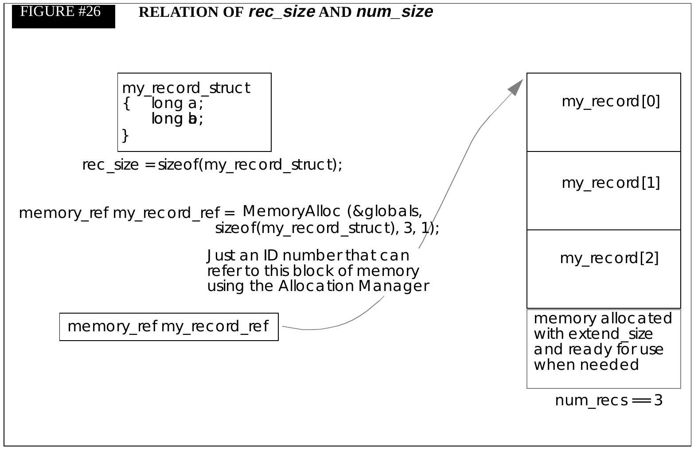

### Deällocation

Once you no longer need a memory allocation, pass its `memory_ref` to the following:

	void DisposeMemory (memory_ref ref);

`DisposeMemory` physically disposes the block assigned to `ref`, and `ref` is no longer a valid reference thereafter.

	(memory_ref) MemoryDuplicate (memory_ref src_ref);
	(void) MemoryCopy (memory_ref src_ref, memory_ref target_ref);

`MemoryDuplicate` returns a new `memory_ref` whose data content and record size is exactly the same as `src_ref`. In effect, this function returns a "clone" of `src_ref`, but it is a new, independent `memory_ref`.

`MemoryCopy` copies the contents of `src_ref` into `target_ref`.

`MemoryCopy` differs from `MemoryDuplicate` in that for `MemoryCopy` both `src_ref` and `target_ref` are allocations that already exist. `MemoryDuplicate` actually creates a new `memory_ref` for you, so it cannot already exist.

The logical size of `target_ref` can be any size, even zero, as `MemoryDuplicate` will change its size as necessary. Record sizes of each `memory_ref`, however, must match.

The access counters are not set, since the memory is allocated but not in use.

### TECH NOTE: Practical difference between `MemoryCopy` and `MemoryDuplicate` 

> What is the difference really between `MemoryCopy` and `MemoryDuplicate`? Please do comment on the appropriate situation for using either.

I can clarify the difference in usage between `MemoryCopy` and `MemoryDuplicate`. It is very simple:

* `MemoryDuplicate` is for obtaining a "clone" of a `memory_ref`.
* `MemoryCopy` is to *fill in* a *preëxisting* `memory_ref` with the contents of another.

In my own code, I am constantly wanting to copy contents of a `memory_ref` into one that I created earlier. One example of this is some routine that wants to keep copying a bunch of different `memory_ref`s—to copy an array of "tabs" for instance. It would be a lot slower to create a `memory_ref` with `MemoryDuplicate`, then dispose it, then create it again, then
then keep copying different `memory_ref`s into it.

## 25.10 Accessing Memory

### Using memory

To obtain a pointer to a block of memory allocated from MemoryAlloc or `MemoryAllocClear`, call one of the following:

	(void PG_FAR*) UseMemory (memory_ref ref); 
	(void PG_FAR*) UseForLongTime (memory_ref ref);

`UseMemory` and `UseForLongTime` takes a `memory_ref` in `ref` and returns a pointer to the memory block assigned to that reference. The `ref`'s access counter is incremented, which means that the memory block is now guaranteed neither to relocate nor purge (see section 25.4, [Access Counter](#25.4-access-counter)).

The primary purpose of `UseMemory` is to tell the Allocation Manager that a particular block of memory is now "in use", in which case it is marked as unpurgeable and nonrelocatable.

`UseForLongTime` does exactly the same thing as `UseMemory` except in that the memory block is relocated in the optimum way, before locking, to avoid memory fragmentation. The purpose of using this function, as opposed to `UseMemory`, is for situations where you know the block will stay locked for quite a while and you don't want to cause unreasonable fragments.

**NOTE:** Don't use `UseForLongTime` *too* liberally because it is substantially slower than `UseMemory` (since the machine often needs to relocate the memory).

`UseMemory` and `UseForLongTime` calls can be nested, but each must be eventually balanced with `UnuseMemory` or else the block will remain in a locked state, which in turn can cause memory difficulties such as fragmentation and the inability to change the allocation size.

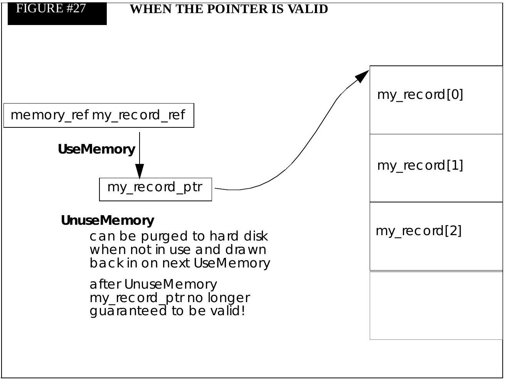

### Unuse memory

Once you are finished using the pointer returned from `UseMemory` or `UseForLongTime`, call the following:

	(void) UnuseMemory (memory_ref ref);

Essentially, `UnuseMemory` decrements `ref`'s access counter. If its access counter goes to zero, the allocation is then free to relocate or purge.

It is therefore important that all `UseMemory` and `UseForLongTime` calls get eventually *balanced* with UnuseMemory, otherwise unwanted locked memory fragments will result.

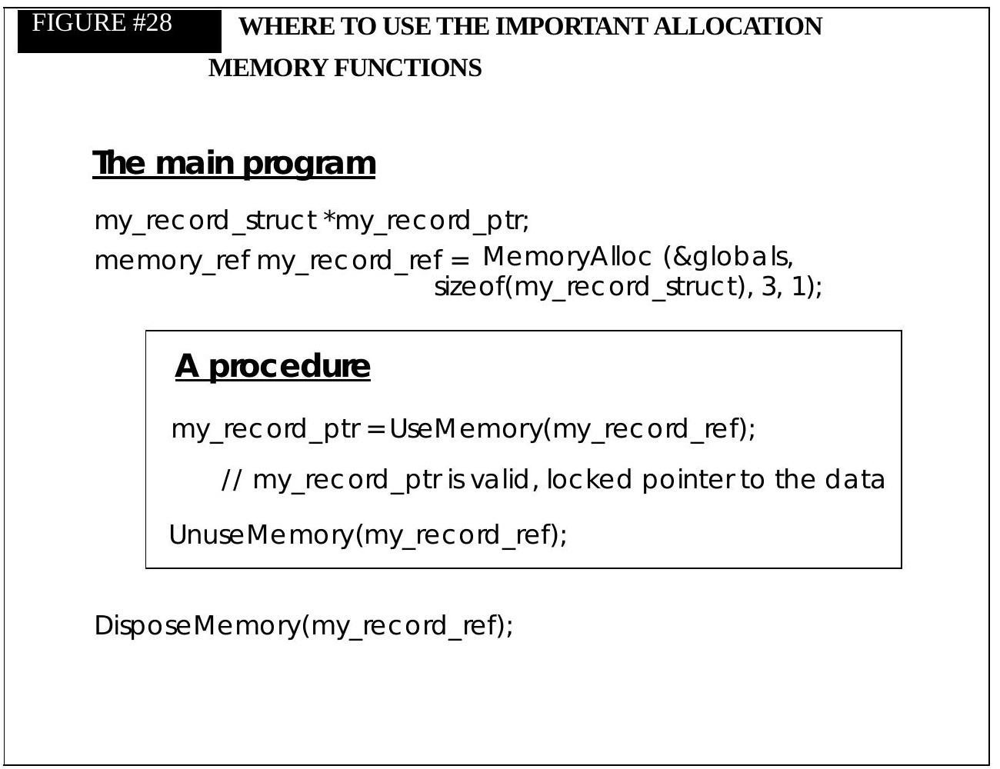

## 25.11 "Random-Access" Pointers

You can obtain a pointer to a specific "record" within a block of memory by calling the following:

	(void PG_FAR*) UseMemoryRecord (memory_ref ref, long wanted_rec, long seq_recs_used, short first_use);

This function is similar to `UseMemory` except a pointer to a specified record of an allocation is returned.

The `wanted_rec` is the (zero-indexed) record number you need a pointer to. The record size (originally defined in `rec_size` for `MemoryAlloc`) determines which physical byte the resulting pointer will reference. For instance, if the record size were, 128 bytes, a `UseMemoryRecord` for `wanted_rec` of `10` would return a pointer to the 1280th byte.

The `seq_recs_used` parameter should indicate how many additional sequential records beyond `wanted_rec` record you want access to. The purpose of this parameter is for future Allocation Manager enhancements in which partial block(s) can be loaded into memory from a purged state. In such a case, `UseMemoryRecord` needs to know how many additional sequential records, besides `wanted_rec`, you would like to have loaded into memory if the allocation has been purged.

<!-- TO DO: The purpose of this parameter is for future Allocation Manager enhancements in which partial block(s) can be loaded into memory from a purged state. -->

For example, suppose a block of memory consisting of 1000 records is temporarily purged (which really means its contents have been saved to a "scratch" file and the block currently does not physically exist in memory). Full access to all records would require the Allocation Manager to load the entire allocation (all 1000 records). `UseMemoryRecord`, however, could get away with loading only a few records within that allocation, but it needs to know how many sequential records you intend to access beyond `wanted_rec`.

If you want to use all records following `wanted_rec`, whatever that quantity might be, you can also pass `USE_ALL_RECS` (value of `-1`) for `seq_recs_used`.

If `first_use` is `TRUE`, the block's access counter is incremented (same thing as results from a `UseMemory` call); if `first_use` is `FALSE`, the access counter remains unchanged. The purpose of this parameter is for situations where you intend to randomly access many records from the same `memory_ref` within the same routine, but you essentially need only one UseMemory to lock the allocation; otherwise, you would need to balance every random access with `UnuseMemory`.

Thus, setting `first_use` to `TRUE` is essentially sending the Allocation Manager the message, "Please lock the allocation," then subsequent `UseMemoryRecord` calls with `first_use` as `FALSE` is like saying, "I know the allocation is already locked, so just give me another pointer."

An `UnuseMemory` call must eventually balance each `UseMemoryRecord` call that gave TRUE for `first_use`.

**NOTE:** HERMES Paige loads the whole allocation specified in `UseMemoryRecord` (does not do partial loads). However, to guarantee future compatibility, you should assume that all records in the allocation lower than `wanted_rec` and all records greater than `wanted_rec + seq_recs_used` are purged, not loaded, and therefore not valid should you attempt to access them with the same pointer.

## 25.12 "Quick Record"

If you simply want a copy of a single record from an allocation, call the following:

	void GetMemoryRecord (memory_ref ref, long wanted_rec, void PG_FAR *record);

Record number `wanted_rec` (zero-indexed) in `ref` is copied to the structure pointed to by record. The access counter in `ref` is unchanged. Hence, `GetMemoryRecord` provides a way to get a single record without the need to balance `UseMemory` and `UnuseMemory`.

It is your responsibility to make sure `record` is sufficient size to hold a record from `ref`.

**NOTE:** `GetMemoryRecord` will work correctly regardless of the `memory_ref`'s access counter state and regardless of whether or not the allocation has been purged.

## 25.13 Changing Allocation Sizes

### Memory sizes

	(void) SetMemorySize (memory_ref ref, long wanted_size);
	(long) GetMemorySize (memory_ref ref);

`SetMemorySize` changes the logical size of `ref` to `wanted_size`. `GetMemorySize` returns the logical size of `ref`.

For both functions, the "size" is not a byte size, but rather a record quantity. A `SetMemorySize(ref, 10)` for an allocation whose record size is 500 bytes, the allocation is set to 5000 bytes, i.e. `10 * 50`; `SetMemorySize(ref, 10)` for a 1-byte record size allocation would result in a logical byte size of `10`, and so on.

If `SetMemorySize` fails for any reason, an HERMES Paige exception is raised (see chapter 26, [Exception Handling](#26-exception-handling)).

`GetMemorySize` returns the current size of (i.e., number of records within) `ref`.

**Changing the size of an allocation whose access counter is non-zero might fail!** (A non-zero access counter means sufficient `UnuseMemory` calls have not been made to balance `UseMemory` calls, resulting in a locked allocation).

**NOTE:** `GetMemorySize` will work correctly regardless of the `memory_ref`'s access counter state and regardless of whether or not the allocation has been purged.

### Record size, byte size

	(short) GetMemoryRecSize (memory_ref ref);
	(long) GetByteSize (memory_ref ref);

`GetMemoryRecSize` returns the record size in `ref` (which will be whatever size you gave `MemoryAlloc` or `MemoryAllocClear` when the allocation was made). This function is useful for generic functions that need to know a `memory_ref`'s record size.

`GetByteSize` returns the byte size of `ref` (as opposed to the number of records as in `GetMemorySize`). Essentially a `memory_ref`'s byte size is its record size times number of logical records.

**NOTE:** Both functions above will work correctly regardless of the `memory_ref`'s access counter state and regardless of whether or not the allocation has been purged.

### TECH NOTE: A bigger or smaller record size

> Can I make my record size bigger after it is allocated?

No. You can only change the number of records. You can create a new `memory_ref` and copy the old data into the new one using `pgBlockMove`.

## 25.14 Insert & Delete

	(void PG_FAR*) InsertMemory (memory_ref ref, long offset, long insert_size);
	(void PG_FAR*) AppendMemory (memory_ref ref, long append_size, pg_boolean zero_fill);

* `InsertMemory` — inserts `insert_size` records into `ref`'s allocation at record position `offset`, then returns a pointer to the first record inserted. The new record(s) are not initialised to anything—the allocation size is simply increased by `insert_size` and one or more record(s) is moved to make room for the insertion.
* `AppendMemory` — does the same thing except the "insertion" is added to the end of the memory block: the allocation is increased by `append_size` and a pointer to the first record of the appendage is returned. If `zero_fill` is `TRUE`, the appended memory is cleared to zeros.

Both `InsertMemory` and `AppendMemory` assume record quantities, not byte sizes (i.e., `InsertMemory` for a ref whose record size is 100 will insert 200 bytes if `insert_size = 2`).

For both functions, the access counter in `ref` is incremented (or not) according to the following rules:

- if `ref`'s access counter is zero upon entry, the requested memory is inserted, the access counter is incremented by 1, and the allocation is set to its "used" state (locked, unpurgeable);
- if the access counter is 1 upon entry, it is decremented to zero and unlocked, the requested memory is inserted, then the access counter is incremented and the allocation is set to its "used" state;
- if the access counter is greater than 1, nothing occurs and the situation is considered illegal, generating an error if debugging has been enabled (see section 25.18, [Debug Mode](#25.18-debug-mode)).

The reasoning behind these rules for the access counter when inserting memory is the common situation wherein multiple insertions need to occur within a loop. Since `InsertMemory` and `AppendMemory` allow an access counter of 1, each repetitive insertion can avoid the requirement of calling `UnuseMemory`.

**CAUTION:** For insertions with an access counter of 1, the pointer you had prior to `InsertMemory` or `AppendMemory` might be invalid after memory has been inserted (the block might relocate). Therefore, always update your pointer with whatever is obtained from the function result.

### TECH NOTE: `UnuseMemory` after `InsertMemory` or `AppendMemory`

> So do I need to do a `UnuseMemory` after these?

`InsertMemory` and `AppendMemory` really are the same as `SetMemorySize` to a larger number of records, then a (single) `UseMemory`. So you need to do a single `UnuseMemory()` after a series of repetitive inserts. In other words, if you called `InsertMemory()` or `AppendMemory()` 100 times, you only need to do *one* `UnuseMemory()`.

	struct my_special_struct
	{
		short index_number;
	}
	for (i = 0, i < 100, i++)
	{
		my_new_record = InsertMemory(the_ref, i, sizeof(my_special_struct));
		my_new_record.index_number = i;
	}
	UnuseMemory(the_ref);

### Delete

	(void) DeleteMemory (memory_ref ref, long offset, long delete_size);

`DeleteMemory` deletes `delete_size` records in `ref` beginning at `offset`. Both `delete_size` and `offset` are record quantities, not bytes.

The access counter is not changed by this function. However, the access counter must be zero when this function is called.

## 25.15 Purging Utilities

**NOTE:** All references in the Chapter to "purging" and "purged blocks" imply virtual memory, in which a block's contents are saved to a scratch file so that the allocation can be temporarily disposed. If the scratch file was not set up when the Allocation Manager was initialised, there will be no purging.

**NOTE:** The topic covered herein is not to be confused with "purging" resources on the Mac. Allocation Manager knows nothing about the Mac other than basic things about the file system. It handles its own "purging" without the Resource Manager.

An allocation is said to be "purged" when additional memory space needs to be freed, thus an allocation is saved to a "scratch" file and it is temporarily disposed.

### Purge priorities

The priority for purging, i.e., what `memory_ref`s should get purged first, can be controlled by calling the following:

	(void) SetMemoryPurge (memory_ref ref, short purge_priority, pg_boolean no_data_save);

The `ref` allocation's purging priority is set to `purge_priority`. The `purge_priority` can be any number between 0 and 255, with 0 as the lowest priority (will get purged first above all others). The `purge_priority` parameter can also be `NO_PURGING_STATUS` (`OXFF`), in which case it will never be purged.

If `no_data_save` is `TRUE`, the contents of `ref` do not need to be saved to a scratch file when purged. Another way to state this is a `ref` with TRUE for `no_data_save` is known to have nothing in its contents of any value or consequence; thus, Allocation Manager can simply purge it without saving any of its contents.

An example of a `memory_ref` that could be set for `no_data_save` would be an "offscreen bitmap" buffer. After it is used to transfer an image, an application might not care if all its contents get temporarily disposed, because on the next usage whole new contents (new bits) will be created all over again anyway.

##### Notes
1. This function will still work regardless of `ref`'s access counter state and regardless of whether or not it is purged.
2. A `memory_ref` whose access counter is nonzero will not be purged, even if its purge priority is zero.
3. Setting `NO_PURGING_STATUS` on a `memory_ref` that has already been purged will not take effect until it is unpurged. In other words, changing purge status does not automatically reload purged allocations—you still need to access its pointer (such as `UseMemory`) if you want its contents loaded into memory.

### Purging memory

	(pg_error) MemoryPurge (pgm_globals_ptr globals, long minimum_amount, memory_ref mask_ref);

`MemoryPurge` will purge `memory_ref`(s) until at least `minimum_amount` of memory (in bytes) has become available.

The `globals` parameter must be a pointer to the same structure given to `MemoryAlloc` (which is also the `mem_globals` field within the structure given to `pgInit`).

If `mask_ref` is non-null, that `memory_ref` is considered "masked" (protected) and will not be purged during this process.

All purgeable, unlocked allocations will be purged, one at a time and in the purge priority they are set for (lowest purge priorities are taken first) until `minimum_amount` of available space has been achieved.

If `minimum_amount` fails to become available, even after purging every eligible allocation, `MemoryPurge` will return an error (see chapter 39, [Error Codes](#39-error-codes)); if successful, the function result will be `NO_ERROR` (`0`).

The `minimum_amount` specified is for the total memory available, which means if there is already enough or nearly as much available as `minimum_amount`, very little will get purged.

##### Notes

1. The amount of "available memory" is based on what was given to `pgInit` for `max_memory` minus the total physical sizes of all existing `memory_ref`s—see `pgInit`.
2. You normally do not need to call this function since `MemoryPurge` gets called for you as required for allocations and resizing blocks. The function has been provided mainly for freeing memory for objects that you are not allocating with the HERMES Paige Allocation Manager.
3. Even though this function might return no error (success), that still does not necessarily guarantee a block of `minimum_amount` can be allocated, because the available memory might not be contiguous.

## 25.16 Allocation Manager Shutdown

	(void) pgMemShutdown (pgm_globals_ptr mem_globals);

Call this function once you are through using the Allocation Manager. Be sure it is called after `pgShutdown`.

**NOTE:** This function is not necessary if you will be doing `ExitToShell()` on *Macintosh*.

See section 2.5, [HERMES Paige Shutdown](#2.5-Hermes-paige-shutdown).

## 25.17 Miscellaneous Memory Functions

### Unuse & dispose

	(void) UnuseAndDispose (memory_ref ref);

`UnuseAndDispose` decrements the access counter in `ref`, then disposes the allocation. This function does exactly the same thing as:

	UnuseMemory(ref);
	DisposeMemory(ref);

### Memory globals

	(pgm_globals_ptr) GetGlobalsFromRef (memory_ref ref);

`GetGlobalsFromRef` returns a pointer to `pgm_globals` located from an existing `memory_ref`. This function is useful for situations where you do not have access to the `globals` structure. Any valid, non-disposed `memory_ref`, locked or unlocked, purged or not, can be used for `ref`. For more information on getting `pgm_globals_ptr` see technical note, [Get globals from `pg_ref`, `paige_rec_ptr`, etc.](#Tech-note:-Get-globals-from-`pg_ref`,-`paige_rec_ptr`,-etc.).

	#include "pgTraps.h"
	(memory_ref) HandleToMemory (pgm_globals *mem_globals, Handle h, pg_short_t rec_size);
	(Handle) MemoryToHandle (memory_ref ref);

`HandleToMemory` accepts `Handle` `h` and returns a `memory_ref` for that `Handle`.

**FUNCTION RESULT:** After this function is called, the `Handle` is now "owned" by the Allocation Manager, which is to say you should no longer access nor dispose that `Handle`. Access to the `Handle`'s contents must thenceforth be made using the functions given above (`UseMemory`, `UseMemoryRecord`, etc.).

The `mem_globals` parameter must point to the same structure as given to `MemoryAlloc`.

The `rec_size` must contain the record size for the new `memory_ref`, which must be an even multiple of the original `Handle`. If unknown, then make `rec_size = 1`.

It does not matter if `Handle` `h` is locked or unlocked, but it should at least temporarily be unpurgeable.

`MemoryToHandle` performs the reverse: it returns a `Handle` built from `memory_ref` `ref`. Again, once this call is made, `ref` is no longer valid and must not be given to any Allocation Manager functions.

**NOTE**: The term `Handle` is `typedef`ed from the Windows `HANDLE`, so the two terms are synonymous.

**NOTE:** These functions do not perform huge copies. Rather, they convert `Handles` to `memory_ref`s and *vice versa* by appending some special information before and after the data contents, or removing this appendage. So it is generally safe to do `HandleToMemory`, `MemoryToHandle` under fairly tight situations that could not withstand the doubling of a `Handle`'s size.

## 25.18 Debug Mode

There are two compiled versions of HERMES Paige software, one for "debug mode" and one or "non-debug" or runtime mode.

In debug mode, `memory_ref`s are checked for validity, including the verification of appropriate access counters, each time they are given to one of the functions listed above. While this significantly reduces the speed of execution, it does aid substantially in locating bugs that would otherwise crash your system.

For example, calling `SetMemorySize` for an allocation that is currently "in use" (access counter nonzero) could fail and/or crash your program. Under debug mode, however, you would be warned immediately if an attempt to change the size of an allocation was made on a locked block.

### Object Code Users (Macintosh)

There are two sets of Macintosh (or Power Mac) object code libraries: one for "debug" and the other for "non-debug." As a general rule, you should use the debug versions to develop your application, then switch to non-debug before release (non-debug runs much faster).

**NOTE:** Object code for "debug" mode is not supported on *Windows*. This is because Windows General Protection Mode can be used instead and is generally superior.

### Source Code Users

Debug/non-debug is controlled by the following `#ifdef` in `CPUDefs.h`:

	#define PG_DEBUG

If that `#define` exists, the source files are compiled in "debug" mode.

To run HERMES Paige debug libraries, you must include `pgDebug.c` in your project. When doing so, you can place a source-level debugger break at the location shown below; when the Allocation Manager detects a problem, the code will break at this spot.

	char pgSourceDebugBreak(memory_ref offending_ref, char *debug_str)
	{
		mem_rec PG_FAR *bad_mem_rec;	// This gets coerced to examine it
		char *examine;
	}
	
	/* ****** DEBUG BREAK - MEMORY ERROR! ****** */
	
	examine = debug_str;				// <~~ Place debugger break here!
	bad_mem_rec = (mem_rec PG_FAR*) pgMemoryPtr(offending_ref);
	pgFreePtr(offending_ref);
	
	/* ****** DEBUG BREAK - MEMORY ERROR! ****** */

**NOTE:** The error message string is a pascal string.

### Debug Assert Messages

The debugger `assert` is simply a debugger break with one of the following messages:

* `Out of memory` — Block of requested size cannot be allocated (or block cannot be resized). If virtual memory has been enabled, this will only happen if the block is so huge there is insufficient, contiguous memory available.
* `Purge file not open` — Memory needs to be purged but "scratch" file doesn't exist or is closed.
* `Attempt to resize locked memory` — Allocation is locked, yet a `SetMemorySize` has been attempted.
* `NIL memory_ref` — `memory_ref` is a null pointer and/or an address inside of it is null.
* `Bogus memory_ref address` — An address in a `memory_ref` is bad (would result in a bus error for Mac).
* `Internal damage in memory_ref` — `memory_ref`'s address OK but certain characteristics are missing (so it is assumed “damaged" or overwritten).
* `Overwrite error` — last 1 of 4 bytes beyond the logical size of a `memory_ref` has been overwritten.
* `Access counter invalid for operation` — access counter is illegal for given function. Examples: 
	* `SetMemorySize` and `access != 0` (illegal); 
	* `UnuseMemory` and access counter `== 0` (illegal); 
	* `DisposeMemory` and access counter `!= 0` (illegal).
* `Bogus memory_ref` — `memory_ref` given is not a `memory_ref` but some other address.
* `Operation on disposed memory_ref` — `memory_ref` given has been disposed.
* `Error in purging` — An allocation was writing to a scratch file and I/O error resulted (such as out of space).
* `Error in un-purging` — Read error occurred while recovering a purged allocation from scratch file.
* `Attempt to access record out of range` — `UseMemoryRecord` asking for a record beyond the size of the allocation.
* `Structure integrity failed` — Structural damage has occurred to the `style_info` or `par_info` run. For example, a style run might (incorrectly) reference a style_info that does not exist.

## 25.19 Writing Your Own Purge Function

The standard purge function is a built-in part of the Allocation Manager that purges (disposes) memory that is not being used to make room for new allocations. The blocks to be purged are saved to a "temp" file so they can be resurrected later when asked to be used by HERMES Paige or by the application.

If necessary, you can replace the standard purge function with one of your own. To do so, first declare a function as follows:

	PG_FN_PASCAL pg_error my_purge_proc (memory_ref ref_to_purge, pgm_globals_ptr mem_globals, short verb);

In the `pgm_globals` structure (same one passed to `MemoryAlloc`), the `purge` field contains a pointer to the purge function. What you need to do is place a pointer to your purge function, as defined above, into that field:

	paige_rsrv.mem_globals.purge = my_purge_proc;

The `paige_rsrv` variable is the same structure given to `pgInit`, and `mem_globals` is the Allocation Manager subset (same one given to `MemoryAlloc`).

When the Allocation Manager purges memory, it locates memory `ref`s that are purgeable and passes each of them, one at a time, to the purge function; additionally, when a `memory_ref` needs to be reloaded (unpurged), the purge function is called again to unpurge the data. The standard purge function handles this by saving the contents of the `memory_ref` to a temporary file, then setting the `ref`'s byte size to `sizeof(mem_rec)`; then when unpurging, the allocation is resized to the original size and data is read from the temp file.

The temporary file reference used by the standard purge function is stored in the `purge_ref_con` field in `pgm_globals` (see [Memory globals](#memory-globals) under section 25.17).

In addition to purging and unpurging, the purge function is also called to initialise "virtual memory" and to completely dispose an allocation that is currently purged.

Whether the purge function is getting called to purge, unpurge, initialise or dispose an allocation depends on the verb parameter, which will be one of the following:

	typedef enum
	{
		purge_init,		// Initialise VM
		purge_memory,		// Purge the reference
		unpurge_memory,	// Unpurge the reference
		dispose_purge		// Purged ref will be disposed
	};

For each `verb`, the purge function must perform the following:

* `purge_init` — "Virtual Memory" must be set up. When `purge_init` is the reason for the function call, `ref_to_purge` will be `NULL`. The standard function initialises the temporary file (whose file reference will already be contained in `mem_globals > purge_ref_con`).
* `purge_memory` — The `ref_to_purge` memory must be purged. The Allocation Manager will only call with `purge_memory` if the reference is not yet purged; *i.e.*, it won't try to purge the same reference twice. The standard purge function saves `ref_to_purge`'s data to the temporary file and sets the physical allocation size to `sizeof(mem_rec)`.
* `unpurge_memory` — The `ref_to_purge` memory must be unpurged. The Allocation Manager will only call with `unpurge_memory` if the reference has been purged; *i.e.*, it won't try to unpurge the same reference twice. The standard purge function resets the physical size of `ref_to_purge` and loads the data from the temporary file.
* `dispose_purge` — The `ref_to_purge` is already purged but is about to be disposed. *The purge function does not dispose the memory*; rather, it does whatever is necessary knowing that the purged allocation will be disposed forever. The standard purge function "deletes" the saved data on the temp file, and does nothing else.

**FUNCTION RESULT:** The purge function should return `NO_ERROR` (zero) if all was successful; otherwise it should return the appropriate error code per `pgErrors.h`.

### Memory Globals

The following structure is used by the Allocation Manager (and is also a subset of `pg_globals`):

	struct pgm_globals 
	{
	short				signature;		/* Used for checking/debugging */
	pg_short_t			debug_flags;	/* Debug mode, if any */
	pg_handle			master_handle;	/* HANDLE for master list (Windows only) */
	pg_handle			spare_tire;		/* Used to free up some memory in tight situations */
	master_list_ptr		master_list;	/* Contains list of all active memory_refs */
	size_t				next_master;	/* Next available space in master_list */
	size_t				total_unpurged;	/* Total # of bytes allocated not purged */
	size_t				max_memory;		/* Maximum memory (set by app) */
	size_t				purge_threshold; /* Amount extra to purge */
	void PG_FAR			*machine_var;	/* Machine-specific generic ptr */
	mem_debug_proc		debug_proc;		/* Called when a bug is detected */
	purge_proc			purge;			/* Called to purge/unpurge memory */
	free_memory_proc	free_memory;	/* Called to free up miscellaneous memory */
	long				purge_ref_con;	/* Reference for purge proc */
	memory_ref			purge_info;		/* Machine-based purge information */
	memory_ref			freemem_info;	/* List of pg_ref(s) for cache feature (2.0) */
	long				next_mem_id;	/* Used for unique ID's assigned to refs */
	long				current_id;		/* ID to use for MemoryAlloc's */
	long				active_id;		/* Which ID to suppress, if any, for purging */
	long				last_message;	/* Last message in exception handling */
	pg_fail_info_ptr	top_fail_info;	/* Current exception in linked list */
	void PG_FAR *		last_ref;		/* Last reference - used by external failure 
										   processing TRS/OITC */
	pg_error_handler	last_handler;	/* Last app handler before Paige */
	pg_error			last_error;		/* Last reported error */
						#ifdef PG_DEBUG
	memory_ref			debug_check;	/* Used for special-case debugging */
	memory_ref			dispose_check;	/* Used for special-case debugging on DisposeMemory */
	short				debug_access;	/* Used with above field */
						#endif
	void PG_FAR			*app_globals;	/* Ptr to globals for PAIGE, etc. */
	long				creator;		/* For Mac file I/O */
	long				fileType;		/* For Mac file I/O */
	};

For more information on `pg_globals`, see section 3.8, [Changing Globals](#3.8-Changing-globals). For more information on error codes, see chapter 39, [Error Codes](#39-Error-codes).

# 26 EXCEPTION HANDLING

## 26.1 The TRY/CATCH Mechanism

HERMES Paige provides a fairly straightforward method of detecting runtime errors (such as disk I/O errors, memory errors, etc.) without the requirement of checking every function result or excessive code.

This is accomplished by using a set of predefined macros: `PG_TRY`, `PG_CATCH`, and `PG_ENDTRY`.

Although this mechanism is patterned after exception handling in C++, you do not need to be using C++ to utilise HERMES Paige error detection features (nor are any C++ "header" files or libraries required).

Anywhere in your application that calls an HERMES Paige function that can fail for "legitimate" reasons, such as allocating memory or reading/writing files, you simply bracket your code as follows:

	PG_TRY (&mem_rsrv)
	{
		/* ... make calls to HERMES Paige functions here such as allocating memory, or pgNew, or pgCopy, etc -- anything that can abort from an error. */
	}
	
	PG_CATCH
	{
		/* ... if any error causes HERMES Paige to abort a function, this part of your code is executed; otherwise this part is not executed. Hence you would do whatever is appropriate here such as an error alert to user. */
	}
	
	PG_ENDTRY;
	{
		/* ... code is executed here if no error; also it is executed here if the code under PG_CATCH does nothing to abort the program any further. */
	}

The above example shows the simplest form of error detection: none of the code under `PG_TRY` is necessarily required to check for errors at all since anything fatal within HERMES Paige (such as out of memory or a disk error) will throw CPU execution into the first line of code under `PG_CATCH`. This is done automatically.

The parameter `mem_rsrv` after `PG_TRY` must be a pointer to the global structure given to `pgMemStartup` earlier (for information about `pgMemStartup`, *vide* section 2.4, [Software Startup](#2.4-software-startup)).

**NOTE:** `PG_TRY`, `PG_CATCH`, and `PG_ENDTRY` macros are automatically available by including `Paige.h` (the actual definitions for these exist in `pgExceps.h` which is `#include`d in `Paige.h`).

## 26.2 Last Error

If your code executes under `PG_CATCH` that means HERMES Paige aborted something due to a fatal error. You can learn what the error code was by examining the memory globals (same structure given to `PG_TRY`) as follows:

	mem_rsrv.last_error;

## 26.3 Nested TRY/CATCH

`PG_TRY`, `PG_CATCH`, and `PG_ENDTRY` can be "nested" throughout your application, in as many places as required. What literally occurs is that the CPU gets forced to the `PG_CATCH` that corresponds to the most recent `PG_TRY`; then if the code under `PG_CATCH` decides to abort that section of code, it can force an additional exception using `pgFailure` (given below), in which case the next most recent `PG_CATCH` (from some other place in your program, if any) gets executed. In short, `TRY` and `CATCH` can be effectively "daisy chained" in this fashion so any fatal error can cycle up through any level of nested subroutines - pall without the need to even check for errors!

## 26.4 Refinements

There are many situations where your code might need to "force" an exception after detecting additional errors while executing code between `PG_TRY` and `PG_CATCH`. There are also many situations where your `PG_CATCH` code needs to abort the entire
subroutine, returning control to some other part of the program. The following functions are available for this purpose:

	(void) pgFailure (pgm_globals_ptr globals, pg_error error, long message);

This function forces unconditional execution to the code under `PG_CATCH` that belongs to the most recent `PG_TRY`. For example, if you use `pgFailure` while executing the code under `PG_TRY`, then the first line under `PG_CATCH` in that section will get executed; if you use `pgFailure` under `PG_CATCH`, then the first line under `PG_CATCH` belonging to the previous `PG_TRY` (somewhere higher up in your program) gets executed. You would most often use pgFailure when executing `PG_CATCH` to completely abort an operation.

The `globals` parameter must be a pointer to `pgm_globals` (same structure given in `pgMemStartup`). The error and message parameters are stored in `globals -> last_error` and `globals -> last_message`, respectively, and can be any value(s) appropriate.

	(void) pgFailNIL (pgm_globals_ptr globals, void PG_FAR *allocation);

This function can be used to force an exception if allocation parameter is a null pointer. The globals parameter must be a pointer to pgm_globals (same structure given in pgMemStartup).

What actually occurs when `pgFailNIL` is called is the following:
	
	if (!allocation)
		pgFailure(globals, NO_MEMORY_ERR, 0);
		
	#include "pgSetJmp.h"	// which is included in Paige.h
	
	(void) pgFailError(pgm_globals_ptr globals, pg_error error);

This function can be used to force an exception if `error` parameter is non-zero. The `globals` parameter must be a pointer to `pgm_globals` (same structure given in `pgMemStartup`).

What actually occurs when `pgFailError` is called is the following:

	if (error)
		pgFailure(globals, error, 0);
			
	#include "pgSetJmp.h"	// which is included in Paige.h
	
	(void) pgFailError(pgm_globals_ptr globals, pg_error acceptable_error, pg_error actual_error);

This function can be used to force an exception if `actual_error` parameter is non-zero and it does not equal `acceptable_error`. The `globals` parameter must be a pointer to `pgm_globals` (same structure given in `pgMemStartup`).

A typical use of this function is to force an exception for file I/O errors unless the error is nonfatal. For example, there might be some code that keeps reading a data file until `end-of-file` error occurs. In such a case, you would want to abort if an error was detected other than `end-of-file` error.

What actually occurs when `pgFailNotError` is called is the following:

	if (error)
		if (actual_error != acceptable_error)
			pgFailure(globals, actual_error, 0);
			
	#include "pgSetJmp.h"	// which is included in Paige.h
	
	(void) pgFailBoolean(pgm_globals_ptr pgm_globals_p, pg_boolean b);

This function can be used to force an exception if `b` is `TRUE`. The `globals` parameter must be a pointer to `pgm_globals` (same structure given in `pgMemStartup`).

What actually occurs when `pgFailBoolean` is called is the following:

	if (b)
		pgFailure(globals, BOOLEAN_EXCEPTION, 0);

## 26.5 Bridging to C++ Exceptions

If you are using C++ and its `TRY/CATCH` mechanism, you can "bridge" an HERMES Paige failure to the standard C++ exception handling by calling "Failure" (defined in C++ headers). Here's an example:

### Code that follows `PG_CATCH`

	Failure(mem_globals.last_error, mem_globals.last_message);

### Creating a `memory_ref`

Let's take a simple but common example of using this method to detect insufficient memory when attempting to create a `memory_ref`. Here's how it would look (the
`mem_globals` variable is the same structure that you gave to `pgMemStartup` when you initialise HERMES Paige):

	{
		memory_ref SomeAllocation;
		PG_TRY(&mem_globals)
		{
			SomeAllocation = MemoryAlloc(&mem_globals, 1, 100000, 0};
			
			/* More code follows, but only gets executed if above allocation was successful. */		}
		
		/* If above code succeeded, PG_CATCH does *NOT* get executed. */
		PG_CATCH
		{
			/* If it gets here, your allocation failed! */
			DisposeFailedMemory(&mem_globals);
			CautionAlert( ... ) 	/* Alert user that attempt failed or whatevs */
		}
		PG_ENDTRY;
		/* ^^ Must be given to balance PG_TRY statement */

When you execute the above code, by virtue of making the `PG_TRY` statement, HERMES Paige now knows that any failure to create memory should invoke the exception handler and jump to your `PG_CATCH` statement. Hence, if `MemoryAlloc` fails, the CPU is immediately forced to the line that contains `PG_CATCH`. At that place in your code you can do whatever to recover or alert the user or raise your own exception, etc.

The above example is the simplest of all cases since it only creates one `memory_ref`, hence, there really is nothing to "recover." It gets slightly more involved when you create, say, multiple `memory_ref`s and you need to dispose the allocations that succeeded. One way to handle this is by setting them all to `NULL` so you know which ones succeeded in `PG_CATCH`:

	{
		memory_ref allocation1, allocation2, allocation3;
		allocation1 = allocation2 = allocation3 = MEM_NULL;
		/* ^^^ set all to zero ^^^ */
		
		PG_TRY(&mem_globals)
		{
			allocation1 = MemoryAlloc(&mem_globals, 1, 100000, 0);			
			allocation2 = MemoryAlloc(&mem_globals, 1, 100000, 0);			
			allocation3 = MemoryAlloc(&mem_globals, 1, 100000, 0);			
		}
		/* if ALL above code succeeded, PG_CATCH does not get executed */
		
		PG_CATCH
		{
		/* if it gets here, ONE of the allocations failed! */
			if (allocation1)
				DisposeFailedMemory(allocation1);
			if (allocation2)
				DisposeFailedMemory(allocation2);
			if (allocation3)
				DisposeFailedMemory(allocation3);
		}
		{		
		PG_ENDTRY;
		}
	}

In the above example, `PG_CATCH` gets automatically executed upon the first failure of the three `MemoryAlloc`s. At that time, we dispose only the `memory_ref`s that are non-`NULL` (which means they were successfully created).

**NOTE:** We call `DisposeFailedMemory` instead of `DisposeMemory`. This is a special "dispose" that HERMES Paige provides for this case. It disposes the `memory_ref` regardless of its locked or "used" state so it doesn't jump into the low-level debugger.

### Own error checking

The previous examples illustrate where HERMES Paige itself, by virtue of `MemoryAlloc`, automatically invokes the exception handler. There will be other cases, however, when you want to cause a similar exception for your own error checking (but you haven't called an HERMES Paige function). One example of this would be calling `NewHandle` and having it return NULL (this indicating it failed). Here's how to do that:

	{
		Handle h;
		PG_TRY(&mem_globals)
		{
			h = NewHandle(100000);
			pgFailNIL(&mem_globals, h);
			/* Jump to PG_CATCH if h == nil */
		}
		
		// more code if above succeeds
		
		PG_CATCH
		{
			/* if it gets here, NewHandle() failed */
		}
		
		PG_ENDTRY;
	}

In the above, we use `pgFailNIL`, which checks for `h` being a null pointer and if so, throws an exception (causing `PG_CATCH` immediately to execute).

There are other `pgFailxxx` functions to raise an exception in other ways. Using `pgFailure`, for example forces an exception unconditionally (see `pgSetJmp.h` to see the various functions and/or the docs on this).

There is the possibility you might need to recover from a failed `pgNew` (also `pgCopy` would be same thing). You do this the same way as in my second example of creating allocations—except that, for a `pg_ref`, you call a special error-recovery `dispose`:

	{
		pg_ref MyNewPG;
		pg_ref = MEM_NULL;
		PG_TRY(&mem_globals)
		{
			MyNewPG = pgNew(.., ..);
		}
		
		/* If ALL above code succeeded, "PG_CATCH" does NOT get executed. */
	
		PG_CATCH
		{
			/* If it gets here, then HERMES Paige did not succeed and raised an exception */
			pgFailureDispose(MyNewPG);
		}
		
		PG_ENDTRY;
	}

The function `pgFailureDispose` is called for situations like the above when none or only part of the `pg_ref` may have been created.

**NOTE:** `pgFailureDispose` can accept a "null" `pg_ref`, so if you initially set the `pg_ref` to `MEM_NULL` you can pass it to `pgFailureDispose` safely.

### TECH NOTE: Get globals from `pg_ref`, `paige_rec_ptr`, etc.

> So I am buried deep within a bunch of functions and I need to do a `PG_TRY`/`PG_CATCH`.
> 
> All I have is a `pg_ref`.
> 
> How do I get the globals I need for `PG_TRY`?

The availability of "memory globals" will generally depend on the kind of program you are developing.

In a regular application, you generally keep memory globals around as a static record that is accessible by any module of the program. Hence, the "availability" of globals is merely a matter of design, usually by including the necessary application header file. Example:

	//Inside one of your application headers:
	extern pg_globals pgm_globals mem_globals;

Hence, `mem_globals` is available anywhere you include the above header.

For certain circumstances where only a `memory_ref` (or a `pg_ref`) is available, however, you can also get the memory globals by calling `GetGlobalsFromRef`.

Suppose, for instance, all you had available is `ref`, where `ref` is a memory ref (or a pg_ref). You can get a copy of memory globals as follows:

	pgm_globals_ptr mem_globals;
	mem_globals = GetGlobalsFromRef(ref);

Getting a `pgm_globals_ptr` from a `paige_rec_ptr`:

	pgm_globals_ptr my_pgm_globals = pgp -> globals -> mem_globals;
	PG_TRY (my_pgm_globals) 
	{
		/* ... */	
	}
	PG_CATCH
	{
		/* ... */
	}
	PG_ENDTRY
	{
		/* ... */
	}

# 27 Customising HERMES Paige

This section discusses the low-level "hook" structure of HERMES Paige and general guidelines of customizing the look and feel of text display.

## 27.1 Standard Procs

	(void) pgSetStandardProcs (pg_globals_ptr globals);

This function initialises all the standard low-level function pointers for styles, paragraph formats and general HERMES Paige hooks.

The `globals` parameter should be a pointer to the same globals given to `pgInit` and `pgNew`. (Actually, `globals` can be a pointer to any `pg_global` record. For example, an application may want to set up different "versions" of globals or copies of globals; but the normal use of this function would be to reset the standard functions in the `globals` record currently in use).

The intended purpose of this function is to reïnitialise all the standard functions after temporarily changing them to something else.

### HERMES Paige "Add-on" Extensions

<!-- TODO: something or other -->

For future HERMES Paige extensions, `pgSetStandardProcs` will still work correctly even if some of the low-level functions require special function pointers from the extension(s) as the "standard."

This is accomplished by the `extend_proc` which HERMES Paige will now call every time `pgSetStandardProcs` is invoked (and after the standard functions are set). For this purpose the following values are possible for the `verb` parameter when `extend_proc` is called:

	typedef enum
	{
	pg_std_procs,	// Standard procs have been initialised
	pg_new,			// pgNew has been called
	pg_dispose		// About to do a pgDispose
	};

## 27.2 Style Functions

If you want to do anything at all with text styles or paragraph formatting that is beyond the scope (or different) than the way HERMES Paige will normally handle formatting, you must first understand the following basic design concept on which HERMES Paige is founded:

1. Every `style_info` record contains an extensive set of function pointers that, when called, perform all the associated tasks for that style, including text measurement (determining width of characters), display, height computation (ascent, descent, etc.), and information about characters (which char is a control code, which one is a line breaking char, etc.).
2. All new `style_info` records, by default, are initialised with HERMES Paige standard functions: every function pointer gets set with the appropriate default procedure for that aspect of the style and none are null.
3. To alter the way a style behaves or draws, you simply replace the appropriate function pointer(s) within that `style_info` record with your own.

The end result of this method is that any section of text "knows how to measure and draw" itself.

## 27.3 Standard Low-Level Function Access

A subset of the above design concept is the public availability of HERMES Paige standard low-level style functions.

An HERMES Paige user has access to all the standard low-level functions that are normally placed into a `style_info` record by default. The reason this can be important is because a custom style function, which you create, has the ability to make a call to the "standard" function any time when it becomes necessary to facilitate your feature.

For example, suppose you had a requirement to create a "boxed" style which draws an outline around the text. To draw the text itself, you simply call the standard HERMES Paige low-level function that draws text for any given style; then you would draw the outlining box. A great deal of coding time can be saved with this feature. For a sample implementation, *vide* section 30.12, [Creating a Simple Custom Style](#30.12-Creating-a-simple-custom-style) .

The typical use for calling one of these functions is for situations where you only want to *alter* something  slightly from the standard and you want to avoid the necessity of writing huge code to replace the standard handling.

Another obvious example is using the `line_measure` function to build a line of text. As we have frankly stated in our own documentation, using this function to completely replace HERMES Paige's standard handling is a mistake due to its enormous complexity. However, this function can become useful if you replace it with your own function that *first calls the standard function* to build the line; from that point you could alter the results. For additional information on line structures, *vide* chapter 36, [Anatomy of Text Blocks](#36-anatomy-of-text-blocks).

To call a standard low-level style function, simply include `defprocs.h`. The standard functions are listed with their corresponding hook below.

## 27.4 Setting Style Functions

Every `style_info` record contains the following structure as one of its components:

	typedef struct
	{
		style_init_proc init;			// Initialise style_info
		install_font_proc install;		// Set up "current" font and style
		measure_proc measure;			// Measure char positions
		merge_proc merge;				// Substitute other text
		char_info_proc char_info;		// Return info about a char
		text_draw_proc draw;			// Draw the character(s)
		dup_style_proc duplicate;		// Style will be dupicated
		delete_style_proc delete_style;	// Style will be deleted
		alter_style_proc alter_style;	// Style will be altered
		save_style_proc save_style;		// Style will be written to disc
		copy_text_proc copy_text;		// Text of style will be copied
		delete_text_proc delete_text;	// Text of style will be deleted
		setup_insert_proc insert_proc;	// Set up for insert
		track_control_proc track_ctl;	// Track "control" type style
		style_activate_proc activate_proc;	// Activate/deactivate
	}
	pg_style_hooks;

In each field shown above, a pointer to an appropriate function exists. Every style must contain these function pointers, but any (or all) styles can be different functions.

Hence, to customize a style, you need to decide which of these functions you need to "override," then change the pointer(s) in the style record so HERMES Paige will call your function for that task.

**NOTE:** On Windows 3.1, function pointers you use to override the HERMES Paige functions must be created with `MakeProcInstance()`.

## 27.5 Setting / Changing Function Pointers

There are three general methods of changing function pointer(s) for styles.

### First method — Using `pgSetStyleInfo`

The first way is to simply use `pgSetStyleInfo`; set your mask parameter to all zeros except for the style functions you wish to change, and place pointers to your functions into the new `style_info` record (for details about `pgSetStyleInfo`, see "`style_info`" under section 30.11, [Record Structures](#30.11-record-structures)). Doing it this way, you will literally apply your customisation to whatever range(s) of text you prefer.

### Second method — Setting the style `proc`s

The second method is to use the following function(s):

```c
void pgSetStyleProcs (pg_ref pg, pg_style_hooks PG_FAR *procs, style_info_ptr match_style, style_info_ptr mask_style, style_info_ptr AND_style, long user_data, long user_id, pg_boolean inval_text, short draw_mode);
(void) pgSetParProcs (pg_ref pg, pg_par_hooks PG_FAR *procs, par_info_ptr match_style, par_info_ptr mask_style, par_info_ptr AND_style, long user_data, long user_id, pg_boolean inval_text, short draw_mode)
```

These function apply `proc`s to all styles that match a specified criteria, as follows: each field of a `style_info` record in `pg` is compared to the same field in `match_style` if the corresponding field in `mask_style` is non-zero; in other words, only non-zero fields in `mask_style` are compared. Before each comparison is performed, the field in `pg`'s `style_info` record is temporarily `AND`ed with the corresponding field in `AND_style` before the comparison.

Any of `match_style`, `mask_style` or `AND_style` can be null, in which case the following occurs: if `match_style` is null, then all styles in `pg` are changed (no comparisons are made). If `mask_style` is null, every field is compared and must match; if `AND_style` is null, no `AND`ing is performed.

Only styles that completely match the comparison criteria based on `match_style`, `mask_style` and `AND_style` are changed and, if so, all functions in `procs` are placed into that style.

Additionally, for every style that is changed, `user_data` and `user_id` are placed in the `style_info` record (for more information about the `style_info` record, *vide* "`style_info`" under section 30.11, [Record Structures](#30.11-record-structures)).

If `inval_text` is `TRUE`, the text for which the changed styles apply is "invalidated" (tagged to require re-calculating word wrap and line termination).

If `draw_mode` is non-zero the text is redrawn (*vide* section 2.11, [Draw Modes](#2.11-draw-modes)).

This function is mainly used to restore all custom function pointers for "opened" files.

`pgSetParProcs` is 100% identical to `pgSetStyleProcs` except in that paragraph style records are changed.

### Third method — Initialising function pointers

The third method is to initialise function pointers while a file is being "read". This is done using the file handler functions as described in chapter 34, [File Handlers](#34-file-handlers) (and, in particular, section 34.9, [Special "Initialising" Handlers](#34.9-special-"initialising"-handlers)).

**CAUTION:** Style functions can *never* be null; they *must* point to a valid function even if that function does nothing. As a general rule, if you don't need to change a style function, leave the default that HERMES Paige has initialised.

This method should be used when you want to set one or more style functions to be used for all styles.

This is done by simply setting up the default style in `pg_globals` with the appropriate function pointer(s). The default style is called `def_style` and is a `style_info` record which HERMES Paige will copy for every new style insertion.

**NOTE:** For *Windows 3.1*, function pointers you use to override the HERMES Paige functions must be created with `MakeProcInstance()`.

## 27.6 Function Definitions

The following is a definition and description of each of these functions, what each parameter means and general comments on how you might use the function to create special features.

### `style_init_proc`

#### Purpose

To initialize the `style_info` record.

#### Standard function

The default function, `pgStyleInitProc`, figures out the text ascent, descent and default leading; for the *Macintosh* version, it also figures out a 16-bit `style` word it can give to QuickDraw for the text style; for *Windows*, it builds a Font Object `HANDLE`.

```C
PG_FN_PASCAL (void, style_init_proc) (paige_rec_ptr pg, style_info_ptr style, font_info_ptr font);
```

The `style` record is to be initialised; the `font` parameter is a pointer to the `font_info` record associated with this style.

#### Notes

1. **IMPORTANT:** HERMES Paige determines character heights solely from the information in the `style_info` record; specifically, `style_info.ascent`, `style_info.descent`, and `style_info.leading`. Additionally, `top_extra`, `bot_extra` and `superscript`/`subscript` values will affect the height of characters. It is therefore important that you initialize these fields to reflect the appropriate vertical "bounding" areas of text drawn in that format.
2. When computing the height for offscreen bitmap display, HERMES Paige uses only the `ascent`, `descent`, and `leading` fields. You can therefore avoid excessive memory usage for bitmap drawing by using top_extra and bot_extra to define "non-text" boundaries such as picture frames.

### `install_font_proc`

#### Purpose

To set the font and style as the "current font" for subsequent drawing.

#### Standard function

The default function, `pgInstallFont`, sets the current device to the font, style, colour and `char_extra` values all taken from the `style_info` and `font_info` records. If `include_offscreen` is `TRUE`, all the same values are set in the internal offscreen port as well. If scaling is enabled (*i.e.*, not one-to-one), the point size is scaled accordingly and the scaled point size is used instead.

```C
PG_FN_PASCAL (void, install_font_proc) (paige_rec_ptr pg, style_info_ptr style,font_info_ptr font, style_info_ptr composite_style, pg_boolean include_offscreen);
```

The `pg` parameter is the `paige_rec` affected by this font. The `style` and `font` parameters point to the style and font record to install, respectively; neither will ever be a null pointer.

If `composite_style` is non–null, this function must copy the contents of the `style_info` it actually used to set up the device (in certain cases, the original `style_info` may be temporarily altered, in the case of "superimpose" style variations, ALL CAPS, etc.).

If `include_offscreen` is `TRUE`, HERMES Paige will want to use the same format when and if it draws to an offscreen bitmap during for the next text display (*vide* "`text_draw_proc`" under section 27.6, [Function Definitions](#27.6-Function-Definitions)).

### `measure_proc`

#### Purpose

To obtain the width of character(s).

#### Standard function

The default function, `pgMeasureProc`, determines the character pixel positions as if each were drawn from left to right beginning at `*position`s. Special flags are set in each corresponding element in `*types`.

```c
PG_FN_PASCAL (void, measure_proc) (paige_rec_ptr pg, style_walk_ptr walker, pg_char_ptr data, long length, pg_short_t slop, long *positions, short *types, short measure_verb, long current_offset, pg_boolean scale_widths, short call_order);
```

The `walker` parameter points to a `style_walk` record that contains pointers to the style and font to be measured.

**NOTE:** The paragraph formatting pointers in walker can be `NULL` or uninitialised.

* `data` and `length` — define the text and length (in bytes), respectively.

* `slop` — contains the number of "extra" pixels to include in the measurement, i.e., how much extra space to add for justification purposes (as in full justification).

* `positions` — parameter points to an array of `long`s; the first `long` in that array will already be set to a number, which is the starting position, in pixels, for the first character in `*data`; the remaining elements in `*positions` will be uninitialised. The job of this function is to fill in the remaining `long`s with the position for all remaining characters as
  they would appear on the screen if drawn from `*positions` pixel position, including the ending position of the last byte.

  For example, if the text has 3 bytes, each of them 8 pixels wide, and the first element in `positions` was 70, you would fill in the `long`s in `positions` as follows:

  ```
  70, 78, 86, 92
  ```

* `types` - parameter is a pointer to an array of shorts; what you must fill in into this array is the character type of each byte in data. The character type is defined by setting any (or all, or none) of the following bits:

  ```C
  #define SOFT_HYPHEN_BIT		0x00000008 // Soft hyphen char
  #define CTL_BIT						0x00000040 // Char is a control code
  #define PAR_SEL_BIT				0x00000100 // Char breaks a paragraph
  #define LINE_SEL_BIT			0x00000200 // Char breaks a line (soft CR)
  #define TAB_BIT						0x00000400 // Char performs a tab advancement
  #define CONTAINER_BRK_BIT	0x00004000 // Break-container bit
  #define PAGE_BRK_BIT			0x00008000 // Page breaking char
  ```

  For each character, the corresponding `*types` element should contain either zero (meaning the character is none of the above), or a combination of the foregoing bits.

  For example, if there are four bytes to measure, consisting of `a`, `b`, `c`, and `<CR>`, the `*types` elements should be set to:

  ```c
  0, 0, 0, PAR_SEL_BIT | CTL_BIT
  ```

  **NOTE:** `types` uses only the lower half of these `#define`s.

* `measure_verb` — indicates one of two reasons `measure_proc` is being called, which are:

  ```
  typedef enum
  {
  	measure_width_locs, // Measure for char widths only
  	measure_draw_locs // Measure for relative drawing
  }
  ```

  The difference between these two verbs is that `measure_width_locs` calls for the locations of characters to define the cascading width of each character, while `measure_draw_locs` calls for the literal locations (relative to horizontal screen `*position`s) that characters will appear on the screen. For standard Roman text, these two measurements are identical, but this is *not* true for right-to-left (Semitic) scripts.

  For example, Arabic characters aligned as *abcd* in memory will display as *cdba* on the screen. Hence, if each character were 10 pixels wide, the relative screen locations should be `40`, `30`, `20`,`10`, `0`; if measuring purely for character widths, however, the `*positions` elements must be `0`, `10`, `20`, `30`, `40`.

* `current_offset_parameter` — indicates the current offset into all text, which will match with the first byte of `*data`. For example, if HERMES Paige is measuring text at absolute byte offset 1200, `current_offset` will be 1200.

* `scale_widths` — parameter indicates whether or not the text is currently scaled: if `TRUE`, the measured text will eventually be used to convert a screen point to a character position that is scaled to something other than one-to-one.

  **NOTE:** If scale_widths is TRUE that does not mean the character position must be scaled, but rather that the function must *compensate for* potential errors in scaling. For example, suppose a document is currently scaled by 50% and the text to be measured is 24 point. However, the relative screen locations of scaled-down twelve-point text do not necessarily correspond to exactly 50% of twenty-four-point text. Hence, there will be an inaccuracy if the text were being measured to compute a character from a scaled coordinate.

  If `scale_widths` is `TRUE`, the *Macintosh* function computes the same scaled text it would normally draw in scaled mode, then upscales `*position`s. For example, if scaling is currently 50% and point size is 12, then six-point text is measured, each resulting character position is multiplied by two.

* `call_order` — indicates whether there will be one more `measure_proc` call for the current block of text or if this section of text is the end of the block: if `call_order` is `-1`, the text to be measured is the last part of the block.

  **NOTE:** The "block" in this case is not necessarily all one style and in fact can be many styles (and potentially many different `measure_proc` functions). For *Macintosh WorldScript* measuring, it is necessary to know if `measure_proc` is being called for the last time in a sequence of bytes in order to set the last location of right-to-left script correctly. (Normally you won't care what the value of `call_order` is).

#### Multibyte Characters

The data given to `measure_proc` is always at a byte level, regardless of the character type. If you write your own `measure_proc`, it is your responsibility to return the correct responses anyway.

For example, suppose `data` had 10 bytes, but each byte represented 1/2 of a two-byte character. If each double-byte character were 8 pixels wide, you would fill `*positions` with something like this:

```
0, 0, 8, 8, 16, 16, 24, 24, 32, 32, 32
```

###### Notes

1. On *Macintosh*, the style, font and point size will have already been set in the current `GrafPort` before `measure_proc` is called.
2. The `measure_proc` never gets called if the text is hidden (`styles[hidden_text_var]` is `TRUE` and "hide hidden text" is on).

### `merge_proc`

#### Purpose

To substitute the text for this style temporarily with something else.

#### Standard function

The default function, `pgMergeProc`, does nothing. This particular function is mainly for application features for "mail merge" and similar functionality.

```c
PG_FN_PASCAL (short, merge_proc) (paige_rec_ptr pg, style_info_ptr style, pg_char_ptr text_data, pg_short_t length, text_ref merged_data, long ref_con);
```

This function gets called only when the application has called `pgMergeText` (see chapter 29, [Mail Merging](#29-Mail-Merging)).

* `style` — parameter points to the style for which this call is intended; `text_data` will point to the first character affected by the style and `length` the number of bytes given in `text_data`.
* `merged_data` — parameter will be an empty `memory_ref`. The job of this function is to fill `merged_data` with whatever new text it wishes to insert instead of the text that already exists. If `merged_data` is set to zero size, the "old" text is deleted with no new substitute.
* `ref_con` — parameter will contain a value provided by the application.

#### Function result

If this function returns `FALSE`, the existing text in this style is not affected (stays the same), otherwise the existing text is replaced with the text in `merged_data` even if `merged_data` is empty.

See chapter 29, [Mail Merging](#29-mail-merging).

### `char_info_proc`

#### Purpose

To return specific information about a byte of text.

#### Standard function

The default function, `pgCharInfoProc`, returns the various bit settings listed below for standard ASCII, Roman and non-Roman Macintosh character sets.

```C
PG_FN_PASCAL (long, char_info_proc) (paige_rec_ptr pg, style_walk_ptr style_walker, pg_char_ptr data, long block_offset, long offset_begin, long offset_end, long char_offset, long mask_bits);
```

This function gets called at various times for HERMES Paige to determine the nature of an arbitrary byte of text. Upon entry, the `walker` parameter points to a `style_walk_ptr` containing the following information:

```C
typedef struct
{
	long current_offset;					// Current style offset position
	style_info_ptr cur_style;			// Current text style
	par_info_ptr cur_par_style;		// Current para style
	font_info_ptr cur_font;				// Current font record
	style_run_ptr next_style_run;	// Next style run record
	style_run_ptr next_par_run;		// Next para run record
	style_run_ptr prev_style_run;	// Previous style run record
	style_run_ptr prev_par_run;		// Previous para run record
	style_info_ptr style_base;		// Internal use only
	par_info_ptr par_base;				// Internal use only
	font_info_ptr font_base;			// Internal use only
	pg_short_t last_font;					// Used internally
	long t_length;								// Text size from original pg_ref
	style_info superimpose;				// Composite superimpose style
}
style_walk;
```

The `style_walk` record is provided for this function's reference only; the `style_walk` structure is described in more detail in chapter 32, [Style Walkers](#32-style-walkers).

**CAUTION:** 1) You must not alter the contents of `walker` directly. 2) The paragraph format pointers might be `NULL`.

* `data` - parameter will point to one or more bytes; the byte in question is at offset `char_offset`. For example, if `char_offset` is `7`, the byte being questioned is `data[7]`. This function only gets called to learn about a single byte at a time; for multi-byte characters, you must respond with the appropriate bits set to indicate what part of a character the byte in question represents.

* `block_offset` — parameter will be the absolute offset, relative to all text in `pg`, for the first byte of the `text_block` record from which the text is derived. For example, if `block_offset` were 1900, the data can be found at the `text_block` record, within `pg`, whose `begin` member is 1900; the purpose of this parameter is for special-case character testing for multiple language scripts (`block_offset` helps `char_info` find out if the text prior to data is a different script).

  However, if `block_offset` is `NO_BLOCK_OFFSET` (value `-1`), the data does not belong to any text block. Some examples of when this can occur would be a byte stream that is about to be inserted but not yet part of a `pg_ref`, or a group of characters within an `undo_ref`, etc.

* `offset_begin` and `offset_end` — parameters indicate the range of byte(s) within data that are valid for purposes of looking "ahead" and "before" `data[char_offset]`. Usually, `offset_begin` will be zero and `offset_end` will be some value ≥ `char_offset`. The purpose of these parameters is for checking adjacent character(s) for determining double- versus single-byte status of a character.

* `mask_bits` — parameter indicates which character type(s) need to be checked; the bits set in `mask_bits` correspond one-for-one to the function result bits given below.

  For example, if `mask_bits` contained BLANK_BIT and CTL_BIT, then the only characteristic that needs to be checked for data[local_offset] is whether or not the
  character is blank and whether or not it is a control character. The purpose of mask_bits is to optimize the performance of char_info_proc by providing a hint as to which data types can be ignored.

FUNCTION RESULT: The appropriate combination of the following must be the function result (but the bits don't need to be set if they were not set in mask_bits): 

```C
#define BLANK_BIT						0x00000001	// Character is blank
#define WORD_BREAK_BIT			0x00000002	// Word breaking char
#define WORD_SEL_BIT				0x00000004	// Word select char
#define SOFT_HYPHEN_BIT			0x00000008	// Soft hyphen char
#define INCLUDE_BREAK_BIT		0x00000010	// Word break but include with word
#define INCLUDE_SEL_BIT			0x00000020	// Select break but include with word
#define CTL_BIT							0x00000040	// Char is a control code
#define INVIS_ACTION_BIT		0x00000080	// Char is not a display char, but arrow, bksp, etc
#define PAR_SEL_BIT					0x00000100	// Char breaks a paragraph
#define LINE_SEL_BIT				0x00000200	// Char breaks a line (soft CR)
#define TAB_BIT							0x00000400	// Char performs a TAB
#define FIRST_HALF_BIT			0x00000800	// First half of a multi-byte char
#define LAST_HALF_BIT				0x00001000	// Last half of a multi-byte char
#define MIDDLE_CHAR_BIT			0x00002000	// Middle of a multi-byte char run
#define CONTAINER_BRK_BIT		0x00004000	// Break-container bit
#define PAGE_BRK_BIT				0x00008000	// Break-repeating-shape bit
#define NON_BREAKAFTER_BIT	0x00010000	// Char must stay with char(s) after it
#define NON_BREAKBEFORE_BIT	0x00020000	// Char must stay with char(s) before it
#define NUMBER_BIT					0x00040000	// Char is numeric
#define DECIMAL_CHAR_BIT		0x00080000	// Char is decimal mark (for decimal tab)
#define UPPER_CASE_BIT			0x00100000	// Char is MAJUSCULE
#define LOWER_CASE_BIT			0x00200000	// Char is minuscule
#define SYMBOL_BIT					0x00400000	// Char is a symbol
#define EUROPEAN_BIT				0x00800000	// Char is ASCII-European
#define NON_ROMAN_BIT				0x01000000	// Char is not Roman script
#define NON_TEXT_BIT				0x02000000	// Char is not really text
#define FLAT_QUOTE_BIT			0x04000000	// Char is a typewriter quote
#define SINGLE_QUOTE_BIT		0x08000000	// Quote char is single ' quote
#define LEFT_QUOTE_BIT			0x10000000	// Char is a left quote
#define RIGHT_QUOTE_BIT			0x20000000	// Char is a right quote
#define PUNCT_NORMAL_BIT		0x40000000	// Char is normal punctuation
#define OTHER_PUNCT_BIT 		0x80000000	// Char is other punctuation in multi-byte
	
/* Convenient char_info macro for any quote char in globals: */
#define QUOTE_BITS (FLAT_QUOTE_BIT | SINGLE_QUOTE_BIT | LEFT_QUOTE_BIT |RIGHT_QUOTE_BIT)
	
/* CharInfo/pgCharType convenient mask_bits */
#define NON_MULTIBYTE_BITS ( (FIRST_HALF_BIT | LAST_HALF_BIT))
#define WORDBREAK_PROC_BITS (WORD_BREAK_BIT | WORD_SEL_BIT |NON_BREAKAFTER_BIT | NON_BREAKBEFORE_BIT)
```

**NOTE:** Be aware that HERMES Paige, as a whole, knows nothing at all about "character types" and therefore relies *utterly* on the information provided by `char_info_proc`.

For an example see "Control characters don’t draw”<!-- on page 24-12-->.

### `text_draw_proc`

#### Purpose

To draw the text for a style.

#### Function result

The default function, `pgDrawProc`, draws the text using the standard styles and colour as defined in the `style_info` record, plus any other styles that are appropriate (such as strikeout, word underline, etc.).

```C
PG_FN_PASCAL (void, text_draw_proc) (paige_rec_ptr pg, style_walk_ptr walker, pg_short_t length, draw_points_ptr draw_position, long extra, short draw_mode);
```

* `walker` —  contains information about the text style, font and paragraph formatting (for more information about the `style_walk` record, *vide* chapter 32, [Style Walkers](#32-style-walkers), as well as "`char_info_proc`" under section 27.6, [Function Definitions](#27.6-Function-definitions)).

* `data`, `offset`, and `length` — provide the pointer to text, offset into that text to start, and the number of bytes to draw, respectively. All text parameters are in bytes; if the text is something other than bytes, it is this function's responsibility to work that out.

  The text is guaranteed never to be zero length, and is guaranteed not to contain any "blanks" that should not be drawn (such as tabs, carriage return characters, etc.). Only text for this style will be given: the data will never cross style boundaries nor will the text ever cross line boundaries (it will always be given for a whole line or a portion of a line).

* `draw_position` is a pointer to a record that defines exactly where to draw the text as follows

  ```
  typedef struct
  {
  	co_ordinate from;						// Draw from
  	co_ordinate to;							// Draw to
  	long real_offset;						// Actual offset into all text
  	long ascent;								// Distance from baseline to top
  	long descent;								// Distance from baseline to bottom
  	long line_offset;						// Offset where line begins
  	long compensate_h;					// Amount of X axis compensation
  	point_start_ptr starts;			// Current point_start record
  	shape_ref bitmap_exclude;		// Exclusion rects or null
  	co_ordinate bitmap_offset;	// Offset to "real" point
  	co_ordinate vis_offset;			// Total amount point starts were offset
  	text_block_ptr block;				// Current text block
  }
  draw_points, *draw_points_ptr;
  ```

  The text is to be drawn at coördinate `draw_position -> from`; after drawing, `draw_position -> to` must be set to the ending "pen" position (ending coordinate where the text stops). The `real_offset` field contains the actual byte position (within `pg`) of the text to be drawn relative to all text in the `pg_ref`.

  `ascent` and `descent` — fields define the line's height from the current vertical position (which will be `draw_position -> from.v`).

* `compensate_h` — field is currently not used (but reserved for future enhancement). <!-- TODO: ... -->

* `starts` — field is a pointer to the current `point_start` record. The value in `starts -> flags` can be useful for special drawing, as any of the following might be set in this field:

  ```
  #define NO_LINEFEED_BIT			0x0001 // Line does not advance vertically
  #define LINE_HIDDEN_BIT			0x0002 // Line is invisible
  #define BREAK_PAGE_BIT			0x0004 // Line broke for exclusion
  #define BREAK_CONTAINER_BIT	0x0008 // Line breaks for next container
  #define SOFT_BREAK_BIT			0x0010 // Start breaks on soft hyphen
  #define CUSTOM_CHARS_BIT		0x0020 // Style(s) are custom, not HERMES Paige 
  #define HAS_WORDS_BIT				0x0040 // One or more word separators exist
  #define TAB_BREAK_BIT				0x0080 // Tab character terminates this line
  #define WORD_HYPHEN_BIT			0x0100 // Draw a hyphen after this text
  #define NEW_PAR_BIT					0x0200 // New paragraph starts here
  #define NEW_LINE_BIT				0x0400 // New line starts here
  #define LINE_GOOD_BIT				0x0800 // This line requires no re–calculation
  #define RIGHT_DIRECTION_BIT	0x1000 // Text in this start is right-to-left
  #define SOFT_PAR_BIT				0x2000 // Soft carriage return ends line
  #define PAR_BREAK_BIT				0x4000 // Paragraph ends here
  #define LINE_BREAK_BIT			0x8000 // Line ends here
  #define TERMINATOR_BITS			0xFFFF // Flagged only as terminator record
  
  #define HARD_BREAK_BITS (PAR_BREAK_BIT | SOFT_PAR_BIT | BREAK_CONTAINER_BIT | BREAK_PAGE_BIT)
  ```

* `bitmap_offset` — field indicates how far the display is offset from its screen position to draw within the offscreen bitmap (if that is the drawing mode).

* `vis_offset` — field indicates how much was added to the display to obtain the real screen position; usually, this is the "scroll position" of the text.

* `block` — field contains a pointer to the current `text_block` record.

* The two parameters in `text_draw_proc` — `extra` and `draw_mode` — define the amount of space (in pixels) to make up for justification and the current drawing mode, respectively.

#### Notes

* On *Macintosh*, if text is scaled, the field's `draw_position` will already reflect the scaling (i.e., the coördinates will already be scaled) and the point size will also have been scaled and set appropriately. Therefore you do not need to do anything "special" for scaling in this function.
* **The length of text** as here defined **will always exclude "invisible" characters**, including trailing spaces. Example: If a 4-byte line of text were 3 bytes followed by a carriage return, the `length` parameter passed to `text_draw_proc` will be `3`, not `4`). Furthermore, if a line of text has embedded tab characters (or other similar controls), multiple calls to `text_draw_proc` will be made, each of which omit the tab characters. If omitting non-displaying characters results in zero `length`, *the function will not be called at all*.
* "Invisible" characters are determined to be so as a response from `char_info_proc`. HERMES Paige knows nothing about the nature of characters. Hence, if you embed a stream of characters for special purposes, you can declare each of them as "visible" (or not) simply by writing your own `char_info_proc`.
* Rather than actually drawing a character, sometimes all you need do is change the character attributes. See "Control characters don't draw"<!-- on page 24-12-->.

### `dup_style_proc` and `delete_style_proc`

#### Purpose

To duplicate any structure(s) in a `style_info` record, or to delete any structure(s) in the `style_info` record.

#### Standard function

The default functions, `pgDupStyleProc` and `pgDeleteStyleProc`, do nothing (there are normally no allocated structures within a `style_info` record). These functions are mainly for special application features.

```
PG_FN_PASCAL (void, dup_style_proc) (paige_rec_ptr src_pg, paige_rec_ptr target_pg, short reason_verb, format_ref all_styles, style_info_ptr style);
PG_FN_PASCAL (void, delete_style_proc) (paige_rec_ptr pg, pg_globals_ptr globals, short reason_verb, format_ref all_styles, style_info_ptr style);
```

Whenever HERMES Paige duplicates (copies) a `style_info` record internally, `dup_style_proc` is called. This would give the application a chance to duplicate any structures it may have placed in the `style_info` record. For duplication, both source and target `paige_rec`s are given. The source will be the original HERMES Paige document from which the item is being copied; the target will be the `paige_rec` for which the copy is being applied. Either might be `NULL` depending on the reason the function is being called.

Whenever HERMES Paige is about to delete a `style_info` record, `delete_style_proc` is called, giving the application a chance to dispose any structures it may have placed in the `style_info` record.

`globals` is sometimes used in cases where `pg` can be `NULL` if style records are getting disposed from an `undo_ref`, but Windows version must have a pointer to the globals when a style is deleted.

For both duplicate and delete functions, a `verb` parameter is given to indicate the reason the function is being called, which must be one of the following:

```
enum
{
	prepare_undo_text_reason,
	prepare_undo_style_reason,
	prepare_undo_typing_reason,
	undo_delete_reason,
	undo_style_reason,
	copy_reason,
	paste_reason,
	for_next_insert_reason,
	new_stylesheet_reason,
	internal_clone_reason,
	not_used_reason,
	pgdispose_reason,
	disposeundo_reason,
	delete_text_reason,
	pg_new_reason
}
```

A good example of this is, supposing that a picture structure is kept in one of the `style_info` fields and HERMES Paige made a copy of the style, you would also want to duplicate the picture; for deletion, you would want to delete the picture, and so forth.

Neither function gets called when you "set" a style for the first time, but rather it is called for other situations such as Copy, Paste and deleting all the text for a style.

The parameter `all_styles` is the `memory_ref` containing all the `style_info` records (of which the `style` parameter is part). The purpose of this parameter is to provide the array of style records for special situations where `pg` is a null pointer (see below).

#### Note

In these particular functions, `pg` can be a null pointer. This is because both of these functions can get called in relation to "undo" and "redo" functions that are not associated with a `pg_ref` at the time they are required. If you need to examine the array of style_info records, use the `all_styles` parameter.

### TECH NOTE: Source and destination `pg_ref`s when duplicating or deleting

> > > > > > > I'm doing some custom style work and I'm trying to follow the logic of how the hooks are called for duplicate and delete, etc. I understand that sometimes the `pg_ref` to these hooks is passed as `NULL`. However, it seems to me that the duplicate call should have *both* the source and destination `pg_ref`s, and *both* the source and destination style records.

I can best answer all these questions by explaining what the duplicate/delete functions are all about.

The only real purpose of the duplicate and delete function hooks in a style is to handle memory structures that have been embedded in the style itself. Otherwise these hooks are not needed and shouldn't be used.

The `style_info` record is always "copied" or "removed" by HERMES Paige as needed, without you doing anything. However, if you have embedded some kind of Handle, Pointer, `memory_ref`, etc. inside the `style_info`, you would need to be informed of duplications/deletions, so you can handle the memory allocation(s).

For example, let's say you create a custom style that contains as one of its fields a `PicHandle`. You initially created this style something like:

```c
style_info my_style;
style_info.user_var = (long) MyPicture; // put in a Picture handle
```

As long as this `style_info` sits inside the `pg_ref` as-is, no problem. Later on, however, the user does `pgCopy`, which causes HERMES Paige to make a duplicate of this particular style_info. In such a case, you would wind up with the same `PicHandle` in each copy of the style -- which would be a disaster. Hence, you need to be told that `HERMES Paige` just made a copy of your `style_info` record and you would need to make a unique `PicHandle` to avoid this problem, something like:

```
HandToHand((Handle*) &style_info.user_var);
```

If `user_var` were not a memory allocation you *would not care* that HERMES Paige made a copy.

The same is true for deletions: if HERMES Paige decides to dispose a `style_info` record (which *always* occurs during `pgDispose`) you would need to be told, so you could remove memory allocations, as:

```c
KillPicture((PicHandle) style_info.user_var);
```

That is really all there is to it.

As to when and why HERMES Paige calls these functions, it doesn't matter. There are lots of reasons and I've only named the obvious ones. All you need to know is:

1. The "duplicate" function gets called after HERMES Paige has made an exact copy of a `style_info` for whatever reason.

2. The "delete" function gets called just before HERMES Paige removes a `style_info` record for whatever reason.

Now, how can a `pg_ref` be `NULL` when these functions get called? That only occurs when the target `pg_ref` does not exist. The only situation where this exists is setting up an `undo_ref`, in which case there isn't any target `pg_ref`.

### `alter_style_proc` and `alter_par_proc`

#### Purpose

To alter the style as necessary, given that it is about to be modified as "offspring" of some other file. For example, if the user selected text that was currently in twelve-point Helvetica regular, then changed the style to **bold**, HERMES Paige creates a new `style_info` record exactly the same as twelve-point Helvetica but with the **bold** attribute set. In this way, new styles can be "offspring" of parent styles and `alter_style_proc` gets called with the original style and offspring so that custom styles can be altered appropriately.

#### Standard function

The default function, `pgAlterStyleProc`, does nothing. This function is normally used for custom styles if the customised elements need to be changed before becoming offspring.

```
PG_FN_PASCAL (void, alter_style_proc) (paige_rec_ptr pg, style_info_ptr old_style, style_info_ptr new_style, style_info_ptr mask);
PG_FN_PASCAL (void, alter_par_proc) (paige_rec_ptr pg, par_info_ptr old_par, par_info_ptr new_par);
```

Upon entry, `old_style` is the "parent" (original) style and `new_style` is the altered "offspring" (new) style.

For `alter_style_proc`, the mask will indicate which field(s) of the `style_info` are actually being altered. Only the non—zero fields as indicated in `mask` will actually be changed.

A typical reason for using `alter_style_proc` is the following scenario: A custom style is developed by the application that places a "box" around text. The box effect is accomplished purely by changing the `draw_proc` to draw a frame around the surrounding text. The user, however, selects a range of text to become "plain", in which case you might want to clear out your custom function pointers. The `alter_style_proc` would be best suited for this purpose: you could check the `new_style` to see if it is your custom "box" style and, if so, reïnitialise all the function pointers to their defaults (so your box doesn't draw any more).

`alter_par_proc` is identical to `alter_style_proc`, except in that it does not have a `mask` parameter and is called for paragraph formats.

### `copy_text_proc` and `delete_text_proc`

#### Purpose

To duplicate any structure(s) in within the text stream associated with a `style_info` record, or to delete any structure(s) in the text for `style_info` record.

##### Note 

Standard text characters are automatically copied or deleted by HERMES Paige. The purpose of this function is to copy anything that really isn't text, such as embedded picture allocations, controls, etc.

#### Standard function

The default functions, `pgCopyTextProc` and `pgDeleteTextProc`, do nothing (there are normally no allocated structures within the text stream). These functions are mainly for special application features.

```C
PG_FN_PASCAL (void, copy_text_proc) (paige_rec_ptr src_pg, paige_rec_ptr target_pg, short reason_verb, style_info_ptr style, long style_position, long text_position, pg_char_ptr text, long length);
PG_FN_PASCAL (void, delete_text_proc) (paige_rec_ptr pg, short reason_verb, style_info_ptr style, long style_position, long text_position, pg_char_ptr text, long length);
```

These functions are similar to `dup_style_proc` and `delete_style_proc` except in that they are intended for structures that the application might have embedded into the text stream for the "style" in question. They get called for exactly the same reasons (and occurrences) as the `dup_style_proc` and `delete_style_proc`, but for the text stream.

On entry, `style_position` is the byte offset where the style begins (byte offset relative to all text within the `pg_ref`). The `text_position` parameter is the offset of the text in relation to all text in the `pg_ref` (this is not the offset of the text given in the `text` parameter, but rather the absolute position from the first byte in `pg`). The `text` parameter is a pointer to the text to be copied or deleted and the `length` parameter is the number of bytes that text is pointing to.

The `reason_verb` for both functions indicates the reason for the function call; this value will be one of the values listed above for `dup_style_proc` and `delete_style_proc`.

For `copy_text_proc`, the text is being copied from `src_pg` to `target_pg`.

#### Notes

* Neither of these functions get called unless `REQUIRES_COPY_BIT` is set in the `class_bits` field of the `style_info` record.
* In these particular functions, the `paige_rec_ptr` parameter(s) can be a null pointer. This is because both of these functions can get called in relation to "undo" and "redo" functions that are not associated with a `pg_ref` at the time they are required.

### `setup_insert_proc`

#### Purpose

To set up for the next text insert. Custom style features sometimes require a "warning" before a new text insertion.

#### Standard function

The default function, `pgSetupInsertProc`, does nothing. This function is mainly intended for custom style features, but HERMES Paige will alter this hook if and when an `embed_ref` is inserted.

```
PG_FN_PASCAL (short, setup_insert_proc) (paige_rec_ptr pg, style_info_ptr to_be_inserted, long position);
```

The main reason for this low-level function is to avoid "extending" a style beyond the range of what makes sense. A perfect example of this is when pictures have been embedded into the text stream as a "style". If the user were to select the style at the end of the picture, you would not want the style to extend along with the text; rather, you would want to null out the "picture" part of the style and force HERMES Paige to insert a normal, non-picture format from that point forward. The `setup_insert_proc` give you a chance to do that.

Upon entry, `to_be_inserted` is the style that would affect the next text, if you did nothing and `position` is the text position for the text insertion (relative to all text in `pg`).

If you change anything in `t`o_be_inserted (which you are allowed to do), return `TRUE` from the function result. If `to_be_inserted` is untouched, return `FALSE`.

### `track_control_proc`

#### Purpose

To track a "mouse" across a "control" type style.

##### Note

A style is considered a control simply if its `class_bits` field contains `STYLE_IS_CONTROL` setting.

#### Standard function

Usually, the default function, `pgTrackCtlProc`, does nothing, because this function only gets called if class_bits indicate it is a control style.

```C
PG_FN_PASCAL (long, track_control_proc) (paige_rec_ptr pg, short verb, t_select_ptr first_select, t_select_ptr last_select, style_walk_ptr styles, pg_char_ptr associated_text, point_start_ptr bounds_info, short modifiers, long track_refcon);
```

This function gets called by HERMES Paige only from within `pgDragSelect` (text click/drag) and works precisely as follows: when text is clicked for the first time (`pgDragSelect` called with `verb = mouse_down`), the `class_bits` field of the style applied to the character being "clicked" is examined for `STYLE_IS_CONTROL`; if that bit is set, `track_control_proc` gets called. Then, if `track_control` returns any non–zero result, HERMES Paige "remembers" to make subsequent calls to `track_control` during every subsequent call to `pgDragSelect` for announcers until (and including) the moment that `mouse_up` is indicated.

##### Note

If `track_control` returns zero from its initial (`mouse_down`) call, it will not get called again until the next time `pgDragSelect` receives a `mouse_down` and the style's `class_bits` contain `STYLE_IS_CONTROL`.

Conversely, if `track_control_proc` returns a non–zero response during mouse_down (indicating that it is indeed a "control" as far as the application is concerned), `pgDragSelect` will neither track nor highlight nor "auto scroll" any text in the normal fashion. Rather, each new call to `pgDragSelect` will simply determine the location of the new selection point and pass that information to `track_control_proc`. In other words, once this function indicates the style is a "control", the *application* becomes responsible for handling the `mouse_down`, `mouse_moved`, and `mouse_up` activity.

For every `track_control_proc` call, the `verb` parameter contains the same verb given to `pgDragSelect`. The `first_select` and `last_select` parameters will contain selection information for the initial and final (most recent) `mouse_down` points, respectively (see record structure below).

* `styles` — parameter is a pointer to a `style_walk` record containing the style information for the first, original selection point (which will be, of course, the same style for which `track_control_proc` is being called).

* `associated_text` — gives the text for which the (original) style is applied.

  **NOTE:** `associated_text` is a pointer to the first byte of text for which the style applies, not necessarily the character that is being "clicked."

* `bounds_info` — parameter is a pointer to a `point_start` record that defines the boundaries of the portion of line originally selected. Among the fields in `bounds_info` that is probably the most useful is `bounds_info -> bounds`, which is a rectangle defining the precise bounding area for the top and bottom of the text line and the left and right side of the character(s) enclosed by the style. However, this information is neither scrolled nor scaled.

* `modifiers` and `track_refcon` — parameters are one and the same values given in the most recent call to `pgDragSelect`.

#### Function result

The initial call to `track_control_proc` (`pgDragSelect` got called for `mouse_down`) should return any non–zero result if the selection point is indeed a control and the application wishes to continue tracking it through more calls to `track_control_proc`.

For every call to `track_control_proc`, `pgDragSelect` returns the same function result. Hence your application can detect when a "control" has been clicked by what is returned from `pgDragSelect`.

#### Selection Information

To obtain information about the first selection point (or most recent selection point) you can examine `first_select` or `last_select`, both of which point to the following structure:

```C
typedef struct
{
	long offset;							// Absolute text offset
	select_pair word_offsets;	// Original word offsets, if applicable
	co_ordinate original_pt;	// Original point of selection
	pg_short_t line;					// Point start number
	short flags;							// Internal use only
	long control_offset;			// Offset for purposes of tracking ctrl
	long section_num;					// Section ID (reserved for future use)
	long primary_caret;				// Relative primary direction caret
	long secondary_caret;			// Relative secondary direction caret
}
t_select;
```

Among the fields in `t_select`, probably the two of interest to the `track_control_proc` are `control_offset` and `original_pt`: the `control_offset` field contains the text position that corresponds to the selection coördinate. The `original_pt` contains the `co_ordinate` that was used to determine the selection point.

**NOTE:** Normally, the `offset` field contains the selection position of text; when the `track_control_proc` is in progress, however, you should examine `control_offset` instead, as it may be different than the actual text position.

**NOTE:** The `original_pt` is not necessarily one and the same value given to `pgDragSelect`, since it is backwards–adjusted to the document's current scrolled position and scaling values.

By *backwards–adjusted* is meant the following: Before `pgDragSelect` determines the text selection that corresponds with the `co_ordinate` given it, the original `co_ordinate` values are first offset by the (positive) vertical and horizontal scrolled positions of the document; then, the `co_ordinate` is scaled to the *inverse* of the document's scaling factor, *e.g.*, if the document is currently scaled by `1/2`, the `co_ordinate` is upscaled by `2/1`, and if the document is currently scaled by `2/1`, the `co_ordinate` is downscaled by `1/2`, etc.

Hence, to obtain the "real" co_ordinate of, say, `first_select -> original_pt` from your `track_control_proc`, perform the following:—

```C
co_ordinate real_pt;
real_pt = first_select -> original_pt;
pgScaleLong(-pg -> scale_factor.scale, pg -> scale_factor.origin.h, &real_pt.h);
pgScaleLong(-pg -> scale_factor.scale, pg -> scale_factor.origin.v, &real_pt.v);
pgOffsetPt(&real_pt, pg -> scroll_pos.h, pg -> scroll_pos.v);
```

#### Checking for Arrow Selection(s)

HERMES Paige performs a "shift-arrow" selection by emulating a shift-click internally. When using the control tracking hook, your application can become confused by this action, as the hook will be called if the user performs shift-arrow over a "control" style.

To avoid this problem, the `modifiers` parameter will contain the following attribute if arrow keys are causing the selection (instead of the mouse):

```C
#define ARROW_ACTIVE_BIT 0x8000	// Arrow key is actively down
```

### `style_activate_proc`

#### Purpose

To activate or deäctivate "control" styles when the `pg_ref` changes its highlight state.

#### Standard function

The standard function, `pgActivateStyleProc`, does nothing.

`````
PG_FN_PASCAL (void, style_activate_proc) (paige_rec_ptr pg, style_info_ptr style, select_pair_ptr text_range, pg_char_ptr text, short front_back_state, short perm_state, pg_boolean show_hilite);
`````

Whenever the active/inactive state changes within a `pg_ref`, this function gets called for every style that has `ACTIVATE_ENABLE_BIT` set in `class_bits`. Note that the style is usually an application-defined "control" style but does not really need to be a control.

The situation that causes this function to be called is:— 

1. the document changes active/inactive states by virtue of `pgSetHiliteStates`, and 

2. the style's `class_bits` contain `ACTIVATE_ENABLE_BIT`.

Upon entry, the `style` parameter is a pointer to the `style_info` record.

* `ext_range` — parameter defines the beginning and ending range of text for which this style applies, and text is a pointer to the first byte in the text stream for which this style applies.
* `font_back_state` and `perm_state` — are the same values as given in `pgSetHiliteStates`; note that `pgSetHiliteStates` is the only way a `pg_ref` can change from active to inactive or vice versa.

If `show_hilite` is `TRUE` — the new highlight state is to be drawn; otherwise, this function should not change anything on the screen.

### `save_style_proc`

```C
PG_FN_PASCAL (void, style_activate_proc) (paige_rec_ptr pg, style_info_ptr style, select_pair_ptr text_range, pg_char_ptr text, short front_back_state, short perm_state, pg_boolean show_hilite)
```

This hook gets called during `pgSaveDoc`, just before `style_to_save` gets written to the file.

The intended purpose of this function is to change something in `style_to_save` before each of its fields get written to the file; when the `style_info` record is read later, the field(s) will contain the altered contents, if any.

An example of using this function would be to replace a memory structure that is stored in the `style_info` record with something that can be recognized to restore that structure later when the file is opened. If a pointer to a picture were placed in one of the `style_info` fields, for instance, the application might want to change that to some type of "picture ID" reference so it can restore the appropriate picture later.

#### Note

The actual `style_info` record within the `pg_ref` is not altered, only the record that is written to the file is altered.

#### Standard function

The standard `save_style_proc` does nothing.

## 27.7 Paragraph Style Functions

Paragraph formats—`par_info` records—also contain their own set of low-level function pointers. For each `par_info`, HERMES Paige sets default functions in the following record:—

### `line_glitter_proc`

```
typedef struct
{
	line_glitter_proc line_glitter;	// Draw ornaments, line
	tab_measure_proc tab_width;			// Return the tab position
	tab_draw_proc tab_draw;					// Draw leaders
	dup_par_proc duplicate;					// Style will get duplicated
	delete_par_proc delete_par;			// Style will get deleted
	alter_par_proc alter_par;				// Style will get altered
}
pg_par_hooks;
```

#### Purpose

To draw "ornaments" such as lines over paragraphs, line numbers, paragraph numbers, etc.

```C
PG_PASCAL (void) line_glitter_proc (paige_rec_ptr pg, style_walk_ptr walker, long line_number, long par_number, text_block_ptr block, point_start_ptr first_line, point_start_ptr last_line, point_start_ptr previous_first, point_start_ptr previous_last, co_ordinate_ptr offset_extra, rectangle_ptr vis_rect, short call_verb);
```

This function gets called after each text line is drawn; information is available from the function parameters to determine whether or not the line is the beginning of a paragraph, the ending of a paragraph, and whether or not a page breaking characters terminates the line.

* `walker` — parameter points to a `style_walk` record which contains pointers to the current text and paragraph style (*vide* chapter 32, [Style Walkers](#32-style-walkers)).

* `line_number` and `par_number` — will contain the line and paragraph number that just displayed, respectively. Both of these numbers are one-indexed; *i.e.*, the top line or paragraph of `pg` is `1`, the second line is `2`, etc.

  **CAUTION:** The line and paragraph numbers will be incorrect unless you have set `COUNT_LINES_BIT` as one of the attributes flags in the `pg_ref`.

* `block` — parameter points to the `text_block` record containing the text for the line (if you need to access the text, see "Accessing Text" *infra*<!-- on page hypertext here-->).

* `first_line` and `last_line` — parameters point to the first and last point_start records that compose the line (the format of an HERMES Paige line is composed of one or more records called a `point_start`—for information on this structure, *vide* section 36.2, [Line Records](#36.2-line-records)). Most of the information your application needs to know about the line is contained in one of these two parameters—see "Determining Line Type" *infra* <!-- on page hypertext here-->).

* `previous_first` and `previous_last` — parameters point to the previous line's beginning and ending `point_start` records; if there is no previous line, they are null pointers.

* `offset_extra` — parameter points to a `co_ordinate` record whose `h` and `v` fields indicate the distance, in pixels, the text was adjusted when drawn; given the horizontal and vertical positions of the line as defined in its `point_start` record(s), HERMES Paige will have added `offset_extra -> h` and `offset_extra -> v` to those locations when it drew the text (see "Determining Bounding Rectangle" *infra* <!-- on page hypertext here-->).

* `call_verb` — indicates the nature of the function call, which will be one of the following:—

  ```
  enum
  {
  		glitter_bitmap_draw,
  		glitter_post_bitmap_draw,
  		glitter_normal_draw
  };
  ```

  * `glitter_bitmap_draw` — The line has been drawn through HERMES Paige's offscreen bitmap; the bits have not yet been stamped to the screen.
  * `glitter_post_bitmap_draw` — The `line_glitter` function has been called a second time, after it stamped the bits to the screen in offscreen drawing mode.
  * `glitter_normal_draw` — The line has been drawn directly to the screen.

* **NOTE:** If `call_verb` = `glitter_post_bitmap_draw`, the function would have been called once already for the same line. The purpose of this `call_verb` is to give the application a chance to draw directly to the screen after HERMES Paige has displayed the offscreen bits. If `call_verb` = `glitter_normal_draw`, however, offscreen drawing did not occur.

#### Determining Line Type

`first_start` and `last_start` — parameters point to the beginning and ending records that make up a line of HERMES Paige text. Each of these are type `point_start`:

```c
typedef struct
{
	pg_short_t offset;	// Position into text
	short extra;				// Tab record if &0xC000 == 0
	short baseline;			// Distance from bottom to draw
	pg_short_t flags;		// Various attribute flags
	long r_num;					// Wrap rectangle record where this sits
	rectangle bounds;		// Points that enclose text piece exactly
}
point_start, *point_start_ptr;
```

It is possible that `first_start` and `last_start` will be the same (both might point to the same record). For a single line of text, for example, that contains no style changes and no tab characters, HERMES Paige maintains only one `point_start`; if the line contains style changes and/or tabs, a `point_start` record separates each style or tab separation.

The field you will probably need to examine the most often within a `point_start` is `flags`, which contains various bit settings that indicate almost everything you would need to know about the line, such as whether the line begins a new paragraph, whether it ends a paragraph, whether or not it breaks on a CR character or a page break character, etc.

The following bit values that exist in `flags` for a `point_start` record indicate the anatomy of the line:

```C
#define NO_LINEFEED_BIT			0x0001 // Line does not advance vertically
#define LINE_HIDDEN_BIT			0x0002 // Line is invisible
#define BREAK_PAGE_BIT			0x0004 // Line broke for exclusion
#define BREAK_CONTAINER_BIT	0x0008 // Line breaks for next container
#define SOFT_BREAK_BIT			0x0010 // Start breaks on soft hyphen
#define CUSTOM_CHARS_BIT		0x0020 // Style(s) are custom, not HERMES Paige 
#define HAS_WORDS_BIT				0x0040 // One or more word separators exist
#define TAB_BREAK_BIT				0x0080 // Tab character terminates this line
#define WORD_HYPHEN_BIT			0x0100 // Draw a hyphen after this text
#define NEW_PAR_BIT					0x0200 // New paragraph starts here
#define NEW_LINE_BIT				0x0400 // New line starts here
#define LINE_GOOD_BIT				0x0800 // This line requires no re–calculation
#define RIGHT_DIRECTION_BIT	0x1000 // Text in this start is right-to-left
#define SOFT_PAR_BIT				0x2000 // Soft carriage return ends line
#define PAR_BREAK_BIT				0x4000 // Paragraph ends here
#define LINE_BREAK_BIT			0x8000 // Line ends here
#define TERMINATOR_BITS			0xFFFF // Flagged only as terminator record

#define HARD_BREAK_BITS (PAR_BREAK_BIT | SOFT_PAR_BIT | BREAK_CONTAINER_BIT | BREAK_PAGE_BIT)
```

Some of these bits might be set in either `first_start` or `last_start`, while others will only be set in first_start, still others will only be in `last_start`.

The following code examples demonstrate common tests for flags:—

##### Testing for new paragraph

```C
if (first_start -> flags & NEW_PAR_BIT)
{
	// Line begins a paragraph
}
```

##### Testing end (last line) of paragraph:

````C
if (last_start -> flags & PAR_BREAK_BIT)
{
	// Last line of paragraph
}
````

##### Testing for soft page break

```C
if (last_start -> flags & BREAK_PAGE_BIT)
{
	// Page break comes after this line (SOFT pg brk char)
}
```

##### Testing for hyphenated word

```
if (last_start -> flags & WORD_HYPHEN_BIT)
{
	// Line is hyphenated (see note below)
}
```

Regarding `WORD_HYPHEN_BIT`: This bit will only be set if your application has provided a hyphenate hook and that hook has indicated a hyphenation break; except for "soft hyphen" characters, HERMES Paige will never automatically hyphenate.

##### - or, for soft hyphens

```
if (last_start -> flags & SOFT_BREAK_BIT)
{
	// Line ends on soft hyphen character
}
```

Regarding `WORD_HYPHEN_BIT`: This bit will only be set if your application has provided a hyphenate hook and that hook has indicated a hyphenation break; except for "soft hyphen" characters, HERMES Paige will never automatically hyphenate.

#### Determining Bounding Rectangle

It is common to want the bounding rectangle and/or the top or bottom dimensions of a line. This is accomplished by examining the `bounds` field of either `first_start` or `last_start`, or both.

When doing so, always add `offset_extra` to the side(s) of the bounding area to determine the exact drawing location. The following code examples show typical methods of determining bounding dimensions:

##### Line's top

```C
lineTop = first_start->bounds.top_left.v + offset_extra->v;
```

**NOTE:** Both `first_start` and `last_start` will have the same top and the same bottom, each reflecting the line's top and bottom

##### Line's bottom

```C
lineBottom = first_start -> bounds.bot_right.v + offset_extra -> v;
```

##### Line's left side

```C
lineLeftSide = first_start -> bounds.top_left.h + offset_extra -> h;
```

##### Line's right side

```C
lineRightSide = last_start -> bounds.bot_right.h + offset_extra->h;
```

#### Paragraph(s) versus line(s)

Your application might use the line glitter hook to place ornaments around, or on the top of "paragraphs," yet this might not appear immediately intuitive since this hook is line-oriented (gets called for every line of text).

However, since an HERMES Paige paragraph is merely composed of one or more lines, by interrogating the `flags` field in `first_start` or `last_start`, you can immediately learn what portion of the paragraph the line belongs to.

For example, if `NEW_PAR_BIT` is set in `first_start -> flags`, the line is first in a paragraph, while if `last_start -> flags` has `PAR_BREAK_BIT` set, the line is last in a paragraph.

**NOTE:** For one-line paragraphs only, both `NEW_PAR_BIT` and `PAR_BREAK_BIT` can be set.

#### Finding "real" text position

The feature you are implementing with line glitter might require you to learn the actual text position of the line, relative to the beginning of all text in the document. To do so, simply add `first_start -> offset` to the text block's `begin` field.

##### Real text position

```
longtextPosition;
textPosition = (long) first_start -> offset; // compilers often need this coercing textPosition += block -> begin; // Add the block's begin, = real text position
```

#### Line's text length (or ending position)

To learn how many bytes compose the line, subtract the offset value in the element *after* `last_start` from the offset value in `first_start`.

##### Line length

```
pg_short_t lineTextSize;
lineTextSize = last_start[1].offset - first_start->offset;
```

**NOTE:** `last_start[1]` is *guaranteed* to exist even if `last_start` defines the end of the whole document, because HERMES Paige always appends at least one `point_start` defining the ending position of all text.

To obtain the "real" text offset of the line's end, add the element after last_start to the block’s "begin” value:

##### Offset of line end

```C
long endTextPosition;
endTextPosition = (long) last_start[1].offset;
endTextPosition = block -> end;
```

#### Accessing text

If it is necessary to examine the actual text of a line, you can do so by getting a pointer to `block -> text` and its first byte in `first_line -> offset`:

```
// The following example shows how to look at the text in the line:
pg_char_ptr text;
text = UseMemory(block -> text);
text += first_start -> offset;	// Points to FIRST BYTE of line
// .. be sure when you are through with "text" you call:
UnuseMemory(block -> text);
```

### `tab_measure_proc` and `tab_draw_proc`

#### Purpose

To measure the distance required for a tab and to draw "tab leaders."

#### Standard function

`pgTabMeasureProc`, the default function for `tab_measure_proc`, returns the appropriate distance for every tab; `pgTabDrawProc`, the default `tab_draw_proc`, draws tab leaders if they exist.

```C
PG_FN_PASCAL (long, tab_measure_proc) (paige_rec_ptr pg, style_walk_ptr walker, long cur_pos, long cur_text_pos, long line_left, pg_char_ptr text, pg_short_t text_length, long *char_positions, pg_short_t PG_FAR *tab_rec_info);
PG_FN_PASCAL (void, tab_draw_proc) (paige_rec_ptr pg, style_walk_ptr walker, tab_stop_ptr tab, draw_points_ptr draw_position);
```

For `tab_measure_proc`, `walker` is the current style and paragraph format; `cur_pos` is the current text width of the characters in the line preceding the tab; `current_text_pos` is the text position within `pg` that contains the tab. The `line_left` parameter indicates the position where the line started, in pixels (which would include paragraph indentation, etc.).

* `text` — parameter is a pointer to the text character immediately following the tab being measured and `text_length` holds the number of bytes remaining in that text. The `char_positions` parameter is a pointer to the character pixel positions that correspond to the text bytes (for more information about character positions, *vide* "`measure_proc`" under section 27.6, [Function Definitions](#27.6-function-definitions)).

* `tab_info_rec` — parameter points to the extra field of the current `point_start` record (for information about `point_start`, *vide* "`line_glitter_proc`" under section 27.7, [Paragraph Style Definitions](#27.7-paragraph-style-functions)). If the tab position does not correspond to any physical tab_stop record, `*tab_info_rec` should get cleared to zero; otherwise, `*tab_info_rec` should be set to `tab_stop` element number ORed with `0x8000`. (Example: If tab corresponds to element 3 in the tab_stop array, `*tab_info_rec` should be set to `0x8003`). This function should return the "width" of the tab character that, if added to `cur_pos`, would hit the appropriate tab position.

For `tab_draw_proc`, `walker` is the current style/paragraph info, `tab` is the `tab_stop` record, and `draw_position` will contain the screen positions for the end of the text just drawn and the start of the tab position (hence, the two points to draw a tab leader). For a description of a `draw_points` record, *vide* "`text_draw_proc`" under section 27.7, [Paragraph Style Functions](#27.7-paragraph-style-functions).

### `dup_par_proc` and `delete_par_proc`

#### Purpose

To duplicate the memory allocations, if any, that are present in the `par_info` record.

##### Note

The record itself is automatically duplicated by HERMES Paige. The purpose of this function is to make copies of memory allocations that are embedded in the record.

#### Standard function

In `pgDupParProc`, the `memory_ref` containing a list of tabs is duplicated. In, `pgDeleteParProc`, they are deleted. Nothing else is copied or deleted (since there are no other memory structures in a standard `par_info` record).

```C
PG_FN_PASCAL (void, dup_par_proc) (paige_rec_ptr src_pg, paige_rec_ptr target_pg, short reason_verb, par_ref all_pars, par_info_ptr par_style);
PG_FN_PASCAL (void, delete_par_proc) (paige_rec_ptr pg, short reason_verb, par_ref all_pars, par_info_ptr par_style);
```

These functions do exactly the same thing as `dup_style_proc` and `delete_style_proc`, except for `par_info` records. The `all_pars` parameter is the `memory_ref` containing all the paragraph formats (of which the style parameter is a part).

**NOTE:** In this function it is possible that the `paige_rec_ptr`(s) will be null. This will happen if either function is getting called from the "undo" and "redo" function for which there is no `pg_ref` associated. If you need to examine all the `par_info` records, use `all_pars`.

## 27.8 "Global" HERMES Paige Low-level Hooks

HERMES Paige also has an additional set of low-level hooks that apply to all text and styles for that HERMES Paige object; you can also replace any of these to enhance customized features (or, if you want all `pg_ref`s to assume various functions other than the standard, you can change the default functions in `pg_globals`): 

```
typedef struct
{
	line_init_proc line_init;							// Initialise line measure
	line_measure_proc line_proc;					// Measure a line
	line_adjust_proc adjust_proc;					// Adjust a line
	line_validate_proc validate_line;			// Validate a line
	line_parse_proc parse_line;						// Change length for parsing
  hyphenate_proc hyphenate;							// Hyphenate word
  hilite_rgn_proc hilite_rgn;						// Make highlight region
	draw_hilite_proc hilite_draw;					// Draw (invert) highlight
	text_load_proc load_proc;							// Load text for text_block
	text_break_proc break_proc; 					// Find break in text_block
	draw_cursor_proc cursor_proc;					// Draw a caret
	pt2_offset_proc offset_proc;					// Find offset of point
	font_init_proc font_proc;							// Set up font_info
	special_char_proc special_proc;				// Special character draw
	auto_scroll_proc auto_scroll;					// Called for auto-scrolling during drag
	scroll_adjust_proc adjust_scroll;			// Adjust for scroll
	draw_scroll_proc draw_scroll;					// Draw for scroll
	draw_page_proc page_proc;							// Called to draw "page"
	bitmap_modify_proc bitmap_proc;				// Modify offscreen drawing
	wait_process_proc wait_proc;					// Called for long crunches
	enhance_undo_proc undo_enhance;				// Custom undos
	par_boundary_proc boundary_proc;			// Find par/word boundary
	change_container_proc container_proc;	// Alter container
	smart_quotes_proc smart_quotes;				// Do smart quotes
	post_paginate_proc paginate_proc;			// Called after a block paginates
}
```

### Setting `pg_hooks`

```
void pgSetHooks (pg_ref pg, pg_hooks PG_FAR *hooks, pg_boolean inval_text);
void pgGetHooks (pg_ref pg, pg_hooks PG_FAR *hooks);
```

To get the current `pg_hooks`, call `pgGetHooks` and the function pointers are copied to `hooks`.

To set new ones, call `pgSetHooks` with `hooks` containing new function pointer(s). Only the hooks in `pg` are changed. If `inval_text` is `TRUE`, all text in `pg` is *invalidated* (marked to recalculated, redo word-wrap).

#### Notes

* On **Windows 3.1**, hooks must be set from the result of `MakeProcInstance()` unless the function exists within a DLL.
* You can set the hook for all `pg_ref`s by changing HERMES Paige globals `def_hooks`.
* No function pointers can be null; all must be valid. If you or HERMES Paige attempts to access a `proc` that is `NULL`, you will crash.

The names of the standard functions used by HERMES Paige can be found in "Calling Standard Functions" <!-- on page hyperlink here -->.

### Setting a proc

The following is an example of setting a `pg` function pointer for `wait_proc`, but using the defaults for all other function pointers.

```C
/* This is an example of setting a single function pointer for a pg_ref. The parameter the_proc is a pointer to a wait_proc function. */

void set_wait_proc (pg_ref pg, wait_process_proc the_proc)
{
	pg_hooks hooks;
	pgGetHooks(new_doc.pg, &hooks);
	hooks.wait_proc = the_proc;
	pgSetHooks(new_doc.pg, &hooks, FALSE);
}
```

#### Purpose

To compute a line of text by setting up an array of `point_start` records.

#### Standard function

The default function, `pgLineMeasureProc`, computes a line of text, breaks on the appropriate word break and handles any "exclusion" that may exist (overlapping portions with `exclude_area`).

For better understanding of this area, *vide* chapter 36, [Anatomy of Text Blocks](#36-anatomy-of-text-blocks), as well as section 27.3, [Standard Low-Level Function Access](#27.3-Standard-Low-Level-Function-Access).

For alternatives to this see the next function pointer, `line_adjust_proc`, as further elaborated in the next section <!-- on page hyperlink here -->.

```C
PG_FN_PASCAL (void, line_measure_proc) (paige_rec_ptr pg, pg_measure_ptr measure);
```

#### **Note**

This function requires highly complex handling and *we do not recommend you use it*. There are many alternative methods to force a line to calculate for customising effects.

### `line_adjust_proc`

#### Purpose

To adjust a line (by adjusting an array of `point_start` records) after the line has been calculated. The intended purpose of this function is to move an entire line somewhere else, for widows and orphan, or "keep-paragraphs-together" features, for instance. (See section 37.1, [Advanced Text Placement](#37.1-advanced-text-placement)).

#### Standard function

The default function, `pgLineAdjustProc`, adjusts the line for non-left justification. Applications can use this function to move `point_start` records around for any purpose.

##### Note

The `point_start` records must only be moved: new records must not be "inserted" nor can records be "deleted."

```C
PG_FN_PASCAL (void, line_adjust_proc) (paige_rec_ptr pg, pg_measure_ptr measure, point_start_ptr starts, pg_short_t num_starts, rectangle_ptr line_fit, par_info_ptr par_format);
```

* ```measure``` — parameter contains all the information about the line that was just built.
* `starts` — parameter is a pointer to the first `point_start` for the line just computed, and `num_starts` indicates how many `point_start`s are in that array (which represent the whole line). The `line_fit` parameter contains the maximum rectangle that the line had to fit inside, and `par_format` is the current paragraph format.

##### Note

If you alter the bounding dimensions or location of the line in any way, be sure to also change `measure_info -> actual_rect` to reflect the change.

#### TECH NOTE: Line leading

> > > > > > I need to implement the space between lines differently than HERMES Paige does it now. How can I do this?

The only way I can think of to bypass line leading is to use the `line_adjust_proc` and change the physical baseline(s) of each line record once a line is figured out.

The default `line_adjust_proc` hook is used to alter the line for justification, but you can also use it to change the line leading.

When this gets called, you should:

1. First call `pgLineAdjustProc` itself (which is prototyped in `defprocs.h`) so HERMES Paige can do its thing.

2. Then, walk through `line_starts` for `num_starts` elements and make the adjustments you need.

   The `line_starts` parameter points to one or more `point_start` records (it points to `num_starts` records). The line "leading" will be reflected in either `line_starts -> bounds` (which defines the enclosing rectangle for that part of the line), and/or in `line_starts -> baseline` (which defines the distance from `bounds.bot_right.v` where the text baseline sits).

3. For convenience, `par_format` is the current `par_info` for this line. You can examine fields in this format if you need to.

4. The `line_fit` parameter contains the overall rectangle for the whole line. *Make sure* you adjust its height to the same dimension you changed the `line_starts -> bounds`, if any. This is important, because when you return from the hook, HERMES Paige uses the bottom of `line_fit` to know where the next line begins vertically.

### `line_validate_proc`

#### Purpose

To verify that a built line of text is "valid", requiring no change of location, dimension or any other form; if so, return `TRUE`. A result of `FALSE` tells HERMES Paige to compute the text line over again. Hence, this low-level hook can be used to alter the form of a line under various conditions.

#### Standard function

`pgLineValidate` verifies that the new line fits within the boundaries of the current part of the `page_area` and does not intersect with any part of the exclusion area. If line fails to meet this criteria and `line_validate_proc` can't correct the line by mere adjustment, the function alters the line's parameters as necessary (such as adjusting the maximum width, changing to a new vertical position, etc.) and tells HERMES Paige to recalculate the line by returning `FALSE`.

```c
PG_FN_PASCAL (pg_boolean, line_validate_proc) (paige_rec_ptr pg, pg_measure_ptr measure_info);
```

The typical purpose of this hook would be to alter the form of a line after the "normal" line has been calculated.

For example, suppose the inclusion of a special character causes a line to dynamically change its physical location and/or its maximum allowable width. Using `validate_line_proc`, the necessary adjustments can be made, and if the function returns `FALSE`, HERMES Paige will rebuild the line with the new information.

The `measure_info` parameter is a pointer to a large record structure which offers all available information about the line of text just computed; these are the fields you would alter should the line need to be recalculated from new information. The `pg_measure` record is defined as follows:

```C
typedef struct
{
	short previous_flags;				// Ending flags at last line's end
	short prv_prv_flags;				// Previous flags before above
	short wrap_dimension;				// Bits defining how complex wrap is
	pg_boolean repeating;				// TRUE if shape is a repeater
	rectangle extra_indents;	 	// Any extra indents for hooks to alter
	long line_text_size;				// Total use of text in line
	long max_text_size;					// Maximum text line can use
	long extra_width;						// Excess width not used by line
	style_walk_ptr styles;			// Pointer to the style_walk
	text_block_ptr block;				// Current text block
	point_start_ptr starts;			// Next point_start *record
	pg_short_t starts_ctr;			// Number of starts remaining
	pg_short_t num_starts;			// Number of starts this line
	long PG_FAR *char_locs;			// Current character locations
	short PG_FAR *char_types;		// Current character types
	long PG_FAR *positions;			// Original character locations
	short PG_FAR *types;				// Original character types
	rectangle fit_rect;					// Rect in which line must fit
	rectangle actual_rect;			// Actual rect enclosing line
	rectangle wrap_bounds;			// Bounding rect for wrap area
	line_ref starts_ref;				// Memory_ref of starts
	memory_ref tab_info;				// Contains tab_info
	rectangle_ptr wrap_r_base;	// Base for shape (first rect)
	rectangle_ptr wrap_r_begin;	// Top wrap rectangle
	rectangle_ptr wrap_r_end;		// End wrap rectangle
	long r_num_begin;						// Current wrap-target rectangle
	long r_num_end;							// Ending rect of line
	long end_r;									// Ending record for wrap rects
	memory_ref exclude_ref;			// Holds exclusion rectangles
	long wrap_r_save;						// Saves old bottom
	co_ordinate repeat_offset;	// Amount to add for repeat
	rectangle prev_bounds;			// Previous start's bounds
	long hook_refcon;						// Custom hooks can use this
	long minimum_left;					// Minimum left side
	long maximum_right;					// Maximum right side
	pg_boolean quick_paginate;	// Only moving lines
	pg_short_t old_offset;			// Ending offset from old line end
}
pg_measure, PG_FAR *pg_measure_ptr;
```

For the sake of simplicity and clarity we will discuss only the fields that would most likely apply to a custom `line_validate_proc`.

* `repeating` — is `TRUE` if the `page_area` in `pg` is a repeating shape.

* `extra_indents` — extra pixel amounts to inset to the top, left, bottom and right of the line. By default, these are all zero but can be changed by hook(s) to adjust a line's bounding dimensions. For example, to force a line to fit within a smaller width, `extra_indents.top_left.h` and/or `extra_indents.bot_right.h` could be changed.

  **NOTE:** `extra_indents` are inset values, i.e. `extra_indents.top_left` is added to the potential line's top-left bounds and `extra_indents.bot_right` is subtracted from the potential line's bottom-right.

* `line_text_size` — number of text bytes in this line.

* `max_text_size` — the maximum number of text bytes the line can use from the main stream of text. This is not necessarily the total text bytes available; rather, it is an optional maximum for special features to restrict all lines to, say, 80 characters. The `max_text_size` field might be useful if your `line_validate_proc` decided the line should be smaller: the `max_text_size` field could be reduced and the line forced to recalculate.

* `styles` — pointer to the current `style_walk` which will hold information for the current style and paragraph formats.

* `block` — pointer to the current `text_block` record (for which this line belongs).

* `starts` — pointer to the next `point_start` record after the line being validated.

  **NOTE:** A *line* in HERMES Paige consists of one or more `point_start_records`; the `starts` field will be the next `point_start` record should the next line be calculated. (To get the first `point_start` of the line being validated, subtract `measure_info -> num_starts` from the `measure_info -> starts` pointer).

* `num_starts` — number of `point_start` records in the line being validated. Since the `starts` field (above) points to the *next* (as opposed to current) `point_start`, the first `point_start` of the line in question is `measure_info -> starts - measure_info -> num_starts`.

* `fit_rect`, `actual_rect` — contain the maximum rectangle for which the line must be contained and the actual bounding rectangle of the line after it was computed, respectively. These fields could prove useful in determining the potential and actual bounding rectangles for the line and/or to change the maximum dimensions and force a recalculation.

* `wrap_r_base` — a pointer to the list of rectangle in the page area. For example, if the document had three "container" rectangles, `measure_info -> wrap_r_base` would point to an array of those three rectangles.

* `r_num_begin` — the rectangle index of the page area this line is contained in. By *rectangle index* is meant the *n*th rectangle of the page area shape. For repeating shapes, the index is a **zero-indexed**, *modulo* value representing the rectangle number of the shape multiplied by page number (example: for a 3-column page area, a value of `0` represents the first column of the first page; a value of `3` would be the first column of the second [repeating] page, *etc.*). 

  The actual rectangle that contains the line just calculated can be determined by first determining how many rectangles there are in the page area and indexing the array of rectangles:

  ```C
  measure_info -> wrap_r_base[measure_info -> r_num_begin % num_rects];
  ```

  (where `num_rects` is number of rectangles in the page area).

* `hook_refcon` — can be used for anything you choose. HERMES Paige initially sets this to zero and does not alter it while lines are being calculated.

##### Notes

1. If you alter the bounding dimensions or location of the line in any way, be sure to also change `measure_info -> actual_rect` to reflect the change.
2. `measure_info -> fit_rect`'s height is often undetermined, *i.e.* HERMES Paige only cares about its top, left and right sides; measure_info->actual_rect, on the other hand, will contain the true dimensions of the line.
3. If you want to force a different maximum bounding area and/or the line's vertical position, change `pg_measure -> fit_rect` (not `pg_measure -> actual_rect`). If you return `FALSE` from `line_validate_proc`, HERMES Paige will recalculate the line based on the (new) information in `pg_measure -> fit_rect`.

### `hyphenate_proc`

#### Purpose

To compute a word break at the end of a line.

#### Standard function

The default function, `pgHyphenateProc`, figures out where to break a word, including handling soft hyphen characters if they exist. (A *soft hyphen* is a control character embedded in the text stream that is normally invisible, but defines a word break if the enclosing word will wrap).

```C
PG_FN_PASCAL (pg_boolean, hyphenate_proc) (paige_rec_ptr pg, text_block_ptr block, style_walk_ptr styles, pg_char_ptr block_text, long line_begin, long *line_end, long *positions, short *char_types, long PG_FAR *line_width_extra, pg_boolean zero_length_ok);
```

This function gets called whenever a word at the end of a line will not fit. However, the term *word* in this case really means the next character, if added to the line of text, would overflow the maximum allowed width; there might not be any real "word" at all.

Nonetheless, it is the responsibility of this function to return the word break whether or not there are "real words" and whether or not any hyphenation is to be implemented (see *Function Result* <!-- on page hyperlink here --> below regarding actual hyphenation).

Upon entry, `block` is the current `text_block` record and `styles` is a pointer to a `style_walk` record which will be set to the style affecting the first byte following the character that overflowed the line.

The `block_text` parameter is a pointer to all the text in `block`, and `line_begin` contains the offset into that text where the line begins, while `line_end` points to the offset of text after the first byte that caused the line to overflow.

##### Example

If the text `abcdefg` overflows the maximum line width after the `e`, then `*line_end` will contain the offset of `f` (first byte after `e`).

##### Note

`line_end` will always be the offset after only one byte of overflow; hence, correct word breaking and/or hyphenation can assume that `*line_end - 1` is the maximum text position for which the line can end.

When this function returns, it must have set `*line_end` to the correct location.

The positions and `char_types` parameters point to the character positions and the character types (both obtained from the `measure_proc`) for all character in text (the `*position` for start of the line would be `positions[line_begin]`). See "`measure_proc`" under section 27.6, [Function Definitions](#27.6-function-definitions).

If `zero_length_ok` is `TRUE`, it is acceptable to return a "word break" that results in no text at all; *i.e.*, the word won't fit on a line and cannot be divided. However, if `zero_length_ok` is `FALSE`, this function **must** break the text so at least one character exists on the line.

`*line_width_extra` value should be set by your function to the pixel width of the hyphenation character `-`, if any.

##### Note

HERMES Paige uses `pg_globals.hyphen_char` as the hyphenation character.

#### Function result

If you want the line to be drawn with a `-` (hyphenation char), return `TRUE`; otherwise, return `FALSE`. Note that you must still break the word by setting `*line_end`: the function result simply indicates whether or not the line must now include a hyphenation symbol to be drawn.

### `hilite_rgn_proc`, `draw_hilite_proc`, and `draw_cursor_proc`

#### Purpose

To compute the highlight region, draw a highlight region and to draw a "caret", respectively.

#### Standard function

The default functions `pgHiliteProc`, `pgDrawHiliteProc`, and `pgDrawCursorProc` do each of the above.

```C
PG_FN_PASCAL (void, hilite_rgn_proc) (paige_rec_ptr pg, t_select_ptr selections, pg_short_t select_qty, shape_ref rgn);
PG_FN_PASCAL (void, draw_hilite_proc) (paige_rec_ptr pg, shape_ref rgn);
PG_FN_PASCAL (void, draw_cursor_proc) (paige_rec_ptr pg, t_select_ptr select, short verb);
```

For `hilite_rgn_proc`, `selections` contains an array of `select_qty t_select` record pairs from which to compute the highlight region). The region must be returned in `rgn`, which is a standard HERMES Paige shape.

For `draw_hilite_proc`, the highlighting in `rgn` is to be drawn; this function must adjust the region for any scrolled positions and scaling factors (neither of those have been considered when computing `rgn`).

For `draw_cursor_proc` — `selections` contains the information as to where the cursor should go and `verb` is the cursor drawing mode. The cursor position and height needs to be computed from the information in `select`.

### `text_load_proc`

#### Purpose

To initialize the text within a `text_block`.

#### Standard function

The default function, `pgTextLoadProc`, does nothing. The intended purpose of this low-level hook is to implement "text paging" from a file.

```C
PG_FN_PASCAL (void, text_load_proc) (paige_rec_ptr pg, text_block_ptr text_block);
```

This function gets called any time HERMES Paige wants to do a `UseMemory` on
`text_block -> text`. Hence, a text-paging feature is given the chance to load the text for this block.

A text block record follows:

```C
typedef struct
{
	long begin;								// Relative offset beginning
	long end;									// Relative offset ending
	rectangle bounds;					// Entire area this includes
	text_ref text;						// Actual text data
	line_ref lines;						// Point_start run for lines
	pg_short_t flags;					// Internal use only
	short extra;							// Reserved for future use
	pg_short_t num_lines;			// Number of lines
	pg_short_t num_pars;			// Number of paras
	long first_line_num;			// First line number
	long first_par_num;				// First para number
	point_start end_start;		// Copy of ending point_start in block
	memory_ref isam_end_ref;	// Reserved for HERMES
	tb_append_t user_var;			// Arbitrary use
}
text_block, *text_block_ptr;
```

For more information about text blocks, *vide* chapter 36, [Anatomy of Text Blocks](#36-anatomy-of-text-blocks).

**CAUTION:** In the above record, only the text field should be changed by this function (it should be filled with the appropriate text).

### `pt2_offset_proc`

#### Purpose

To compute a text offset belonging to a specified coördinate.

#### Standard function

The default function, `pgPt2OffsetProc`, computes the text offset from a point received in `pgDragSelect`.

```C
PG_FN_PASCAL (void, pt2_offset_proc) (paige_rec_ptr pg, co_ordinate_ptr point, short conversion_info, t_select_ptr selection);
```

* `point` — is the coordinate from which to compute the offset.

* `conversion_info` — indicates additional attributes to apply to the logic; this value can be either (or both) of the following bits:

  ```C
  #define NO_HALFCHARS		0x0001 // Whole char only
  #define NO_BYTE_ALIGN		0x0002 // No multibyte align
  ```

  If `NO_HALFCHARS` is set, the offset must not shift to the character's right side unless it is completely to the right of the character. In other words, if a character were 10 pixels wide, the computed offset for `NO_HALFCHARS` must equal the left side of that character until the point was at least 10 pixels to its right.

  If `NO_BYTE_ALIGN` is set, possibly landing in the middle of a multibyte characters should be ignored. In other words, the text position should be computed as-is without any consideration to adjust or align for multibyte character boundaries.

* `selection` — points to a `t_select` record which this function must completely initialise. The `t_select` record is defined as follows:

  ```
  typedef struct
  {
  	long offset;							// Absolute text offset
  	select_pair word_offsets;	// Original word offsets, if applicable
  	co_ordinate original_pt;	// Original point of selection
  	pg_short_t line;					// Point start number
  	short flags;							// Contains internal attributes
  	long control_offset;			// Offset for purposes of tracking control
  	long section_num;					// Section ID (reserved for future)
  	long primary_caret;				// Relative primary direction caret
  	long secondary_caret;			// Relative secondary caret	
  }
  t_select;
  ```

  Upon entry, none of the fields will be initialised. When this function returns, each field must contain the following:

  * `offset` — The absolute offset, in bytes, representing the point.
  * `word_offsets` — The function does *not* need to initialise this field.
  * `original_pt` — Should be a copy of the `point` parameter.
  * `line` — The `point_start` element number within the `text_block` record that applies to `offset`. (Each `text_block` record contains an array of `point_start` records. The `line` field in `t_select` should be the element number for the appropriate `text_block`, the first line for each block being zero).
  * `flags` — Should be set to zero.
  * `control_offset` — Should be same as `offset` or, if tracking a *control* style, this should be set to whatever is appropriate for the control-tracking feature.
  * `primary_caret` — The pixel position relative to the `point_start`'s left bounds. In other words, caret should be the amount relative to the `point_start`'s `bounds.top_left.h` indicated above (line field).
  * `secondary_caret` — The pixel position relative to the `point_start`'s left bounds for a "secondary" insertion point for mixed directional scripts. If one direction only, `secondary_caret` must be set to the same value as `primary_caret`.

### `font_init_proc`

#### Purpose

To initialise a `font_info` record.

#### Standard function

The default function for the *Windows* version. The font name is changed to a `pascal` string (if `info -> environs` has `NAME_IS_CSTR` set). For the *Macintosh* version, `pgInitFont`, determines the font ID code, the script code (e.g., Roman, Kanji, etc.), the language and sets most other fields to zeros. It also converts the `name` field to a `pascal` string if necessary. For *32-bit Windows*, the appropriate code page and language ID is determined and the name is adjusted to a `pascal` string, if necessary.

```C
PG_FN_PASCAL (void, font_init_proc) (paige_rec_ptr pg, font_info_ptr info);
```

### `special_char_proc`

#### Purpose

To draw "invisible" characters.

#### Standard function

The default function, `pgSpecialCharProc`, draws the symbols as specified in `pg_globals` in the font specified in `pg_globals`.

```
PG_FN_PASCAL (void, special_char_proc) (paige_rec_ptr pg, style_walk_ptr walker, pg_char_ptr data, pg_short_t offset, pg_short_t length, draw_points_ptr draw_position, long extra, short draw_mode);
```

This function gets called after any text is drawn, but only if `SHOW_INVIS_CHAR_BIT` is set as an attribute in `pg` (for information on `pgSetAttributes`, *vide* chapter 3, [Changing Attributes](#3-changing-attributes)).

* `walker` — contains the current format info.
* `data` — is a pointer to the text in the current text block.
* `offset` and `length` — are the byte position and length of the text that has just been drawn.
* `draw_position`, `extra` and `draw_mode` — parameters are identical to the ones given to `text_draw_proc`.

### `auto_scroll_proc`

#### Purpose

To perform an automatic scroll during `pgDragSelect()` (mouse drag).

#### Standard function

The default function, `pgAutoScrollProc`, performs automatic scrolling. If `EXTERNAL_SCROLL_BIT` is set in `pg`, only an internal adjustment is made (no visual scrolling occurs). If you need to autoscroll in a manner different to the default, use this hook to override it.

```C
PG_FN_PASCAL (void, auto_scroll_proc) (paige_rec_ptr pg, short h_verb, short v_verb, co_ordinate_ptr mouse_point, short draw_mode);
```

This only gets called during `pgDragSelect()`, and then, only if `auto_scroll == TRUE`. Upon entry, `h_verb` and `v_verb` indicate the direction to scroll (same possible values as given to `pgScroll` function). The `mouse_point` will be the current point given to `pgDragSelect()`.

### `draw_scroll_proc`

#### Purpose

To draw additional items when updating a scroll region.

#### Standard function

The default function, `pgDrawScrollProc`, does nothing. This low-level function has been provided for special features where the application needs to update something on the screen and, since HERMES Paige can do autoscrolling, this provides a way to add "ornaments" to the scrolled area. The `draw_scroll_proc` now gets called twice: once before, and once after, updating the scrolled area.

```C
PG_FN_PASCAL (void, draw_scroll_proc) (paige_rec_ptr pg, shape_ref update_rgn, co_ordinate_ptr scroll_pos, pg_boolean post_call);
```

This only gets called immediately after a physical scroll. The `update_rgn` contains the shape that requires updating (the "blank" part of the screen after a scroll). The `scroll_pos` parameter contains the current horizontal and vertical scrolled position (which always gets subtracted from drawing coordinates when updating the screen).

However, `draw_scroll_proc` gets called twice: after physical scrolling occurs and before any text is drawn inside the scrolled region, draw_scroll_proc is called and passes `FALSE` for `post_call`; then once all text is redrawn, `draw_scroll_proc` gets called again with `post_call` as `TRUE`.

##### Note

To understand the relationship between scrolling, display and the scrolling "hooks" further, please see "`scroll_adjust_proc`" under section 27.8, ["Global" HERMES Paige Low-Level Hooks](#27.8-"Global"-HERMES-Paige-Low-Level-Hooks).

### `bitmap_modify_proc`

#### Purpose

To add additional graphics to the offscreen bitmap before stamping such bits to the screen.

#### Standard function

The default function, `pgBitmapModifyProc`, does nothing. This low-level function has been provided for special features where the application needs to display something in the "background" such as a picture for which text overlays, which normally would get "erased".

```C
PG_FN_PASCAL (void, bitmap_modify_proc) (paige_rec_ptr pg, graf_device_ptr bits_port, pg_boolean post_call, rectangle_ptr bits_rect, co_ordinate_ptr screen_offset, long text_position);
```

If HERMES Paige does offscreen drawing, this function gets called twice: once after the bitmap is set up but before any text is drawn, and once after the text is drawn into the bitmap but before transferring to the screen.

* `bits_port` — the offscreen bitmap port (*vide* section 3.4, [Graphic Devices](#3.4-graphic-devices)). If `post_call` is `TRUE`, the function is getting called the second time (after the text is drawn into the bitmap but before transferring to the screen).
* `bits_rect` — the target rectangle that the bits will eventually get copied to. In other words, the target rectangle is the bounding area on the screen for the text line being prepared for eventual bits transfer. The "local" rectangle for the bitmap area itself, whose top-left coordinate is typically (0,0), is `bits_rect` offset by `screen_offset -> h` and `screen_offset -> v`.
* `text_position` — parameter is the text position (relative to all text in `pg`) for the line about to be drawn or just drawn.

The purpose of the `bitmap_modify_proc` is to alter the contents of HERMES Paige's offscreen bitmap before it transfers those bits to the screen. Note that this only occurs when HERMES Paige is drawing in one of the "bits" draw modes: `bits_copy`, `bits_or`, `bits_xor`, etc. The bit transfer will always be targeted to the `graf_device` currently set in the `pg_ref`; there is no way to change what device will receive the bitmap other than assigning a different device to a `pg_ref` using `pgSetDefaultDevice()` before calling any function that might draw text. (The exception to this is when the function has as one of its parameters an optional `graf_device` such as `pgPrintToPage`).

##### Notes

* This is the hook you use to do "backgrounding", i.e. to display some kind of graphic or pattern behind editable text.
* The `bitmap_modify` function will also get called for the whole window if `bits_emulate_or`, bits_emulate_xor or bits_emulate_copy are indicated as the drawing mode. In this case, the "bitmap" is really the entire drawing area for the `pg_ref` on the screen. For maximum performance, you should use `bits_emulate_xx` modes for backgrounding something if the entire document is repainted on an erased window.
* On **Windows**, the device context of the bitmap (or screen if `bits_emulate_xx` drawing mode) is `device -> machine_ref`.
* Nitmap transfer mode might still occur even if you did not explicitly pass one of the "bits" draw modes. If a function was called that suggested `best_way` for the drawing mode, HERMES Paige often decides that bitmap transfer is `best_way` and assumes that mode.

### `wait_process_proc`

#### Purpose

To inform the application when something that can take a bit of time is being performed.

#### Standard function

The default function, `pgWaitProc`, does nothing. This low-level function has been provided so the application can display messages, put up "thermometers," etc. when something is going on that can take a while.

```C
PG_FN_PASCAL (void, wait_process_proc) (paige_rec_ptr pg, short wait_verb, long progress_ctr, long completion_ctr);
```

* `wait_verb` — defines what HERMES Paige is doing and will be one of the following:

  ```C
  typedef enum 
  {
  	paginate_wait,	// Long pagination
  	copy_wait, 			// Long copy
  	insert_wait, 		// Long paste or insert
  	save_wait, 			// Save file wait
  	open_wait				// Open file wait
  };
  ```

* `progress_counter` - some number less than or equal to `completion_ctr`; however, the first time this function gets called, `progress_counter` will be zero; the final call (when the operation has completed) `progress_ctr` will equal `completion_ctr`.

  The percentage to completion can be calculated as:

  ```C
  (progress_ctr * 100) / completion_ctr
  ```

  

### `draw_page_proc`

#### Purpose

To inform the application when the whole screen (or part of the screen) gets repainted. The purpose of this is to draw any special page or document ornaments such as page break or "margin" lines, page numbers, container outlines, headers and footers, etc.

#### Standard function

The default function, `pgDrawPageProc`, does nothing. This low-level function has been provided so the application can draw "pagination" and other document items. *Vide* section 16.9, [`DisplayProc`](#16.9-`DisplayProc`).

```C
PG_FN_PASCAL (void, draw_page_proc) (paige_rec_ptr pg, shape_ptr page_shape, pg_short_t r_qty, pg_short_t page_num, co_ordinate_ptr vis_offset, short draw_mode_used, short call_order);
```

HERMES Paige calls this function only after a general display (from `pgDisplay`), after a scroll (`pgScroll` or any scrolling function), and printing (`pgPrintToPage`). This function is not called for any other display, including keyboard character insertions. The assumption is that page ornament items are "clipped" for regular typing, but require updating for general display.

Upon entry, `page_shape` is a pointer to the first rectangle of the page area in `pg`. The `r_qty` parameter will contain the number of rectangles within that shape (it will always be at least one).

* `page_num` — indicates the "page" you are being asked to draw, the first page being zero. For a new `pg_ref` in which only the defaults are used, `page_num` will always be zero. If `pg` is set for repeating shapes (`V_REPEAT_BIT` or `H_REPEAT_BIT` set in `pg_doc_info`), `page_num` will indicate the page number (beginning at zero) you are asked to draw which can be a multiple repeat of the original shape. The `draw_page_proc` will get called for every "page" that is visible, one at a time.

* `vis_offset` — will contain horizontal and vertical pixel amounts that should offset the rectangle(s) in `page_shape` to obtain the exact screen location for the "page" that is being drawn. In other words, if `page_shape` pointed to a single rectangle, the onscreen page dimensions are precisely `*page_shape` offset horizontally by `vis_offset -> h` and offset vertically by `vis_offset -> v`.

  For example, if an HERMES Paige object is set for a repeating shape resulting in five "pages" on the screen (which is to say, the original shape repeats itself five times), `draw_page_proc` would be called five consecutive times, the first time passing zero for `page_num`, the second time a 1, then 2, 3, 4 and 5. Also, for each consecutive call, `vis_offset` would contain the appropriate pixel amount to adjust the rectangles in `page_shape` so as to draw each page at the correct screen location.

* The `draw_mode_used` parameter indicates which drawing mode was used for text display before `draw_page_proc` was called (note that all text is drawn to the screen first, then `draw_page_proc`).

This function is not called for "pages" that fall completely out of the `vis_area` in `pg`.

#### Notes

* On **Windows**, the device context for drawing the page(s) is available as `pg -> globals -> current_port -> machine_ref`.
* **Warning!** The `page_ptr` is literally a pointer to the contents of $p g$ 's `page_area` shape. Do not alter these rectangles!

#### Clipping

Upon entry, the "clip region" will be set to pg's vis_area boundaries. Normally, you should not need to change the clipping area.

#### Printing

The `draw_page_proc` also gets called for printing. In certain cases, you might not want to draw page ornaments (such as page break lines) while printing. To detect printing mode, check `pg -> flags` as follows:

```
if (pg -> flags & PRINT_MODE_BIT)
{
	// is in print mode if PRINT_MODE_BIT is set
}
```

See also, `pgSetDocInfo` in section 13.2, [Getting/Setting Document Info](#13.2-Getting/Setting-Document-Info).

### `text_break_proc`

#### Purpose

To find the best place to split apart a block of text. HERMES Paige does not hold a large continuous block of text, rather it breaks text up into smaller sections. The `text_break_proc` is used to determine where in a section of text is a good breaking point.

#### Standard function

`pgTextBreakProc`: if carriage return characters exist in the text block, the closest carriage return to the middle of the block is returned as the best breaking point. If no carriage returns, the function recommends breaking on a line (word-wrap) boundary. If no lines (or one huge single line), the break occurs on a word boundary; if no words, `text_break_proc` has no other recourse than to break in the middle of text.

```C
PG_FN_PASCAL (long, text_break_proc) (paige_rec_ptr pg, text_block_ptr block);
```

* `block` — a pointer to the text block that must be split apart. The function result should be the relative offset to break the text (relative to the text in the block, not to all text in `pg`).

### `scroll_adjust_proc`

#### Purpose

To allow an application to adjust something before and after a document scrolls.

#### Standard function

`ScrollAdjustProc` does nothing.

```C
PG_FN_PASCAL (void, scroll_adjust_proc) (paige_rec_ptr pg, long amount_h, long amount_v, short draw_mode);
```

* `amount_h` and `amount_v` — are, upon entry, the amounts in pixels that will be scrolled horizontally and vertically, respectively. Negative amounts indicate the document contents will move upwards and/or left and positive amounts indicate the document contents will move down and/or to the right.

  This function gets called twice, once before any physical scrolling occurs and once after scrolling occurs. You can detect the difference by the values in `amount_h` and `amount_v`: if `scroll_adjust_proc` is getting called after scrolling, both parameters will be zero.

* `draw_mode` — indicates what the drawing mode will be. Note that it is possible for `draw_mode` to be `draw_none`; it might be wise to observe that situation since it could make a difference in how you handle a scrolling adjustment. (*Vide* "Draw Modes" under section 2.11, [Displaying](#2.11-Displaying))

#### Sequence of scroll hooks and display

Scrolling hooks and display occurs in the following sequence:

- Application calls `pgScroll` (or any other function that causes a scroll).
- HERMES Paige computes the amount to scroll, in pixels, and calls `adjust_scroll_proc` with those values.
- The window is scrolled.
- The `scroll_adjust_proc` is called again with (0, 0) for "scroll amounts."

If `draw_mode` is not `draw_none`:

- The `draw_scroll_proc` is called with `FALSE` for `post_call`.
- Screen is refreshed (for scrolled area).
- The `draw_scroll_proc` is called once more with `TRUE` for `post_call`.

### `enhance_undo_proc`

#### Purpose

To allow for custom "undo" and/or to modify an existing undo record prepared for undo.

#### Standard function

`pgEnhanceUndo` does nothing.

```C
PG_FN_PASCAL (void, enhance_undo_proc) (paige_rec_ptr pg, pg_undo_ptr undo_rec, void PG_FAR *insert_ref, short action_to_take);
```

This function gets called from either `pgPrepareUndo` or `pgUndo`; the difference can be determined by the `action_to_take` `verb` which will be one of the following:

```
typedef enum
{
	enhance_prepared_undo,	// undo_rec is from pgPrepareUndo
	enhance_performed_undo	// undo_rec is from pgUndo
};
```

* `insert_ref` — will be whatever was given to the same parameter for `pgPrepareUndo` (or `NULL` if `enhance_undo_proc` is being called from `pgUndo`).

* `undo_rec` — a pointer to an HERMES Paige undo record as follows:

  ```
  typedef struct
  {
  	short verb;										// Type of undo (for app's reference)
  	short real_verb;							// Internal action verb
  	pg_ref data;									// Data (different for each verb)
  	pg_globals_ptr globals;				// Pointer to HERMES Paige globals
  	memory_ref keyboard_ref;			// Used for backspace-key-undo
  	format_ref keyboard_styles;		// Styles possibly backspaced
  	format_ref keyboard_pars;			// Paragraphs possibly backspaced
  	memory_ref applied_range;			// Range to apply Undo
  	memory_ref shape_data;				// Data for shape undo
  	memory_ref refcon_data;				// Used to copy refCons for containers
  	memory_ref doc_data;					// Used for undo doc info
  	memory_ref rsrv;							// Reserved for HERMES extensions
  	select_pair alt_range;				// Range for Undo Paste inter alia
  	select_pair keyboard_delete;	// Delete range for backspace undo
  	long ref_con;									// Application-specific
  }
  ```

The fields of interest (for custom undo) are as follows:

* `verb` — Holds the original `undo` `verb` as given to `pgPrepareUndo`. However, if `verb` is negative, the record is intended for a "redo." For example: `-undo_paste` is "redo paste."
* `globals` — A pointer to HERMES Paige globals.
* `applied_range` — If non-`NULL`, this is a `memory_ref` containing `select_pair`s defining the selection range for which the undo/redo applies.
* `alt_range` — Contains the range of text for which this undo/redo applies (if selection is simply two offsets). If more complex selection, the offsets will be in applied_range.
* `ref_con` — Contains arbitrary information (which you may set yourself).

The precise calling sequence of `enhance_undo_proc` in relationship to `pgPrepareUndo` and `pgUndo` is as follows:

- When `pgPrepareUndo` is called, the undo record is prepared with everything HERMES Paige "knows" about. Then before returning from `pgPrepareUndo`, `enhance_undo_proc` is called passing the `pg_undo_ptr` (just prepared) and the `action_to_take` will be `enhanced_prepared_undo`.
- When `pgUndo` is called, everything is "undone" that HERMES Paige knows about. Then, before updating anything on the screen, `enhance_undo_proc` is called, passing the undo record and `action_to_take` is `enhanced_performed_undo`.

Of course you can also use `enhance_undo_proc` simply to modify existing undo operations. For example, additional information can be placed in the `ref_con` field while you let HERMES Paige handle everything else.

##### Notes

* Both `pgPrepareUndo` and `pgUndo` will only handle the `verb`s that they recognise. It means that a completely foreign undo `verb` causes HERMES Paige to do nothing at all — but it still calls `enhance_undo_proc`, passing your application an empty `pg_undo` record with the `verb` field set to whatever you gave). Hence, a completely custom prepare undo/redo is possible by inventing undo verbs that HERMES Paige doesn't understand.

  For example, if you called `pgPrepareUndo(pg, 9000, ptr)`, HERMES Paige will have no idea what `9000` is—but it will create an empty undo record, place `9000` in the `verb` field, and call `enhance_undo_proc(pg, \&undo_rec, ptr, enhance_prepared_undo).

* While it is perfectly okay for you to set up a completely custom `undo_ref`, do not call `pgDisposeUndo` if you have set any of the fields besides the `verb` and `ref_con`, even if you have set an unrecognised undo `verb`. Instead, dispose the structure(s) yourself.

* There is no `verb` for *dispose undo* since there is not necessarily an associated `pg_ref` when an `undo_ref` is disposed (ergo, there is no function pointer). Therefore you must dispose your own data structures, if any, before calling `pgDisposeUndo`.

### `par_boundary_proc`

#### Purpose

To quickly locate the text offsets of a paragraph.

#### Standard function

`pgParBoundaryProc` locates the beginning and ending offsets that enclose a paragraph of text.

```C
PG_FN_PASCAL (void, par_boundary_proc) (paige_rec_ptr pg, select_pair_ptr boundary);
```

This function gets called when HERMES Paige wants to know the offsets of a paragraph. Upon entry, `boundary -> begin` contains the text location in question; this function should initialise `boundary -> begin` and `boundary -> end` to the beginning and ending offsets of the paragraph.

### `change_container_proc`

#### Purpose

To change, modify or enhance a "container" before erasing it, displaying text, calculating text or clipping its bounding region.

#### Standard function

`pgModifyContainerProc` erases the container if the verb parameter so designates, otherwise does nothing.

```C
PG_FN_PASCAL (void, change_container_proc) (paige_rec_ptr pg, pg_short_t container_num, rectangle_ptr container, pg_scale_ptr scaling, co_ordinate_ptr screen_extra, short verb, void PG_FAR *misc_info);
```

HERMES Paige calls this function to give the application a chance to modify something to achieve desired affects for different text "containers" or areas in the page shape.

For example, HERMES Paige always calls `change_container_proc` to "erase" a container. If your application wanted to provide different background colours for different containers, it could use this function to set and erase the appropriate backgrounds.

* `container_num` and `container` — are, respectively, the rectangle number of the "container" and the pointer to the rectangle. The container number is one-indexed, i.e. the first rectangle is 1 . The rectangle itself is unscaled and not scrolled.

* `scaling` — indicates any scaling (or can be `NULL`).

* `screen_extra` — contains the amount of offset that would be required to obtain the actual rectangle on the screen. In other words, container offset by `screen_extra -> h` and `screen_extra -> v` is the actual container position in the scrolled document.

* `verb` - indicates why the function is being called, which will be one of the following:

  ```C
  typedef enum
  {
  	clip_container_verb,		// clip container if desired
  	unclip_container_verb,	// restore clip region (that changed from above)
  	erase_rect_verb,				// erase container
  	will_draw_verb,					// about to draw text in container
  	will_delete_verb				// about to delete container
  };
  ```

What gets passed in `*misc_info` depends on the value of verb, as follows:

* If `verb` is `clip_container_verb`, `misc_info` is a pointer to a long integer which is initially set to zero.
* If `verb` is `unclip_container`, `misc_info` points to the same long integer as in `clip_container_verb`. The purpose of this is to let you set `*misc_info` to something (such as the previous clip region) so you can use it when you unclip the area.
* If `verb` is `erase_rect_verb`, `will_draw_verb` or `will_delete_verb`, `misc_info` is `NULL`.

##### Note

The term *containers* in this description really refers to rectangles inside the page area. Complex, irregular shapes can therefore have hundreds of containers even though your application might think of the page shape as one object. Therefore do not confuse the *logical* container as a single unit shape or page with the Paige-specific meaning of a rectangle within a shape.

### `smart_quotes_proc`

#### Purpose

To implement "smart quotes" for text insertions.

#### Standard function

If the next insertion is a "straight" single or double quote character, the insertion is changed by `pgSmartQuotesProc` to the appropriate left or right quote characters per definitions in `pg_globals`.

```C
PG_FN_PASCAL (void, smart_quotes_proc) (paige_rec_ptr pg, long insert_offset, long info_bits, pg_char_ptr char_to_insert, short PG_FAR *insert_length);
```

This function gets called if the byte about to be inserted into a `pg_ref` is a "quote character".

**NOTE:** This is determined purely by the `char_info` hook for the insertion style returning such information about the character.

Upon entry, `insert_offset` is the `byte_offset` in text that will be inserted (relative to all text) and `char_to_insert` points to the first byte to be inserted (whose first character will be at least one of the quote characters as defined in the HERMES Paige globals). The `info_bits` parameter contains the results of `char_info`, indicating which quote character will be inserted.

Upon entry, `*insert_length` contains the number of bytes of the character to be inserted. To change the character to, say, an appropriate smart quote, this function should physically change `*char_to_insert` and set `*insert_length` to the new length if it is different.

NOTE: `*char_to_insert` will always be big enough to hold up to four bytes.

If it is decided that the character should change, `smart_quotes_proc` should literally alter `*char_to_change`.

### `line_init`

```C
PG_FN_PASCAL (void, line_init_proc) (paige_rec_ptr pg, pg_measure_ptr measure_info, short init_verb);
```

This function is called once before building lines of text, once before building an individual line and once when all lines have been built.

#### Purpose

The intended purpose of this function is to let an application set up whatever it needs to handle subsequent calls to other hooks (such as `line_parse_proc` below).

#### Standard function

The default `proc` is `pgInitLineProc` which does nothing.

Upon entry, the information about the line to be calculated is contained in `measure_info` (see `pg_measure_ptr` in "`line_validate_proc`" under section 27.8, ["Global" HERMES Paige Low-Level Hooks](#27.8-"global"-hermes-paige-low-level-hooks)).

The `verb` parameter will be one of the following:

```
enum
{
	init_measure_verb,	// Called before any lines are computed
	new_line_verb,			// Called before a line is computed
	done_measure_verb,	// Valled when all lines have been computed
};
```

### `line_parse`

```
PG_FN_PASCAL(long, line_parse_proc) (paige_rec_ptr pg, pg_measure_ptr measure_info, pg_char_ptr text, point_start_ptr line_start, long global_offset, long remaining_length);
```

This hook gets called repetitively when a line of text in `pg` is being built. Its intended purpose is to force a particular `point_start` record (many of which can compose a single line) to assume a certain length.

One example of this would be building an array of "cells", in which an application needed to display a matrix of rows and columns for every "number" that appeared in a plain line of text. Normally, the line would be formatted as a single `point_start` record, yet a row/column display feature would require the line to break apart into one `point_start` for each "cell".

#### Standard function

The default function is `pgLineParse` which does nothing.

When this function is called, HERMES Paige is essentially asking where the end of the current `point_start` record should break. The `measure_info` parameter is a pointer to the current position and `point_start`(s) of the line (*vide* `pg_measure_ptr` in "`line_validate_proc`" under section 27.8, ["Global" HERMES Paige Low-Level Hooks](#27.8-"global"-hermes-paige-low-level-hooks)). The `line_start` parameter is the current `point_start` record (the one being asked about). The `text` parameter is the text to be included in the current `point_start` and `remaining_length` its maximum length.

What this function must do is return the new remaining length that the line builder should work with.

For example, in the cell/row application, the function would examine the text, and notice that the next "number" is 6 bytes in length. In this case, this function would return `6` and the `point_start` for this portion of the line would be limited to 6 bytes.

The function would then be called again, after the 6-byte `point_start` had been formatted (if there is any more text available and the maximum line width permits it).

### `paginate_proc`

```C
PG_FN_PASCAL (void, post_paginate_proc) (paige_rec_ptr pg, text_block_ptr block, smart_update_ptr update_info, long lineshift_begin, long lineshift_end, short action_taken_verb);
```

This function is called each time HERMES Paige has paginated a block of text. By *pagination* is meant the computations of lines, their text widths and vertical/horizontal positions on the page.

#### Standard function

The default `proc`, `pgPostPaginateProc`, implements widow and orphan control and "keep-paragraphs-together" if the document is set for repeating pages.

Upon entry, `block` is the `text_block` just paginated.

The `update_info` parameter is provided in case this function needs to change the recommended beginning of display. If so, `update_info -> suggest_begin` and/or `update_info -> suggest_end` can be altered.

**NOTE:** `update_info` might be null.

The `lineshift_begin` and `lineshift_end` values indicate a range of text that has moved vertically by virtue of pagination. These two values are text-line based (operate on line boundaries) and provide valuable information for performance purposes. For example, if the user inserts a character causing no new word-wrapping, `lineshift_begin` will equal `lineshift_end`, which means none of the lines in the document have shifted vertically.

The `action_taken_verb` indicates what has occurred, which will be one of the following:

```C
enum
{
	paginated_line_shift,			// Only shifted line locations vertically
	paginated_empty_block,		// Built an empty block
	paginated_hidden_block, 	// Built block whose text is all invisible.
	paginated_fake_block, 		// Built dummy block -- sits below last container
	paginated_partial_block,	// Rebuilt lines only partially
	paginated_full_block			// Rebuilt everything
};
```

### `click_proc`

```C
PG_FN_PASCAL(void, click_examine_proc) (paige_rec_ptr pg, short click_verb, short modifiers, long refcon_return, t_select_ptr begin_select, select_ptr end_select);
```

This function gets called after `pgDragSelect` has processed a "click" but before it returns control back to the application.

#### Standard function

The default function, `pgExamineClickProc`, does nothing.

Upon entry, `click_verb` is the `verb` given to `pgDragSelect` (`mouse_down`, `mouse_moved` or `mouse_up`); `modifiers` is the same value given in `pgDragSelect` for modifiers. (See “Clicking \& Dragging”<!-- on page 2-43-->). The `refcon_return` field is the value that `pgDragSelect` is about to return.

The `begin_select` and `end_select` parameters indicate the beginning and ending points of the recent selection

##### Note

Until `mouse_up` has occurred, these points can be "backwards," i.e. `end_select` can reflect an `offset` less than `begin_select` if the user clicked and dragged backwards.

### `text_increment`

```C
PG_FN_PASCAL (void, increment_text_proc) (paige_rec_ptr pg, long base_offset, long increment_amount);
```

This function is called for every occurrence of inserting or deleting text. The intended purpose is to let HERMES Paige extensions handle external "runs" when it becomes necessary to make adjustments for text insertions and deletions.

This function is always called after (not before) an insertion or deletion.

#### Standard function

The default proc, `pgTextIncrementProc`, does nothing.

Upon entry, if the function is being called due to an insertion, `base_offset` is the text offset where the insertion occurred and `increment_amount` is positive (indicating the number of bytes inserted).

If the function is being called after a deletion, `base_offset` is the text offset before the first byte that got deleted and `base_offset` is negative (the absolute value is the number of bytes that got deleted).

**NOTE:** The function is called after the deletion, so the text that got deleted will no longer exist.

### `set_device_proc`

```C
PG_FN_PASCAL (void, set_device_proc) (paige_rec_ptr pg, short verb, graf_device_ptr device, color_value_ptr bk_color);
```

This function is called to prepare a device for drawing, clipping, and font selection(s), etc., or to report that the device is to be released. The verb parameter indicates whether to prepare the device or release the device.

#### Purpose

The purpose is to "prepare" or "release" a machine-specific graphics device for general use. Your application might use this hook, for instance, to prepare a special device or device characteristics. Calls to this function can be nested, so this function is responsible for handling multiple "prepare" and "release" situations.

#### Standard function

If the verb indicates device preparation, the **Windows** version creates a device context (HDC), stores it into the `machine_ref` member of `device`, and does a `SaveDC()`; the **Macintosh** version saves the current `GrafPort`, then does a `SetPort()` with the `GrafPtr` in the `machine_var` field of device and saves all the `GrafPort` settings. If the `verb` indicates device release, the Windows version does a `RestoreDC()` and/or a `DeleteDC()` if appropriate; the Macintosh version restores the original settings of the port, then sets the previous `GrafPort`.

Upon entry, the `verb` parameter will indicate one of the following:

```
set_pg_device, 	// Prepare the device
unset_pg_device // Release the device
```

The device parameter points to the `graf_device` structure to prepare (this function alters that structure as necessary).

If `bk_color` is non–`NULL`, the background colour should be set to that value.

#### Nested calls

HERMES Paige will make frequent calls to this function, both `set_pg_device` and `unset_pg_device`, often nesting these pairs several levels deep. The standard `set_device_proc` handles this by incrementing/decrementing a counter in the `graf_device` structure, and handling the device accordingly.

For example, when `verb == pg_set_device` the **Windows** version creates a new device context only if the counter is zero; otherwise it simply uses the previous DC (which is stored in the `graf_device`); then it increments the counter. Similarly, when `verb == pg_unset_device`, the counter is decremented, and only when it decrements to zero does the DC get deleted.

### `page_modify_proc`

```C
PG_FN_PASCAL(void, page_modify_proc) (paige_rec_ptr pg, long page_num, rectangle_ptr margins);
```

This function is called for each repeating "page" during the text pagination process.

#### Purpose

Its intended purpose is to allow temporary modification(s) to any of the four sides of the page. A typical reason for doing this would be to add space for headers and footers, or extra "gutter" space based on document format and page number, etc.

#### Standard function

The default function does nothing.

**NOTE:** This hook will not get called unless the `pg_ref` is set for a "repeating page shape". *Vide* section 13.3, [Repeating Shapes](#13.3-Repeating-shapes).

Upon entry, `page_num` will indicate the page number of the "page" about to be paginated; the first page is 1 (not 0). At this time, no text lines will have been calculated for this page, so any modifications made to the page boundary will affect the placement of text.

To "modify" the page boundary, this function should set margins to the desired amount of inset. For example, if `margins -> top_left.v` were set to 20, the text would paginate on this page beginning 20 pixels from the top; if `margins -> bot_right.h` were set to 50, text would wrap 50 pixels from the right side of the page, etc.

While text is being paginated, HERMES Paige calls this function before it calculates the first line on a page. Each time this function is called, all four "margin" sides will be set to zero; hence if this function merely returns (does nothing), the page dimensions remain unchanged (they will retain their original dimensions as if you were not using this hook at all).

##### Note

The `page_modify_proc` also gets called when HERMES Paige is computing the clipping region.

### `wordbreak_info_proc`

```C
PG_FN_PASCAL (long, wordbreak_info_proc) (paige_rec_ptr pg, pg_char_ptr the_char, short charsize, style_info_ptr style, font_info_ptr font, long current_settings);
```

This hook has been provided to allow special-case word breaking for various character sets, or multilingual scripts.

#### Purpose

HERMES Paige calls this hook in response to its internal `char_info` function to learn about the nature of a particular character.

For example, in Japanese most characters can be considered "words" for purposes of breaking on a line, but there are several exceptions—certain characters must never end on a line and must stay grouped with character(s) that fall after them. Similarly there are characters that must never begin on a line and must stay grouped with character(s) before them. The purpose of this callback function is to determine of the character in question matches the application-defined table of these exceptions.

#### Standard function

The default function returns `current_settings`.

Upon entry, `the_char` is a pointer to a character and `char_size` is the byte size of that character. The current style information is provided in the style parameter and the font parameter provides the current font information.

The current_settings parameter contains a combination of bit settings that define what kind of character HERMES Paige already thinks is appropriate, which can be a combination of any of the bit settings for the char_info_proc function.

##### Notes

* On **Windows**, the current code page for `the_char` is available in the font parameter as `font -> code_page`; the language ID (in LCID format) is available in the `language` member of `font`.
* On **Macintosh**, the script code is in `font -> char_type`.

#### Function result

The new character bit settings should be returned. If no change to the existing settings are required, return `current_settings`.

### `key_insert_query`

```C
PG_FN_PASCAL (short, key_insert_query) (paige_rec_ptr pg, pg_char_ptr the_char, short charsize);
```

This function is called when `pgInsert()` is called but before anything is inserted into `pg`.

#### Purpose

Its intended purpose is to speed up keyboard entry by determining if a character should be inserted immediately and redrawn, or temporarily buffered and inserted later.

#### Standard function

The default function for **Macintosh** returns `key_insert_mode` (signifying the character should be inserted now). The **Windows** version checks for a pending `WM_CHAR` message and, if any, returns `key_buffer_mode` (so the character is buffered).

Upon entry, `the_char` is the character to be inserted and `charsize` is the number of bytes for the character.

#### Function result

If the character should be inserted immediately, return `key_insert_mode`; otherwise, return `key_buffer_mode`.

### `charclass_info_proc`

```C
PG_FN_PASCAL (pg_word, charclass_info_proc) (paige_rec_ptr pg, pg_char_ptr the_char, short charsize, style_info_ptr style, font_info_ptr font);
```

This function is called to determine the possible character subset or multilingual "class" of character.

#### Purpose

Its intended purpose is to determine a language or scripting break in the text for purposes of selection or wordwrapping. For all-Roman text, this functionality is not required (since HERMES Paige handles text selection and wordbreaking automatically). For special scripts, character classes can become more complex and demand further attention.

#### Standard function

The default function uses OS-specific functions to determine the character type of `the_char`. For Japanese, the function will determine which subset of the current script `the_char` belongs to.

Upon entry, `the_char` will be a single or double byte character, charsize its byte size. The style and font parameters provide the current style_info and font_info for the character.

#### Function result

The character class type should be returned. This can be any value so long as each character of the same class return the same response. (HERMES Paige simply compares the responses to each other, and if one of them is different, that is considered a change in script type. This is used to select, *i.e.* highlight, "words" from double-clicks, *etc.*)

#### Notes

* On **Windows**, the current code page for the character in question is available in the font parameter as `font -> code_page`; the language ID (in `LCID` format) is available in the `language` member of `font`.
* On **Macintosh**, the script code is in `font -> char_type`.

## 27.9 Warning About "Reëntrant" Functions

HERMES Paige functions are generally reëntrant and can therefore be called when you execute a custom hook. However, as a general rule, you should never call anything that tries to change the internal structure(s) of a `pg_ref`. While the code itself is reëntrant, data structures might be *locked* and therefore not able to be resized. A function such as `pgSetStyleInfo`, for instance, often needs to add a `style_info` record; if the array of styles is temporarily locked, a call to `pgSetStyleInfo` could crash!

You should therefore restrict data changes to the parameters given to you in the low-level function itself or, if you absolutely must change something (and know what you are doing), change the structure(s) directly without resizing memory or adding/deleting records.

## Note

All the `Get` functions, however (`pgGetStyleInfo`, `pgGetParInfo`, etc.) are always safe to call.

One exception: It is OK (often anticipated) to call `pgSetExtraStruct` while executing a low-level hook.

## 27.10 Text Parsing \& Word Breaks

A new callback "hook" has been provided to allow special-case word breaking for various character sets (code pages). HERMES Paige calls this hook in response to its internal `char_info` function to learn about the nature of a particular character.

For example, in Japanese, most characters can be considered "words" for purposes of breaking on a line, but there are several exceptions - certain characters must never end on a line and must stay grouped with character(s) that fall after them. Similarly there are characters that must never begin on a line and must stay grouped with character(s) before them. The purpose of this callback function is to determine of the character in question matches the application-defined table of these exceptions. The prototype definition of this callback is as follows:

```C
PG_PASCAL (long) pgBreakInfoProc (paige_rec_ptr pg, pg_char_ptr the_char, short charsize, style_info_ptr style, font_info_ptr font, long current_settings);
```

When HERMES Paige is determining where to break a line (word-wrap), it calls this function to determine any special-case information that might influence the word breaking result. The default function (the one that exists if your application does not set its own) does not do anything other than use the defaults, which in the case of double-byte characters it assumes that all such characters are valid word breaks.

Upon entry, `the_char` is a pointer to (usually) a double-byte character and charsize is the byte size of that character. The current style information is provided in the style parameter and the font parameter provides the current font information.

**NOTE:** The current code page for the character in question is available in the font parameter as `font -> code_page`; the language ID (in LCID format) is available in the `language` member of `font`.

The `current_settings` parameter contains a combination of bit settings that define what kind of character HERMES Paige already thinks is appropriate, which can be a combination of any of the following:

```C
#define BLANK_BIT						0x00000001	// Character is blank
#define WORD_BREAK_BIT			0x00000002	// Word breaking char
#define WORD_SEL_BIT				0x00000004	// Word select char
#define SOFT_HYPHEN_BIT			0x00000008	// Soft hyphen char
#define INCLUDE_BREAK_BIT		0x00000010	// Word break but include with word
#define INCLUDE_SEL_BIT			0x00000020	// Select break but include with word
#define CTL_BIT							0x00000040	// Char is a control code
#define INVIS_ACTION_BIT		0x00000080	// Char is not a display char, but arrow, bksp, etc
#define PAR_SEL_BIT					0x00000100	// Char breaks a paragraph
#define LINE_SEL_BIT				0x00000200	// Char breaks a line (soft CR)
#define TAB_BIT							0x00000400	// Char performs a TAB
#define FIRST_HALF_BIT			0x00000800	// First half of a multi-byte char
#define LAST_HALF_BIT				0x00001000	// Last half of a multi-byte char
#define MIDDLE_CHAR_BIT			0x00002000	// Middle of a multi-byte char run
#define CONTAINER_BRK_BIT		0x00004000	// Break-container bit
#define PAGE_BRK_BIT				0x00008000	// Break-repeating-shape bit
#define NON_BREAKAFTER_BIT	0x00010000	// Char must stay with char(s) after it
#define NON_BREAKBEFORE_BIT	0x00020000	// Char must stay with char(s) before it
#define NUMBER_BIT					0x00040000	// Char is numeric
#define DECIMAL_CHAR_BIT		0x00080000	// Char is decimal mark (for decimal tab)
#define UPPER_CASE_BIT			0x00100000	// Char is MAJUSCULE
#define LOWER_CASE_BIT			0x00200000	// Char is minuscule
#define SYMBOL_BIT					0x00400000	// Char is a symbol
#define EUROPEAN_BIT				0x00800000	// Char is ASCII-European
#define NON_ROMAN_BIT				0x01000000	// Char is not Roman script
#define NON_TEXT_BIT				0x02000000	// Char is not really text
#define FLAT_QUOTE_BIT			0x04000000	// Char is a typewriter quote
#define SINGLE_QUOTE_BIT		0x08000000	// Quote char is single ' quote
#define LEFT_QUOTE_BIT			0x10000000	// Char is a left quote
#define RIGHT_QUOTE_BIT			0x20000000	// Char is a right quote
#define PUNCT_NORMAL_BIT		0x40000000	// Char is normal punctuation
#define OTHER_PUNCT_BIT 		0x80000000	// Char is other punctuation in multi-byte
```

For purposes of the `pgBreakInfoProc`, the following bits are usually the only settings you will care about:

```
WORD_BREAK_BIT
INCLUDE_BREAK_BIT
NON_BREAKAFTER_BIT
NON_BREAKBEFORE_BIT
```

If `WORD_BREAK_BIT` is set that character delineates a word for wrapping (breaking) purposes; if `INCLUDE_BREAK_BIT` is also set, the character is part of the word.

For example, in Roman text a space character would have `WORD_BREAK_BIT` set but not `INCLUDE_BREAK_BIT` (because the space is not part of a word). However, a “," (comma) character would have both `WORD_BREAK_BIT` and `INCLUDE_BREAK_BIT` set because it is a word break but must be included with the word.

`NON_BREAKAFTER_BIT` causes the character to always stay with the character(s) immediately after its position in text; `NON_BREAKBEFORE` causes the character to always stay with the character(s) immediately before its position in text.

**FUNCTION RESULT:** The callback function must return the new settings that HERMES Paige should use for the character. Often, this return value will simply be whatever is in `current_settings`.

### Example

```C
PG_PASCAL (long) MyBreakInfoProc (paige_rec_ptr pg, pg_char_ptr the_char, short charsize, style_info_ptr style, font_info_ptr font, long current_settings)
{
if (SettingsOK(the_char, charsize))
	return current_settings;
}
```

Examples for changing the settings to something else are shown below.

#### Setting the hook

The callback ("hook") function is embedded in the `pg_ref` itself. If you want the same callback function to always get called from every `pg_ref` you should establish the function pointer into HERMES Paige globals early before any `pg_ref`s are created.

```C
pg_globals pgGlobals;	// HERMES Paige globals record
void InitializePaige (void)
{
	pgInit(&paige_globals, &mem_globals);
	mem_globals.def_hooks.wordbreak_proc = MyBreakInfoProc;
}
```

In the example above, `MyBreakInfoProc` is the name of your callback function (note, for **16-bit Windows** you would need to call `MakeProcInstance()` to create a valid function pointer). By placing it in the `globals` structure, HERMES Paige will initialize the wordbreaking callback for all `pg_ref`s.

### Examples of Parsing Multilingual Word Breaks

A typical multilingual word parsing feature would be to check the code page in the word breaking callback, then compare the character to a predefined table for that code page to determine if the character has any additional word breaking attributes.

In Japanese, for example, most characters can break on a line as a "word." In some cases, however, the character can break but must be included with the "word" immediately to the left or to the right. The following is an example of tagging these exceptions in "MyBreakInfoProc" (your application-defined word breaking callback):

```C
#define CP_JAPANESE 932 // Japanese code page
#define CP_US 1252      // United States and Latin code page

PG_PASCAL(long) MyBreakInfoProc(paige_rec_ptr pg, pg_char_ptr the_char, short charsize, style_info_ptr style, font_info_ptr font, long current_settings) {
    long result = current_settings; // Initialize result with current settings
    LPSTR keep_with_left_table = NULL;
    LPSTR keep_with_right_table = NULL;

    // Determine the code page and assign tables accordingly
    switch (font->code_page) {
        case CP_JAPANESE: {
            // Assign lookup tables for Japanese
            keep_with_left_table = jp_resource1;
            keep_with_right_table = jp_resource2;
            break;
        }
        case CP_US: {
            // No special processing for US; trust defaults
            break;
        }
        default: {
            // Handle unsupported code pages if needed
            break;
        }
    }

    // Check if we have a table for comparison
    if (keep_with_left_table != NULL) {
        // If the character is found in the "keep-with-left" table,
        // force it to stay with the word on the left
        if (FindCharInTable(keep_with_left_table, the_char, charsize)) {
            result |= NON_BREAKBEFORE_BIT;
        } else {
            result &= ~NON_BREAKBEFORE_BIT;
        }
    }

    if (keep_with_right_table != NULL) {
        // If the character is found in the "keep-with-right" table,
        // force it to stay with the word on the right
        if (FindCharInTable(keep_with_right_table, the_char, charsize)) {
            result |= NON_BREAKAFTER_BIT;
        } else {
            result &= ~NON_BREAKAFTER_BIT;
        }
    }

    return result;
}
```

In the above example, the "table" variables can be simple resources that contain a list of characters. Usually you only care about double-byte characters (because HERMES Paige handles most single byte characters correctly using its defaults—but that might change with certain languages). The `FindCharInTable` function would simply be a function that returns `TRUE` if the character in question was in the table.

## 27.11 Character/Language Subsets

Certain languages can have "subsets" of characters that belong together as a group—at least for purposes of double-clicking for a word selection. In Japanese script, for instance, each double-byte character can be Katakana, Hiragana or Ideograph.

Although HERMES Paige handles these subsets appropriately for word-selection purposes, should it become necessary to alter the subset differences or add new ones, the following callback hook is available:

```
PG_PASCAL (pg_word) pgCharClassProc (paige_rec_ptr pg, pg_char_ptr the_char, short charsize, style_info_ptr style, font_info_ptr font);
```

HERMES Paige calls this hook in addition (and after) the word break callback. The purpose of the function is to return the character class, or *subset*, of the language. Upon entry, `the_char` points to the first byte of the character and charsize is the size of the character, in bytes. The style and font parameters are the current style and font of the character. Note that `font -> code_page` and `font -> language` will contain the character's code page and LCID, respectively.

The following is the default code that HERMES Paige executes for this function on **Windows** (*i.e.*, the function that gets called if you do not set your own):

```
PG_PASCAL (pg_word) pgCharClassProc (paige_rec_ptr pg, pg_char_ptr the_char, short charsize, style_info_ptr style, font_info_ptr font);
{
	WORD types[4];
	GetStringTypeEx((LCID) font -> language, CT_CTYPE3, (LPCSTR) the_char, (int) charsize, types);
	return (WORD)(types[0] & (C3_KATAKANA | C3_HIRAGANA | C3_IDEOGRAPH | C3_HALFWIDTH | C3_FULLWIDTH));
}
```

### Note

The default code uses `GetStringTypeEx` to determine the language subset of the character. HERMES Paige does not actually examine the value or contents of the function result; rather, this function is called for adjacent characters to determine if a word selection (highlight) should continue.

For example, if the first five characters in a string returned `0x0000` from `pgCharClassProc`, then the sixth character returned `0x0001`, HERMES Paige would only highlight the word(s) within the first five characters if the user double-clicked.

# 28 Embedding Non-Text Characters

## 28.1 Inserting graphics \& user items

**DEFINITION:** A non-text character is a graphic display embedded into the text stream of an HERMES Paige document, such as a picture, box or special string (such as a page number, footnote, etc.). It is not an ASCII byte as such, but otherwise looks and behaves like an ordinary character. It can be clicked, deleted, cut, copied, and pasted.

The purpose of this chapter is to explain the built-in, high-level support for these special characters.

##### DISCLAIMER

There are several undocumented references in `pgEmbed.h`. If anything in that header file is not explained in this chapter, it is *not supported*. The purpose of these definitions is for possible future enhancement and/or custom development by DataPak Software, Inc.

### Description

HERMES Paige provides a certain degree of built-in support for graphic characters. For the Macintosh version, `PicHandle`s (pictures) can be inserted into the text stream with practically no support required from your application. For the Windows version, meta files can be inserted in the same way.

For other graphic types and/or "user items" (custom characters), HERMES Paige supports a variety of user-defined non-text character insertions; your application can then handle the display and other rendering through a single callback function.

All the functions documented in this chapter are prototyped in pgEmbed.h. You therefore need to include this header file to use the structures, functions and callbacks.

## 28.2 The embed_ref

The first step to embedding a non-text character is to create an `embed_ref`:

	embed_ref pgNewEmbedRef (pgm_globals_ptr mem_globals, long item_type, void PG_FAR *item_data, long modifier, long flags, pg_fixed, vert_pos, long user_refcon, pg_boolean keep_around)

This function returns a special `memory_ref` that can be subsequently inserted into a `pg_ref` as a "character". Once you have created an `embed_ref`, call `pgInsertEmbedRef()` below.

* `mem_globals` — must be a pointer to your memory globals (same structure that was also given to `pgMemStartup` and `pgInit`).

* `item_type` — indicates the kind of object you want to create. This value can be any value shown in section 28.4, [`embed_ref` Types](#28.4-`embed_ref`-types).

* `item_data`, `modifiers` — What you provide in `item_data` and `modifiers` depends on the item_type; these are also described in "Embed Reference Types."

* `flags` — should be set to zero (with some unusual exceptions, as detailed in section 28.11, [Special Cases](#28.11-Special-Cases)).

* `vert_pos` — Its purpose is to indicate a descent value for the object you will be inserting. By *descent* is meant the amount the item should be offset vertically below the baseline.
  
  If `vert_pos` is positive, it is considered to be a percent of the item's total height. If `vert_pos` is negative, it is considered to be a pixel value. Carefully note that in both cases, `vert_pos` is a `Fixed` value — the high-order word is the whole part and the low-order word is the fraction.
  
  For example, if `vert_pos` is `0x000A0000`, the `embed_ref` will be offset 10% of its total height from the text baseline. If `vert_pos` is `0xFFFEFFFF` (negative `0x00020000`), the item will be offset 2 pixels below the text baseline, etc.
  
  The following illustrations show a typical `embed_ref`'s descent values for different `vert_pos` values:
  
  
  
  The above shows the result of an `embed_ref` with `vert_pos` = 0 (no descent from baseline).
  
  
  
  The above shows the result of an `embed_ref` with `vert_pos` = 50.00 (descent is 50% of height).
  
  
  
  The above shows the result of an `embed_ref` with `vert_pos = -3` (descent is 3 pixels)
  
* `user_refcon` — is saved inside the `embed_ref` itself, and can be anything.

* `keep_around` — indicates whether or not the `embed_ref` can be automatically disposed once it is no longer being used within any existing `pg_ref`. If this value is `FALSE` then HERMES Paige is authorized to dispose of it once it is no longer being used by any `pg_ref`; a `TRUE` value tells HERMES Paige it must never dispose it even if no `pg_ref` contains the embed_ref.

  To understand the full meaning of `keep_around`, the deceloper should realise that an `embed_ref` can be "shared" by multiple positions in a document, and even between different documents. For example, if the user performs multiple copy/paste operations on a single `embed_ref`, HERMES Paige won't actually duplicate the `embed_ref`; rather, it simply creates multiple pointers to its data.

However, once the last remaining shared copy of the reference is deleted, HERMES Paige will dispose the `memory_ref` (if `keep_around = TRUE`). Normally, this is what you would want.	

**NOTE:** If `keep_around` is `FALSE` you should never dispose the `embed_ref` (HERMES Paige will dispose of it at the appropriate time). If `keep_around` is TRUE then you need to eventually dispose the reference with `pgDisposeEmbedRef()`.

## 28.3 Inserting the `embed_ref`

	pg_boolean pgInsertEmbedRef (pg_ref pg, embed_ref ref, long position, short stylesheet_option, embed_callback callback, long callback_refcon, short draw_mode);

This function inserts an `embed_ref` as a "character" into `pg` at the specified text location. The position parameter indicates the text offset (relative to zero) to insert the `embed_ref`; the position parameter can also be `CURRENT_POSITION` which causes the insertion to occur at the current insertion point.

* `stylesheet_option` — is an optional stylesheet ID that gets automatically applied to the `embed_ref` "character". If you merely want to use whatever style applies to the text position, pass zero for `stylesheet_option`, otherwise you need to create a new stylesheet and provide that stylesheet ID.

* `callback` — is a pointer to a function (in your application) that will be called for various occurrences; the purpose of this callback is to handle custom characters and/or to modify the default behavior of standard `embed_ref`s. However, if you want HERMES Paige to handle the `embed_ref` in the default way, pass `NULL` for `callback`.

  **NOTE:** Only certain `embed_ref` types are supported with a "default behaviour", and therefore only those types will work correctly if you pass `NULL` for `callback`; see section 28.4, [`embed_ref` Types](#28.4-`Embed_Ref`-Types).

* `callback_refcon` — value can be anything you want; this same value will be given to your callback function. If you have not supplied a callback function (`callback = NULL`), this parameter does not matter.

* `draw_mode` — indicates whether or not to redraw the text after the `embed_ref` is inserted; the value you pass for this parameter is identical to all other HERMES Paige functions that accept a `draw_mode`.

#### Notes and Cautions

* Value `callback_refcon` given to `pgInsertEmbedRef` is *not* to be confused with `user_refcon` given to `pgNewEmbedRef`; they are entirely *separate*. The `user_refcon` given to `pgNewEmbedRef` is stored within the `embed_ref` itself, and the same `embed_ref` can exist as multiple copies throughout a document; the `callback_refcon` is specific to the insertion itself and can be different
  for all occurrences of the `embed_ref`. The `callback_refcon` is stored in the `style_info` that is applied to the insertion, and is also passed to your callback function (if one exists).

  The `user_refcon` will always be whatever value you passed to `pgInsertEmbedRef()` in the `callback_refcon` parameter except for `EMBED_READ_DATA` and `EMBED_WRITE_DATA`, in which case the `user_refcon` will be the original `user_refcon` value given to `pgNewEmbedRef()`.

* Do not insert the same `embed_ref` more than once unless you have created it with `keep_around = TRUE`. Otherwise, HERMES Paige can dispose it prematurely and your program will crash. Once it has been inserted, however, it is OK to copy and paste that character to as many documents as memory permits.

* Once the `embed_ref` has been inserted, HERMES Paige "owns" its memory, i.e. you *must not* dispose of it as long as it exists in any `pg_ref` (and, if you passed `FALSE` for `keep_around` in `pgNewEmbedRef()`, you *must not* dispose of it at all, at any time).

### The Style Sheet Option

Any `embed_ref` has the option to alter the style and/or font of the text it applies to.

For example, a string-type `embed_ref` (`embed_alternate_char`) will normally assume the style and font of the text where it was embedded; however, by passing a non-zero `stylesheet_id` number in `stylesheet_option` in `pgInsertEmbedRef` or `pgSetEmbedRef`, the style or font can be overridden.

A `stylesheet_id` is obtained by first creating a new `style_info` record and adding it to the `pg_ref` as a new style sheet (*vide* chapter 31, [Style Sheets](#31-style-sheets)). The `stylesheet_id` is then given to the `stylesheet_option` parameter, in which case the text for which the `embed_ref` applies will assume that style.

However, a style sheet applied to an `embed_ref` works slightly differently than normal styles: only the non-zero items in the `style_info` record of the stylesheet are applied.

For example, let us suppose that a new style sheet is created with every field in its `style_info` record set to zero except for the italic attribute. If this style sheet is applied to an `embed_ref`, the text is forced to italic but retains all other attributes (same point size as before, same font, etc.).

The following is an example of applying italic to an `embed_ref`; note that the `embed_ref` text retains all style and font characteristics except that it is italicised:

	style_info new_sheet;
	short stylesheet_id;
	
	pgFillBlock(&new_sheet, sizeof(style_info), 0); // Fill with all zeros
	style_info.styles[italic_var] = -1;				// Set for italic
	stylesheet_id = pgNewStyle(pg, &new_sheet, NULL);
	
	// Now include in "stylesheet_option":
	
	pgSetEmbedRef(pg, ref, NULL, stylesheet_id, 0, best_way);

If you want to change only the font in the `embed_ref` text, use the same example as above except omit changing the italic attribute and pass a `font_info` record instead of `NULL` for `pgNewStyle`.

## 28.4 `embed_ref` Types

The following table describes each possible `embed_ref` data type and what you should pass in the `item_data` and modifier parameters for `pgNewEmbedRef()`. The *Support* column indicates which HERMES Paige platform supports the data type. All the items listed are supported to some extent; *i.e.*, none of them require a callback function to render a default behavior.

**NOTE:** *If the data type is not listed, there is no current HERMES Paige support for the type.* (You can, of course, support your own using the callback function.)

#### Table 5. `embed_ref` data types

| Data Type              |         Support         |   `*item_data` parameter    | modifier                | Note(s) |
| :--------------------- | :---------------------: | :-------------------------: | :---------------------- | :-----: |
| `embed_rectangle`      |      all platforms      |       `rectangle_ptr`       | pen size (pixels)       |         |
| `embed_oval`           |      all platforms      |       `rectangle_ptr`       | pen size (pixels)       |         |
| `embed_roundrectangle` |      all platforms      |       `rectangle_ptr`       | round corner + pen size |    1    |
| `embed_control`        |   **Macintosh** only    |       `ControlHandle`       | not used                |    2    |
| `embed_polygon`        |      all platforms      |   `memory_ref` of polygon   | pen size (pixels)       |    3    |
| `embed_mac_pict`       |   **Macintosh** only    |         `PicHandle`         | not used                |         |
| `embed_mac_vm_pict`    |   **Macintosh** only    | `memory_ref` of `Pict` data | not used                |    7    |
| `embed_meta_file`      |    **Windows** only     |       `metafile_ptr`        | not used                |    4    |
| `embed_alternate_char` |      all platforms      |    `cstring` (any size)     | not used                |    5    |
| `embed_user_data`      | all platforms (limited) |       pointer to data       | data size (bytes)       |    6    |
| `embed_dynamic_string` |      all platforms      |    `cstring` (any size)     | max size (bytes)        |         |
| `embed_user_box`       | all platforms (limited) |       `rectangle_ptr`       | pen size (pixels)       |    1    |

<!-- Note: The source material has no notes 1-7 here, no idea what this could POSSIBLY refer to -->

-

* `embed_roundrectangle` — the low-order word of `modifier` is the pen size; the high-order word is the "rounded corner" value, e.g. `FrameRoundRect(rect, value, value)`.

* `embed_user_box` — The default behavior for `embed_user_box` is identical to `embed_rectangle`. To modify the default behaviour, use the `callback` function.

* `ControlHandle` — is detached from any `Window` before it gets inserted.

* `data` — is a `memory_ref` that *must* contain the following structure:

  	typedef struct
  	{
  		short width;			// Width of polygon in pixels
  		short height;			// Height of polygon in pixels
  		short rsrv;				// (Here for future enhancement)
  		short num_points;		// Number of points that follow
  		co_ordinate points[1];	// One or more points for the drawing
  	}
  	pg_poly_rec, PG_FAR *pg_poly_ptr;

* `width` and `height` — members should contain the width and height of the bounding area of the polygon. The `num_points` member should contain the number of connecting points in the `points[]` member array.

* `points` — are represented by a series of `co_ordinate` pairs; the first pair is a line, the second pair is another line, etc.

  1. The `points` array must therefore be *in pairs*.

  2. A Windows meta file must be represented by the following structure (pointed to by the item_data parameter);

-

	struct metafile_struct
	{
		long metafile;		// Metafile data (HANDLE if Windows)
		long mapping_mode;	// Mapping mode (Windows only)
		short x_ext;		// Original X-extent
		short y_ext;		// Original Y-extent
		rectangle bounds;	// Source bounding rect
	};

-

* `metafile` — The meta file `HANDLE` should be in the `metafile` member; the mapping mode for the meta file should be in `mapping_mode`. For most meta files the mapping mode is `MM_ANISOTROPIC`.

* `x_ext` and `y_ext` — Members should contain the mapping mode-specific *X* and *Y* extents, respectively. You can also set these to zero (in which case the default width and height of the meta file will be used, taken from the bounds member). Most often, the `mapping_mode` and the *x* and *y* extents are taken from clipboard information.

* `bounds` — Member defines the meta file's dimensions in screen coördinates.

  The `metafile` `HANDLE` should be in the `metafile` member; the `bounds` member must define the bounding area of the `metafile` (the enclosing rectangle as the `metafile` was recorded).

* `embed_alternate_char` and `embed_dynamic_string` — draw a whole string to represent a single "character".

  The `embed_dynamic_string`, however, can be dynamically altered (changed or "swapped" with a different string) in the callback function for display and character measuring purposes.

* `embed_alternate_char` and `embed_dynamic_string` — are treated as a single character and will therefore not wrap or word break in the middle.

* `embed_user_data` — the item is considered custom (generally handled by your callback function), but HERMES Paige will save and retrieve your data automatically when saving to files. The data is assumed to be a contiguous byte stream in `*item_data`.

* `item_data` for `embed_mac_vm_pict` — must be a `memory_ref` containing the data from a `PicHandle`. This type behaves exactly the same as `embed_mac_pict` except that the `memory_ref` provides virtual memory to the picture.

## 28.5 The Callback Function

Any custom user type `embed_ref`, `embed_ref`s that are not supported, or items that require modification(s) to the default behaviour will require a callback function. The callback function is a pointer to some code (that you write) that gets called for a number of occurrences:

	PG_PASCAL (long) EmbedCallback (paige_rec_ptr pg, pg_embed_ptr embed_ptr, long embed_type, short command, long user_refcon, long param1, long param2);

Each `embed_ref` you have inserted can have its own callback function (or they can all share the same callback if you so choose). The callback is set by passing the function pointer to the `callback` parameter in `pgInsertEmbedRef()`.

**NOTE:** For *Windows 3.1*, you need to set a callback function that has been created with `MakeProcInstance()`.

Upon entry, `pg` is the HERMES Paige record structure that owns the `embed_ref`; the `embed_ptr` parameter is a pointer to the `embed_ref` record structure *infra*, and `embed_type` is the data type (same one you gave to `pgNewEmbedRef()` when it was initially created).

* `command` — indicates why the function is being called, and `param1`/`param2` will contain different values depending on what value is in `command` (see "Command Messages” *infra*).

* `user_refcon` — will be whatever value you passed to `pgInsertEmbedRef()` in the `callback_refcon` parameter except for `EMBED_READ_DATA` and `EMBED_WRITE_DATA`, in which case the `user_refcon` will be the original `user_refcon` value given to `pgNewEmbedRef()`.

### Command Messages

When the `callback` function is called, the value in `command` will be one of the values below. Depending on the command, `param1` and `param2` contain additional data. In each case, the `embed_ptr` will point to the `embed_ref` structure (*vide* section 28.8, [The Embed Record](#28.8-the-embed-record)).

* `EMBED_INIT` — occurs during a `pgReadDoc()` function (file read). The purpose of this command is to initialize an `embed_ref` that has been read from a file (typically, to set a callback function specific to the associated text style). For information about the first `pgReadDoc` callback function, *vide* `pgInitEmbedProcs` in section 28.16, [File Reading](#28.16-File-Reading). 

* Upon entry, `param1` indicates the number of times `EMBED_INIT` has been sent to the `callback` function during `pgReadDoc` for this particular `embed_ref`. (Since the same `embed_ref` can be shared by many places in the text, your initialisation code might want to know this information so the `embed_ref` data is initialised only once). On the first callback for this `embed_ref`, `param1` is zero.

  The `param2` will be a `style_info` pointer that is associated to the `embed_ref`.

  The `callback` function result is ignored.

* `EMBED_DRAW` — occurs when the `embed_ref` should be drawn.

* `param1` — Upon entry, this is a `rectangle_ptr` (an HERMES Paige rectangle) that defines the exact drawing bounds of the embedded item (which includes scrolled position and scaling).

* `param2` — is a `draw_points_ptr` containing additional information for drawing (see `draw_points_ptr` in HERMES Paige manual and/or in `Paige.h`).

  The `callback` function result is ignored.

  **NOTE:** On *Windows*, the device context that you should draw to can be obtained as follows:

  	HDC hdc;
  	hdc = (HDC)pg -> globals -> current_port.machine_ref;

  Do not assume that HERMES Paige is drawing to the current window (it can be drawing to a bitmap DC or a printer DC, etc.). When the `callback` is called, the above code is *guaranteed* to return a valid device context to use for drawing.

  **NOTE:** On *Macintosh*, the `GrafPort` you should draw to is set as the current port before the `callback` is called. Do not assume that drawing will occur to the `pg_ref` window (it can occur to an offscreen bitmap port).

* `EMBED_MEASURE` — occurs when HERMES Paige wants to know the character width(s) of the embedded item.

  Upon entry, `param1` is a `pg_embed_measure_ptr` and `param2` is not used. (*Vide* section 28.9, [The Measure Record](#28.9-the-measure-record)).

  **NOTE:** This `callback` is only used to obtain the object's width. Its height must be initialized either before inserting the `embed_ref` or in response to `EMBED_VMEASURE`.

  Before returning from this function, you should set the `embed_ptr -> width` to the `embed_ref`'s width, in pixels.

  **NOTE:** HERMES Paige will determine the width automatically for embed types that are fully supported (requiring no callback).

  The function result from the `callback` function is ignored.

* `EMBED_VMEASURE` — occurs when HERMES Paige wants to know the height of the embedded item.

  Upon entry, `param1` is the `style_info_ptr` that "owns" the `embed_ref` and `param2` is not used.

  Before returning from this function you should set the `embed_ptr -> height` to the `embed_ref`'s height, in pixels.

  **NOTE:** HERMES Paige will determine the height automatically for embed types that are fully supported (requiring no callback).

  The function result from the `callback` function is ignored.

* `EMBED_SWAP` — occurs (only) when the item type is `embed_dynamic_str`. The `callback` function is used to "swap out" (substitute) a string of bytes with something else. For example, this type of `embed_ref` can be used to indicate a date or time, page number, or footnote, all of which might change dynamically.

  Upon entry, `param1` is a pointer to the existing string (or empty buffer), and `param2` is a long value indicating the maximum number of bytes that can be put into the buffer. The job of the `callback` function, in this case, is to fill the buffer pointed to by `param1`.

  The function result of this `callback` must be the number of bytes placed in `*param1` (i.e., the string length).

* `EMBED_CURSOR` - occurs when the mouse is on top of the `embed_ref`. The purpose of the callback is to let your application change the cursor, if desired.

  **NOTE:** This callback will never occur unless you call `pgPtInEmbed()`.

  Upon entry, `param1` will be a `co_ordinate_ptr` for the mouse `point`, and `param2` is a `rectangle_ptr` to the enclosing bounds of the `embed_ref`.

  The `callback` function result is ignored.

* `EMBED_MOUSEDOWN` — occurs during a `pgDragSelect()` with `mouse_down` verb, when an `embed_ref` has been clicked.

  Upon entry, `param1` is a pointer to a `pg_embed_click` record with additional info (see "Click Record" *infra*).

  The function result from the `callback` should be any non-zero value if you want to continue tracking the `embed_ref` like a control button, otherwise return zero. (By tracking like a control button is meant that HERMES Paige will not try to drag-select surrounding characters, rather subsequent mouse movements will be passed to your callback function with `EMBED_MOUSEMOVE` and `EMBED_MOUSEUP` commands.

  **CAUTION:** To achieve a "push-button control" effect, mouse-click behaviour may not appear to work correctly unless you include `EMBED_CONTROL_FLAG` in the `flags` parameter for `pgNewEmbedRef()`. *Vide* section 28.7, [Acting Like a Control](#28.7-Acting-like-a-control).

* `EMBED_MOUSEMOVE` — occurs during a `pgDragSelect()` with `mouse_move` given as the `verb`, **if** you returned non-zero from the previous `callback` for `EMBED_MOUSEDOWN`. The parameters are identical to `EMBED_MOUSEDOWN`.

  **CAUTION:** To achieve a "push-button control" effect, mouse-click behavior may not appear to work correctly unless you include `EMBED_CONTROL_FLAG` in the `flags` parameter for `pgNewEmbedRef()`. *Vide* section 28.7, [Acting Like a Control](#28.7-Acting-Like-a-Control). 

* `EMBED_MOUSEUP` — occurs during a `pgDragSelect()` with `mouse_up` given as the verb, **if** you returned non-zero from the previous `callback` for `EMBED_MOUSEMOVE`.

  The parameters are identical to `EMBED_MOUSEDOWN`.

* `EMBED_DOUBLECLICK` — occurs during a `pgDragSelect()` with `mouse_down` and `modifier` containing `WORD_MOD_BIT` (“double click"). The parameters are identical to the `callback` for `EMBED_MOUSEDOWN`.

* `EMBED_DESTROY` — occurs when the `embed_ref` is about to be disposed. Upon entry, `param1` and `param2` are not used. The function result is ignored. 

  NOTE: You will not receive this message if you dispose your own `embed_ref` (e.g., made a call to `pgEmbedDispose()`). The only time you will receive this `callback` command is when HERMES Paige disposes the `embed_ref`; this happens when the last occurrence an `embed_ref` has been deleted (and you gave `FALSE` for `keep_around` when the `embed_ref` was created).

  **CAUTIONS:** 

  1. If you have created your own data and have placed it in `embed_ptr -> data`, you must first dispose it (if appropriate) then set that member to `NULL`. However, do not dispose the data if you gave that data to `item_data` and the data type is `embed_user_data`.
  2. If the `embed_ref` data is not supported (i.e. fully custom), *do not* call the default `callback` function when `command` is `EMBED_DESTROY`.
  3. Do not dispose the `embed_ref` itself. You should only dispose memory structures that you created.

* `EMBED_COPY` —  Occurs when a `style_info` containing an `embed_ref` is duplicated.

  This `callback` only occurs for `embed_ref`s that contain `NOT_SHARED_FLAG` (see “Special Cases”).

  Upon entry, `param1` and `param2` are not used. The intended purpose of `EMBED_COPY` is to duplicate any memory structures you might have stored in the `embed_ref`.

* `EMBED_WRITE_DATA` — Occurs when an embed_ref is saved during `pgSaveDoc()`.

  When HERMES Paige saves an `embed_ref` to a file, all the "default" information is saved before this command is given to your callback. The intended purpose of `EMBED_WRITE_DATA` is for you to prepare any additional data that needs to be written to the file; this same data will then be retrieved when the file is read and issued to your callback as `EMBED_READ_DATA`.

  Essentially, when you get the `EMBED_WRITE_DATA` command, you don't need to do anything unless there is extra data you have stored in the `embed_ref` that HERMES Paige won't know about; all the other `embed_ref` contents are saved otherwise.

  Upon entry, `param1` is a `memory_ref` of zero byte size, and `param2` is not used. To save any additional data associated to the `embed_ref`, insert the bytes into this `memory_ref`. When the function returns, HERMES Paige will write `GetMemorySize(param1)` bytes to the file; later when the file is opened, these same bytes will be read from the file and given to your callback with `EMBED_READ_DATA` as the command.

  When the `callback` returns, if the memory size of `(memory_ref) param1` is zero, no extra data is saved.

  The function result from the `callback` is ignored.

  **NOTE:** The `EMBED_WRITE_DATA` callback will only occur once for each `embed_ref`. In other words, if multiple "shared" copies of the `embed_ref` exist in the document, you will only be asked to save extra data once.

* `EMBED_READ_DATA` — Occurs when an `embed_ref` is read from a file during `pgReadDoc()`. This command will always get sent for every `embed_ref` that is read even if you saved no extra data (from `EMBED_WRITE_DATA`).

  Upon entry, `param1` is a pointer to the same data bytes, if any, that you saved when the command was `EMBED_WRITE_DATA`, and `param2` is the byte count.

  The function result from this `callback` is ignored.

  **NOTE:** The `EMBED_READ_DATA` callback will only occur once for each `embed_ref`. In other words, if multiple "shared" copies of the `embed_ref` exist in the document, you will only be asked to process the data once.

## 28.6 Default Callback

You should always call the default function, `pgDefaultEmbedCallback`, from your callback code if you do not handle the command (some exceptions—see caution *infra*).

For example, you might create a callback function only for the purpose of changing the cursor when the mouse is over the `embed_ref`. In this case, you would not want to handle any other command; rather, you want the default handling. To do so, make a call to `pgDefaultEmbedCallback()`.

	pascal long MyCallback (paige_rec_ptr pg, pg_embed_ptr embed_ptr, long embed_type, short command, long callback_refcon, long param1, long param2);
	{
		if (i_dont_want_to_handle)
			return pgDefaultEmbedCallback(pg, embed_ptr, embed_type, command, callback_refcon, param1, param2);
		// else handle the command
	}

**CAUTION:** Never call `pgDefaultEmbedCallback()` for `EMBED_DESTROY` if you have placed your own data in `embed_ptr -> data`. If you have not directly altered the `data` field in any way, it is OK to call the default.

## 28.7 Acting Like a Control

In many cases, user-defined `embed_ref`s need to act like a "control". For example, once the user clicks in the `embed_ref`, the mouse needs to be "tracked" as if the `embed_ref` were a push-button control.

To make your embedded item behave this way, include the following value in the `flags` parameter for `pgNewEmbedRef()`:

	#define EMBED_CONTROL_FLAG	0x00100000		// Acts like a control

### Creating `embed_ref` that acts like a "control"

	/* This sample was taken from the Mac demo but can apply to ANY embed_ref inserted for any platform: */
	
	static void insert_embedded_pict(doc_rec *doc, PicHandle picture)
	{
		embed_ref ref;
		
		ref = pgNewEmbedRef(&mem_globals, embed_mac_pict, (void*) picture, 0, EMBED_CONTROL_FLAG, 0, 0, FALSE);
		pgInsertEmbedRef(doc -> pg, ref, CURRENT_POSITION, 0, NULL, 0, best_way);
	}

## 28.8 The Embed Record

	struct pg_embed_rec {
		short version;							// Version of embedded 
		short reserved;							// reserved 
		long type;									// Type of item embedded 
		long width;									// Drawing width, in pixels 
		long minimum_width;					// Minimum width 
		long height;								// Drawing height, in pixels 
		long descent;								// Distance bottom is below text line bottom 
		long draw_flags;						// Drawing attributes (see table below) 
		long modifier;							// Extra data for certain objects 
		long empty_width;						// Width of item when empty (applies to dynamic types). 
		long alignment_flags;				// Alignment (subrefs only) 
		short top_extra;						// Extra "whitespace" at the top 
		short bot_extra;						// Extra "whitespace" at the bottom 
		short left_extra;						// Extra "whitespace" at the left edge 
		short right_extra;					// Extra "whitespace" at the right edge 
		void PG_FAR *data;					// The item's data, if appropriate 
		memory_ref embed_represent;	// Optional embed that represents unsupported type 
		memory_ref rtf_text_data;		// Original preamble text from unsupported RTF import 
		union 
		{
			pg_pic_embed pict_data;			// Special picture data 
			pg_horiz_line line_info;		// Special line data 
			pg_date date_info;					// Date info 
			pg_time time_info;					// Time info 
			pg_char alt_data[ALT_SIZE + BOM_HEADER];	// Alternate data (for ALT_SIZE or less chars) 
			pg_char book_data[BOOKMARK_SIZE];	// Bookmark data 
		} uu;
		long border_info;							// Border control (revised for 3.01) 
		long border_color;						// The border colour 
		long shading;									// Background colour shading 
		style_info_ptr style;					// The style associated to this item 
		long user_refcon;							// What app put with this embed 
		long user_data;								// App can also use this field 
		long style_refcon;						// Refcon saved in styles 
		long lowlevel_index;					// Used by low level functions 
		long used_ctr;								// Count of shared access (maintained internally) 
	};

The above structure is what all `embed_ref`s look like internally. Most of the fields are maintained by HERMES Paige and you must neither alter them nor assume they are valid at any time, except as further elucidated.

The following fields can be altered (and in some cases need to be initialised) by your application:

* `width`, `height` — Define the width and height of the object. The `width` member gets set in the `callback` function when the command is `EMBED_MEASURE`; if the item type is unsupported or custom, the `height` member must be initialised before inserting the `embed_ref`.

* `minimum_width` — Define the minimum width (smallest size) allowed for the `embed_ref`. Your application needs to set this; otherwise, it is zero.

* `descent` — Defines the distance the object should draw below the text baseline. You may alter this value for a descent other than the default.

* `top_extra` through `right_extra` — Define optional extra white space on the top, left, bottom and right sides of the object. The default for each of these members is zero; if you want something else, you should modify them before inserting the `embed_ref`.

* `data` - You may place whatever data your application requires into this member. However, please observe the following cautions:
  1. Do NOT alter the data field directly for `embed_user_data` type or any of the supported types listed above.
  2. If you place anything directly in the `data` member, do not call the default callback function when the command is `EMBED_DESTROY`.
  3. You must dispose your own data, if appropriate. Letting HERMES Paige handle it as a default can result in a crash.

## 28.9 The Measure Record

	typedef struct
	{
		style_walk_ptr	walker;				// Style information
		pg_char_ptr			text;					// "Text" pointer
		long						text_size;		// "Text" size, in bytes
		pg_short_t			slop;					// Extra amount for full-justify
		long PG_FAR			*positions;		// Width locations of "text" bytes
		short PG_FAR 		*types;				// Character types
		short						scale_verb;		// Whether or not to scale results
		short 					measure_verb;	// Measurement verb
		long						current_offset;	// Current offset to measure
		short						call_order;		// The call order
	};
	
	pg_embed_measure, PG_FAR *pg_embed_measure_ptr;

The measure record is passed as a pointer in `param1` for `EMBED_MEASURE` commands. Usually, you won't need to use any of these values, but they are listed here for the sake of clarity.

## 28.10 The Click Record

	typedef struct
	{
		t_select_ptr first_select;	// Start of selection
		t_select_ptr last_select;		// End of selection
		co_ordinate point;					// Mouse point
		rectangle bounds;						// Frame around the item
		short modifiers;						// Modifiers from pgDragSelect
	}
	pg_embed_click, PG_FAR *pg_embed_click_ptr;

A pointer to the above structure is provided in `param1` for `EMBED_MOUSEDOWN`, `EMBED_MOUSEMOVE`, `EMBED_MOUSEUP`, and `EMBED_DOUBLECLICK` commands.

The `first_select` and `last_select` members represent the current beginning and ending selection point(s) of the drag-select. (For `EMBED_MOUSEDOWN` these are typically the same). The `point` and `modifiers` members will contain the `co_ordinate` value and modifiers given to `pgDragSelect()`, respectively. The `bounds` member will contain the WYSIWYG bounding rectangle of the `embed_ref` that is being clicked.

## 28.11 Special Cases

The `flags` parameter for `pgNewEmbedRef` has been briefly mentioned earlier. Normally, the value for `flags` should be zero. There are two possible bit settings you can provide for this parameter for specific situations, as follows:

* `NOT_SHARED_FLAG` — If this bit is set, the `embed_ref`'s data is always duplicated for any copy/paste operation. Normally, when an `embed_ref` is copied in the text stream, its contents are not actually copied; rather, only a pointer to its reference is copied. In essence, only one "real" `embed_ref` exists in the document even though there could be many occurrences of the reference throughout the text stream.

  However, this may be undesirable in situations where copied `embed_ref`(s) must be unique (as opposed to pointer "clones" of the original). If this is the case, set `NOT_SHARED_FLAG`.

* `EMBED_CONTROL_FLAG` — If this bit is set, the `embed_ref` responds like a control (such as a button). Otherwise, the `embed_ref` acts like a character. Note that the only significant difference between a *control* and a *character* is the way HERMES Paige highlights the `embed_ref` when it is clicked. As a "control", the entire `embed_ref` is selected from a single click.

* `NO_FORCED_IDENTITY` — If this bit is set, when the `embed_ref` is inserted, HERMES Paige scans the document for any `embed_ref` that matches its type, its width and height, and its `user_refcon` value. If such a match is found, the (new) `embed_ref` is discarded and the matching (older) `embed_ref` is used in its place.

  The purpose of `NO_FORCED_IDENTITY` is to minimise the amount of memory used by repeated insertions of the same `embed_ref` type.

  For example, suppose your application is designed to insert a mathematical symbol (that can't otherwise be represented by a text character). To achieve this, an `embed_ref` is created to draw the symbol and it is inserted in many different places. Normally (without `NO_FORCED_IDENTITY` set), HERMES Paige will create a unique `style_info` record and `embed_ref` for every insertion. If `NO_FORCED_IDENTITY` is set, however, only one record of this symbol would exist even though it may be inserted and display in many different text positions.

## 28.12 Tips and Tricks

 For all user items and custom or non-supported `embed_ref`s, you must initialise at least the height of the `embed_ref` before you insert it. Otherwise, HERMES Paige has no idea how tall the object is (but it will get the object's width from the `callback` function). To initialise the height, do the following:

	pg_embed_ptr embedPtr;
	embedPtr = UseMemory(ref); // where "ref" is the newly created embed_ref
	embedPtr -> height = HeightOfMyItem;
	UnuseMemory(ref);

**NOTE:** For supported types that require no special callback function, you do not need to initialise the height - HERMES Paige initialises it for you. You would only need to change the height if you wanted something other than the default.

If you need to create a custom `embed_ref` that requires a block of data larger than a long word, the recommended choice is to use `embed_user_data` because HERMES Paige will at least store the data, present a pointer to it for your `callback`, and save/read the data for files. This minimal support assumes that nothing in your data stream needs to be de-referenced, *i.e.*, if you have pointers inside of pointers, HERMES Paige has no way of knowing how to save them.

To create an `embed_ref` of type `embed_user_data`, pass a pointer to the data in `item_data` and the byte count in `modifier`; HERMES Paige will then make a copy of the data (so you can then dispose the pointer, etc.).

**CAUTION:** If you let HERMES Paige store the data, you should neither alter nor dispose it. Let the default `callback` function handle the dispose (*vide* section 28.5, [The Callback Function](#28.5-the-callback-function)).

For all `embed_ref`s (both supported items and custom/user items), HERMES Paige normally keeps only one `embed_ref` around and creates pointers to the original when the text is copied/pasted. If this default behavior is unworkable for any particular feature, pass `NOT_SHARED_FLAG` for the flags field in `pgNewEmbedRef()` (see “Special Cases”<!-- on page 28-599-->).

## 28.13 Applying to Existing Text

In certain cases, you might want to apply an `embed_ref` to existing characters (as a "style") as opposed to inserting a new "character" by itself. One example of this would be to support hypertext links that apply to existing key words in the document; for such a feature, you will probably want to connect an `embed_ref` to an existing group of characters instead of inserting a new one. If this is the case, you should use the following function instead of `pgInsertEmbedRef`:

	void pgSetEmbedRef (pg_ref pg, embed_ref ref, select_pair_ptr selection, short stylesheet_option, embed_callback callback, long callback_refcon, short draw_mode);

This function's parameters are identical to `pgInsertEmbedRef()`, except the `embed_ref` is applied to existing text as a style. Hence, the `selection` parameter can be a pointer to a range of characters, or `NULL` if you want to apply the reference to the current text selection.

**NOTE:** Relying on the default behaviour of the `embed_ref` in this case can render the text "invisible". This is because the text within the specified selection becomes literally a custom style and the standard text drawing function within HERMES Paige will no longer get called for those characters.

You can handle this by setting a callback function that responds to `EMBED_DRAW`, at which time you can call the standard text drawing function (see "The Callback Function"<!-- on page 28-587-->).

## 28.14 Non-sharing Embeds

By default, multiple occurrences of the same `embed_ref` are shared. For example, if you created a single `embed_ref` and inserted it as a character, subsequent copy/paste operations might duplicate the reference several times; yet, only one `embed_ref` is maintained by HERMES Paige. Each copy is merely a pointer to the same (shared) memory.

In special cases, however, an application might need to force unique occurrences for each copy. For example, suppose the user is allowed to edit an embedded picture (such as changing its size or content). If multiple copies exist in the text, changing one of them would change the appearance of all—which may not be a desirable feature.

The work-around is to pass the following value in the `flags` parameter when `pgNewEmbedRef()` is called:

	#define NOT_SHARED_FLAG0x00080000 // Embed_ref not shared

Setting flags to this value tells HERMES Paige that for each copy/paste operation, the `embed_ref` needs to be newly created. Hence, each copy will be a unique reference and not shared.

## 28.15 File Saving

Unless you call the function below immediately after calling `pgSaveDoc`, `embed_ref`s contained in a document *do not* automatically get saved to an HERMES Paige file:

	pg_error pgSaveAllEmbedRefs (pg_ref pg, file_io_proc io_proc, file_io_proc data_io_proc, long PG_FAR *file_position, file_ref filemap);

This function writes all `embed_ref`s in `pg` to the file specified. The `pg`, `io_proc`, `file_position` and `filemap` are the same parameters you just gave to `pgSaveDoc()` for `pg`, `write_proc`, `file_position`, and `filemap`, respectively. The `data_io_proc` should be `NULL` (it is only used in very specialised cases).

This function is safe to call even if there are no `embed_ref`s contained in `pg` (if that is the case, nothing gets written to the file).

The reason this function is separate, as opposed to HERMES Paige saving `embed_ref`s automatically, is that some HERMES Paige developers will not be using the `embed_ref` extension, so the required library to handle this feature might not exist in every application.

For each `embed_ref` that is saved, the `callback` function will be called with `EMBED_WRITE_DATA` as the command.

The `pgSaveAllEmbedRefs` is to be used to save `embed_ref`s already existing in `pg`; if you have `embed_ref`s around that are not inserted anywhere, you need to save them discretely using the following function:

	pg_error pgSaveEmbedRef (pg_ref pg, embed_ref ref, long element_info, file_io_proc io_proc, file_io_proc data_io_proc, long PG_FAR *file_position, file_ref filemap);

The above function is similar to `pgSaveAllEmbedRefs` except a single `embed_ref` is saved to the file. The `element_info` value can be anything, and that value is returned to a read handler when the data is read later. If this function is successful, zero (`NO_ERROR`) is returned.

**NOTE:** You do not need to call this function unless you need to save an `embed_ref` that you have kept around that isn't inserted into a document.

## 28.16 File Reading

Since HERMES Paige can not make the assumption that the `embed_ref` extension library is available in all applications, you must tell the file I/O mechanism that an HERMES Paige file being read might contain `embed_ref`s. You do so by calling the following function at least once before calling `pgReadDoc`:

	void pgInitEmbedProcs (pg_globals_ptr globals, embed_callback callback, app_init_read init_proc);

This initialises the `embed_ref` read handler so it can process any `embed_ref` within the text stream during `pgReadDoc`. You only need to call this function once, some time after `pgInit` and before the first `pgReadDoc`.

The `callback` parameter should be a pointer to a callback function that you want to set, as the default callback, for all `embed_ref`s that are read. This function should either be `NULL` (for no callback) or a pointer to the same kind of function used for `callback` when inserting an `embed_ref`. The reason you need to provide this parameter when reading a file is the newly created `embed_ref`s won't have callback functions (hence there would be no way to examine the incoming data). Additionally, HERMES Paige sets the `callback` given in `pgInitEmbedProcs` to become the callback for all the `embed_ref`s read from the file.

An `embed_ref` is read from the file and processed as follows:

1. The `embed_ref` is created and the default contents are read;
2. The callback function is called with `EMBED_READ_DATA`, giving your application a chance to append additional data that might have been saved;
3. HERMES Paige walks through all the `style_info` records and attaches the `embed_ref` to all appropriate elements; for each `style_info` that contains the `embed_ref`, the callback is called once more with `EMBED_INIT`.

The `init_proc` is an optional function pointer that will be called after an `embed_ref` is retrieved during file reading; the primary purpose for this function is to initialise an `embed_ref` that is not attached to the document. Normally you won't need to use this callback function so just pass `NULL`; but if for some reason you have saved an `embed_ref` discretely (using `pgSaveEmbedRef()`) and it is not applied to any character(s), the `init_proc` might be the only way you can get called back to initialise the `embed_ref` data.

The `init_proc` gets called immediately after an `embed_ref` has been read from a file:

	PG_PASCAL (void) init_read(paige_rec_ptr pg, memory_ref ref);

When `init_read` is called, the newly read `embed_ref` will be given in `ref`.

## 28.17 Additional Support

### Checking the Cursor

	embed_ref pgPtInEmbed (pg_ref pg, co_ordinate_ptr point, long PG_FAR *ext_offset, style_info_ptr associated_style, pg_boolean do_callback);

This function returns an `embed_ref`, if any, that contains `point`. If no `embed_ref` contains `point`, `MEM_NULL` (zero) is returned.

If `text_offset` is non-`NULL` and an `embed_ref` containing `point` is found, `*text_offset` is set to the text position for that `ref`. Likewise, if `associated_style` is non-`NULL`, then `*associated_style` is initialised to the `style_info` for that `ref`.

If `do_callback` is `TRUE`, the `callback` function for the `embed_ref` is called with `EMBED_CURSOR` command when and if the `point` is contained in an `embed_ref`. (*Vide* section 28.5, [The Callback Function](#28.5-the-callback-function), as well as the `EMBED_CURSOR` command in "Command Messages"<!-- on page 28-588-->).

	embed_ref pgGetEmbedJustClicked (pg_ref pg, long drag_select_result);

Returns the `embed_ref` that was clicked during the last call to `pgDragSelect`. If no `embed_ref` was clicked from the last `pgDragSelect`, the function returns `MEM_NULL` (zero).

The `drag_select_result` should be whatever value was returned from the last call to `pgDragSelect` (which is actually how `pgGetEmbedJustClicked` knows which `embed_ref` was clicked).

### Finding/Searching

	embed_ref pgFindNextEmbed (pg_ref pg, long PG_FAR *text_position, long match_refcon, long AND_refcon);

This function does a search through all the `embed_ref`s in `pg` and returns the first one that matches the criteria specified. The search begins at `*text_position`. If an `embed_ref` is found, it is returned and `*text_position` is set to the text offset for that `ref`. Otherwise, `MEM_NULL` is returned and `*text_position` is set to the end of the document.

For example, to search for an `embed_ref` starting at the document's beginning, set a `long` to 0 and pass a pointer to it as `text_position`.

Essentially, the function searches for the first occurrence of an `embed_ref` whose `callback_refcon` (the value given to `pgInsertEmbedRef`) matches `match_refcon`; the callback `refcon` value in the `embed_ref` is first `AND`ed with `AND_refcon`, then compared to `match_refcon`. If the comparison is equal, that `embed_ref` is considered a true match and it is returned.

For example, if you wanted to find the next `embed_ref` that had a 1 set for the low-order bit of the callback refcon, you would pass 1 for both `match_refcon` and `AND_refcon`.

If you simply want to find the first occurrence of any `embed_ref`, pass 0 for both `match_refcon` and `AND_refcon`.

To find an exact, specific `embed_ref` (per value in `callback refcon`), pass that exact `refcon` value in `match_refcon` and -1 for `AND_refcon`.

	embed_ref pgGetExistingEmbed (pg_ref pg, long user_refcon);

Returns the `embed_ref` currently in `pg`, if any, that contains `user_refcon`. The `user_refcon` being searched for is the same value given to `pgNewEmbedRef` originally.

**NOTE:** The `user_refcon` is the value that was given to `pgNewEmbedRef()`, which can be different to the `callback refcon`.

If one is not found that matches `user_refcon`, this function returns `MEM_NULL`.

	long pgNumEmbeds (pg_ref pg, select_pair_ptr selection);

Returns the total number of `embed_ref`s contained in the specified `selection` of `pg`. If `selection` is a null pointer, the current selection is used.

Once you know how many `embed_ref`s are present in the specified range of text, you can access individual occurrences using `pgGetIndEmbed` (*infra*).

	embed_ref pgGetIndEmbed (pg_ref pg, select_pair_ptr selection, long index, long PG_FAR *text_position, style_info_ptr associated_style);

Returns the *n*th `embed_ref` within the specified `selection`. If `selection` is a null pointer, the current selection is used.

If `text_position` *is not* a null pointer, then `*text_position` gets set to the (*zero-indexed*) text position of the `embed_ref`.

If `associated_style` is non-`NULL`, the `style_info` is initialised to the style the `embed_ref` is attached.

If the `index` `embed_ref` does not exist, the function returns `MEM_NULL` (and neither `*text_position` nor `*associated_style` is set to anything).

**NOTE:** The `index` value is *one-indexed*, i.e. the first `embed_ref` is 1 (not zero).

## 28.18 Miscellaneous Support

	long pgGetEmbedBounds (pg_ref pg, long index, select_pair_ptr index_range, rectangle_ptr bounds, short PG_FAR *vertical_pos, co_ordinate_ptr screen_extra);

This function returns the bounding dimensions of the `embed_ref` represented by `index` within the `index_range`; if `index_range` is NULL, the whole document is used.

The `index` is zero-based (first `embed_ref` in the document is zero). You can determine how many `embed_ref` exist by calling `pgNumEmbeds()`.

This function returns the text position of the `embed_ref` (what character it applies to relative to the 0th char); the bounding rectangle of the `ref` is returned in `*bounds` and the `*vertical_pos` parameter returns the item's `descent` value (distance from baseline to bottom).

**NOTE:** Any or all of these parameters can be NULL if you don't need the information.

The rectangle returned in `*bounds` will be the enclosing box of the `embed_ref` *not* scrolled, i.e. where it would be on the screen, were `pg`'s scroll position `(0, 0)`. If `screen_extra` is non-`NULL` then it will be set to the amount of pixels you would need to offset the bounding rectangle in order to obtain the physical location of its bounds. Hence, if you offset `*bounds` by `screen_extra -> h` and `screen_extra -> v` you obtain the WYSIWYG rectangle.

	long pgEmbedStyleToIndex(pg_ref pg, style_info_ptr embed_style);

Returns the `index` value of the `embed_ref` attached to `embed_style`, if any. This function is useful for obtaining an "index number" for an `embed_ref` where only the `style_info` is known. If no `embed_ref` exists for `embed_style`, zero is returned; otherwise assume the function result is the related index.

This `index` value can then be used for functions that require it such as `pgGetEmbedBounds`, `pgGetIndEmbed`, etc.

	void pgSetEmbedBounds(pg_ref pg, long index, select_pair_ptr index_range, rectangle_ptr bounds, short PG_FAR *vertical_pos, short draw_mode);

This function changes the bounding dimensions and/or the baseline position (descent) of an `embed_ref` within a document.

The `index` parameter specifies which `embed_ref` to change (one-indexed), and `index_range` indicates the range of text to consider. If `index_range` is `NULL` the current selection is used.

For example, if the current selection contained two `embed_ref`s, an index of 1 would indicate the first `embed_ref` within that selection and a 2 would indicate the second `embed_ref`. The physical order of `embed_ref`s is the order in which they appear in the text (not necessarily the order they were inserted).

The `bounds` rectangle indicates the `embed_ref`'s new width and height. Note that width and height are taken from the rectangle dimensions—the physical top-left location of the embedded object is not altered. If `bounds` is `NULL` the `embed_ref` dimensions remain unaltered.

The `vert_pos` parameter should point to a value that indicates the amount of descent, in pixels, that the `embed_ref` should be drawn relative to the text baseline. This is a positive value, i.e. a value of 3 will cause the `embed_ref` to draw three pixels below the text baseline.

The `vert_pos` parameter can also be `NULL`, in which case the object's descent remains unchanged.

If `draw_mode` is non-zero, the text in `pg` (including the changes to the `embed_ref`) is redrawn.

## 28.19 Undo Support

You can prepare for undoing an `embed_ref` insertion by calling `pgPrepareUndo()`, passing `undo_embed_insert` as the undo `verb`. You should do this just before inserting an `embed_ref`.

Otherwise, there is no specific undo support required for `embed_ref` (because after they are inserted, all the normal undo operations will work—undo for Cut, Paste, format changes, etc.).

## 28.20 Relationship to Style Info

HERMES Paige stores `embed_ref`s directly in the `style_info` record. The following `style_info` fields contain `embed_ref` information (from `style_info` `struct`):

	long embed_entry; 				// App callback function for embed_refs
	long embed_style_refcon;	// Used by embedded object extension
	long embed_refcon;				// Used by embedded object extension
	long embed_id;						// Used by embedded object extension
	memory_ref embed_object;	// Used by embedded object extension

The callback function is stored in `embed_entry`; `embed_style_refcon` is the `callback` `refcon` and `embed_refcon` is the user `refcon` (see `refcon` values for `pgNewEmbedRef`<!-- on page 578--> and for  `pgInsertEmbedRef`<!-- on page 581-->).

The `embed_id` will contain a unique ID number generated by HERMES Paige; this value has no direct meaning except that it is created to keep `style_info`s and `embed_ref`s from running together.

The `embed_ref` itself is in `embed_object`.

## 28.21 Examples

### Windows Example

The following is an example of inserting a metafile as a "character" into a `pg_ref`. It also shows how to prepare for an `Undo`.

```C
/* This function embeds a meta file into the text. The x and y extents are given in x_ext and y_ext. Note, the x and y extents should be given in device units. The user_refcon param is whatever you want it to be for application reference. The callback param will become the embed callback, or NULL if you want to use the default. */

void InsertMetafile (pg_ref pgRef, HMETAFILE meta, int x_ext, int y_ext, long user_refcon, embed_callback callback)
{
	metafile_struct metafile;
	embed_ref ref;
	void PG_FAR *the_data;
	
	/* It is a good idea to fill struct with zeros for future compatibility. */
	
	memset(&objData, '\O', sizeof(PAIGEOBJECTSTRUCT));
	metafile. metafile = (long)meta;
	metafile.bounds.top_left.h = metafile.bounds.top_left.v;
	metafile.bounds.bot_right.h = x_ext;
	metafile.bounds.bot_right.v = y_ext;
	metafile.mapping_mode = MM_ANISOTROPIC;
	metafile.x_ext = x_ext;
	metafile.y_ext = y_ext;
	the_data = (void PG_FAR *) &metafile;
	ref = pgNewEmbedRef(&mem_globals, embed_meta_file, the_data, 0, 0, 0, user_refcon, FALSE);
	pgInsertEmbedRef(pgRef, ref, CURRENT_POSITION, 0, callback, 0, best_way);
};
```

### Macintosh Example

	/* The following example shows inserting a PicHandle as a "character". The picture's descent (distance below baseline) is 20% of its height. We also prepare for an Undo. */
	
	void InsertPicture (pg_ref pg, PicHandle picture)
	{
		embed_ref ref;
		undo_ref undoStuff;
		
		ref = pgNewEmbedRef(&mem_globals, embed_mac_pict, (void*) picture, 0, 0, (pg_fixed) 20<<16, 0, FALSE);
		
		undoStuff = pgPrepareUndo(pg, undo_embed_insert, NULL);
		pgInsertEmbedRef(pg, ref, CURRENT_POSITION, 0, NULL, 0, best_way);
	}

## A Custom `embed_ref`

This example shows how to create and manipulate a custom `embed_ref`. In this case we are creating a simple box for which we draw a frame, and we respond in some way if the user double-clicks in this box.

For purposes of demonstration, we also attach a data struct to the custom `embed_ref`. While this example doesn't do anything with that data, it shows how you would save and read your data to an HERMES Paige file.

```C
/* Insertion of a custom ref into a pg_ref "pg". Upon entry, width and height define the dimensions of the box; data is a pointer to some arbitrary data structure that gets attached to the ref (and eventually saved to the HERMES Paige file) and dataSize is the size of that data. The callbackProc param is a pointer to our callback function (almost mandatory for any custom embeds). The refCon value becomes the callback refcon. */

void makeCustomRef (pg_ref pg, short width, short height, char *data, long dataSize, embed_callback callbackProc, long refCon)
{
	embed_ref ref;
	pg_embed_ptr embed_ptr;
	
	/* Create a custom ref, but if we specify embed_user_data then HERMES Paige will attach the data to the ref. */
	
	ref = pgNewEmbedRef(&mem_globals, embed_user_data, (void*) data, dataSize, 0, 0, 0, FALSE);
	
	/* The following code is vital for a "custom" user type since HERMES Paige has no idea how tall our embed item is, nor does it know how wide it is: */
	
	embed_ptr = UseMemory(ref); // Get the embed struct
	embed_ptr -> height = height;
	embed_ptr -> width = width;
	UnuseMemory(ref);

	// Insert the ref. (Also add pgPrepareUndo() here if desired). 
	pgInsertEmbedRef(pg, ref, CURRENT_POSITION, 0, callBackProc, refCon, best_way);
}

/* The following code is the callback function for the embed_ref. HERMES Paige calls this with various "messages". */

PG_PASCAL (long) callBackProc (paige_rec_ptr pg, pg_embed_ptr embed_ptr, long embed_type, short command, long user_refcon, long param1, long param2)
{
	memory_ref specialData;
	Rect theBox;
	char *extraBytes;
	long result = 0 ; // Default function result
	
	switch (command)
	{
		case EMBED_DRAW:
			// In this example we frame the box.
			// param1 is a rectangle_ptr of the box 
			RectangleToRect((rectangle_ptr)param1, NULL, &theBox);
			FrameRect(&theBox);
			break;
		case EMBED_MOUSEDOWN:
		case EMBED_MOUSEMOVE:
		case EMBED_MOUSEUP:
		case EMBED_DOUBLECLICK:
			result = pgDefaultEmbedCallback(paige_rec_ptr pg, pg_embed_ptr embed_ptr, long embed_type, short command, long user_refcon, long param1, long param2);
			if (command == EMBED_DOUBLECLICK) 
				HandleMyDoubleClick(pg, user_refcon);
				// The "HandleMyDoubleClick() is whatever...
				break;
		case EMBED_DESTROY:
			/* Important note: Since our embed_ref type is embed_user_data, we can let HERMES Paige dispose the data. However if we attached our own data directly we would NOT call the standard callback, or we would crash! */
			result = pgDefaultEmbedCallback(paige_rec_ptr pg, pg_embed_ptr embed_ptr, long embed_type, short command, long user_refcon, long param1, long param2);
			break;
		case EMBED_WRITE_DATA:
			/* NOTE, since our embed type is embed_user_data, HERMES Paige will save that data automatically, so we don't need to do anything for this message. But purely for the sake of demonstration we will save two extra bytes to the file to show how it is done: */
			specialData = (memory_ref) param1;
			SetMemorySize(specialData, sizeof(char) * 2); 
			extraBytes = UseMemory(specialData);
			extraBytes[0] = myCustomChar1;
			extraBytes[1] = myCustomChar2;
			UnuseMemory(specialData);
			break;
			/* NOTE, since our embed type is embed_user_data, HERMES Paige will read that data automatically, so we don't need to do anything for this message. But purely for the sake of demonstration we will read the two extra bytes from the file that we saved in EMBED_READ_DATA: */
			extraBytes = (char*) param1; // Pointer to data
			myCustomChar1 = extraBytes[0]; 
			myCustomChar2 = extraBytes[1]; 
			break;
		default:
			result = pgDefaultEmbedCallback(paige_rec_ptr pg, pg_embed_ptr embed_ptr, long embed_type, short command, long user_refcon, long param1, long param2);
			break;
		}
	return result;
}
```

# 29 MAIL MERGING

"Mail merging" is a feature in which specific portions of text can be temporarily swapped with text from other sources. We are referring to it as "mail merge" because this feature is typically used to substitute special embedded symbols or fields within a document with data from a database for form letters, mailing labels, statements, etc.

## 29.1 How merging works

In HERMES Paige, merging is essentially a custom style. For more about custom styles in general, *vide* section 30.12, [Creating a Simple Custom Style](#30.12-Creating-a-simple-custom-style), and chapter 27, [Customising HERMES Paige](#27-customising-hermes-paige). Specifically, the *merge* feature is accomplished as follows:

1. A merge "symbol" is simply a specific style (set by the application) which is applied to a portion of text. It differs from other styles simply by the existence of a merge_proc other than the default (see point 2 below). Otherwise, such "symbols" can be any kind of characters, words or phrases the application wishes to embed in the text stream to convey "merge fields".

   For the sake of discussion, we shall refer to this style attribute as a merge style.

2. A merge style must have the `merge_proc` function pointer set to an application-defined function (see "`merge_proc`"<!-- on page 27-13-->).
3. By itself, a merge style does nothing and text set to a merge style remains unchanged until the application calls `pgMergeText` (below). HERMES Paige will then call the appropriate `merge_proc`s, at which time the application makes the decision for substituting text (or not).
4. When `pgMergeText` is called, the text for which all merge styles applied is temporarily *pushed* (saved) into an internal `memory_ref` within the HERMES Paige object. Later, when the application wishes to revert from "merge mode", the document can be completely restored to its original state, prior to any text substitutions.

## Sample `merge_text_proc`

This is called when the styles need to be initialised (*i.e.*, usually at the beginning of the program). This sets the merge style `proc`s and `user_id` and the mask makes it so only the two desired `proc`s, `merge_text_proc` and `setup_insert`, get set to our custom ones following:

```
void InitMergeStyles(pg_ref pg)
{
	style_info style, mask;
	pg_style_hooks style_functions;
	pgInitStyleMask(&mask, 0);
	
	style.user_id = STYLE_IS_MERGE;
	mask.user_id = -1;
	
	// The idea is to change only the styles that have pictures:
	
	InitStyleProcsToDefaults(&style_functions); // Init standard procs first.
	style_functions.merge = (pg_proc) merge_text_proc;
	style_functions.insert_proc = (pg_proc) setup_insert;
	pgSetStyleProcs(pg, &style_functions, &style, &mask, NULL, 0, STYLE_IS_MERGE, FALSE, draw_none);
}
```

### Mail merge fields are inserted into text

```
/* This function inserts my "mail merge" fields into the text. I shall use only a couple of style hooks to make this work. */

void insert_merge_fields (doc_rec *doc)
{
	style_info style, mask;
	short index, size_of_fld;
	Str255 name_of_fld;
	for (index = 0; index < NUM_MERGE_FLDS; ++index)
	{
		GetIndString(name_of_fld, MERGE_STRINGS, index + 1);
		size_of_fld = name_of_fld[0];
		pgGetStyleInfo(doc -> pg, NULL, FALSE, &style, &mask);
		pgInitStyleMask(&mask, 0);
		
		// Set up everything I want in the style_info record:
		
		style.user_id = STYLE_IS_MERGE;
		style.class_bits |= (STYLE_IS_CUSTOM | GROUP_CHARS_BIT);
		style.char_bytes = 0;
		style.user_data = index;
		mask.user_id = -1;
		mask.user_data = -1;
		mask.class_bits = -1;
		mask.char_bytes = -1;

		// Set desired function pointers:

		style.procs.merge = (pg_proc) merge_text_proc;
		style.procs.insert_proc = (pg_proc) setup_insert;
		mask.procs.merge = (pg_proc) - 1;
		mask.procs.insert_proc = (pg_proc) - 1;
		pgSetStyleInfo(doc -> pg, (pg_char_ptr) &name_of_fld[1], size_of_fld, CURRENT_POSITION, data_insert_mode, 0, draw_none);
	}
		
	InvalRect(&doc -> w_ptr -> portRect);
  DoAllUpdates();
}
```

### Sample `setup_insert` hook for merging

```
/* This is the hook that gets called when HERMES Paige saves off the next style to apply from the next insert. The reason I need this for merge "characters" is because I don't want the user to "type" or extend text if the caret sits on one of my merge styles. Hence, this function must remove my own hooks from the style so it becomes just a regular style. */

static pascal short setup_insert (paige_rec_ptr pg, style_info_ptr style, long position)
{
	pgInitStyleProcs(&style -> procs);
	// This sets all the standard procs 
	style -> class_bits = 0; 
	style -> user_data = style -> user_id = 0;
	
	return TRUE; 
	/* Won't call me again (because I just nuked my own function ptr */
}
```

### `merge_text_hook`

```
// This gets called by page to swap out text during pgMergeText.
static pascal short merge_text_proc (paige_rec_ptr pg, style_info_ptr style, pg_char_ptr text_data, pg_short_t length, text_ref merged_data, long ref_con)
{
	short field_size
	char *str_to_merge;
	field_size = *merge_text[style -> user_data];
	if (!merged_data)
		return TRUE;
	SetMemorySize (merged_data, field_size);
	if (!field_size)
		return TRUE;
	str_to_merge = (char*) merge_text[style -> user_data];
	++str_to_merge;
	BlockMove(str_to_merge, UseMemory(merged_data), field_size);
	UnuseMemory(merged_data);
	return TRUE;	
}
```

## 29.2 Merge mode

Assuming all your merge styles have been set up (all the desired merge areas have a `merge_proc` set in their `style_info` record), placing the HERMES Paige object in "merge mode" is accomplished by calling the following:

```C
(pg_boolean) pgMergeText (pg_ref pg, style_info_ptr matching_style, style_info_ptr mask, style_info_ptr AND_mask, long ref_con, short draw_mode);
```

For every `style_info` that matches a specified criteria (based on the contents of `matching_style`, `mask` and `AND_mask` as described below), has its `merge_proc` called, at which time text can be substituted in place of the text that currently exists for each style involved.

Before any text is substituted, however, the "old" text is saved temporarily within the HERMES Paige object. This is intended to allow the application to "revert" to the original document at some later time.

Styles that are affected by this call (in which the `merge_proc` gets called) are determined on the following bases:

- The fields in each `style_info` record in HERMES Paige is compared to each field in `matching_style` if the corresponding field in `mask` is non–zero.
- Before the comparison, the corresponding field in `AND_mask` is temporarily `AND`'d with the target `style_info` field in HERMES Paige before it is compared.
- If all fields that are checked in this way match exactly, the style is "accepted" and the `merge_proc` gets called.

Any of the three comparison styles — `matching_style`, `mask` and `AND_mask` can be null pointers to control the comparison procedure, in which case the following occurs:

- If `matching_style` is null, then all styles in `pg` are considered "valid" with no comparisons made, hence all `merge_proc`s are called.
- If mask is null, all fields in each style are compared to `matching_style` (none are skipped).
- If `AND_mask` is null, no `AND` occurs before the field comparisons (instead, the fields are compared as-is).

Using the various combinations of `matching_style`, `mask` and `AND_mask`, you can selectively "merge" various styles based on a nearly infinite set of criteria.

The `ref_con` parameter can be anything; this value gets passed to the `merge_proc`.

**NOTE:** The `MERGE_MODE_BIT` will be set in `pg`'s attributes when the document has been "merged" in the above fashion.

You can check the attributes using `pgGetAttributes`.

**FUNCTION RESULT:** This function returns `TRUE` if anything merged at all; `FALSE` is returned if no text has been substituted from any `merge_proc` (hence the document remains unchanged).

##### NOTES

1. If you intend to revert to the original document using `pgRestoreMerge` *infra*, you must not insert any new text or allow any kind of editing by the user until you revert. It is OK, however, to do multiple `pgMergeText` calls before reverting the document.

2. The original document is saved only once; subsequent `pgMergeText` calls will not save the merge styled text again. Hence, you can make multiple `pgMergeText` calls before reverting, then `pgRestoreMerge` will revert the document to its state before the first merge.

3. Even if you intend not to revert the text, you need to call `pgRestoreMerge` anyway, otherwise a memory leak can result.

### Restore merge

```
(void) pgRestoreMerge (pg_ref pg, pg_boolean revert_original, short draw_mode);
```

This function "reverts" `pg` to its original state, prior to the first `pgMergeText` call if `revert_original == TRUE`.

If `revert_original == FALSE`, the previous text that has been saved within `pg` is simply disposed and the document is not reverted. The purpose of this parameter is to allow a document to "convert" to a merged state, but to keep it that way.

If `draw_mode` is non–zero, `pg` is re–displayed. `draw_mode` can be the values as described in [Draw Modes](#draw-modes) under section 2.11:

	typedef enum
	{
		draw_none,				// Do not draw at all
		best_way,					// Use most efficient method(s)
		direct_copy,			// Directly to screen, overwrite
		direct_or,				// Directly to screen, "OR"
		direct_xor,				// Directly to screen, "XOR"
		bits_copy,				// Copy offscreen
		bits_or,					// Copy offscreen in "OR" mode
		bits_xor,					// Copy offscreen in "XOR" mode
		bits_emulate_copy	// Copy "fake" offscreen
		bits_emulate_or		// "Fake" offscreen in "OR" mode
		bits_emulate_xor	// "Fake" offscreen in "XOR" mode
	};

This function only needs to be called once, even after multiple `pgMergeText` calls. Once you have reverted, however, a subsequent call to `pgRestoreMerge` will do nothing (unless you have done another `pgMergeText`).

This function also clears the `MERGE_MODE_BIT` from `pg`'s attributes.

NOTE: Even if you do not wish to revert the text, you should call `pgRestoreMerge` anyway (with `revert_original` as `FALSE`) if anything has merged to dispose the saved text.

### Show Merged Items

```C
{
	init_merge_strings();
	if (pgGetAttributes(doc -> pg) & MERGE_MODE_BIT)
	{
		pgSetHiliteStates(doc -> pg, no_change_verb, activate_verb, FALSE);
		pgRestoreMerge(doc -> pg, TRUE, draw_none);
	}
	else
	{
		pgMergeText(doc -> pg, NULL, NULL, NULL, 0, draw_none);
		pgSetHiliteStates(doc -> pg, no_change_verb, deactivate_verb, FALSE);
	}
	InvalRect(&doc -> w_ptr -> portRect);
	DoAllUpdates();
}

```

### TECH NOTE: `STYLE_IS_CUSTOM` bit set incorrectly

> > I looked into your code and found that you are correct that setting up the `style_info` record is the problem. You need to *remove* the `class_bits` setting, `STYLE_IS_CUSTOM`. That's what is forcing the merge field to not draw.

`STYLE_IS_CUSTOM` tells HERMES Paige that only your app knows how to draw the style and measure its characters. Hence, if you call the standard draw/measure functions (which you are), they will *do nothing*. I not only noticed the fields were invisible, on my machine, but the char widths would result in random garbage text sizes (which is *correct* since the standard measuring does nothing for `STYLE_IS_CUSTOM`).

Technically, the style is not "custom" at all—it has regular text chars and it draws like any other text. By strict definition, a `STYLE_IS_CUSTOM` means HERMES Paige can't understand the "text" stream, such as an embedded `PicHandle` or `ControlHandle`, etc.

### TECH NOTE: Merge fields and blank lines

Regarding merge fields and blank lines (and how to remove them) in items like addresses, I am not sure I have a perfect answer for that. I don't think you dare try deleting anything from within a hook, you will probably get a debugger break (because `memory_ref`s for the text and styles will be locked and "in use").

The only thing I can think of is to detect this situation and, after all is merged, go back and delete the "blank lines".

**CAUTION:** If you do this, I am not sure `pgRestoreMerge` will work correctly, because it assumes you have not edited the document.

We had another customer doing extensive altering of a merged document for similar reasons, and he had to simply restore the original doc without using `pgRestoreMerge`. Rather, he would copy the document and then do `pgUndo`.

### TECH NOTE: Restore-all not yet implemented and the work-around

If I understand you correctly, the reason you need to throw away each document and reread it—as opposed to relying on "restore merge" feature—is due to your extra editing of the document and the fact that "restore merge" just restores the merge styles.

The supreme work-around would be, of course, for us to add "restore all" to the merge features—which, incidentally, is not a bad idea. Sooner or later, someone else will encounter the same problem. <!-- TO DO: for the future -->

In the meantime (since that feature is not currently available in `pgMerge`), I would suggest starting with a single `pg_ref`, as you are now, but use `pgCopy` to duplicate the doc, given that `pgCopy` can produce what you thought `pgDuplicate` did.

Here are some precautions/hints:

- To duplicate a whole document, simply use `pgCopy` with a selection parameter for whole text range. (Remember that `pgCopy` returns a new `pg_ref`—which is exactly what you want).
- You might have a problem displaying the copied `pg_ref`; I do not believe the exact `vis` and `page` areas are copied. In that case you might need to set those shapes before drawing (or printing) the merged document. I would get the shape(s) from the master document then do `pgSetAreas` to the copy. Even faster would be to get the master shapes once at the beginning, with `pgGetAreas`, then set them for each merge.
- I do know for sure that a copied `pg_ref`, from `pgCopy`, will have no `graf_device` associated with it. I do not know if this is a problem if you intend to print, since `pgPrintPage` accepts a `graf_device` (which would be a print port). But if you need to draw the merged doc to a window, you will need to set a window port using `pgSetDefaultDevice`, **or** you will need to specify a `graf_device_ptr` in `pgDisplay`. Otherwise, the drawing will be "invisible" and you will think you are going crazy. I believe our manual explains this (if not, I will be happy to provide more details).
- In HERMES Paige's current stage, I do not believe anyone has yet to display (or print) a copied `pg_ref` returned from `pgCopy`. Usually, they just paste with it. In that case, you may have unforeseen problems. However, all such cases (other than the precautions listed above) I would consider a bug, so be sure to let us know so the problem(s) can be corrected. We will make sure that a copied `pg_ref` displays correctly, one way or the other.
- You may encounter some slowness with this work-around. However, that will probably improve during future updates.


# 30 ADVANCED STYLES

This chapter unveils all of the style and font setting abilities within HERMES Paige. For easier and quicker implementation of style setting, you will want to look at chapter 8, [Style Basics](#8-Style-Basics).

**NOTE:** As used in this chapter, the term *font* generally refers only to a typeface, or typeface name, unlike a Windows "font" that defines the whole composite format of text. HERMES Paige considers a *font* to simply be a specific family such as Times, Courier, Helvetica, etc. while distinguishing other formatting properties such as bold, italic, underline, etc. as the text *style*.

## 30.1 Data Structures

For the sake of clarity and easier implementation of text formatting, the exact structure definitions and descriptions for style, font and paragraph formats are given at the end of this section. While you will need to set up these structures to effectively change text styles, they have been placed at the end for easier reference.

To understand the functions, however, let it suffice to declare the type for each of the four formats, as follows:

| Record Type  | Pointer (to the record) | Description                         |
| :----------- | :---------------------- | :---------------------------------- |
| `style_info` | `style_info_ptr`        | Structure defining a style          |
| `font_info`  | `font_info_ptr`         | Structure defining a font           |
| `par_info`   | `par_info_ptr`          | Structure defining paragraph format |
| `style_run`  | `style_run_ptr`         | Structure designating a style run.º |

º A series of `style_run` records is maintained by HERMES Paige to define all the style changes and associated text offsets. This record is much smaller than either `style_info` or `par_info`, thus requiring only one `style_info` record for every identical style change throughout the text and one `par_info` record for every identical paragraph format throughout the text. The `style_run` record is defined at the end of this section; most of the time you will not need to access `style_run`s.


## 30.2 More About Style Runs

For both `style_info` and `par_info` changes throughout the text, HERMES Paige maintains a list of `style_run` records. There is one `style_run` array for `style_info` changes and one array for `par_info` changes.

The last element in a `style_run` array is a "dummy" entry whose offset field will be greater than the total text size of the `pg_ref`. For example, if the total text size of a `pg_ref` is 100 bytes, the final element in the array of `style_run` records will contain a value in `style_run.offset` of > 100.

## 30.3 Style Basics

If you simply want to set a style, font, size or paragraph format, refer to chapter 8, [Style Basics](#8-style-basics). The following information is for those developers wanting more precise control of style, font and paragraph format setting.

## 30.4 Changing Fonts and Styles together

This sets the font and style at the same time.

```C
(void) pgSetStyleAndFont (pg_ref pg, select_pair_ptr selection, style_info_ptr the_style, style_info_ptr style_mask, font_info_ptr font, font_info_ptr font_mask, short draw_mode);
```

`selection` — parameter defines the range of text that should be changed; alternatively, if you pass a null pointer, the current selection range (or insertion point) in `pg` is changed.

If you do give a pointer to `selection`, it must point to the following structure:

```
typedef struct
{
	long begin; // Beginning offset of some text portion
	long end; // Ending offset of some text portion
}
select_pair, *select_pair_ptr;
```

* `begin` field of a `select_pair` — defines the beginning text offset and the end field defines the ending offset. Both offsets are byte offsets, not character offsets. Text offsets in HERMES Paige are zero-indexed (first offset is zero).

* `info` and `mask` — parameters must point to `style_info` records; `info` is the new style to apply to the text and `mask` defines which of the `info` fields to apply. For every non–zero field in `mask`, the corresponding field in `info` gets applied to the text.

* `mask` — parameter allows only partial style changes, which is almost always what you want to accomplish. For instance, if the user highlighted some text and changed it to **bold**, all you want to change in the text range is the **bold** attribute, not anything else such as colour, leading, or any other formatting. To do so, you would set `info`'s `style` element for **bold** and the same field in `mask` to non–zero.

* `font` and `font_mask` — is almost identical to the similar `style` parameters, except in that a `font_info` record is used for `font` and `font_mask`.

* `info`, `mask`, `font` and `font_mask` — None of these can be a null pointer.

* `draw_mode` — parameter indicates whether or not to redraw the text once the style has changed: if `draw_mode` is non–zero, that drawing mode is used to redisplay the text. 

* If `draw_mode` is non–zero, `pg` is re–displayed. `draw_mode` can be the values as described in [Draw Modes](#draw-modes) under section 2.11:

  	typedef enum
  	{
  		draw_none,				// Do not draw at all
  		best_way,					// Use most efficient method(s)
  		direct_copy,			// Directly to screen, overwrite
  		direct_or,				// Directly to screen, "OR"
  		direct_xor,				// Directly to screen, "XOR"
  		bits_copy,				// Copy offscreen
  		bits_or,					// Copy offscreen in "OR" mode
  		bits_xor,					// Copy offscreen in "XOR" mode
  		bits_emulate_copy	// Copy "fake" offscreen
  		bits_emulate_or		// "Fake" offscreen in "OR" mode
  		bits_emulate_xor	// "Fake" offscreen in "XOR" mode
  	};
  
  HERMES Paige will only re–draw the text, however, if it is appropriate: if nothing changed (same styles applied as already exist), the text is not drawn, nor is it drawn if the new style applies only to an insertion point.
  
  **NOTE:** The `mask` fields that indicate what to change must be set to `-1` (all ones). The reason is that the internal comparison function—which checks the mask settings—does one word at a time, hence the fields longer than 16 bits will not change correctly.

### Preparing HERMES Paige formats from a `LOGFONT` (Windows)

```C
/* The following example function converts a LOGFONT into a font_info, style_info and "mask" record that can be given to pgSetStyleInfo(): */

static void convert_log_font (pg_ref pg, pg_globals_ptr paige_globals, LOGFONT PG_FAR *log_font, font_info_ptr font, style_info_ptr style, style_info_ptr stylemask)
{
	// Initialise the style to HERMES Paige default:
	*style = paige_globals -> def_style;
	// Initialise other structs to zeros or -1's, etc.:
	pgFillBlock(font, sizeof(font_info), 0);
	pgFillBlock(stylemask, sizeof(style_info), 0);
	pgFillBlock(stylemask -> styles, MAX_STYLES * sizeof(short), -1);
	stylemask -> point = (pg_fixed) - 1;
	CToPString(log_font -> IfFaceName, font -> name);
	// (HERMES Paige wants a pascal string)
	font -> family_id = log_font -> IfPitchAndFamily;
	font -> machine_var[PG_OUT_PRECISION] = log_font -> IfOutPrecision;
	font -> machine_var[PG_CLIP_PRECISION] = log_font -> IfClipPrecision;
	font -> machine_var[PG_QUALITY] = log_font -> IfQuality;
	font -> machine_var[PG_CHARSET] = log_font -> IfCharSet;
	
	if ((style -> point = (pg_fixed)log_font -> IfHeight) < 0) 
		style -> point = -style -> point;
	style -> point <<= 16; // Make sure point size is 0x000n0000
	// Convert pointsize to fit the screen resolution 
	style -> point = pgScreenToPointsize (pg, style->point);
  if (log_font -> IfWeight == FW_BOLD)
    style -> styles[bold_var] = -1;
  if (log_font -> IfItalic)
    style -> styles[italic_var] = -1;
  if (log_font -> IfUnderline)
    style -> styles[underline_var] = -1;
  if (log_font -> IfStrikeOut)
    style -> styles[strikeout_var] = -1;
}
```

## 30.5 Easier "Mask" Setups

### Masks

The easiest way to initialise a `style_info`, `font_info`, or `par_info` record for a "mask" is to call one of the following:

```c
(void) pgInitStyleMask (style_info_ptr mask, short filler);
(void) pgInitFontMask (font_info_ptr mask, short filler);
(void) pgInitParMask (par_info_ptr mask, short filler);
```

These functions fill `mask` with `filler`.

To set a section of text to a style, call the following:

```C
(void) pgSetStylelnfo (pg_ref pg, select_pair_ptr selection, style_info_ptr info, style_info_ptr mask, short draw_mode);
```

`selection` defines the range of text that should be changed; alternatively, if you pass a null pointer, the current selection range (or insertion point) in `pg` is changed.

If you do give a pointer to `selection`, it must point to the following structure:

```c
typedef struct
{
	long begin; // Beginning offset of some text portion
	long end; // Ending offset of some text portion
}
select_pair, *select_pair_ptr;
```

* `begin` and `end` fields of a `select_pair` — define the beginning and ending text position. Both values are byte positions (not necessarily character positions, e.g. multilingual text can have double-byte characters, etc.). Text positions in HERMES Paige are zero-indexed (first offset is zero).

* `info` and `mask` — must point to `style_info` records; `info` is the new style to apply to the text and `mask` defines which of the `info` fields to apply. For every non–zero field in `mask`, the corresponding field in `info` gets applied to the text.

* `mask` — allows only partial style changes, which is almost always what you want to accomplish. For instance, if the user highlighted some text and changed it to **bold**, all you want to change in the text range is the **bold** attribute, not anything else such as colour, leading, or any other formatting. To do so, you would set `info`'s `style` element for bold and the same field in `mask` to non–zero. 

  Neither `info` nor `mask` can be a null pointer.

* `draw_mode` — indicates whether or not to redraw the text once the style has changed: if `draw_mode` is non–zero, that drawing mode is used to re–display the text. `draw_mode` can be the values as described in [Draw Modes](#draw-modes) under section 2.11:

  	draw_none,		// Do not draw at all 
  	best_way,			// Use most efficient method(s) 
  	direct_copy,	// Directly to screen, overwrite 
  	direct_or,		// Directly to screen, "OR" 
  	direct_xor,		// Directly to screen, "XOR" 
  	bits_copy,		// Copy offscreen 
  	bits_or,			// Copy offscreen in "OR" mode 
  	bits_xor			// Copy offscreen in "XOR" mode

  HERMES Paige will only redraw the text, however, if it is appropriate: if nothing changed (same styles applied as already exist), the text is not drawn, nor is it drawn if the new style applies only to an insertion point.

**NOTE:** The `mask` fields that indicate what to change must be set to `-1` (all ones). The reason is that the internal comparison function—which checks the mask settings—does one word at a time. Hence, the fields longer than 16 bits will not change correctly.

**NOTE:** To convert a `LOGFONT` into a `style_info` and `mask` on **Windows**, see code example earlier in this chapter.

### Set some text to "bold" (Macintosh)

```
/* This function sets the current selection to Bold (Macintosh) */
void set_to_bold (pg_ref pg)
{
	style_info mask, info;
	pgInitStyleMask(&info, 0); // Sets all to zero
	pgInitStyleMask(&mask, 0); // Sets all to zero
	info.styles[bold_var] = -1; // sets styles[bold_var] to force bold
	mask.styles[bold_var] = -1;
	pgSetStyleInfo(pg, NULL, &info, &mask, best_way);
}
```

<!-- Talk about OpenType Variations here -->

While the styles each contain `short`s to indicate bold, italic, etc., this is generally done for future expansion. When HERMES Paige was designed, new fonts were being created which would use "degrees of boldness", etc. Generally, this is not implemented in HERMES Paige 1.0 for Mac and Windows except for the following style elements:

* `style_info -> styles[small_caps_var]` — The value in this style element indicates a percentage of the original point size to display lower case characters that get converted to ALL CAPS. Or, if this value is -1 , the default is used (which is 75% of the original style).

  For example, if `style_info -> styles[small_caps_var]` is 50 and `style_info` point size is 24, the lower case text is converted to uppercase 12 point; if `style_info -> styles[small_caps_var]` is -1, the lower case text is converted to 18 (which is 75% of 24).

* `style_info->styles[relative_point_var]` — The value in this style element indicates a point size to display the text which is a ratio relative to 12 point times the original point size. The ratio is computed as: `style_info -> styles[relative_point_var] / 12`. (The "original point size" is taken from the `point` field in `style_info`).

  For example, if `style_info -> styles[relative_point_var]` is 6 and the original point size is 12, the point size that displays is `12 * (6/12) = 6` point. If `style_info -> styles[relative_point_var]` is 6 and the original point size is 24, the point size that displays is `24 * (6/12)= 12` point.

  **NOTE:** The relative_point_var element must not be "-1" as there is no default.

* `style_info -> styles[super_impose_var]` — If non–zero, the value represents a stylesheet ID that gets "superimposed" over the existing style. What this means is all fields in the stylesheet `style_info -> styles[super_impose_var]` that are non–zero are temporarily forced into `style_info` to form a composite style of both.

  For example, if `style_info -> styles[super_impose_var]` record had all fields set to zero *except for* the `bold_var` element, the resulting style would be whatever the original `style_info` contained but with **boldface** text.

  `style_info -> styles[super_impose_var]` can only be zero or a positive number representing a stylesheet ID that actually exists in the `pg_ref`.

For more information, *vide* chapter 31, [Style Sheets](#31-style-sheets).

### Insertion Point Changes

If `pgSetStyleInfo` is called and the specified selection is a single insertion point, the style change occurs on the next `pgInsert`. Furthermore, a processed mouse-click for change of selection invalidates the style_info set to the previous insertion point (i.e., the new style setting is lost).

**Exception:** Applying a style to a completely empty `pg_ref` forces that `style_info` to become the default style for that `pg_ref`.

The point field in `style_info` is a `Fixed` type value, i.e. the integral part of the point size is the high-order word and the fractional part is the low-order word. For example, 12 point is `(pg_fixed) (12<<16)` or `0x000C0000`.

## 30.6 Changing Styles

To set a section of text to a style, call the following:

```
(void) pgSetStyleInfo (pg_ref pg, select_pair_ptr selection, style_info_ptr info, style_info_ptr mask, short draw_mode);
```

`selection` defines the range of text that should be changed; if you pass a null pointer, the current selection range (or insertion point) in `pg` is changed.

If you do give a pointer to `selection`, it must point to the following structure:

```
typedef struct
{
    long begin;
/* Beginning offset of some text portion */
    long end;
/* Ending offset of some text portion */
}
select_pair, *select_pair_ptr;
```

* `begin` and `end` fields of a `select_pair` — defines the beginning and ending text position, respectively. Both values are byte positions (not necessarily character positions, e.g. multilingual text can have double-byte characters, etc.). Text positions in HERMES Paige are *zero-indexed* (first offset is zero).

* `info` and `mask` — must point to `style_info` records; `info` is the new style to apply to the text and `mask` defines which of the info fields to apply. For every non-zero field in `mask`, the corresponding field in `info` gets applied to the text.

* `mask` — allows only partial style changes, which is almost always what you want to accomplish. For instance, if the user highlighted some text and changed it to **bold**, all you want to change in the text range is the "bold" attribute, not anything else such as colour, leading, or any other formatting. To do so, you would set `info`'s style element for bold and the same field in `mask` to non-zero.

  Neither `info` nor `mask` can be a null pointer.

* draw_mode - indicates whether or not to redraw the text once the style has changed: if draw_mode is nonzero, that drawing mode is used to redisplay the text. `draw_mode` can be the values as described in [Draw Modes](#draw-modes) under section 2.11:

  ```C
  typedef enum
  {
  	draw_none,				// Do not draw at all
  	best_way,					// Use most efficient method(s)
  	direct_copy,			// Directly to screen, overwrite
  	direct_or,				// Directly to screen, "OR"
  	direct_xor,				// Directly to screen, "XOR"
  	bits_copy,				// Copy offscreen
  	bits_or,					// Copy offscreen in "OR" mode
  	bits_xor,					// Copy offscreen in "XOR" mode
  	bits_emulate_copy	// Copy "fake" offscreen
  	bits_emulate_or		// "Fake" offscreen in "OR" mode
  	bits_emulate_xor	// "Fake" offscreen in "XOR" mode
  };
  ```

  However, HERMES Paige will only redraw the text if it is appropriate: if nothing changed (same styles applied as already exist), the text is not drawn, nor is it drawn if the new style applies only to an insertion point.

  **NOTE:** The `mask` fields that indicate what to change must be set to `-1` (all ones). The reason is that the internal comparison function (which checks the mask settings) does one word at a time. Hence, the fields longer than 16 bits will not change correctly.

  **NOTE:** To convert a `LOGFONT` into a `style_info` and `mask` on *Windows*, see code example earlier in this chapter.

  ```C
  /* This function sets the current selection to Bold (Macintosh)*/
  void set_to_bold (pg_ref pg)
  {
      style_info mask, info;
      pgInitStyleMask(&info, 0);	// Sets all to zero
      pgInitStyleMask(&mask, 0);	// Sets all to zero
      info.styles[bold_var] = -1;	// sets styles[bold_var] to force bold
      mask.styles[bold_var] = -1;
      pgSetStyleInfo(pg, NULL, &info, &mask, best_way);
  }
  ```

  While the styles each contain `short`s to indicate bold, italic, etc., this is generally done for future expansion. <!-- revise to take note of OpenType Variations --> When HERMES Paige was designed, new fonts were being created which would use "degrees of boldness", etc. Generally, this is not implemented in HERMES Paige 1.0 for Mac and Windows, except for the following style elements:

* `style_info -> styles[small_caps_var]` — The value in this style element indicates a percentage of the original point size to display lower case characters that get converted to ALL CAPS. Or, if this value is `-1` (all ones), the default is used (which is 75% of the original style).

  For example, if `style_info -> styles[small_caps_var]` is 50 and `style_info` point size is 24, the lower case text is converted to uppercase 12 point; if `style_info -> styles[small_caps_var]` is -1 , the lower case text is converted to 18 (which is 75% of 24).

* `style_info -> styles[relative_point_var]` — The value in this style element indicates a point size to display the text, in the form of a ratio relative to 12 point times the original point size. The ratio is computed as:

  ```
  style_info -> styles[relative_point_var] / 12
  ```

  The "original point size" is taken from the `point` field in `style_info`.

  For example, if `style_info -> styles[relative_point_var]` is `6` and the original point size is `12`, the point size that displays is `12 * (6 / 12) = 6` point. If `style_info -> styles[relative_point_var]` is `6` and the original point size is `24`, the point size that displays is `24 * (6 / 12) = 12` point.

  **NOTE:** The `relative_point_var` element must not be `-1` as there is no default.

* `style_info -> styles[super_impose_var]` — If non-zero, the value represents a stylesheet ID that gets "superimposed" over the existing style. What this means is that all non-zero fields in the stylesheet `style_info -> styles[super_impose_var]` are temporarily forced into `style_info` to form a composite style of both.

  For example, if `style_info -> styles[super_impose_var]` record had all fields set to zero *except* for the `bold_var` element, the resulting style would be whatever the original `style_info` contained, but with **boldface** text.
  **NOTE:** `style_info -> styles[super_impose_var]` can only be zero or a positive number representing a stylesheet ID that actually exists in the `pg_ref`.

See chapter 31, [Style Sheets](31-style-sheets), for more information.

### Insertion Point Changes

If `pgSetStyleInfo` is called and the specified selection is a single insertion point, the style change occurs on the next `pgInsert`. Furthermore, a processed mouse-click for change of selection invalidates the `style_info` set to the previous insertion point (i.e., the new style setting is lost).

**Exception:** Applying a style to a completely empty `pg_ref` forces that `style_info` to become the default style for that `pg_ref`.

The `point` field in `style_info` is a `Fixed` fraction; *i.e.*, the whole integer for the point size is the high-order word. For example, 12 point is `(pg_fixed) (12<<16)` or `0x000C0000`

### TECH NOTE: Changing point size

> I am having some difficulty in setting the point size of the font within HERMES Paige.

Your code doesn't work because the point size in `style_info` is a `Fixed` value, which means the whole-number point size needs to be in the high-order word—and you're just setting a long integer (which is putting it in the low-order word). You must have skipped quite a few HERMES Paige versions because that change has been there for a while.

So, your code is fine *except* you need to put the point size in the high-order word, and it will work. Something like:

```
theStyle.point = fontSize;
theStyle.point <<= 16;
```

In case you're curious, HERMES Paige only looks at the high word of the point size, so setting only the low word results in "zero point", i.e., the default—12 point—which is why it never changed.

## 30.7 Changing Fonts

Changing the font applied to text range(s) requires a separate function call since fonts are maintained separate from text styles within a `pg_ref`.

**NOTE:** As used in this chapter, the term *font* generally refers only to a typeface, or typeface name, unlike a Windows "font" that defines the whole composite format of text. HERMES Paige considers a *font* simply to be a specific family such as Times, Courier, Helvetica, etc. while distinguishing other formatting properties such as bold, italic, underline, etc. as the text *style*.

To set a section of text to a new font, call the following:

```c
(long) pgSetFontInfo (pg_ref pg, select_pair_ptr selection, font_info_ptr info, font_info_ptr mask, short draw_mode);
```

This function is almost identical to `pgSetStyleInfo` except in that a `font_info` record is used for `info` and `mask`.

* `selection` and `draw_mode` — are functionally identical to the same parameters in `pgSetStyleInfo`. The same rules apply regarding insertion points versus selection range(s).

* `draw_mode` can be the values as described in [Draw Modes](#draw-modes) under section 2.11:

  	typedef enum
  	{
  		draw_none,				// Do not draw at all
  		best_way,					// Use most efficient method(s)
  		direct_copy,			// Directly to screen, overwrite
  		direct_or,				// Directly to screen, "OR"
  		direct_xor,				// Directly to screen, "XOR"
  		bits_copy,				// Copy offscreen
  		bits_or,					// Copy offscreen in "OR" mode
  		bits_xor,					// Copy offscreen in "XOR" mode
  		bits_emulate_copy	// Copy "fake" offscreen
  		bits_emulate_or		// "Fake" offscreen in "OR" mode
  		bits_emulate_xor	// "Fake" offscreen in "XOR" mode
  	};
  

Detailed information on `font_info` records—and what fields you should set up—is available at the end of this section. There is one important one you should be sure to set correctly, however: `environs`.

When you set a `font_info` record, only the `name` and `environs` fields should be changed; this is because HERMES Paige initialises all the other fields when the font is applied to a `pg_ref`.

For **Macintosh** version, the `font_info.name` should be a `pascal` string terminated with the remaining bytes in `font_info.name` set to zero; the `font_info.environs` field should likewise be set to zero. For an example, read on.

For **Windows** version, the `font_info.name` can initially be set to either a `pascal` string or a `cstring`, with all remaining bytes in `font_info.name` set to zero. Usually, due to Windows programming conventions, you will set the name to a `cstring`. In that case, before passing the `font_info` record to `pgSetFontInfo`, you must set `font_info.environs` to `NAME_IS_CSTR` (see following example).

**CAUTION:** On Windows, HERMES Paige converts `font_info.name` to a `pascal` string and clears the `NAME_IS_CSTR` bit when the font is stored in the `pg_ref`. This is done purely for cross-platform portability. This is important to remember, because if you examine the font thereafter with `pgGetFontInfo`, the font name will now be a `pascal` string (the first byte indicating the string length), not a `cstring`.

### Setting `font_info` (Windows)

```C
/* This example assumes we got a "LOGFONT" struct from a ChooseFont dialog or  similar. */

LOGFONT log;
font_info font, mask;
pgFillBlock(&font, sizeof(font_info), 0); // clear all to zeros
pgFillBlock(&mask, sizeof(font_info), -1); // Set to all 1's lstrcpy((LPSTR)font.name, log.IfFaceName);

/* IMPORTANT! The following line is an absolute MUST or your code will fail: */

font_info.environs |= NAME_IS_CSTR;

/* Apply to the text: */

pgSetFontInfo(pg, NULL, &font, &mask, best_way);

```

### Responding to font menu (Macintosh)

```C
/* In this example, we assume a "Font" menu whose MenuHandle is FontMenu, and "item" is the menu item selected by the user. */

font_info font, mask;
pgFillBlock(&font, sizeof(font_info), 0); // clear all to zeros
pgFillBlock(&mask, sizeof(font_info), -1); // Set to all 1's
GetItem(FontMenu, item, (StringPtr)font.name);
pgSetFontInfo(pg, NULL, &font, &mask, best_way);
```

## 30.8 Obtaining Current Text Format(s)

```C
(long) pgGetStyleInfo (pg_ref pg, select_pair_ptr selection, pg_boolean set_any_match, style_info_ptr info, style_info_ptr mask);
(long) pgGetParInfo (pg_ref pg, select_pair_ptr selection, pg_boolean set_any_match, par_info_ptr info, par_info_ptr mask);
(long) pgGetFontInfo (pg_ref pg, select_pair_ptr selection, pg_boolean set_any_match, font_info_ptr info, font_info_ptr mask);
```

The three functions above return information for a specific range of text about its style or paragraph format, or font, respectively.

For all functions, if selection is a null pointer, the information that is returned applies to the current selection range in `pg` (or the current insertion point); if selection is non–null, pointing to `select_pair` record, information is returned that applies to that selection range (For more information about `select_pair` pointer under `pgGetStyleInfo`, *vide* chapter 5, [Copying and Deleting](#5-copying-and-deleting)).

Both `info` and `mask` must point to a `style_info`, `par_info`, or `font_info` record; neither of the former can be a null pointer. When the function returns, both `info` and `mask` will be filled with information you can examine to determine which style(s), paragraph format(s) or font(s) exist throughout the selected text, and/or which do not.

If `set_any_mask` was `FALSE`: All the fields in `mask` that are set to non–zero indicate that the corresponding field value in info is the same throughout the selected text; all the fields in mask that are set to zero indicate that the corresponding field value in info is not the same throughout the selected text.

For example, suppose after calling `pgGetStyleInfo`, `mask.styles[bold_var]` has a non–zero value. That means that whatever value has been set in `info.styles[bold_var]` is the same for every character in the selected text. Hence if `info.styles[bold_var]` is -1, then *every* character is **bold**; if `info.styles[bold_var]` is 0 , then *no* character is **bold**.

On the other hand, suppose after calling `pgGetStyleInfo`, `mask.styles[bold_var]` is set to zero. That means that some of the characters in the selected text are **bold** and some are *not*. In this case, whatever value happens to be in `info.styles[bold_var]` is, mathematically speaking, *undefined* (think zero divided by zero).

Essentially, a non–zero-valued `mask` is saying, "Whatever is in info for this field is applied to every character in the text," and a zero-valued `mask` is saying, "Whatever is in `info` for this field *does not matter* because it is not the same for every character in the text."

Pass `FALSE` for `set_any_mask` to find out which styles, paragraph formats or fonts do and do not apply to the entire selection.

If `set_any_mask` is `TRUE`, all fields in mask get set to nonzero if the corresponding field value in `info` appears *anywhere* within the selected text. In this case, you must first set all the `info` fields that you want to check before making the call.

The purpose for setting `set_any_mask` to `TRUE` is to find out what item(s) in `info` exist anywhere in the selected text (as opposed to finding out what items are the same *throughout* the text).

**NOTE:** If you pass `FALSE` for `set_any_mask`, HERMES Paige sets the `info_fields`; if you pass `TRUE` for `set_any_mask`, you set the `info_fields` before calling `pgGetStyleInfo`, `pgGetParInfo` or `pgGetFontInfo`. This is a *significant* difference.

For example, suppose you want to find out if **bold** exists anywhere in the selected text. To do so, you would set `info.styles[bold_var]` to a non–zero value, then call `pgGetStyleInfo()` passing `TRUE` for `set_any_mask`. Upon return, if `mask.styles[bold_var]` is `TRUE` (non–zero), that means **bold** exists *somewhere* in the selected text. On the other hand, had the function returned and `mask.styles[bold_var]` was `FALSE`, that would have meant that **bold** exists *nowhere* in the text.

Usually, the reason you would want to pass `TRUE` for `set_any_mask` is to make some kind of notation on a UI element (e.g. a menu or dialogue box) as to which style(s) appear anywhere in a selection but do not necessarily apply to the *entire* selection.

**FUNCTION RESULT:** Each function returns the text offset (which is a byte offset) of the first text that is examined. For example, if the current selection range in `pg` was offsets 100–500, `pgGetStyleInfo` would return 100; for the same selection range `pgGetParInfo` would return the text offset of the beginning of the first paragraph (which would often be less than 100).

**NOTE:** If you want to get information about tabs, it is more efficient (and less code) to use the functions in the section below. *Vide* chapter 9, [Tab Support](#9-tab-support).

## 30.9 Getting Info Recs

An additional way to obtain the current font that applies to a text range is to first obtain the style information that applies using `pgGetStyleInfo`, then get the font record by calling the following function:

```C
(void) pgGetFontInfoRec (pg_ref pg, short font_index, font_info_ptr info);
```

* `font_index` — should be whatever is in the `font_index` field in the `style_info` record (which you received from `pgGetStyleInfo`). The font record is put into `info` (which must not be a null pointer).

This function is used to fill in the whole font record if you already know its font index number, which you do after doing a `pgGetStyleInfo`.

Styles and fonts have the same functions that will fill in the appropriate record.

```C
(void) pgGetStyleInfoRec (pg_ref pg, short style_item, style_info_ptr format);
(void) pgGetParInfoRec (pg_ref pg, short style_item, par_info_ptr format);
```

These functions take the `style_item` value from a `style_run` record and return a `par_info` or `style_info` record.

**NOTE:** While this is a low-level function that you will rarely need, it has been documented here for completeness. For more information about `style_run`s, *vide* section 30.2 [More About Style Runs](#30.2-more-about-style-runs).

### Obtaining a font record

```C
/* This function is to obtain a font record that is "attached" to a style_info record. For example, you could get the whole font record after doing pgGetStyleInfo as follows: */

style_info info, mask;
font_info font;
pgGetStyleInfo(pg, NULL, FALSE, &info, &mask);
pgGetFontInfoRec(pg, info.font_index, &font);
```

## 30.10 Other Style, Font and Paragraph Utilities

### Set Insertion Styles

This function provides a convenient way to set both a style record and font for a single insertion point.

```C
(void) pgSetInsertionStyles (pg_ref pg, style_info_ptr style, font_info_ptr font);
```

The `style` parameter will be the style that will apply to the next `pgInsert`; the `font` parameter will be the font that will apply to the next `pgInsert`. Neither parameter can be null.

**NOTE:** This function is intended for single insertion points and will fail to work correctly if there is a selection range in `pg`.

### TECH NOTE: pgSetInsertionStyles is a convenience

> Is `pgSetInsertionStyles` just a convenience function? Or should I be using this to set font/style info when there is only an insertion point (no selection), i.e., can I simply always use `pgSetStyleInfo` and `pgSetFontInfo`, and never use `pgSetInsertionstyles`?

This is only a convenience function; you will probably never use it. `pgSetStyleInfo` handles this for you. It checks the selection and, if only a "caret", it calls `pgSetInsertionStyles` for you.

### Style info of a Mouse Point

```C
long pgPtToStyleInfo (pg_ref pg, const co_ordinate_ptr point, short conversion_info, style_info_ptr style, select_pair_ptr range);
```

This function is useful for determining which `style_info` is applied to the character containing a specific `mouse` coördinate. For instance, `pgPtToStyleInfo()` can be used to detect what kind of text the cursor is moving through.

When this function returns, if is non-null it gets set to the range of text for which this style applies (see "Selection range"<!-- on page 8-2--> for information about `select_pair` record).

`conversion_info` is used to indicate one or two special-case alignment instructions, which can be represented by the following bits:

```
#define NO_HALFCHARS	0x0001 	// Whole char only
#define NO_BYTE_ALIGN 0x0002	// No multibyte alignment
```

`NO_HALFCHARS` instructs the function to select the right side of a character if the point is anywhere to the right of its left side (not having `NO_HALFCHARS` set results in the left side of the character if the point is within its first half-width, or the right side of the character if the point is within its second half-width).

`NO_BYTE_ALIGN` returns the absolute byte position regardless of multibyte character status. For example, in a Kanji system that contains double-byte characters, setting `NO_BYTE_ALIGN` can result in the selection of 1/2 character.

**FUNCTION RESULT:** The function result is the text (character) position for the character found containing `point`. The function will always return a style and position even if the `point` is way beyond text (in which case the style for the last character is returned) or before text (where the first style is returned). Either style or range can be a null pointer if you don't need those values.

**NOTE:** This function always finds some style_info even if `point` is nowhere near any text. Hence, to detect "true" cursor-over-text situations you should also call `pgPtInView()` to learn whether or not the point is actually over text.

### Font table

```C
(memory_ref) pgGetFontTable (pg_ref pg);
```

FUNCTION RESULT: This function returns the memory allocation in $p g$ that contains all the fonts used for the text. The memory_ref will contain an array or one or more font_info records.

NOTE: The actual memory_ref that HERMES Paige used for this `pg_ref` is returned, not a copy. Therefore do not dispose this allocation and do not delete any records it contains.

To learn how to access a memory_ref, see "The Allocation Mgr" on page 25-1.

## 30.11 Record Structures

### `style_info`

```c
#define MAX_STYLES32	// Maximum number of styles in style_info
typedef struct
{
	short	font_index;					// What font this style is in
	short	styles[MAX_STYLES];	// Stylisation extension
	short	char_bytes;					// Number of bytes per character less 1
	short	max_chars;					// Maximum chars before new style begins
	short ascent;							// This style's ascent
	short	descent;						// This style's descent
	short	leading;						// Regular leading
	short	shift_verb;					// Super/subscript verb
	short	class_bits;					// Defines selection and behaviour
	long	style_sheet_id;			// Used for style sheet features
	long	small_caps_index;		// style_info index for point size
	long	machine_var;				// Machine-specific
	long	machine_var2;				// Machine-specific
	long	left_overhang;			// Style's left overhang if any
	long	right_overhang;			// Style's right overhang if any
	long	top_extra;					// Style's top leading
	long	bot_extra;					// Style's bottom leading
	long	space_extra;				// Extra pixels for spaces (Fixed value)
	long	char_extra;					// Extra pixels for chars (Fixed value)
	long	user_id;						// Can be used by app to ID custom styles
	long	user_data;					// Add'l space for app if style is custom
	long	user_data2;					// Add'l space for app
	long	future[3];					// Reserved for future exp'n
	long	embed_entry;				// App callback function for embed_refs
	long	embed_style_refcon;	// Used by embedded object ext'n
	long	embed_refcon;				// Used by embedded object ext'n
	long	embed_id;						// Used by embedded object ext'n
	long	maintenance;				// Internal use
	long	used_ctr;						// Internal use
	color_value			fg_color;			// Foreground colour
	color_value			bk_color;			// Background colour
	pg_fixed				char_width;		// Character width (not used on Mac)
	pg_fixed				point;				// Point size (do <<16 on int value)
	memory_ref			embed_object;	// Used by embedded object ext'n
	style_append_t	user_var;			// Arbitrary use
	pg_style_hooks	procs;				// Contains functions on how to draw
}
style_info, PG_FAR *style_info_ptr;
```

### Field descriptions

* `font_index` — The record number of the font that goes along with this style. (To obtain the actual font, see "Getting Info Recs"<!-- on page 30-647--> for information about `pgGetFontInfoRec`).

  **NOTE:** Do not change the `font_index` using `pgSetStyleInfo`. Instead, use `pgSetFontInfo` and the font_index values will be handled by HERMES Paige appropriately.

* `styles` — An array of `short`s that correspond to 32 possible "standard" styles. Each element of `styles`, if non–zero, implies that style be applied to the text. An overall style of "plain" generally means all style elements are zero.

  The standard styles supported by HERMES Paige are defined by the following enumerates (each corresponding to one of the array elements):

  ```
  enum
  {
  	bold_var,
  	italic_var,
  	underline_var,
  	outline_var,
  	shadow_var,
  	condense_var,
  	extend_var,
  	dbl_underline_var,
  	word_underline_var,
  	dotted_underline_var,
  	hidden_text_var,
  	strikeout_var,
  	superscript_var,
  	subscript_var,
  	rotation_var,						// future, not currently supported
  	all_caps_var,
  	all_lower_var,
  	small_caps_var,
  	overline_var,
  	boxed_var,
  	relative_point_var,
  	super_impose_var,
  	dsi_custom_var = 27,		// Internal use by HERMES
  	custom_var = 28
  };
  ```

* `superscript`, `subscript` — If `styles[superscript_var]` or `styles[subscript_var]` apply, their values define the "amount" of shift.

  For example, if `styles[sub_script_var]` contains a value of 3, the text is to be shifted down by 3 points (3 pixels). If `styles[super_script_var]` were 3, the text is to be shifted upwards by 3 points. However, the `shift_verb` (*infra*) defines whether or not the super/subscript is relative to the text baseline or relative to a percentage of the style's height.

* `small_caps` — If `styles[small_caps_var]` applies, the value in this style element indicates a percentage of the original point size to display lower case characters that get converted to ALL CAPS. Or, if this value is -1, the default is used (which is 75% of the original style).

  For example, if `style_info -> styles[small_caps_var]` is 50 and `style_info` point size is 24 , the lower case text is converted to uppercase 12 point; if `style_info -> styles[small_caps_var]` is -1, the lower case text is converted to 18 (which is 75% of 24 ).

* `relative_point` — If `styles[relative_point_var]` applies, the value in this style element indicates a point size to display the text which is a ratio relative to 12 point times the original point size. The ratio is computed as: `style_info -> styles[relative_point_var] / 12`. (The "original point size" is taken from the `point` field in `style_info`).

  For example: If `style_info -> styles[relative_point_var]` is 6 and the original point size is 12, the point size that displays is `12 * (6 / 12) = 6` point. If `style_info -> styles[relative_point_var]` is 6 and the original point size is 24, the point size that displays is `24 * (6 / 12) = 12` point.

  **NOTE:** The `relative_point_var` element must not be -1 as there is no default.

* `super_impose` — If `styles[super_impose_var]` applies, the value represents a stylesheet ID that gets "superimposed" over the existing style. All fields in the stylesheet `style_info -> styles[super_impose_var]` that are non–zero are temporarily forced into `style_info` to form a composite style of both.

  For example, if `style_info -> styles[super_impose_var]` record had all fields set to zero EXCEPT for the bold_var element, the resulting style would be whatever the original style_info contained but with boldface text.

  **NOTE:** `style_info -> styles[super_impose_var]` can only be zero or a positive number representing a stylesheet ID that actually exists in the `pg_ref`.

  For more information, *vide* chapter 31, [Style Sheets](#31-style-sheets).

* `char_bytes` — Defines the number of bytes per character minus 1. For "normal" text, this field will be zero.

  **NOTE:** If you are a **Macintosh** user, do not confuse this with double-byte scripts such as Kanji. This field is intended for situations where all character are `char_bytes` + 1 in size, such as a feature in which a `PicHandle` is embedded as a "character". For Kanji, not every character is a double-byte so this field will always be zero.

* `max_chars` — **Not currently supported.** Eventually this will be used for something fancy. <!-- TODO: like what? -->

* `ascent`, `descent`, `leading` — Define the style's ascent, descent and leading values. (For **Macintosh**, each value is obtained from the Toolbox call, `GetFontInfo`).

  **NOTES:** 

  1. You do not need to set these fields for "normal" (non-custom) styles because the machine-specific portion of HERMES Paige will initialise these fields according to the composite style and font. 
  2. If you need to implement a "set extra leading" feature, use `top_extra` and `bot_extra` *infra*.

* `shift_verb` — This value is used only if `styles[sub_script_var]` or `styles[subscript_var]` are non–zero. The `shift_verb` can be one of two values:

  ```
  typedef enum
  {
  	baseline_relative,	// Draw from line's baseline
  	percent_of_style		// Draw relative to percentage of baseline
  };
  ```

  For `baseline_relative`, values in `styles[sub_script_var]` or `styles[subscript_var]` are considered to be point (pixel) values; for `percent_of_style`, the super/subscript point values are computed as a percent (value of `styles[sub_script_var]` or `styles[subscript_var]`) of the `style`'s total height (ascent + descent + leading). Example: If `style`'s total height is 32 and `styles[subscript_var]` contained 50, the point value to shift the text will be `32 * 0.50`, or 16.

* `class_bits` — Contains a set of bits defining specific attributes and behaviors for this style. The current attributes supported by HERMES Paige are as follows:

  ```
  #define CANNOT_HILITE_BIT		0x00000000	// Can not highlight text of this style
  #define CANNOT_BREAK				0x00000002	// Chars can not break with this
  #define STYLE_IS_CONTROL		0x00000004	// Style is "control" type item
  #define GROUP_CHARS_BIT			0x00000008	// All chars selected as one
  #define STYLE_MERGED_BIT		0x00000010	// Style has been merged
  #define STYLE_IS_CUSTOM			0x00000020	// Style is understood only by app
  #define HILITE_RESTRICT_BIT	0x00000040	// Can not select outside of style
  #define CANNOT_WRAP_BIT			0x00000080	// Can not wrap (for tables, etc)
  #define IS_NOT_TEXT_BIT			0x00000100	// Data is not text at all
  #define REQUIRES_COPY_BIT		0x00000200	// Text copy requires copy_proc callback
  #define NO_SMART_DRAW_BIT		0x00000400	// Do not second-guess line drawing
  #define ACTIVATE_ENABLE_BIT	0x00000800	// Causes activate_proc to be called
  #define CANT_UNDERLINE_BIT	0x00001000	// The OS does not support underline
  #define CANT_TRANS_BIT			0x00002000	// Text can't transliterate etc
  #define RIGHTLEFT_BIT				0x00004000	// Text direction is RTL
  #define VERTICAL_TEXT_BIT		0x00008000	// (unsupported - for )
  #define TEXT_LOCKED					0x00010000	// (unsupported)
  #define NO_EXTRA_SUPER_SUB	0x00020000	// (unsupported)
  #define EMBED_SUBSET_BIT		0x00040000	// (for HERMES only)
  #define NO_SAVEDOC_BIT			0x00080000	// Do not save this style_info
  #define EMBED_INITED_BIT		0x00100000	// Used internally by embed_refs
  ```

  <!-- TODO: Right-to-left text, locked text, no-extra-super-sub whatever that is -->

  Each of the above bits, if set, cause the following (only the bits currently supported are explained):

  * `CANNOT_HILITE_BIT` causes highlighting *not* to show for the characters; even if the user does a "Select All", text with this style attribute will not highlight.
  * `CANNOT_BREAK` is essentially a "non-breaking" style; characters with this attribute will not break in the middle (unless the line is too large).
  * `STYLE_IS_CONTROL` causes the track-control low-level function to be called when a "mouse" click is received (*vide* chapter 27, [Customising HERMES Paige](#27-Customising-HERMES-Paige)).
  * `GROUP_CHARS_BIT` causes all text in this style to be highlighted as one, i.e. a single click selects the whole group.
  * `STYLE_MERGE_BIT` gets set by HERMES Paige in "mail merge mode"; *do not* set this bit yourself.
  * `STYLE_IS_CUSTOM` causes the text to be invisible *if* the standard display function is used. In other words, all text with this attribute will only display if you have provided your own display function.
  * `HILITE_RESTRICT_BIT` forces a click/drag on this style to stay inside the boundaries of the style.
  * `CANNOT_WRAP_BIT` causes text *not* to wrap regardless of width.
  * `IS_NOT_TEXT_BIT` tells HERMES Paige the character(s) aren't really text. If this is set, the standard text measuring and drawing functions do nothing (hence you would need to set your own hooks for both functions).
  * `REQUIRES_COPY_BIT` causes the `copy_text_proc` (hook) to get called for these character(s); otherwise HERMES Paige does not call this hook.
  * `NO_SMART_DRAW_BIT` disables the "second-guessing" for fast character display. If this bit is set, the whole text line is drawn (instead of a partial line).
  * `ACTIVATE_ENABLE_BIT` causes the `style_activate_proc` to get called, otherwise that hook is ignored.
  * `CANT_UNDERLINE_BIT` informs the text drawing function that the OS will not display an underline style (used for Kanji characters in Macintosh). **Obsolete!**
  * `CANT_TRANS_BIT` informs the "ALL CAPS" and "small caps" functions that the text can't be translated to upper/lower case. This bit might be important for text that is not really text, e.g. a pointer or memory reference.
  * `RIGHTLEFT_BIT` indicates the writing direction for the text is right-to-left.
  * `NO_SAVEDOC_BIT` causes this `style_info` not to be included in `pgSaveDoc()`. One reason you might want to do this is for special applications that want to construct their own styles or stylesheets without saving `style_info` to each file.

* `style_sheet_id` — Contains a unique ID used by style sheet support (*vide* chapter 31, [Style Sheets](#31-style-sheets)).

* `small_caps_index` — *Do not* alter this field; it is used by HERMES Paige when `small_caps_var` style is set.

* `fg_color`, `bk_color` — Define the foreground and background color of the text. Both fields are structured as follows:

  ```C
  typedef struct
  {
  	unsigned short red;		// Red composite
  	unsigned short green;	// Green composite
  	unsigned short blue;	// Blue composite
  	pg_short_t alpha;			// Optional value (machine dependent)
  }
  ```

  **NOTE:** The *background* colour applies to the **text** background, not necessarily the **window** background. For example, a line of text drawn with a *blue* background colour on a white background window will result in a blue "stripe" of line height's size with the text foreground overlaying the stripe.

* `machine_var`, `machine_var2` — *Do not* alter these values; they are used internally by HERMES Paige.

* `char_width` — On **Windows**, this becomes the `ffWidth` value when setting up a `LOGFONT` for font selection.

* `point` — The point size for this style. This field is a `Fixed` type, i.e., the high-order word of the field is the integral part and the low-order word the fractional part of the value, if any. For more on setting `point`, *vide* section 8.4, [Setting/Getting Point Size](#8.4-setting/getting-point-size), and "Changing point size"<!-- on page 30-641-->.

* `left_overhang`, `right_overhang` — These are a form of indent for characters. These fields control how far a style overhangs to the left and/or right, the best example being italic that can overhang to the right.

  **NOTE:** HERMES Paige sets the default for these values when the style is initialised.

* `top_extra`, `bot_extra` — Contains extra leading, in pixels, to add to the top or bottom of the style.

  **NOTE:** You should use these fields—*not* the ascent/descent fields—for "add extra leading" features.

* `space_extra` — The fractional amount to add to each space width. This value is a `Fixed` value (high order word is the integral part and low order word the fractional part).

* `char_extra` — The fractional amount to add to each non-space character. This value takes the form of a `Fixed` fraction, with the high-order word used as the integer part and the low-order word used as the fractional part, and can be used for kerning.

  **NOTE:** This field is only supported on **Macintosh** if **Color QuickDraw** exists.

* `user_id`, `user_data`, `user_data2` — Use these fields for an arbitrary setting. These are of particular utility for customising styles.
* `future` - an `array` of `long`s reserved for future enhancement. Do not use these fields.
* `embed_entry`, `embed_style_refcon`, `embed_refcon`, `embed_id`, `embed_object` — Do not alter these values; they are used by the TEXT-embed extension. *Vide* chapter 28, [Embedding Non-Text Characters](#28-embedding-non-text-characters).
* `user_var` — This can be used for anything. It is intended mainly, however, for source code users who want to append to the `style_info` record.
* `procs` — This is a record of many function pointers that get called by HERMES Paige for drawing, text measuring, etc. The array of functions literally define the way this style behaves (HERMES Paige will always call one of these functions to obtain information and/or to display text in this style). These are the essence and key to implementing special styles and text types. *Vide* chapter 27, [Customising HERMES Paige](#27-customising-hermes-paige).
* `maintenance`, `used_ctr` — Both of these are used only by HERMES Paige for internal maintenance and must not be altered (actually, you cannot alter them anyway; when calling `pgSetStyleInfo`, HERMES Paige ignores anything you put into these two fields).

### User-defined styles, setting "invisible markers"

A `style_info` is said to be *user-defined* if one or more fields contain information understood only by the application. Usually, in all other respects the style looks and feels like any other HERMES Paige style.

For example, your application might want to "mark" various sections of text with some special attribute, but invisibly to the (human) user. You can set invisible "marks" for various sections of text by merely applying a `style_info` to the desired text with any of the user fields set to something your app will understand. The user fields are `user_id`, `user_data` and `user_data2`, each usable for any purpose whatsoever.

### `font_info`

```C
typedef struct
{
	pg_char name[FONT_SIZE];						// "Name" of font
	pg_char	alternate_name[FONT_SIZE];	// Alternate if first not found
	short		environs;										// Machine-specific attributes
	short		typeface;										// Typography class
	short		family_id;									// Font ID code
	short		alternate_id;								// Alternate ID code if bad font
	short		char_type;									// Char type (machine-specific)
	long		platform;										// The platform this font originated
	long		language;										// Language
	long		machine_var[8];							// Machine-specific array
	font_append_t user_var;							// Arbitrary use
}
font_info, PG_FAR *font_info_ptr;
```

The `font_info` record is somewhat machine-dependent and what should be placed in each field may depend on the platform you are running.

When you set a `font_info` record, usually only the `name`, `alternate_name`, and `environs` fields need be changed; this is because HERMES Paige will initialise all the other fields to their defaults when the font is applied to a `pg_ref`.

One exception to this is setting a Windows font and you require a special character set and/or special precision information (see "Additional Font Info for Windows" below).

**NOTE:** On **Macintosh**, the `font_info.name` should be a `pascal` string terminated with the remaining bytes in `font_info.name` set to zero; the `font_info.environs` field should also be set to zero. For an example, *vide* "Responding to font menu (Macintosh)" under section 30.7, [Changing Fonts](#30.7-changing-fonts).

**NOTE:** On **Windows**, the `font_info.name` can be initially set to either a `pascal` string or a `cstring`, with all remaining bytes in `font_info.name` set to zero. Usually, due to Windows programming conventions, you will set the name to a `cstring`. In this case, before passing the `font_info` record to `pgSetFontInfo`, you must set `font_info.environs` to `NAME_IS_CSTR`.

**CAUTION:** On **Windows**, HERMES Paige converts `font_info.name` to a `pascal` string and clears the `NAME_IS_CSTR` bit when the font is stored in the `pg_ref`. This is done purely for cross-platform portability. This is important to remember, because if you examine the font thereafter with `pgGetFontInfo`, the font name will now be a `pascal` string (the first byte indicating the string length), not a `cstring`.

* `name` - This should contain the name of the font. This can either be a `pascal` string (first byte is the length) or a `cstring` (terminated with zero). However, the assumption is made by HERMES Paige that the string is a `pascal` string. Hence, you need to set the `environs` field accordingly if name is a `cstring` (see below).

* `alternate_name` — This should contain a font name to use as a second choice if the font defined in `name` does not exist. If HERMES Paige can't find the first font, it will try using `alternate_name`. If you do not have an alternative, set `alternate_name` to all zeros.

* `environs` - Additional information about the font, which contains the following bit (or not):

  ```C
  #define NAME_IS_CSTR 1 // Font name is a cstring
  ```

  All the other fields in `font_info` are initialised by HERMES Paige when you set a font.

  **NOTE:** Fill the font name with all zeros before setting the string. This will allow applications more easily to shift between `pascal` strings and `cstring`s (because a `pascal` string will also be terminated with a zero).

  **NOTE:** For your reference, on **Macintosh**, the `family_id` will get initialised to the font ID and `char_type` will get set to the font script code (e.g., Roman, Kanji, etc.).

* `language` — This will contain the language ID for the font. In Windows NT and 95, this contains the `langID` and code page.

The remaining fields are not supported for any particular purpose and might be used for future enhancements.

### Additional Font Info for Windows

In certain cases, it is necessary to map certain members of the font information to obtain the appropriate character set and drawing precision. The `machine_var` field in `font_info` is used for this purpose, the first four elements of which are defined as follows:

* `machine_var[PG_OUT_PRECISION]` should contain output precision.
* `machine_var[PG_CLIP_PRECISION]` should contain clipping precision.
* `machine_var[PG_QUALITY]` should contain output quality.
* `machine_var[PG_CHARSET]` should contain the character set code.

### Setting LOGFONT precision info

```C
/* This code snippet shows the members of LOGFONT you should map across to font_info: */
font->machine_var[PG_OUT_PRECISION] = log_font -> IfOutPrecision;
font->machine_var[PG_CLIP_PRECISION] = log_font -> IfClipPrecision;
font->machine_var[PG_QUALITY] = log_font -> IfQuality; 
font->machine_var[PG_CHARSET] = log_font->IfCharSet;
```

### `par_info`

```
struct par_info
{
	short				justification;	// How text is justified
	short				direction;			// Primary text direction
	short				class_info;			// Used to define para attributes
	pg_short_t	num_tabs;				// Number of active tabs
	tab_stop		tabs[TAB_ARRAY_SIZE];	// Tab stop information 
	long				style_sheet_id;	// Used for style sheet features
	pg_fixed		def_tab_space;	// Default tab space
	pg_indents	indents;				// Line spacing
	pg_fixed		leading_extra;	// Extra leading of lines
	pg_fixed		leading_fixed;	// Fixed leading (0 = auto)
	pg_fixed		top_extra;			// Extra space at top
	pg_fixed		bot_extra;			// Extra space at bottom
	pg_fixed		left_extra;			// Extra space at left
	pg_fixed		top_extra;			// Extra space at right
	long				user_id;				// Can be used by app to ID custom para sizes
	long				user_data;			// Add'l space for app if par is custom
	long				user_data2;			// More space for app
	long				partial_just;		// Partial justify (future enhancement)
	long				future[PG_FUTURE];	// Reserved for future enhancement
	par_append_t	user_var;			// Arbitrary use
	pg_par_hooks	procs;				// Function pointers
	long				maintenance;		// Internal use
	long				used_ctr;				// Internal use
}
par_info, PG_FAR *par_info_ptr;
```

### Field descriptions

* `justification` - The justification (alignment) for the paragraph. This value can be any of the following:

  ```C
  typedef enum
  {
  	justify_left,		// Align left
  	justify_center,	// Align centrally
  	justify_right,	// Align right
  	justify_full,		// Fully justify (pad spaces)
  	force_left,			// Force left (notwithstanding writing direction)
  	force_right,		// Force right (notwithstanding writing direction)
  }
  ```

  `force_left` and `force_right` are used to force an alignment to one side or the other regardless of the writing direction.

* `direction` — Defines the writing direction (left to right or right to left), and can be one of the following:

  ```C
  typedef enum
  {
    right_left_direction = -1,	// Right-to-left
    system_direction, // System-default direction
    left_right_direction	// Left-to-right
  }
  ```

  **NOTE:** The `direction` parameter defines the writing direction of the paragraph(s) affected by the `par_info` style. In such paragraphs, bidirectional scripts can exist such as English and Hebrew. While each script has its own direction attribute, the writing direction defines the point of origin for all lines in the paragraph. If writing direction is right-to-left, all text is aligned to the right; if writing direction is left to right, all text is aligned to the left. In both cases, however, individual blocks of text can go either direction relative to the text they are aligned to. <!-- For more information on bidirectional scripts, see Inside Macintosh Volume 6 and Apple's Inside Macintosh Text manual.-->

* `class_info` — Contains various bit setting(s) defining special attributes. Currently, the following attribute bits are supported:

  ```
  #define KEEP_PARS_TOGETHER	0x0001	// Keep paragraphs on same page
  #define NO_SAVEDOC_PAR			0x0200	// Don't save par_info in pgSaveDoc()
  ```

* `num_tabs`, `tabs` — Define the tab stop(s). The tabs field contains an array of `tab_stop` records and `num_tabs` contains the number of valid elements. Tabs are described in chapter 9, [Tab Support](#9-tab-support).

* `style_sheet_id` — Contains a unique ID for paragraph style sheets (*vide* chapter 31, [Style Sheets](#31-style-sheets).

* `def_tab_space` — Defines the default tab spacing (when no preset tab stops exist). You can set this to anything.

  **NOTE:** The initial (default) setting is taken from `pg_globals`. For more information about `pg_globals`, *vide* section 3.8, [Changing Globals](#3.8-changing-globals).

* `indents` — These are the paragraph indentations; for information about indents see "Setting Indents" and "Getting Indents" under section 9.4, [Indentation Support](#9.4-indentation-support).

* `spacing` — Defines the line spacing for the paragraph. This value is a mixed-number `Fixed` type in which the integral part is in the high-order word and the fractional part in the low-order word. This value is multiplied times the current line height (ascent + descent) and the result becomes the new height.

  For example, to obtain `2*1` line spacing, the spacing value should be `0x00020000`. For `1.5*1` spacing, the value should be `0x00018000` (low-order word is 1/2 of an unsigned `short`).

  **NOTE:** A spacing value of zero implies "auto" spacing (lines spaced according to their style). You would also get the same effect if `spacing = 0x00010000`.

* `leading_extra`, `leading_fixed` — Both of these can also control line spacing. The `leading_extra` field is added to the line's height. The `leading_fixed` field, if non—zero, is forced as the line height. Both should never be set to non—zero at the same time since that would make no sense.

* `top_extra`, `bot_extra`, `left_extra`, `right_extra` — These are all added to the top, bottom, left and right of the paragraph, respectively.

  **NOTE:** These values are all pixel amounts (`point`) and they are added to the paragraph's boundaries in addition to everything else (in addition to indentations and spacing, etc.). Use these fields to obtain "space before" and "space after" for paragraphs.

* `user_id`, `user_data`, `user_data2` — Your app can use these fields for anything it wants. These come in handy for customising paragraphs.

* `partial_just`, `future` — These are reserved for future enhancement. Do not alter these fields. <!-- TO DO: flesh this out -->

* `procs` - This is a record of many function pointers that get called by HERMES Paige for paragraph formatting. The array of functions literally define the way this format behaves. *Vide* chapter 27, [Customising HERMES Paige](27-customising-hermes-paige).
* `user_var` — This can be used for anything. It is intended mainly, however, for source code users who want to append to the `par_info` record.
* `maintenance`, `used_ctr` — Both of these are used only by HERMES Paige for internal maintenance and must not be altered (actually, you can't alter them anyway with `pgSetParInfo` - HERMES Paige simply ignores anything you put into these two fields)

## 30.12 Creating a Simple Custom Style

One of the most important features of HERMES Paige is the ability to create custom styles. There are several issues to be understood when doing custom styles. They involve customising how HERMES Paige draws and measures the text. This is accomplished by using hooks, described in chapter 27, [Customising HERMES Paige](#27-customising-hermes-paige).

However, here simple custom styles can be created by changing just a few functions. The following example shows how to create a custom style that draws a box around some text. In this case, the only thing changing is how the text is drawn.

First of all, I must set the text to my custom style and install the hooks I will need. Second, I show how to initialize my style and my drawing hook. I even get to use the default HERMES Paige functions for simply drawing the characters.

Other custom styles may have to use other custom hooks, including `measure_proc`, but nearly every custom style can be built changing only three:

1. The `measure_proc`. The (replaced) function must not only measure the character widths correctly, it must also fill in the `types` pointer (*vide* "`measure_proc`" under section 27.6, [Function Definitions](#27.6-function-definitions)).
2. The `text_draw_proc`. The (replaced) function must be able to draw the text on demand (*vide* "`text_draw_proc`" under section 27.6, [Function Definitions](#27.6-function-definitions)).
3. The `style_init_proc`. The (replaced) function probably needs to determine the style's ascent, descent and leading if that functionality for the character set in question does not already exist inherently in the OS. (See "`style_init_proc`" under section 27.6, [Function Definitions](#27.6-function-definitions)).

**NOTE:** Many improvements could be made to this code, such as drawing a single box around the text when boxes are adjacent, setting the box so the offset on the left and right of the style is not right next to the first and last character, using the `styles[var]` amount for various offsets or widths of the line or both, and implement scaling.

### Set some text to a custom style (Cross platform)

```C
void SetBoxStyle (pg_ref pg)
{
  style_info style={0}; // or use pgInitStyleMask
  style_info mask={0};
  /* it is zero because I don't necessarily want to set everything, only the procs I am interested in */
  style.styles[box_var] = -1;
  style.class_bits |= NO_SMART_DRAW_BIT;
  info -> procs.init = box_init_proc;
  info -> procs.draw = box_draw_proc;
  mask.procs.init = (style_init_proc) -1;
  mask.procs.draw = (text_draw_proc) -1;
  mask.class_bits = -1;
  mask.styles[box_var] = -1;
  
  pgSetStyleInfo(pg, NULL, &style, &mask, best_way);
  /* text inserted using pgInsert is now my custom boxed style */
}
```

### Drawing a box around some text hook (Cross-platform)

```C
/* This does the actual box and text drawing. */
/* Note: this does not handle multiple custom styles to do that we will need to build our own myMasterDrawProc with the major changes being 1) a huge if/then for each styles [], 2) possibly the order in which these are called, and 3) that the pgDrawProc be called only once. */

static PG_PASCAL (void) box_draw_proc (paige_rec_ptr pg, style_walk_ptr walker, pg_char_ptr data, pg_short_t offset, pg_short_t length, draw_points_ptr draw_position, long extra, short draw_mode)
style_info_ptr original_style = walker -> cur_style;
pg_scale_factor scale = pg -> scale_factor; // this is not implemented

Point start_pt;
Point end_pt;

pgDrawProc(pg, walker, data, offset, length, draw_position, extra, draw_mode); 
/* HERMES Paige's standard draw */
start_pt.h = pgLongToShort(draw_position -> from.h);
start_pt.v = pgLongToShort(draw_position -> from.v);
end_pt.h = pgLongToShort(draw_position -> to.h);
end_pt.v = pgLongToShort(draw_position -> to.v);

draw_a_box_around_rectangle (start_pt.h, start_pt.v - original_style -> ascent + 1, end_pt.h, end_pt.v + original_style -> descent - 1 );
/* on Mac use FrameRect */
}
```

### Figure out new line heights due to the box (Cross platform)

```
// This sets up the required info in the style record
static PG_PASCAL (void) box_init_proc (paige_rec_ptr pg, style_info_ptr style, font_ptr_info font)
{
	register short distance;
	pgStyleInitProc(pg, style, font); // first call standard proc
	distance = style -> styles[box_var];
	style -> ascent += distance;
	style -> descent += distance
	
	// style -> right_extra += distance;
	// style -> left_extra += distance;
	
	style -> class_bits |= NO_SMART_DRAW_BIT;
}
```


# 31 STYLE SHEETS

A style sheet in HERMES Paige is a text and/or paragraph format that is "shared" by various characters in a document. Although a style sheet contains the same info as regular formats, affected text essentially "points" to these styles. A change to a single style sheet will change every place in the text that uses that style.

**NOTE:** The `style_info` record structure is described in "`style_info`" under section 30.11, [Record Structures](#30.11-record-structures).

## 31.1 New Sheets

	(short) pgNewStyle (pg_ref pg, style_info_ptr new_style, font_info_ptr style_font);

Establishes a new style sheet and returns a unique ID code for that style.

**FUNCTION RESULT:** No text is changed from this function; all that occurs is `new_style` is added internally to `pg`, `style_font` is added (if it does not already exist) and assigned to the new style; the style is assigned a unique number which can be referenced in subsequent calls that affect such styles. The reference number for the style will never equal zero.

`new_style` can contain anything that a regular text style contains.

## 31.2 Remove Style

	(void) pgRemoveStyle (pg_ref pg, short style_id);

Removes the style sheet referenced as `style_id`. Immediately after this call is made, `style_id` will no longer be valid.

However, the text is not affected. The `style_info` that used to be a style sheet simply changes to a regular style run item; locations in the text that are set to `style_id` will retain their styles but each occurrence will no longer be linked with the `style_sheet` reference.

## 31.3 Style count & "indexing"

	(short) pgNumStyles (pg_ref pg);
	(short) pgNumParStyles (pg_ref pg);

Returns the total number of style sheets in `pg`; `pgNumParStyles()` returns the total number of paragraph style sheets.

	short pgGetIndStyleSheet (pg_ref pg, short index, style_info_ptr stylesheet);
	short pgGetIndParStyleSheet (pg_ref pg, short index, style_info_ptr stylesheet);

Returns the *n*th style sheet found in `pg`. The style sheet to return is given in `index` (zero-indexed quantity); `pgGetIndStyleSheet()` returns a regular (text) style while `pgGetIndParStyleSheet()` returns a paragraph style sheet.

Using these in conjunction with `pgNumStyles()` and `pgNumParStyles()` can provide "random access" to style sheets existing in `pg`.

If the requested style sheet is found and `stylesheet` is non-null, this `style_info` or `par_info` is initialised to the settings of the sheet.

**FUNCTION RESULT:** If `index` style sheet exists, its ID is returned. If no such style sheet exists, zero is returned.

## 31.4 Searching for a Style Sheet

	short pgFindStyleSheet (pg_ref pg, par_info_ptr compare_style, par_info_ptr mask);

This function returns the style sheet ID, if any, whose `style_info` fields *precisely* match `compare_style`. If no match is found, zero is returned.

The `mask` parameter can be used to do partial or selective comparisons. If `mask` is non-null, only the `style_info` fields that are non-zero in this structure are compared.

For example, to locate a style sheet that had a specific value in `style_info.user_id`, clear the mask to all zeros except `user_id` set to -1.

	short pgFindParStyleSheet (pg_ref pg, par_info_ptr compare_style, par_info_ptr mask);

This function is identical to pgFindStyleSheet except in that it is used for paragraph style sheets.

## 31.5 Get, set, change a style in a style sheet

	(pg_boolean) pgGetStyle (pg_ref pg, short style_id, style_info_ptr style);

Returns the `style_info` record belonging to style sheet `style_id`. The `style_id` must be valid.

**NOTE:** If you want to get the associated font, use `pgGetFontInfoRec`.

If `style_id` is not a valid stylesheet ID, the function returns `FALSE` and the `style_info` record is not set to anything certain.

	(void) pgChangeStyle (pg_ref pg, short style_id, style_info_ptr style, font_info_ptr style_font, short draw_mode);

Changes the style sheet `style_id` to the contents of `*style`. All text is affected that is set to this style sheet. Every character in the text that is set to this style—or subset thereof—will change as follows: if the `style_info` attribute is the same as the original stylesheet, that same attribute changes to the new setting. If the attribute is different (i.e. has been changed by user), that attribute remains unchanged.

For example, suppose you created a style sheet for Helvetica-Bold-Italic and applied that sheet to the whole document. The user underlines a word (making it Helvetica-BoldItalic-Underline), then you change the style sheet to Times-Italic. The underlined word will change to Times-Italic *but will retain the underline*.

If `style_font` is non-`NULL`, the font is also changed (otherwise the font already assigned to the style is retained).

If `draw_mode` is non-zero, the text is redrawn in the mode specified (see [Draw Modes](#draw-modes) under section 2.11 for more about the display modes for `pgDisplay`). In most cases, `draw_mode` should be `best_way`.

	(void) pgSetStyleSheet (pg_ref pg, select_pair_ptr selection, short style_id, short draw_mode);
	(pg_boolean) pgGetStyleSheet (pg_ref pg, select_pair_ptr selection, short PG_FAR *style_id);

The `pgSetStyleSheet` function changes all the text in the specified selection to style sheet reference `style_id`.

**NOTE:** This differs from `pgChangeStyle` since, in this case, you are changing a selection range to assume the format of a specific style sheet—you are not changing the style sheet itself.

The `selection` parameter operates in the same way as all functions that accept a `select_pair` (for more information about the `select_pair` record, see section 8.2, [Selection Range](#8.2-selection-range)).

If `draw_mode` is non-zero, the text is redrawn in the mode specified (see [Draw Modes](#draw-modes) under section 2.11 for more information about display modes for `pgDisplay`). In most cases, `draw_mode` should be `best_way`.

To find out what style sheet, if any, is applied to an area of text, use `pgGetStyleSheet`.

**FUNCTION RESULT:** `pgGetStyleSheet` returns the style sheet belonging to the specified selection range. On return, if `*style_id` contains zero, no single style sheets affect the selected text, otherwise the stylesheet ID is placed in `*style_id`. Additionally, if the function result is `TRUE`, the style sheet is consistent throughout the selection range.

For more on styles and masks see “Changing Styles”<!-- on page 30-7-->.

**NOTE:** If the function returns `TRUE`, yet `*style_id` is zero, that means there are no style sheets anywhere within the selection. But if the function returns `FALSE` and `*style_id` is zero, there are some style sheets within the selection but they are not consistent.

	(short) pgNewParStyle (pg_ref pg, par_info_ptr new_style);
	(void) pgRemoveParStyle (pg_ref pg, short style_id);
	(short) pgNumParStyles (pg_ref pg);
	(short) pgGetParStyle (pg_ref pg, short style_id, par_info_ptr style);
	(void) pgChangeParStyle (pg_ref pg, short style_id, par_info_ptr style, short draw_mode);
	(void) pgSetParStyleSheet (pg_ref pg, select_pair_ptr selection, short style_id, short draw_mode);
	(pg_boolean) pgGetParStyleSheet (pg_ref pg, select_pair_ptr selection, short PG_FAR *style_id);

All of the above functions are identical to their counterparts, but are used for paragraph format style sheets. HERMES Paige maintains a separate list for paragraph formats.

### TECH NOTE: Why is the `style_sheet_id` "negative"?

> I was walking through the `style_info` records in the `pg_ref` and noticed that some of them have negative `style_sheet_id` values. How/why does this happen?

If your `pg_ref` has any stylesheets applied to text, when you change any of that text to additional style attributes, HERMES Paige negates the `style_sheet_id`. This is how it keeps track of "offspring" style sheets; upōn closer inspection you might notice that the "parent" style sheet ID is the compliment (negation) of this value, i.e. of parent sheet is 17, a
`style_info.style_sheet` id of -17 was originally style number 17 before changes were made.

### TECH NOTE :Can I build style sheets from scratch?

> Would it be possible for me to set up the style_info records myself and put my own `style_sheet` id, then use `pgAddStyleInfo`, or would this cause problems for HERMES Paige?

Actually, I do not think that method will work… and in fact after investigating the source code more carefully there are some problems with my suggestions to implement "global" stylesheets.

First, I'll outline what the problems are and then I'll suggest workarounds.

Problem number 1 is the fact that HERMES Paige maintains style sheet ID's in ways that you might not expect. For example, to keep track of "clone" stylesheets (sheets that get altered slightly but still affected by global changes), HERMES Paige negates the stylesheet ID so it knows who the "parent" style is. Due to this, I have a feeling your `pg_ref` would get messed up if you start assigning your own ID's.

Problem number 2 has to do with a field in `style_info` called `used_ctr`. This field gets incremented for every occurrence of that style in the text stream and gets decremented every time that style is deleted from the text. Once it decrements to zero, HERMES Paige will *delete* the `style_info` record. For "stylesheet" info records, however, it starts the `used_ctr` at 1 so it doesn't get deleted, except at the moment of calling the delete-stylesheet function, in which case the `used_ctr` is decremented so it deletes once no text is using it.

The reason no. 3 is a problem is that HERMES Paige forces this field to zero when you add new `style_info` records, even if you only use the lower-level `pgAddStyleInfo`.

#### Workarounds

I think you will be better off by literally adding stylesheets the "normal" way (e.g. `pgNewStyle`, `pgChangeStyle`, etc.), also don't try to force your own "ID" into the `target pg_ref`.

When I say don't "force your own ID" I mean just let HERMES Paige assign ID's to the stylesheets. That doesn't mean you can't have your own ID's (such as your resource ID's) and it also does not mean you even need to do anything with the stylesheet ID's that HERMES Paige returns. But, I wouldn't mess with `stylesheet_id` in the style_info records.

In light of this, I would slightly modify my suggestions in the last message as follows:

- To find out if a stylesheet already exists in a `pg_ref`, use `pgFindStyleSheet` to do an actual comparison against your style(s).
- To change a stylesheet "globally" (for example, opening a doc and applying a changed global stylesheet to the opened doc), also use `pgFindStyleSheet` to see if it exists, then change it by referring to it with the "local" ID HERMES Paige returns from that function.
- To make it really solid, I would use one of the `refcon` fields in the `style_info` record to store my own "ID" numbers to identify exact style sheets. Specifically, the fields you can choose from in `style_info` for this purpose are `user_id`, `user_data`, and `user_data2`. Remember that HERMES Paige sees no significance on any of these fields, but they can mean something to your app—original resource ID's for example. Note that `pgFindStyleSheet` allows a `mask` to compare only certain fields. An interesting approach would be to slap in your own "ID" in one of the `user_`*xxx* fields, then simply compare that one field for locating stylesheets in question.

As for not using an "invisible" `pg_ref`, that's no problem if you do something along the line of my above suggestions.

## TECH NOTE: Building paragraph styles from scratch

> When creating a Paragraph Style Sheet, does the `par_info` record need to be filled out completely?

Yes.

> If so.... how does one fill in the fields in the `par_info` record such as `style_sheet_id`, `procs`, `maintenance`, and `used_ctr`?

This is actually ultra-simple and takes only one line of code. You simply begin with a "default `par_info`" record that you get from HERMES Paige globals. If your potential style sheet is called `MyParStyleSheet`, you do the following to initialise:

	par_info MyParStyleSheet;
	MyParStyleSheet = paige_globals.def_par;

The `paige_globals` is of course your `pg_globals` `struct` given originally to `pgInit`. The above statement copies the default paragraph style, including all the default hooks, etc., into your paragraph style. Furthermore this method guarantees compatibility with any future versions (even if we add stuff to `par_info` such as new hooks, your style will get initialised correctly).

> Does the paragraph style sheet mechanism ignore [some] fields?

I think it might ignore `style_sheet_id` in this case and I know it always ignores `used_ctr` and `maintenance`. But that shouldn't matter if you do the above.

## 31.6 "Named" Styles

"Named" styles differ from HERMES Paige's ordinary style sheets by combining both `style_info` and `par_info` style sheets into one, composite format that can be applied to the document. The composite style sheet can be given a name, and can be applied by calling the appropriate HERMES Paige function using the name only.

### Functions

	long pgNewNamedStyle (pg_ref pg, pg_char_ptr stylename, const style_info_ptr style, const font_info_ptr font, par_info_ptr par);

Creates a new, named style sheet and keeps the resulting style in `pg`.

The `stylename` parameter is the name of the style; this is a `cstring` and can be from 1 to 64 bytes long (including the terminating null character). If the same, exact named style already exists it is replaced by this style.

The `style`, `font`, and `par` parameters define the text style, font and paragraph formats, respectively. However, any of these parameters can be NULL, in which case only the non-NULL attributes are applied.

For example, a NULL `par` parameter indicates that only text formatting (not paragraph formatting) will be change when this stylesheet is applied to text. If `style` is `NULL`, only `font` and/or `par` would be applied; if font is `NULL`, the style (if non-`NULL`) is applied using the current font of the targeted text.

Creating a new named style sheet does not affect the document until you apply it to one or more characters using the functions listed below.

A value is returned from this function, which will be an "index" number, identifying this style, that you can use with some of the functions listed here that require an index value. This index number is optional; you can ignore it and still apply the style sheet to the text by using its name.

	long pgAddNamedStyle (pg_ref pg, pg_c_string_ptr stylename, const short style_id, const short par_id);

This function does the same thing as `pgNewNamedStyle` except that existing style sheet ID number(s) are provided instead of `style_info` and `par_info` records.

If the named style already exists, `style_id` and `par_id` replace the style and paragraph styles.

A value is returned from this function, which will be an "index" number, identifying this style, that you can use with some of the functions listed here that require an index value. This index number is optional — you can ignore it and still apply the stylesheet to the text by using its name.

	void pgApplyNamedStyle (pg_ref pg, select_pair_ptr selection, pg_char_ptr stylename, short draw_mode);

The style sheet identified by `stylename` is applied to the text within the specified `selection`. If `selection` is `NULL`, the current `selection` is used. Text is redrawn using the `draw_mode` parameter (or not redrawn if `draw_mode == draw_none`).

If `stylename` does not exist, this function does nothing.

Since `stylename` represents a composite style (text and paragraph), each of them get applied differently. If a text style (`style_info`) is part of the style, only the characters within the selection are changed; if a paragraph format (`par_info`) is part of the style, the whole paragraph(s) within the selection are changed.

Hence, if you want to apply the `style_info` to entire paragraph(s) you must provide a selection range that covers the paragraph(s), otherwise you may not get the expected results.

	void pgApplyNamedStyleIndex (pg_ref pg, select_pair_ptr selection, long index, short draw_mode);

This is identical to `pgApplyNamedStyle()` except the style sheet is identified by its index number (the value returned from `pgNewNamedStyle`.

	pg_boolean pgGetAppliedNamedStyle (pg_ref pg, select_pair_ptr selection, pg_char_ptr stylename);

Returns the named style, if any, that is currently applied to the specified selection.

If there is indeed a named style applied, the name is returned in `stylename`.

**NOTE:** The selection range can have other style(s) applied, in which case `pgGetAppliedNamedStyle()` might still return `TRUE` if the text also contains the style sheet.

	long pgNumNamedStyles (pg_ref pg);

Returns the number of named style sheets in `pg`. The number of named stylesheets is simply the number you have created; it does not necessarily mean any of them are applied to any text in the document.

	pg_boolean pgGetNamedStyle (pg_ref pg, long named_style_index, named_stylesheet_ptr named_style);

Returns the named style record for `named_style_index`. The `index` is any value between 1 and `pgNumNamedStyles()`.

If the style sheet exists, the `named_style` record is initialised and the function returns `TRUE`. If `named_style` is `NULL`, the function merely returns `TRUE` if `named_style_index` is valid. The `named_style` structure is defined as follows:

	struct named_stylesheet
	{
		pg_char name[FONT_SIZE];
		short stylesheet_id;
		short par_stylesheet_id;
	};

The `stylesheet_id` and `par_stylesheet_id` are the style and paragraph stylesheets, respectively. If either are zero they are not a part of this composite style.

	long pgGetNamedStyleIndex (pg_ref pg, pg_char_ptr stylename);

Returns the `index` value for style sheet `stylename`, if one exists. This will be a number between 1 and `pgNumNamedStyles()` if `stylename` was found; else, zero.

	void pgDeleteNamedStyle (pg_ref pg, long named_style_index);

Deletes the named style indicated by `named_style_index`. The "index" value can be anything between 1 and `pgNumNamedStyles()`.

**NOTE:** The text is not affected by this function, even if a style is deleted that has been applied to one or more characters. (The characters will still retain that style until some other action changes their format).

	void pgRenameStyle (pg_ref pg, long named_style_index, pg_char_ptr style_name);

Renames the style indicated by `named_style_index` to a new name given as `style_name`. The `index` value can be anything between 1 and `pgNumNamedStyles()`.

# 32 STYLE WALKERS

## 32.1 Walker record structure

The following record structure is passed to certain low-level hooks (and can also be used for complex style and format manipulations):

<!-- typedef 1 -->

HERMES Paige uses this structure to "walk" through a run of style (including paragraph styles). In other words, given a starting position in text, HERMES Paige will initialise a `style_walk` to reflect that position's style, font and paragraph format; then, by calling special "style walker" functions, the style information can increment or decrement so the current formatting is always known. The purpose of the `style_walk` method is to avoid the necessity to constantly look up the style, font or paragraph info while walking through a series of text bytes.

From top to bottom, each field can be described as follows:

* `current_offset` — Indicates the current, absolute offset (from beginning of text) in the `pg_ref`.

* `cur_style` — A pointer to the *current* `style_info` record.

* `cur_par_style` — A pointer to the *current* `par_info` record.

* `cur_font` — A pointer to the *current* `font_info` record.

* `next_style_run` — A pointer to the *next* `style_run` record for styles. To determine the number of bytes from current position to next style, the formula is:

		style_walk.next_style_run -> offset - style_walk.current_offset;

* `next_par_run` — A pointer to the *next* `style_run` record for paragraph styles. To determine the number of bytes from current position to next paragraph style, the formula is:

		style_walk.next_par_run -> offset - style_walk.current_offset;

* `prev_style_run` — A pointer to the *previous* (or "current") `style_run` record for styles. To determine the total number of bytes for this style (number of bytes this style applies to), the formula is:

		style_walk.next_style_run -> offset - style_walk.prev_style_run -> offset;

* `prev_par_run` — A pointer to the *previous* (or "current") `style_run` record for paragraph styles. To determine the total number of bytes for this paragraph style (number of bytes this paragraph style applies to), the formula is:

		style_walk.next_par_run -> offset - style_walk.prev_par_run -> offset;

* `style_base` — A pointer to the first `style_info` record (element 0 of `style_info` array). This is used to index the `style_info` records quickly.

* `par_base` — pointer to the first `par_info` record (element 0 of `par_info` array). This is used to index the `par_info` records quickly.

* `font_base` — A pointer to the first `font_info` record (element 0 of `font_info` array). This is used to index the `font_info` records quickly.

* `last_font` — Contains the font index number for the pointer at `cur_font`. The purpose of this is to avoid reïnitialising `cur_font` for every style change if the font remains the same.

* `t_length` — The *total* length of text for the `pg_ref` associated to this `style_walk`.

* `superimpose` — Used for a temporary workspace when building a subset of style_info based on super_impose_var, all_caps_var, small_caps_var or all_lower_var.

## 32.2 Note on `style_run` records

The last element in a `style_run` array is a "dummy" entry whose `offset` field will be greater than the total text size of the `pg_ref`. For example, if the total text size of a `pg_ref` is 100 bytes, the final element in the array of `style_run` records will contain a value in `style_run.offset` of > 100.

Hence, if you are examining a walker to determine the amount of text that applies to a style, be sure to account for this.

For example, if `walker.next_style_run -> offset` is *greater than* `walker.t_length`, use `walker.t_length` in your calculations. The same is true for `walker.next_par_run`.

## 32.3 Walker Functions

HERMES Paige provides the following functions to support a `style_walk` record:

### Prepare style walk

	(void) pgPrepareStyleWalk (paige_rec_ptr pg, long offset, style_walk_ptr walker, pg_boolean include_pars);

To initialise a `style_walk` record, call `pgPrepareStyleWalk`. The `offset` parameter should contain the starting text offset (relative to the start of all text). When this function returns, the `style_walk` pointed to by `walker` will be initialised to the styles of `offset`.

Once you are through using the `style_walk`, make one more call to `pgPrepareStyleWalk`, but pass `NULL` for `walker`; this tells the HERMES Paige code you are through using the fields. Every `pgPrepareStyleWalk` must eventually be *balanced* with a second call with NULL.

The purpose of the `include_pars` parameter is to enhance the speed when walking through style runs, but the caller does not care about paragraph format runs: if `include_pars` is `FALSE`, `pgPrepareStyleWalk` will only initialise the walker for style runs (not paragraph formats)—in which case all paragraph format-related fields in the walker will be null pointers. If `include_pars` is `TRUE` then all paragraph format runs will be included. Generally, if the intention is to examine only `style_info` runs, `include_pars` should be FALSE.

### Using pgPrepareStyleWalk

	style_walk walker;
	pgPrepareStyleWalk(pg, 0, &walker);
	// style_walk code goes here
	pgPrepareStyleWalk(pg, 0, NULL);
	// tells HERMES Paige I'm through

This function advances the styles in `walker` by amount bytes. The `amount` parameter can be negative, in which case the styles are *decremented*.

All this does is reset the fields in `walker` to reflect the styles that apply to the current text position (in `walker`) + `amount`. If the same style, font and paragraph format applies to all text, you would keep getting the same answers regardless of the value in amount. The function result from `pgSetWalkStyle` returns `TRUE` if the style has changed from the previous setting. For example, if the style applied to the current text position (before `pgSetWalkStyle`) is Plain, and calling `pgSetWalkStyle` now sits on text that is **Bold**, the function returns `TRUE`.

### Walk next/previous style

	(pg_boolean) pgWalkNextStyle (style_walk_ptr walker);
	(pg_boolean) pgWalkPreviousStyle (style_walk_ptr walker);

These function advance `walker` forward to the next or previous text style, respectively, and, if appropriate, to the next or previous paragraph style. The amount from the current position to the next text style is passed to `PgWalkStyle` for `amount`. It is the developer's responsibility to determine that there really *is* another style before making this call. (Another style exists if `walker.next_style_run -> offset` is less than `walker.t_length`). The function result from `pgSetWalkStyle` returns `TRUE` if the style has changed from the previous setting. For example, if the style applied to the current text position (before `pgSetWalkStyle`) is Plain, and calling pgSetWalkStyle now sits on text that is **Bold**, the function returns `TRUE`.

### Set walk style

	(pg_boolean) pgSetWalkStyle (style_walk_ptr walker, long position);

This function sets all fields in `walker` to reflect the styles that apply to `position`. The `position` parameter is absolute, *i.e.* it is the amount in bytes from the beginning of all text. The result of this function is identical to `pgPrepareStyleWalk` except `walker` must already be initialised. The function result from `pgSetWalkStyle` returns `TRUE` if the style has changed from the previous setting. For example, if the style applied to the current text position (before `pgSetWalkStyle`) is Plain, and calling `pgSetWalkStyle` now sits on text that is **Bold**, the function returns TRUE.

# 33 WINDOWS CHARACTER WIDTHS

HERMES Paige contains a low-level function you can use to force specific character widths for any given text format.

For example, a cross-platform, HERMES Paige-based application might need to render exact, identical placement of characters drawn in the same font between Macintosh and Windows. As most developers realise, the subtle differences between fonts, even between fonts that are supposedly the same family and type, will not always render the same text widths between platforms, or between changing resolution or printers.

The following function has been created to help with a solution:

	void SetFontCharWidths (pg_ref pg, style_info_ptr style, int PG_FAR *charwidths);

This function causes the rendering of all text drawing in `style` to match pre-determined character widths defined in `charwidths`.

The `charwidths` table must be a pointer to 256 `int` values, each element must correspond to that same ordinal value of the style's character set. For example, `charwidths[0]` represents the width of a null (0) character; `charwidths[' ']` represents the width of a space character, `charwidths['A']` represents the width for an "A" character, etc.

**NOTE:** The character table applies only the precise, composite text format represented by the style parameter. This includes the associated `font_info` record (which is defined by the value in `style -> font_index`).

After this function is called, any text that is drawn in the precise format represented by `style` will be rendered using the widths in `charwidths`.

##### NOTES:

1. The function prototype for `SetFontCharWidths()` is defined in `pgtraps.h`.
2. `SetFontCharWidths()` makes a copy of the character widths; hence, you do not need to keep its array of `int` values around.
3. The `pg` parameter is required to have access to HERMES Paige globals as well as access to a font table (unique to the `pg_ref`). However, the character table you set becomes universal and global for all `pg_ref`s that use exactly the same style.

# 34 FILE HANDLERS

**CAUTION:** Nearly every file input/output issue can be addressed by referring to chapter 22, [File Standards, Input, and Output](#22-file-standards,-input,-and-output). Rarely will a developer need this chapter on File Handlers.

In fact, if you are looking to this chapter to help solve an input/output issue, you should probably contact<!-- DataPak--> Tech Support <!-- via email--> to see if it is absolutely necessary. In nearly every case, the content of chapter 22 (see above) will be sufficient to handle file saving and retrieving.

## 34.1 File Sub-system

The basic ingredients necessary to achieve the feature set listed above are:

1. Documents are saved exclusively as a series of components, where each component contains a standard "header" identifying the data type and length followed by the data, and
2. HERMES Paige structures are saved and read as a series of component values, never as a single structure. Hence, upward compatibility and even backward compatibility becomes possible since every version reads only the field(s) it understands.
3. Numbers (or relative addresses) are stored as hexadecimal characters.
4. For specialized cases that require the application to bypass normal sequential i/o within a data component, an alternate read and write function can be privately assigned to that data component.

### Data Components

A HERMES Paige document is saved to a file as a series of data components, each component being independent of the other. It does not matter what order they are saved (or what order they are read when the file is open) and it does not matter if strange or unrecognized components are embedded anywhere in the file stream.

Every component consists of:

* A header defining the data type and its length
* The data, which immediately follows the header

When a file is "opened" and each component is scanned, if HERMES Paige recognizes the data type (in the component header) it processes the information; if it does not recognize the data type it can simply skip over it. Thus, compatibility between versions, platforms and applications become possible since no single unknown component can throw HERMES Paige for a spin or crash the application.

**NOTE:** The term *file* is being used here only to describe sequentially stored data. This does not always imply a physical file on disc. An HERMES Paige "file" can just as well be a block of memory such as the system scrap or "clipboard" or it could be a sequence of bytes sent over a modem, or any other type of medium that might support data transfer.

## 34.2 HERMES Paige "Handler" Functions

### How File Data is Recognized

The term *handler* is used here to describe a function which handles reading or writing a specific data component. Within HERMES Paige, there are specific functions to handle each piece of data from a HERMES Paige object; a set of pointers to these functions are maintained using the following record:

	typedef struct
	{
		pg_file_key key;		// Parameter file key
		pg_short_t flags;	// Internal use
		pg_handler_proc read_handler;	// Called to handle "read" data
		pg_handler_proc write_handler;	// Called to handle "write" data
		file_io_proc read_data_proc;		// To read data
		file_io_proc write_data_proc;		// To write data
	}
	pg_handler, PG_FAR *pg_handler_ptr;

HERMES Paige maintains an array of `pg_handler`, essentially one element for each data component that can be saved to a file. The key field in the `pg_handler` record contains a unique code that is included in the data component for which the handler is responsible.

`write_handler` and `read_handler` — contain pointers to functions that will process the data component that is transferred to or from the file, respectively.

Both handler functions are declared as follows:

	PG_PASCAL (pg_boolean) pg_handler_proc (paige_rec_ptr pg, pg_file_key key, memory_ref key_data, long PG_FAR *element_info, void* aux_data, long *unpacked_size);

When a `pg_handler_proc` is called, `pg` contains the record structure of the HERMES Paige object being written (or read into). The `key` parameter will contain the key code that will be written to the data component header (if writing) or the key code that has been found in the header (if reading). The key will be identical to the value found in the `pg_handler` associated with this function.

`key_data` — is a `memory_ref` (memory allocation) that must be filled in with data to write (when writing) or contains the data that has been read (when reading).

`element_info` — parameter is an optional value that can be included in the header when writing and will be read and provided to this function when reading; `aux_data` is used by HERMES Paige internally to provide information for some of the standard handlers (`aux_data` is ignored for all "custom" handlers added to the `pg_handler` list by the app) — see the Table <!-- on page 730-->"Standard Handlers", which describes what each of these parameters will hold for standard handlers.

`unpacked_size` — parameter is a pointer to a `long` which the handler function must set to the actual (physical) size of the data being read or written, in bytes. This may differ from the byte size in `key_data`.

For example, suppose a special read handler is used for compressed text (ASCII text compressed in some way). The size of `key_data` might be much smaller than the uncompressed text size that is inserted into the `pg_ref`. In this case, `*actual_size` should be set to the uncompressed size, since it is the "real" size of the data.

For writing, `*actual_size` should be set to the original size of the data that will be written to the file. In a similar example of compressed text, `*actual_size` in the case of a write handler should be the uncompressed size of text (text size before it is compressed into `key_data`).

**FUNCTION RESULT:** Both functions must return `TRUE` if it is through handling this key.

**NOTE:** A `TRUE` is the usual and normally expected response; the purpose of a possible `TRUE` or `FALSE` result is for special read/write cases where the same key is handled more than once. A `FALSE` result essentially tells HERMES Paige to call the handler function again (see “Repetitive Handler Loops" below).

**CAUTION:** For simple read or write handlers, be sure to return `TRUE` or an endless loop can result! See [Repetitive Handler Loops](#repetitive-handler-loops) under section 34.2.

### Read and Write Data Functions

The `read_data_proc` and `write_data_proc` contain the function that will physically read the data to be processed by the handler function or to write the data processed by the handler function, respectively. For "normal" HERMES Paige data components, these will get set to the standard i/o function, but either can be changed by the application for custom data transferring that is local and private to the respective component.

### Writing

When writing to a file, each individual "handler" function is called to write its own data component. This is fairly straightforward because HERMES Paige simply walks through the list of available `pg_handler` records and calls each `write_handler` function, one at a time.

### Reading

When reading a file, if the component is recognized (i.e., if HERMES Paige can find a `pg_handler` that contains the same key as found in the component header), the handler is called to process the data.

For example, when a file was saved, the write handlers typically saved blocks of text, style records, paragraph formats, font records, etc., all as individual components, each with its own code (from the `key` field in its `pg_handler` record) to identify the data type. When this file is "opened", the components are read, one by one; if the data type is recognized, which is to say if a `pg_handler` record can be found that contains its code, its `read_handler` function is called to process the data; if the type is not recognised, i.e. if no handler can be found to match, it is skipped.

This simultaneously guarantees future compatibility since no single data element involves hardcodes recognition and allows applications to save their own data structures by installing their own `pg_handler`s. If some other application or platform read the file, the unrecognized data components are simply skipped with no adverse effect!

### Repetitive Handler Loops

In certain situations, it may be required for HERMES Paige to call the same read or write handler more than once.

An example of this would be saving a huge data structure by breaking it into smaller components, writing each component as a separate "key."

One way to accomplish this is to return `FALSE` from a write handler which results in the same handler function to get called again; HERMES Paige will keep calling the handlers until `TRUE` is returned.

Additionally, the value set (by you) in `*element_info` will remain unchanged between repetitive read-handler calls, so you can use that feature to know what to do (or where you are in the data, etc.) for each repetitive loop. The first time the handler function gets called, HERMES Paige will set `*element_info` to zero.

### Repetitive Write Handlers

Writing more than one data component using the same write handler is accomplished in the same way as repeating read handlers (by returning `FALSE` and using `*element_info`).

However, when using a write handler in this fashion, it may be important to observe the following:

- The value your write handler places in `*element_info` will be what gets written to the data component's header. Later when your read handler is called, the same value in `*element_info` that was associated with the same data component will be given to you.
- Remember that your data component is written after you return from the write handler (whereas data has already been read when a read handler is called). While this may seem obvious, it could prove to be an important point (see next item below).
- When you return from your write handler, HERMES Paige will not write any additional data if the data component you just processed has a byte size of zero. This is an important "feature" since you can terminate the repetitive loop if there is no more data to write by setting `key_data` to zero size and returning `TRUE`.

For example, you could set up the first data component in a series of (potentially) many and return `FALSE` (indicating you want to get called again). On the subsequent call, however, you discover there are no more data components to be written; therefore, you can simply call `SetMemorySize(key_data, 0)` and return `TRUE` indicating you are through.

## 34.3 Installing Handlers

**NOTE:** If you will simply be saving HERMES Paige documents in the standard manner without any additional data, you may skip this section completely.

The most basic method of saving an HERMES Paige document is to use only the standard, "built-in” handlers. If that is all your application needs to do (if you simply want to save HERMES Paige objects with no special data types or custom handlers), you do not need to install any handlers as the defaults will be initialised automatically.

If you need to save or read additional data types, you can install your own handler(s) by calling the following function:

	(void) pgSetHandler (pg_globals_ptr globals, pg_file_key key, pg_handler_proc read_handler, pg_handler_proc write_handler, file_io_proc read_data_proc, file_io_proc write_data_proc);

* `globals` - must point to the same structure given to `pgInit`.

* `key` — is the handler ID number you wish to install; this can be one of the predefined handler keys or it can be a custom ID specific to your application.

* `read_handler` and `write_handler` — should contain a pointer to a valid `pg_handler_proc` function, or `NULL`. These are the functions that will get called to handle data components that have been read or components that are to be written, respectively. If either parameter is `NULL` then the existing function for that key, if any, is left unchanged (or, if no handler yet exists for that key the standard, i.e., default, function is assumed). For example, to change only the read handler for a specific key, you would pass a pointer in `read_handler` and `NULL` for `write_handler`.

* `read_data_proc` and `write_data_proc` — should be either a `NULL` pointer, or point to a valid `file_io_proc` (see section 34.5, [The `file_io_proc`](#The-`file_io_proc`)). If non-`NULL`, the respective function will get called to physically read or write the data to the file for that key; if `NULL`, the existing I/O function for that key remains unchanged (or, if no handler yet exists for that key the standard, i.e., default, function is assumed).

	**NOTE:** Setting a handler that already exists simply replaces the function pointers in that handler per the parameters given above; if the handler does not exist, it is added.

	If you want to get a copy of an existing handler, call the following:
	
		(pg_error) pgGetHandler (pg_globals_ptr globals, pg_handler_ptr handler);


* `globals` — must be a pointer to the same structure given to `pgInit`.

* `handler` — parameter must point to a `pg_handler` record (cannot be null); however, you only need to set the key field for the handler you wish to get a copy of. When the function returns, a copy of the `read_handler` and `write_handler` will be put into the handler record provided.

	If the handler is not found (if no existing handler matches with the value you put in the `pg_handler`'s key field), `NO_HANDLER_ERR` is returned.

The following is a list of the standard handler "key" codes; if you want to read and write special data using your own unique code, you should always define it at least greater or equal to the `#define` `CUSTOM_HANDLER_KEY`.

`CONTROL_MOD_BIT` is used mainly with "arrow" keys. This causes the selection to advance to the next word (right arrow) or to the previous word (left arrow).

	// Macintosh-specific keys
	
	typedef enum
	{
		mac_pict_key = PLATFORM_SPECIFIC_KEY,	// Mac Pictures
		mac_control_key,						// Mac Control
		mac_sound,								// Sound record
		mac_quicktime, 							// Quicktime Pic
		mac_print_key,							// Mac print record
		mac_rgb_key,							// RGBColor
		mac_code_rsrc,							// Mac code resource
		mac_quickdraw,							// QuickDraw object
		mac_custom_object,						// Custom object
		mac_dsi_extend1,						// Reserved DSI 1
		mac_dsi_extend2							// Reserved DSI 2
	};
	#define CUSTOM_HANDLER_KEY(PLATFORM_SPECIFIC_KEY + 1024)
	// App can use this for keys.

`key` codes can be any 16-bit value but must be positive numbers.

**NOTE:** Contact <!-- DataPak Software via electronic mail or fax --> regarding registering keys which you wish to make public with <!-- DataPak -->. <!-- DataPak--> will assist you in assigning numbers which will prevent duplication between applications. Those wanting to read custom data *must* use the author signature settings.

When used against keys, the author will let you know when you have your own document and not some other app's. See section 34.14, [Application Signature](#34.14-application-signature).

### Removing Handlers

To completely remove a handler, call the following:

	(pg_error) pgRemoveHandler(pg_globals_ptr globals, pg_file_key key);

This function removes the handler indicated in `key`. If no such handler exists, the function returns `NO_HANDLER_ERR`.

### Setting/Resetting Standard Handlers

If you want to restore the list of `pg_handlers` to the defaults, call the following:

	(void) pgInitStandardHandlers (pg_globals_ptr globals);

`globals` is a pointer to the same structure given to `pgInit`.

This function reinitialises the list of `pg_handlers` to the defaults, and it will remove all custom handlers that have been installed.

The usual reason for calling `pgInitStandardHandlers` is to remove all custom handlers you have installed and/or to restore any you might have deleted.

You do not need to call `pgInitStandardHandlers` if you have not installed, changed or deleted any handlers, nor do you need to call `pgInitStandardHandlers` if you want to leave the handlers as-is throughout the application session.

## 34.4 Reading certain data only

This feature is for using HERMES Paige to open only a few file keys in a document. For example one might want to open format and shapes of a document, but not the text, or perhaps display the text using a different format. This is used to implement stationery or templates.

HERMES Paige handles such partial reads as follows:

Reading only certain data elements—but not all—is possible by passing a list of file keys to `pgReadDoc` that specify which elements to include for reading; HERMES Paige will skip over all other keys that are not in this list.

However, reading only certain data components from an HERMES Paige file might require some knowledge of dependencies among these components.

**CAUTION:** For example, if you read the HERMES Paige text (by virtue of including `text_key` in the list of file keys to be read), you *must* also include `text_block_key` or the file can crash; yet if you read no text at all then you *must not* include `text_block_key`.

On the other hand, if you elect to read only `style_info` records but no text, then you *must not* read the style run information (because the "run" info will contain offsets into text that will not exist).

The following guidelines should therefore be observed:

- You must always include `paige_key` regardless of how many (or how few) other keys are used. The `paige_key` must also be the first element in the key list given to `pgReadDoc`.
- To read "text only" without any styles, include ONLY the following keys, in this order:

	* `paige_key`
	* `text_block_key`
	* `text_key`

- You can also read "text only" without styles and include certain other data items such as "shapes" by including:

	* `paige_key`
	* `text_block_key`
	* `text_key`
	* `vis_shape_key`
	* `page_shape_key`
	* `exclude_shape_key`

- To read everything *except* text, include all the keys you want to read *except for* the following:

	* `text_block_key`
	* `text_key`
	* `line_key`
	* `style_run_key`
	* `par_run_key`
	* `selections_key`

- If you read `style_info` records (by including `style_info_key` in the read), you *must* also include `font_info_key` or else using the styles *will* crash.

### Using `pgReadDoc` for only the style info from an HERMES Paige file saved with `pgSaveDoc`

The following is an example of reading only the styles from an HERMES Paige file and omitting the text:

	pg_ref newPG;
	pg_file_key keys[3];
	keys[0] = paige_key;	// Always include this one
	keys[1] = style_info_key;
	keys[2] = font_info_key;	// Must include this if style_key wanted
	
	newPG = pgNewShell(&paige_globals);
	pgReadDoc(newPG, &filePosition, keys, 3, NULL, filemap);

**CAUTION:** IN ABOVE EXAMPLE: The usual reason for reading style_info records is to obtain a list of styles to apply to some other `pg_ref`. If you start "using" the `pg_ref` above, i.e. if text is inserted and formatted, many of its `style_info` records will be removed! This is because HERMES Paige will delete
style_info records that are not applied to any text (which will not occur until you attempt to apply new styles or change the text). The exception to this is the existence of stylesheet records: those will not be deleted.

## 34.5 The `file_io_proc`

If you want to provide your own function for reading or writing, the function pointer given to `pgSaveDoc` or `pgReadDoc` must be declared as follows:

	PG_PASCAL (pg_error) file_io_proc (void* PG_FAR data, short verb, long PG_FAR *position, long * data_size, file_ref filemap);

This will get called whenever `pgSaveDoc` wants to write something, or when `pgReadDoc` wants to read something.

The `data` parameter points to the data to be written (if this is a write function), or a pointer to the data to be read (if this is a read function); for read functions, `*data` will contain enough space to read the data requested.

**CAUTION:** The `data` parameter is not always a pointer, sometimes it is a `memory_ref` indicated by the `verb` `parameters` - see below.

	typedef enum
	{
		io_data_direct,		// Read or write data directly
		io_data_indirect,	// Read or write data in/from memory_ref
		io_get_eof			// Return file size
	};

If `verb` is `io_data_direct`, `data` is a pointer to the contents to be read to or written from.

If `verb` is `io_data_indirect`, the `data` parameter is a `memory_ref` (not a pointer to the data). Read functions must set the appropriate memory size of data and set its contents to the bytes read from the file; for write functions, the byte to be written are contained in data.

If `verb` is `io_get_eof`, this function should set `*data` to the byte offset for end-of-file. (HERMES Paige will call this function with `verb == io_get_eof` to know how large the input file is; hence, if you require any kind of logical end of file, such as reading only a part of a file, you can set that value at this time).

position - is a pointer to the file offset to read or write. The file offset is always relative to the start of the file.

data_size — will point to a long word containing the number of bytes to transfer.

filemap — contains the machine-specific reference to use for file I/O. (The standard Macintosh file_io_proc assumes filemap contains a file reference).

For reading or writing (as opposed to getting end of file for `verb = io_get_eof`), this function must do the following: 

1. Transfer the data,
2. Update the `*position` by adding to it the number of bytes transferred,
3. Set `*data_size` to the actual bytes transferred (which will usually be the same as requested, barring file errors), and 
4. Return any errors, or 0 for no errors.

The function result must be 0 for no errors (successful) or some kind of error code (unsuccessful). The error code should be a HERMES Paige-defined error—see chapter 39, [Error Codes](#39-error-codes).

### TECH NOTE: Will the file fit?

> I want to be able to check the disk to see if my file will fit before I call pgSaveDoc. How do I check to see if my data will fit on the disk?

You can check for the actual size that will be created before a save simply by using a custom `write_io_proc`. The `proc` will simply increment the offset for each of the kinds of data you want to save. It will count the times it is called and be multiplied by the size of the data being saved. You don't actually write during the proc, just advance the counter. It will then pass back the eventual position and will be very fast.

## 34.6 Reading & Writing "Soft" Files (and transferring to the "scrap")

It may be desirable to transfer a file to something other than a disc file, such as to and from a block of memory, some communication line, etc.

To do so, you simply replace the `file_io_proc` with one of your own, or if you simply read and write to "memory" you can pass a built-in function for this purpose, `pgScrapMemoryRead` (for reading) and `pgScrapMemoryWrite` (for writing).

The following is an example of "writing" a document to the Macintosh "scrap" by simply replacing the `file_io_proc` with a custom version to fill in a `Handle` and calling `pgSaveDoc`:

	// This function "writes" HERMES Paige object pg to the scrap.
	#include "defprocs.h"	// must include this for prototype of pgScrapMemoryWrite
	
	void PutToScrap (pg_ref pg)
	{
		file_ref data_ref;
		Ptr scrap_data;
		long file_position;
		
		/* Our "filemap" will simply be a memory_ref that will get filled with the data that is "written" */
		
		filemap = MemoryAlloc(&paige_rsrv.mem_globals, sizeof(pg_char), 0, 0);
		file_position = 0;
		pgSaveDoc(pg, &file_position, NULL, 0, memory_write_proc, filemap, 0);
		scrap_data = UseMemory (filemap);
		PutScrap(file_position, PG_SCRAP_TYPE, scrap_data);
		UnuseMemory(filemap);
		DisposeMemory(filemap);
	}

##### NOTES

1. For a thorough understanding of the memory functions in the above example, see chapter 25, [The Allocation Manager](#25-the-allocation-manager).
2. Both `pgScrapMemoryRead` and `pgScrapMemoryWrite` are defined in `defprocs.h`. For both functions, the `filemap` is simply a `memory_ref` created by your application; pgScrapMemoryRead will "read" from the contents of the `memory_ref` as if it were a file, and `pgScrapMemoryWrite` will set the `memory_ref`'s contents as if it were a file being written to.
3. We encourage *Macintosh* developers to use the above method—or a similar method—for transferring HERMES Paige objects to the scrap, because the read/write handler scheme can be ultra compatible between diverse applications, and even between platforms, hence it could be an excellent standard.

## 34.7 Writing your Own Handlers

Almost without exception, applications will usually have one or more data elements that need to be saved along with an HERMES Paige document. If nothing else, an app will typically want to save the window size or position and other similar items.

The best (and most compatible) way to save your own data elements is to save each data type (using the function provided below), and create your own "read" handlers that will recognize the data when the file is opened.

### Writing / Saving

In actual practice, you don't really need to create a "write handler" function as such for saving custom data. In fact, in many situations the creation of a write handler function (given to `pgSaveDoc` to call) will reveal difficult situations for your application.

While this may appear inconsistent with the information in this section, it is not. To write your data components, you should first call `pgSaveDoc` and then save your data using the following low-level function that HERMES Paige provides for this purpose:

	#include "pgFiles.h"
	(pg_error) pgWriteKeyData (pg_ref, pg_file_key key, void PG_FAR *data, long data_length, long element_info, file_io_proc io_proc, file_io_proc data_io_proc, long PG_FAR *file_position, file_ref filemap);

**NOTE:** You need to `#include` `pgFiles.h` to use the above function.

This function takes a data component and a file key and writes them to the specified file offset in the standard HERMES Paige format (so it can be processed later from `pgReadDoc`).

* `key` - parameter must be your file key (the value to be recognized later, during `pgReadDoc`, that will match up with your installed read handler).
* `data` — must point to the data you wish to save and data_length must contain the data size, in bytes; the data can be anything and length can be any size (assuming it will successfully fit on file).
* `element_info` — can also be any value you want; whatever this is, it gets saved in the data component header and will be returned to you in the `element_info` parameter when your read handler function is called later on.
* `io_proc`, `file_position` and `filemap` — are (and should be) identical to the same parameters you would gave to `pgSaveDoc`.
* `data_io_proc` — is an optional pointer to a different function that should write the physical data to the file. This function is effectively the same as the `write_data_proc` function that exists in a handler record. If this function is `NULL` then the same I/O function given in `io_proc` is used (or if `io_proc` is also `NULL` then the standard default write function is used).
* `file_position` — parameter, in particular, should point to the value of the file offset that was set when `pgSaveDoc` returned—it is assumed that you first called `pgSaveDoc`, then called $p g$ WriteKeyData above, hence the ending file offset after `pgSaveDoc` should be the starting file offset of `pgWriteKeyData`.

### Reading

To read the document saved above, you must install your own read handlers to process all the custom data elements saved. Each read handler should contain the same code given to the key parameter when the data was written with `pgWriteKeyData`.

The read handler you install will contain a pointer to a function (which you create) declared as follows:

	PG_PASCAL (pg_boolean) pg_handler_proc (paige_rec_ptr pg, pg_file_key key, memory_ref key_data, long PG_FAR *element_info, void* aux_data, long PG_FAR *unpacked_size);

In the process of reading the document (by `pgReadDoc`), when a file key is found to match one of your handlers, your function, as defined above, will get called.

* `key` — parameter will be the file key that matched your handler (which could be important if you installed, say, the same function for several different data components).

* `key_data` — will contain the data — the same data you wrote when you called `pgWriteKeyData`. The data size will be:

		size_of_data = GetMemorySize(key_data);
	
* `element_info` — will point to a long word containing the value you originally gave to `element_info` when calling `pgWriteKeyData`.

* `aux_data` — is to be ignored (except in special cases noted elsewhere in this document).

The way you process the data, what you do with it, etc., is completely up to you; pgReadDoc does not care what happens with this data.

**CAUTION:** The `key_data` allocation will get disposed when you return from this function; therefore you need to copy its data if necessary because it will not be preserved.

##### NOTES:

1. When you install your read handler, be sure to include a function pointer to the "write handler" even though it won't get called, otherwise HERMES Paige will try to delete the handler. You can simply plug the same function pointer in both read and write handler fields.
2. By not installing one or more appropriate read handlers for your data, those data items in the file will simply be skipped; `pgReadDoc` will not crash. (Your app, however, might crash if you completely depend on the items saved if it never sees them).

### Using HERMES Paige to save and read a picture

The following is an example of saving a Macintosh picture to an HERMES Paige file, then reading that picture from the file when it is opened:

#### Saving

```C
/* This function accepts a PicHandle and all the other things previously given to pgSaveDoc and writes the picture to the file in the standard HERMES Paige fashion. An error, if any, is returned. */

short save_mac_pict (pg_ref pg, PicHandle the_pict, file_position *offset, file_io_proc io_proc, file_ref filemap)
{
	short error;
	long data_size;
	data_size = GetHandleSize((Handle) the_pict);
	HLock((Handle) the_pict);
	error = pgWriteKeyData(pg, mac_pict_key, *pict, data_size, 0, io_proc, NULL, offset, filemap);
	HUnlock((Handle) the_pict);
	return error;
}
```

#### Reading

```c
// The read handler I need to install:

PG_PASCAL (void) ReadPictHandler (paige_rec_ptr pg, pg_file_key key, memory_ref key_data, long PG_FAR *element_info, void *aux_data);

/* This function gets called BEFORE pgReadDoc to install the readpicture handler.*/

void setup_pict_handler (void)
{
	pgSetHandler(&paige_rsrv, mac_pict_key, ReadPictHandler, NULL, NULL, NULL);
}

/* The function below will get called by HERMES Paige sometime during the pgReadDoc */

PG_PASCAL (void) ReadPictHandler (paige_rec_ptr pg, pg_file_key key, memory_ref key_data, long PG_FAR *element_info, void *aux_data)
{
	PicHandle read_pict;
	Ptr data_ptr;
	long data_size;
	data_size = GetMemorySize(key_data);
	read_pict = (PicHandle) NewHandle(data_size);
	data_ptr = UseMemory(key_data);
	BlockMove(data_ptr, *read_pict, data_size);
	UnuseMemory(key_data);
	
/* At this point, you would do << whatever >> with the PicHandle, such as place it in a global, insert it into the text stream, etc. */
}
```

NOTE: The sample does not install a "write handler" since the data was written with `pgWriteKeyData`.

## 34.8 About `pg_ref`(s) in Handler Functions

It is often necessary to obtain the `pg_ref` from within a handler function. However, you will notice that the handler function provides you with a `paige_rec_ptr`, not a `pg_ref`.

### Getting a `pg_ref` from an HERMES Paige record pointer

To get the `pg_ref`, assuming the `paige_rec_ptr` parameter is called "pg", simply do this:

	pg_ref the_pg_ref;
	the_pg_ref = pg -> myself;

## 34.9 Special "Initialising" Handlers

Not all of the handler key codes are used to transfer data to and from files.

`format_init_key` — is used to signal the application that a style, paragraph or font record has been loaded from a file. This gives an application a chance to initialise any of these records, setting custom function pointers, etc.

Also, the `format_init_key` is used to inform your application when the file begins and ends, i.e. "prepare-to-read/prepare-to-write" and "end-read/end-write".

The `format_init_key` has a `verb` which indicates which is being initialised; this `verb` value is given in `key_data`. Coërcing `key_data` will indicate one of the following:

	enum
	{
		init_start_verb,	// Prepare for file read
		init_style_verb,	// style_info init
		init_font_verb,		// font_info init
		init_par_verb,		// par_info init
		init_end_verb		// File is done
	}

`init_start_verb` and `init_end_verb` — are given to flag "begin" and "end" of the read or write session for the file.

The other `verb`s work as follows: For every `style_info`, `par_info`, or `font_info` record that is fully reconstructed after reading data from a file, the appropriate handler function is called (if one exists) for the respective key (`style_init_key`, `par_init_key`, or `font_init_key`).

When this occurs, the `aux_data` parameter points to the appropriate structure to initialise; the `element_info` parameter points to the structure element number (which element in the array of the styles, paragraph styles or fonts).

For example, if the handler for `format_init_key` is called, `*aux_data` will be a `style_info_ptr`, which you would coërce as follows:

	style_info_ptr style_to_init;
	style_to_init = *aux_data;

Function pointers in `style_info` and `par_info` records will be set to the default functions before being passed to the initialisation handler.

### The "Extra Struct" Handler

Since application-specific elements usually comprise the contents of `extra struct` (set with `pgSetExtraStruct`, etc. See section 3.10, [Storing Arbitrary References and Structures](#3.10-storing-arbitrary-references-and-structures)), when HERMES Paige writes this data it makes consecutive calls to the write handler for each extra `struct` entry.

When doing so, the parameters are set as follows:

* `element_info` points to the extra `struct` ID number
* `aux_data` points to the long data set in extra `struct`.

When the write handler is called, you must fill `key_data` with the appropriate data to write.

When the extra `struct` data is read later on, HERMES Paige will call the read handler, passing the data in `key_data`, and `*element_info` with the original `element_info` given to you (and possibly modified by your function). However, for read handlers, HERMES Paige won't do anything with the data — you must call `pgSetExtraStruct`, or whatever else is appropriate from within your extra struct read handler.

##### NOTES:

1. HERMES Paige does not call the write handler for extra `struct`s that are zero.
2. When returning from a write handler for extra struct, HERMES Paige will write whatever is contained in `*element_info`. You can therefore modify `*element_info` contents, if so desired, and you will be fed that information during a read handler when the document is opened.

## 34.10 The Exception Handler

There is one additional handler key—the `exception_key`—that does not transfer data; rather, it is used to report an error.

If any errors occur during file transfer, HERMES Paige will call the `exception_key` handler function, if any. When this occurs, it is the responsibility of the handler function to handle the error as follows: upon entry, the `element_info` parameter will point to the error code (which will be one of the values defined in `pgErrors.h`).

If the handler function decides to continue the file transfer, it must set `*element_info` to zero (i.e., `*element_info = 0`); to abort the transfer, leave `*element_info` alone (or set some other appropriate non-zero error code).

**NOTE:** It is generally a good idea to continue file transfer, i.e. set `*element_info` to zero, if `NO_HANDLER_ERROR` is given. It is also a good idea to set `*element_info` to zero if `GLOBALS_MISMATCH_ERROR` is given (see next section). Otherwise, you will defeat the ability to "skip" over unrecognised data elements. The `NO_HANDLER_ERROR` is passed to the exception handler mostly as a debugging tool.

(See also chapter 39, [Error Codes](#39-error-codes).)

## 34.11 Document-specific `pg_globals`

There might be certain cases when you want to change the behavior of an application if an HERMES Paige-based document is opened which was originally saved with a different `pg_globals` than the defaults.

Considering localisation issues, for example, might demand that you keep a set of `pg_globals` for each document in case different values were used for decimal tab, a different default script such as Kanji, etc.

A file saved (in version 1.01 and greater) includes a copy of the critical fields of `pg_globals` at the time it was saved; when that file is reopened and one or more critical field(s) of the original globals does not match the current fields in `pg_globals`, the exception_key handler is called indicating the mismatch.

By "critical fields" is meant the portions of `pg_globals` that are typically changed by the application (as opposed to volatile static values such as function pointers) such as character values, default style and default font.

To recognize a "globals mismatch" between the current settings and the document currently being read, set a handler for the exception_key and observe the following:

- When and if document-specific globals do not match the current globals, the `exception_key` handler is called.
- The "error" given to the `exception_key` handler is `GLOBALS_MISMATCH_ERROR`.
- The document-specific globals (just read) will be contained in a `memory_ref` in the "last_message" field of the memory globals.

### Access globals record

To access the "new" globals record you would do something like the following (the "`pg`" parameter is assumed to be the `paige_rec_ptr` passed to the `exception_key` handler function):

	memory_refdoc_globals_ref;
	pg_globals_ptr doc_globals;
	doc_globals_ref = (memory_ref) pg -> globals -> mem_globals -> last_message;
	doc_globals = UseMemory(doc_globals_ref);
	
	// do whatever you want with these doc-specific globals
	
	UnuseMemory(doc_globals_ref);

- HERMES Paige does not change any existing globals, rather it is your responsibility and/or decision to handle the globals mismatch any way you see fit. HERMES Paige merely reports that the globals are different and provides those settings in the last_message field.
- The usual response before returning from the exception_key handler is to set *element_info to NO_ERROR (i.e., claim the exception was handled and therefore no file errors are pending - bsee previous section). Otherwise pgReadDoc will raise an exception and abort the reading process (which is probably not what you want).


## 34.12 Saving \& Reading Multiple `pg_ref`(s)

Many applications have the need to save more than one `pg_ref` to a file. For example, an application that employs "headers" (each one a `pg_ref`) may need to save these along with the main body.

### Saving Multiple Refs

Steps to saving multiple `pg_ref`s to one file are as follows:—

1. Set a long-word variable to zero (or to the desired file position if you aren't saving the document to position 0). Let's call this variable `filePosition`.
2. Call `pgSaveDoc()` for the first `pg_ref`, passing `filePosition` for the `file_position` parameter. You do not need to set any special file handlers (unless you are saving something else that requires it); just pass `NULL` for the `keys` parameter.
3. Call `pgTerminateFile()`, passing filePosition once again.
4. If you have another `pg_ref` to save, simply repeat steps 2 and 3 above.

That is all there is to saving multiple `pg_ref`s. The only important thing to remember is to leave `filePosition` alone after step 1.

### Reading Multiple Refs

The method outlined below for reading multiple `pg_ref`s assumes you already know in advance how many `pg_ref`s there are in the file (if this is not the case see the section below, “Unknown HERMES Paige Object Quantities”).

1. As in saving, set a long-word variable to zero (or to whatever the first file position is for the first pg_ref that was saved). We will call this `filePosition`.
2. Create a new `pg_ref` if you have not already (you can use `pgNew()` or `pgNewShell()` depending upon your requirements).
3. Call `pgReadDoc()` passing `filePosition` and the newly created `pg_ref`.
4. If there is another `pg_ref` to read, repeat 2 and 3.

### Unknown HERMES Paige Ref Quantities

The steps to retrieve multiple `pg_ref`s shown above assumes you know, in advance, how many `pg_ref`s are contained in the file. If that is not the case, the recommended method for determining the number of `pg_ref`s is to use `pgVerifyFile()` after each `pgReadDoc()` to verify whether or not there is another valid HERMES Paige element.

The intended purpose for using `pgVerifyFile()` is to verify whether or not a file is truly an HERMES Paige file as opposed to something else (like a text file). However, this function can also be used as a test for multiple `pg_ref`s: after each `pgReadDoc()`, if `pgVerifyFile()` returns `NO_ERROR`, then the current file position is, in fact, another HERMES Paige file.

#### Example of Method 2, Unknown HERMES Paige Ref Quantities

	#include "pgErrors.h"
	/* The following function reads an undetermined number of multiple pg_refs written to a file. For demonstration purposes we are assuming the first pg_ref was written to the physical beginning of the file. Upon entry, fileRef is the file ID (a file opened for read access, specific to your OS). The "refs" parameter is a pointer to an array of pg_refs, large enough to hold the most possible pg_refs that will be in a file. The function result is the number ofpg_refs successfully read. */
	
	int ReadMultiplePG (int fileRef, pg_ref *refs)
	{
		long filePosition, oldPosition;
		memory_ref fileMap;
		short PG_FAR *file;
		int readQty;
		pg_ref pg;
		
		// Set up what HERMES Paige expects for the "filemap" param:
		
		fileMap = MemoryAlloc(&mem_globals, sizeof(short), 1, 0);	
		file = (*short *) UseMemory(fileMap);
		*file = (short)fileRef;
		UnuseMemory(fileMap);
		filePosition = oldPosition = 0; // Set first file pos
		// (Note, "oldPosition" is only used for a work-around to a 1.2 bug)
		readQty = 0;
	
		while (pgVerifyFile(fileMap, NULL, &filePosition) != NO_ERROR
		{
			pg = MakeNewPG(); // This would be whatever your app does for new pg_ref
			refs[readQty] = pg; // Place in caller's array
			
			// Read the next object:
			if (pgReadDoc (pg, &filePosition, NULL, 0, NULL, filemap) != NO_ERROR)
				break;		// Exit if errorΩ
				
			// Since successful read, increment the quantity read
			
			readQty++;
		}
		DisposeMemory(fileMap);
		return readQty;
	}

## 34.13 Bypassing Standard I/O

There are certain cases when you need to write your own data structure directly to the file.

For *Macintosh*, an example might be writing a QuickTime movie in which a built-in system function is required that will write its own data by passing a file reference. For such cases it is desirable to temporarily bypass HERMES Paige's standard I/O function when the physical data for a specific key is read or written.

As mentioned earlier, and handler can have its own private io_proc for reading and/or writing. Hence, the way to bypass the standard function for a specific key is to set the read or write function to one of your own.

### How It Works

The private read or write function for a handler is called only to read or write the physical contents of the data element, not the key actual header. For example, if you set a private write function for a picture, HERMES Paige will call your write function when it comes time to write the picture contents but after it has already written the key header (key ID, element info and data size), at which time the next file position will be passed to your write function.

The data size you write does not need to match the data size already written to the key header; HERMES Paige will adjust the header's data size if you return a new file position that is different than it expected.

Additionally, the "data" processed by the write handler (the handler for the file key, not the `io_proc`) does not necessarily need to be the same data that gets written by the I/O function.

For example, suppose you wanted to write the contents of a picture directly to the file. This could done by a write handler placing a mere reference to the picture into the data buffer (for Macintosh, the 4-byte `PicHandle` itself could be returned from the write handler as the `data` to be saved); then the private I/O function associated with the picture handler could take this `data` and write the real picture to the file. Note that the real data—the picture contents—might be hundreds of kilobytes but the data returned from the write handler was only 4 bytes. This "trick" is therefore a good way to write large data structures without the need to make a copy of the data.

### Writing Pictures Directly

The following example shows how a write handler + an associated private I/O function would write pictures directly to a file. You can use this example as a starting "shell" to write any similar structure.

	/* Prototype for the private write function for the picture data:*/
	PG_PASCAL (pg_error) WritePictProc (void* data, short verb, long *position, long PG_FAR *data_size, file_ref filemap);
	
	// The io_proc to write
	
	/* The following function accepts a PicHandle to be written to the data file defined by the rest of the parameters. The "refcon_info" is <whatever> so you can identify what the picture is for later when the file is opened. In this example, the basic I/O proc is NULL (implying the standard) but the data-write function is WritePictProc -- which gets called to physically write the data. Note that I am passing off as "data" a pointer to the PicHandle itself. But what really happens eventually, by virtue of the WritePictProc is the contents the picture get written instead. */
	
	static pg_error SavePicture (pg_ref pg, PicHandle the_pic, long *file_position, file_ref filemap, long refcon_info)
	{ 
		return pgWriteKeyData(pg, mac_pict_key, &the_pic, sizeof(PicHandle), refcon_info, NULL, WritePictProc, file_position, filemap);
	}
	
	/* WritePictProc gets called by HERMES Paige to physically write some data to the file. In this < special> case I have passed a PicHandle as the "data" whose size is sizeof(PicHandle) but I will really end up writing the picture contents. HERMES Paige will adjust the data element header to reflect the correct written size. */
	
	PG_PASCAL (pg_error) WritePictProc (void* data, short verb, long *position, long PG_FAR *data_size, file_ref filemap)
	{
		Handle pict, *data_ptr;
		pg_error error;
		
		data_ptr = data;	// This points to a PicHandle
		pict = *data_ptr;
		
		/* I will now make it easy on myself and call HERMES Paige's standard write function, but this time I am giving it the real data instead of the dummy "data" which was a pointer to a PicHandle */
		*data_size = GetHandleSize(pict);
		HLock (pict);
		error = pgStandardWriteProc(*pict, io_data_direct, position, data_size, filemap);
		HUnlock(pict);
		return error;
	}

### Important Tips \& Cautions

When writing your own I/O remember the following:

- When doing custom writes, HERMES Paige will not call your I/O write function if the write handler does not set `key_data`'s memory size to at least 1 byte. This is because HERMES Paige will think there is nothing to write (which is a correct assumption since "`zero data`" is one of the legitimate ways to terminate a write handler being called repetitively). It is therefore necessary to return some kind of `data` from your handler even if it is only dummy "data" (consult the example above where a `PicHandle` is being used as the "data" so HERMES Paige is sure to call the write function).
- The data and its byte size that is physically written when a write function is called can be completely different than what HERMES Paige thinks is being written. However, it is important to update the `*position` parameter to reflect correct, next sequential file positions—that is how HERMES Paige knows you write a different number of bytes than was originally expected.
- You do not update the key header information—HERMES Paige does that for you if you wrote a different size than originally asked when the write function got called.
- For read functions, the data size given to your function should be considered the literal, physical size of the data component. Regardless what/how you read the data you should always return with `*position` updated to `*position` + data size or `pgRead` might crash. Unlike write functions you must not try to change the file position to anything other than its starting position upon entry + data size upon entry.
- When your io_proc is called, upon entry the file position will be the starting location after the key header. For write functions, that will be the next physical location following the header; for read functions, HERMES Paige will have already read the header information, the data size given will be the physical data size of the data component and the file position will be the first byte to read.
- If you use `pgScrapMemoryWrite` or `pgScrapMemoryRead`—or some other special I/O function for general writing, make sure your private I/O functions for individual keys will handle this appropriately. For example, in the sample shown above for writing pictures, a call to `pgStandardWriteProc` will fail if `pgSaveDoc` gave `pgScrapMemoryWrite` as the general I/O function.

## 34.14 Application Signature

To avoid any possible conflict between your own custom handler ID's and other HERMES Paige-based files, you can set a unique `author` ID that gets saved with the document and that ID can be examined at any time during or after `pgReadDoc`.

To set or access such an identifier, use the following functions:

	(void) pgSetAuthor (pg_ref pg, long author);
	(long) pgGetAuthor (pg_ref pg);

Calling `pgSetAuthor` stores author into `pg`; this value can be anything and is always saved along with a document if `pgSaveDoc` is called.

To get the current author value, call `pgGetAuthor`.

Both functions can be called at any time and can be called from within handler functions.

**NOTE (Macintosh):** It is recommended that you use the same "author" ID that you are using to identify your own application signature (i.e. the "creator" `OSType`).

### Reading HERMES Paige files from other developers

If you might be reading someone else's HERMES Paige file (that might have identical custom key values that you used), you should check your signature in the `author` field of the `paige_rec` given to you in the read handler:

	pg_boolean MyReadHandler(paige_rec_ptr pg, pg_file_key key, memory_ref key, memory_ref key_data, long PG_FAR *element_info, void PG_FAR *aux_data, long PG_FAR *unpacked_size)
	{
		if (pg -> author == ME)
		{
			// process the data...
		}
		// else do nothing
		return TRUE;
	}

**NOTE:** When your own file is saved, call `pgSetAuthor` to set a unique "ID" so you will recognise your own signature per the above example. The "author" field gets saved with the file.

## 34.15 A Quick and Easy Empty HERMES Paige Object

For the purposes of reading a file (`pgReadDoc`), it might be desirable to create a completely empty `pg_ref` without the requirement to pass many parameters to `pgNew`. To do so, you can call the following:

	(pg_ref) pgNewShell (pg_globals_ptr globals);

The `globals` parameter must be a pointer to the same structure given to `pgInit`.

**FUNCTION RESULT:** This function will returns a new `pg_ref` that has nothing in it, including all shapes that are completely empty.

The idea is to pass this `pg_ref` to `pgReadDoc`, in which case every important data component, including `wrap_area` and `vis_area`, will get initialised.

**CAUTION:** If for some reason you have suppressed the read handler for `vis_shape_key` and/or `page_shape_key` (which process the vis_area and shape_area), or if one of these shapes do not exist in the file, your `pg_ref` will result in an empty shape for the `vis_area` and/or page_area. This is because `pgNewShell` simply creates empty shapes assuming they will get set in `pgReadDoc`. An empty `vis_shape` will cause an HERMES Paige object to be completely "invisible" and an empty `page_area` can cause an HERMES Paige object to hang, crash or also be invisible.

## 34.16 Examining Incoming Data

At times it may be necessary or desirable to examine some of the incoming data during the `pgReadDoc` process.

The way you can do this is to set your own handler function for the data you wish to examine, but call HERMES Paige's standard handler function to actually process it.

Although a unique function can be set for any handler key, HERMES Paige only uses one function for handling all standard keys for reading and one for all writing. The function for handling all standard keys, which is made public in `defprocs.h` is declared as follows:

	#include "defprocs.h"
	
	(pg_boolean) pgReadHandlerProc (paige_rec_ptr pg, pg_file_key key, memory_ref key_data, long PG_FAR *element_info, void *aux_data, long PG_FAR *unpacked_size);

From your own handler function, you could first call `pgReadHandler` to bring in the information then you could examine the resulting contents within `pg`.

**NOTE:** The read handler places the appropriate data into `pg`. (To learn exactly what is transferred for each file key, consult the table "STANDARD HANDLERS"<!-- on page 34-730 below-->).

## 34.17 Standard Handler Data

The following table shows what is transferred into a `paige_rec` for every call to the standard read handler. This information can be useful when implementing the [Examining Incoming Data](#34.16-examining-incoming-data) method as given in section 34.16.

Generally, the table shows what each parameter contains when the read handler is called; this is assuming that the standard write handler originally saved the data. The associated data will exist within the `pg_ref` after the read handler returns.

NOTE: Unless specified otherwise, the contents of `key_data` are always "packed" into a special compressed format. If necessary, you can "unpack" the data by calling the standard read handler (see section 34.16, [Examining Incoming Data](#34.16-examining-incoming-data)).

 TABLE \#7 | STANDARD HANDLERS |  |  |

| Handler Key | `key_data` contents | `*element_info` | `aux_data` |
| :---: | :--- | :--- | :---: |
| `paige_key` | All non-`memory_ref` fields such as version, platform attributes, etc. | — not used — | — not used — |
| `text_block_key` | Array of text blocks (*no text* or other mem structures will exist yet within the blocks). | Number of records | — not used — |
| `text_key` | Text for *one* block (each block of text is saved separately, one belonging to each text block  record). | Absolute byte offset for beginning of text | — not used — |
| `line_key` | Same as `text_key` except data is `array` of `point_start` records instead of text. | Absolute byte offset for first record. | — not used — |
| `style_run_key` | Array of `style_run` records. | Number of records. | - not used - |
| `par_run_key` | (Same as `styles`). | Number of records. | — not used — |
| `style_info_key` | (Same as `styles` but data is `style_info`s). | Number of records. | — not used — |
| `par_info_key` | (Same as `styles` but data is `par_info`s). | Number of records. | — not used — |
| `font_info_key` | (Same as styles but data is  `font_info`s). | Number of records. | — not used — |
| `vis_shape_key` | Array of rectangles | Number of rectangles. | — not used — |
| `page_shape_key` | (Same as `vis_shape_key`). | Number of rectangles. | — not used — |
| `exclude_shape_key` | (Same as `vis_shape_key`). | Number of rectangles. | — not used — |
| `selections_key` | Array of `t_select` records. | Number of records. (**Note:** this is number of `t_select`s, not pairs. Selection pairs will be `*element_info` / 2. | — not used — |
| `extra_struct_key` | set by app only | extra `struct` ID | `*long` as set in extra `struct` |
| `applied_range_key` | `array` of `long`s | Number of `long`s. | — not used — |
| `doc_info_keys` | The `doc_info` record | — not used — | — not used — |
| `exception_key` | — not used — | Error code | — not used — |
| `containers_key` | `array` of `long`s (`refCon`) | — not used — | — not used — |
| `exclusion_key` | `array` of `long`s (`refCon`) | — not used — | — not used — |

## 34.18 Repetitive Write Handler "Trick"

Occasionally, if you write data from a write handler (as opposed to the "direct" approach of calling `pgWriteKeyData`) but need to do repetitive writes for several different data elements, it becomes necessary to write some data, return `FALSE` from the write handler, then get called again until you finally return `TRUE`.

For example, suppose you create a write handler to save multiple items embedded in a style run. Sometimes it proves useful to perform the "repetitive write"loop by returning `FALSE` from the handler so HERMES Paige calls your function repeatedly until all elements are written.

To help this situation, HERMES Paige always sets the `aux_data` parameter to a `long*` (pointer to a `long`), with the `long` set to zero the first time it calls your handler but left as is for the remaining calls.

What this provides is the ability to monitor your own reentrance.

For example, in the case of writing elements from each `style_info` record in the `pg_ref`, you might want to know which element was last written (so you know when to end the callbacks to the write handler). Basically, `aux_data` points to a `refcon` value that you can set to anything, and that value can be examined in each callback.

### Using `aux_data` in write handlers to pass data to yourself

	pg_boolean MyWriteHandler(paige_rec_ptr pg, pg_file_key key, memory_ref key_data, long PG_FAR *element_info, void PG_FAR *aux_data, long PG_FAR *unpacked_size)
	{
	long PG_FAR *counter;
	counter = (long PG_FAR *)aux_data;
	if (*counter == 0)	// being called for first time 
							// do whatever if called first time
	counter += 1;			// This value will be in tact next time
	
	// We might terminate when, say, the counter hits 10:
	return (*counter == 10);

**CAUTION:** The `aux_data` parameter only points to a long when it is not being used for something else, i.e. if the file key is one of the standard HERMES Paige keys that uses `aux_data` the above example will not work. As a rule, all "custom" key values are guaranteed to give you `aux_data` as a `long*`	to a `refCon` value initialised to zero when your handler is called for the first time, but all standard HERMES Paige keys (non-custom) will not necessarily provide this feature.

# 35 SHARED STYLES

You can create ???putrefies??? that all "share" a common set of style, paragraph, font records and named style sheets. The purpose of this feature is to minimise the extra overhead required to save a large quantity of individual HERMES Paige documents and/or to provide a method to create a "master document".

## 35.1 Setting Up

This feature is enabled by programming the following steps:

1. Create an empty `pg_ref` which you will keep in memory. This will be the "master" set of all text formats; subsequent `pg_ref` creations will "share" all the formats from the master. You probably won't ever display or draw the master `pg_ref` so you can create it with `pgNewShell(&paige_globals)`.
2. All subsequent `pg_ref`s should be created for "shared" formatting (shared with the master `pg_ref`. If using the direct API, you call the following function *in lieu of* `pgNew()`:

		pg_ref pgNewShared (pgNewShared (pg_ref shared_from, const generic_var def_device, shape_ref vis_area, shape_ref page_area, shape_ref exclude_area, long attributes);

This is identical to `pgNew()` except the first parameter — `shared_from` — is a `pg_ref` instead of a pointer to HERMES Paige globals. This should be the master `pg_ref` (the one created in step 1).

All other parameters are the same as `pgNew()`. However, for any parameter that is `NULL`, those structures are also "shared".

For example, if `def_device` is `0L`, the same window device in the master `pg_ref` is used; if `vis_area` is `OL` then the same physical `vis_area` shape is shared from the master `pg_ref`, and so on. If you don't want the new `pg_ref` to share its `vis_area`, `page_area`, or `exclusion_area`, do not pass `0L` for these values.

**NOTE:** about exclusion area(s): Most often, you won't be creating a `pg_ref` that begins with an exclusion shape. For shared `pg_ref`s, however, not providing an exclusion shape to `pgNewShared()` will result in the inability to create a non-shared exclusion later on. The work-around is to create an empty shape for the `exclude_area` parameter.

## 35.2 Custom Control

If you create a custom control (instead of using HERMES Paige API), you can share the control with the master `pg_ref` by sending the following message:

	SendMessage(hWnd, PG_SHAREREFS, flags, master_pg);

After this message is sent, the `hWnd` (control) will be sharing the structures from `master_pg` (the `pg_ref` created in step 1).

The `flags` parameter indicates which structure(s) you wish to share, which can be any of the following bit settings:

	#define PGSHARED_FORMATS		0x0001	// Style, font, para infos shared
	#define PGSHARED_GRAF_DEVICE	0x0002	// Common graphics content
	#define PGSHARED_VIS_AREA		0x0004	// Shared vis area
	#define PGSHARED_PAGE_AREA		0x0008	// Shared page area
	#define PGSHARED_EXCLUDE_AREA	0x0010	// Shared exclusion area

Probably, you only want to set `PGSHARED_FORMATS`.

## 35.3 Disposing

You *do not* need to do anything special to dispose a "shared" `pg_ref` or control. Just dispose the `pg_ref` (or close the control) in the same way that you would if they were not shared.

However, you must never dispose the master `pg_ref` while any shared `pg_ref`s or controls are still alive.

## 35.4 Saving & Reading

Saving the individual shared `pg_ref`s or controls works the same as before: when you call `pgSaveDoc()` or `pgCacheSaveDoc()`, HERMES Paige realises that some of the} structures are shared with a master `pg_ref`, and therefore those structures are not saved to the disk file. Hence, you eliminate excess file overhead. This is also true for saving a control with `PG_SAVEFILE` or `PG_CACHESAVEFILE`, as well as saving with the HERMES Paige Export extension to "native" format.

Reading a shared `pg_ref` or control also works as before (`pgReadDoc()`, `pgCacheReadDoc()`, or `PG_READFILE` and `PG_CACHEREADFILE`). However, you must first create an empty "shared" `pg_ref` or control before reading the file.

## 35.5 Saving the Master

The ability to read a shared document assumes that the master `pg_ref` is intact, *i.e.* that it contains all the appropriate styles and formatting that existed at the time you saved each document. 

To accomplish this you merely save the master `pg_ref` (using `pgSaveDoc`). Then later (probably when your application initialises), create an empty `pg_ref` then read it in with `pgReadDoc()`. The file-read sequence for shared $p g \_r e f(s)$ is therefore:

1. Open the "master" `pg_ref`, residing in memory.
2. For each `pg_ref` that you read from a file, create the `pg_ref` with `pgNewShared()` then read the file.

# 36 ANATOMY OF TEXT BLOCKS

## 36.1 Access to the text block array

The information in this section has been provided for HERMES Paige users who need to access a `pg_ref`'s text block array.

One of the more common reasons to access a text block is to examine an array of line records to determine specific locations of characters and/or to alter line positions.

For performance and portability reasons, HERMES Paige splits large blocks of text into smaller portions rather than maintain one continuous text stream. The approximate size of a block is determined by the `max_block_size` in `pg_globals`: when any block of text exceeds `pg_globals.max_block_size`, HERMES Paige will split it into two or more new blocks.

### Text block record

Every block of text in a `pg_ref` is represented by the following record:

	typedef struct
	{
		long		begin;			// Relative offset beginning
		long		end;			// Relative offset ending
		rectangle	bounds;			// Entire area this includes
		text_ref	text;			// Actual text data
		line_ref	lines;			// Point_start run for lines
		pg_short_t	flags;			// Used internally by HERMES Paige
		short		extra;			// Reserved
		pg_short_t	num_lines;		// Number of lines
		pg_short_t	num_pars;		// Number of paragraphs
		long		first_line_num;	// First line number
		long		first_par_num;	// First par number
		point_start	end_start;		// Copy of ending point_start in block
		memory_ref	isam_end_ref;	// Used by DSI (do not co-opt)
		tb_append_t	user_var;	// Can be used for anything
	}


Each field, from top to bottom, has the following meaning:

* `begin`, `end` — defines the absolute beginning and ending offsets for this block of text (relative to the beginning of all text). The text size:

		text_block.end - text_block.begin. }

* `bounds` — defines the outermost bounds, as a rectangle, for the calculated text (by "calculated" is meant how the text will appear once all word wrapping, etc. is computed for this block). This is not necessarily the actual shape of the drawn text, rather the rectangle's four sides represent the leftmost, topmost, rightmost and bottommost areas.

* `text` — the `memory_ref` containing the text. Passing this value to UseMemory would return a pointer to the first text byte.

* `lines` — the `memory_ref` containing an array of `point_start`	 records (see below). Passing this value to `UseMemory` would return a pointer to the first point_start.

* `flags` — define certain states of the block with one or more of the following bit settings:

		#define NEEDS_CALC				0x0001 // One or more lines need recalc
		#define NEEDS_PAGINATE 			0x0002 // Needs re-pagination
		#define SOME_LINES_GOOD			0x0004 // One or more lines probably OK
		#define SOME_LINES_BAD			0x0008 // One or more lines not calculated		
		#define BROKE_BLOCK				0x0010 // Terminator char deleted		
		#define ALL_TEXT_HIDDEN			0x0020 // All text in block is hidden!
		#define BOUNDS_GUESSED			0x0040 // Best guess only for bounds rect		
		#define LINES_PURGED			0x0080 // Lines purged but block OK		
		#define BELOW_CONTAINERS		0x0100 // Lines below last container		
		/* FLAG 0x0200 NOT USED */
		#define NO_CR_BREAK				0x0400 // Does not break on a CR 		
		#define SWITCHED_DIRECTIONS		0x0800 // System text direction has switched!	
		#define LINES_NOT_HORIZONTAL	0x1000 // Point starts are not always horizontal		
		#define JUMPED_4_EXCLUSIONS		0x2000 // One or more lines hop across exclusions		
		#define NEEDS_PARNUMS			0x4000 // Requires paragraph "line" computation		
		/* FLAG 0x8000 NOT USED */

* `num_lines` through `first_par_num` — If `COUNT_LINES_BIT` is set in the `pg_ref` attributes, these fields are used to track line and paragraph numbering. The `first_line_num` and `first_par_num` values define the first line number and paragraph number in this block, respectively, while `num_lines` and `num_pars` indicate the number of lines and paragraphs found in this block only. If `COUNT_LINES_BIT` is not set, all these fields are zero.

* `end_start` — Contains a copy of the ending `point_start` record (`point_start` for the ending line of text in this block).

	**NOTE:** Most of the fields in a `text_block` are only accurate if the flags field has neither `NEEDS_CALC`, `NEEDS_PAGINATE` nor `SOME_LINES_BAD` set.
	
## 36.2 Line Records

Text lines are represented by a series of `point_start` records; for every text block, an array of `point_start`s are maintained in the `lines` `memory_ref`.

	typedef struct
	{
		pg_short_t	offset;		// Position into text
		short_t		extra;		// Tab record if 0x8000, otherwise full-justify
		short		baseline;	// Distance from bottom to draw
		pg_short_t	flags;		// Various attribute flags
		long		r_num;		// Wrap rectangle record where this sits
		rectangle	bounds;		// Points that enclose text piece exactly
		}
	point_start, PG_FAR *point_start_ptr;

Any line of text might have a number of `point_start` records to represent its character positions. Generally, a `point_start` will exist for every display change in a line. This includes style changes, tab positions and of course line-feed and line-wrap changes.

The meaning of each field, from top to bottom, is as follows:

* `offset` — the text byte position for this `point_start`, relative to the start of text for this block. Hence, an `offset` of zero implies the first byte for the block.

* `r_num` — the rectangle element in `page_area` where this `point_start` first intersects. If zero, it intersects the first rectangle in `page_area` (a shape, such as `page_area`, is a series of rectangles). If the `pg_ref` is set for repeating shapes, the actual physical rectangle number can be computed as `r_num / rect_qty` (where `rect_qty` is the number of rectangles in the `page_shape`). To determine "page number", compute the modular value of `r_num` and add one.

* `extra` - either a tab record element *or* a full justification value. If high bit is set (`0x8000`), the low-order bits define a tab record element index from the paragraph style applying to this text. If high-bit is not set (`0x0000`), the value in `extra` defines the amount of `slop`, in pixels, to compensate for full justification drawing.

* `baseline` - amount of offset from line's bottom to draw the text, in pixels.

* `flags` — contains bit setting(s) for various attributes for the text within this point_start (see [Line Flags](#line-flags) in this section).

* `bounds` — defines the bounding rectangle around the text for this `point_start`.

### Text "Length" of a Line

The length of text for each `point_start` is determined by the *next* point start in the `array`, i.e., text length of `array[0]` is `array[1].offset - array[0].offset`. The `point_start` `array` is always terminated with a dummy "record" for this purpose.

### Line Flags

If you examined any array of `point_start` records, a `point_start`'s `flags` field will reveal much of the information you often want to know. The flags will be a combination of bit settings as follows:

```c
#define NO_LINEFEED_BIT			0x0001 // Line does not advance vertically
#define LINE_HIDDEN_BIT			0x0002 // Line is invisible
#define BREAK_PAGE_BIT			0x0004 // Line broke for exclusion
#define BREAK_CONTAINER_BIT	0x0008 // Line breaks for next container
#define SOFT_BREAK_BIT			0x0010 // Start breaks on soft hyphen
#define CUSTOM_CHARS_BIT		0x0020 // Style(s) are custom, not HERMES Paige 
#define HAS_WORDS_BIT				0x0040 // One or more word separators exist
#define TAB_BREAK_BIT				0x0080 // Tab character terminates this line
#define WORD_HYPHEN_BIT			0x0100 // Draw a hyphen after this text
#define NEW_PAR_BIT					0x0200 // New paragraph starts here
#define NEW_LINE_BIT				0x0400 // New line starts here
#define LINE_GOOD_BIT				0x0800 // This line requires no re–calculation
#define RIGHT_DIRECTION_BIT	0x1000 // Text in this start is right-to-left
#define SOFT_PAR_BIT				0x2000 // Soft carriage return ends line
#define PAR_BREAK_BIT				0x4000 // Paragraph ends here
#define LINE_BREAK_BIT			0x8000 // Line ends here
#define TERMINATOR_BITS			0xFFFF // Flagged only as terminator record

#define HARD_BREAK_BITS (PAR_BREAK_BIT | SOFT_PAR_BIT | BREAK_CONTAINER_BIT | BREAK_PAGE_BIT)
```

As mentioned, every `array` of `point_start` records has at least one dummy "record" as a terminator. This record will always have the value `TERMINATOR_BITS` in the `flags` field.

For any `point_start`, if `LINE_GOOD_BIT` is *not* set, all remaining fields are not to be considered valid.

## 36.3 Text Block Support Functions

The following functions are available to find and otherwise access text blocks in a `pg_ref`:

	(long) pgNumTextblocks (pg_ref pg);
	(long) pgGetTextblock (pg_ref pg, long offset, text_block_ptr block, pg_boolean want_pagination);

`pgNumTextBlocks` returns the total number of text block records in `pg`. There will always be at least one, even if no text exists.

`pgGetTextBlock` will return a copy of the `text_block` record in `*block` that contains `offset` (which is an absolute position relative to the start of all text).

If `want_pagination` is `TRUE`, the block is calculated if necessary. Note that if `want_pagination` is `FALSE`, there it is possible to get a block whose line records are not intact; paginating the block, however, can be time consuming particularly if it is are down the list of many blocks.

The function result of `pgGetTextBlock` is the record number (element number from the array of text blocks within `pg`).

### TECH NOTE: HACKING THE TEXT

> I want to write a "Find" function; I therefore need to walk through the text within a `pg_ref`. I do not want to "copy" the text to look at it; that would be too slow. Is there a way to do this?

When speed is a critical issue and you have the need to look at HERMES Paige text, you are best off looking at these structures directly. The following code sample shows various "hacks" to do this:

	/* To look at the text_block records, we need to get access to the paige_rec within the pg_ref: */
	
	paige_rec_ptr pg_rec;
	text_block_ptr blocks;
	long num_blocks, num_bytes;
	char *text;
	
	pg_rec = UseMemory(pg);
	// Then get the pointer to the text_block array:
	blocks = UseMemory(pg_rec -> t_blocks);
	/* To know how many text_block records exist, get memory sized of t_blocks: */
	num_blocks = GetMemorySize(pg_rec -> t_blocks);
	/* Also note that "blocks" is also an array, i.e.: blocks[1] is next block, if any blocks[2] is the one after that, etc. ~OR~ blocks += 1 advances to next block.
	Now, to get the text, just do UseMemory(blocks -> text), as: */
	text = UseMemory(blocks -> text);
	
	// To get size of text in bytes, we can compute either as:
	num_bytes = GetMemorySize(blocks -> text);
	// or as:
	num_bytes = blocks -> end - blocks -> begin;
	
	// Once we are done, make sure to UnuseMemory()
	UnuseMemory(blocks -> text);
	UnuseMemory(pg_rec -> t_blocks);
	UnuseMemory(pg);

# 37 Advanced Text Placement
## 37.1 HERMES Paige Custom Placement of Lines and Paragraphs

Occasionally, a HERMES Paige user needs to enhance a word processing environment beyond the built-in feature set of HERMES Paige. This particular chapter discusses the methods required to provide *widows* and *orphans*, keep paragraphs together, and other forms of paragraph and line manipulation.

For basic pagination techniques and how to build repeating shapes to contain your text, see chapter 13, [Pagination Support](#13-pagination-support). For information about the `line_adjust_proc` hook, which is the key hook used in this chapter, see section 27.2, [`line_adjust_proc`](#27.2-`line_adjust_proc`).

For purposes of clarity, we will define the following technical terms used in this discussion:

* **Line** — a row of characters in a document. The reason we feel it necessary to define the word *line* is to avoid confusion with CR/LF-breaking text. In HERMES Paige, a line is any row of characters that break due *either* to word wrapping *or* because of the presence of a CR character. Thus, in a word-wrapping environment, a line and a paragraph are not **necessarily** synonymous (in applications that do not word-wrap lines, they *are* synonymous).
* **Page** — the area in a `pg_ref` (usually a rectangle) in which text will flow. For the purposes of this discussion, we assume that the `pg_ref` contains multiple pages, i.e. "repeating shape" feature is enabled, providing the appearance of multiple page breaks.
* **Pagination** — the computation and vertical placement of lines. While the term *pagination* derives from the word *page* and often implies formatting of text across multiple page boundaries, we use the term *pagination* here to mean any vertical placement of lines, with or within multiple page breaks.
* **Paragraph** — a block of text that terminates with a CR character (or the last block of text in the document if no CR character). If HERMES Paige is set for word-wrapping, a paragraph can consist of many lines (in which the ending line is terminated with a CR). If HERMES Paige is not set for wrapping, a paragraph and line are synonymous.

## 37.3 How Pagination Occurs

HERMES Paige formats the drawing positions for each line of text by building an array of records that define the text offset and bounding coördinates for groups of characters. If no changing styles or tabs exist in the text, a single line is usually represented by one of these records; for lines that change styles and/or contain tab characters, a line will consist of many of these records.

The record that composes a line (or part of a line) is called the `point_start`, which is defined as follows:

```c
typedef struct
{
	pg_short_t offset;	// Position into text
	short extra;				// Tab record if &0xC000 = 0
	short	baseline;			// Distance from bottom to draw
	pg_short_t flags;		// Various attributes flags
	long r_num;					// Wrap rectangle
	rectangle	bounds;		// Rect enclosing text exactly
}
point_start, PG_FAR *point_start_ptr;
```

For a block of fully paginated text, HERMES Paige will create a `point_start` record for *all* style and screen position changes. By *screen position changes*, we mean either some extra horizontal jump (such as a tab character), or a new line (from word-wrapping or CR).

The `bounds` field in the `point_start` always represents the exact display location and dimensions of the text, i.e. `bounds.top_left` will contain the top-left pixel coördinate of the text, and `bounds.bot_right` will contain the bottom-right pixel coördinate of the text.

**NOTE:** The `bounds` dimensions always represent the display dimensions, not necessarily the character dimensions (for example, if extra line spacing or leading has been added to the text, `bounds.bot_right.v` might be larger than the actual characters' descent).

The display positions represented by the bounds rectangle are always unscaled and unscrolled. In other words, their coördinates always reflect the position of the text relative to the top-left origin of your window, whether or not the document is "scrolled" and whether or not the document is "scaled".

## 37.4 Intercepting Pagination

Implementing widows and orphans, keeping paragraphs together, etc., can be accomplished dynamically by intercepting the `point_start` array for each `text_block` record that is paginated, and making the necessary adjustments.

The recommended method for doing this is to set the `paginate_proc` within the `pg_ref`. HERMES Paige will call this function after it is through paginating a `text_block` record.

**NOTE:** HERMES Paige performs pagination on a `text_block` level, not a "page" or "line" level. For example, if a large document had to be paginated, HERMES Paige would walk through the `text_block` array and paginate the text for one `text_block` record at a time; the `paginate_proc` hook gets called after the completion of pagination for each `text_block`.

The concept of using the `paginate_proc` is to make adjustments to the line `array` (`point_start` records) after HERMES Paige is done calculating the lines within a block; several code examples are shown below for typical applications.

## 37.5 Changing the `point_start` Array

Although we can't tell you how to write your custom feature, we will attempt to provide enough information here to do almost any form of paragraph or line adjustments.

### Matching `text_block` Members (IMPORTANT!)

If you alter any of the `point_start` records within a `text_block` it is important to also make adjustments to the following members:

* `text_block.bounds` — This defines the bounding rectangle for all text within the block. Essentially, `text_block.bounds` is the union of all `point_start.bounds`. Hence if you move some lines up or down you should also adjust the bounding area as recorded in the `text_block`.

* `text_block.end_start` — This is a copy of the last `point_start` in the block. If you change the last `point_start`, copy its contents to this member.

### Determining type of line

An obvious requirement for manipulating paragraphs or lines is to determine what kind of line you are looking at, i.e. is the line at the beginning of the paragraph, somewhere in the middle, or at the end.

### Examining flag fields of a line

The easiest way is to examine the `flags` field of the first and last `point_start` of the line as follows:

If `NEW_PAR_BIT` is set in the first point_start, the line is the BEGINNING OF A PARAGRAPH.

#### Example 1

	if (starts->flags & NEW_PAR_BIT)
	// line begins a paragraph

If `PAR_BREAK_BIT` is set in the last `point_start`, the line is the *ending of a paragraph*.

#### Example 2

	if (starts[num_starts - 1].flags & PAR_BREAK_BIT)
	// line is last one in paragraph, i.e. ends with CR.

NOTE: A line can, of course, have both `NEW_PAR_BIT` and `PAR_BREAK_BIT` set at the same time, which means the paragraph has only one line (or is no more or less than a CR character).

### Adjusting vertical position

Another obvious requirement is the ability to move a line up or down (to adjust for a page break or to force the line to begin on the next page, etc.).

The easiest way to adjust the line's vertical position is to walk through `num_starts` records and move each bounds rectangle with `pgOffsetRect`. Suppose you wanted to move the line "down" 10 pixels; you would do so thus:

	pg_short_t counter;
	for (counter = 0; counter < num_starts; ++counter)
	pgOffsetRect(&starts[counter].bounds, 0, 10);

However, you *must* also adjust the `line_fit` rectangle, because HERMES Paige uses that rectangle to place the next line it computes. Hence, in addition to the above, you must also do:

	pgOffsetRect(line_fit, 0, 10);

*All subsequent lines* will follow suit (vertically) from the bottom position of `line_fit` when your function returns. In other words, HERMES Paige starts the top of the next line at the precise position of `line_fit -> bot_right.v`. Hence, if you want your line adjustment to affect future lines as well (i.e., if you move a line down you want all subsequent lines to move down by the same amount), you do nothing except adjust the current line and HERMES Paige will handle the rest.

## Examining line(s) before the current

It may become necessary to examine one or more lines prior to the current line given in the `adjust_proc`.

One example might be a situation where the current line is the middle of a paragraph but you need to know the position of the first line in the paragraph.

Since the starts pointer actually points to a specific element in the entire `array` of `point_starts` that have been computed thus far, you can simply decrement it to examine line(s) before the current position, if they exist.

However, the only `point_start` elements that are *guaranteed* to exist in the `array` are all the elements for the current paragraph; this is due to the fact that HERMES Paige breaks apart large blocks of text into smaller sections—but never in the middle of a paragraph.

### Obtaining the point_starts of the current paragraph

To obtain the first `point_start` of the current paragraph, you can decrement the `starts` pointer until the `flags` field contains `NEW_PAR_BIT`. Here is an example:

	for (;;)
	{
		if (starts -> flags & NEW_PAR_BIT)
			break;
		--starts;
	}

You can do the same thing to back up to start of the previous line, with a slight alteration:

	for (;;)
	{
		--starts;
		if (starts -> flags & NEW_LINE_BIT)
			break;
	}

**CAUTION:** Be sure there are truly previous `point_start` elements before backing up the `starts` pointer. The simplest way to check this is to examine the `offset` field of the `start`; if it is zero, there are no elements before it.

#### Example

	if (starts -> offset == 0)
		/* We must not "back up" because starts is the FIRST START.*/

**NOTE:** The "first `start`" does not necessarily mean the start of the whole document, rather the start of the current block of text. The first `start` however will always be the beginning of a paragraph.

### 37.6 Page Rectangles

For purposes of custom pagination of paragraphs, you probably need to compute the vertical location of page boundaries.

**CAUTION:** The information given here assumes that *repeating shapes are enabled* to achieve a multiple-page effect. If you are using some other method for page breaks, this information might not apply (mainly because we do not know how you have implemented page sizes and breaks).

The following is a list of very useful low-level utility functions that you can use to find out about the current "page" that a line will display in:

	#include "pgShapes.h"
	pg_short_t pgGetWrapRect (paige_rec_ptr pg, long r_num, co_ordinate_ptr offset_extra);

This function returns sufficient information to construct the exact "page" rectangle for a given line of text. (**NOTE:** it is prototyped in `pgShapes.h` and is intended to be called from low-level hooks such as `adjust_proc`).

The `r_num` field must be the value in `r_num` from the first `point_start` of the line. When this function returns, `offset_extra` gets set to the amount to adjust the original page rectangle to obtain the actual, physical page location (remember we are dealing with "repeating shapes", which means the `pg_ref` has only one page shape which repeats; this function computes the physical page position based on that information).

For purposes of obtaining only the vertical positions of the page, the function result can be ignored.

Here is an example of obtaining the page rect for a line of text in question (while in the adjust_proc):

	rectangle page;
	co_ordinate offset_adjust;
	
	pgShapeBounds(pg -> wrap_area, &page);
	/* start with actual page area */
	
	pgGetWrapRect(pg, starts -> r_num, &offset_adjust);
	pgOffsetRect(&page, offset_adjust.h, offset_adjust.v);
	
	/* We now have the "real" page area for the line beginning at "starts" */

## 37.7 Page Break Characters

If your application implements page break characters, you can determine if the line has terminated with a forced page break by examining the ending point_start flags field:

	if (starts[num_starts - 1].flags & BREAK_PAGE_BIT)
	// line ends with forced page break char.

`BREAK_PAGE_BIT` only gets set if the line terminates with a physical page-break character (it does not get set just because more lines won't fit on the page.

# 38 UNICODE SUPPORT

Using the appropriate HERMES Paige library (or compiling HERMES Paige with `#define UNICODE`) will help you create a Unicode-aware application.

## 38.1 Compiler Settings

To compile an application using the HERMES Paige Unicode library (or to build the HERMES Paige Unicode library) you must provide the pre-definitions `UNICODE` and `_UNICODE`. It is best to use the preprocessor settings in your compiler for these definitions (not `CPUDEFS.H`) because your Windows headers require these definitions to resolve various macros.

## 38.2 Absolute Unicode

HERMES Paige Unicode expects absolute Unicode in every respect. This includes anything whatsoever that has previously been declared as a `char` or `unsigned char`.

For example, `pgInsert()` expects your character(s) insertions to be wide characters (16 bit). The font name(s) in `font_info` are expected to be 16-bit characters as well. If you are using the custom control, all strings are assumed to be Unicode (the "HERMES Paige" window class, the default font name, etc.).

Text positions and offsets are also Unicode-aware; they therefore must be considered character offsets and not byte offsets. For example, if the insertion point (caret) is sitting between characters 4 and 5, `pgGetSelection()` will return position 4 even though the physical byte position is 8. Similarly, `pgTextSize()` will return the total (Unicode) character size, not the physical byte size. Every structure within HERMES Paige Unicode assumes Unicode-based text; this design has been implemented for transparency and ease of upgrading.

## 38.3 HERMES Paige Character Types

To support both Unicode and non-Unicode in a portable fashion, a new generic type has been declared:

	#ifdef UNICODE
	typedef unsigned short pg_char, *pg_char_ptr
	#else
	typedef unsigned pg_char, *pg_char_ptr

Most parameters in HERMES Paige API have changed from `pg_byte` and `pg_byte_ptr` to `pg_char` and `pg_char_ptr`.

For historical purposes, the older type `pg_byte` is still valid but it maps to `pg_char`.

If you need to declare a true byte (8-bit value), HERMES Paige provides the following:

	typedef unsigned char pg_bits8, *pg_bits8_ptr;

## 38.4 I/O and Text Files

Most of the file I/O supported by HERMES Paige Unicode will be transparent to your application. If an older HERMES Paige file is opened and/or if an HERMES Paige Unicode-aware program opens a non-Unicode HERMES Paige file, the text will be translated appropriately with no required intervention from your application.

Even if you are running the non-Unicode version of HERMES Paige, reading HERMES Paige Unicode files will still be converted to 8-bit ASCII text.

## 38.5 Import/Export

The HERMES Paige import/export extension will translate Unicode to ASCII or ASCII to Unicode, whichever is appropriate. For example, when importing a text file the importer checks for the existence of Unicode (or not) and will convert the characters as necessary during the import. This will work (more or less) even if you are running the non-Unicode HERMES Paige library - if Unicode text is being imported it will be converted to nonUnicode, 8-bit ASCII.

### Exceptions

Exporting text and RTF, however, will export non-Unicode ASCII by default. If you need to export Unicode text, the following flag has been added to the export definitions:

	# EXPORT_UNICODE_FLAG

After you have created the export object, set `EXPORT_UNICODE_FLAG` in the `export_bits` member.

```c
filter = (PaigeExportObject) new PaigeRTFExportFilter(); 
filter -> feature_bits |= EXPORT_UNICODE_FLAG;
```

## 38.6 Unicode Support Utilities

**NOTE:** Unless specified otherwise, these support utilities can be called even if the runtime HERMES Paige library is non-Unicode (version 2.0 or above).

```c
pg_boolean pgIsPaigeUnicode (void);
```

Returns `TRUE` if the current runtime HERMES Paige library supports Unicode. This function works for all 2.0b1+ versions, with or without Unicode support.

**NOTE:** A "TRUE" merely means that the library — not necessarily the OS — supports Unicode.

```c
pg_boolean pgInsertBytes (pg_ref pg, const pg_bits8_ptr data, long length, long position, short insert_mode, short modifiers, short draw_mode);
```

This function is identical to `pgInsert()` except the data to be inserted is considered to be 8-bit characters. The purpose of this function is to provide a way for a Unicode application to (still) be able to insert 8-bit ASCII if necessary (calling `pgInsert()` assumes Unicode characters).

Calling this function in a non-Unicode HERMES Paige library will do the same thing as `pgInsert()`. If called in a Unicode HERMES Paige library, the bytes are converted internally to 16-bit Unicode characters.

You can force text to be saved as Unicode even if you are running in a non-Unicode environment. To do so, set the extended attribute `SAVE_AS_UNICODE` using `pgSetAttributes2()` before calling `pgSaveDoc()`. When this attribute is set, the text is converted to Unicode (16 bit characters).

**NOTE:** While converting Roman or "English" characters will generally convert to 16 bit characters properly, complex double byte languages such as Japanese may not convert correctly. To work around this problem you need to supply the necessary character conversion functions as described below.

## 38.8 Unicode Conversion Hooks

In certain cases, HERMES Paige is required to convert Unicode to non-Unicode, or non-Unicode to Unicode. In every case, one of the two low-level "hook" functions are called as shown below.

Both of these functions are `style_info` hooks, i.e. they apply to individual text formats. Initially, an internal function is used as the default. For `bytes_to_unicode_proc` the standard (default) function merely converts 8 bit characters to 16 bit characters and `unicode_to_bytes_proc` performs the reverse. For special languages, scripts, etc. you would need to provide your own conversion functions to replace the defaults.

## 38.9 Non-Unicode to Unicode

```c
long bytes_to_unicode_proc (pg_bits8_ptr input_bytes, pg_short_t PG_FAR *output_chars, font_info_ptr font, long input_byte_size);
```

Upon entry, `input_bytes` is a pointer to a buffer of bytes (8 bit characters); `input_byte_size` defines the number of bytes.

**NOTE:** The input is considered a byte stream even if they are logically "double byte characters” such as Japanese text.

If `output_chars` is NULL, no conversion is to occur; instead, this function should simply return the number of characters that would result from a conversion to Unicode.

If `output_chars` is not NULL, the converted characters are to be output to this buffer; note that the actual size of the `output_chars` buffer will be large enough to accommodate the conversion, assuming that each and every byte in `input_bytes` will be converted to a 16 bit value.

The font parameter will contain the current font of the text (which typically will contain language and script information).

**NOTE:** All the characters provided are guaranteed to be rendered in this font, i.e. the conversion function will never be called with "mixed" fonts.

**FUNCTION RESULT:** The function should return the total number of characters converted (that were placed into `output_chars`) or the number of characters that would be converted (if `output_chars` is NULL).

**NOTE:** This is a character count, not a byte count.

## 38.10 Unicode to Non-Unicode

	long unicode_to_bytes_proc (pg_short_t PG_FAR *input_chars, pg_bits8_ptr output_bytes, font_info_ptr font, long input_char_size);

Upon entry, `input_chars` is a pointer to a buffer of 16-bit characters; the number of characters is given in `input_char_size`.

**NOTE:** `input_char_size` is a character count, not a byte count.

The converted characters are to be output to the `output_bytes` buffer.

NOTE: The actual size of the `output_bytes` buffer will be large enough to accommodate the conversion, assuming the possibility that all characters might result in double byte sizes (e.g., Japanese conversions, etc.).

This function only gets called if the characters in `input_chars` are, in fact, Unicode; a call will never occur otherwise.

The `font` parameter will contain the current font of the text (which typically will contain language and script information).

**NOTE:** All the characters provided are guaranteed to be rendered in this font, i.e. the conversion function will never be called with "mixed" fonts.

**FUNCTION RESULT:** The function should return the total number of bytes converted (that were placed into output_bytes.

**NOTE:** This is a byte count, not necessarily a character count.

### 38.11 Hook Names

The Unicode conversion hooks are members of style_info.procs; their respective names are:

	style_info.procs.bytes_to_unicode; // Non-Unicode to Unicode 
	style_info.procs.unicode_to_bytes; // Unicode to Non-Unicode

# 39 ERROR CODES

## 39.1 The `#define` error codes

The following error codes are defined in `pgErrors.h`.

**NOTE:** These defines are not brought in by `Paige.h`: In addition, they vary slightly from platform to platform.

### 000 No error

	//						Mac				Windows
	NO_ERROR				0x0000			0x0000 // No error

### 1xx Allocation Manager Errors

	//						Mac				Windows
	NO_MEMORY_ERR			MemFullErr		0x0000 // Insufficient memory
	NOT_ENOUGH_PURGED_ERR	0x0101			0x0101 // Can not purge enough space
	NO_PURGE_FILE_ERR		0x0102			0x0102 // Purge file not available
	LOCKED_BLOCK_ERR		0x0103			0x0103 // Can not resize locked block
	NIL_ADDRESS_ERR			nilHandleErr	0x0104 // Address is NIL (not valid)
	BAD_ADDRESS_ERR			0x0104			0x0105 // Address is bogus (not valid)
	BAD_LINK_ERR			0x0105			0x0106 // Something wrong with internal ref

### 2xx HERMES Paige `memory_ref`-specific errors

	//						Mac				Windows
	CHECKSUM_ERR			0x0200			0x0200 // memory_ref checksum error
	ACCESS_ERR				0x0201			0x0201 // Access failed on memory_ref
	BAD_REF_ERR				0x0202			0x0202 // Bogus memory_ref
	REF_DISPOSED_ERR		0x0203			0x0203 // memory_ref has been disposed
	FILE_PURGE_ERR			0x0204			0x0204 // Error on file when purging
	FILE_UNPURGE_ERR		0x0205			0x0205 // Error reading purged file
	RANGE_ERR				0x0206			0x0206 // Access out of range
	PURGED_MEMORY_ERR		0x0207			0x0207 // Attempt to operate on a purged block
	DEBUG_ZERO_ERR			0x0208			0x0208 // Access is zero debug check
	DEBUG_NZ_ERR			0x0209			0x0209 // Access is non-zero debug check
	NO_ERR_HANDLER_ERR		0x020A			0x020A // No exception handler
	PG_PSTRING_TOO_BIG_ERR	0x020B			0x020B // Conversion to Pascal string error

### 3xx File i/o errors

	//						Mac				Windows
	NO_HANDLER_ERR			0x0300			0x0300 // Key handler not found
	NO_SPACE_ERR			fnOpnErr		0x0301 // File has insufficient space
	NOT_OPEN_ERR			fnOpnErr		0x0302 // Requested file not open
	FILE_LOCK_ERR			fLckdErr		0x0303 // Disc write-protected
	WRITE_PROTECT_ERR		wPrErr			0x0304 // Medium write-protected
	ACCESS_DENIED_ERR		permErr			0x0305 // Access permission denied
	EOF_ERR					eofErr			0x0305 // Attempt to go past end of file
	IO_ERR					ioErr			0x0306 // Hard input-output error
	BAD_TYPE_ERR			0x0301			0x0308 // File of inappropriate type
	UNICODE_ERR				0x0309			0x0309 // File is Unicode, platform can't handle
	NO_FILE_ERR				0x03FE			0x03FF // File not found
	SOFT_EOF_ERR			0x03FF			0x03FF // Logical end-of-file "error" abort

### 4xx Runtime debugging errors (not Allocation Manager related)

	LOCKED_PG_ERROR			0x0400 // Attempt to change a locked pg_ref
	ILLEGAL_RE_ENTER_ERROR	0x0401 // Illegal re-entry
	BAD_PARAM_ERROR			0x0402 // Bad parameter in function
	GLOBALS_MISMATCH_ERROR	0x0403 // Globals in doc don't match pg_globals
	DUP_KEY_HANDLER_ERROR	0x0404 // pgWrite or pgRead key that already exists
	BAD_REFCON_ID_ERROR		0x0405 // Bad refCon number of exclusion
	STRUCT_INTEGRITY_ERR	0x0406 // Style structures bad
	USER_BREAK_ERR			0x0407 // User-invoked debug break
	CARET_SYNC_ERR			0x0408 // Caret and caret bit out of synch
